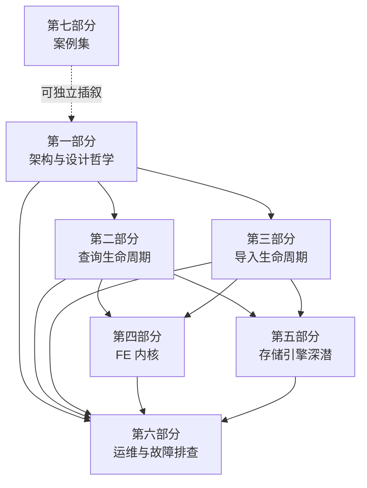

# Doris 内核透视：从请求路径到源码实现

这是一套面向 Doris 内核的源码级教程。全系列以"一条 SQL 的一生"为主线：一条查询、一次导入，从进入集群的第一行代码，到落盘、返回结果的最后一行代码，逐段拆开讲。模块知识（Nereids 优化器、Pipeline 执行引擎、存储格式、元数据体系……）不单独铺开，而是沿着请求经过的路径依次展开，讲到哪里、学到哪里。

这套教程不是：

- 不是用户手册或 SQL 参考——不解释 `SELECT` 怎么写、建表语法有哪些选项；
- 不是架构宣传材料——不做"为什么 Doris 比 X 好"的横向对比；
- 不是面面俱到的 API 文档——不承诺覆盖每一个函数、每一个配置项。

它假设读者已经具备大数据领域的工程背景：部署过 Doris、写过 SQL、遇到过慢查询或导入失败，但还没有打开过源码。教程的目标是把这层"黑盒"打开，让读者具备内核级的判断力。具体来说，读完全系列后，你应当能够：

1. 独立画出任意重要请求（查询、导入、DDL、副本修复等）的端到端执行路径；
2. 读懂并能修改 FE / BE / MetaService 的核心源码，理解每处设计"所以然"；
3. 面对线上疑难问题（慢查询、导入失败、副本异常、选主故障、Compaction 积压等）有系统的定位方法论；
4. 理解存算一体与存算分离两种架构在每个关键环节的实现差异。

每一章都遵循同一套骨架：**原理**（问题场景 → 候选方案权衡 → Doris 的取舍）、**源码走读**（详略有致，重点挖易错点）、**双模式对比**（存算一体 / 存算分离）、**动手实验**（验证核心点 + 主动踩坑）、**排查清单**（症状 → 定位路径 → 关键日志）。所有代码引用格式为 `路径:行号`，均基于本仓库当前 master 的真实代码核实过，不是凭记忆写的伪引用。

## 这套教程怎么读（阅读地图）

七个部分之间有明确的依赖关系，不是随意排列的目录。第一部分建立全局心智模型，是后面所有内容的地基；第二、三部分沿查询和导入两条主线铺开执行路径；第四、五部分把第二、三部分中一带而过的模块（FE 元数据、存储引擎）挖深；第六部分是前五部分知识的运维视角复用；第七部分是独立的案例集，可以随时插着读。



根据你的需求，选一种读法：

- **顺序精读**：按 part1 → part7 的顺序通读，适合系统性建立内核知识体系、准备成为团队内核 owner 的读者。每部分读完做一遍对应的动手实验，再进入下一部分。
- **按请求路径跳读**：只关心"一条查询/一次导入到底经过了哪些代码"，可以只读 part1（先建立组件与数据模型的基本概念）+ part2 或 part3，需要深挖某个环节时再跳到 part4/part5 对应章节。
- **按故障场景查阅**：手头有一个具体的线上问题（慢查询、导入卡住、副本异常……），直接从 part6 的排查清单入手，清单里会反向链接到 part1-part5 中解释该机制原理的章节。

## 全系列目录

| 部分 | 一句话主题 | 状态 |
|---|---|---|
| 第一部分：全局架构与设计哲学 | 建立 FE / BE / MetaService 的职责边界与存算一体、存算分离两种形态的全局心智模型 | 已完成 |
| 第二部分：一条查询 SQL 的一生 | 从 MySQL 协议接入到 Profile 精读，走完一次查询的完整执行路径 | 已完成 |
| 第三部分：一次导入的一生 | 从事务模型到 Compaction，走完一次写入的完整生命周期 | 规划中 |
| 第四部分：元数据与 FE 内核 | Catalog 体系、持久化、高可用与存算分离元数据服务的内部机制 | 规划中 |
| 第五部分：存储引擎深潜 | Rowset/Segment 文件格式、索引体系、读路径与主键模型内核 | 规划中 |
| 第六部分：集群运维与故障排查 | 从症状到根因的系统化故障定位方法论 | 规划中 |
| 第七部分：经典 feature/bug 案例集 | 从 git 历史精选真实案例做源码级复盘 | 规划中 |

### 第一部分：全局架构与设计哲学（已完成）

1. [Doris 是什么样的系统](part1-architecture/01-positioning.md)——MPP、列存、实时分析的定位与取舍
2. [三大件解剖](part1-architecture/02-three-components.md)——FE / BE / MetaService 的职责边界与进程结构
3. [数据模型](part1-architecture/03-data-model.md)——Table→Partition→Tablet→Rowset→Segment 层级与三种数据模型（Duplicate/Unique/Aggregate）
4. [两种架构形态](part1-architecture/04-two-architectures.md)——存算一体 vs 存算分离的本质差异
5. [源码地图与开发环境](part1-architecture/05-source-map-and-dev-env.md)——仓库结构导览、编译（ASAN）、调试器接入、三类测试框架

以下部分的章节规划摘自设计文档第 6 节，写作过程中如有增删会回到设计文档同步更新。

### 第二部分：一条查询 SQL 的一生（已完成）

1. [连接与协议](part2-query-lifecycle/01-connection-and-protocol.md)——MySQL 协议接入、ConnectContext、查询入口
2. [解析与合法化](part2-query-lifecycle/02-parse-and-analyze.md)——词法语法解析到 LogicalPlan
3. [Nereids 优化器（上）](part2-query-lifecycle/03-nereids-rbo.md)——RBO 规则重写体系
4. [Nereids 优化器（下）](part2-query-lifecycle/04-nereids-cbo.md)——CBO、统计信息与代价模型
5. [计划分发](part2-query-lifecycle/05-plan-distribution.md)——Fragment 切分、Coordinator 调度与两种模式下的副本选择
6. [BE Pipeline 执行引擎](part2-query-lifecycle/06-pipeline-engine.md)——算子、依赖驱动调度、并行度
7. [Scan 路径](part2-query-lifecycle/07-scan-path.md)——存算一体本地读 vs 存算分离 File Cache + 远端存储读
8. [Join / 聚合 / 排序算子与 Runtime Filter、Spill](part2-query-lifecycle/08-operators-rf-spill.md)
9. [结果回传与 Profile 精读](part2-query-lifecycle/09-result-and-profile.md)——从 Profile 反推执行瓶颈

### 第三部分：一次导入的一生（规划中）

1. 导入方式总览与事务模型：2PC、Label 机制、事务状态机
2. Stream Load 全路径：HTTP 接入→计划→Sink→MemTable→Flush
3. Tablet 写入细节：MemTable、Segment 生成、主键模型 Delete Bitmap
4. 事务提交与可见性：存算一体 Publish Version vs 存算分离 MetaService 提交
5. 其他导入方式：Broker/Routine/Insert Into 的路径差异
6. Compaction：为什么需要、调度策略、两种模式下的执行位置

### 第四部分：元数据与 FE 内核（规划中）

1. Catalog 体系与元数据内存结构
2. 元数据持久化：EditLog、bdbje、Checkpoint（存算一体）
3. FE 高可用：选主、角色（Master/Follower/Observer）、故障切换
4. 存算分离元数据：MetaService 架构、FoundationDB 数据布局、Recycler
5. 调度体系：Tablet 均衡、副本修复（存算一体）与集群/计算组管理（存算分离）
6. 外部数据源：Catalog 联邦查询架构概览

### 第五部分：存储引擎深潜（规划中）

1. Rowset 与 Segment 文件格式：编码、压缩、页结构
2. 索引体系：前缀索引、ZoneMap、BloomFilter、倒排索引
3. 读路径内核：谓词下推、延迟物化、聚合/去重读逻辑
4. 主键模型内核：MoW 的 Delete Bitmap 全生命周期
5. 数据管理：Delete、Schema Change、分区生命周期
6. 存算分离存储：File Cache 内核、对象存储交互、数据回收

### 第六部分：集群运维与故障排查（规划中）

1. 排查方法论与工具箱：日志体系、内省表、Profile、Metrics、debug point
2. 查询类故障：慢查询、OOM、超时的系统定位法
3. 导入类故障：失败、积压、事务卡住
4. 副本与均衡类故障（存算一体）／缓存与计算组故障（存算分离）
5. FE 故障：选主异常、元数据损坏恢复、image 回滚
6. 内存管理：BE 内存模型、MemTracker、常见内存问题定位

### 第七部分：经典 feature/bug 案例集（规划中）

从 git 历史挑选 8~12 个真实案例，每案例讲：问题背景→根因分析→修复思路→源码对照→经验教训。候选方向：优化器错误结果类、主键模型正确性类、内存/性能回退类、存算分离一致性类、并发竞争类。具体 PR 编号在写作阶段从 git log 落实。

## 环境准备（速览）

本教程的动手实验以本地源码编译、断点/日志调试为主，不依赖预编译的二进制包。这里只给最小命令集，让你能先跑起来；完整的仓库结构导览、编译选项说明、调试器接入方式、三类测试框架的使用细节见第一部分第 5 章 [源码地图与开发环境](part1-architecture/05-source-map-and-dev-env.md)。

```bash
git clone <repo-url> doris && cd doris
./build.sh --be --fe        # 同时编译 BE 与 FE
```

几点需要提前知道的：

- 默认构建类型是 `ASAN`（AddressSanitizer），除非明确需要做性能测试，不要切到 `RELEASE`——教程里的实验步骤都假定处于 ASAN 环境，能更早暴露内存问题。构建类型通过 custom_env.sh（本地创建、不入库）中的 `BUILD_TYPE` 变量设置。
- 三个必须记住的测试脚本：`run-be-ut.sh`（BE 单元测试）、`run-fe-ut.sh`（FE 单元测试）、`run-regression-test.sh`（回归测试，跑单个用例时用 `-d 父目录 -s 用例名` 缩小范围）。
- 构建、启动、测试的完整规范以仓库根目录的 `AGENTS.md` 为准，教程中所有实操命令都与其保持一致。

## 约定

**代码引用格式**：全系列中出现的 `路径:行号` 引用均基于 master 分支的源码基线 commit `7bc98f696f`。各章节在其开头会注明写作时具体核实所用的 HEAD（不同章节写于不同时间点，HEAD 会有细微差异，但都以该基线为准）。后续代码演进可能导致具体行号漂移，但路径和函数名的核实原则不变——写作时先在当前代码中确认存在，再落笔引用。

**术语约定**：

- **FE**：Frontend，`fe/` 目录，负责解析、优化、元数据与事务协调。
- **BE**：Backend，`be/` 目录，负责执行与存储。
- **MS（MetaService）**：MetaService，`cloud/` 目录，存算分离架构下的元数据与资源管理服务。
- **存算一体**（shared-nothing）：计算与存储部署在同一组 BE 节点上，数据本地落盘，副本由 FE 调度管理。
- **存算分离**（shared-storage / cloud mode）：计算节点无状态，数据存储在共享对象存储中，元数据与资源管理由 MetaService 承担，BE 通过 File Cache 加速热数据访问。

**图例约定**：全系列 mermaid 时序图中的参与者统一用组件级英文缩写命名（如 `Client`、`FE`、`BE`、`MS`、`Coordinator`、`Follower`、`Observer`），避免在参与者名中混用中英文或使用会触发 mermaid 解析歧义的特殊字符；参与者代表的具体协议、接口或子模块在正文或图内注释中用中文说明。跨章节引用同一角色时保持命名一致，便于在不同章节的时序图之间对照。
