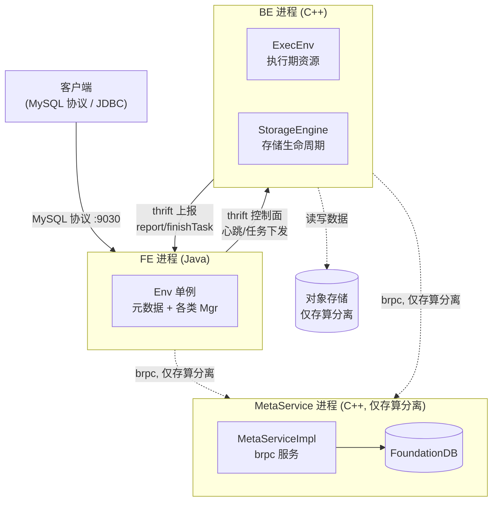
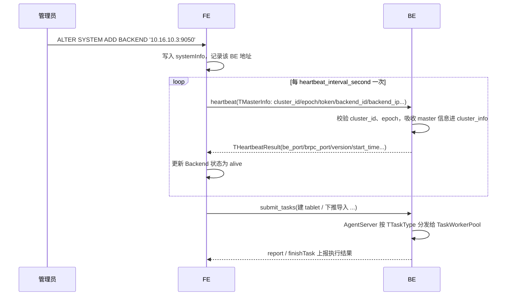

# 第 2 章：三大件解剖 —— FE、BE 与 MetaService

第 1 章把 Doris 的定位落到了 `fe/`、`be/`、`gensrc/` 三个顶层目录上，那还只是一张静态的"目录—职责"地图。本章要做的是把这张地图变成可运行、可调试的进程模型：FE、BE、MetaService（下称 MS）各自是一个什么样的进程，进程内部由哪几个核心对象撑起来，它们又通过什么契约互相说话。

读完本章，你应当能在脑子里为任意一次请求先定位到"这该由哪个进程负责"，并且知道到源码里的哪个对象去找它——这三个锚点（**FE 的钥匙是 `Env`、BE 的钥匙是 `ExecEnv` + `StorageEngine`、MS 的钥匙是 `MetaServiceImpl`**）会在后面第二、三部分反复被引用。

本章的行号引用基于写作时核实所用的 HEAD（`a96f995a8b`，源码树与系列基线 `7bc98f696f` 一致）。代码演进会让行号漂移，但对象名与结构不变；写作时每一处都在当前代码里核实过。

## 2.1 问题：一个分布式数据库的职责应该怎么切

一个分布式分析型数据库要干的事，粗粒度看是四类：**元数据管理**（库表结构、分区、副本分布、事务状态）、**查询规划**（解析、优化、生成分布式执行计划）、**查询执行**（真正扫数据、做 join 和聚合）、**数据存储**（把行列数据落盘、组织成可高效读的格式）。问题是：这四类职责，该塞进几个进程、怎么塞？

这不是一个可以拍脑袋的问题，因为进程边界一旦划定，就同时划定了三件事——**故障域**（一个进程挂了会带走哪些能力）、**扩展维度**（想加算力还是加容量，能不能分别加）、**部署与运维复杂度**（要维护几种角色、几套状态）。下面三种典型切法，是对同一问题的不同回答。

**候选一：全部塞进一个进程（单体）。** ClickHouse 早期的形态接近这一类——每个节点既存数据又做计算，元数据基本靠配置文件和本地状态，没有一个独立的、全局强一致的元数据中心。优点是部署极简，一个二进制拉起就能用，进程内调用没有序列化开销；缺点也直接：计算和存储被焊死在一起，想扩计算就必须连数据一起搬，分片和副本要靠人工配置维护，缺少一个统一的地方来协调分布式事务和 schema 变更的全局一致性。职责没被切开，代价就转嫁到运维和建模的心智负担上。

**候选二：计算存储同进程，但把元数据/协调单独拎出来。** 这正是 Doris 存算一体形态的选择：BE 节点既执行又存储（存算在 BE 内部仍是一体的），但把"元数据 + 查询规划 + 事务协调"这一层单独拆成 FE 进程。为什么这么切？因为这两层对语言和资源的诉求截然不同——元数据与优化器逻辑复杂、状态多、迭代频繁，天然适合 Java 这种开发效率高、生态成熟（尤其是成熟的高可用库 bdbje）的运行时；而执行与存储贴近硬件、对内存布局和延迟极度敏感，必须用 C++ 这种无 GC 停顿、能精细控内存的语言。**用语言边界去对齐职责边界**，是一个刻意取舍：好处是两层各自用最合适的技术栈演进、故障域也被切开（一个 BE 崩溃不影响 FE 的元数据，反之亦然），代价是 FE 与 BE 之间凭空多出一层跨进程、跨语言的 RPC 与序列化开销——这就是第 1 章讲的 `gensrc/` 契约层存在的根因。

**候选三：全部微服务化。** BigQuery、Snowflake 这类云原生数仓走到了另一个极端：计算是无状态的、可秒级弹起弹灭的工作节点，存储是共享对象存储，元数据是一个独立的、水平扩展的服务，之间全靠 RPC。优点是弹性到极致——计算和存储彻底解耦，各自独立伸缩，计算节点故障不丢任何状态；缺点是链路层级多、部署组件多，且强依赖一套高可用、大容量的元数据/事务服务作为地基。

Doris 的最终答案，是**在两种形态里都保留 FE/BE 的语言分工，只在元数据这一层随架构形态切换**：

- **存算一体**（shared-nothing）：候选二。FE 管元数据 + 规划 + 事务协调，BE 管执行 + 存储，元数据就住在 FE 的内存里、靠 bdbje 做多副本持久化。数据本地落盘，副本由 FE 调度。
- **存算分离**（cloud mode）：在候选二的基础上进一步向候选三靠拢——把元数据和资源管理从 FE 里剥出来，下沉成一个独立的 **MetaService** 进程，背后是 FoundationDB；BE 变成近乎无状态的计算 + 缓存节点，数据落在共享对象存储上。为什么要多这一刀？留到 2.4 节结合 FE 内存元数据的容量瓶颈细说。

无论哪种形态，"FE=Java 分析与协调层、BE=C++ 执行与存储层"这条主干都不变。下面就沿着进程启动的主线，把三个进程逐一剖开。



## 2.2 FE 进程解剖

### 启动主线：从 main 到三个端口

FE 的进程入口是 `fe/fe-core/src/main/java/org/apache/doris/DorisFE.java:103` 的 `main`。这个 `main` 本身很短，做完一次元数据版本自检后（`fe/fe-core/src/main/java/org/apache/doris/DorisFE.java:106`，防止版本回滚导致 image 不兼容），就把 `enableHttpServer`、`enableQeService` 两个开关打开，转身调用 `fe/fe-core/src/main/java/org/apache/doris/DorisFE.java:117` 的 `start`。真正的启动逻辑都在 `start`（`fe/fe-core/src/main/java/org/apache/doris/DorisFE.java:128`）里，它是一条相当长但脉络清晰的直线，这里只做概括——因为启动流程属于"显而易见"的部分，逐行讲没有价值，理解它做了哪几件大事即可：

1. **加载配置**（`fe/fe-core/src/main/java/org/apache/doris/DorisFE.java:143`-`147`）：先读 `conf/fe.conf`，再读 `fe_custom.conf` 覆盖。注意顺序——custom 必须后加载才能覆盖，且 custom 的路径本身写在 fe.conf 里，所以不能颠倒。
2. **初始化并等待元数据就绪**（`fe/fe-core/src/main/java/org/apache/doris/DorisFE.java:244`-`245`）：`Env.getCurrentEnv().initialize(args)` 建起整个元数据体系，随后 `waitForReady()` 阻塞到本节点能提供服务为止。这一行是 FE 的重心，下面单独展开。
3. **拉起三类服务端口**：这是理解 FE 对外形态的关键。FE 不是只监听一个端口，而是三个各司其职——
   - **thrift RPC server**（`fe/fe-core/src/main/java/org/apache/doris/DorisFE.java:255`-`256`，默认 `rpc_port` 9020）：FE 与 BE、FE 与 FE 之间的控制面 RPC 走这里，2.5 节讲的 `FrontendService` 就挂在这个端口上；
   - **HTTP server**（`fe/fe-core/src/main/java/org/apache/doris/DorisFE.java:258`-`275`，默认 `http_port` 8030）：Web UI、REST API、Stream Load 的接入；
   - **QeService**（`fe/fe-core/src/main/java/org/apache/doris/DorisFE.java:281`-`285`，默认 `query_port` 9030）：MySQL 协议服务，客户端敲 `mysql -P9030` 连的就是它。

一个 FE 进程同时是"MySQL 服务器 + 内部 RPC 节点 + HTTP 管理面"三重身份，记住这三个端口，后面排查"连不上""BE 加不进来"时才知道该看哪个口。

### Env：理解 FE 的钥匙

如果只能记住 FE 源码里的一个类，那就是 `Env`（`fe/fe-core/src/main/java/org/apache/doris/catalog/Env.java:362`）。它是 FE 的全局单例，几乎所有元数据和后台服务都挂在它身上——你可以把它理解为"FE 这个进程的一切状态的根"。第 2/3/4 部分里凡是提到"FE 侧的某个 Manager"，追到底几乎都是 `Env` 的一个成员。

单例通过经典的 holder 模式实现（`fe/fe-core/src/main/java/org/apache/doris/catalog/Env.java:735`-`737`），实例由 `EnvFactory` 创建——这里有个存算一体/分离的分叉：工厂会根据模式返回 `Env` 或其云上子类，这是双模式在 FE 侧的第一处代码体现。

`Env` 的成员声明区（`fe/fe-core/src/main/java/org/apache/doris/catalog/Env.java:389` 起）密密麻麻几十个字段，不必全记，但要认得其中最关键的十来个，它们构成了 FE 的骨架：

- `catalogMgr`（`fe/fe-core/src/main/java/org/apache/doris/catalog/Env.java:389`）：库表元数据的总入口，`internalCatalog` 下挂着所有 Database → Table 的树，外部数据源（Hive/JDBC catalog）也在这一层联邦进来。
- `editLog`（`fe/fe-core/src/main/java/org/apache/doris/catalog/Env.java:450`）：元数据的 WAL。FE 里任何一次元数据变更（建表、加分区、导入事务状态推进）都要先写一条 EditLog，再改内存——这是 FE 高可用的地基，第四部分会专章拆。
- `globalTransactionMgr`（`fe/fe-core/src/main/java/org/apache/doris/catalog/Env.java:491`）：导入事务的协调者，2PC、Label 去重、事务状态机都在它手里。第三部分导入主线的起点就是它。
- `systemInfo`（`fe/fe-core/src/main/java/org/apache/doris/catalog/Env.java:471`）：集群节点表，记录每个 BE 的地址、存活状态、磁盘容量。`SHOW BACKENDS` 读的就是它。
- `heartbeatMgr`（`fe/fe-core/src/main/java/org/apache/doris/catalog/Env.java:472`）：心跳管理器，2.3 节的主角，负责周期性地把 master 信息推给每个 BE 并收回它们的状态。
- `tabletInvertedIndex`（`fe/fe-core/src/main/java/org/apache/doris/catalog/Env.java:477`）：Tablet → BE 的倒排索引，回答"某个 tablet 的副本在哪些 BE 上"，副本调度和查询分发都要查它。
- `tabletScheduler`（`fe/fe-core/src/main/java/org/apache/doris/catalog/Env.java:506`）：副本调度器，负责均衡和坏副本修复（仅存算一体——存算分离下数据在对象存储里，无需副本调度）。
- `loadManager` / `routineLoadManager`（`fe/fe-core/src/main/java/org/apache/doris/catalog/Env.java:391` / `395`）：各类导入作业的生命周期管理。
- `auth`（`fe/fe-core/src/main/java/org/apache/doris/catalog/Env.java:497`）：权限元数据。

把这些成员连起来看，FE 的职责就具象了：**它是集群的元数据中心（catalogMgr/editLog）+ 事务协调者（globalTransactionMgr）+ 节点与副本的大脑（systemInfo/tabletInvertedIndex/tabletScheduler/heartbeatMgr）**。这些正好覆盖 2.1 里"元数据管理 + 查询规划 + 事务协调"三块职责。

### tricky 点一：初始化顺序不能颠倒

`Env` 的初始化被刻意拆成两段，这是一个容易看走眼但很重要的设计。**构造函数**（`fe/fe-core/src/main/java/org/apache/doris/catalog/Env.java:744`）里 new 出一大批 Manager（`catalogMgr`、`routineLoadManager` 等纯内存对象），此时还没碰任何磁盘或网络；真正有副作用的初始化在 **`initialize` 方法**（`fe/fe-core/src/main/java/org/apache/doris/catalog/Env.java:1181`）里，顺序是严格的：

1. 先定位本机与 helper 节点、检查并创建 meta 目录（`fe/fe-core/src/main/java/org/apache/doris/catalog/Env.java:1190`-`1215`）；
2. 再决定自己的**角色**（`getClusterIdAndRole`，`fe/fe-core/src/main/java/org/apache/doris/catalog/Env.java:1230`-`1233`）——是 Follower 还是 Observer；
3. **然后**才 new 出 `editLog` 并 `loadImage` + `open`（`fe/fe-core/src/main/java/org/apache/doris/catalog/Env.java:1242`-`1245`）：必须先知道自己的角色、拿到 clusterId，才能正确打开 bdbje 环境；
4. 最后启动状态监听线程（`startStateListener`，`fe/fe-core/src/main/java/org/apache/doris/catalog/Env.java:1259`-`1260`），进入角色状态机。

为什么顺序如此讲究？因为 `editLog.open()` 打开的 bdbje 是一个多副本的复制状态机，一个节点以什么角色（可选举的 Follower 还是只读的 Observer）加入这个复制组，决定了它能否参与选主、能否写。如果在拿到角色之前就去开 editLog，节点就不知道该用什么身份加入 bdbje 组。**错写的后果**是元数据复制组身份错乱——轻则该节点无法正确同步日志，重则破坏整个复制组的一致性。所以这段初始化的每一步都严格依赖前一步的产物，不能重排。

### tricky 点二：角色如何决定"能不能写"

FE 日常运行的三种角色是 `MASTER`、`FOLLOWER`、`OBSERVER`（完整枚举见 `fe/fe-core/src/main/java/org/apache/doris/ha/FrontendNodeType.java:21`-`26`，其中还含 `REPLICA` 以及 `INIT`/`UNKNOWN` 这两个过渡态）。一个高频困惑是："我连上了一个 FE，为什么建表报错说不是 master？"答案就在角色与可写性的绑定关系里。

判断是否 master 的代码极简：`Env.isMaster()`（`fe/fe-core/src/main/java/org/apache/doris/catalog/Env.java:5521`-`5523`）就一句——`feType == FrontendNodeType.MASTER`。**只有 MASTER 能写元数据**（它独占 editLog 的写权），Follower 和 Observer 都是只读的：Follower 参与选主、可被选为下一任 master，Observer 连选举都不参与，纯粹分摊读流量。

"能不能读"则由另外两个原子标志控制：`canRead` 和 `isReady`。它们在状态监听线程的 `setCanRead`（`fe/fe-core/src/main/java/org/apache/doris/catalog/Env.java:3178`-`3222`）里被更新——核心逻辑是：如果本节点回放的元数据落后 master 超过 `meta_delay_toleration_second`（`fe/fe-core/src/main/java/org/apache/doris/catalog/Env.java:3193`），就把 `canRead`/`isReady` 置为 false，宁可拒绝服务也不返回陈旧元数据。这解释了两个现象：非 master 节点默认也能读（`canRead` 为真），但一旦它与 master 失联、元数据过期，就会主动"下线"读服务。理解了这套 `MASTER 独占写 / canRead 门控读` 的机制，"非 master 不能建表""某个 FE 突然查不了"这类问题就有了源码级的落点。

## 2.3 BE 进程解剖

### 启动主线：从 main 到心跳服务

BE 的进程入口是 `be/src/service/doris_main.cpp:317` 的 `main`。和 FE 一样，启动流程属于"概括即可"的部分，它做完信号处理、pid 文件、配置加载、存储路径校验（`be/src/service/doris_main.cpp:417`-`483`，会逐个检查 `storage_root_path` 里的盘是否可读写，坏盘直接退出）这些前置工作后，进入真正的核心——**初始化 ExecEnv 并拉起五类服务**：

1. **ExecEnv 初始化**（`be/src/service/doris_main.cpp:597`-`598`）：`ExecEnv::init(...)` 一次性建起 BE 的执行期资源，**StorageEngine 的创建与打开也发生在这一步内部**（下面细说）；
2. **thrift server**（`be/src/service/doris_main.cpp:629`-`631`，默认 `be_port` 9060）：承载 `BackendService`，FE 下发的 agent task、导入事务的 RPC 都走这里；这里有个双模式分叉——`be/src/service/doris_main.cpp:620`-`626` 会根据 `is_cloud_mode()` 决定 new 出 `CloudBackendService` 还是本地 `BackendService`；
3. **brpc server**（`be/src/service/doris_main.cpp:636`-`638`，默认 `brpc_port` 8060）：BE 之间的数据面 RPC（Fragment 数据交换、pipeline 传输）走 brpc，这是查询执行的高吞吐通道；
4. **HTTP server**（`be/src/service/doris_main.cpp:643`-`646`，默认 `webserver_port` 8040）：metrics、profile、部分导入接入；
5. **心跳 server**（`be/src/service/doris_main.cpp:650`-`657`，默认 `heartbeat_service_port` 9050）：接收 FE 心跳，是 BE 认识集群的唯一入口，2.3 后半段的主角。

同样，记住这四个对外端口（9060/8060/8040/9050），加上 FE 的三个，一套单机集群的全部监听口就齐了（多 FE / 主从选举场景还有 bdbje 的 edit_log_port 9010，见第 5 章 5.4）。

### ExecEnv 与 StorageEngine：执行期资源 vs 存储生命周期

BE 有两把钥匙，它俩的职责边界是理解 BE 的关键。

**`ExecEnv`**（`be/src/runtime/exec_env.h:150`）是 BE 的执行期资源总线，类比于 FE 的 `Env`——同样是进程级单例（`be/src/runtime/exec_env.h:169`-`172`）。但它管的东西性质不同，全是"一次查询/导入执行时需要用到的运行时资源"：

- `fragment_mgr`（`be/src/runtime/exec_env.h:272`）：管理本机正在执行的所有 Fragment（查询计划的执行单元），第二部分执行主线的落点；
- `cluster_info`（`be/src/runtime/exec_env.h:274`）：本机所知的集群信息——master 地址、cluster id、backend id、token，**这些全部来自 FE 心跳**，BE 自己不产生；
- `load_channel_mgr` / `load_stream_mgr`（`be/src/runtime/exec_env.h:287`-`289`）：导入数据流的接收通道；
- 各类线程池、客户端连接缓存、MemTracker 内存跟踪器（`be/src/runtime/exec_env.h:218` 起一大片）：执行期的资源池子；
- `_storage_engine`（`be/src/runtime/exec_env.h:549`）：指向存储引擎的指针——注意，存储引擎是被 ExecEnv 持有的，但职责完全分开。

**`StorageEngine`**（`be/src/storage/storage_engine.h`）管的是另一件事：**数据的存储生命周期**。它有一个抽象基类 `BaseStorageEngine`（`be/src/storage/storage_engine.h:93`），下面分叉出两个实现——本地的 `StorageEngine`（`be/src/storage/storage_engine.h:247`）和云上的 `CloudStorageEngine`，通过 `to_local()` / `to_cloud()`（`be/src/storage/storage_engine.h:105`-`106`）在需要时向下转型。这又是一处双模式在 BE 侧的核心分叉。存储引擎的两个关键下属是 `tablet_manager`（`be/src/storage/storage_engine.h:317`，管本机所有 tablet 的元信息与生命周期）和 `txn_manager`（`be/src/storage/storage_engine.h:318`，管本机侧的导入事务与 rowset 提交）。

两把钥匙的边界一句话概括：**ExecEnv 管"算一次查询要用的临时资源"，StorageEngine 管"数据在盘上的长期生命周期"**。前者随查询来去，后者随进程长存。

它俩的装配关系在 `be/src/runtime/exec_env_init.cpp` 里能看清：`be/src/runtime/exec_env_init.cpp:404`-`409` 根据模式 new 出 `CloudStorageEngine` 或 `StorageEngine`，紧接着调 `open()`（`be/src/runtime/exec_env_init.cpp:409`）加载所有 tablet 元数据，再 `start_bg_threads()`（`be/src/runtime/exec_env_init.cpp:415`）拉起 compaction 等后台线程。存储引擎必须 open 成功，BE 才算真正"带着数据上线"。

### tricky 点：BE 没有自主元数据，一切听 FE 调度

这是理解 Doris 架构最重要的一个心智模型：**BE 是"手脚"，FE 是"大脑"；BE 本身不知道自己属于哪个集群、master 是谁、自己的 backend id 是几——这些全靠 FE 通过心跳"喂"进来。** 这个设计不是随意的，它保证了元数据的单一权威源（FE），避免了 BE 各自维护一份可能不一致的集群视图。下面从心跳和 agent task 两个机制看它是怎么落地的。

**心跳：master 信息的单向下发。** BE 侧的心跳处理在 `be/src/agent/heartbeat_server.cpp:66` 的 `heartbeat`——它是一个被动的 thrift 服务，等着 FE 来调。真正的逻辑在 `_heartbeat`（`be/src/agent/heartbeat_server.cpp:110`），它把 FE 传来的 `TMasterInfo` 逐字段"吸收"进本机的 `cluster_info`：

- **cluster id 校验**（`be/src/agent/heartbeat_server.cpp:114`-`133`）：第一次心跳时，BE 把 FE 给的 cluster id 记下来并持久化；之后每次都比对，一旦不匹配就拒绝整个心跳。这是防止一个 BE 被误加进错误集群的安全闸——**错配的后果**是这台 BE 永远无法上线，日志里刷 `invalid cluster id`。
- **master 地址与 epoch**（`be/src/agent/heartbeat_server.cpp:190`-`215`）：BE 只接受 epoch 更大的 master 信息。epoch 是 FE 选主的逻辑时钟，这个"只认更新的 epoch"规则防止了脑裂时旧 master 的信息覆盖新 master——这是分布式系统里防止过期 leader 捣乱的经典手法。
- **token、backend_id、frontend_infos、heartbeat_flags**（`be/src/agent/heartbeat_server.cpp:217`-`247`）：认证令牌、FE 分配给这台 BE 的全局 id、集群里所有 FE 的列表、以及一组运行时开关，统统由 FE 下发。BE 的身份（backend_id）都不是自己定的。
- **meta_service_endpoint**（`be/src/agent/heartbeat_server.cpp:249`-`294`，仅存算分离）：存算分离下，BE 连哪个 MetaService 也是 FE 通过心跳告诉它的。这段还带一致性校验：如果 FE 和 BE 对"是否云模式"或"MS 地址"的认知不一致，会告警甚至拒绝，防止两边跑在不同模式下。

心跳成功时，BE 回给 FE 一个 `THeartbeatResult`，带上自己的各端口、版本、启动时间、内存等（`be/src/agent/heartbeat_server.cpp:82`-`98`）——这是 BE 唯一"主动汇报"的信息。

**agent task：FE 下命令，BE 执行。** 除了心跳，FE 还通过 `BackendService.submit_tasks`（`gensrc/thrift/BackendService.thrift:411`-`412`）向 BE 下发各类任务——建 tablet、下推导入、克隆副本、做 alter 等。BE 侧接住它的是 `AgentServer`（`be/src/agent/agent_server.h:44`），`submit_tasks`（`be/src/agent/agent_server.h:54`）按任务类型把请求分发给不同的 `TaskWorkerPool`（`be/src/agent/agent_server.h:69` 的 `_workers` map 以 `TTaskType` 为键）。**BE 从不自主发起这些动作，它只是执行 FE 派下来的任务。** 这就是"FE 是大脑、BE 是手脚"在代码里的两条实现路径：心跳负责持续同步集群状态，agent task 负责下发具体指令。

下面这张时序图把一次 BE 加入集群 + 心跳往返画出来：



## 2.4 MetaService 进程解剖（存算分离）

前两节讲的是两种形态都有的 FE/BE。MetaService 只在**存算分离**形态下存在，它是 Doris 把"候选二"往"候选三"推进一步的产物。先说清楚它为什么存在。

### 动机：FE 内存元数据的容量与弹性瓶颈

存算一体下，"FE 就是元数据服务"——所有库表、分区、tablet、副本、事务状态全都常驻在 FE 的 JVM 堆内存里，靠 bdbje 在几个 FE 之间做多副本复制。这套设计在中小规模下简洁高效，但有两个天花板：

1. **容量瓶颈**：元数据全在内存，tablet 数量一多（比如百万级 tablet），FE 的堆内存和 image/checkpoint 就成了瓶颈，GC 压力也随之上升。
2. **弹性瓶颈**：bdbje 是一个固定成员的复制组，扩缩 FE 要动这个组的成员，不是无状态的水平扩展；而且元数据与计算耦合在 FE 进程里，无法独立伸缩。

存算分离的解法是把元数据**外移**：从 FE 的 JVM 内存搬到一个独立进程 MetaService，再落到 **FoundationDB**（一个支持事务的分布式 KV，天然可水平扩展、容量不受单进程内存限制）。这样 FE 变轻（不再是元数据的最终持有者，更多是缓存 + 规划角色），MetaService 承接元数据的强一致存储与事务，BE 则变成近乎无状态的计算 + File Cache 节点。三者都能更独立地伸缩。

### 启动主线与服务结构

MS 的进程入口是 `cloud/src/main.cpp:170` 的 `main`。它其实是一个可以身兼两职的进程——由命令行参数决定跑成 `meta_service`、`recycler`，还是两者都跑（默认两者都跑，见 `cloud/src/main.cpp:191`-`193` 与 `240`-`246`）。启动主线概括为三步：

1. **建 TxnKv**（`cloud/src/main.cpp:255`-`263`）：生产环境用 `FdbTxnKv`（对接 FoundationDB），测试用 `MemTxnKv`（纯内存）。这里有个**危险开关**：`use_mem_kv` 打开会用易失的内存 KV，代码里专门 `std::cerr` 警告"绝不能用于生产"（`cloud/src/main.cpp:257`-`259`）——错用的后果是进程一重启元数据全丢。
2. **启动 MetaServer**（`cloud/src/main.cpp:292`-`304`）：把元数据服务注册到 brpc server；
3. **启动 Recycler**（`cloud/src/main.cpp:305`-`327`）：垃圾回收器。

**brpc 服务结构。** `MetaServer::start`（`cloud/src/meta-service/meta_server.cpp:51`）里，真正干活的对象是 `MetaServiceImpl`（`cloud/src/meta-service/meta_server.cpp:85`），它被包进一层 `MetaServiceProxy`（`cloud/src/meta-service/meta_server.cpp:87`）后 `AddService` 挂到 brpc server 上（`cloud/src/meta-service/meta_server.cpp:96`）。这两个类值得记住：

- **`MetaServiceImpl`**（`cloud/src/meta-service/meta_service.h:83`）是元数据服务的核心实现，继承自 proto 生成的 `cloud::MetaService`，把 `begin_txn`、`commit_txn`、`get_version`、`create_tablets`、`prepare_rowset`/`commit_rowset` 等一大批 RPC 全部落地——这是 MS 版的"元数据 + 事务中心"。
- **`MetaServiceProxy`**（`cloud/src/meta-service/meta_service.h:528`）是一层包装，统一处理限流、重试等横切逻辑后再转调 `MetaServiceImpl`。之所以套这层代理，是为了把"每个 RPC 都要做的通用处理"和"具体业务逻辑"解耦——否则每个 RPC 实现里都要重复写一遍限流重试。

### meta-store 对 FoundationDB 的封装层次

MS 不直接裸调 FoundationDB 的 C API，而是在 `cloud/src/meta-store/` 里搭了一层抽象。最上层是接口 `TxnKv`（`cloud/src/meta-store/txn_kv.h:116`），它定义了"开事务、读、写、提交"这组语义；`FdbTxnKv`（`cloud/src/meta-store/txn_kv.h:521`）是它对接 FoundationDB 的实现，`MemTxnKv` 是内存实现。`MetaServiceImpl` 只依赖 `TxnKv` 接口，不关心底下是 FDB 还是内存——这层抽象让元数据逻辑与具体 KV 存储解耦，也让单元测试能用内存 KV 快速跑。keys.cpp/codec.cpp 这些文件则负责把库表 tablet 等元数据对象编码成 FDB 的 key/value 布局。

### recycler 的角色

存算分离下，数据在对象存储、元数据在 FDB，二者是分开的。当一张表被删、一个 rowset 被 compaction 淘汰，元数据可以立刻标记删除，但对象存储上的实际数据文件不能同步删（还可能有正在读的查询）。**`Recycler`**（`cloud/src/recycler/recycler.h:80`）就是那个异步的"清道夫"：它扫描元数据里标记为待回收的对象，在安全时机去对象存储上真正删掉数据文件，回收空间。这是存算一体所没有的角色——存算一体下数据文件的删除由 BE 本地的 StorageEngine 直接管，而存算分离把"逻辑删除"和"物理回收"拆成了两步，物理回收这步就交给了独立的 Recycler。

## 2.5 三者如何对话：RPC 契约

三个进程、两种语言，它们之间的每一次通信都得靠一套跨语言的接口定义。这些定义集中在 `gensrc/`，按用途分成 thrift 和 proto 两套，分工清晰。

**`gensrc/thrift/`——FE↔BE 的控制面。** 凡是"下命令、报状态、协调事务"这类控制流，走 thrift。三个代表性文件：

- **`gensrc/thrift/FrontendService.thrift`**（服务定义在 `:1942`）：BE 和其他 FE 调 FE 用的接口。里面既有 BE 上报用的 `finishTask` / `report`（BE 执行完 agent task 后回报结果），也有导入事务的 `loadTxnBegin` / `loadTxnCommit` / `beginTxn` / `commitTxn`、Stream Load 的 `streamLoadPut`、以及 FE 之间选主协调用的 `ping`。第三部分导入主线会反复回到这个文件。
- **`gensrc/thrift/BackendService.thrift`**（服务定义在 `:411`）：FE 调 BE 用的接口。核心就是 `submit_tasks`（`:412`）——2.3 讲的 agent task 下发的契约入口。
- **`gensrc/thrift/HeartbeatService.thrift`**（服务定义在 `:76`-`77`）：心跳的契约。`heartbeat(TMasterInfo)` 这一个方法，加上 `TMasterInfo`（`:37`-`53`）和 `THeartbeatResult` 两个结构，就是 2.3 里那套 master 信息下发的全部定义。

**`gensrc/proto/`——数据面 + MS 接口。** 高吞吐的数据传输和存算分离的元数据服务走 protobuf + brpc：

- `gensrc/proto/internal_service.proto`：BE 之间数据面 RPC（Fragment 数据交换等）。
- `gensrc/proto/cloud.proto`：MetaService 的接口定义。`service MetaService`（`gensrc/proto/cloud.proto:2289`）下挂着 `begin_txn`（`:2290`）、`commit_txn`（`:2292`）、`get_version`（`:2305`）、`create_tablets`（`:2306`）、`prepare_rowset`/`commit_rowset`（`:2314`-`2315`）等——正是 2.4 里 `MetaServiceImpl` 落地的那批 RPC 的契约源头。
- `gensrc/proto/olap_file.proto`：存储层元数据（第 1 章提过的 `KeysType` 三种数据模型枚举就在这里）。

为什么控制面用 thrift、数据面用 proto？大体是历史与生态的分工：FE 是 Java，thrift 对 Java 生态友好且够用；而数据面追求吞吐、MS 是新写的云上组件，选了性能更好、与 brpc 配套的 protobuf。理解这条分界，看到一个接口在 thrift 还是 proto 里，就能大致判断它是控制流还是数据流。

### 易错点：thrift/proto 的兼容性纪律——字段只加不改号

跨进程契约有一条铁律：**字段编号只能新增，绝不能修改或复用已有编号，删除字段也只能弃用编号而不能让新字段顶替它。** 打开 `gensrc/thrift/HeartbeatService.thrift:37` 的 `TMasterInfo` 就是活教材——字段从 `1: network_address` 一路编到 `14: cloud_cluster_info`，每加一个能力就往后追一个新号，从不改动前面的号。第 5 个字段 `backend_ip` 甚至带着一行注释说明"它其实该叫 backend_host，但为了兼容历史版本，名字必须保持 backend_ip 不变"（`gensrc/thrift/HeartbeatService.thrift:42`）；`TBackendInfo` 里给云相关字段特意用了 `1000`/`1001` 这样的大号，也是为了不和历史小号冲突。

为什么这条纪律不能破？因为 FE 和 BE 是**独立编译、独立升级**的两个进程，滚动升级时集群里必然短暂共存新旧版本。thrift/proto 的序列化是**按字段编号**匹配的，不是按字段名。假设你把某个字段的编号从 7 改成 8：新版 FE 发出的数据里这个值挂在编号 8 上，旧版 BE 还按编号 7 去读，就读到了空值或错位的数据——**错写的后果是升级过程中出现静默的数据错乱**，而且往往不报错、极难排查。所以字段只加不改号，是保证前后向兼容、支撑滚动升级的硬约束。改契约时，永远是"加新字段 + 老字段标记 deprecated"，而不是原地修改。

## 2.6 动手实验

本节分两步：先在单机上把 FE + BE 拉起来、观察一次正常的心跳往返（验证 2.3 的核心机制），再故意把网段配错、亲眼看看心跳是怎么失败的（踩一遍真实部署中最高频的坑）。你不需要真的照抄跑通，但照着做能把前面的源码变成看得见的日志。

所有构建/启动命令均遵循仓库根 `AGENTS.md` 的规范。

### 实验一：拉起集群，观察心跳

**1. 编译。** 默认 ASAN 构建，同时编 BE 和 FE：

```bash
./build.sh --be --fe
```

产物在当前目录的 `output/` 下（`output/fe/`、`output/be/`）。

**2. 配置 priority_networks。** 这是最关键的一步：在 `output/fe/conf/fe.conf` 和 `output/be/conf/be.conf` 里都要把 `priority_networks` 设成一个能匹配本机网卡的网段，例如：

```
priority_networks = 10.16.10.3/24
```

它决定进程绑定并对外宣告哪个 IP。FE 和 BE 用它确定"我是谁、别人怎么找到我"。

**3. 启动。** 用 `--daemon` 后台启动，集群启动较慢，至少等 30 秒：

```bash
output/fe/bin/start_fe.sh --daemon
output/be/bin/start_be.sh --daemon
```

**4. 把 BE 加进集群。** 用 MySQL 客户端连 FE 的 query_port（9030），执行 ADD BACKEND（地址是 BE 的 heartbeat_service_port，9050）：

```sql
mysql -h 127.0.0.1 -P 9030 -uroot
ALTER SYSTEM ADD BACKEND '10.16.10.3:9050';
```

这一步只是往 FE 的 `systemInfo`（2.2 讲过）里登记了一条 BE 地址，此刻心跳还没成功。

**5. 观察心跳。** 反复执行：

```sql
SHOW BACKENDS;
SHOW FRONTENDS;
```

盯住 `SHOW BACKENDS` 的 `Alive` 列，从 `false` 变成 `true` 就是心跳打通了。对应地去日志里找证据——

- FE 侧 `output/fe/log/fe.log`：`HeartbeatMgr`（`fe/fe-core/src/main/java/org/apache/doris/system/HeartbeatMgr.java:75`）每 `heartbeat_interval_second`（`fe/fe-core/src/main/java/org/apache/doris/system/HeartbeatMgr.java:86`）发一轮心跳；
- BE 侧 `output/be/log/be.INFO`：会看到 `get heartbeat from FE`（对应 `be/src/agent/heartbeat_server.cpp:69` 的 `LOG_EVERY_N`，每 12 次打一条），以及首次心跳时的 `get first heartbeat. update cluster id`（`be/src/agent/heartbeat_server.cpp:115`）——这正是 2.3 讲的"BE 第一次从心跳里认领 cluster id"的现场。

看到这条 `update cluster id` 日志，你就亲眼见证了"BE 的集群身份是 FE 喂进来的"这个论断。

### 实验二：把 priority_networks 配错，看心跳失败

`priority_networks` 配错网段是真实部署里最高频的坑，值得主动踩一遍，记住它失败时的日志形态。

**复现：** 把 `output/be/conf/be.conf` 里的 `priority_networks` 改成一个**不匹配本机任何网卡**的网段，比如：

```
priority_networks = 192.168.99.0/24
```

重启 BE，然后在 FE 上重新 `ALTER SYSTEM ADD BACKEND` 这台 BE（注意 ADD BACKEND 里写的地址要与 BE 实际宣告的对不上，矛盾就在这里制造出来）。

**现象与定位：** `SHOW BACKENDS` 的 `Alive` 长期为 `false`，且 `SHOW BACKENDS` 的 `Status`/错误信息里能看到心跳异常。根因在 2.3 提到的那段代码：FE 发心跳时会把它登记的 BE 地址塞进 `TMasterInfo.backend_ip`（`fe/fe-core/src/main/java/org/apache/doris/system/HeartbeatMgr.java:296` 处 `copiedMasterInfo.setBackendIp(...)`），BE 收到后在 `be/src/agent/heartbeat_server.cpp:135`-`187` 里拿这个地址和自己 `priority_networks` 算出的本机 IP 比对——对不上就会在 `be.INFO` 里打出 `not equal to to backend localhost`（注：两个 to 连写是源码原文的笔误，照抄源码才能精确搜到），甚至返回错误导致心跳失败。

这个实验的价值在于：一旦线上遇到"BE 死活加不进来、Alive 一直 false"，你的第一反应就该是去 `be.INFO` 搜 `localhost` 相关日志、核对两边的 `priority_networks` 与 ADD BACKEND 地址是否指向同一个 IP——而不是漫无目的地重启。

## 2.7 排查清单

把本章机制反过来用，就是几条"症状 → 定位路径"的排查线索。每条都指明先看哪个日志、对应哪段源码机制。

**症状 A：BE 加不进集群（`SHOW BACKENDS` 的 Alive 一直 false）。**
- 先看 `output/be/log/be.INFO`：
  - 搜到 `invalid cluster id`（`be/src/agent/heartbeat_server.cpp:125`-`131`）→ 这台 BE 之前属于别的集群，data 目录里残留了旧 cluster id，清理数据目录或换新盘重加。
  - 搜到 `not equal to to backend localhost` / `cannot found the local ip`（`be/src/agent/heartbeat_server.cpp:135`-`187`）→ `priority_networks` 配错网段，或 ADD BACKEND 写的地址与 BE 实际 IP 不一致（即实验二的坑）。
- 再确认 BE 的 `heartbeat_service_port`（9050）没被防火墙挡、没和别的进程抢端口——FE 连不上这个口，心跳根本发不出去。

**症状 B：BE 曾经正常，突然心跳丢失（Alive 从 true 变 false）。**
- 看 `output/fe/log/fe.log` 里 `HeartbeatMgr` 相关告警：`get bad heartbeat response`（`fe/fe-core/src/main/java/org/apache/doris/system/HeartbeatMgr.java:165`）说明 FE 收到了坏响应。
- 若 BE 进程还活着，重点查两类：BE 是否 OOM / 卡住（ASAN 构建下可能触发内存问题，看 `be.out`）；网络是否抖动。心跳 RPC 超时是 5 秒（`fe/fe-core/src/main/java/org/apache/doris/system/HeartbeatMgr.java:162`），持续超时就会被判定失联。
- 注意副作用：BE 失联超过 `abort_txn_after_lost_heartbeat_time_second`，FE 会主动 abort 以它为协调者的事务（`fe/fe-core/src/main/java/org/apache/doris/system/HeartbeatMgr.java:217`-`221`）——所以"心跳丢失"往往伴随"导入事务被中止"，两个现象是同源的。

**症状 C：FE 启动卡住 / 起不来。**
- 看 `output/fe/log/fe.log` 与 `fe.out`：
  - 卡在元数据版本检查（`fe/fe-core/src/main/java/org/apache/doris/DorisFE.java:106`）→ 报 `fe meta version should be ...`，通常是跨大版本回滚导致 image 不兼容。
  - 卡在 `waitForReady`（`fe/fe-core/src/main/java/org/apache/doris/DorisFE.java:245`）迟迟不返回 → 结合 2.2 的 `canRead`/`isReady` 机制看：多半是非 master 节点回放元数据落后 master 超过 `meta_delay_toleration_second`（`fe/fe-core/src/main/java/org/apache/doris/catalog/Env.java:3193`），或与 master 失联导致迟迟不 ready，日志里会有 `meta out of date`（`fe/fe-core/src/main/java/org/apache/doris/catalog/Env.java:3197`）或 `Not ready reason`（`fe/fe-core/src/main/java/org/apache/doris/catalog/Env.java:3215`）。
  - 端口占用 → `start` 早期的 `checkAllPorts`（`fe/fe-core/src/main/java/org/apache/doris/DorisFE.java:219`）会直接报出被占用的端口。
- 若是多 FE 场景下"建表报不是 master"，不是故障——回到 2.2 的角色机制：`isMaster()`（`fe/fe-core/src/main/java/org/apache/doris/catalog/Env.java:5521`）为假的节点本就不可写，连到 Follower/Observer 上做写操作就会被拒。

---

本章把第 1 章的静态目录地图，变成了三个可运行进程的动态模型：FE 以 `Env` 为核心做元数据与协调，BE 以 `ExecEnv` + `StorageEngine` 为核心做执行与存储，MS（仅存算分离）以 `MetaServiceImpl` + FoundationDB 为核心做外移的元数据服务；三者靠 thrift（控制面）与 proto（数据面 + MS）两套契约对话，靠心跳维持"FE 大脑、BE 手脚"的从属关系。这三个对象锚点会在后面章节被反复引用——下一章《数据模型》会顺着 `StorageEngine` 往下，拆开 Table → Partition → Tablet → Rowset → Segment 这条存储层级，以及 Duplicate/Unique/Aggregate 三种数据模型。
