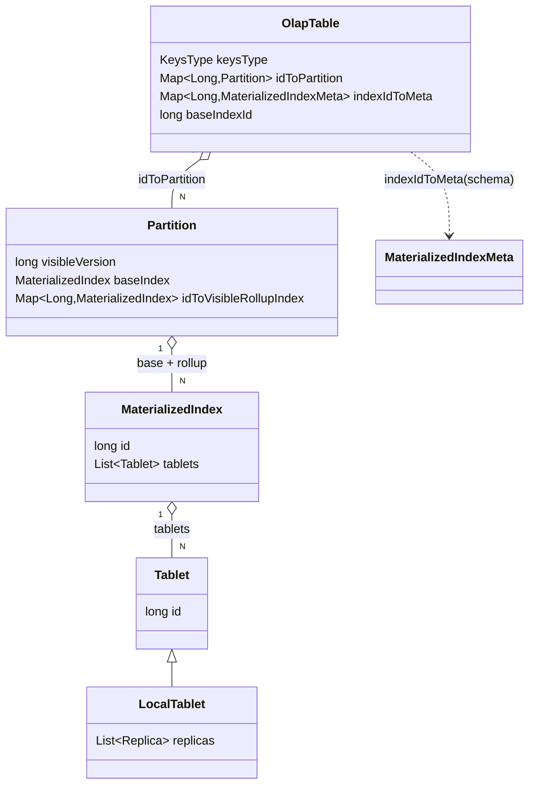
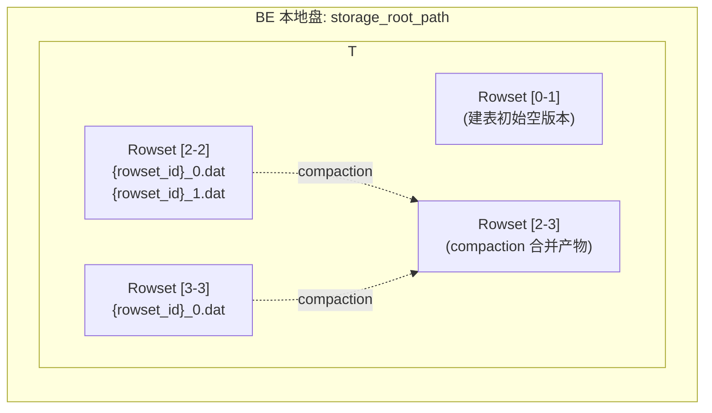

# 第 3 章：数据模型 —— 从 Table 到 Segment

第 2 章把三大件解剖成了可运行的进程，并留下一个锚点：BE 侧的 `StorageEngine` 管的是"数据在盘上的长期生命周期"。本章就顺着这把钥匙往下钻，回答一个更具体的问题——当你敲下 `CREATE TABLE`、再 `INSERT` 一批数据，这份数据在 Doris 内部到底被切成了什么样的层级、以什么格式落到磁盘上。

读完本章，你应当能在脑子里画出 **Table → Partition → MaterializedIndex → Tablet → Rowset → Segment** 这条从逻辑到物理的完整链路，知道每一层"是谁、归谁管、为什么要有这一层"，并且理解 Duplicate/Unique/Aggregate 三种数据模型为什么能共用同一套存储引擎。这条层级和这三种模型，是第三部分（导入主线）和第五部分（存储与读写路径）反复要回来引用的地基。

本章的行号引用基于当前 master（`git rev-parse --short HEAD` 为 `454f97ce63`）。代码演进会让行号漂移，但对象名与结构不变；写作时每一处都在当前代码里核实过。

## 3.1 问题：海量数据怎么切才能又好写又好查

一张事实表几十亿行，不可能整块塞进一台机器、也不可能当成一个不可分割的整体来读写。它必须被"切开"。但切分不是随便切——它同时要服务四个互相拉扯的目标，这才是难点所在：

- **分布式并行**：查询要能被拆成多个子任务，散到多台 BE 上并行扫描，否则算力加不上去；
- **副本容错**：切出来的每一块要能独立地做多副本，挂一台 BE 不能丢数据；
- **导入原子性**：一批数据写进来，要么整批可见、要么整批不可见，切分的粒度决定了事务提交的粒度；
- **查询裁剪**：`WHERE dt = '2024-01-01'` 这种条件应该能直接跳过无关的数据块，只扫该扫的部分，否则等于全表扫描。

问题精确地重述为：**用什么粒度、按什么规则切分数据，才能同时把并行、容错、原子性、裁剪这四件事都照顾到？** 下面几种工业界的典型切法，是对这个问题的不同回答。

**候选一：按行键 range 动态切分（HBase Region）。** HBase 把一张表按 rowkey 排序后切成一段段连续的 Region，Region 长大了自动 split、迁移。优点是天然支持范围扫描和裁剪，rowkey 前缀过滤能精确命中；缺点是**热点**——如果写入按时间/自增键顺序进来，永远只有最后一个 Region 在被写，split 和迁移是运行时动态发生的，抖动大、不可预测，且这套机制是为 KV 点查/范围查设计的，对"多维聚合要均匀并行"并不友好。

**候选二：一致性哈希。** 把数据按 key 哈希打到一个哈希环上，扩容时只需迁移相邻的一小段。优点是扩容时数据迁移量小、分布均匀、无热点；缺点是**彻底放弃了裁剪能力**——哈希把数据打散了，`WHERE dt = ...` 这类范围条件无法定位到某几个节点，任何带范围的查询都退化成全扫描。对以范围/多维过滤为主的分析场景，这是硬伤。

**候选三：固定分片数（Elasticsearch shard）。** 建索引时定死 shard 数量，文档按路由哈希分到固定 shard。优点是模型简单、并行度确定；缺点是**分片数一旦定死就很难改**——数据涨上来想加并行度，往往要 reindex 整个索引，且它同样以哈希为主，范围裁剪弱。

Doris 的最终答案是**两级切分：分区（Partition）+ 分桶（Bucket / Tablet）**，让两级各管一件事，互不干扰：

- **第一级分区**管**数据生命周期与查询裁剪**。按业务列（通常是时间）做 Range 或 List 分区，`WHERE dt` 直接裁掉无关分区；冷数据可以按分区整体删除、做 TTL、转冷存储。这一级对齐候选一的裁剪长处，但**分区边界是建表时人为规划的、静态的**——不像 HBase 那样运行时动态 split，因此没有 split 抖动和热点迁移。
- **第二级分桶**管**并行与均衡**。分区内部再按分桶列做哈希（`HashDistributionInfo`）或随机（`RandomDistributionInfo`）切成固定数量的 Tablet。这一级对齐候选二/三的均匀并行长处：Tablet 是并行扫描的最小单位、也是副本和数据迁移的最小单位，哈希保证分区内数据均匀落到各 Tablet、各 BE。

**为什么是两级而不是一级？** 因为裁剪和均衡这两个目标的诉求是相反的——裁剪要求"相关数据聚在一起"（范围有序），均衡要求"数据打散"（哈希无序）。一级切分无论选 range 还是 hash，都只能满足其中一个。Doris 用两级把这对矛盾拆开：外层 range 保序做裁剪，内层 hash 打散做均衡，分区数管时间维度的粗粒度裁剪，分桶数管单分区内的并行度。

那开头列的另外两个目标——**副本容错**和**导入原子性**——落在哪一级？答案都是**分桶切出来的 Tablet**：Tablet 是副本的最小单位（一个 Tablet 有 N 个副本散在不同 BE 上，挂一台不丢数据），也是数据迁移/均衡的最小单位；而导入原子性则由后面 3.3 要讲的**版本机制**在 Tablet 之上保证——一批数据要么整批推进版本、整批可见，要么整批不可见。所以四个目标恰好分层落定：裁剪归分区，并行/容错归分桶 Tablet，原子性归 Tablet 上的版本。这就是 Doris 存储层所有故事的起点。

## 3.2 逻辑层级：Table → Partition → MaterializedIndex → Tablet

3.1 讲的是"为什么这么切"，本节把它落到 FE catalog 的代码对象上。FE 内存里，一张表的元数据是一棵嵌套的对象树，主干是四层：



- **`OlapTable`**（`fe/fe-core/src/main/java/org/apache/doris/catalog/OlapTable.java:135`）是一张表的根。它持有 `idToPartition`（`fe/fe-core/src/main/java/org/apache/doris/catalog/OlapTable.java:188`，分区 id → `Partition`）和 `keysType`（`fe/fe-core/src/main/java/org/apache/doris/catalog/OlapTable.java:182`，三种数据模型之一，3.4 详述）。分区规则由 `PartitionInfo`（`fe/fe-core/src/main/java/org/apache/doris/catalog/PartitionInfo.java:52`）描述，分 `RangePartitionInfo`（`fe/fe-core/src/main/java/org/apache/doris/catalog/RangePartitionInfo.java:45`）、`ListPartitionInfo`（`fe/fe-core/src/main/java/org/apache/doris/catalog/ListPartitionInfo.java:42`）和不分区的 `SinglePartitionInfo`（`fe/fe-core/src/main/java/org/apache/doris/catalog/SinglePartitionInfo.java:20`）三种。
- **`Partition`**（`fe/fe-core/src/main/java/org/apache/doris/catalog/Partition.java:48`）是一个分区。它的关键成员 `visibleVersion`（`fe/fe-core/src/main/java/org/apache/doris/catalog/Partition.java:92`）是**分区级的可见版本号**——这是 3.3 版本机制的 FE 侧落点，也是导入可见性的"总开关"。
- **`MaterializedIndex`**（`fe/fe-core/src/main/java/org/apache/doris/catalog/MaterializedIndex.java:34`）持有一组 `tablets`（`fe/fe-core/src/main/java/org/apache/doris/catalog/MaterializedIndex.java:70`，`List<Tablet>`）。
- **`Tablet`**（`fe/fe-core/src/main/java/org/apache/doris/catalog/Tablet.java`）是切分的最小单位。存算一体下的实现是 `LocalTablet`（`fe/fe-core/src/main/java/org/apache/doris/catalog/LocalTablet.java:39`），它持有 `replicas`（`fe/fe-core/src/main/java/org/apache/doris/catalog/LocalTablet.java:43`，`List<Replica>`）——**副本这一层挂在 Tablet 下面，Tablet 才是副本调度和容错的最小单位**。

分桶规则由 `DistributionInfo`（`fe/fe-core/src/main/java/org/apache/doris/catalog/DistributionInfo.java`）描述，`HashDistributionInfo`（`fe/fe-core/src/main/java/org/apache/doris/catalog/HashDistributionInfo.java:35`）按指定列哈希，`RandomDistributionInfo`（`fe/fe-core/src/main/java/org/apache/doris/catalog/RandomDistributionInfo.java`）随机分配。分桶数就是每个分区里的 Tablet 数量。

### tricky 点一：MaterializedIndex 这一层为什么存在

初学者读这棵树时最容易忽略、也最想不通的就是 `MaterializedIndex` 这一层——为什么 Partition 下面不直接挂 Tablet，非要夹一层 Index？

答案是：**这一层是为同步物化视图（rollup）准备的。** 一张 Doris 表除了"base 表"本身，还可以建多个 rollup / 同步物化视图（如按不同前缀列重排、预聚合的另一份物理数据）。它们**和 base 表共享同一套 Partition**——同样的分区边界、同样的生命周期——但各自是一份独立的物理数据、有各自的一组 Tablet 和各自的 schema。`MaterializedIndex` 正是"一份物理数据"这个概念的载体：

- `Partition` 里 `baseIndex`（`fe/fe-core/src/main/java/org/apache/doris/catalog/Partition.java:70`）是 base 表那份，`idToVisibleRollupIndex`（`fe/fe-core/src/main/java/org/apache/doris/catalog/Partition.java:76`）挂着所有 rollup 那几份；
- 每个 `MaterializedIndex` 的 schema、keysType 存在表级的 `indexIdToMeta`（`fe/fe-core/src/main/java/org/apache/doris/catalog/OlapTable.java:176`，index id → `MaterializedIndexMeta`）里；`MaterializedIndexMeta`（`fe/fe-core/src/main/java/org/apache/doris/catalog/MaterializedIndexMeta.java:47`）各自带一份 `schema`（`:51`）和 `keysType`（`:61`）。base 表用哪个 index id，由 `OlapTable.baseIndexId`（`fe/fe-core/src/main/java/org/apache/doris/catalog/OlapTable.java:225`）标记。

所以正确的心智模型是：**Partition 管"逻辑上的一段数据范围"，MaterializedIndex 管"这段范围的某一种物理排布"，Tablet 才是某一种物理排布被切成的块。** 一次导入必须同时写入 base 和所有 rollup 的对应 Tablet（否则 rollup 和 base 数据不一致），这也是为什么 `MaterializedIndex` 有 `IndexExtState`（`fe/fe-core/src/main/java/org/apache/doris/catalog/MaterializedIndex.java:48`，区分 `VISIBLE`/`SHADOW`）——正在 alter 中、还没建好的 rollup 处于 `SHADOW` 态，导入要写它但查询不能读它。**如果误以为 rollup 是独立的表**，就会在排查"为什么导入变慢了""为什么删了一个 MV 磁盘没立刻降"这类问题时找错方向。

### tricky 点二：Tablet 数量的放大效应

这是建表时最容易踩、后果最严重的一个坑，务必算清一笔账：

> **单表 Tablet 总数 = 分区数 × 分桶数 × 副本数 ×（1 + rollup 个数）**

举个真实会出事的例子：一张按天分区、保留 2 年（730 个分区）、每分区 64 个分桶、3 副本、外加 1 个 rollup 的表，Tablet 总数 = 730 × 64 × 3 × 2 ≈ **28 万**。而一个集群往往有几百上千张表。

这个乘积为什么危险？因为**每个 Tablet 的元数据都要常驻 FE 的 JVM 堆内存**（回顾第 2 章：存算一体下 FE 是元数据的最终持有者，`tabletInvertedIndex` 要为每个 Tablet 维护"副本在哪些 BE"的倒排）。Tablet 数量线性推高 FE 堆内存占用、image/checkpoint 大小、以及副本调度器（`tabletScheduler`）每轮要遍历的对象数。**打爆的后果是**：FE Full GC 频繁、元数据 checkpoint 变慢、`SHOW` 类命令卡顿、副本调度跟不上导致坏副本迟迟修不好——而且这一切是**建表时一个拍脑袋的分桶数**埋下的，等数据涨上来才爆发，回头改分桶要重建表，代价极高。

规避的核心是**按数据量倒推分桶数**（经验值：单 Tablet 数据量控制在几百 MB 到 10GB 量级，而不是盲目求高并行度把分桶设成几百），并对历史分区用动态分区自动淘汰。3.6 的实验二会真的建一张分桶数过大的表，让你亲眼看到元数据是怎么膨胀的。

## 3.3 物理层级：Tablet → Rowset → Segment

逻辑层级到 Tablet 为止，都还是 FE 内存里的元数据对象。从 Tablet 往下，就进入 BE 管辖的物理存储了。一个 Tablet 的数据不是一个大文件，而是一叠 **Rowset**，每个 Rowset 又由若干 **Segment** 文件组成。



### BE 侧的类与目录对应

- Tablet 的 BE 实现是 `Tablet`（`be/src/storage/tablet/tablet.h:113`，`class Tablet final : public BaseTablet`），抽象基类 `BaseTablet`（`be/src/storage/tablet/base_tablet.h:62`）——这个基类是双模式的公共父类，3.5 会看到云上的 `CloudTablet` 也继承它。
- Rowset 相关类在 `be/src/storage/rowset/`，Segment 读写在 `be/src/storage/segment/`。
- 每个 Tablet 在磁盘上对应一个目录，路径规则是 `{storage_root}/data/{shard_id}/{tablet_id}/{schema_hash}`（`be/src/storage/data_dir.cpp:278` 的 `get_absolute_tablet_path`，`DATA_PREFIX="data"` 定义在 `be/src/storage/olap_define.h:91`）。
- Segment 文件命名规则是 `{tablet_path}/{rowset_id}_{seg_id}.dat`（`be/src/storage/olap_define.h:105` 的 `local_segment_path`：`fmt::format("{}/{}_{}.dat", ...)`；调用点见 `be/src/storage/rowset/rowset.cpp:153`）。所以一个 Segment 文件的完整路径形如 `.../data/0/10086/1234567890/020000...abc_0.dat`——3.6 的实验一会带你在盘上把这个文件找出来。

### 元数据 PB：TabletMetaPB 与 RowsetMetaPB

Tablet 的持久化元数据是 `TabletMetaPB`（`gensrc/proto/olap_file.proto:663`），它把逻辑层级的信息（`table_id`、`partition_id`、`tablet_id`、`schema`）和物理层级的 rowset 列表都装在一起。最值得看的三个字段：

- `repeated RowsetMetaPB rs_metas = 10`（`gensrc/proto/olap_file.proto:674`）：这个 Tablet 当前所有**可见**的 rowset 元数据列表——这就是"Tablet 由一叠 Rowset 组成"在元数据里的样子。
- `repeated RowsetMetaPB stale_rs_metas = 18`（`gensrc/proto/olap_file.proto:686`）：**已被 compaction 合并、但还不能立刻删**的旧 rowset。为什么要单独留一份"陈旧列表"？因为一个正在执行的查询可能已经选定了旧版本的 rowset 集合，compaction 生成新 rowset 后不能马上物理删除旧的，得等这些"还在读旧版本"的查询走完——这是 MVCC 读的必要保留。
- `enable_unique_key_merge_on_write = 24`（`gensrc/proto/olap_file.proto:694`）和 `delete_bitmap = 23`（`gensrc/proto/olap_file.proto:692`）：Unique 模型 MoW 的开关和删除位图，3.4 详述。

### 版本机制：为什么用 [start_version, end_version] 区间，而不是单个版本号

这是本节的重头戏，也是理解导入可见性与 compaction 的地基，务必讲透。

每个 Rowset 的元数据 `RowsetMetaPB`（`gensrc/proto/olap_file.proto:82`）带一对版本字段：`start_version = 8`（`gensrc/proto/olap_file.proto:93`）和 `end_version = 9`（`gensrc/proto/olap_file.proto:95`）。注意——是一个**闭区间 `[start, end]`**，不是单个版本号。

先建立直觉。Tablet 的版本是一条单调递增的时间线：建表时有一个初始的空版本 `[0-1]`；之后**每一次成功的导入事务，让分区版本 +1，并产生一个新 Rowset**，其区间是 `[n, n]`（start=end，单版本）。所以刚导入完，一个 Tablet 上是一串挨着的单版本 rowset：`[0-1]`、`[2-2]`、`[3-3]`、`[4-4]`……

那为什么不干脆给每个 rowset 一个单一版本号，非要用区间？**因为 compaction 需要用区间来表达"合并"这件事。** 当后台把 `[2-2]`、`[3-3]`、`[4-4]` 三个小 rowset 合并成一个大 rowset 时，这个新 rowset 覆盖的正是版本 2 到 4 的全部数据，它的版本自然就是 **`[2-4]`**——一个跨度大于 1 的区间。区间的两端恰好编码了"这个 rowset 承载了哪几次导入的合并结果"。

这套设计带来两个关键性质：

1. **查询 = 一次版本区间的拼接覆盖。** 一次查询要读某个版本 `V` 的完整数据，本质是从 Tablet 的所有 rowset 里，挑出一组区间**首尾相接、恰好无缝覆盖 `[0, V]`** 的 rowset 集合（version path）。比如要读版本 4，既可以走 `[0-1]+[2-2]+[3-3]+[4-4]`，也可以走 `[0-1]+[2-4]`（如果合并已完成）——两条路径读到的数据完全一致，但后者读的文件更少、更快。这就是 compaction 加速查询的本质：**用宽区间 rowset 替换一串窄区间 rowset，缩短 version path。**
2. **可见性 = 分区 visibleVersion 的推进。** 导入事务提交时，rowset 先以 `COMMITTED` 状态落地，直到事务 publish 才把分区的 `visibleVersion`（3.2 提过的 `fe/fe-core/src/main/java/org/apache/doris/catalog/Partition.java:92`）推到新版本。查询只读 `<= visibleVersion` 的 rowset。**如果误解成"数据写完就可见"**，就无法解释"导入返回成功了但查不到"的中间窗口——真相是 rowset 已经 COMMITTED 但 version 还没 publish。

Rowset 的状态机由 `RowsetStatePB`（`gensrc/proto/olap_file.proto:39`）描述，三态清晰：`PREPARED = 0`（`:41`，正在写）→ `COMMITTED = 1`（`:44`，写完但用户还不可见，**BE 不能自行删除，必须听 FE 指令**）→ `VISIBLE = 2`（`:46`，对用户可见）。这条状态机是第三部分导入主线的落点，这里先建立"写入 → 提交 → 可见是三步、不是一步"的认知。

## 3.4 三种数据模型：Duplicate / Unique / Aggregate

Doris 对外提供三种语义截然不同的表模型——明细存储（Duplicate）、按主键更新（Unique）、预聚合（Aggregate）。本节用三连问把它们讲清楚。

**遇到了什么问题？** 第 1 章说过，Doris 要用"一套系统、一份数据"覆盖明细查询、可更新、预聚合三类需求。但这三类需求对存储的语义要求是冲突的：明细要求"来一行存一行、原样保留"；可更新要求"同主键的新值覆盖旧值"；预聚合要求"同维度的多行按聚合函数合并"。

**有哪些候选方案，各有什么优劣？**

- **候选一：三套独立的存储引擎。** 每种语义写一套引擎（类似某些系统为 KV、时序、宽表各做一套内核）。优点是每套都能针对性优化到极致；缺点是**三套引擎意味着三份导入路径、三份 compaction、三份读取逻辑、三份 bug**——工程量和维护成本三倍膨胀，且用户在三套表之间迁移要重导数据。
- **候选二：一套 LSM 风格的引擎 + 读时合并语义参数化。** 只做一套"MemTable + 增量 Rowset + 后台 compaction"的 LSM 变体存储引擎，把"三行同主键该怎么处理"这件事抽象成一个**参数**——读取/compaction 时按这个参数决定是"全保留（Duplicate）""取最新（Unique）"还是"按函数聚合（Aggregate）"。优点是导入、存储、compaction 主干**完全复用**，三种模型只是合并策略不同；缺点是读时合并会带来一定读放大（尤其 Unique MoR）。

**Doris 怎么解决的？** 选了候选二。这个"参数"就是 `KeysType` 枚举——proto 定义在 `gensrc/proto/olap_file.proto:330`：`DUP_KEYS = 0`（`:331`）、`UNIQUE_KEYS = 1`（`:332`）、`AGG_KEYS = 2`（`:333`）；FE 侧对应枚举 `KeysType`（`fe/fe-core/src/main/java/org/apache/doris/catalog/KeysType.java:25`，值 `DUP_KEYS`/`UNIQUE_KEYS`/`AGG_KEYS` 在 `:27-29`）。它从建表时挂在 `OlapTable.keysType`（`fe/fe-core/src/main/java/org/apache/doris/catalog/OlapTable.java:182`）和每个 `MaterializedIndexMeta.keysType`（`fe/fe-core/src/main/java/org/apache/doris/catalog/MaterializedIndexMeta.java:61`）上，一路透传到 BE 的读写路径，决定 compaction 和查询时怎么处理相同 key 的多行。

三种模型的语义一句话概括：

- **Duplicate**：key 只用于排序（前缀索引），相同 key 的行**全部保留**，导入即追加。适合日志、明细。
- **Unique**：key 是主键，相同 key **保留最新一行**（upsert 语义）。适合 CDC、状态表。
- **Aggregate**：key 是维度列，非 key 列（value）按建表时指定的聚合函数（SUM/MAX/REPLACE 等）**合并**。适合预聚合报表。

> 三种模型如何一路影响 BE 的读写路径（MemTable 的排序/去重、compaction 的 merge、查询的 merge-on-read），这里只到概览级——**详细读写路径见第三部分（导入主线）与第五部分（存储读写路径）**。本章只需记住"KeysType 是那个贯穿始终的参数"。

### 易错点一：Unique 模型 MoR 与 MoW 的语义差异

Unique 模型有两种实现，语义看起来一样、性能天差地别，是面试和排查的高频点。

- **MoR（Merge-on-Read，读时合并）**：导入时只管追加新 rowset（和 Duplicate 一样快），**查询时**才把相同 key 的多个版本合并、取最新。写快，但**读要承担合并开销**，且 count/聚合前必须先去重，查询越复杂读放大越明显。
- **MoW（Merge-on-Write，写时合并）**：导入时就通过主键索引找到被覆盖的旧行，在 `delete_bitmap`（`gensrc/proto/olap_file.proto:692`）里把旧行标记删除，**查询时直接跳过被标删的行、无需合并**。读快（接近 Duplicate），代价是写入时多一次主键查找和位图维护。由 `enable_unique_key_merge_on_write`（`gensrc/proto/olap_file.proto:694`，FE 属性键 `ENABLE_UNIQUE_KEY_MERGE_ON_WRITE` 见 `fe/fe-core/src/main/java/org/apache/doris/common/util/PropertyAnalyzer.java:236`）开关，新版本默认开启。

**易错的后果**：如果在一张读多写少、又爱做聚合分析的 Unique 表上误用了 MoR（或老版本默认 MoR 没手动开 MoW），查询性能会莫名比预期差很多——因为每次查询都在做读时去重合并。反过来，在一张写入极高频的表上开 MoW，写入会因为主键查找而变慢。**选 MoR 还是 MoW，本质是把去重的成本放在读端还是写端**，要按读写比例来定。

### 易错点二：Aggregate 模型的 count(\*) 困惑

一个经典困惑：往一张 Aggregate 表里导入了 1000 万行，`SELECT count(*)` 却只返回 300 万，"数据丢了？"

没丢。Aggregate 模型下，**相同维度（key）组合的行会被聚合成一行**——导入的 1000 万行里若有大量维度重复，聚合后就只剩 300 万个不同的维度组合。`count(*)` 数的是聚合后的行数，不是导入的原始行数。**这不是 bug，是模型语义**。

更隐蔽的一层：**聚合是"最终"的，但不是"实时全量"的**。数据导入后先落成一个个独立 rowset，跨 rowset 的相同 key 要等 compaction 或查询时才真正合并。所以在 compaction 尚未完成时，`count(*)` 的结果会**随后台 compaction 的进度而变化**（逐渐收敛到最终值）——如果误以为 count 应该是个恒定值，就会被"同一张表 count 两次结果不一样"吓到。理解了"聚合发生在读/合并时、rowset 间尚未合并的相同 key 还是分开的"，这个现象就顺理成章了。

顺带一提，这三种模型并非孤立——它们共用 3.2 的 `MaterializedIndex` 机制：Aggregate 表可以建 rollup 预聚合到更粗的维度，Duplicate 表可以建按不同前缀列排序的 rollup 加速点查。base 表和 rollup 各自的 `keysType` 存在各自的 `MaterializedIndexMeta`（`fe/fe-core/src/main/java/org/apache/doris/catalog/MaterializedIndexMeta.java:61`）里，导入时同一批数据按各自的 KeysType 分别聚合/去重后写入对应 Tablet。这也再次印证 3.2 的结论：**KeysType 是 index 级而非仅表级的属性**，一张表的不同物理排布可以有不同的合并语义。

## 3.5 双模式对比：Tablet 的数据与元数据归属

前四节的逻辑与物理层级，在**存算一体**和**存算分离**两种形态下**结构完全一致**——Table→Partition→MaterializedIndex→Tablet→Rowset→Segment 这条链路一模一样。真正不同的是最底层 Tablet 的**"归属"**：数据和元数据分别住在哪里、谁是权威。

| 维度 | 存算一体（shared-nothing） | 存算分离（cloud mode） |
| --- | --- | --- |
| Tablet BE 类 | `Tablet`（`be/src/storage/tablet/tablet.h:113`） | `CloudTablet`（`be/src/cloud/cloud_tablet.h:77`） |
| 二者共同基类 | `BaseTablet`（`be/src/storage/tablet/base_tablet.h:62`） | 同左（`BaseTablet`） |
| Segment 数据落在哪 | BE 本地盘（3.3 的 `data/{shard}/{tablet}/...` 路径规则） | 共享对象存储（S3/HDFS），BE 本地只有 File Cache |
| Tablet 元数据权威在哪 | BE 本地：`TabletMetaPB` 存本地 RocksDB（`be/src/storage/tablet/tablet_meta_manager.h`），FE 内存 + bdbje 持有逻辑元数据 | MetaService + FoundationDB（回顾第 2 章 2.4），BE 侧只是 cache |
| 副本 | Tablet 有多副本（`LocalTablet.replicas`），FE 调度均衡/修复 | 数据在对象存储上天然多副本，Tablet 无本地副本概念，BE 只缓存 |

关键的类分叉：存算一体的本地 `Tablet` 和存算分离的 `CloudTablet`（`be/src/cloud/cloud_tablet.h:77`，`class CloudTablet final : public BaseTablet`）都继承自 `BaseTablet`（`be/src/storage/tablet/base_tablet.h:62`）——**这正是"层级结构一致、归属不同"在代码里的体现**：公共的存储层级逻辑收在 `BaseTablet`，本地盘 vs 对象存储的差异下沉到两个子类。BE 侧管理云上 Tablet 缓存的是 `CloudTabletMgr`（`be/src/cloud/cloud_tablet_mgr.h:41`），对应本地的 `tablet_manager`（第 2 章提过的 `StorageEngine` 下属）。存储引擎层也是同一套分叉：`CloudStorageEngine`（`be/src/cloud/cloud_storage_engine.h:56`，`class CloudStorageEngine final : public BaseStorageEngine`）对本地 `StorageEngine`。

一句话记忆：**存算一体下"Tablet 的数据和元数据都在 BE 本地，FE 持有全局元数据"；存算分离下"Tablet 的数据在对象存储、元数据在 MetaService，BE 只是带缓存的计算节点"。** 层级不变，只是底座从"本地盘"换成了"对象存储 + 外置元数据"。

## 3.6 动手实验

两个实验：实验一验证 3.2/3.3 的核心层级——把逻辑 Tablet 和磁盘上的 Segment 文件对上号；实验二主动踩 3.2 tricky 点二的坑——建一张分桶数过大的表，看 Tablet 元数据怎么膨胀。假设已按第 5 章的方式源码编译并拉起单机集群（存算一体形态），BE 有一个本地 `storage_root_path`。

### 实验一：从 SHOW TABLETS 到磁盘上的 Segment 文件

**1. 建一张 2 分区 × 2 分桶 × 1 副本的表。** 用 MySQL 客户端连 FE 的 9030：

```sql
CREATE TABLE test_hier (
    dt   DATE,
    id   BIGINT,
    val  INT
)
DUPLICATE KEY(dt, id)
PARTITION BY RANGE(dt) (
    PARTITION p202401 VALUES LESS THAN ('2024-02-01'),
    PARTITION p202402 VALUES LESS THAN ('2024-03-01')
)
DISTRIBUTED BY HASH(id) BUCKETS 2
PROPERTIES ("replication_num" = "1");
```

按 3.2 的乘法，这张表应有 2（分区）× 2（分桶）× 1（副本）= **4 个 Tablet**。

**2. 观察 Tablet 分布。** 分别看两个分区的 Tablet：

```sql
SHOW TABLETS FROM test_hier PARTITION(p202401);
SHOW TABLETS FROM test_hier PARTITION(p202402);
-- 或从元数据表看全量
SELECT * FROM information_schema.tablets;   -- 视版本，也可用 backends() / SHOW TABLET <id>
```

记下某个 `TabletId` 和它所在的 `BackendId`（对照 `SHOW BACKENDS` 找到该 BE 的存储路径）。

**3. 导入一批数据，让版本推进。**

```sql
INSERT INTO test_hier VALUES
  ('2024-01-15', 1, 100), ('2024-01-16', 2, 200),
  ('2024-02-10', 3, 300), ('2024-02-11', 4, 400);
```

这一次 `INSERT` 是一个导入事务，会把命中分区的 `visibleVersion` 从初始值推进一格，并在对应 Tablet 上生成一个新 rowset（回顾 3.3 的版本机制）。

**4. 在磁盘上找到 Segment 文件。** 按 3.3 的路径规则 `{storage_root}/data/{shard_id}/{tablet_id}/{schema_hash}/{rowset_id}_{seg_id}.dat`，进到那台 BE 的 `storage_root_path` 下：

```bash
# 用第 2 步记下的 tablet_id 定位（shard_id 是子目录，无需预先知道）
find <storage_root_path>/data -type d -name "<tablet_id>"
ls -l <找到的 tablet 目录>/*/          # 会看到形如 020000...abc_0.dat 的 segment 文件
```

看到 `.dat` 文件，你就把"FE 里一个逻辑 Tablet"和"BE 盘上一个 Rowset 的 Segment 文件"对上号了——这正是 3.3 那条物理链路的现场。空导入（没命中数据的分区）的 Tablet 目录里可能只有初始空版本，没有 `.dat`，这也印证了"rowset 随导入产生"。

### 实验二：分桶数过大，观察元数据膨胀

主动踩 3.2 tricky 点二的坑，感受 Tablet 数量放大。

```sql
-- 故意把分桶数设得离谱地大
CREATE TABLE test_toomany (
    dt DATE, id BIGINT, val INT
)
DUPLICATE KEY(dt, id)
PARTITION BY RANGE(dt) (
    PARTITION p1 VALUES LESS THAN ('2024-02-01'),
    PARTITION p2 VALUES LESS THAN ('2024-03-01')
)
DISTRIBUTED BY HASH(id) BUCKETS 500       -- 单分区就 500 个 Tablet
PROPERTIES ("replication_num" = "1");
```

**现象与观察**：这张几乎没数据的空表，Tablet 数已经是 2 × 500 × 1 = **1000 个**。

```sql
SHOW TABLETS FROM test_toomany;                    -- 上千行
SELECT COUNT(*) FROM information_schema.tablets
  WHERE TABLE_NAME = 'test_toomany';               -- 确认数量
ADMIN SHOW REPLICA STATUS FROM test_toomany;       -- 观察每个副本的健康状态，行数同样爆炸
```

对比实验一那张 4 个 Tablet 的表，感受同样"一张空表"，元数据对象数差了 250 倍。把这个数再乘上"几百张表 × 3 副本 × 多年分区"，就是 3.2 说的"打爆 FE 内存"的来路。这个实验的价值：**建表时 `BUCKETS` 那个数字不是越大越好，它是一个会被分区数和时间线性放大的乘数因子**——线上定分桶数前，先按"单 Tablet 目标数据量"倒推。

## 3.7 排查清单

把本章的层级机制反过来用，就是几条"症状 → 定位路径"的线索。

**症状 A：FE 变慢、Full GC 频繁、`SHOW` 命令卡顿。**
- 高度怀疑 **Tablet 总数过多**（3.2 tricky 点二）。用 `SELECT COUNT(*) FROM information_schema.tablets` 看全局 Tablet 数，再按表排序找元凶表；对元凶表核对 `分区数 × 分桶数 × 副本数 ×(1+rollup)` 这笔账。
- 治理方向：历史分区用动态分区/TTL 淘汰；新表按单 Tablet 目标数据量重新规划分桶数；必要时考虑存算分离形态把元数据外移（3.5）。

**症状 B：查询很慢，怀疑只扫了该扫的却没裁剪掉无关分区。**
- 用 `EXPLAIN`/查询 profile 看实际命中的分区/Tablet 数。若 `WHERE` 带了分区列却仍扫全部分区，检查：分区列是否就是 `PARTITION BY` 的列；条件是否是分区列上可裁剪的范围（函数包裹、类型隐式转换会让裁剪失效）；分桶裁剪则要求等值条件命中分桶列。
- 回到 3.1：裁剪是"分区"这一级的能力，如果表根本没按查询维度分区，就没有分区裁剪可言。

**症状 C：导入报错 `-235` / `too many versions`。**
- 这是 BE 抛的 `TOO_MANY_VERSION`（`be/src/common/status.h:120`，错误码 -235），触发点在 `be/src/storage/rowset_builder.cpp:173` 的 `check_tablet_version_count`——某个 Tablet 的版本数超过了 `max_tablet_version_num`（`be/src/common/config.cpp:915`，默认 2000；时序表走 `time_series_max_tablet_version_num`，`be/src/common/config.cpp:917`，默认 20000）。
- 根因：**导入太频繁、每次批量太小**，rowset（每次导入一个版本）产生的速度超过了 compaction 合并的速度，版本堆积（回顾 3.3：每次导入 +1 个版本，compaction 才把窄区间合成宽区间）。
- 定位方向：降低导入频率、增大单批数据量（减少 rowset 产生速率）；检查 compaction 是否卡住/线程不足（消费速率跟不上）；临时可调大上述 config，但那是治标——真正要平衡的是"版本产生速率 vs compaction 合并速率"。

---

本章把第 2 章的 `StorageEngine` 往下拆成了一条完整的存储层级：逻辑上 Table 按"分区管裁剪、分桶管并行"两级切成 Tablet，中间夹一层 MaterializedIndex 承载 base 与 rollup 的物理排布；物理上 Tablet 由一叠带版本区间的 Rowset 组成，每个 Rowset 落成磁盘上的 Segment 文件；三种数据模型靠 `KeysType` 这个贯穿读写路径的参数复用同一套引擎。版本区间机制（`[start, end]`）是导入可见性和 compaction 的共同地基，会在第三部分导入主线和第五部分读写路径里被反复引用。下一章《两种架构形态》会把本章多次提到的"存算一体 vs 存算分离"从局部对比升级成完整的形态对照，讲清 MetaService 与对象存储如何重塑整条数据路径。
