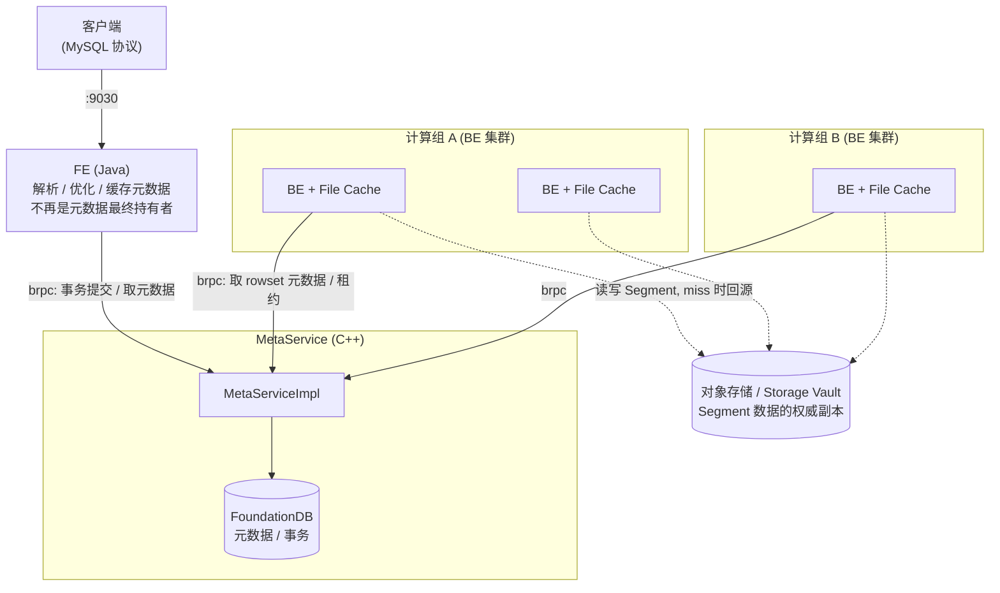

# 第 4 章：两种架构形态 —— 存算一体与存算分离

前三章一直在讲"两种模式都成立"的公共骨架：第 2 章的 FE/BE/MetaService 三进程、第 3 章的 Table→Partition→Tablet→Rowset→Segment 层级，在存算一体和存算分离下结构一致。但每章末尾都留了一句"存算分离下这里不一样"的伏笔——MetaService 只在存算分离存在（2.4）、Tablet 的数据和元数据归属随模式切换（3.5）、副本调度器仅存算一体有（2.2）。本章把这些散落的伏笔收拢，回答一个总纲性的问题：**存算分离到底改了什么、为什么这么改、这两套形态在代码里如何共存于同一份仓库。**

读完本章，你应当能说清存算一体的架构天花板具体卡在哪里、存算分离用什么代价换来了什么、以及拿到一段陌生源码时如何在 30 秒内判断"它在哪种模式下生效"。本章最后的 4.5 双模式差异总表是全书的索引——后续每一部分讲到某个环节的双模式差异时，都从这张表的某一行展开。

本章的行号引用基于写作时核实所用的 HEAD（`c0501f66d2`，源码树与系列基线 `7bc98f696f` 一致）。代码演进会让行号漂移，但对象名与结构不变；写作时每一处都在当前代码里核实过。

## 4.1 问题：本地盘架构的天花板

先把存算一体的形态钉死：BE 既算又存，数据本地落盘（第 3 章那条 `data/{shard}/{tablet}/...` 路径），每个 Tablet 有 N 个副本散在不同 BE 上，副本的均衡与修复由 FE 的 `tabletScheduler`（第 2 章 2.2）调度。这套设计在中小规模下简洁、快、无外部依赖。但当规模和负载复杂度上来，它会同时撞上四堵墙，每一堵都源自同一个根因——**计算和存储被焊死在同一组节点上**。

**第一堵墙：扩容要搬数据。** 集群算力不够，加一台 BE。可新 BE 是一张空盘，为了让它分担负载，FE 必须把已有 Tablet 的副本一份份 clone 到新节点上做均衡——这是实打实的 TB 级数据搬迁，占满网络和磁盘 IO，往往要跑几个小时甚至几天，期间集群带着额外负载。缩容更尴尬：想下线一台 BE，得先把它上面的副本迁走，否则副本数不足。**弹性伸缩的粒度被数据搬迁的速度锁死了**，谈不上"秒级弹起弹灭"。

**第二堵墙：冷数据占着贵盘。** 一张按天分区、保留两年的表，730 个分区里真正被高频查询的可能只有最近 7 天，剩下 723 个分区的数据几乎不动，却和热数据一样躺在最贵的 NVMe/SSD 上，还各自占着 3 副本。存储成本被"冷数据用热存储 × 3 副本"这个乘积推高，而这些冷数据的访问价值极低。

**第三堵墙：负载互相踩。** 同一台 BE 上，一个扫全表的大查询能把磁盘 IO 和 CPU 打满，同一时刻这台 BE 上的导入 flush 就会变慢，版本堆积触发第 3 章那个 `-235 / too many versions`。存算一体没有干净的资源隔离手段——ETL、即席查询、报表跑在同一批 BE 上，一类负载的尖峰会污染另一类。想隔离，只能物理上拆成多个集群，而多集群又意味着数据要复制多份。

**第四堵墙：元数据内存瓶颈。** 这堵墙第 2 章 2.4 已经拆过——Tablet 数量线性推高 FE 堆内存、image/checkpoint 大小（回顾 3.2 tricky 点二的 Tablet 放大账），百万级 Tablet 下 FE 成为瓶颈。这里不再展开，只强调它和前三堵墙同源：**状态（数据 + 元数据）和处理（计算 + 协调）绑死，无法各自独立伸缩。**

四堵墙可以精确地重述成一句话：**存算一体把"算力""存储容量""元数据容量"三个本应独立伸缩的维度，捆成了一个不可分的整体。** 下一节看业界和 Doris 自己给过哪些解法。

## 4.2 候选方案与权衡

面对"三个维度捆死"这个问题，有三类思路，改造代价和收益递增。

**候选 a：冷热分层（cooldown），数据仍归 BE 管。** 只解决第二堵墙——把冷分区的数据下沉到对象存储或廉价盘，热数据仍留在 BE 本地盘。存储引擎里加一个"远端存储"抽象，冷 Tablet 的 Segment 搬到 S3/HDFS，元数据里记一个 cooldown 标记。**优点是改造面小**：计算、副本、元数据体系全不用动，只在存储层加一层冷数据落点，向后兼容，存算一体集群打个开关就能用。**缺点是它只砍了成本这一维**：热数据还是本地 3 副本、扩容还是要搬数据、负载还是在同一批 BE 上争抢。它是"补丁"，不是"重构"。

**候选 b：彻底存算分离。** 一次性推倒第一、三、四堵墙——数据全部放共享对象存储（计算节点无本地权威数据）、元数据从 FE 外移到独立的 MetaService（背后 FoundationDB）、计算节点变成近乎无状态、可按需拉起的工作节点。**优点是三个维度彻底解耦**：加算力就加计算节点（不搬数据）、加容量就是对象存储扩桶（对计算透明）、元数据容量随 FDB 水平扩展。**代价极其昂贵**：其一，改造面巨大——4.6 会数出 FE 侧 50 多个 `cloud` 包类、BE 侧 70 多个 `cloud` 源文件；其二，一致性变难——事务提交点从"FE 本地写 editlog"变成"向分布式 KV 提交"，跨进程的强一致协调（详见 part3）；其三，性能天花板下移——远端对象存储读延迟远高于本地盘，必须靠一层 File Cache 把热数据缓存在计算节点本地才能把延迟补回来。

**候选 c：共享存储多写。** 类似某些云数据库的"多个计算节点直接读写同一份共享存储"。理论上弹性也好，但**多写带来的一致性协调是最难的**——多个节点并发写同一份数据，版本、冲突、可见性都要跨节点协调。Doris 没走这条路：它的存算分离是**单集群写入、元数据经 MetaService 串行化提交**的模型，而不是多点并发写同一 Tablet。计算组之间是"读同一份数据、写各自负责的事务"，把多写的一致性难题绕开了。

**Doris 的取舍：两条都做了，但定位不同。** cooldown（候选 a）和存算分离（候选 b）在 Doris 里**同时存在、互不替代**：

- **cooldown 是存算一体的一个补丁**，早于存算分离出现，渐进式、低成本，专治"冷数据占贵盘"。存算一体集群至今仍可用它做冷热分层。
- **存算分离（cloud mode）是另起炉灶的重构**，一次性解决弹性、成本、隔离三件事，代价是引入 FDB + 对象存储两个外部依赖、运维变重。

为什么不干脆全量切到存算分离、废掉存算一体？因为**部署复杂度是一项真实成本**：存算一体一个 FE + 一批 BE 就能跑，无外部依赖，中小规模、私有化、边缘部署场景它更省心；存算分离需要额外维护 FDB 集群、对象存储、MetaService，只有在规模够大、需要云上弹性时才划算。所以 Doris 保留两条路，让部署方按规模和场景选，而不是替用户做决定。本章剩下的篇幅，聚焦讲透候选 b——存算分离到底改了哪四处、代码里怎么落地。

## 4.3 存算分离的总体设计

先看全景。存算分离把存算一体的"FE + BE"两层，扩成了"FE + 多计算组 BE + MetaService(FDB) + 对象存储"四层：



对照第 2 章那张两模式合一的总图，存算分离相对存算一体做了**四处关键改变**，每一处都对应 4.1 的一堵墙，逐一讲动机：

**改变一：元数据从 FE 内存 + bdbje 移到 MetaService + FDB。** 动机是第四堵墙（元数据容量与弹性），2.4 已详述其"容量 + 弹性"两个瓶颈，这里不重复。要点是 FE 从"元数据的最终持有者"退化成"元数据的缓存 + 规划者"，权威落到 FDB。

**改变二：数据从本地盘移到对象存储 + File Cache。** 动机是第一、二堵墙。数据的权威副本放在共享对象存储（Doris 里称 Storage Vault，见 `gensrc/proto/cloud.proto:124`-`126` 的 `storage_vault_names` / `default_storage_vault_id`），计算节点本地不再持有权威数据。这样扩容不必搬数据（新计算节点直接读对象存储）、冷数据天然便宜（对象存储单价远低于本地 SSD 且自带冗余）。但对象存储读延迟高，于是每个 BE 本地保留一层 **File Cache**——`BlockFileCache`（`be/src/io/cache/block_file_cache.h:166`）把热数据的 Segment 块缓存在本地盘，读路径通过 `CachedRemoteFileReader`（`be/src/io/cache/cached_remote_file_reader.h:40`）先查缓存、miss 才回源对象存储。cloud 模式启动时 BE 会强制打开 File Cache——`be/src/common/config.cpp:2152` 里 `if (config::is_cloud_mode())` 就把 `enable_file_cache` 置为 true。File Cache 的内核（淘汰、预热、命中率）留到 part5 专章，本章只需记住它是"补远端读延迟的那层本地缓存"。

**改变三：副本从 3 副本变 1 逻辑副本。** 动机同样是第一、二堵墙。存算一体靠 3 份本地副本做容错（`LocalTablet.replicas`，见 3.2）；存算分离下数据在对象存储上**天然多副本冗余**，Tablet 不再需要本地多副本，逻辑上只有 1 份。这个差异在代码里有一处极干净的铁证——建表时的默认副本数：存算一体的工厂 `EnvFactory.createDefReplicaAllocation()`（`fe/fe-core/src/main/java/org/apache/doris/catalog/EnvFactory.java:121`）返回 `new ReplicaAllocation((short) 3)`，而云上工厂 `CloudEnvFactory.createDefReplicaAllocation()`（`fe/fe-core/src/main/java/org/apache/doris/cloud/catalog/CloudEnvFactory.java:128`）返回 `new ReplicaAllocation((short) 1)`。3 对 1，一行代码就把"副本机制的哲学差异"写死了。与之配套，存算一体的副本调度器 `tabletScheduler` 在存算分离下无事可做——数据在对象存储里，没有本地副本要均衡或修复。

**改变四：BE 近似无状态，按计算组隔离负载。** 动机是第三堵墙。既然 BE 本地不再持有权威数据，它就变成了"近乎无状态的计算 + 缓存节点"——挂了不丢数据、拉起就能读对象存储。在此之上引入**计算组（ComputeGroup，`fe/fe-core/src/main/java/org/apache/doris/cloud/catalog/ComputeGroup.java`）**：一组 BE 编成一个计算组，不同负载（ETL、报表、即席）跑在不同计算组上，读同一份对象存储数据，但 CPU/IO 互不干扰。要扩算力就给计算组加 BE（不搬数据、秒级生效），要隔离负载就开新计算组。第三堵墙的"负载互相踩"和第一堵墙的"扩容搬数据"就此一起解掉。

**BE 无状态化还带出一个存算一体没有的新问题：Compaction 该由谁来做？** 存算一体下答案是显然的——数据在哪台 BE，就由那台 BE 的后台线程合并它的 Tablet（见第 3 章版本机制）。可存算分离下同一份数据被多个计算组的多台 BE 共享读取，如果每台都各自去合并同一个 Tablet，就会撞车、重复劳动、甚至写坏对象存储上的数据。Doris 的解法是**把 Compaction 变成一个需要向 MetaService 申请"租约"的任务**：BE 要合并某个 Tablet 前，先调 `start_tablet_job`（`gensrc/proto/cloud.proto:2326`）向 MS 登记、拿到独占租约，合并完再调 `finish_tablet_job`（`gensrc/proto/cloud.proto:2327`）提交结果并释放。更进一步，云上还有"读写分离"策略（`be/src/cloud/config.h` 里的 `enable_compaction_rw_separation`），倾向让"最近做过导入的那个计算组"来负责 Compaction，避免纯查询计算组被 Compaction 抢占资源。所以差异总表里"Compaction 执行者"那一行的准确表述是：**两模式都由 BE 执行，但存算分离多了一层 MetaService 租约协调**——这是"共享同一份数据"必然带来的代价。

这四处改变还连带移动了一个关键点：**事务提交点**。存算一体下导入事务提交是 FE 本地行为（写 editlog、推进 `visibleVersion`，见 3.3）；存算分离下提交变成一次到 MetaService 的 RPC——`CloudGlobalTransactionMgr` 在 `fe/fe-core/src/main/java/org/apache/doris/cloud/transaction/CloudGlobalTransactionMgr.java:832` 调 `MetaServiceProxy.getInstance().commitTxn(...)` 把提交落到 FDB。为什么提交点非移不可？因为存算一体的可见性开关（分区 `visibleVersion`）住在 FE 内存里，而存算分离下元数据的权威已搬到 FDB，"这批数据可见了"这个事实必须写进 FDB 才算数——否则一个 FE 挂了、另一个 FE 接管，可见性状态就丢了。这条差异是 part3 导入主线的重头戏，这里先埋点，4.4 从代码组织角度再看一眼它。

## 4.4 代码层面的双模式共存

存算分离改动这么大，却和存算一体**共用同一份代码仓库、同一套二进制**——`deploy_mode` 一个配置项决定跑成哪种模式。这靠三种代码组织模式实现，理解它们是读懂 Doris 云上代码的钥匙。

### 三种双模式组织模式

**模式一：工厂选择（最上游的分叉点）。** 一切的源头是 `EnvFactory`（`fe/fe-core/src/main/java/org/apache/doris/catalog/EnvFactory.java:64`）。它的单例在 `fe/fe-core/src/main/java/org/apache/doris/catalog/EnvFactory.java:70` 按模式分叉：`Config.isCloudMode() ? new CloudEnvFactory() : new EnvFactory()`。之后 FE 里几乎所有核心对象都由这个工厂的 `create*` 方法产出，而 `CloudEnvFactory`（`fe/fe-core/src/main/java/org/apache/doris/cloud/catalog/CloudEnvFactory.java:67` `extends EnvFactory`）把它们逐个 `@Override` 成云上版本。挑几个看：

| 工厂方法 | 存算一体（EnvFactory） | 存算分离（CloudEnvFactory） |
| --- | --- | --- |
| `createEnv` | `new Env`（`:77`） | `new CloudEnv`（`:73`） |
| `createTablet` | `new LocalTablet`（`:105`） | `new CloudTablet`（`:108`） |
| `createTabletInvertedIndex` | `new LocalTabletInvertedIndex`（`:89`） | `new CloudTabletInvertedIndex`（`:88`） |
| `createDefReplicaAllocation` | 3 副本（`:121`） | 1 副本（`:128`） |
| `createGlobalTransactionMgr` | `new GlobalTransactionMgr`（`:133`） | `new CloudGlobalTransactionMgr`（`:143`） |

**这是最优雅的一处设计**：模式判断只在工厂单例那一处发生，之后代码拿到的对象已经是"正确模式的实例"，业务逻辑不必到处写 `if (isCloudMode)`。读代码时，看到某个对象由 `EnvFactory.create*` 产生，就该立刻翻到 `CloudEnvFactory` 看它在云上被替换成了什么。

**模式二：接口 + 双实现（平行兄弟）。** 事务管理走的是这条路。`GlobalTransactionMgr`（`fe/fe-core/src/main/java/org/apache/doris/transaction/GlobalTransactionMgr.java:82`）和 `CloudGlobalTransactionMgr`（`fe/fe-core/src/main/java/org/apache/doris/cloud/transaction/CloudGlobalTransactionMgr.java:166`）**都 `implements GlobalTransactionMgrIface`，是平级兄弟而非父子**。二者提交事务的落点截然不同：本地实现把事务交给内部的 `DatabaseTransactionMgr`、最终写 editlog；云上实现在 `fe/fe-core/src/main/java/org/apache/doris/cloud/transaction/CloudGlobalTransactionMgr.java:832` 发 `commitTxn` RPC 给 MetaService。选接口+双实现而非继承，是因为两套实现内部结构差异太大（一个围绕本地 editlog、一个围绕 MS RPC），没有多少可复用的公共父类逻辑，硬套继承反而别扭。

**模式三：子类覆盖（父子）。** 当云上逻辑是"在存算一体的基础上改几步"时，用继承覆盖更省。`CloudEnv extends Env`（`fe/fe-core/src/main/java/org/apache/doris/cloud/catalog/CloudEnv.java:73`）、BE 侧的 `CloudTablet` / `CloudStorageEngine` 都继承各自基类（见 3.5，此处不重复），只覆盖差异化的方法，其余复用父类。

### tricky 点：如何快速判断"这段逻辑在哪种模式下生效"

模式判断散布在代码各处：FE 侧的 `Config.isCloudMode()`（定义在 `fe/fe-common/src/main/java/org/apache/doris/common/Config.java:3021`）在 FE 源码里有一百多处调用，BE 侧的 `config::is_cloud_mode()`（定义在 `be/src/cloud/config.h:28`）也有几十处。逐个搜太累，给一套**可操作的判别法**，按可靠性从高到低：

1. **看包路径 / 目录**：类在 `org.apache.doris.cloud.*` 包下、或源文件在 `be/src/cloud/` 目录下——几乎可以断定它**只在存算分离生效**（这两处是云上代码的物理隔离区）。
2. **看是不是工厂产物**：如果这个对象由 `EnvFactory.create*` 创建，去 `CloudEnvFactory` 搜同名方法有没有 `@Override`——有，说明云上换了实现，两种模式行为不同。
3. **看方法体内的模式开关**：方法内部若出现 `Config.isCloudMode()` / `config::is_cloud_mode()` 的分支，说明它是"一个方法内部按模式走不同分支"的写法，两条分支都要读。

举个应用这套判别法的实例：假设你在追一次导入的提交流程，读到 `GlobalTransactionMgr.commitTransaction`。先用第 2 招——它由工厂方法 `createGlobalTransactionMgr` 产出，翻到 `CloudEnvFactory`（`fe/fe-core/src/main/java/org/apache/doris/cloud/catalog/CloudEnvFactory.java:143`）发现云上换成了 `CloudGlobalTransactionMgr`，于是立刻知道"我读的这个本地实现只在存算一体生效，存算分离要去读那个平行兄弟类"。再用第 1 招确认——`CloudGlobalTransactionMgr` 在 `org.apache.doris.cloud.transaction` 包下，坐实它是云上专属。两招下来，不必通读全文就锁定了两种模式各自的代码落点。这就是这套判别法的价值：**把"这段逻辑属于哪种模式"从通读猜测变成三步机械判断。**

### 易错点：只看基类下结论，Cloud 子类悄悄覆盖了行为

这是读 Doris 云上代码最容易栽的坑，给一个真实的例子。第 2 章 2.2 讲 FE 初始化顺序时说过：FE 的角色（Master/Follower/Observer）由 `Env.getClusterIdAndRole()`（`fe/fe-core/src/main/java/org/apache/doris/catalog/Env.java:1322`）决定，它读 helper 节点、打开 bdbje、参与选举。如果你只读到这里就下结论——"Doris 的 FE 角色是 bdbje 选举出来的"——在存算分离下**这个结论是错的**。

因为 `CloudEnv` 覆盖了这个方法：`CloudEnv.getClusterIdAndRole()`（`fe/fe-core/src/main/java/org/apache/doris/cloud/catalog/CloudEnv.java:255`）整个改写成**从 MetaService 拿角色**——循环调 `getLocalTypeFromMetaService()`（`fe/fe-core/src/main/java/org/apache/doris/cloud/catalog/CloudEnv.java:204`）问 MS"我这个 FE 该是什么角色"，拿到 `FE_MASTER`/`FE_FOLLOWER`/`FE_OBSERVER` 才继续。**更阴的是这个覆盖连 `@Override` 注解都没写**（它只是签名与父类一致的同名方法），肉眼扫过极易漏掉，只有对照父类签名才能确认它是覆盖。

**错判的后果**：假设线上一个存算分离集群出现"选主异常 / 角色不对"，如果你按基类逻辑去翻 bdbje 日志、查 helper 配置，方向从一开始就是错的——存算分离下 bdbje 那套根本不主导角色，角色由 MetaService 说了算，该去看的是 MS 的 `get_cluster` 相关调用和 FDB 里的节点注册信息。**养成习惯：读到任何一个 `Env`/`Tablet`/`StorageEngine` 基类的关键方法，都反射性地去对应的 `Cloud*` 子类搜一遍同名方法**，确认它有没有被悄悄改写。

## 4.5 双模式差异总表

下面这张表是全书双模式对比的总纲。每一行是一个维度，末列标出该维度的完整机制在哪一部分展开——后续各部分讲到"这里存算分离不一样"时，都是从这张表的某一行往下钻。

| 维度 | 存算一体（shared-nothing） | 存算分离（cloud mode） | 详见 |
| --- | --- | --- | --- |
| 元数据存储 | FE 内存 + bdbje 多副本（`Env`） | MetaService + FoundationDB（`MetaServiceImpl`） | part4 元数据与 FE 内核 |
| 事务提交点 | FE 本地：写 editlog + 推进 `visibleVersion` | MetaService RPC：`commitTxn`（`fe/fe-core/src/main/java/org/apache/doris/cloud/transaction/CloudGlobalTransactionMgr.java:832`） | part3 导入的一生 |
| 副本机制 | Tablet N 副本本地落盘，FE `tabletScheduler` 调度均衡/修复（默认 3，`fe/fe-core/src/main/java/org/apache/doris/catalog/EnvFactory.java:121`） | 对象存储天然冗余，1 逻辑副本，无副本调度（默认 1，`fe/fe-core/src/main/java/org/apache/doris/cloud/catalog/CloudEnvFactory.java:128`） | part4 调度体系 |
| 数据文件位置 | BE 本地盘 `data/{shard}/{tablet}/...`（见 3.3） | 对象存储 / Storage Vault（`gensrc/proto/cloud.proto:124`） | part5 存储引擎深潜 |
| 缓存层 | 无（本地盘即数据） | File Cache（`BlockFileCache`，`be/src/io/cache/block_file_cache.h:166`） | part2 Scan / part5 File Cache |
| 扩缩容方式 | 加 BE 需 clone 迁副本做均衡，慢 | 加计算组 BE 即用、不迁数据，快 | part4 集群/计算组管理 |
| Compaction 执行者 | BE 后台线程本地执行（见第 3 章版本机制） | BE 执行，但经 MetaService 租约协调（`start_tablet_job`/`finish_tablet_job`，`gensrc/proto/cloud.proto:2326`-`2327`） | part3 Compaction |
| 典型故障形态 | 副本异常 / 坏盘 / `-235` 版本堆积 / 迁副本占 IO | File Cache miss 回源慢 / MS RPC 延迟或限流 / 计算组不可用 | part6 故障排查 |

一句话记住这张表的主轴：**存算一体下"状态（数据 + 元数据 + 副本）归 BE/FE 本地持有"，存算分离下"状态外移到对象存储 + MetaService，计算节点退化成带缓存的无状态执行者"。** 表里每一行都是这条主轴在某个具体环节上的投影。

## 4.6 动手实验

本章实验是**纯代码考察**——不拉真实集群。原因先讲明：完整拉起一个存算分离集群需要额外部署 FoundationDB 和对象存储（MinIO/S3），配置 Storage Vault，成本远高于第 2 章那个单机存算一体集群。**存算分离集群的完整搭建与验证，放到 part4 的 MetaService 实验里做**，那里会连同 FDB 数据布局一起动手。本章的三个实验都在源码里完成，目的有二：验证 4.4 的"模式判定链路"这个核心点，并主动踩一遍 4.4 那个"只看基类会漏"的坑。

### 实验一：跟踪 isCloudMode 的判定链路

目标：把"一个 `deploy_mode` 配置项如何决定整个 FE 跑成云上形态"这条链路，用 grep 从头走到尾。

```bash
# 1. 配置入口：FE 启动时读 fe.conf，deploy_mode 就来自这里
grep -n "config.init\|conf/fe.conf" fe/fe-core/src/main/java/org/apache/doris/DorisFE.java   # :143-144

# 2. 判定函数：deploy_mode=="cloud" 或 cloud_unique_id 非空即为云模式
grep -n "deploy_mode\|isCloudMode" fe/fe-common/src/main/java/org/apache/doris/common/Config.java  # :3014 / :3021

# 3. 分叉点：全局单例工厂按 isCloudMode 选择实现
grep -n "isCloudMode() ? new CloudEnvFactory" fe/fe-core/src/main/java/org/apache/doris/catalog/EnvFactory.java  # :70

# 4. Env 单例由工厂创建，云上得到 CloudEnv
grep -n "EnvFactory.getInstance().createEnv" fe/fe-core/src/main/java/org/apache/doris/catalog/Env.java  # :736
grep -n "return new CloudEnv" fe/fe-core/src/main/java/org/apache/doris/cloud/catalog/CloudEnvFactory.java  # :73
```

把这五步连起来，你就得到一条完整的判定链：**`fe.conf` 的 `deploy_mode`（`fe/fe-core/src/main/java/org/apache/doris/DorisFE.java:144` 读入）→ `Config.isCloudMode()`（`fe/fe-common/src/main/java/org/apache/doris/common/Config.java:3021`）→ `EnvFactory` 单例分叉（`fe/fe-core/src/main/java/org/apache/doris/catalog/EnvFactory.java:70`）→ `Env.INSTANCE = createEnv()`（`fe/fe-core/src/main/java/org/apache/doris/catalog/Env.java:736`）→ 云上返回 `CloudEnv`（`fe/fe-core/src/main/java/org/apache/doris/cloud/catalog/CloudEnvFactory.java:73`）**。整个 FE 的模式基因，就是从第一步那个字符串比较传导下来的。BE 侧是对称的：`be/src/cloud/config.h:28` 的 `is_cloud_mode()` 同样看 `deploy_mode` / `cloud_unique_id`。

### 实验二：数一数 Cloud* 类，感受改造面

目标：用几条统计命令，把 4.2 说的"存算分离改造面巨大"变成具体数字。

```bash
find fe/fe-core/src/main/java/org/apache/doris/cloud -name "*.java" | wc -l   # FE cloud 包类数（约 55）
find fe/fe-core/src/main/java -name "Cloud*.java" | wc -l                      # Cloud 前缀类（约 34）
ls be/src/cloud/*.cpp be/src/cloud/*.h | wc -l                                 # BE cloud 源文件（约 76）
grep -rl "isCloudMode()" fe/fe-core/src/main/java | wc -l                      # FE 中引用模式开关的文件（约 119）
grep -rl "is_cloud_mode()" be/src | wc -l                                      # BE 中引用模式开关的文件（约 52）
```

跑完你会看到 FE 有 50 多个云上类、BE 有 70 多个云上源文件，模式开关散布在 FE 一百多个、BE 五十多个文件里。对照 4.4 的三种组织模式看这些数字：正是因为有了工厂选择 + 接口双实现 + 子类覆盖这套机制，这几十个 `Cloud*` 类才能和存算一体代码共存于一份仓库、共编成一个二进制，而不是 fork 出两套代码库。

### 实验三（踩坑）：对同一个方法同时读基类与云子类

目标：亲手踩一遍 4.4 的易错点，建立"读基类必查子类"的肌肉记忆。

```bash
# 基类版本：角色来自 bdbje / helper 选举
sed -n '1322,1360p' fe/fe-core/src/main/java/org/apache/doris/catalog/Env.java
# 云子类版本：角色来自 MetaService（注意它没有 @Override 注解，靠签名一致构成覆盖）
sed -n '255,305p' fe/fe-core/src/main/java/org/apache/doris/cloud/catalog/CloudEnv.java
```

把两段并排读：基类 `getClusterIdAndRole` 围绕 bdbje，云子类整段改成循环问 `getLocalTypeFromMetaService()`（`fe/fe-core/src/main/java/org/apache/doris/cloud/catalog/CloudEnv.java:204`）。体会一下——如果只 `sed` 了第一段就下结论，你对"存算分离下 FE 角色怎么来的"这个判断就是错的。这就是为什么 4.4 强调：**读到任何 `Cloud*` 有对应基类的地方，都要把子类的同名方法翻出来对一遍。**

## 4.7 排查清单

存算一体和存算分离的排查路径在很多环节会分叉，所以**排障第一步永远是先判模式**——搞错模式，后面的排查方向全错。

### 先判模式：30 秒确定一个陌生集群是哪种形态

从快到慢三招，任一招命中即可：

1. **看配置**（最权威）：`fe.conf` 里 `deploy_mode = cloud` 或 `cloud_unique_id` 非空，即存算分离——判定逻辑就是 `fe/fe-common/src/main/java/org/apache/doris/common/Config.java:3021` 那个 `deploy_mode.equals("cloud") || !cloud_unique_id.isEmpty()`；BE 侧同理看 `be.conf` 与 `be/src/cloud/config.h:28`。
2. **看进程**：在集群机器上 `ps -ef | grep -i meta_service`（或找 `doris_cloud`/MetaService 进程，入口 `cloud/src/main.cpp`）——有独立的 MetaService 进程就是存算分离；存算一体只有 FE、BE 两类进程。
3. **看元信息**：连上 FE 执行 `SHOW FRONTENDS`（列名定义在 `fe/fe-core/src/main/java/org/apache/doris/tablefunction/FrontendsTableValuedFunction.java`，含 `Name`/`Host`/`IsMaster`/`Alive` 等）；再结合是否配了 `meta_service_endpoint`、`SHOW BACKENDS` 里 BE 是否归属计算组来佐证。存算分离下 BE 有计算组归属、且配了 MS 地址。

### 同一症状（导入慢）在两模式下的排查分叉

以"导入变慢"为例，两模式共享前半段、在**事务提交这一步**彻底分叉：

- **公共前段**：先确认是不是数据量/并发本身涨了、是不是 flush 阶段慢（两模式都有本地 MemTable flush）。
- **存算一体分支**：重点查本地——磁盘 IO 是否被大查询打满（4.1 第三堵墙）、compaction 是否跟不上导致 `-235` 版本堆积（回顾 3.7 症状 C）、是否正在 clone 迁副本占用 IO。落点都在 BE 本地资源与副本调度。
- **存算分离分支**：重点查外部依赖——事务提交这步是一次 `commitTxn` RPC 到 MetaService（`fe/fe-core/src/main/java/org/apache/doris/cloud/transaction/CloudGlobalTransactionMgr.java:832`），要看 MS 是否 RPC 延迟高、是否触发了 MS 侧限流（`cloud/src/rate-limiter/`）；再看 File Cache 命中率是否骤降导致大量回源对象存储（读慢连带影响）、目标计算组资源是否不足。落点在 MS、对象存储、计算组，而**不在**本地副本（存算分离没有本地副本这回事）。

**分叉点的本质**：同一个"导入慢"，在存算一体是"本地盘 + 副本"的问题，在存算分离是"MS + 对象存储 + 计算组"的问题——因为 4.3 那四处改变把状态从本地搬到了外部。判错模式，就会在错误的组件上白费功夫。

---

本章把前三章散落的"存算分离不一样"收成了一张完整的形态对照：4.1 用四堵墙点出存算一体"三维度捆死"的根因，4.2 用三连问讲清 cooldown（补丁）与存算分离（重构）为何并存，4.3 把存算分离拆成"元数据外移 / 数据上对象存储 + File Cache / 副本降为 1 / BE 无状态化按计算组隔离"四处改变，4.4 揭示这两套形态如何靠工厂选择、接口双实现、子类覆盖三种模式共存于一份代码——并给出"读基类必查 Cloud 子类"的避坑铁律。4.5 那张差异总表是全书双模式对比的索引，后续每一部分都会从它的某一行往下钻。至此第一部分的架构心智模型已经完整，下一章《源码地图与开发环境》会给出仓库结构导览、ASAN 编译、调试器接入与三类测试框架，把"读代码"变成"改代码、跑代码"。
