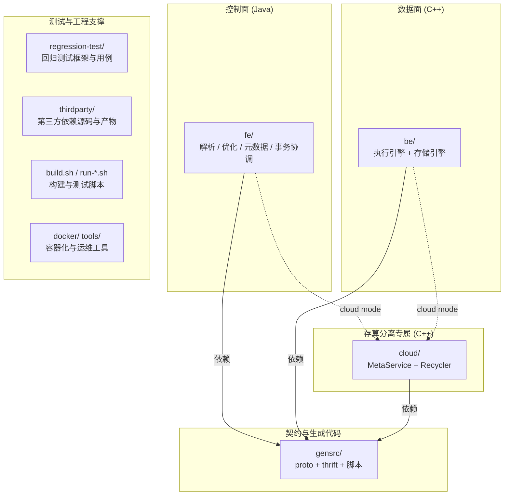

# 第 5 章：源码地图与开发环境

前四章建立的是"读代码"的地图：第 2 章告诉你有 FE/BE/MetaService 三个进程，第 3 章告诉你数据分成 Table→Segment 五层，第 4 章告诉你同一份仓库怎么长出存算一体和存算分离两套形态。但真正打开这份仓库，你会先被它的体量劝退——FE 几十个 Java 包、BE 二十来个源码目录，网上还流传着一堆早已过时的目录结构文章。本章解决的是"从零到能改代码、能跑代码"的最后一公里：**给出一张对得上当前 master 的源码地图，把 build/run/debug/test 四件事按仓库脚本的真实参数走一遍，并主动踩一遍新手最容易栽的编译与配置坑。**

读完本章，你应当能拿到任意一个陌生的类名或目录，30 秒内判断它属于哪个组件、后续哪一部分会深挖它；能独立编出一个 ASAN 集群、拉起单机部署、跑通一个回归用例；能在遇到问题时选对调试手段（日志 / 调试器 / UT / 回归）而不是盲目重启。本章是后续所有部分"动手实验"段的地基——从第二部分起，实验环节不再重复环境说明，只说"按第 5 章编好、拉起集群"，细节都在这里。

本章的行号引用基于当前 master（`git rev-parse --short HEAD` 为 `b9559caa35`）。代码演进会让行号漂移，但目录结构与脚本参数不变；写作时每一处命令都在当前仓库里核实过，未凭记忆或旧资料落笔。

## 5.1 仓库总地图

第一次 `ls` 仓库根目录会看到二十多个目录，但真正需要建立心智模型的只有少数几个。按第 2 章的组件视角，可以把它们归成四类：**控制面**（FE，元数据与调度）、**数据面**（BE，执行与存储）、**契约**（跨组件的 proto/thrift 定义与生成代码）、**测试与工程**（构建脚本、测试框架、第三方依赖）。存算分离的 MetaService（`cloud/`）横跨控制面与契约——它既持有元数据，又是 FE/BE 之间的 RPC 服务端。



逐个看根目录下你会反复打交道的成员：

- **`be/`** —— BE 的 C++ 源码（`be/src/`）与单元测试（`be/test/`）。数据面的一切都在这里。
- **`fe/`** —— FE 的 Java 源码，核心模块是 `fe/fe-core/`；另有 `fe/fe-common/`（FE/BE 共享的配置与常量，全局配置类 `Config` 就在这里）、`fe/be-java-extensions/`（BE 侧用 JNI 调的 Java 扩展，如各类外表 scanner）。
- **`cloud/`** —— 存算分离的 MetaService（C++），入口 `cloud/src/main.cpp`。存算一体集群完全不涉及这个目录。
- **`gensrc/`** —— 跨组件契约的**唯一真源**：`gensrc/proto/`（Protobuf，brpc 用）、`gensrc/thrift/`（Thrift，FE↔BE 计划下发用）、`gensrc/script/`（代码生成脚本）。改任何跨进程接口都从这里动手，编译时生成 Java/C++ 代码。第 2 章 2.5 讲的"两种 RPC 契约"落地就在此。
- **`regression-test/`** —— 回归测试框架（Groovy 编写）与全部用例（`regression-test/suites/`）；配置在 `regression-test/conf/regression-conf.groovy`。这是 Doris 最主要的测试形态。
- **`thirdparty/`** —— 第三方依赖的构建脚本与安装产物（`thirdparty/installed/`）。首次编译前必须先把它准备好，否则 BE 编不过（见 5.7）。
- **`conf/`**、**`bin/`** —— 源码树里的默认配置模板与脚本；编译后会拷进 `output/fe/conf`、`output/be/bin` 等，实际启动用的是 `output/` 下的副本。
- **`docker/`**、**`tools/`**、**`samples/`** —— 容器化编译/运行环境、运维与压测工具（如 `tools/clickbench-tools`）、示例。日常读内核代码用不上，但搭环境和跑基准时会回来。

记住一条主线：**改逻辑去 `be/` 或 `fe/`，改跨进程接口去 `gensrc/`，加测试去 `regression-test/` 或各自的 UT 目录，一切从 `build.sh` 编出到 `output/`。** 下面两节把 `fe/` 和 `be/` 内部再拆细。

## 5.2 FE 源码地图

FE 的核心代码集中在 `fe/fe-core/src/main/java/org/apache/doris/` 下，入口是 `fe/fe-core/src/main/java/org/apache/doris/DorisFE.java`，全局单例是 `fe/fe-core/src/main/java/org/apache/doris/catalog/Env.java`（第 2 章 2.2 已详述）。按"一条 SQL 的一生"的路径顺序，把最该认识的包列出来，每个包后面标出哪一部分会深挖它：

- **`qe/`** —— Query Engine 层，MySQL 协议接入后的会话与执行调度：`ConnectContext`（一次连接的上下文）、`StmtExecutor`（语句执行总入口）、`Coordinator`（Fragment 调度）。查询主线的起点，深挖见 part2 查询的一生。
- **`nereids/`** —— **当前的优化器**，从 SQL 文本到物理计划的全过程：`parser/`（语法解析）、`rules/`（RBO 规则）、`cost/`+`stats/`（CBO 代价与统计）、`trees/`（Plan/Expression 树）。part2 的 Nereids 上/下两章的主战场。
- **`analysis/`** —— 一个**名字会骗人的目录**（见下文 tricky 点）：它曾是旧优化器 AST 的家，但那套 AST 在本 master 已被删除；如今留下的是描述符结构（`DescriptorTable`、`TupleDescriptor`）与 DDL 描述符辅助类（`KeysDesc`、`PartitionDesc`、`ColumnDef` 等），被 Nereids 与 catalog 现役复用。
- **`planner/`** —— 物理计划节点（`PlanNode` 体系，如 `HashJoinNode`、`OlapScanNode`）与 `DataSink`。Nereids 优化完成后，物理算子仍复用这一层的节点类下发给 BE，part2 计划分发章会讲。
- **`catalog/`** —— 元数据的内存对象模型：`Env`、`Database`、`OlapTable`、`Partition`、`Tablet`、`Replica`（第 3 章那套层级的 Java 落地）。part4 元数据与 FE 内核的核心。
- **`persist/`**、**`journal/`** —— 元数据持久化：`journal/` 是 EditLog 抽象（bdbje 实现），`persist/` 是各类操作日志的序列化体。part4 元数据持久化章深挖。
- **`transaction/`** —— 导入事务管理：`GlobalTransactionMgr`、`DatabaseTransactionMgr`，2PC 与 Label 机制。part3 导入的一生。
- **`load/`** —— 各类导入作业的 FE 侧编排（Stream Load、Broker Load、Routine Load 等）。part3。
- **`system/`** —— 集群成员管理：`SystemInfoService`（BE 注册表）、`HeartbeatMgr`（心跳，第 2 章 2.3 讲过）。
- **`clone/`** —— 存算一体的副本调度与修复：`TabletScheduler`、`TabletChecker`。part4 调度体系；存算分离下这一套基本闲置（第 4 章 4.3）。
- **`datasource/`** —— 外部数据源联邦（Catalog 体系：Hive/Iceberg/JDBC 等）。part4 外部数据源章。
- **`mysql/`** —— MySQL 网络协议层的编解码。part2 连接与协议章。
- **`cloud/`** —— 存算分离的 FE 侧全部专属类（`CloudEnv`、`CloudGlobalTransactionMgr` 等，第 4 章 4.4 数过约 50 个类）。读到这个包，默认它只在 cloud mode 生效。

### tricky 点：analysis/ 是个"名字活下来、角色已死"的目录

`analysis/` 这个名字极具误导性——顾名思义它该是"SQL 语义分析"的所在，新手很容易顺着它往下读，以为这就是查询的解析入口。**这个直觉在本 master 上是错的**，而且错得很彻底：`fe/fe-core/src/main/java/org/apache/doris/analysis/` 下有约 74 个文件，但你 `ls` 一遍会发现**一个 `*Stmt.java` 都没有**——`SelectStmt`、`InsertStmt` 这类旧 AST 节点在当前代码里根本不存在。

要理解这个反直觉的现状，得看它的历史。Doris 早期只有一套优化器（业界常称"旧优化器 / Legacy Planner"），它的链路正是从 `analysis/` 里的一套 SQL AST（`SelectStmt` 等）+ 语义合法化开始，再到 `planner/` 生成计划。后来 Nereids 作为全新的 CBO 优化器**另起炉灶**——`nereids/parser/`（语法解析）→ `nereids/rules/`（规则重写）→ `nereids/` 自己的 Plan 树 → `nereids/glue/translator/` 翻译成物理节点下发。两套优化器共存过一段时间，由会话变量 `enable_nereids_planner`（`fe/fe-core/src/main/java/org/apache/doris/qe/SessionVariable.java`）切换；如今 Nereids 早已是默认且唯一路径，**旧优化器连同它那套 `analysis/` 里的 Stmt AST 已被整体删除**。今天真正做查询语义分析的，是 `fe/fe-core/src/main/java/org/apache/doris/nereids/jobs/executor/Analyzer.java`（`public class Analyzer extends AbstractBatchJobExecutor`）——注意它在 `nereids/` 下，和 `analysis/` 毫无关系，只是恰好也叫 Analyzer。

那 `analysis/` 今天到底装了什么？删掉 AST 后，剩下的都是**没有被 Nereids 重写、仍被现役代码复用的数据结构**，分三类：

- **计划翻译用的描述符结构**：`DescriptorTable`、`TupleDescriptor`（`fe/fe-core/src/main/java/org/apache/doris/analysis/DescriptorTable.java`、`fe/fe-core/src/main/java/org/apache/doris/analysis/TupleDescriptor.java`）。Nereids 把物理计划翻译成 Thrift 下发 BE 时直接复用它们——引用方在 `fe/fe-core/src/main/java/org/apache/doris/nereids/glue/translator/PhysicalPlanTranslator.java` 与同目录的 `fe/fe-core/src/main/java/org/apache/doris/nereids/glue/translator/PlanTranslatorContext.java`。这是 `analysis/` 和 `nereids/` 之间唯一实质的连接点。
- **DDL 描述符辅助类**：`KeysDesc`、`PartitionDesc`、`PartitionKeyDesc`、`DistributionDesc`、`ColumnDef` 等 `*Desc` 建表结构。它们不参与查询，服务于 DDL——`fe/fe-core/src/main/java/org/apache/doris/datasource/InternalCatalog.java` 与 Nereids 的建表命令 `fe/fe-core/src/main/java/org/apache/doris/nereids/trees/plans/commands/info/CreateTableInfo.java` 都在用。
- **聚合/排序等计划辅助结构与基类残骸**：`AggregateInfo`、`SortInfo`、`AnalyticWindow` 等，以及 `StatementBase`、`StmtType`、`ParseNode` 这类接口/枚举层面的遗留（它们不是完整 AST，只是没被清理干净的基座）。

**这带来的教训比"两套优化器并存"更普适**：目录名是历史的化石，可能在其原始角色消亡后仍然存在。所以判别法有两条——

1. **别按名字猜职责**：追查询/优化逻辑一律从 `nereids/` 进（入口是上面那个 Nereids 侧的 `Analyzer`，全路径 `fe/fe-core/src/main/java/org/apache/doris/nereids/jobs/executor/Analyzer.java`），只有当 Nereids 或 DDL 代码引用到 `analysis/` 里的某个具体描述符时，才顺着链接跳进去看那一个类，绝不把 `analysis/` 当查询入口通读。
2. **引用类名前先 `ls`/`grep` 核实**：网上大量旧博客还在讲 `SelectStmt`、`OriginalPlanner` 这套已删除的类，照搬会得出对不上代码的结论。这也是本教程的铁律——**任何一个类名、路径，落笔前都在当前 checkout 里确认存在**，而不是凭记忆或旧资料写。

## 5.3 BE 源码地图

BE 的 C++ 源码在 `be/src/` 下，入口 `be/src/service/doris_main.cpp`。按"执行 + 存储"两大职责，把重要目录列出来并标出前向链接：

- **`service/`** —— BE 的对外服务端：brpc 的 `PInternalService`、Thrift 的 `BackendService`、HTTP 服务（`be/src/service/http/`）。FE 下发计划、发心跳、发 HTTP 管理请求都打到这里。
- **`runtime/`** —— 运行时框架：`RuntimeState`（一次执行的上下文）、`FragmentMgr`（Fragment 实例管理）、内存管理（`MemTracker`）。part2 执行、part6 内存管理都会回来。
- **`exec/`** —— 执行算子与 Pipeline 引擎：**Pipeline 就在 `be/src/exec/pipeline/`**（算子调度、依赖驱动），算子在 `be/src/exec/operator/`。part2 Pipeline 执行引擎章的核心。
- **`core/`** —— 列存内存表示的**核心数据结构**：`Block`、`Column`、`DataType`（向量化执行的数据载体）。几乎所有算子都在操作 `core/` 里的对象。
- **`exprs/`** —— 表达式与函数求值。
- **`storage/`** —— **存储引擎**：`StorageEngine`（`be/src/storage/storage_engine.cpp`）、Rowset（`be/src/storage/rowset/`）、Segment 读写（`be/src/storage/segment/`）、Compaction、主键 Delete Bitmap。part5 存储引擎深潜的整个战场。
- **`io/`** —— IO 抽象层：本地文件、远端对象存储、以及存算分离的 File Cache（`be/src/io/cache/`）。part5 File Cache 章。
- **`load/`** —— 导入的 BE 侧：MemTable、Segment flush、各类 sink。part3 导入的一生。
- **`agent/`** —— BE 与 FE 的代理层：`be/src/agent/heartbeat_server.cpp`（第 2 章 2.3 的心跳落点）、执行 FE 下发的 tablet task。
- **`cloud/`** —— 存算分离的 BE 侧专属逻辑（`CloudStorageEngine`、`CloudTablet` 等，第 4 章 4.4）。
- **`common/`**、**`util/`** —— 配置（`be/src/common/config.cpp`）、日志、通用工具。

### 重点提示：本 master 与旧资料的目录差异（校准网上旧文章）

Doris 的 BE 目录在近几年做过一轮大重构，**网上绝大多数博客/教程里的路径都已失效**。读旧资料时按下面这张对照表校准，否则你会照着旧路径 `find` 半天找不到文件：

| 旧资料里的路径 | 当前 master 的真实位置 | 说明 |
| --- | --- | --- |
| `be/src/olap/` | `be/src/storage/` | 存储引擎整体从 `olap` 改名到 `storage`；本 master **已无 `be/src/olap/`** |
| `be/src/vec/` | `be/src/core/`（数据结构）+ `be/src/exec/`（算子） | 旧的向量化 `vec` 目录被拆开：`Block`/`Column`/`DataType` 进 `core/`，算子进 `exec/`；本 master **已无 `be/src/vec/`** |
| `be/src/exec/`（旧的行式算子） | `be/src/exec/pipeline/` + `be/src/exec/operator/` | Pipeline 执行引擎落在 `exec/pipeline/`，不在某个独立的 `be/src/pipeline/`（该目录不存在） |
| Rowset/Segment 散落 | `be/src/storage/rowset/`、`be/src/storage/segment/` | 收敛到 `storage/` 子目录下 |

一个可操作的自保习惯：**看到旧文章引用 `be/src/olap/xxx` 或 `be/src/vec/xxx`，先 `ls be/src/storage`、`ls be/src/core` 找对应物，再继续读**——路径变了，但类名和职责大多沿用，对着新目录能把旧文章的逻辑接上。

## 5.4 编译与运行

所有构建命令以仓库根 `AGENTS.md` 为准，本节只讲最常用的组合与其中的坑。

### 编译

最常用的一条命令，同时编 BE 和 FE：

```bash
./build.sh --be --fe
```

`build.sh` 的选项（`build.sh` 的 `usage()`）：`--be`/`--fe` 分别编后端/前端（默认都开），`--cloud` 编 MetaService（默认关，只有搭存算分离才需要），`--clean` 清理后重编。产物统一输出到当前目录的 **`output/`** 下（`output/fe/`、`output/be/`，若编了 cloud 则还有 `output/ms/`）。

### BUILD_TYPE：ASAN vs RELEASE 的易错点

这是新手最容易配错、且配错后果很隐蔽的一处。构建类型由环境变量 `BUILD_TYPE` 决定，`build.sh` 里的默认回退是 `CMAKE_BUILD_TYPE="${BUILD_TYPE:-Release}"`（`build.sh:800`）——**也就是说，如果你什么都不设，脚本编出来的是 RELEASE 版**。

但 `AGENTS.md` 规定的开发约定恰恰相反：**日常开发一律用 ASAN（AddressSanitizer），只有明确做性能测试时才切 RELEASE**。这两者不矛盾，衔接点在 custom_env.sh——`env.sh` 会在存在时自动 source 它。所以正确做法是在仓库根手动创建 custom_env.sh（该文件本地创建、不入库），写入：

```bash
export BUILD_TYPE=ASAN
```

之后 `./build.sh --be --fe` 就编 ASAN 版了。为什么开发要用 ASAN？因为它在运行时插桩检测内存越界、use-after-free、泄漏等问题，能让内存 bug 在第一现场崩溃并打出精确堆栈（5.6 的实验会用到），而不是在几百行之外莫名其妙地数据错乱。**代价是显著的**：ASAN 版的运行速度约为 RELEASE 的 1/2 到 1/3、内存占用翻倍甚至更多，构建产物也更大、编译更慢。所以做 benchmark、压测、看真实性能数字时，必须切回 RELEASE——**拿 ASAN 版跑出来的性能数字是没有意义的**，这是另一个常见误区。

ASAN 还会 source 仓库根 `conf/` 下的抑制文件（`conf/asan_suppr.conf`、`conf/lsan_suppr.conf`）来屏蔽已知的第三方误报，遇到 ASAN 报告时可以对照这些文件判断是不是被主动忽略的噪声。

### 运行：单机集群

编译完成后拉起单机集群的完整步骤，第 2 章 2.6 实验一已经手把手走过一遍（配置 `priority_networks` → 用 `--daemon` 后台启动 FE 与 BE（脚本在 `output/fe/bin`、`output/be/bin` 下）→ 连 9030 端口 `ALTER SYSTEM ADD BACKEND`），这里不重复，只强调三个每次都会遇到的点：

- **`priority_networks` 必须匹配本机网卡网段**，`output/fe/conf/fe.conf` 与 `output/be/conf/be.conf` 都要配。配错网段导致 BE 死活加不进集群（`Alive` 恒为 `false`）是真实部署第一高频坑——完整的复现与日志形态见第 2 章 2.6 实验二，本章不再展开。
- **端口冲突**：一台机器上跑多个实例（或多个 worktree）时，`fe.conf` 的 `query_port`(9030)/`http_port`(8030)/`rpc_port`(9020)/`edit_log_port`(9010) 与 `be.conf` 的 `be_port`(9060)/`heartbeat_service_port`(9050)/`webserver_port`(8040)/`brpc_port`(8060) 必须整体错开，否则进程起不来。
- **启动慢是预期行为**：`AGENTS.md` 明确要求"至少等 30 秒"，尤其 ASAN 版更慢。别看到 `SHOW BACKENDS` 还没 Alive 就急着重启——先去 `output/fe/log/fe.log`、`output/be/log/be.INFO` 看有没有报错，没有报错就继续等。

### 双模式：存算分离环境的额外成本

上面这套 `--be --fe` + 单机部署，搭出来的是**存算一体**集群——这也是本教程绝大多数动手实验的运行底座，原因是它零外部依赖、拉起最快。**存算分离（cloud mode）集群要重得多**，环境搭建路径在三处分叉：

- **编译多一步**：除了 `--be --fe`，还要 `./build.sh --cloud` 编出 MetaService（产物在 `output/ms/`，入口 `cloud/src/main.cpp`）；存算一体完全不需要这一步。
- **多两个外部依赖**：必须额外部署一套 **FoundationDB**（元数据与事务的权威存储）和一套**对象存储**（本地开发常用 MinIO 顶替 S3 存放 Segment 数据），二者都是存算一体不存在的组件。
- **多一层配置**：BE/FE 要在 conf 里配 `deploy_mode = cloud` 与 `meta_service_endpoint` 指向 MetaService，还要在集群里创建 **Storage Vault**（对象存储的挂载点）才能建表写数据。

正因为这套依赖链显著更长，**本教程把存算分离集群的完整搭建放到 part4 的 MetaService 实验里**，与 FoundationDB 的数据布局一起动手；第一部分到第三部分的实验默认都在存算一体集群上做。你现在只需记住：手上这个 `output/` 是存算一体的，想验证 cloud mode 的行为差异时，回到 part4 按那里的步骤补齐 FDB 与对象存储。

## 5.5 调试手段矩阵

内核开发有四种调试手段，各有适用场景。选错手段会事倍功半——比如想看一次查询的执行细节却去 attach gdb，远不如调高日志级别来得快。

### a. 日志：最先该动的手段

FE 用 log4j，BE 用 glog。默认级别都是 `INFO`：

- **BE**：`sys_log_level`（`be/src/common/config.cpp:286`）控制全局级别，`sys_log_verbose_modules`（`be/src/common/config.cpp:292`）可对指定模块开 VLOG 详细日志；日志落在 `output/be/log/be.INFO`。
- **FE**：`sys_log_level`（`fe/fe-common/src/main/java/org/apache/doris/common/Config.java:71`）；日志在 `output/fe/log/fe.log`。

关键在于**运行时动态调整、不用重启**：

- BE：`POST /api/update_config`（路由注册在 `be/src/service/http_service.cpp:260`，处理逻辑 `be/src/service/http/action/config_action.cpp:89` 的 `handle_update_config`）。例如临时把日志调到 DEBUG：

  ```bash
  curl -X POST "http://127.0.0.1:8040/api/update_config?sys_log_level=DEBUG"
  ```

- FE：`GET /api/_set_config`（`fe/fe-core/src/main/java/org/apache/doris/httpv2/rest/SetConfigAction.java:58`）：

  ```bash
  curl "http://127.0.0.1:8030/api/_set_config?sys_log_level=DEBUG"
  ```

线上排查慢查询、导入失败时，临时对相关模块调高日志级别，是成本最低、信息量最大的第一步。

### b. 调试器：定位崩溃与死循环

当问题是崩溃、死锁、逻辑走到了意料之外的分支时，日志不够用，要上调试器：

- **BE（C++）**：BE 是长驻进程，用 `gdb -p <pid>`（Linux）或 `lldb -p <pid>`（macOS）attach 到运行中的进程，配合 `output/be/log/be.out` 里崩溃时打印的堆栈定位。ASAN 版崩溃时会直接在 `be.out` 打出带符号的堆栈，多数情况下不必再手动 attach。
- **FE（Java）**：FE 是 JVM 进程，用 IDE 远程调试——在 `output/fe/conf/fe.conf` 里给 `JAVA_OPTS` 加上 JDWP 参数（`-agentlib:jdwp=transport=dt_socket,server=y,suspend=n,address=5005`），重启 FE 后用 IntelliJ IDEA 的 Remote JVM Debug 连 5005 端口，就能在 `fe/fe-core` 的 Java 源码上打断点。这是追 FE 侧优化器、事务逻辑最直观的手段——比反复加日志重启快得多，尤其适合逐步跟踪 Nereids 的规则改写这类多步骤流程。

调试器最能发挥价值的场景是"日志说不清、只能看现场变量"的问题：比如某个查询走进了意料之外的执行分支，在 `nereids/rules/` 的规则应用处打个断点，单步看 Plan 树怎么被改写，比在几十条日志里大海捞针高效得多。

### c. 单元测试（UT）：验证单个函数/类

改了 BE 的某个工具函数或类，最快的验证是跑对应 UT，不必拉整个集群。参数严格按脚本 `usage()`：

- **BE UT**（`run-be-ut.sh`）：`--run` 编译并运行，`--filter=` 用 gtest 过滤器指定用例（`run-be-ut.sh` 的 `--run --filter=xx`）：

  ```bash
  ./run-be-ut.sh --run --filter=BitUtil.*          # 跑 BitUtil 测试套件
  ./run-be-ut.sh --run --filter=BitUtil.Ceil       # 只跑其中一个用例
  ```

  gtest 结果 xml 在 `be/ut_build_ASAN/gtest_output/`（`run-be-ut.sh` 头注释）。BE 所有测试文件必须以 `_test` 结尾并登记进 `be/test/CMakeLists.txt`。

- **FE UT**（`run-fe-ut.sh`）：`--run` 后跟全限定类名（`run-fe-ut.sh` 的 `usage()`）：

  ```bash
  ./run-fe-ut.sh --run org.apache.doris.utframe.DemoTest
  ./run-fe-ut.sh --run 'org.apache.doris.utframe.DemoTest#testCreateDbAndTable+test2'   # 指定方法
  ```

### d. 回归测试：端到端验证一个特性

回归测试是 Doris 最主要的测试形态，走真实的 SQL 链路（连 FE、下发 BE、对比结果）。用 `run-regression-test.sh`，按 `AGENTS.md` 的规范**同时用 `-d` 指定父目录、`-s` 指定用例名**以缩小范围加速：

```bash
./run-regression-test.sh --run -d query_p0/aggregate -s array_agg
```

其中 `-d` 是 `regression-test/suites/` 下的目录，`-s` 是 groovy 文件里 `suite("xxx")` 的那个名字。运行前需要一个已拉起的集群，并在 `regression-test/conf/regression-conf.groovy` 里把 `jdbcUrl` 等端口配成你集群的实际端口。

**手段选择速记**：看执行细节/线上排查 → 先调日志（a）；崩溃/死锁 → 调试器（b）；验证一个函数改动 → UT（c）；验证一个完整特性/防回归 → 回归测试（d）。

## 5.6 动手实验

本章实验有两个目的：一是**验证核心点**——把 build → 单机集群 → 回归用例这条主流程完整走通，这是后续所有部分动手实验的前置条件；二是**主动踩一遍易错点**——故意改断一个 BE UT 的断言，练会读 ASAN 失败输出（定位到行、看堆栈），这是后续每一章"踩坑实验"都要用到的基本功。

### 实验一（核心）：跑通主流程

```bash
# 1. 准备 ASAN 构建（首次需先备好 thirdparty，见 5.7）
echo 'export BUILD_TYPE=ASAN' > custom_env.sh
./build.sh --be --fe

# 2. 配置 priority_networks 后拉起单机集群（详见第 2 章 2.6）
#    改 output/fe/conf/fe.conf、output/be/conf/be.conf 的 priority_networks
output/fe/bin/start_fe.sh --daemon
output/be/bin/start_be.sh --daemon
# 连 9030、ALTER SYSTEM ADD BACKEND，等 SHOW BACKENDS 的 Alive=true

# 3. 配好 regression-test/conf/regression-conf.groovy 的端口后，跑一个回归用例
./run-regression-test.sh --run -d query_p0/aggregate -s array_agg
```

看到用例 `PASS` 输出，就说明你的编译、部署、测试链路整个通了。这条链路后续每一部分都会复用。

### 实验二（踩坑）：改断一个断言，学会读 ASAN/gtest 失败输出

选一个最简单、无外部依赖的 BE UT——`be/test/util/bit_util_test.cpp` 里的 `TEST(BitUtil, Ceil)`。它验证向上取整函数，其中一行断言（`be/test/util/bit_util_test.cpp:43`）是：

```cpp
EXPECT_EQ(BitUtil::ceil(9, 8), 2);   // 9 除以 8 向上取整 = 2，正确
```

**故意改断它**：把期望值 `2` 改成 `3`：

```cpp
EXPECT_EQ(BitUtil::ceil(9, 8), 3);   // 故意写错
```

然后只跑这个用例：

```bash
./run-be-ut.sh --run --filter=BitUtil.Ceil
```

你会看到 gtest 打出类似这样的失败输出：

```
[ RUN      ] BitUtil.Ceil
.../be/test/util/bit_util_test.cpp:43: Failure
Expected equality of these values:
  BitUtil::ceil(9, 8)
    Which is: 2
  3
[  FAILED  ] BitUtil.Ceil
```

**练习读法**：第一行 `be/test/util/bit_util_test.cpp:43: Failure` 直接给出**出错文件与行号**——这是定位的起点；下面 `Which is: 2` vs `3` 告诉你**实际值与期望值**的差异。这是 gtest 断言失败的标准形态。而如果你改的不是断言、而是让代码真的越界访问（比如数组下标写越界），ASAN 会额外打出一段 `ERROR: AddressSanitizer: heap-buffer-overflow ...` 加一整条调用栈，栈顶就是越界发生的确切函数和行——**读 ASAN 栈的关键是从栈顶往下找第一个属于 Doris 源码（`be/src/...`）的帧**，那通常就是问题现场。

**改回去**：把 `3` 恢复成 `2`，重跑确认 `PASS`。这个练习看似无聊，但它训练的是每一次内核开发都要做的事——**看到失败输出，第一眼抓文件:行号，第二眼看实际 vs 期望或 ASAN 栈顶**，而不是从头重跑猜原因。后续章节的踩坑实验都建立在这套读法之上。

## 5.7 排查清单

环境搭建阶段的问题高度集中，按"编译失败"和"启动失败"两类给出定位路径。

### 症状 A：编译失败

- **thirdparty 缺失 / 未编译**：BE 编译报找不到某个第三方头文件或库（`TP_INCLUDE_DIR`/`TP_LIB_DIR` 指向的 `thirdparty/installed/` 为空）。根因是首次编译前没准备第三方依赖。定位：检查 `thirdparty/installed/` 是否存在且非空；解决：按官方文档执行 `thirdparty/build-thirdparty.sh`（或用 `docker/` 下的预置编译镜像，里面已带好 thirdparty）。
- **git 子模块未初始化**：报某些源码目录为空或缺文件。Doris 依赖若干 git submodule，克隆时若没带 `--recursive`，需补跑 `git submodule update --init --recursive`。
- **内存不足 (OOM) 被 Killed**：编译中途进程被系统 kill，`dmesg` 里有 OOM 记录。BE 是重型 C++ 工程，并行编译吃内存很凶。解决：给 `build.sh` 降低并行度（减小 `-j`/`PARALLEL`），或加大机器内存/swap。
- **clang-format / checkstyle 失败**：这不是编译错误而是风格检查（`build.sh --fe` 会触发 checkstyle）。按 `AGENTS.md` 用 `build-support/clang-format.sh`（BE）或按 checkstyle 报告（FE）修复。

### 症状 B：启动失败

- **先看日志，而不是重启**：FE 起不来看 `output/fe/log/fe.log` 与 `output/fe/log/fe.out`；BE 起不来看 `output/be/log/be.INFO` 与 `output/be/log/be.out`（崩溃堆栈通常在 `.out` 里）。
- **端口被占用**：日志里出现 `bind` 失败 / `Address already in use`。根因是 5.4 列的那组端口与其它进程冲突。解决：改 `output/{fe,be}/conf/` 里的端口后重启。
- **`priority_networks` 配错**：进程本身可能起来了，但 BE 加不进集群（`Alive` 恒 false），`be.INFO` 里有 `not equal to backend localhost` 类日志。这是第 2 章 2.6 实验二的坑，完整定位见那里。
- **JAVA_HOME / JDK 版本不对**：FE 起不来且 `fe.out` 报 Java 相关错误。核对 `JAVA_HOME` 指向的 JDK 版本符合当前 master 要求。

---

本章把第一部分从"读代码"推进到"改代码、跑代码"：5.1 给出按控制面/数据面/契约/测试分组的仓库总地图，5.2、5.3 分别拆解 FE 与 BE 的内部目录并逐个标注后续深挖的部分——同时校准了两处最坑人的历史包袱（FE 的 `analysis/` 半退役、BE 的 `olap`/`vec` 目录早已改名）。5.4 讲清了 `./build.sh --be --fe` 与 ASAN/RELEASE 的取舍（脚本默认 Release、开发约定 ASAN，靠 custom_env.sh 衔接），5.5 给出日志/调试器/UT/回归四种手段的选择矩阵与真实命令，5.6 用"跑通主流程 + 改断一个断言学读失败输出"的双目的实验把这些串起来。至此第一部分完结——你已经有了组件、数据模型、双模式、以及一套能自己编译调试的开发环境这四块地基。下一部分《一条查询 SQL 的一生》将从 MySQL 协议接入的第一行代码开始，沿着 5.2 列出的 `qe/` → `nereids/` → `planner/` 路径，走完一次查询的完整执行链路。
