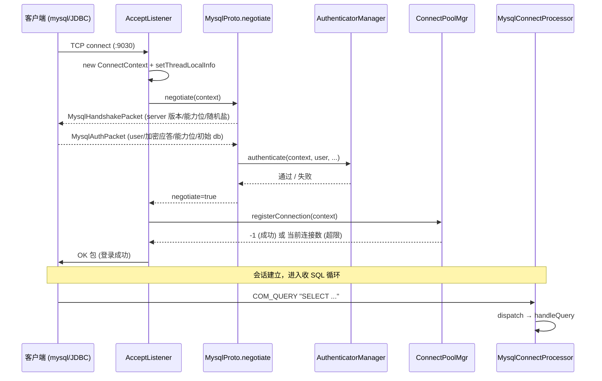

# 第 1 章：连接与协议 —— 查询的入口

第一部分把 Doris 拆成了 FE/BE/MetaService 三个进程、五层数据模型和两套形态，那是一张"系统长什么样"的静态地图。从本部分起，我们换一个视角：跟着**一条 SELECT** 走一遍，看它从客户端敲下回车、到结果集回到屏幕上，中间经过了哪些对象、做了哪些决定。这一部分是纵向的执行链路，而本章负责链路的最前端——**连接是怎么建立的、SQL 文本是通过什么协议进 FE 的、进来之后又交给谁**。

读完本章，你应当能回答三件事：为什么一个分析型数据库要去兼容 MySQL 的线协议；一个连接从 TCP `accept` 到能收 SQL，中间的握手、认证、限流各由哪个对象把关；以及一条 `COM_QUERY` 命令是怎么被分发、最终落到 `StmtExecutor` 手上的。`ConnectContext` 和 `StmtExecutor` 这两个锚点会贯穿整个第二部分——后面每一章几乎都是从 `StmtExecutor` 往下接力。

本章的行号引用基于写作时核实所用的 HEAD（`c8a44b8eee`，源码树与系列基线 `7bc98f696f` 一致）。代码演进会让行号漂移，但对象名与结构不变；写作时每一处 `路径:行号` 都在当前代码里核实过。

## 1.1 问题：分析型数据库拿什么协议见客户端

**遇到了什么问题？** 一个数据库要能用，第一步不是查得快，而是**客户端连得上**。用户手里的工具五花八门：命令行 client、JDBC/ODBC 驱动、各种 BI 报表软件（Tableau、Superset、DataGrip）。数据库必须先定义一套"线协议"（wire protocol）——TCP 之上的字节格式，规定怎么握手、怎么认证、怎么把一条 SQL 和一个结果集编码成字节流。这套协议一旦定了，整个客户端生态就被它框住了。

**有哪些候选、各有什么优劣？**

- **候选一：自己发明一套协议。** 优点是完全自主，协议可以贴着自己的执行引擎设计、按需演进。代价是致命的——你得为每一种语言、每一个 BI 工具重写驱动，还要说服第三方厂商适配你。一个新数据库最缺的就是这个生态启动的时间窗口。ClickHouse 早期就是自定义 TCP 协议起家，后来不得不额外补上 MySQL/PostgreSQL 兼容层，正是被这个问题倒逼的。
- **候选二：只提供 HTTP/REST 或专属 JDBC 驱动。** HTTP 通用、穿透性好、调试方便，做导入接口很合适。但它不是为"交互式查询会话"设计的：没有连接内的会话状态（当前库、session variable、事务），每次请求都要自带全部上下文；更关键的是，绝大多数 BI 工具默认不会走你的私有 HTTP 端点，它们只认标准数据库协议。只给 JDBC 驱动同理——覆盖不了 ODBC-only 的工具链。
- **候选三：兼容一套已经赢得生态的成熟协议。** MySQL 协议是最优选——它是数据分析领域事实上的通用语，几乎每一个 BI/ETL 工具、每一种编程语言都自带成熟的 MySQL 驱动。兼容它，等于把整个 MySQL 客户端生态**免费**接过来。

**Doris 怎么考量和解决的？** Doris 选了候选三，并叠加候选二做补充。收益很直接：`mysql` 命令行、JDBC/ODBC、BI 工具无需任何适配即可直连，生态成本几乎为零。代价也要认清——**MySQL 协议的握手包格式、认证挑战-应答（challenge-response）、能力位（capability flags）、字符集与结果集编码细节，全部要照抄一遍**，一个字节错位客户端就连不上；而且协议本身的演进节奏被上游 MySQL 锁死，Doris 只能跟随、不能自定义扩展握手语义。这种"协议锁死"是兼容策略必须吞下的成本：想给协议加一个字段，得看 MySQL 客户端认不认。

于是 Doris 做了**分工**：**MySQL 协议（`query_port`，默认 9030）专门承载交互式查询会话**——它天然带连接级会话状态，适合"连上、设库、发一串 SQL、拿结果"的模式；而**大吞吐、无会话状态的旁路走 HTTP**——最典型的是 Stream Load 导入（走 FE/BE 的 HTTP 端口），用 HTTP chunked 传输海量数据、天然适配 chunked 上传和 HTTP 负载均衡，这类"灌数据"的场景根本不需要 MySQL 协议那套会话语义，硬塞进 9030 反而受限于单连接吞吐。两条通道各司其职：MySQL 端口管"问答"，HTTP 端口管"灌数据"。除此之外还有第三条旁路——**Arrow Flight SQL**（`arrow_flight_sql_port`，`fe/fe-common/src/main/java/org/apache/doris/common/Config.java:471`，默认 8070），它用列式的 Arrow 格式高吞吐地拉结果集，专治 MySQL 协议逐行编码在大结果集下的低效；它的连接同样在 FE 侧登记（`ConnectScheduler` 里另有一套 `FlightSqlConnectPoolMgr`）。三条通道对应三种诉求：交互式问答、批量灌入、大结果集高速拉取。本章只走 MySQL 这条查询主干，它承载了绝大多数交互式 SELECT。

## 1.2 源码走读：从 accept 到 ConnectContext

FE 的 MySQL 服务由 `MysqlServer`（`fe/fe-core/src/main/java/org/apache/doris/mysql/MysqlServer.java:41`）拉起。它基于 XNIO 的 NIO 框架：构造时传入 `query_port`（配置项在 `fe/fe-common/src/main/java/org/apache/doris/common/Config.java:468`，默认 `9030`），`start()`（`fe/fe-core/src/main/java/org/apache/doris/mysql/MysqlServer.java:69`）里 `createStreamConnectionServer` 在该端口上监听、`resumeAccepts()` 开始收连接，成功后打印 `Open mysql server success on {port}`。真正处理新连接的回调是 `AcceptListener`——这是本节的主角。

这一段整体是"NIO 服务器 + 回调监听器"的标准骨架，属于**显而易见**的部分，不逐行展开。要抠的是每个新连接进来后 `AcceptListener` 的 `handleConnection` 里那条**建连流水线**（`fe/fe-core/src/main/java/org/apache/doris/mysql/AcceptListener.java:89`），它把一个裸 TCP 连接变成一个"可以收 SQL 的会话"，顺序是固定的四步：

1. **创建会话容器并绑线程。** 每接受一个连接就 `new ConnectContext(connection)`（`fe/fe-core/src/main/java/org/apache/doris/mysql/AcceptListener.java:66`），随后 `context.setThreadLocalInfo()`（`fe/fe-core/src/main/java/org/apache/doris/mysql/AcceptListener.java:92`）把这个 `ConnectContext` 绑到当前线程上。
2. **协议协商（握手 + 认证）。** 调用 `MysqlProto.negotiate(context)`（`fe/fe-core/src/main/java/org/apache/doris/mysql/AcceptListener.java:108`），失败直接抛异常清理连接。
3. **限流登记。** `connectScheduler.getConnectPoolMgr().registerConnection(context)`（`fe/fe-core/src/main/java/org/apache/doris/mysql/AcceptListener.java:111`）把连接登记进连接池，同时做两层配额检查。
4. **进入收 SQL 循环。** 通过后 `new MysqlConnectProcessor(context)` 并 `context.startAcceptQuery(processor)`（`fe/fe-core/src/main/java/org/apache/doris/mysql/AcceptListener.java:135`），此后这个连接上的每个数据包都会触发 `ReadListener` 的 `handleEvent`（`fe/fe-core/src/main/java/org/apache/doris/mysql/ReadListener.java:45`）再到 `processOnce()`。

这里要理解的一个结构性选择是 **NIO reactor 线程模型**，它直接决定了上面 tricky 点里"线程绑定"为什么必须反复做。FE 没有用"一个连接一个线程"的老式模型（几千个空闲连接就会拖垮线程数），而是分成两级：少量 **IO 线程**（`mysql_service_io_threads_num`，`fe/fe-common/src/main/java/org/apache/doris/common/Config.java:474`，默认 4）只负责监听读事件、不做业务；真正处理一条 SQL 的活派给一个**任务线程池**（`max_mysql_service_task_threads_num`，`fe/fe-common/src/main/java/org/apache/doris/common/Config.java:477`）。看 `ReadListener` 的 `handleEvent`（`fe/fe-core/src/main/java/org/apache/doris/mysql/ReadListener.java:45`）就清楚了：IO 线程收到读事件后先 `suspendAcceptQuery()`（避免同一连接被多个任务线程重复唤醒），再把 `processOnce()` 丢进任务线程池异步执行——而任务线程里做的第一件事就是 `ctx.setThreadLocalInfo()`、`finally` 里 `ConnectContext.remove()`。**这就是关键**：因为处理同一个连接的可能是任务线程池里不同的线程，`ConnectContext` 必须在每次进任务线程时重新绑、退出时清理，绝不能假设"同一个连接一直在同一个线程上"。tricky 点一之所以是坑，正是这个模型的直接后果。

下面这张时序图把握手到第一条 `COM_QUERY` 的字节交换画出来：



**握手与认证的落点。** `MysqlProto.negotiate`（`fe/fe-core/src/main/java/org/apache/doris/mysql/MysqlProto.java:101`）是协议细节的集中地。第一步构造 `MysqlHandshakePacket` 发给客户端（`fe/fe-core/src/main/java/org/apache/doris/mysql/MysqlProto.java:108`）：包里带着服务器版本、能力位，以及一段用于挑战的随机盐——`MysqlHandshakePacket` 声明的认证插件是 `mysql_native_password`（`fe/fe-core/src/main/java/org/apache/doris/mysql/MysqlHandshakePacket.java:34`），随机盐由 `MysqlPassword.createRandomString` 生成（`fe/fe-core/src/main/java/org/apache/doris/mysql/MysqlHandshakePacket.java:42`）。这套挑战-应答的意义在于**明文密码永不过线**：客户端用随机盐和密码哈希算出一个应答，服务端用本地存的密码哈希 `checkScramble` 验证（`fe/fe-core/src/main/java/org/apache/doris/mysql/MysqlPassword.java:231`）。第二步读回客户端的 `MysqlAuthPacket`（`fe/fe-core/src/main/java/org/apache/doris/mysql/MysqlProto.java:195`），校验能力位兼容后解析出用户名，最后把认证委托给 `Env.getCurrentEnv().getAuthenticatorManager().authenticate(...)`（`fe/fe-core/src/main/java/org/apache/doris/mysql/MysqlProto.java:221`）。

认证不是写死的：`AuthenticatorManager`（`fe/fe-core/src/main/java/org/apache/doris/mysql/authenticate/AuthenticatorManager.java:64`）按配置 `authentication_type`（`fe/fe-common/src/main/java/org/apache/doris/common/Config.java:2853`，默认 `default`）选择认证器——`default`（内置密码库）或 `ldap`（外部目录认证），插件化结构就在 `fe/fe-core/src/main/java/org/apache/doris/mysql/authenticate/` 目录下。此外，若开启了 SSL（`MysqlProto.SERVER_USE_SSL`，`fe/fe-core/src/main/java/org/apache/doris/mysql/MysqlProto.java:44`，由 `enable_ssl`/`enable_tls` 决定），且客户端在能力位里请求了 TLS，`negotiate` 会在读认证包之前先把 channel 升级成加密通道。认证成功后 `negotiate` 还会顺带切初始 catalog 和初始 db。

### tricky 点一：ConnectContext 是线程绑定的会话容器

`ConnectContext` 是整条查询链路里最容易被误用的对象。它持有一次连接的**全部会话状态**：当前库、`currentUserIdentity`、`SessionVariable`（所有 `set` 出来的会话变量）、事务状态、`MysqlChannel`（读写字节的通道）。链路上任何地方要读会话变量、拿当前用户，都是 `ConnectContext.get().getSessionVariable()`（`getSessionVariable` 在 `fe/fe-core/src/main/java/org/apache/doris/qe/ConnectContext.java:736`）。

关键在于它是**线程绑定**的。`ConnectContext.get()`（`fe/fe-core/src/main/java/org/apache/doris/qe/ConnectContext.java:341`）取的不是参数、不是全局单例，而是**当前线程上挂着的那个** context——它委托给 `MoreFieldsThread` 的 `getConnectContext()`。`MoreFieldsThread`（`fe/fe-core/src/main/java/org/apache/doris/nereids/util/MoreFieldsThread.java:30`）是 `Thread` 的子类，直接把 `connectContext` 存成线程对象的字段（`fe/fe-core/src/main/java/org/apache/doris/nereids/util/MoreFieldsThread.java:35`，注释写明"so we can access the thread fields faster than ThreadLocal"），比标准 `ThreadLocal` 查得快；对非 `MoreFieldsThread` 的线程则回退到一个 `ThreadLocal` 兜底。绑定发生在 `setThreadLocalInfo()`（`fe/fe-core/src/main/java/org/apache/doris/qe/ConnectContext.java:613`），解绑在 `ConnectContext.remove()`（`fe/fe-core/src/main/java/org/apache/doris/mysql/AcceptListener.java:156` 的 `finally` 里，保证连接处理线程退出时一定清理）。

**错写/误配会怎样？** 因为是隐式线程绑定，一旦你把一段逻辑丢到**另一个线程**（比如自己起线程池做并发预处理），那个线程上 `ConnectContext.get()` 会返回 `null` 或者——更危险——返回该线程上一次会话残留的 context，导致读到**别的连接**的 session variable、用**错误的用户身份**做权限判断。会话变量的读写之所以必须一律走 `ConnectContext`、而不是缓存到某个字段里跨线程传，正是为了让"当前会话"这个语义始终锚定在正确的线程上下文；顺带一提，会话级变量和全局变量也都由 `SessionVariable` 统一收口，`set` 的作用域取决于是否带 `GLOBAL`。跨线程用时必须显式把 context 传过去并在目标线程上重新 `setThreadLocalInfo()`，用完 `remove()`。忘了这一点的 bug 往往表现为"偶发的、别人的会话变量串台"，极难复现——因为它只在线程被复用且恰好没清理时才触发。

### tricky 点二：两层连接限流，打满后的现象要会认

`registerConnection`（`fe/fe-core/src/main/java/org/apache/doris/qe/ConnectPoolMgr.java:63`）做的是**两层**配额检查，两层都过才算登记成功：

1. **实例级总量**：`numberConnection.incrementAndGet() > maxConnections`（`fe/fe-core/src/main/java/org/apache/doris/qe/ConnectPoolMgr.java:64`）。`maxConnections` 来自配置 `qe_max_connection`（`fe/fe-common/src/main/java/org/apache/doris/common/Config.java:772`，默认 `1024`）——这是整个 FE 实例的连接上限。
2. **单用户配额**：`conns.incrementAndGet() > ctx.getEnv().getAuth().getMaxConn(user)`（`fe/fe-core/src/main/java/org/apache/doris/qe/ConnectPoolMgr.java:71`）。每个用户单独计数，上限来自用户属性 `max_user_connections`（`fe/fe-core/src/main/java/org/apache/doris/mysql/privilege/UserProperty.java:56`，默认 `100`），可用 `SET PROPERTY FOR 'user' 'max_user_connections' = 'N'` 调整。两层的意义是：`qe_max_connection` 防止单个 FE 实例被连接总量压垮，`max_user_connections` 防止某一个用户/应用把配额全占光饿死其他用户。

**这里有一个读代码时极易看反的返回值约定**：`registerConnection` **成功时返回 `-1`**（`fe/fe-core/src/main/java/org/apache/doris/qe/ConnectPoolMgr.java:77`），任一层超限时先把计数器减回去、再返回**当前连接数**（`fe/fe-core/src/main/java/org/apache/doris/qe/ConnectPoolMgr.java:66` 与 `:74`）。所以 `AcceptListener` 里的判断是 `if (res == -1)` 才是**成功**分支；`else` 分支才是超限——它会 `setError(ERR_TOO_MANY_USER_CONNECTIONS, ...)`、给客户端回一个错误包、然后抛异常断开（`fe/fe-core/src/main/java/org/apache/doris/mysql/AcceptListener.java:118` 附近）。如果你顺着"返回值大于 0 = 成功"的直觉去读，会把成功和失败两条分支完全对调。

**打满后的现象**：新连接**能完成 TCP 握手、能走完 MySQL 认证**，但紧接着收到一个明确的错误——`Reach limit of connections. Total: X, User: Y, Current: Z`（错误码 `ERR_TOO_MANY_USER_CONNECTIONS`，即 MySQL 的 1203），随后连接被服务端主动关闭。**误判方向**：这个现象很容易被当成"网络抖动"或"FE 假死"去排查防火墙、去重启——但它其实是限流在正常工作。区分点很清晰：网络故障通常连不上端口或握手阶段就超时，而限流是**认证通过之后**才拒绝、且带着上面那句结构化错误文本。看到这句 `Reach limit of connections` 就该去查 `qe_max_connection` 和该用户的 `max_user_connections`，而不是去 ping 网络。

## 1.3 源码走读：COM_QUERY 分发与 StmtExecutor

连接进入收 SQL 循环后，每个命令包都会走到 `MysqlConnectProcessor.processOnce()`（`fe/fe-core/src/main/java/org/apache/doris/qe/MysqlConnectProcessor.java:385`）再到 `dispatch()`（`fe/fe-core/src/main/java/org/apache/doris/qe/MysqlConnectProcessor.java:243`）。`dispatch` 读出命令字节、转成 `MysqlCommand` 枚举（`fe/fe-core/src/main/java/org/apache/doris/mysql/MysqlCommand.java:27`），然后一个大 `switch` 分发：`COM_INIT_DB` 切库、`COM_PING` 心跳、`COM_QUIT` 断开……我们关心的 **`COM_QUERY`（携带 SQL 文本的命令）走 `handleQuery()`**（`fe/fe-core/src/main/java/org/apache/doris/qe/MysqlConnectProcessor.java:267`）。这一层是薄薄的命令路由，属于概括即可的部分。

真正的执行入口在基类 `ConnectProcessor.executeQuery()`（`fe/fe-core/src/main/java/org/apache/doris/qe/ConnectProcessor.java:253`）：它先算 `sqlHash`（供审计与 SQL Cache 用），把原始 SQL 交给 Nereids 解析成**一个或多个** `StatementBase`（一次请求可以带多条分号分隔的语句），然后**逐条**循环——对每条语句 `executor = new StmtExecutor(ctx, parsedStmt)`（`fe/fe-core/src/main/java/org/apache/doris/qe/ConnectProcessor.java:336`）再 `executor.execute()`（`fe/fe-core/src/main/java/org/apache/doris/qe/ConnectProcessor.java:362`）。**`StmtExecutor` 就是本部分后续所有章节的接力棒**——解析、分析、优化、计划分发、结果回传，全部挂在它的 `execute()` 主线（`fe/fe-core/src/main/java/org/apache/doris/qe/StmtExecutor.java:583`）下。值得先建立的一张全景是：`execute()` 之后，SQL 文本会经 Nereids 变成逻辑计划（第 2、3 章）、经优化器变成物理计划、被切成 fragment 分发到 BE（第 5 章）、BE 执行并把结果块回流（第 6~8 章）、最后 `StmtExecutor` 再按 MySQL 结果集协议把每一行编码成字段包发回客户端——这最后一步"结果集编码"正是 1.1 说的"协议细节全要照抄"的另一半代价，它同样住在 `mysql/` 包里（`MysqlColDef`、`MysqlEofPacket` 等结果集包）。本章到此为止，不再往解析/优化里钻，那是第 2、3、4 章的地盘；只要记住 `executeQuery` 的每一轮循环最终都会走审计与状态回收，一次请求的多条语句就是这样被逐条推完的。

### tricky 点三：非 Master FE 的 forward to master，读代码时两条路径极易混

Doris 的 FE 有 Master/非 Master（Follower/Observer）之分：**只有 Master 持有可写的元数据**。于是同一个 `StmtExecutor.execute()` 里藏着**两条截然不同的路径**，读代码时最容易混：

- **本地执行**：普通查询（SELECT）在**收到它的那个 FE 上就地执行**，不需要 Master 参与，因为查询只读元数据。
- **转发 Master**：DDL/DML（建表、导入、`INSERT` 等要改元数据或起事务的语句）如果落在非 Master FE 上，必须**转发给 Master** 执行，再把结果带回来。

决策点是 `isForwardToMaster()`（`fe/fe-core/src/main/java/org/apache/doris/qe/StmtExecutor.java:438`）调用的 `shouldForwardToMaster()`（`fe/fe-core/src/main/java/org/apache/doris/qe/StmtExecutor.java:449`）。逻辑要看清楚：Master 自己永远返回 `false`（本地执行，`fe/fe-core/src/main/java/org/apache/doris/qe/StmtExecutor.java:450`）；对非 Master，判断依据是语句的 `RedirectStatus`（`fe/fe-core/src/main/java/org/apache/doris/analysis/RedirectStatus.java:20`）——写语句的 `RedirectStatus` 标记为需转发，就走 `forwardToMaster()`（`fe/fe-core/src/main/java/org/apache/doris/qe/StmtExecutor.java:783`），借助 `MasterOpExecutor`（`fe/fe-core/src/main/java/org/apache/doris/qe/MasterOpExecutor.java:35`）通过内部 RPC 把语句发给 Master、再把 Master 的执行结果与 MySQL server 状态回带给客户端。

**一个反直觉的例外**：`shouldForwardToMaster` 里还有一条——如果这是个**查询**、但当前非 Master FE **暂时不能读**（`!Env.getCurrentEnv().canRead()`，元数据同步落后于阈值时），或者开了 `force_forward_all_queries` 调试开关，那么**连只读查询也会被转发到 Master**（`fe/fe-core/src/main/java/org/apache/doris/qe/StmtExecutor.java:458`）。所以"查询一定本地执行"并不绝对，取决于本节点的元数据是否足够新。`Env` 的 `isMaster()`（`fe/fe-core/src/main/java/org/apache/doris/catalog/Env.java:5521`）和 `canRead()`（`fe/fe-core/src/main/java/org/apache/doris/catalog/Env.java:5513`）是这两条分支的开关。

**错写/误判会怎样？** 读代码时如果没分清这两条路径，很容易得出错误结论——比如以为"负载均衡把写请求打到 Observer 上会失败"，其实它会被透明转发到 Master；又比如在非 Master 上打断点调 SELECT 却发现执行栈跑到了 `MasterOpExecutor`，一头雾水——那正是 `canRead()` 返回 false 触发了查询转发。判断"这条语句到底在哪执行"，唯一可靠的依据是它的 `RedirectStatus` 加上当前节点的 Master/canRead 状态，而不是语句类型的想当然。

## 1.4 双模式对比：连接层与形态无关

**连接与协议这一层，存算一体与存算分离两种形态完全一致**：都是 `MysqlServer` 监听 `query_port` 9030、`AcceptListener` 建连、`MysqlProto` 握手认证、`ConnectPoolMgr` 限流、`MysqlConnectProcessor` 分发到 `StmtExecutor`。这些代码里没有任何 `if (cloud mode)` 的分叉。

唯一值得点一句的是：存算分离下即便有**多个计算组（compute group）**，客户端的连接接入**仍然只走 FE 的 9030**，与计算组无关——计算组是执行期才被 `ConnectContext` 里的 session 变量（`cloud_cluster` 等）解析和绑定的资源概念，不是一个独立的连接入口。实际上 `executeQuery` 在 cloud 模式下也只是多做了一步按 cluster 打点的指标统计（`fe/fe-core/src/main/java/org/apache/doris/qe/ConnectProcessor.java:256` 附近的 `isCloudMode` 分支），并未改变连接接入路径。换言之，**"连到哪"两模式没差别，"算在哪"才有**。真正的双模式分叉从第 5 章（计划分发）开始——那里 FE 要决定把 fragment 发给本地 BE 还是某个计算组的无状态 BE，才是分水岭。

## 1.5 动手实验

前置环境（编译 ASAN 集群、单机拉起、日志级别调整）一律沿用[第 1 部分第 5 章](../part1-architecture/05-source-map-and-dev-env.md)，不再重复。本实验**一个核心 + 一个踩坑**。

### 实验一（核心）：观察一条 SELECT 的 accept→auth→dispatch 日志链

**目标**：亲眼看到本章描述的建连四步在日志里依次出现。

1. 按第 5 章 5.5 节的 FE 日志调整法，把 FE 日志级别临时调到 DEBUG（`curl "http://127.0.0.1:8030/api/_set_config?sys_log_level=DEBUG"`，无需重启）。本章分发路径上的关键日志（如 `dispatch` 里的 `handle command {}`，`fe/fe-core/src/main/java/org/apache/doris/qe/MysqlConnectProcessor.java:252`）就是 DEBUG 级。
2. 新开一个客户端连接并发一条简单查询：
   ```bash
   mysql -h 127.0.0.1 -P 9030 -uroot -e "SELECT 1;"
   ```
3. 在 `output/fe/log/fe.log` 里追踪这一条连接：能看到新连接建立、认证通过、随后 `handle command COM_QUERY` 的分发记录。把这条日志链和 1.2 的时序图对齐，你就把"字节流经过的对象"和"日志里的行"一一对上了。

**这个实验验证的核心点**：SQL 不是"直接进优化器"的，它先经过一整套协议协商和命令分发，`StmtExecutor` 是这条链的终点、也是下一章的起点。

### 实验二（踩坑）：把 qe_max_connection 调小，亲手打满看拒绝报错

**目标**：制造一次连接数超限，认清它的报错样貌，学会与网络故障区分（对应 1.2 tricky 点二）。

1. 编辑 `output/fe/conf/fe.conf`，把 `qe_max_connection` 从默认 1024 调到一个很小的值，例如：
   ```
   qe_max_connection = 5
   ```
   这个配置项是**非动态**的，需重启 FE 生效（重启方法见第 5 章）。
2. 用多个客户端把连接占满——开若干个交互式会话不退出：
   ```bash
   # 连开 5 个并保持不退出，占满配额
   for i in $(seq 1 5); do mysql -h 127.0.0.1 -P 9030 -uroot -e "SELECT SLEEP(300);" & done
   ```
3. 再发起第 6 个连接：
   ```bash
   mysql -h 127.0.0.1 -P 9030 -uroot -e "SELECT 1;"
   ```
   你会看到它**认证阶段没问题、紧接着被拒**，报错形如 `ERROR 1203 ... Reach limit of connections. Total: 5, User: ..., Current: 5`。

**要建立的区分能力**：这不是"连不上"（TCP 层通、端口在听、认证也过了），而是**服务端主动限流**。对照一下真正的网络故障——`mysql` 会卡在连接超时或直接 `Can't connect to MySQL server`，根本走不到认证。看到 `Reach limit of connections` 就直奔 `qe_max_connection` 与用户的 `max_user_connections`，别再去 ping 网络、查防火墙。实验完把 `qe_max_connection` 改回原值并重启。

## 1.6 排查清单

按"症状 → 定位入口"组织，覆盖连接层最高频的三类问题。

### 症状 A：连不上（`Can't connect` / 连接超时）

- **端口不对或没监听**：确认 FE `query_port`（`fe/fe-common/src/main/java/org/apache/doris/common/Config.java:468`，默认 9030）与客户端 `-P` 一致；`output/fe/log/fe.log` 里应有 `Open mysql server success on 9030`，没有则说明 MySQL 服务没起来或端口被占。
- **白名单/主机限制**：Doris 权限是 `user@host` 维度的，客户端来源 IP 不在该用户授权的 host 范围内会被认证拒绝。查用户创建时的 host 段与来源 IP 是否匹配。
- **连接数打满**：若能过认证但立刻收到 `Reach limit of connections`（错误码 1203），是 `qe_max_connection` 或 `max_user_connections` 触顶，不是网络问题（见 1.5 实验二）。定位时用 `SHOW PROCESSLIST` 看当前连接明细、`SHOW PROPERTY FOR 'user'` 看该用户配额，两者一比就知道是总量满了还是单用户满了——这比盲目调大 `qe_max_connection` 精准得多，因为很多时候是某个应用连接泄漏把单用户配额占满，调实例总量根本没用。

### 症状 B：连上后频繁掉线

- **会话空闲超时**：会话变量 `wait_timeout`（`fe/fe-core/src/main/java/org/apache/doris/qe/SessionVariable.java:133`，默认 `28800` 秒 / 8 小时）到点会关闭空闲连接。连接池里长期空闲的连接被回收属正常，用 `SET wait_timeout` 或客户端保活调整。
- **中间有 LVS/代理**：代理层可能有更短的空闲超时或 TCP keepalive 策略，掉线间隔很规律时优先怀疑代理而非 FE。开了 proxy protocol（`enable_proxy_protocol`）时，代理还会在连接头部注入真实客户端 IP，配错会让 FE 拿到错误来源地址、进而白名单误判，也表现为"连上就断"。

### 症状 C：权限/认证报错

- **认证失败**：区分是"密码错"（认证器 `authenticate` 返回失败）还是"用户/host 不匹配"（`user@host` 授权问题），错误信息里的用户标识是第一手线索。
- **认证方式配置**：若接了 LDAP 等外部认证，先确认 `authentication_type`（`fe/fe-common/src/main/java/org/apache/doris/common/Config.java:2853`）与 `authenticate/` 下对应认证器（`AuthenticatorManager`）的配置正确，再排查外部服务连通性。

---

本章走完了查询链路的入口段：从 `MysqlServer` 在 9030 监听、`AcceptListener` 为每个连接建 `ConnectContext` 并绑线程、`MysqlProto` 完成握手与认证、`ConnectPoolMgr` 做两层限流，到 `MysqlConnectProcessor` 把 `COM_QUERY` 分发进 `StmtExecutor`。我们重点抠了三个易错点：`ConnectContext` 的线程绑定语义、两层连接限流的反直觉返回值与"认证后被拒"的现象、以及非 Master FE 上查询本地执行 vs 写语句转发 Master 的两条路径。`StmtExecutor` 这个接力棒已经交到手上——下一章从它的 `execute()` 出发，看 SQL 文本是怎么被 Nereids 解析成一棵逻辑计划树的。
