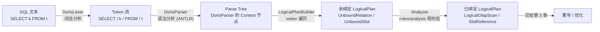

# 第 2 章：解析与合法化 —— 从字符串到 LogicalPlan

上一章把一条 SQL 送到了 `StmtExecutor` 手上：连接建好、认证过了、`COM_QUERY` 分发进来，`StmtExecutor.execute()` 是接力棒的落点。但到这一步，SQL 还只是一串**字节**——`"SELECT k FROM t WHERE k > 1"` 对 FE 来说和一段随机文本没有本质区别。本章负责把这串字节变成优化器能咀嚼的东西：先解析成一棵**语法树**，再把树里那些"名字"（表名、列名、函数名）一个个绑定到 Catalog 里真实的对象上，同时做类型、聚合等一系列合法性检查。跑完本章，我们会得到一棵**已绑定的 `LogicalPlan`**——它是第 3 章重写规则、第 4 章代价优化的输入。

读完本章，你应当能回答三件事：为什么 Doris 用 ANTLR4 生成的解析器而不是手写递归下降；一条 SQL 从 token 到未绑定计划、再到已绑定计划中间换了几次形态、每次形态住在哪个类里；以及列名歧义、GROUP BY 别名这类"看起来能跑却报错"的问题，根子在绑定阶段的哪条规则上。

本章的行号引用基于写作时核实所用的 HEAD（`0847b03e6c`，源码树与系列基线 `7bc98f696f` 一致）。代码演进会让行号漂移，但对象名与结构不变；写作时每一处 `路径:行号` 都在当前代码里核实过。

## 2.1 问题：SQL 文本怎么变成可优化的树

**遇到了什么问题？** 优化器要在一棵树上做等价变换（谓词下推、join 重排、列裁剪），它的输入必须是**结构化的树**，而不是字符串。所以任何数据库的第一步都绕不开：定义一套 SQL 语法，写一个解析器，把符合语法的文本转成一棵抽象语法树（AST）或计划树；文本不合语法就报一个位置精确的错误。这件事的难点不在"能不能解析出来"，而在三个长期成本：**性能**（每条 SQL 都要解析一遍，慢了直接拖累 QPS）、**错误信息质量**（用户写错一个括号，报错要能指到列）、**可维护性**（SQL 语法有几百条产生式，还要不断加新语法，语法定义本身能不能当文档看）。

**有哪些候选、各有什么优劣？**

- **候选一：手写递归下降解析器。** 每条语法规则对应一个手写函数，`parseSelect()` 调 `parseFrom()` 调 `parseExpr()`。优点是**性能极致、错误信息完全可控**——想在哪报什么错、报得多友好，全在自己手里；PostgreSQL、ClickHouse 走的都是这条路。代价是**维护成本随语法规模爆炸**：SQL 语法几百条产生式，手写意味着几千行互相递归的函数，加一个新语法要在多处手工穿针引线，运算符优先级、左递归这些坑全得自己填平，改一处牵一发。
- **候选二：yacc/bison 一系的 LALR 生成器。** 用 `.y` 文法文件描述语法，工具生成一个表驱动的 LALR 解析器。优点是**语法即声明、生成的解析器快**，MySQL 自己的 `sql_yacc.yy` 就是这套。代价有两个：一是 **LALR 的报错信息天生难看**（经典的 `syntax error, unexpected ...`，很难对用户友好）；二是**移进-归约冲突调起来反人类**，语法一复杂就冲突满天飞，且 C 系工具链和 Java 生态不搭。
- **候选三：ANTLR4 生成 + visitor 模式。** 用 `.g4` 文法文件描述语法，ANTLR4 生成一个 LL(*) 解析器和一套 visitor/listener 基类，你继承基类、覆写感兴趣的节点，把 parse tree 转成自己的树。优点是**文法文件本身就是最好的语法文档**（一个产生式一目了然）、天生适配 Java、报错信息比 LALR 友好、加语法只改 `.g4`；ANTLR4 还内置了自适应的 LL 预测，能自动处理大部分歧义。代价是**性能不如手写和纯表驱动**——LL(*) 的自适应预测在复杂语法上会退化，需要针对性调优；生成的中间层（parse tree）也比直接构树多一层内存开销。

**Doris 怎么考量和解决的？** Doris 的 Nereids 优化器选了候选三：文法写在 `fe/fe-sql-parser/src/main/antlr4/org/apache/doris/nereids/DorisParser.g4` 与同目录的 `fe/fe-sql-parser/src/main/antlr4/org/apache/doris/nereids/DorisLexer.g4` 里，ANTLR4 生成解析器基类，`LogicalPlanBuilder`（`fe/fe-core/src/main/java/org/apache/doris/nereids/parser/LogicalPlanBuilder.java:1148`，`extends DorisParserBaseVisitor<Object>`）作为 visitor 把 parse tree 直接转成 Nereids 自己的 `LogicalPlan` 树。选它的理由和上面的优劣一一对得上：FE 是 Java 写的，ANTLR4 是 Java 生态的事实标准；SQL 语法庞大且要持续演进（Doris 几乎每个版本都在加语法），文法即文档、加语法只碰 `.g4` 这两点对可维护性是决定性的。至于性能短板，Doris 用一个"**先快后稳**"的两段式预测把它补了回来——这个技巧在 2.2 里详讲。

值得注意的一个设计选择是：Doris 的 visitor **跳过了"通用 AST"这一层**，直接从 parse tree 构造 `LogicalPlan`（只不过是**未绑定**的 LogicalPlan）。很多数据库是 parse tree → AST → 逻辑计划三段，Doris 把后两段合了，parse tree 一转就是计划树，少一层转换。

**一段简短的历史，帮你避开旧资料的坑。** 今天你看到的 Nereids 这套 ANTLR4 链路，并不是 Doris 唯一有过的解析路径。早期 Doris 只有一套"旧优化器 / Legacy Planner"，它的入口是 `analysis/` 包下一整套**手写的 SQL AST**——`SelectStmt`、`InsertStmt` 这一族 `*Stmt` 类，配一个手写的 `Analyzer` 做语义合法化。Nereids 作为全新 CBO 另起炉灶后，两套优化器共存过一段时间，靠会话变量 `enable_nereids_planner` 切换；如今 Nereids 早已是默认且唯一路径，**旧优化器连同 `analysis/` 里那套 `*Stmt` AST 已被整体删除**（`enable_nereids_planner` 在 `fe/fe-core/src/main/java/org/apache/doris/qe/SessionVariable.java:416` 已标记为 `REMOVED`）。这意味着：网上大量讲 `SelectStmt`、`OriginalPlanner`、手写 `Analyzer` 的旧博客，**在当前 master 上全部失效**——照着它们读代码会一头撞进一个不存在的入口。这条历史的完整来龙去脉见[第 1 部分第 5 章](../part1-architecture/05-source-map-and-dev-env.md)（它专门拆解了 `analysis/` 这个"名字活下来、角色已死"的目录）。本章讲的解析与合法化，从头到尾只发生在 `nereids/` 下。

## 2.2 源码走读：词法语法与 LogicalPlanBuilder

先建立全景。一条 SQL 在本章要经历四次形态转换，下面这张图是本章的骨架，后面每一节都是在给某一段加注解：



四次转换分别是：词法（字符→token）、语法（token→parse tree）、构树（parse tree→未绑定计划）、绑定（未绑定→已绑定）。前三次在 2.2 讲，第四次在 2.3 讲。

**先说一个结构性的坑：文法文件不在 fe-core。** `fe/fe-sql-parser/src/main/antlr4/org/apache/doris/nereids/DorisLexer.g4` 和同目录的 `fe/fe-sql-parser/src/main/antlr4/org/apache/doris/nereids/DorisParser.g4` 位于 `fe/fe-sql-parser/src/main/antlr4/org/apache/doris/nereids/` 下——注意是 **`fe-sql-parser` 这个独立 Maven 模块**，不是放解析器 Java 代码的 `fe-core`。为什么这么拆？因为 `.g4` 需要 `antlr4-maven-plugin` 在编译期把文法**生成**成一堆 Java 类（`DorisParser`、`DorisLexer`、`DorisParserBaseVisitor` 等），这个生成动作绑定在 `fe-sql-parser` 模块的构建里（`fe/fe-sql-parser/pom.xml:56` 的 `antlr4-maven-plugin`、`fe/fe-sql-parser/pom.xml:68` 的 `sourceDirectory` 指向 `src/main/antlr4`），`fe-core` 只是依赖这个模块产出的 jar。

> **易错点（改语法不生效）：** 假设你想给 Doris 加一条新语法，改了 `fe/fe-sql-parser/src/main/antlr4/org/apache/doris/nereids/DorisParser.g4`，然后在 `fe-core` 里 `mvn compile` 或在 IDE 里点编译——**发现语法压根没生效**，`DorisParser` 还是老的。**错在哪？** `.g4` 是 `fe-sql-parser` 模块的源，改完必须**先重新构建 fe-sql-parser 模块**（触发 `antlr4` 代码生成、把新的 `DorisParser*` 类装进 jar），`fe-core` 才能拿到新解析器。只编译 `fe-core` 不会重跑 ANTLR 代码生成，你编的是老的生成产物。**错写会怎样？** 现象就是"文法明明改了却不生效"，且没有任何报错——因为老的生成类还在、能正常编译。正确做法是走仓库根的 `./build.sh --fe`（它会按模块依赖顺序先构建 `fe-sql-parser` 再构建 `fe-core`），或在 Maven 里对 `fe-sql-parser` 单独 `install` 后再编 `fe-core`。顺带一提，`DorisParserBaseVisitor` 这个类**在源码树里根本搜不到**（`grep -rn "class DorisParserBaseVisitor"` 无结果），因为它是 ANTLR 从 `.g4` 生成的编译产物，只存在于构建输出里——这本身就是"文法在别的模块生成"的最好佐证。

**词法：DorisLexer 与大小写、反引号。** 词法层把字符流切成 token。两个 tricky 点值得看：

- **关键字大小写不敏感，但机制不在文法里。** 文法里关键字全是大写字面量（`SELECT: 'SELECT';`），可 `select`、`Select` 照样能解析。秘密在解析入口 `parseAllTokens`（`fe/fe-core/src/main/java/org/apache/doris/nereids/parser/NereidsParser.java:466`）：它给 lexer 喂的不是普通字符流，而是 `CaseInsensitiveStream`（`fe/fe-core/src/main/java/org/apache/doris/nereids/parser/NereidsParser.java:467`）。这个类（`fe/fe-sql-parser/src/main/java/org/apache/doris/nereids/parser/CaseInsensitiveStream.java:27`，注意它也在 `fe-sql-parser` 模块里）在**喂给 lexer 做 token 匹配时统一转大写、但 `getText()` 取原文时保留原始大小写**。所以关键字随便大小写都能匹配，而**标识符（表名/列名）的原始大小写被完整保留**下来交给后续——列名到底大小写敏不敏感，是绑定阶段和 catalog 配置（如 `lower_case_table_names`）决定的，不是词法层。
- **反引号包起来的是"强制标识符"。** `BACKQUOTED_IDENTIFIER`（`fe/fe-sql-parser/src/main/antlr4/org/apache/doris/nereids/DorisLexer.g4:718`）匹配 `` `...` `` 包裹的内容，规则是反引号内除了 `` ` `` 本身都合法（`` `` `` 转义一个反引号）。它和普通 `IDENTIFIER`（`fe/fe-sql-parser/src/main/antlr4/org/apache/doris/nereids/DorisLexer.g4:714`，只能是字母/数字/下划线）的区别是：反引号能包住**关键字或带特殊字符的名字**。所以当你有一列偏偏叫 `select` 或 `order`，不加反引号会被词法当关键字、语法报错，加上 `` `select` `` 才当普通列名。

**语法与两段式预测。** token 流交给 `DorisParser` 生成 parse tree，入口在 `NereidsParser.parse()`（`fe/fe-core/src/main/java/org/apache/doris/nereids/parser/NereidsParser.java:342`）调用的 `toAst()`（`fe/fe-core/src/main/java/org/apache/doris/nereids/parser/NereidsParser.java:406`）。这里藏着 2.1 说的"性能补偿"技巧，是最该抠的一段：

```
// toAst 内部（NereidsParser.java:411 起）
parser.removeErrorListeners();
parser.addErrorListener(PARSE_ERROR_LISTENER);
try {
    parser.getInterpreter().setPredictionMode(PredictionMode.SLL);   // :417 先用快的 SLL
    tree = parseFunction.apply(parser);
} catch (ParseCancellationException ex) {
    tokenStream.seek(0);                                             // 倒回去
    parser.reset();
    parser.getInterpreter().setPredictionMode(PredictionMode.LL);    // :424 退回慢但全的 LL
    tree = parseFunction.apply(parser);
}
```

**为什么这么写？** ANTLR4 的自适应预测有两档：`SLL` 快但对某些歧义语法会误判，`LL` 慢但完整。绝大多数 SQL 用 `SLL` 就能一把过，只有少数触发歧义的才需要 `LL`。Doris 的策略是**先赌 SLL 快速路径，失败了（抛 `ParseCancellationException`）再倒回 token 流用 LL 重解一遍**——用"大多数走快路、少数补一次慢路"把 2.1 说的 ANTLR 性能短板摊平。这也是为什么它把 SQL 全量 token 化后缓存在 `CommonTokenStream` 里（`parseAllTokens` 里 `tokenStream.fill()`）：LL 重试要 `seek(0)` 倒带，token 必须能重放。**错写会怎样？** 如果有人图省事直接把预测模式写死成 `LL`，功能没问题但**每条 SQL 都走慢路**，高并发下解析开销明显上升；反过来只用 `SLL` 不做 LL 兜底，则一部分合法但有歧义的 SQL 会**误报语法错误**。这个 try/catch 是两难之间的平衡点，不是可以随手删的样板代码。

**构树：LogicalPlanBuilder 把 parse tree 变成未绑定计划。** parse tree 是 ANTLR 生成的一堆 `XxxContext` 节点，还带着括号、逗号这些语法噪音。`LogicalPlanBuilder` 作为 visitor 遍历它，产出 Nereids 的 `LogicalPlan` 树。关键在于**这时产出的计划是"未绑定"的**：表名还只是一串名字、列名还没对应到任何真实列。看它构造关系和列的地方最直观（`fe/fe-core/src/main/java/org/apache/doris/nereids/parser/LogicalPlanBuilder.java:2004`）：一个 `FROM t` 被建成 `new UnboundRelation(...)`（`fe/fe-core/src/main/java/org/apache/doris/nereids/analyzer/UnboundRelation.java:50`，它 `extends LogicalRelation implements Unbound`），一个列引用被建成 `new UnboundSlot(...)`（`fe/fe-core/src/main/java/org/apache/doris/nereids/analyzer/UnboundSlot.java:36`，`extends Slot implements Unbound`）。`Unbound`（`fe/fe-core/src/main/java/org/apache/doris/nereids/analyzer/Unbound.java:21`）是一个**纯标记接口**——树里凡是带这个标记的节点，都表示"名字还没落实到对象"。这一步整体是机械的 visitor 转换，属于**概括即可**的部分，唯一要记住的是它的产物形态：**一棵结构完整、但所有名字都还悬空的 `LogicalPlan`**。把名字落实，是下一节 Analyzer 的活。

**dialect 兼容：进解析器之前的一道岔路。** Doris 想让 Trino/Spark/Hive 等方言的 SQL 也能跑。这个能力的入口不在文法里，而在 `parseSQL` 之前的 `parseSQLWithDialect`（`fe/fe-core/src/main/java/org/apache/doris/nereids/parser/NereidsParser.java:232`）：它读会话变量 `sql_dialect`（`fe/fe-core/src/main/java/org/apache/doris/qe/SessionVariable.java:645` 的 `SQL_DIALECT`），用 `Dialect.getByName` 解析成 `Dialect` 枚举（`fe/fe-core/src/main/java/org/apache/doris/nereids/parser/Dialect.java:25`，当前支持 `DORIS`/`TRINO`/`PRESTO`/`SPARK`/`SPARK2`/`FLINK`/`HIVE`/`POSTGRES`/`SQLSERVER`/`CLICKHOUSE`/`ORACLE`/`STARROCKS` 共 12 种）。**注意它的处理方式**：如果方言是空或非注册方言，直接走原生 `parseSQL`；否则去找注册的 `DialectConverterPlugin`（`fe/fe-core/src/main/java/org/apache/doris/plugin/DialectConverterPlugin.java:32`）——由**外部插件**把方言 SQL 转成 Doris 能解析的形式，转换失败或没插件就**回退**到原生 `parseSQL`。换句话说，`fe/fe-sql-parser/src/main/antlr4/org/apache/doris/nereids/DorisParser.g4` 本身只认 Doris 方言，其它方言靠"插件转写 + 失败回退"这套机制在解析入口处兜住，文法本身不为每种方言分叉。这解释了一个常见困惑：设了 `sql_dialect='trino'` 但某条 Trino SQL 还是按 Doris 语法报错——因为没装对应转换插件，它静默回退到了原生解析。

## 2.3 源码走读：Analyze —— 绑定与合法化

拿到未绑定的 `LogicalPlan`，接下来把名字落实、把不合法的挡掉。这一步的驱动者是 `Analyzer`（`fe/fe-core/src/main/java/org/apache/doris/nereids/jobs/executor/Analyzer.java:69`，`extends AbstractBatchJobExecutor`）——注意它在 `nereids/jobs/executor/` 下，和已删除的旧 `analysis/` 那个同名 `Analyzer` 毫无关系，只是恰好都叫 Analyzer。它本质是**一批规则（rule）按固定顺序在计划树上跑**，规则住在 `nereids/rules/analysis/` 目录下。

**Analyzer 是规则批的编排者。** 它的核心是一个静态的作业列表 `ANALYZE_JOBS`（`fe/fe-core/src/main/java/org/apache/doris/nereids/jobs/executor/Analyzer.java:71`），由 `buildAnalyzeJobs`（`fe/fe-core/src/main/java/org/apache/doris/nereids/jobs/executor/Analyzer.java:116`）构造。列表把规则按依赖顺序编排成一串 `bottomUp`/`topDown` 的遍历作业，摘录开头几批：

```
// buildAnalyzerJobs 摘录（Analyzer.java:124 起）
topDown(new AnalyzeCTE()),                     // 先处理 CTE
topDown(new EliminateLogicalSelectHint(), ...),
bottomUp(
    new BindRelation(),                        // 表名 → Catalog 表对象
    new CheckPolicy(),                          // 行/列安全策略
    new BindExpression()                        // 列名/函数 → Slot/函数对象
),
topDown(new BindSink()),
bottomUp(new CheckAnalysis(false)),            // 合法性总检查
...
```

**顺序不是随意的**：`BindRelation` 必须在 `BindExpression` 之前——列名要绑到哪张表的哪一列，前提是那张表已经绑好、它的输出列（schema）已知；`CheckAnalysis` 放在绑定之后，因为它检查的是"绑定完成后计划是否合法"。下面挑三条规则详讲。

**规则一：BindRelation —— 把表名绑到 Catalog 对象。** `BindRelation`（`fe/fe-core/src/main/java/org/apache/doris/nereids/rules/analysis/BindRelation.java:137`，`extends OneAnalysisRuleFactory`）匹配树里的 `UnboundRelation`，把它换成一个已绑定的关系节点。核心分派在 `doBindRelation`（`fe/fe-core/src/main/java/org/apache/doris/nereids/rules/analysis/BindRelation.java:155`）：按名字的段数分情况——`t` 是一段（用当前 db）、`db.t` 两段、`catalog.db.t` 三段，多于三段直接报 `Table name ... is invalid`。它先查名字是不是一个 CTE 别名，不是才真正去 catalog 里 `bind`（`fe/fe-core/src/main/java/org/apache/doris/nereids/rules/analysis/BindRelation.java:225`）取出真实表对象、拿到列 schema、分配 slot id、建成 `LogicalOlapScan` 之类的已绑定扫描节点。**这一步是"名字→对象"的第一次落地**：绑不到就在这里报表不存在。

**规则二：BindExpression —— 把列名/函数绑到 Slot/函数。** `BindExpression`（`fe/fe-core/src/main/java/org/apache/doris/nereids/rules/analysis/BindExpression.java:147`，`implements AnalysisRuleFactory`）是绑定阶段最重的规则，它给每一种带表达式的算子（project/filter/join/aggregate/sort…）都注册了一条绑定规则（`fe/fe-core/src/main/java/org/apache/doris/nereids/rules/analysis/BindExpression.java:172` 起的 `BINDING_PROJECT_SLOT`、`BINDING_FILTER_SLOT`、`BINDING_AGGREGATE_SLOT` 等一长串）。它干的活是：把每个 `UnboundSlot`（列引用）在**子节点的输出列**里查找、绑成一个真实的 `SlotReference`；把 `UnboundFunction` 绑成具体函数；顺带做必要的类型强转（把 `int` 和 `bigint` 比较统一到宽类型等，交给类型强转工具完成）。它内部实际调用的是 `ExpressionAnalyzer`（`fe/fe-core/src/main/java/org/apache/doris/nereids/rules/analysis/ExpressionAnalyzer.java:130`）逐个表达式地绑。**列名解析的作用域顺序**就在这里定，是本节的 tricky 核心，下面单独展开。

**规则三：CheckAnalysis —— 绑定后的合法性总检查。** `CheckAnalysis`（`fe/fe-core/src/main/java/org/apache/doris/nereids/rules/analysis/CheckAnalysis.java:69`）在绑定全部完成后跑一遍，把"语法合法但语义不合法"的挡在优化之前。例如 `checkAggregateFunction`（`fe/fe-core/src/main/java/org/apache/doris/nereids/rules/analysis/CheckAnalysis.java:221`）会拦下 `GROUP BY sum(x)` 这种在 GROUP BY 里放聚合函数的写法，报 `GROUP BY expression must not contain aggregate functions`（`fe/fe-core/src/main/java/org/apache/doris/nereids/rules/analysis/CheckAnalysis.java:226`）；还会检查表达式的输入类型是否匹配。把它单列出来的意义是：**很多"为什么这条 SQL 不让我跑"的报错来自这里，而不是语法或绑定**——它是合法化的最后一道闸。

### tricky 点：列名解析的作用域顺序，绑到谁

同一个列名 `k` 在一条 SQL 里可能有多个候选：join 两侧都有 `k`、子查询里外层各有 `k`、SELECT 里起了别名又叫 `k`。绑到谁？规则藏在 `ExpressionAnalyzer` 里，可以拆成两条来理解。

**其一，普通列引用绑到子节点输出，多个候选就是歧义。** `ExpressionAnalyzer` 拿一个 `UnboundSlot` 去当前算子的子节点输出（一个 `Scope`，`fe/fe-core/src/main/java/org/apache/doris/nereids/analyzer/Scope.java:60`）里匹配。匹配上唯一一个就绑它；一个都没有，报 `Unknown column`；**匹配上多于一个，就是歧义**，报错在 `fe/fe-core/src/main/java/org/apache/doris/nereids/rules/analysis/ExpressionAnalyzer.java:376`，文本是 `xxx is ambiguous: ...`（后面列出所有候选）。典型触发场景：`SELECT k FROM t1 JOIN t2`，t1、t2 都有列 `k`，不带前缀写 `k` 就命中歧义分支——因为 join 节点的输出把两侧的 `k` 都摊在同一个 scope 里，`k` 同时匹配两个。**怎么读这个报错、怎么修？** 报错里的 `is ambiguous` 后面会把两个候选（形如 `t1.k`、`t2.k`）都列出来，加上表前缀写 `t1.k` 就唯一了。这里有一个例外分支值得知道：当有别名参与、存在一个"全名恰好完全匹配"的候选时（`enableExactMatch` 分支，`fe/fe-core/src/main/java/org/apache/doris/nereids/rules/analysis/ExpressionAnalyzer.java:352` 起），会优先选那个精确匹配的而不报歧义——比如 `SELECT t1.k k, t2.k FROM ... ORDER BY k`，`ORDER BY k` 会精确绑到别名 `k` 而非报歧义。

**其二，找不到列的报错要会读。** 绑不到任何候选时走 `couldNotFoundColumn`（`fe/fe-core/src/main/java/org/apache/doris/nereids/rules/analysis/ExpressionAnalyzer.java:384`），拼出的信息是 `Unknown column 'k' in 'xxx'`，而且**带上是在哪个子句里找不到的**（`fe/fe-core/src/main/java/org/apache/doris/nereids/rules/analysis/ExpressionAnalyzer.java:385` 起，用当前算子类型去掉 `LOGICAL_` 前缀拼成 `... in PROJECT clause` / `FILTER clause` 之类）。**这个"in XXX clause"是排错的关键线索**：同样一句 `Unknown column 'k'`，报在 `FILTER clause` 说明是 WHERE 里绑不到，报在 `AGGREGATE clause` 说明是 GROUP BY/聚合处绑不到——它直接告诉你去查哪个子句的作用域。子查询的情形同理：内层能看到外层的列（相关子查询），但外层看不到内层——scope 是随算子层层构造的，绑定时只在"当前可见的 scope"里找，看不见就报 Unknown column。

### tricky 点：GROUP BY 里用别名/序号，方言行为

标准 SQL 严格来说不允许 GROUP BY 引用 SELECT 里的别名（因为逻辑上 GROUP BY 先于 SELECT 求值），但 MySQL 允许，很多人也习惯这么写。Doris 站 MySQL 这边——机制在 `BindExpression` 绑 GROUP BY 时的作用域顺序里（`fe/fe-core/src/main/java/org/apache/doris/nereids/rules/analysis/BindExpression.java:604`，`bindByGroupByThenAggOutputThenAggChild`）。它给 GROUP BY 里的名字定了一个**三级查找顺序**：先在 group-by 已绑定的 slot 里找，再在**聚合输出（也就是 SELECT 列表，含别名）**里找，最后才到聚合的子节点输出里找。正因为第二级会去看 SELECT 别名，`SELECT a+1 AS x FROM t GROUP BY x` 里的 `x` 能绑到别名 `a+1`。

序号（ordinal）是另一种简写：`GROUP BY 1` 表示"按 SELECT 第 1 列分组"。它由 `bindWithOrdinal`（`fe/fe-core/src/main/java/org/apache/doris/nereids/rules/analysis/BindExpression.java:1875`）处理——如果 GROUP BY 项是个整数字面量且落在 `[1, SELECT 列数]` 区间，就取 SELECT 的第 `n` 列（是别名就取别名底下的表达式）；超出范围则**当普通字面量常量**处理，不报错。**这里有个反直觉的坑**：`GROUP BY 1` 里的 `1` 是"第一列"，而 `GROUP BY 1+1` 或 `GROUP BY 'a'` 里的 `1+1`、`'a'` 因为不是"单个整数字面量"，会被当**常量表达式**而非序号——写 `GROUP BY 2` 想按第二列分组是对的，但一旦掺进运算就不再是序号语义了。**错写会怎样？** 两类典型错误：一是从严格 SQL 标准数据库迁过来的 SQL 假设 GROUP BY 不认别名，在 Doris 上反而"意外能跑"，行为却和源库不同（源库把它当新列、Doris 绑到了别名）；二是误以为 `GROUP BY 序号` 里序号从 0 开始——实际从 1 开始，`GROUP BY 0` 会因超出 `[1,n]` 被当常量、静默不按任何列分组。这些差异在跨库迁移时是隐蔽的正确性问题，不会报错但结果不同，值得在 2.5 亲手验一遍。

## 2.4 双模式对比：解析绑定与形态无关

**解析和绑定这一层，存算一体与存算分离两种形态基本一致。** 文法、`NereidsParser`、`LogicalPlanBuilder`、`Analyzer` 的规则批，代码里没有任何按模式分叉的逻辑——一条 SQL 变成未绑定计划、再绑成已绑定计划的过程，两模式走的是同一套类。

唯一值得点一句的差异在 `BindRelation` 取表对象那一下：存算分离下，catalog 交出来的表对象是 `Cloud*` 系（如 `CloudInternalCatalog` 体系下的云上表实现，`fe/fe-core/src/main/java/org/apache/doris/cloud/datasource/CloudInternalCatalog.java`），而存算一体下是普通的 `OlapTable`。但这对绑定逻辑本身**没有影响**——`BindRelation` 只关心表的列 schema、拿去分配 slot、建扫描节点，云上表和本地表在"有哪些列、什么类型"这个层面是一致的。至于"这张表的数据在本地盘还是对象存储、扫描时怎么走 File Cache"，那是执行期的事，与解析绑定无关，留到本部分第 5、7 章展开。判断一段 catalog 代码在哪种模式下生效的通用方法（工厂分叉、看 `Cloud*` 子类覆盖），见[第 1 部分第 4 章](../part1-architecture/04-two-architectures.md) 4.4 节的判别法，本章不重复。一句话：**"解析成什么树"两模式没差别，"扫的数据在哪"才有**。

## 2.5 动手实验

前置环境（编译 ASAN 集群、单机拉起、日志级别调整）一律沿用[第 1 部分第 5 章](../part1-architecture/05-source-map-and-dev-env.md)，不再重复。本实验**一个核心 + 两个踩坑**，都只需要一个 `mysql` 客户端，不改代码。先建两张有同名列的表备用：

```sql
CREATE DATABASE IF NOT EXISTS demo;
USE demo;
CREATE TABLE t1 (k INT, a INT) DISTRIBUTED BY HASH(k) BUCKETS 1 PROPERTIES("replication_num"="1");
CREATE TABLE t2 (k INT, b INT) DISTRIBUTED BY HASH(k) BUCKETS 1 PROPERTIES("replication_num"="1");
```

### 实验一（核心）：EXPLAIN PARSED PLAN vs ANALYZED PLAN，对齐类名

**目标**：亲眼看到同一条 SQL 的"未绑定形态"和"已绑定形态"，把 2.2/2.3 讲的类对上号。Doris 的 `EXPLAIN` 支持按阶段打印计划——语法在 `fe/fe-sql-parser/src/main/antlr4/org/apache/doris/nereids/DorisParser.g4:1165` 的 `explain` 规则里，`planType`（`fe/fe-sql-parser/src/main/antlr4/org/apache/doris/nereids/DorisParser.g4:1177`）可取 `PARSED`（解析后、未绑定）、`ANALYZED`（分析后、已绑定）、`REWRITTEN`/`OPTIMIZED` 等，后面跟 `PLAN`。

```sql
EXPLAIN PARSED PLAN SELECT k, a FROM t1;
EXPLAIN ANALYZED PLAN SELECT k, a FROM t1;
```

对照着读两份输出：

- `PARSED PLAN` 里，表是 `UnboundRelation`、列是 `UnboundSlot`——正是 2.2 里 `LogicalPlanBuilder` 产出的未绑定节点，名字还悬空。
- `ANALYZED PLAN` 里，表变成了 `LogicalOlapScan`（`BindRelation` 绑出来的）、列变成了带 exprId 的 `SlotReference`（`BindExpression` 绑出来的）。

**这个实验验证的核心点**：从 PARSED 到 ANALYZED，中间就是 2.3 那批 `rules/analysis/` 规则干的活——`Unbound*` 被逐个替换成绑定后的真实对象。你能在输出里一眼看出"哪些名字被落实了"。

### 实验二（踩坑）：构造歧义列名，读 `is ambiguous`

**目标**：亲手触发 2.3 的列名歧义分支，认清报错样貌。

```sql
SELECT k FROM t1 JOIN t2 ON t1.a = t2.b;
```

t1、t2 都有列 `k`，不带前缀的 `k` 会命中 `ExpressionAnalyzer` 的歧义分支，报错形如 `k is ambiguous: ...`（列出候选）。**要建立的能力**：看到 `is ambiguous` 就知道是一个名字匹配到了多个候选，解决办法是加限定前缀。改成 `SELECT t1.k FROM ...` 立刻通过——这验证了绑定是在"子节点输出的 scope"里按名字查找、多命中即歧义。再顺手验一下另一半：`SELECT x FROM t1;`（没有列 `x`）会报 `Unknown column 'x' in ... clause`，注意报错里那个 `clause` 关键字，它告诉你在哪个子句绑不到。

### 实验三（踩坑）：GROUP BY 别名/序号的方言行为

**目标**：验证 2.3 讲的 GROUP BY 三级作用域和序号语义，感受它和严格 SQL 标准的差异。

```sql
-- (1) GROUP BY 引用 SELECT 别名：标准 SQL 不允许，Doris(随 MySQL) 允许
SELECT a + 1 AS x, COUNT(*) FROM t1 GROUP BY x;
-- (2) GROUP BY 序号：1 = 第一列
SELECT a, COUNT(*) FROM t1 GROUP BY 1;
-- (3) GROUP BY 里放聚合函数：CheckAnalysis 拦截
SELECT COUNT(*) FROM t1 GROUP BY SUM(a);
```

预期：(1) 正常执行——`x` 通过 `bindByGroupByThenAggOutputThenAggChild` 的第二级绑到了 SELECT 别名；(2) 正常执行，等价于 `GROUP BY a`；(3) 报 `GROUP BY expression must not contain aggregate functions`，正是 `CheckAnalysis.checkAggregateFunction` 拦下的。**要建立的区分能力**：(1)(2) 能跑说明 Doris 的 GROUP BY 作用域是 MySQL 风格（认别名、认序号），从严格标准库迁移的 SQL 在这里行为可能不同、且**不会报错**——这是最需要警惕的隐性差异；而 (3) 的报错来自合法化的 `CheckAnalysis` 闸，不是语法错也不是绑定错。

## 2.6 排查清单

按"症状 → 定位入口"组织，覆盖解析/绑定阶段最高频的三类问题。

### 症状 A：语法报错，但同一条 SQL 在别的库能跑

- **优先怀疑方言。** Doris 原生只认 `fe/fe-sql-parser/src/main/antlr4/org/apache/doris/nereids/DorisParser.g4` 定义的 Doris 方言。如果这条 SQL 来自 Trino/Spark/Hive，先看会话变量 `sql_dialect`（`fe/fe-core/src/main/java/org/apache/doris/qe/SessionVariable.java:645`）设了没、有没有装对应的 `DialectConverterPlugin`（`fe/fe-core/src/main/java/org/apache/doris/plugin/DialectConverterPlugin.java:32`）——没装插件时 `parseSQLWithDialect`（`fe/fe-core/src/main/java/org/apache/doris/nereids/parser/NereidsParser.java:232`）会**静默回退**到原生解析，于是方言特有语法照样报错。
- **列名撞上关键字。** 一列叫 `order`、`select` 这类关键字，不加反引号会被词法当关键字、语法报错。用 `` `order` ``（`BACKQUOTED_IDENTIFIER`，`fe/fe-sql-parser/src/main/antlr4/org/apache/doris/nereids/DorisLexer.g4:718`）包起来。
- **确认改语法后真的重编了 fe-sql-parser。** 如果你在开发中改了 `.g4` 却发现语法不生效，回到 2.2 的易错点：`.g4` 在 `fe-sql-parser` 模块，必须走 `./build.sh --fe`（或单独 install 该模块）触发 ANTLR 重新生成，只编 `fe-core` 是老的生成产物。

### 症状 B：`Unknown column`，但列明明存在

- **看报错里的 `in XXX clause`。** `couldNotFoundColumn`（`fe/fe-core/src/main/java/org/apache/doris/nereids/rules/analysis/ExpressionAnalyzer.java:384`）会告诉你在哪个子句绑不到。报在 `FILTER`（WHERE）或 `AGGREGATE`（GROUP BY/HAVING）子句，往往是**作用域问题**：该列在那个算子的可见 scope 里不存在（比如引用了只在 SELECT 别名里、GROUP BY 之后才出现的列）。
- **大小写。** 词法层保留标识符原始大小写，列名到底大小写敏不敏感取决于表的存储和 `lower_case_table_names` 类配置。跨库迁移时列名大小写不一致会报 Unknown column，先核对建表时的原始大小写。
- **`is ambiguous` 是另一回事。** 如果报的是歧义而非 Unknown（见 2.5 实验二），说明列名匹配到多个候选（典型是 join 两侧同名列），加表前缀而不是去改 schema。

### 症状 C：视图/嵌套解析报错

- **视图体在展开时重走一遍解析绑定。** 视图定义是一段 SQL，引用视图时它会被展开、按当时的 catalog 重新解析绑定。所以"底表结构改了、视图跟着挂"的报错，根子常在视图体那段 SQL 绑不到新 schema——`Analyzer` 对 `LogicalView` 有专门的边界处理（`buildAnalyzeJobs` 里对 `LogicalView` 做 `notTraverseChildrenOf`，`fe/fe-core/src/main/java/org/apache/doris/nereids/jobs/executor/Analyzer.java:116`），定位时把视图体单独拎出来 `EXPLAIN ANALYZED PLAN` 一下就能看清是哪一层绑不上。
- **CTE 名字与表名冲突。** `BindRelation` 绑一段名字时**先查 CTE 再查 catalog**（`fe/fe-core/src/main/java/org/apache/doris/nereids/rules/analysis/BindRelation.java:155` 起的分支）。如果 CTE 起的名字和真实表同名，引用会优先落到 CTE 上——这在嵌套查询里容易让人以为读的是物理表，实际读的是 CTE。

---

本章走完了查询链路从字符串到逻辑计划的一段：`DorisLexer`/`DorisParser`（文法在 `fe-sql-parser` 模块，ANTLR 生成，SLL→LL 两段式预测补性能）把 SQL 切成 token、再解析成 parse tree；`LogicalPlanBuilder` 作为 visitor 把它转成一棵**未绑定**的 `LogicalPlan`（`UnboundRelation`/`UnboundSlot`）；`Analyzer` 驱动 `rules/analysis/` 的规则批——`BindRelation` 把表名绑到 catalog 对象、`BindExpression` 把列名/函数绑到 `SlotReference`、`CheckAnalysis` 做合法性总检查——产出一棵**已绑定**的 `LogicalPlan`。我们重点抠了几个易错点：改语法必须重编 `fe-sql-parser`、列名解析的作用域顺序与歧义/未知列报错怎么读、GROUP BY 别名与序号的 MySQL 风格方言行为。这棵已绑定的逻辑计划就是接力棒——下一章从它出发，看重写规则（谓词下推、列裁剪、子查询解嵌套等）如何把它打磨成一棵更优的等价树。
