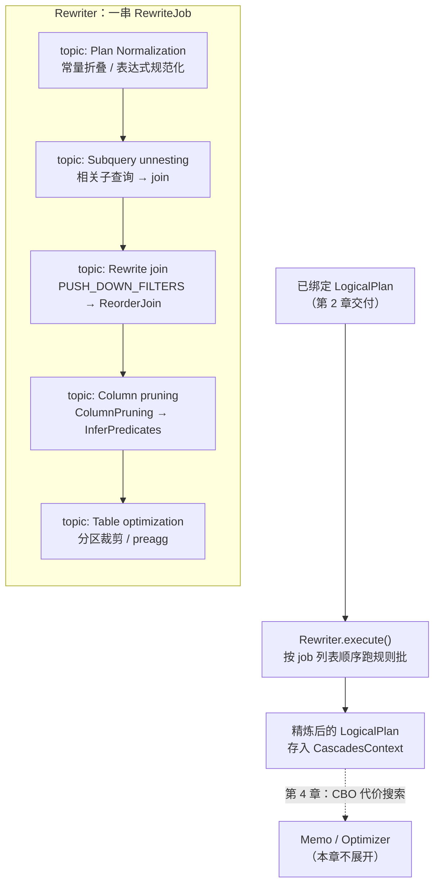

# 第 3 章：Nereids 优化器（上）—— RBO 规则重写体系

上一章把一条 SQL 打磨成了一棵**已绑定的 `LogicalPlan`**——表名落到了 catalog 对象、列名落到了 `SlotReference`、非法写法被 `CheckAnalysis` 挡在门外。但"绑定完成"离"能高效执行"还差得远：`WHERE` 条件还悬在 join 顶上、`SELECT *` 背后拖着一堆没人用的列、相关子查询还裹在 `LogicalApply` 里没法并行。本章负责把这棵**语义正确但形态粗糙**的树，用一批**等价变换规则**反复打磨成一棵**形态精炼**的等价树——这就是 Nereids 的 RBO（Rule-Based Optimization，基于规则的优化）阶段。跑完本章，计划树的形态基本定型，但**每个算子选哪种物理实现、join 按什么顺序连**还没定，那是第 4 章 CBO 代价搜索的事。

读完本章，你应当能回答三件事：为什么优化器要分 RBO/CBO 两层、哪些变换"永远不亏"因而可以无脑做；规则批（rule batch）的排列顺序为什么是一种**隐含依赖**、乱序会怎样、写得不收敛的规则会不会把 FE 转死；以及谓词下推这类"看着简单"的规则，在 outer join 面前为什么是历史 bug 高发区。

本章的行号引用基于写作时核实所用的 HEAD（`0ba20546d7`，源码树与系列基线 `7bc98f696f` 一致）。代码演进会让行号漂移，但对象名与结构不变；写作时每一处 `路径:行号` 都在当前代码里核实过。

## 3.1 问题：哪些优化不需要代价就能做

**遇到了什么问题？** 一棵已绑定的逻辑计划，理论上有**天文数字**级别的等价变形：join 有 n! 种连接顺序、每个 join 可以是 hash/nested-loop/broadcast/shuffle、聚合可以一阶段也可以两阶段、谓词可以推也可以不推。优化器的任务是从这个巨大的搜索空间里挑一个"好"计划。问题是：**怎么挑？** 如果对每一种变形都估一遍代价（读多少行、传多少字节、耗多少 CPU）再比较，搜索空间会瞬间爆炸——20 张表的 join，光顺序就有 20! ≈ 2.4×10¹⁸ 种，估价估到天荒地老。

**有哪些候选、各有什么优劣？**

- **候选一：所有变换都进代价搜索。** 把谓词下推、列裁剪、join 重排、物理实现选择全部塞进一个统一的代价模型里搜。理论最优——只要代价模型准，能找到全局最优解。但**搜索空间爆炸**：谓词下推这种"推了必然更好"的变换也要陪着一起被枚举、被估价，白白把搜索空间乘上几个数量级，复杂查询直接优化超时。
- **候选二：纯启发式一把梭。** 不估代价，全凭经验规则决定一切——"总是先下推谓词、总是把小表当 build 端、总是按某个固定顺序连 join"。快是快，但**复杂查询上选错计划**：小表大表的判断需要统计信息，join 顺序的好坏依赖各表的过滤性，这些没有代价估算根本拍不准，一旦数据分布偏离直觉就是灾难性的慢查询。
- **候选三：分层——先规则重写收敛，再代价搜索。** 把变换分成两类：一类是**"永远不亏"（never worse）** 的，比如谓词下推（过滤越早行数越少）、列裁剪（少读列只省不费）、常量折叠（`1+1` 算成 `2` 没有反例）、子查询去关联（把嵌套循环变成 join 打开了并行空间）——这类变换不需要看代价，直接用规则无条件应用到收敛；另一类是**代价相关（cost-dependent）** 的，比如 join 连接顺序、分布方式（broadcast vs shuffle）、聚合一阶段还是两阶段——这类"哪个更好"取决于具体数据量，必须靠代价模型搜。先让规则层把树重写到一个规范化的、"不亏的优化都做完了"的形态，再把这棵干净的树交给代价搜索——搜索空间被规则层大幅收窄，代价搜索只在真正需要权衡的维度上花力气。

**Doris 怎么考量和解决的？** Nereids 选了候选三，这也是现代 CBO 优化器的主流架构。判断一个变换该进哪层的准绳就是那句 **"是否 never worse"**：谓词下推后行数只减不增、列裁剪后 IO 只省不费，无论数据长什么样都不会更差，这类进 RBO；join 顺序换一下可能更快也可能更慢，取决于表大小和过滤性，这类进 CBO。这个分层和业界一脉相承：Apache Calcite 用 `HepPlanner`（启发式、规则驱动、无代价）做规则重写，再用 `VolcanoPlanner`（代价驱动的 Cascades 风格搜索）做代价优化，两者串联；Nereids 的 `Rewriter`（本章）对应前者、`Optimizer` + `Memo`（第 4 章）对应后者。而 Cascades 论文（Graefe 1995）本身就奠定了"规则驱动 + 代价记忆化搜索"的范式，Nereids 的 `CascadesContext`（贯穿两阶段的状态载体）名字即来自于此。本章讲清楚 RBO 这一层：规则怎么组织、怎么按批次跑、跑到什么时候停。

## 3.2 源码走读：规则框架

先建立全景。一条已绑定的逻辑计划进入 RBO 阶段后，会被一长串**规则批（rule batch）** 依次碾过，每一批要么自顶向下（top-down）、要么自底向上（bottom-up）地遍历计划树、匹配模式、就地改写。下面这张图是本章骨架：



入口在 `NereidsPlanner.rewrite()`（`fe/fe-core/src/main/java/org/apache/doris/nereids/NereidsPlanner.java:486`），核心就一句 `Rewriter.getWholeTreeRewriter(cascadesContext).execute()`（`fe/fe-core/src/main/java/org/apache/doris/nereids/NereidsPlanner.java:491`）。重写完的计划存回 `CascadesContext`，用 `getRewritePlan()`（`fe/fe-core/src/main/java/org/apache/doris/nereids/CascadesContext.java:366`）取出——这也是 `EXPLAIN REWRITTEN PLAN` 打印的那棵树（`fe/fe-core/src/main/java/org/apache/doris/nereids/NereidsPlanner.java:311`）。

**Rule 与 RuleType：一条规则是一次模式匹配加一次改写。** 每条重写规则本质上是"匹配一个计划模式 → 产出一个等价的新子树"。所有规则的类型登记在一个巨大的枚举 `RuleType`（`fe/fe-core/src/main/java/org/apache/doris/nereids/rules/RuleType.java:26`，`public enum RuleType`）里——当前有近 500 个枚举成员，其中三百多个是重写类（`RuleTypeClass.REWRITE`）。比如 `PUSH_DOWN_FILTER_THROUGH_JOIN`（`fe/fe-core/src/main/java/org/apache/doris/nereids/rules/RuleType.java:213`）、`COLUMN_PRUNING`（`fe/fe-core/src/main/java/org/apache/doris/nereids/rules/RuleType.java:239`）、`INFER_PREDICATES`（`fe/fe-core/src/main/java/org/apache/doris/nereids/rules/RuleType.java:171`）都在这里。枚举里的序号（`type()`）还有一个隐藏用途：`disable_nereids_rules` 用它做位图开关，3.5 会用到。规则的写法有两种典型形态：一种是 `OneRewriteRuleFactory`（一条模式一条改写，如谓词下推）；一种是 `CustomRewriter`（自己控制遍历，如列裁剪），后面各挑一个细读。

**Rewriter：把规则编排成有序的 job 列表。** `Rewriter`（`fe/fe-core/src/main/java/org/apache/doris/nereids/jobs/executor/Rewriter.java:202`，`extends AbstractBatchJobExecutor`）不亲自改写，它的职责是**把几百条规则组织成一串按依赖顺序排列的 `RewriteJob`**。这个列表是本章最该看懂的东西——它把规则分成一个个 `topic`（主题），每个 topic 里若干 `topDown` / `bottomUp` / `custom` 批次。三种批次的语义（定义在 `fe/fe-core/src/main/java/org/apache/doris/nereids/jobs/executor/AbstractBatchJobExecutor.java`）：

- `topDown(...)`（`fe/fe-core/src/main/java/org/apache/doris/nereids/jobs/executor/AbstractBatchJobExecutor.java:122`）：自顶向下遍历、匹配即改写，默认 `once=true`（一遍过）。
- `bottomUp(...)`（`fe/fe-core/src/main/java/org/apache/doris/nereids/jobs/executor/AbstractBatchJobExecutor.java:105`）：自底向上遍历，适合"改了下层会让上层出现新可改点"的场景——底层变了能立刻在同一趟里被上层规则捕获。
- `custom(...)`（`fe/fe-core/src/main/java/org/apache/doris/nereids/jobs/executor/AbstractBatchJobExecutor.java:142`）：把一个 `CustomRewriter`（自带遍历逻辑的重写器，如 `ColumnPruning`）当作一个 job。

真正驱动这些 job 跑的是 `execute()`（`fe/fe-core/src/main/java/org/apache/doris/nereids/jobs/executor/AbstractBatchJobExecutor.java:149`）。它的核心循环值得逐段看，因为**fixedPoint 语义和"会不会转死"都藏在这里**：

```java
// AbstractBatchJobExecutor.execute() 摘录（:164 起）
if (shouldRun(currentJob, jobContext, jobs, i)) {
    do {
        jobContext.setRewritten(false);
        currentJob.execute(jobContext);
    } while (!currentJob.isOnce() && jobContext.isRewritten());   // :168
}
```

**这就是 fixedPoint（不动点）的实现**：一个非 `once` 的 job 会被**反复执行，直到某一趟没有产生任何改写**（`isRewritten()` 为 false）为止——这正是"跑到收敛"的含义。`once` 的 job 只跑一遍。规则被 `bottomUp`/`topDown` 包成 job 时，是否 `once` 由包装决定（见 `fe/fe-core/src/main/java/org/apache/doris/nereids/jobs/executor/AbstractBatchJobExecutor.java:131` 的 `once` 参数）。

**CascadesContext：贯穿始终的状态载体。** 上面这些 job 跑的时候，"当前正在被重写的计划树"存在哪、"这个查询关掉了哪些规则"从哪读、重写过程要用的会话上下文怎么拿——统统挂在 `CascadesContext`（`fe/fe-core/src/main/java/org/apache/doris/nereids/CascadesContext.java:85`）这一个对象上。它是规则重写的**状态中枢**：持有 `StatementContext`（`fe/fe-core/src/main/java/org/apache/doris/nereids/CascadesContext.java:96`，一条语句级别的全局状态）、当前计划树（`getRewritePlan()`，`fe/fe-core/src/main/java/org/apache/doris/nereids/CascadesContext.java:366`）、以及后面 3.5 要用的禁用规则位图（`getAndCacheDisableRules()`，`fe/fe-core/src/main/java/org/apache/doris/nereids/CascadesContext.java:456`）。理解它的关键是**"一个 CascadesContext 服务一次规划、并且横跨 RBO 与 CBO 两个阶段"**：本章的 `Rewriter` 把重写后的计划写回它，第 4 章的 `Memo` 和代价搜索又从它里面接着往下做——所以它取名 Cascades（对应 3.1 说的 Cascades 论文谱系），是把两阶段串起来的那根扁担。本章只需知道它是重写状态的容器；它怎么承载 `Memo` 与 Group、怎么支撑代价搜索，留到第 4 章。

### tricky 点一：规则批的顺序是隐含依赖，乱序会怎样

规则批列表**不是随便排的**——相邻批次之间常有"A 必须在 B 之前跑"的硬依赖，这些依赖没有类型系统帮你检查，全靠代码注释和作者的记忆维系。看一个真实例子，在 "Rewrite join" topic 里（`fe/fe-core/src/main/java/org/apache/doris/nereids/jobs/executor/Rewriter.java:308` 起）：

```java
// Rewriter.java:316 的注释
// ReorderJoin depends PUSH_DOWN_FILTERS
bottomUp(RuleSet.PUSH_DOWN_FILTERS),        // :324 先把谓词推到各表上
...
topDown(
    new MergeFilters(),
    new ReorderJoin(),                       // :330 再重排 join 顺序
    ...
)
```

**为什么 `PUSH_DOWN_FILTERS` 必须在 `ReorderJoin` 之前？** `ReorderJoin` 决定多表 join 的连接顺序，它的决策依赖"每张表被过滤后还剩多少行"——而这个信息只有在谓词已经下推到各表扫描节点之后才准确。如果先重排 join、再下推谓词，重排时看到的是没过滤的原始表大小，选出的连接顺序就是错的（不是结果错，是**性能选择错**）。**错写会怎样？** 假设有人把这两批的顺序对调，功能上计划仍然正确（谓词最终还是会被推下去），但 `ReorderJoin` 会基于错误的行数估计选出一个糟糕的连接顺序，复杂多表 join 的性能可能劣化几个数量级——而且这种劣化**不报错、不易察觉**，只表现为"某类查询莫名其妙地慢"。类似的依赖在列裁剪 topic 里也有一条：`ELIMINATE_UNNECESSARY_PROJECT` 的注释明写 "this rule should invoke after ColumnPruning"（`fe/fe-core/src/main/java/org/apache/doris/nereids/jobs/executor/Rewriter.java:393`）——列裁剪会造出新的 project 节点，消除多余 project 的规则必须在它之后跑才有活干。这类"顺序即契约"的编排，是读 `fe/fe-core/src/main/java/org/apache/doris/nereids/jobs/executor/Rewriter.java` 时最该建立的直觉：**这个列表的顺序本身就是设计，改动一行都可能踩雷**。

### tricky 点二：不收敛的 fixedPoint 会转死，护栏在哪

回到那个 `do...while` 循环（`fe/fe-core/src/main/java/org/apache/doris/nereids/jobs/executor/AbstractBatchJobExecutor.java:165`）：一个非 `once` 的 job 只要每趟都"改写成功"（`isRewritten()` 一直为 true），循环就**永远退不出去**——FE 在优化这一条 SQL 时线程转死。这不是假想，而是规则开发中真实高发的坑：两条规则互相把对方的成果又改回去，形成 A→B→A 的**ping-pong**。

`fe/fe-core/src/main/java/org/apache/doris/nereids/jobs/executor/Rewriter.java` 里就留着这种坑的"疤痕"。看 `ExtractSingleTableExpressionFromDisjunction` 这条规则被**单独拎到一个独立 job** 里的注释（`fe/fe-core/src/main/java/org/apache/doris/nereids/jobs/executor/Rewriter.java:220`）：

```java
// ExtractSingleTableExpressionFromDisjunction conflict to InPredicateToEqualToRule
// in the ExpressionNormalization, so must invoke in another job, otherwise dead loop.
```

**这段注释是血泪教训的化石**：`ExtractSingleTableExpressionFromDisjunction`（从 `or` 里抽单表表达式）和 `ExpressionNormalization` 里的 `InPredicateToEqualToRule`（把 `in` 化简成等值）会互相触发对方——放在同一批里就会 `otherwise dead loop`（不然就死循环）。解决办法不是加计数器，而是**把冲突的两条规则拆进不同的 job**，让它们不在同一个不动点循环里互相拉扯。这告诉你框架层的设计哲学：**收敛性是规则作者的契约，框架不替你兜底。**

那么护栏到底在哪？分两层看，这里要说准，别夸大：

- **表达式重写子层有硬性次数上限。** 表达式的不动点重写在 `ExpressionBottomUpRewriter` 里，它的循环有一个**明确的数字上限**：`while (changed && rewriteTimes < 100 && ...)`（`fe/fe-core/src/main/java/org/apache/doris/nereids/rules/expression/ExpressionBottomUpRewriter.java:103`）——单个表达式节点最多重写 100 次，超过就强制停，注释直言 `use rewriteTimes to avoid dead loop`（`fe/fe-core/src/main/java/org/apache/doris/nereids/rules/expression/ExpressionBottomUpRewriter.java:87`）。这是框架里唯一一处"数字护栏"。
- **计划树重写批（本章主角）没有这种计数器。** `AbstractBatchJobExecutor.execute()` 的 `do...while` 就是裸循环，不带次数上限——**计划级的不收敛真的会转到你手动 kill**。唯一的外层挡板是整个 Nereids 规划的墙钟超时 `nereids_timeout_second`（默认 30 秒，`fe/fe-core/src/main/java/org/apache/doris/qe/SessionVariable.java:2201`；`enable_nereids_timeout` 默认开，`fe/fe-core/src/main/java/org/apache/doris/qe/SessionVariable.java:2198`），超时后由 job 调度器抛出规划超时错误（`fe/fe-core/src/main/java/org/apache/doris/nereids/jobs/scheduler/SimpleJobScheduler.java:46`）。也就是说：写出不收敛的计划重写规则，现象是**这条 SQL 优化 30 秒后报 planning timeout**，而不是当场死给你看——排查时看到 planning timeout 且 CPU 打满，第一反应就该是"某条规则没收敛"。

## 3.3 源码走读：三类经典重写规则

RBO 阶段规则数以百计，这里各挑一类代表，重点是每类的**边界**（能推过什么、推不过什么）和**易错点**。

**其一，谓词下推：`PushDownFilterThroughJoin`。** 谓词下推是 `RuleSet.PUSH_DOWN_FILTERS` 这一大批规则的统称（`fe/fe-core/src/main/java/org/apache/doris/nereids/rules/RuleSet.java:164`），里面包含推过 project、推过 sort、推过 join、推过 aggregation、推过 set operation 等一系列子规则。核心思想一句话：**把过滤尽量往下推、让行数尽早变少**。谓词能推过哪些算子、推不过哪些，取决于"过滤和该算子交换会不会改变语义"——推过 `Project`（列变换不影响行）安全；推过 `Limit` **不安全**（先过滤再取前 N 行 ≠ 先取前 N 行再过滤，结果不同），所以没有"推过 limit"的规则；推过 `Window`（窗口函数按分区算，提前过滤会改变分区内容）也要极其小心。

最值得逐段读的是推过 join 的 `PushDownFilterThroughJoin`（`fe/fe-core/src/main/java/org/apache/doris/nereids/rules/rewrite/PushDownFilterThroughJoin.java:41`）。它把 `filter` 上的每个谓词，按引用的列属于 join 左侧还是右侧，分别推到对应子树。关键在两张**允许下推的 join 类型白名单**：

```java
// PushDownFilterThroughJoin.java:44 起
public static final ImmutableList<JoinType> COULD_PUSH_THROUGH_LEFT = ImmutableList.of(
        JoinType.INNER_JOIN, JoinType.LEFT_OUTER_JOIN, JoinType.LEFT_SEMI_JOIN, ...);
// :55 起——注意这张表里没有 LEFT_OUTER_JOIN
public static final ImmutableList<JoinType> COULD_PUSH_THROUGH_RIGHT = ImmutableList.of(
        JoinType.INNER_JOIN, JoinType.RIGHT_OUTER_JOIN, JoinType.RIGHT_SEMI_JOIN, ...);
```

分派逻辑在 `fe/fe-core/src/main/java/org/apache/doris/nereids/rules/rewrite/PushDownFilterThroughJoin.java:133`：谓词只引用左侧列且 join 类型在 `COULD_PUSH_THROUGH_LEFT` 里，就推给左子树；只引用右侧列且在 `COULD_PUSH_THROUGH_RIGHT` 里，推给右子树；否则留在 join 上方（`remainingPredicates`）。

> **易错点（谓词推过 outer join 导致错误结果）——这是历史 bug 高发区。** 注意上面那个**不对称**：`LEFT_OUTER_JOIN` 出现在 `COULD_PUSH_THROUGH_LEFT` 里，却**故意不在** `COULD_PUSH_THROUGH_RIGHT` 里。为什么？左外连接保留左表全部行、右表不匹配处补 NULL。一个 `WHERE right.col > 5` 这样只引用**右表（补 NULL 的一侧）** 的谓词，如果被推到右子树、在 join **之前**执行，那么右表会先被过滤掉一批行——但左表的行仍然会被保留并补上 NULL。而按正确语义，`WHERE right.col > 5` 作用在 join **之后**，那些补了 NULL 的行会因为 `NULL > 5` 为 false 而被剔除，等价于把左外连接**变成内连接**。两条路径结果不同：错误地推到右子树会**多留下一批本该被过滤掉的、补 NULL 的左表行**。所以框架**不允许**把这类谓词盲目下推，而是让它留在 join 上方，交由专门的 `EliminateOuterJoin`（`fe/fe-core/src/main/java/org/apache/doris/nereids/rules/rewrite/EliminateOuterJoin.java:47`，也在 `PUSH_DOWN_FILTERS` 里）去判断"这个谓词是否使得外连接可安全地转成内连接"，转成内连接后才轮得到下推。**错写会怎样？** 如果有人图省事把 `LEFT_OUTER_JOIN` 加进 `COULD_PUSH_THROUGH_RIGHT`，绝大多数查询看不出问题，但凡是"左外连接 + 对右表列做 WHERE 过滤"的查询就会**静默返回多余的错误行**——不报错、结果错，是最危险的一类 bug。历史上多个数据库（包括 Doris 自身早期）都在 outer join 谓词处理上栽过跟头，本系列 [第 7 部分](../part7-pitfalls/) 的案例集会专门收录这类正确性事故。

**其二，列裁剪：`ColumnPruning`。** 列裁剪把"上层用不到的列"从下层算子的输出里删掉，少读少传。它不是 `OneRewriteRuleFactory` 那种单模式规则，而是一个自带遍历的 `CustomRewriter`：`ColumnPruning`（`fe/fe-core/src/main/java/org/apache/doris/nereids/rules/rewrite/ColumnPruning.java:90`，`extends DefaultPlanRewriter<PruneContext> implements CustomRewriter`）。为什么要自定义遍历？因为列裁剪的信息流是**自顶向下传"需要哪些列"、自底向上删"没人要的列"**，需要在遍历时携带一个"上层要求的列集合"上下文（`PruneContext`），普通的模式匹配框架表达不了这种带状态的双向遍历。它干两件事（类头注释 `fe/fe-core/src/main/java/org/apache/doris/nereids/rules/rewrite/ColumnPruning.java:73` 讲得很清楚）：一是对实现了 `OutputPrunable`（`fe/fe-core/src/main/java/org/apache/doris/nereids/trees/plans/logical/OutputPrunable.java:26`）的算子（如 `Aggregate`）**收缩其输出列**——例如 `agg` 原本输出 `k1, sum(v1), sum(v2)`，上层只用 `k1, sum(v1)`，就把 `sum(v2)` 删掉；二是对无法直接收缩输出的算子（如 `Filter`），**在其上方补一个 project** 来投影出需要的列（`fe/fe-core/src/main/java/org/apache/doris/nereids/rules/rewrite/ColumnPruning.java:176` 的 `visitLogicalFilter`）。入口 `rewriteRoot`（`fe/fe-core/src/main/java/org/apache/doris/nereids/rules/rewrite/ColumnPruning.java:142`）从根节点带着"根需要的全部输出列"开始，一路往下裁。这也解释了 3.2 那条顺序依赖：列裁剪会造出新 project，所以紧跟其后要跑 `EliminateUnnecessaryProject` 收拾冗余 project。**错写会怎样？** 列裁剪的正确性系于"上层到底用了哪些列"这个集合算得准不准——`KeyColumnCollector`（`fe/fe-core/src/main/java/org/apache/doris/nereids/rules/rewrite/ColumnPruning.java:100`）会把聚合 key、表达式输入列等"不能删"的列收集起来。如果某个新增算子漏报了它真正引用的列，列裁剪就会把一个**其实还有人用**的列删掉，下游取列时找不到、直接抛异常（计划非法）；反过来收集得过于保守（把用不到的列也算进去），只是少省一点 IO、不影响正确性。所以列裁剪这类规则的"错写"通常表现为**规划期异常**而非静默错误——这点比谓词下推的静默出错要"友好"一些。

**其三，子查询去关联：`CorrelateApplyToUnCorrelateApply` + `ApplyToJoin`。** 相关子查询（correlated subquery，子查询引用了外层的列）在绑定阶段被表示成 `LogicalApply`——语义上是"外层每一行，都拿去驱动一次子查询求值"，等价于一个**嵌套循环**。这是执行期的性能杀手：无法并行、无法用 hash join。**子查询去关联为什么难？** 因为要把"逐行驱动"的嵌套循环语义，**等价地**改写成一个 join——而这个等价只在特定条件下成立，且要小心处理 NULL、去重、聚合边界等语义细节，稍有不慎就改变结果。Nereids 分两步做（`fe/fe-core/src/main/java/org/apache/doris/nereids/jobs/executor/Rewriter.java` 的 "Subquery unnesting" topic，`fe/fe-core/src/main/java/org/apache/doris/nereids/jobs/executor/Rewriter.java:228` 起）：第一步 `CorrelateApplyToUnCorrelateApply`（`fe/fe-core/src/main/java/org/apache/doris/nereids/rules/rewrite/batch/CorrelateApplyToUnCorrelateApply.java:39`）——**把相关性从子查询里"提"出来**：调整 apply 与子查询内 project/filter 的位置，把关联列上提到 apply 节点上，使子查询内部不再引用外层列（类注释 `fe/fe-core/src/main/java/org/apache/doris/nereids/rules/rewrite/batch/CorrelateApplyToUnCorrelateApply.java:31` 明写 "so that there are no correlated columns in the subquery"）；第二步 `ApplyToJoin`（`fe/fe-core/src/main/java/org/apache/doris/nereids/rules/rewrite/batch/ApplyToJoin.java:32`）——**把已去关联的 apply 转成 `LogicalJoin`**。两步顺序不能颠倒：必须先把相关列上提干净，apply 才能安全地变成 join。**错写会怎样？** 去关联的转换条件极其微妙——比如标量子查询要保证至多返回一行、`NOT IN` 子查询要处理 NULL 传播——任何一个条件判断写松了，都会让"能跑"的 SQL 返回错误结果。这也是为什么这批规则的注释里反复出现 "TODO: group these rules to make sure the result plan is what we expected"（`fe/fe-core/src/main/java/org/apache/doris/nereids/jobs/executor/Rewriter.java:251`）这样的自我警惕。

## 3.4 双模式对比：RBO 与存储形态无关

**规则重写这一层，存算一体与存算分离两种形态完全一致。** `Rewriter` 的 job 列表、每一条重写规则、fixedPoint 循环，代码里没有任何按存储模式分叉的逻辑——谓词下推、列裁剪、子查询去关联作用在逻辑计划的**形态**上，与"数据存在本地盘还是对象存储"无关。两模式真正分道扬镳要到扫描算子选择、File Cache、数据分发等执行相关环节，那是本部分第 5、7 章的主战场。一句话：**RBO 重写的是"计划长什么样"，与"数据在哪"无关。**

## 3.5 动手实验

前置环境（编译 ASAN 集群、单机拉起、日志级别调整）一律沿用[第 1 部分第 5 章](../part1-architecture/05-source-map-and-dev-env.md)，不再重复。本实验**一个核心 + 两个踩坑**，只需一个 `mysql` 客户端，不改代码。先建表备用：

```sql
CREATE DATABASE IF NOT EXISTS demo;
USE demo;
CREATE TABLE t1 (k INT, a INT) DISTRIBUTED BY HASH(k) BUCKETS 1 PROPERTIES("replication_num"="1");
CREATE TABLE t2 (k INT, b INT) DISTRIBUTED BY HASH(k) BUCKETS 1 PROPERTIES("replication_num"="1");
```

### 实验一（核心）：REWRITTEN PLAN vs ANALYZED PLAN，看规则干了什么

**目标**：亲眼看到 3.2/3.3 的规则在计划树上留下的痕迹。`EXPLAIN` 支持按阶段打印计划，`planType` 里 `ANALYZED`（绑定后、重写前）和 `REWRITTEN`（重写后）是两个真实的阶段（语法见 `fe/fe-sql-parser/src/main/antlr4/org/apache/doris/nereids/DorisParser.g4:1177` 的 `planType`）。

```sql
EXPLAIN ANALYZED PLAN  SELECT a FROM t1 WHERE k > 1;
EXPLAIN REWRITTEN PLAN SELECT a FROM t1 WHERE k > 1;
```

对照着读：`ANALYZED PLAN` 里 `Filter(k > 1)` 通常还压在扫描节点上方、扫描节点输出 `k, a` 两列；`REWRITTEN PLAN` 里，谓词下推会把过滤贴到 `OlapScan` 上，列裁剪会让计划只保留真正需要的列。再换一条带 join 的验证谓词下推：

```sql
EXPLAIN REWRITTEN PLAN
SELECT t1.a, t2.b FROM t1 JOIN t2 ON t1.k = t2.k WHERE t1.a > 10 AND t2.b < 5;
```

观察 `t1.a > 10` 被推到 t1 一侧、`t2.b < 5` 被推到 t2 一侧——这正是 `PushDownFilterThroughJoin` 的效果。**这个实验验证的核心点**：RBO 阶段就是把 ANALYZED 那棵"谓词悬在上面、列没裁"的树，变成 REWRITTEN 这棵"谓词贴到扫描、列已裁剪"的树。

### 实验二（踩坑）：用 `disable_nereids_rules` 关掉一条规则，体会它的价值

**目标**：主动关掉一条安全的重写规则，对比开关前后的计划，量化单条规则的贡献。会话变量 `disable_nereids_rules`（`fe/fe-core/src/main/java/org/apache/doris/qe/SessionVariable.java:419`）接受逗号分隔的 `RuleType` 名字，把对应规则从重写中摘掉（内部转成位图，`fe/fe-core/src/main/java/org/apache/doris/qe/SessionVariable.java:5193` 的 `getDisableNereidsRules`，在 `fe/fe-core/src/main/java/org/apache/doris/nereids/rules/FilteredRules.java:111` 处过滤生效）。挑一个**安全**的规则——`PUSH_DOWN_FILTER_THROUGH_JOIN`（关掉它只是让谓词不推过 join，计划仍然正确，只是变慢）：

```sql
-- 先看正常计划
EXPLAIN REWRITTEN PLAN
SELECT t1.a, t2.b FROM t1 JOIN t2 ON t1.k = t2.k WHERE t1.a > 10 AND t2.b < 5;

-- 关掉"谓词推过 join"这条规则
SET disable_nereids_rules = "PUSH_DOWN_FILTER_THROUGH_JOIN";
EXPLAIN REWRITTEN PLAN
SELECT t1.a, t2.b FROM t1 JOIN t2 ON t1.k = t2.k WHERE t1.a > 10 AND t2.b < 5;

-- 用完记得还原
SET disable_nereids_rules = "";
```

**要建立的能力**：对比两份 `REWRITTEN PLAN`——关掉规则后，`t1.a > 10` / `t2.b < 5` 不再贴到两侧扫描节点，而是**留在 join 上方**，join 要处理未过滤的全量数据。数据量大时执行时间差异明显。这个开关也是线上排查的利器（见 3.6）。

### 实验三（踩坑）：观察谓词在 outer join 的两侧落点

**目标**：验证 3.3 的 outer join 边界——谓词能推到哪一侧、不能推到哪一侧。

```sql
-- 谓词引用左表（保留侧）：可以推到左侧
EXPLAIN REWRITTEN PLAN
SELECT t1.a, t2.b FROM t1 LEFT JOIN t2 ON t1.k = t2.k WHERE t1.a > 10;

-- 谓词引用右表（补 NULL 侧）：注意它会不会把左外连接转成内连接
EXPLAIN REWRITTEN PLAN
SELECT t1.a, t2.b FROM t1 LEFT JOIN t2 ON t1.k = t2.k WHERE t2.b > 5;
```

观察：第一条里 `t1.a > 10` 被安全推到 t1 侧，join 仍是 `LEFT OUTER`；第二条里 `t2.b > 5` 作用在补 NULL 侧，`EliminateOuterJoin` 会判定这个谓词剔除了所有 NULL 行、从而把 `LEFT OUTER JOIN` **转成 `INNER JOIN`**，然后谓词才被推到 t2 侧。**要建立的区分能力**：谓词落在 outer join 的保留侧还是补 NULL 侧，处理路径完全不同——这正是 `COULD_PUSH_THROUGH_LEFT` / `COULD_PUSH_THROUGH_RIGHT` 那张不对称白名单要守住的语义边界，也是这类规则一旦写错就静默出错的原因。

## 3.6 排查清单

按"症状 → 定位入口"组织，覆盖 RBO 阶段最高频的三类问题。

### 症状 A：查询突然变慢，怀疑计划形态异常

- **先看 `REWRITTEN PLAN` 的形态。** `EXPLAIN REWRITTEN PLAN` 打出重写后的逻辑计划，重点看三处：谓词是否贴到了扫描节点（没贴 = 下推没生效）、列是否已裁剪（还在读一堆没用的列 = 列裁剪没生效）、多表 join 的形态是否合理。形态异常往往是某条规则没匹配上（比如谓词写法让 `PushDownFilterThroughJoin` 的模式匹配不到）。
- **规划超时（planning timeout）+ CPU 打满 = 疑似规则不收敛。** 如果报的是 planning timeout（`nereids_timeout_second` 默认 30 秒，`fe/fe-core/src/main/java/org/apache/doris/nereids/jobs/scheduler/SimpleJobScheduler.java:46` 抛出），且 FE 某线程 CPU 打满，第一嫌疑是某条 fixedPoint 规则没收敛（3.2 tricky 点二）。这在自研/新加规则后尤其要警惕。

### 症状 B：升级后计划变了，做规则级 bisect

- **用 `disable_nereids_rules` 二分定位。** 升级后某查询变慢、怀疑是某条规则行为变化时，可以逐条 `SET disable_nereids_rules = "SOME_RULE"` 关掉可疑规则、对比 `REWRITTEN PLAN` 是否恢复。规则名取自 `RuleType` 枚举（`fe/fe-core/src/main/java/org/apache/doris/nereids/rules/RuleType.java:26`）。这是定位"哪条规则改了计划"的最快手段，无需改代码、无需重启。
- **注意 `disable_nereids_rules` 只影响重写规则的开关，不影响 CBO 代价选择**——如果计划变化在物理算子/join 顺序层面，那是第 4 章的地盘，disable 重写规则可能定位不到。

### 症状 C：结果错误，怀疑某条重写规则

- **最小化复现，再逐规则 disable。** 结果错误（不是慢，是**行数/值不对**）且怀疑重写时，先把 SQL 削到最小仍能复现的形态，然后用 `disable_nereids_rules` 逐个关掉涉及的规则（谓词下推、outer join 消除、子查询去关联是三大高危区）。如果关掉某条规则后结果变对，基本锁定这条规则的改写破坏了等价性。
- **outer join + 子查询是重灾区。** 3.3 讲过，谓词推过 outer join、相关子查询去关联是历史正确性 bug 高发区。结果错误又涉及 `LEFT/RIGHT JOIN` 或子查询时，优先怀疑 `PUSH_DOWN_FILTER_THROUGH_JOIN`、`ELIMINATE_OUTER_JOIN`、`AGG_SCALAR_SUBQUERY_TO_WINDOW_FUNCTION`（`fe/fe-core/src/main/java/org/apache/doris/nereids/rules/RuleType.java:190`）这几条。定位后对照本系列[第 7 部分](../part7-pitfalls/)的案例集看是否已知问题。

---

本章走完了查询链路从"已绑定逻辑计划"到"精炼逻辑计划"的一段：`NereidsPlanner.rewrite()` 驱动 `Rewriter`，把几百条 `RuleType` 规则编排成一串按依赖顺序排列的 `RewriteJob`，用 `topDown`/`bottomUp`/`custom` 三种批次、配合 `do...while` 的 fixedPoint 循环跑到收敛。我们重点抠了几个易错点：规则批的顺序是没有类型系统保护的隐含依赖（`ReorderJoin` 依赖 `PUSH_DOWN_FILTERS`）、不收敛的 fixedPoint 会转到 planning timeout（表达式层有 `rewriteTimes < 100` 硬护栏、计划层只靠收敛契约和墙钟超时兜底）、谓词推过 outer join 补 NULL 侧是静默出错的正确性雷区。三类经典规则——谓词下推、列裁剪、子查询去关联——的共同点是"永远不亏"，所以它们无需代价就能无脑做。重写过程的状态一路存在 `CascadesContext` 里，这个对象会继续被带进第 4 章——从这棵精炼的逻辑计划出发，`Memo` 和代价搜索登场，在"哪种 join 顺序、哪种物理实现更便宜"这些**代价相关**的维度上做真正的权衡。
