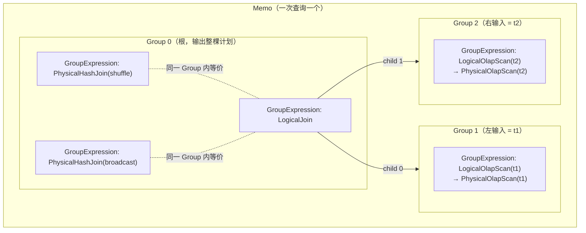

# 第 4 章：Nereids 优化器（下）—— CBO、统计信息与代价模型

上一章把一棵**已绑定、已精炼**的 `LogicalPlan` 交到了 `CascadesContext` 手里——谓词贴到了扫描、无用列被裁掉、子查询被去关联。但这棵树仍然是**纯逻辑**的：一个 `LogicalJoin` 到底走 hash join 还是 nested loop join、两个孩子按什么顺序连、数据在 BE 之间是广播还是按 key 重分布，全都没定。这些选择没有"永远更优"的答案——哪种更快取决于两张表各有多少行、过滤后还剩多少、集群有几个 BE。本章负责的就是这段：**从精炼逻辑计划出发，用代价模型在这些"只能比出来"的维度上搜出一棵最便宜的物理计划（`PhysicalPlan`）**。这就是 Nereids 的 CBO（Cost-Based Optimization，基于代价的优化）阶段。跑完本章，输出是一棵带好了分布属性的物理计划树；至于这棵树怎么切成 Fragment、怎么调度到 BE，是第 5 章的事——本章到"选定物理计划"为止。

读完本章，你应当能回答三件事：n 表 join 的搜索空间是卡特兰数级别的天文数字，Cascades 的 Memo 凭什么能在其中搜得动；分布式比单机多出来的那一维（广播/shuffle/bucket shuffle/colocate）怎么也被塞进代价里一起比；以及本章最烧脑的一块——当一个算子要求孩子"按某个 key 分好布"、而孩子的输出布局不满足时，优化器在**哪一行、依据什么**决定插入一个 Exchange（`PhysicalDistribute`）。这条决策链写错的话，会静默地把一张大表广播到每个 BE，直接打爆内存。

本章的行号引用基于写作时核实所用的 HEAD（`015763c73e`，源码树与系列基线 `7bc98f696f` 一致）。代码演进会让行号漂移，但对象名与结构不变；写作时每一处 `路径:行号` 都在当前代码里核实过。

## 4.1 问题：join 顺序与分布方式只能比出来

**遇到了什么问题？** 逻辑计划里的很多选择没有"通吃"的正确答案，必须依据数据量算代价才能比。最典型的是**多表 join 的连接顺序**：n 张表做内连接，可能的二叉连接树数量是卡特兰数 C(n-1) 乘上叶子排列，随 n 爆炸增长——10 张表就已经有上十万种形态，20 张表是天文数字。顺序为什么重要？先连出小中间结果、再连大表，和先连出大中间结果，执行代价可能差几个数量级。更麻烦的是，Doris 是分布式的，比单机 join 多出**一整维**：同一个 hash join，数据可以**广播**（把右表复制到每个 BE，`DistributionSpecReplicated`）、可以**按 join key shuffle**（两边都按 key 重分布到同一 BE，`DistributionSpecHash`）、如果两表本就按 join key 分桶还能走 **bucket shuffle / colocate**（省掉一次网络传输）。选哪种同样取决于表的大小——小表广播省 shuffle、大表广播是灾难。顺序与分布方式一叠加，搜索空间再乘一个维度。

**有哪些候选、各有什么优劣？**

- **候选一：System R 式动态规划穷举。** 自底向上枚举所有子集的最优连接方式，用 DP 表记住"这几张表连在一起的最优代价"。理论最优，但**表一多就爆**：DP 表规模是 2^n，十几张表的 join 内存和时间都扛不住；经典 System R 还只考虑左深树（left-deep），错过 bushy 形态的更优解。
- **候选二：贪心启发式。** 每步都挑"当前看起来最省"的两张表连起来，不回头。**快，但容易被局部最优带偏**：贪心看不到全局，某一步选了眼前便宜的连法，可能把后面所有连接都拖进大中间结果。而且贪心同样绕不开"分布方式选哪种"这维——没有代价估算就只能拍脑袋。
- **候选三：Cascades 风格的 Memo 记忆化搜索。** 把等价的子计划**分组（Group）去重**，同一组只算一次代价、存最优；用**自顶向下 + 剪枝（上界）**避免枚举整棵搜索树；关键是把**物理属性的推导与 enforcer 插入**（分布方式满不满足、要不要补 Exchange）**一体化**地嵌进代价搜索的同一个框架里——顺序、物理实现、分布方式在同一套代价比较下统一决策，而不是分三轮各拍各的。

**Doris 怎么考量和解决的？** Nereids 选了 Cascades（`CascadesContext` 的名字即源于此），但**没有一条道走到黑**，而是按 join 表数分层兜底。核心开关是会话变量 `max_table_count_use_cascades_join_reorder`（`fe/fe-core/src/main/java/org/apache/doris/qe/SessionVariable.java:521`，默认 `10`，见 `:2328`）：连续 join 的表数**不超过阈值**时，join 重排就融进 Cascades 的探索规则里（`JoinCommute`、`InnerJoinLAsscomProject` 等交换/结合律规则枚举顺序）；**超过阈值**时，纯 Cascades 枚举扛不住，切换到一套独立的 **DPhyp（DPhyper，基于超图的动态规划）** 算法专门做 join 重排——入口 `JoinOrderJob`（`fe/fe-core/src/main/java/org/apache/doris/nereids/jobs/joinorder/JoinOrderJob.java:41`），用超图 `HyperGraph` 枚举连通子图、`PlanReceiver` 收集最优子计划，重排完再把结果塞回 Memo 继续后续的物理实现选择。这个分流判断在 `Optimizer.isDpHyp()`（`fe/fe-core/src/main/java/org/apache/doris/nereids/jobs/executor/Optimizer.java:108`）：`enable_dphyp_optimizer`（`fe/fe-core/src/main/java/org/apache/doris/qe/SessionVariable.java:404`，默认关）强制走 DPhyp，或者连续 join 表数超过阈值时自动切换；还有个细节——**统计信息缺失时阈值翻倍**（`fe/fe-core/src/main/java/org/apache/doris/nereids/jobs/executor/Optimizer.java:120`），因为估不准的场景 DPhyp 的收益也打折，不如让 Cascades 多扛一会儿。本章后面就沿这两条路把 Memo、代价、统计信息拆开讲。

## 4.2 源码走读：Memo 与 Cascades 搜索

CBO 阶段的入口在 `NereidsPlanner` 里的 `new Optimizer(cascadesContext).execute()`（`fe/fe-core/src/main/java/org/apache/doris/nereids/NereidsPlanner.java:590`）。`Optimizer.execute()`（`fe/fe-core/src/main/java/org/apache/doris/nereids/jobs/executor/Optimizer.java:71`）的主干只有四步：**建 Memo**（`toMemo()`）→ **自底向上推导统计信息**（`DeriveStatsJob`）→ **（表多时）先跑 DPhyp 重排 join**（`dpHypOptimize()`）→ **对根 Group 做代价搜索**（`OptimizeGroupJob`）。前两步和最后一步之间靠 Memo 这个数据结构串起来。

### Memo：等价计划的记忆化容器

先建立 Memo 的三层结构，这是理解后面一切的基础：



- **`Group`**（`fe/fe-core/src/main/java/org/apache/doris/nereids/memo/Group.java:59`）：一组**逻辑等价**的计划的集合。一个 Group 代表"计算出某个中间结果的所有等价方式"。它内部把逻辑表达式和物理表达式分开存（`logicalExpressions` / `physicalExpressions`，`fe/fe-core/src/main/java/org/apache/doris/nereids/memo/Group.java:64`、`:65`），并维护一张 `lowestCostPlans`（`fe/fe-core/src/main/java/org/apache/doris/nereids/memo/Group.java:74`）——**每种输出物理属性下的最低代价计划**，这是记忆化的核心：同一个 Group 在同一个属性要求下只需搜一次。
- **`GroupExpression`**（`fe/fe-core/src/main/java/org/apache/doris/nereids/memo/GroupExpression.java:53`）：一个算子节点，但它的**孩子指向的是 Group 而不是具体计划**（`children` 是 `List<Group>`，`fe/fe-core/src/main/java/org/apache/doris/nereids/memo/GroupExpression.java:59`；自身算子存在 `plan`，`:60`）。正是这层"节点连的是等价类而非具体子树"的间接，让 n 张表的指数级组合被压进了多项式规模的 Group 里——这就是 Memo 去重的本质。它还带一张 `lowestCostTable`（`:72`），记录"要产出某种输出属性，各孩子分别需要什么输入属性、总代价多少"。
- **`Memo`**（`fe/fe-core/src/main/java/org/apache/doris/nereids/memo/Memo.java:74`）：所有 Group 的容器。插入计划走 `copyIn`（`fe/fe-core/src/main/java/org/apache/doris/nereids/memo/Memo.java:264`），它用一张 `groupExpressions` 哈希表做**去重**：搜索期把新计划塞进 Memo 的 `doCopyIn` 里，新建的 `GroupExpression` 先去哈希表查 `existedExpression = groupExpressions.get(newGroupExpression)`（`fe/fe-core/src/main/java/org/apache/doris/nereids/memo/Memo.java:527`），查到就走 `rewriteByExistedGroupExpression` **复用已有表达式**、查不到才新建（`:530`~`:533`）。**这正是"分组去重"落地的那几行**——两条不同规则若推导出结构相同的子计划，会被折叠进同一个 Group，代价只算一次。作为对照，初始建 Memo 的 `init` 路径（`:461`~`:468`）反而在遇到重复时直接 `throw IllegalStateException("maybe a bug")`（`:466`）：初始构建期本不该出现重复表达式，重复即 bug；只有搜索期规则爆炸出的重复才需要 `doCopyIn` 去复用。

### jobs/cascades/：把搜索拆成一串 Job

Cascades 的搜索不是递归函数，而是一串**可入栈、可克隆、可挂起**的 `Job`，压进 `CascadesContext` 的 job 栈里调度。`jobs/cascades/` 下正好五个 Job，对应搜索的四类动作：

- **`OptimizeGroupJob`**（`fe/fe-core/src/main/java/org/apache/doris/nereids/jobs/cascades/OptimizeGroupJob.java:34`）：优化一个 Group。它给组内每个逻辑表达式派一个 `OptimizeGroupExpressionJob`（`:51`），给每个物理表达式派一个 `CostAndEnforcerJob`（`:58`）。
- **`OptimizeGroupExpressionJob`**（`fe/fe-core/src/main/java/org/apache/doris/nereids/jobs/cascades/OptimizeGroupExpressionJob.java:38`）：对一个逻辑表达式**应用规则**。它从规则集里取出能匹配的探索规则和实现规则，各派一个 `ApplyRuleJob`（`:60`）。
- **`ApplyRuleJob`**（`fe/fe-core/src/main/java/org/apache/doris/nereids/jobs/cascades/ApplyRuleJob.java:45`）：真正跑一条规则，把产出的新计划 `copyIn` 回 Memo（可能建新 Group、也可能命中去重）。
- **`DeriveStatsJob`**（`fe/fe-core/src/main/java/org/apache/doris/nereids/jobs/cascades/DeriveStatsJob.java:45`）：自底向上给每个 GroupExpression 算统计信息（4.3 详述），先派孩子的 `DeriveStatsJob` 再算自己（`:88`~`:95`）。
- **`CostAndEnforcerJob`**（`fe/fe-core/src/main/java/org/apache/doris/nereids/jobs/cascades/CostAndEnforcerJob.java:48`）：**本章的重头戏**，算一个物理表达式的代价、并在孩子分布属性不满足时插入 enforcer。下一节单独拆。

这套 Job 栈还藏着 Cascades 的**剪枝**：`CostAndEnforcerJob` 优化孩子时带着一个上界（当前已知最优代价），一旦某个孩子在某个属性要求下的最低代价计划取不到、或部分代价已超过上界，就在核心循环里 `break` 掉这一支（`fe/fe-core/src/main/java/org/apache/doris/nereids/jobs/cascades/CostAndEnforcerJob.java:167`~`:170`），不再往下枚举。正是"分组去重 + 上界剪枝"两件事合起来，把卡特兰数级别的搜索空间压到了工程上可搜的规模——这也是 4.1 说 Cascades 能"搜得动"的底气。

### rules/exploration/ 与 rules/implementation/：变换 vs 物理化

Cascades 的规则分成泾渭分明的两类，`OptimizeGroupExpressionJob` 对它们一视同仁地派 `ApplyRuleJob`，但它们的职责不能混：

- **探索规则（exploration）** 在 `rules/exploration/`：做**逻辑→逻辑**的等价变换，产出仍是逻辑算子，插回**同一个 Group**（因为逻辑等价）。join 交换律 `JoinCommute`（`fe/fe-core/src/main/java/org/apache/doris/nereids/rules/exploration/join/JoinCommute.java:36`）、结合律 `InnerJoinLAsscomProject` 等就在这里——它们枚举 join 顺序，靠的就是把 `A⋈B` 变成 `B⋈A`、把 `(A⋈B)⋈C` 变成 `A⋈(B⋈C)`，新形态和旧形态逻辑等价，进同一 Group 等着比代价。
- **实现规则（implementation）** 在 `rules/implementation/`：做**逻辑→物理**的物理化，把 `LogicalJoin` 落成 `PhysicalHashJoin`、把 `LogicalAggregate` 落成一阶段/两阶段的 `PhysicalHashAggregate`（`fe/fe-core/src/main/java/org/apache/doris/nereids/rules/implementation/AggregateStrategies.java:79`）。产出是物理算子，进的是同一 Group 的 `physicalExpressions`。

> **易错点：把探索规则误写成实现规则（或反之），会怎样？** 这两类规则在框架里长得几乎一样（都实现规则接口、都产出 `Plan`），编译器不拦你。但语义边界是硬的：**探索规则的产出必须与输入逻辑等价、且仍是逻辑算子**；**实现规则的产出必须是能直接映射到 BE 算子的物理算子**。如果把一个物理化规则错标成探索规则，产出的 `PhysicalHashJoin` 会被当逻辑表达式继续参与探索，`DeriveStatsJob`/后续规则按逻辑算子处理它，轻则该物理实现根本进不了 `lowestCostPlans`（选不出来）、重则触发 `Preconditions` 断言崩在搜索中途。反过来，把一个逻辑变换错标成实现规则，它产出的逻辑算子会被塞进 `physicalExpressions`，`CostAndEnforcerJob` 拿一个没有物理代价语义的节点去算代价，得到的代价没有意义、选出来的"最优计划"是错的。判断准绳很简单：**产出还是不是逻辑算子、变换前后是不是逻辑等价**——是就归探索，把逻辑树换个物理实现就归实现。

### tricky 点：required property / enforcer——插 Exchange 的决策点

这是 CBO 里读代码最绕、也最有价值的一块，单独展开。问题的本质是：**一个物理算子对孩子的数据分布有要求，孩子的实际输出分布未必满足，谁来补上这道 gap？** 例如 shuffle hash join 要求"两个孩子都按 join key 分布到同一 BE"，但孩子可能是一张按别的 key 分桶的表——这时必须在孩子上面插一个 `PhysicalDistribute`（Exchange，做网络重分布）把数据搬到位。这个决策发生在 `CostAndEnforcerJob` 里，链路是三段：

**第一段：`RequestPropertyDeriver`——父算子向孩子提要求。** `CostAndEnforcerJob.execute()`（`fe/fe-core/src/main/java/org/apache/doris/nereids/jobs/cascades/CostAndEnforcerJob.java:116`）一进来就 new 一个 `RequestPropertyDeriver`（`:131`），调 `getRequestChildrenPropertyList`——**它按算子类型，列出"孩子们应该满足哪些分布属性"的候选清单**。看 hash join 的 `visitPhysicalHashJoin`（`fe/fe-core/src/main/java/org/apache/doris/nereids/properties/RequestPropertyDeriver.java:277`）：它会**同时**产出 shuffle 方案（要求两孩子按 join key hash，`:294`）**和** broadcast 方案（要求右孩子 `REPLICATED`、左孩子 `ANY`，`:299`）作为两个候选——注意这里不做取舍，broadcast 与 shuffle 都放进候选清单，留给代价去比。`couldBroadcast`/`checkBroadcastJoinStats`（`fe/fe-core/src/main/java/org/apache/doris/nereids/util/JoinUtils.java:79`、`:87`）只做**可行性**和**大小**门槛过滤，不做最终选择。

**第二段：递归优化孩子 + 对齐输出。** `execute()` 的核心循环（`fe/fe-core/src/main/java/org/apache/doris/nereids/jobs/cascades/CostAndEnforcerJob.java:154`~`:211`）对每个候选，逐个孩子去 `childGroup.getLowestCostPlan(requestChildProperty)`（`:161`）——问这个 Group "在这个属性要求下的最低代价计划是什么"。如果孩子还没为这个属性优化过（`:163`），就把自己 `clone()` 压回栈、先派一个 `OptimizeGroupJob` 去优化孩子（`:176`~`:178`），等孩子算完再回来。这就是 Cascades "自顶向下要求、自底向上返回"的记忆化递归。孩子返回后拿到它的**实际输出属性** `outputProperties`（`:185`）。

**第三段：`ChildrenPropertiesRegulator` + `EnforceMissingPropertiesHelper`——补 Exchange。** 孩子实际输出未必正好等于要求，`calculateEnforce`（`fe/fe-core/src/main/java/org/apache/doris/nereids/jobs/cascades/CostAndEnforcerJob.java:227`）先用 `ChildrenPropertiesRegulator`（`fe/fe-core/src/main/java/org/apache/doris/nereids/properties/ChildrenPropertiesRegulator.java:74`）在孩子之间**做调平**——比如 shuffle join 两边的 shuffle 方式要一致（NATURAL vs BUCKETED 不一致就得强制补 shuffle，`fe/fe-core/src/main/java/org/apache/doris/nereids/properties/ChildrenPropertiesRegulator.java:351` 的 `visitPhysicalHashJoin`）。然后 `enforce()`（`:291`）做最终判定：如果本节点输出属性已 `satisfy` 上层要求（`:293`）就不用补；否则调 `EnforceMissingPropertiesHelper.enforceProperty`（`fe/fe-core/src/main/java/org/apache/doris/nereids/properties/EnforceMissingPropertiesHelper.java:59`、`fe/fe-core/src/main/java/org/apache/doris/nereids/jobs/cascades/CostAndEnforcerJob.java:316`）补上。**补的那一下**在 `fe/fe-core/src/main/java/org/apache/doris/nereids/properties/EnforceMissingPropertiesHelper.java:129` 调 `DistributionSpec.addEnforcer`，而 `addEnforcer`（`fe/fe-core/src/main/java/org/apache/doris/nereids/properties/DistributionSpec.java:42`）就一件事：**`new PhysicalDistribute(...)`（`:45`）** 包在孩子外面。**这就是那个"插入 Exchange"的物理决策点**——一次网络重分布的引入，最终收敛到这一行；而补上的 `PhysicalDistribute` 带着 `visitPhysicalDistribute` 算出的网络代价（4.3）参与代价比较，broadcast 候选和 shuffle 候选谁便宜谁胜出，就在这里见分晓。

> **为什么这么绕？** 因为"要不要重分布、重分布成什么样"不是局部能拍板的：它取决于**上层要什么**（父算子的 required property）、**孩子能给什么**（孩子的最低代价输出）、以及**补这一刀值不值**（enforcer 的代价 vs 换个物理实现的代价）。Cascades 把这三者拆成"提要求（Deriver）→ 递归拿孩子输出 → 补 gap（Regulator/Helper）"三段，每一段只管一件事，才在指数级搜索里保持了可控。**错写会怎样：** 如果在 Deriver 阶段漏掉 broadcast 候选，大小表 join 就只剩 shuffle 一种走法，本可以广播小表省掉大表 shuffle 的机会没了；如果 `satisfy` 判断写松了（该补 Exchange 却判成满足），两边数据没落到同一 BE，join 结果直接错——而且是**静默错**，不报错、结果少行。

### 代价模型：三维加权，广播带惩罚

enforcer 补不补、broadcast 还是 shuffle，最终都归到"谁的代价数字小"。算这个数字的是 `CostCalculator`（`fe/fe-core/src/main/java/org/apache/doris/nereids/cost/CostCalculator.java:33`，`calculateCost` 在 `:38`），它对每个物理算子调 `CostModel`（`fe/fe-core/src/main/java/org/apache/doris/nereids/cost/CostModel.java:87`）算出一个三元组 `(cpuCost, ioCost, netCost)`，再由 `CostWeight`（`fe/fe-core/src/main/java/org/apache/doris/nereids/cost/CostWeight.java:37`）按 `cpuWeight`/`memoryWeight`/`networkWeight` 三个权重（`:40`~`:42`）加权求和成一个标量（`weightSum`，`:89`）。权重取自会话变量（`cbo_cpu_weight`/`cbo_mem_weight`/`cbo_net_weight`），这也是为什么代价是可调的——集群网络快就调低网络权重。

两个算子的代价函数最能说明"分布方式怎么进代价"：

- **`visitPhysicalDistribute`**（`fe/fe-core/src/main/java/org/apache/doris/nereids/cost/CostModel.java:296`）给不同分布方式定价。**shuffle**（`DistributionSpecHash`）的网络代价是 `行数 × 数据宽度 / BE 数`——因为数据被均摊到各 BE 并行传。**broadcast**（`DistributionSpecReplicated`）的网络代价是 `行数 × 数据宽度`，**没除以 BE 数**——因为广播要把整份数据复制给每个 BE，谁都省不掉。这一除一不除，正是"小表广播省、大表广播亏"的代价来源：行数小时广播的绝对值仍小，行数一大，不除 BE 数的广播代价迅速反超 shuffle。
- **`visitPhysicalHashJoin`**（`fe/fe-core/src/main/java/org/apache/doris/nereids/cost/CostModel.java:384`）在 `context.isBroadcastJoin()` 时**额外加一道广播惩罚**（build 端按 `broadcast_right_table_scale_factor` 放大），进一步压低"广播一张不算小的表"的胜率。但注意——**惩罚是乘在估计行数上的**，行数本身估错了（4.3），惩罚再重也惩罚不到真正的大表头上，这正是广播大表事故能绕过代价防线的原因。

## 4.3 源码走读：统计信息从哪来、怎么算

代价模型的输入是**行数、NDV（不同值个数）、数据大小**这些统计量。它们分两步进入优化器：先由 ANALYZE 把表级/列级统计**收集**进 FE，再由 `StatsCalculator` 在搜索时沿计划树**逐层推导**出每个中间结果的估计。

### ANALYZE 链路与自动收集

手动收集入口是 `ANALYZE TABLE ...`，走 `AnalysisManager.createAnalyze`（`fe/fe-core/src/main/java/org/apache/doris/statistics/AnalysisManager.java:117`、`:173`），`buildAndAssignJob`（`:216`）把收集任务拆成按列的子任务，下发 SQL 到 BE 扫数据、算出每列的 min/max/NDV/null 数/平均长度，写回 FE 的统计表并缓存。除手动外还有**自动收集**：会话/全局变量 `enable_auto_analyze`（`fe/fe-core/src/main/java/org/apache/doris/qe/SessionVariable.java:659`，`enableAutoAnalyze` 默认 `true`，见 `:2728`）开启时，后台的 `StatisticsAutoCollector` 定期扫描"数据变更超过阈值"的表自动重收，收集时间窗由 `auto_analyze_start_time`/`auto_analyze_end_time` 控制。

### StatsCalculator：沿计划自底向上推导

`StatsCalculator`（`fe/fe-core/src/main/java/org/apache/doris/nereids/stats/StatsCalculator.java:178`）是个访问者，由 `DeriveStatsJob` 驱动、对每个 GroupExpression 调 `estimate`（`:363`）。它**自底向上**：先算叶子扫描的行数（`getOlapTableRowCount`，`:489`），再逐层往上算。几类关键推导：

- **Scan**：取 ANALYZE 收集的表行数；列的 NDV/min/max 用于上层过滤估计。
- **Filter**：调 `FilterEstimation`（下述）把行数乘以选择率。
- **Join**：调 `JoinEstimation`（`fe/fe-core/src/main/java/org/apache/doris/nereids/stats/JoinEstimation.java:48`）。等值内连接的行数估计（`estimateInnerJoinWithEqualPredicate`，`:82`）用经典公式：`|A⋈B| ≈ |A|×|B| / max(NDV(A.k), NDV(B.k))`——即笛卡尔积乘以 join 条件的选择率。
- **Aggregate**：输出行数按 group by 列的 NDV 估计，缺省压缩比 `DEFAULT_AGGREGATE_RATIO = 1/3`（`fe/fe-core/src/main/java/org/apache/doris/nereids/stats/StatsCalculator.java:179`）。

### FilterEstimation：选择率的真实缺省值

`FilterEstimation`（`fe/fe-core/src/main/java/org/apache/doris/nereids/stats/FilterEstimation.java:74`）把一个谓词映射成 0~1 的选择率。有列统计时它用 min/max/NDV 算精确区间占比；**统计缺失或算不出时退到经验缺省值**，这些常量值得记住（都是真实源码值）：

- `col > c` / `col < c` 等**不等式**在拿不到范围时用 `DEFAULT_INEQUALITY_COEFFICIENT = 0.5`（`fe/fe-core/src/main/java/org/apache/doris/nereids/stats/FilterEstimation.java:75`）——即"猜过滤掉一半"。
- `col IN (...)` 用 `DEFAULT_IN_COEFFICIENT = 1/3`（`:79`）。
- `col LIKE ...` 用 `DEFAULT_LIKE_COMPARISON_SELECTIVITY = 0.2`（`:81`）。
- `col IS NULL` 用 `DEFAULT_ISNULL_SELECTIVITY = 0.005`（`:82`）。
- 区间选择率有下限 `RANGE_SELECTIVITY_THRESHOLD = 0.0016`（`:78`），防止估成 0 行。

### tricky 点：误差沿 join 树指数放大——"错一层、歪全局"

选择率估计天生不准（数据倾斜、列间相关性都会让公式失真）。单个算子估歪 2 倍问题不大，但**join 树会把误差连乘放大**：三层 join，每层各估歪 2 倍，顶层就可能歪 8 倍。而 join 顺序、broadcast/shuffle 的选择恰恰吃的是这个被放大的行数——底层某张表的行数估小了 10 倍，优化器就可能误判它"很小"从而选择广播它，实际它很大，广播直接打爆内存和网络。这就是"错一层、歪全局"：CBO 的输出质量**上限**由统计信息质量决定，代价模型再精也救不回错误的输入。

> **易错点：统计缺失/过期时的默认值行为 → 广播大表事故。** 表没 ANALYZE 过、或数据大改后统计过期时，`getOlapTableRowCount` 可能拿不到可靠行数（`fe/fe-core/src/main/java/org/apache/doris/nereids/stats/StatsCalculator.java:489` 的注释明说未分析且 BE 未报行数时返回 -1），列统计走 `FilterEstimation` 的缺省常量。此时 Group 的 `isStatsReliable` 被标为 false（`fe/fe-core/src/main/java/org/apache/doris/nereids/memo/Group.java:140`），代价模型进入"统计不可靠"分支（`CostModel` 在 `:399`、`:417` 等处用 `isStatsReliable()` 走保守逻辑）。最危险的场景：一张真实很大的表因为没统计被估成很小，`checkBroadcastJoinStats` 放行了它的广播候选，代价比较又因为行数估小而判定广播更便宜——于是**一张大表被广播到每个 BE**，每个 BE 都要为它建一份 hash 表，内存报警、甚至 OOM。这个事故模式在 4.5 会亲手复现，也是 4.6 排查清单里"广播了大表"那条的根因。

## 4.4 双模式对比

CBO 的**优化逻辑与存算一体/存算分离无关**：Memo 结构、Cascades 搜索、代价模型、`RequestPropertyDeriver`/enforcer 机制在两种模式下完全一致——它们都跑在 FE 里，输入是逻辑计划、输出是物理计划，不碰存储层。分布方式（broadcast/shuffle/colocate）的候选与代价计算也一致；两模式的存储差异（本地 tablet vs 远端对象存储 + File Cache）要到第 5 章 Fragment 切分与调度、以及 BE 执行层才显现。

唯一值得一提的差异在**统计信息收集作业的执行位置**：ANALYZE 下发的收集 SQL 在存算分离模式下由计算集群的 BE 扫描远端存储的数据来完成（可能命中 File Cache），而存算一体由本地 BE 扫本地 tablet；但收集到的统计**语义与消费方式完全一样**，都写回 FE 缓存供 `StatsCalculator` 读取。也就是说，**优化器层面两模式一致**，差异仅在收集作业物理上在哪读数据。

## 4.5 动手实验

环境（编译、单机部署、日志调整）沿用第 1 部分第 5 章（`docs/doris-internals/part1-architecture/05-source-map-and-dev-env.md`），不再重复。本节两个实验：一个验证 4.3 的"统计驱动估计"，一个主动踩 4.3/4.2 的"统计缺失→计划劣化"坑。

### 实验一（验证核心点）：ANALYZE 前后的行数估计与分布方式

**目标**：亲眼看到统计信息如何改变 CBO 的行数估计和 join 分布方式，对照 4.3 的推导链。建两张一大一小的表并灌数据（大表 t_big 百万级、小表 t_small 千级），做一个等值 join：

```sql
-- 先不 ANALYZE，直接看物理计划
EXPLAIN PHYSICAL PLAN
SELECT t_big.v, t_small.v FROM t_big JOIN t_small ON t_big.k = t_small.k;
```

`EXPLAIN` 的 `PHYSICAL PLAN`（等价于 `OPTIMIZED PLAN`，`planType` 见 `fe/fe-sql-parser/src/main/antlr4/org/apache/doris/nereids/DorisParser.g4:1181`）打印的就是本章 CBO 选出的物理计划。**没统计时**，行数估计走 `FilterEstimation` 缺省值、两表大小可能被估得接近，join 的分布方式和 build 端选择未必合理。然后收集统计再看：

```sql
ANALYZE TABLE t_big;
ANALYZE TABLE t_small;

EXPLAIN PHYSICAL PLAN
SELECT t_big.v, t_small.v FROM t_big JOIN t_small ON t_big.k = t_small.k;
```

**要建立的能力**：对比两份物理计划，观察 (1) 扫描节点的 `cardinality`/行数估计从缺省值变成真实值；(2) join 的分布方式——统计准确后，优化器应认出 t_small 是小表、倾向**广播 t_small**（`DistributionSpecReplicated`），避免对百万行的 t_big 做 shuffle。这正是 4.2 的 `RequestPropertyDeriver` 产出 broadcast/shuffle 两个候选、代价模型据真实行数选广播的结果，也是 4.3 统计信息喂给代价模型的完整链路走了一遍。想看得更细可用 `EXPLAIN SHAPE PLAN`（`fe/fe-sql-parser/src/main/antlr4/org/apache/doris/nereids/DorisParser.g4:1182`）只看树形、或 `EXPLAIN MEMO PLAN`（`:1183`）看 Memo 里的 Group 与候选。

### 实验二（踩坑）：DROP STATS 后观察 broadcast/shuffle 翻转

**目标**：把"统计缺失→计划劣化"亲手踩一遍。Doris 支持 `DROP STATS`（`fe/fe-sql-parser/src/main/antlr4/org/apache/doris/nereids/DorisParser.g4:904`）删掉已收集的统计。在实验一"已 ANALYZE、走广播小表"的状态基础上，删掉小表统计：

```sql
-- 删掉小表统计，制造"统计缺失"
DROP STATS t_small;

EXPLAIN PHYSICAL PLAN
SELECT t_big.v, t_small.v FROM t_big JOIN t_small ON t_big.k = t_small.k;
```

**要建立的能力**：观察 join 分布方式**是否翻转**——小表统计一没，`isStatsReliable` 转 false，优化器可能不再敢/不再选广播（或反过来把没估准的表误广播）。构造更极端的场景：把大小表对调、只 DROP 大表的统计，看优化器会不会因为把大表估小而**误选广播大表**——这正是 4.3 讲的事故模式。踩完记得 `ANALYZE TABLE t_small;`（和 t_big）恢复。这个坑的价值：线上一次 `DROP STATS`、或大数据导入后统计过期，就足以让一个原本健康的计划劣化成广播大表，进而内存报警——把因果亲手串一遍，4.6 的排查清单才有体感。

## 4.6 排查清单

按"症状 → 定位入口"组织，覆盖 CBO 阶段最高频的三类问题。

### 症状 A：join 顺序或分布方式明显不对

- **先查统计，再查 hint。** join 顺序/分布方式反常，**第一嫌疑永远是统计信息**（4.3 的"错一层歪全局"）。用 `SHOW TABLE STATS`/`SHOW COLUMN STATS` 确认相关表列有没有统计、是不是过期；`EXPLAIN PHYSICAL PLAN` 看扫描节点的行数估计是否离谱。统计没问题再看是否有人下了 join hint（`SHUFFLE`/`BROADCAST`/leading）把优化器的选择锁死了——hint 在 `RequestPropertyDeriver.visitPhysicalHashJoin`（`fe/fe-core/src/main/java/org/apache/doris/nereids/properties/RequestPropertyDeriver.java:277`）会短路掉代价比较。
- **表数很多时确认走的是 Cascades 还是 DPhyp。** 连续 join 表数超过 `max_table_count_use_cascades_join_reorder`（默认 10）会切到 DPhyp（4.1）；两条路的重排行为不同，定位时先分清在哪条路上。

### 症状 B：广播了大表，伴随 BE 内存报警

- **这是 4.3 事故模式的典型症状。** `EXPLAIN PHYSICAL PLAN` 里看到对一张明显很大的表出现了 `PhysicalDistribute` 的 broadcast/`REPLICATED`，同时 BE 侧 hash join build 内存暴涨甚至 OOM。**根因几乎总是该表统计缺失或严重估小**——被估成小表才会被选中广播。
- **定位与止血。** 先 `ANALYZE TABLE` 补齐该表统计、重跑看是否恢复成 shuffle；紧急止血可用 hint 强制 `SHUFFLE` 或调低广播阈值（`checkBroadcastJoinStats` 依赖的大小门槛）。根治是把该表纳入自动收集、或排查为什么统计过期。

### 症状 C：ANALYZE 不生效或统计过期

- **确认收集是否真的完成。** `SHOW ANALYZE`（`fe/fe-sql-parser/src/main/antlr4/org/apache/doris/nereids/DorisParser.g4:885` 一带）看任务状态；`SHOW TABLE STATS` 看行数和最近更新时间，判断是否过期。
- **确认自动收集开关与窗口。** `enable_auto_analyze`（默认开，`fe/fe-core/src/main/java/org/apache/doris/qe/SessionVariable.java:659`）是否被关；`auto_analyze_start_time`/`end_time` 窗口是否覆盖当前时段——自动收集只在窗口内跑，窗口设窄了大表可能长期收不到。必要时手动 `ANALYZE TABLE` 兜底。

---

本章走完了查询链路从"精炼逻辑计划"到"选定物理计划"的一段：`Optimizer.execute()` 建起 `Memo`，用 `Group`/`GroupExpression` 把指数级的等价计划去重压进多项式规模的容器，再用一串 `Job`（`OptimizeGroupJob`→`OptimizeGroupExpressionJob`→`ApplyRuleJob`/`CostAndEnforcerJob`）做自顶向下、带剪枝的代价搜索。我们重点抠了几个点：探索规则与实现规则的语义边界（逻辑等价 vs 物理化，错标会静默选错计划）；本章最烧脑的 required property/enforcer 三段链路——`RequestPropertyDeriver` 提要求、递归拿孩子输出、`ChildrenPropertiesRegulator`/`EnforceMissingPropertiesHelper` 在 `DistributionSpec.addEnforcer` 那一行 `new PhysicalDistribute` 补上 Exchange，这是"插不插网络重分布、broadcast 还是 shuffle"的最终决策点；以及统计信息这条命脉——`FilterEstimation` 的真实缺省选择率、误差沿 join 树指数放大、统计缺失把大表广播成事故的因果。表多时 Cascades 让位给 `JoinOrderJob` 的 DPhyp 兜底。至此优化器交出一棵带好分布属性的 `PhysicalPlan`——下一章从这里接手，把它切成 `PlanFragment`、在 `ExchangeNode` 处断开，调度到各个 BE，存算一体与存算分离的路径差异也从这里开始真正分叉。
