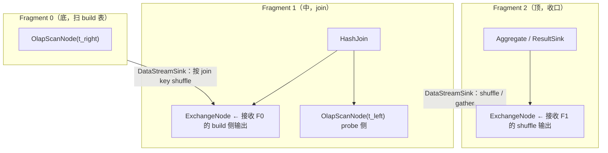
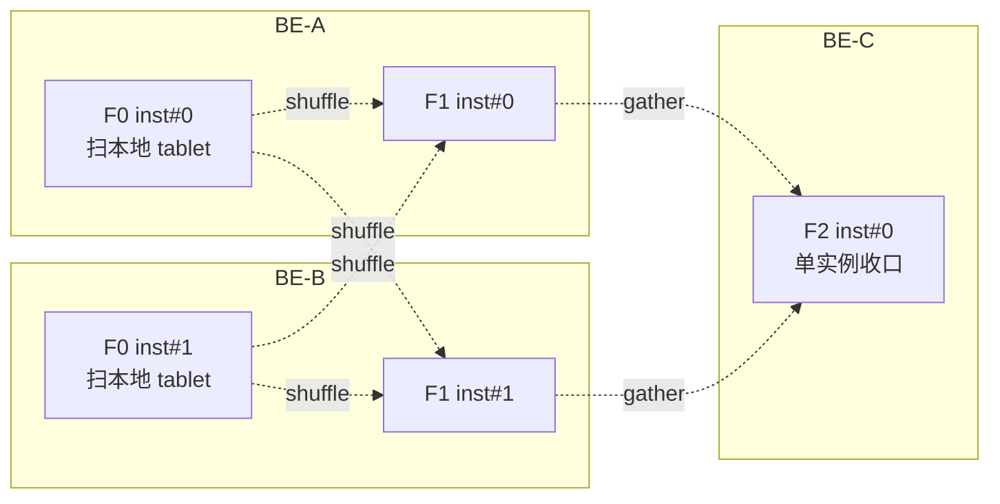

# 第 5 章：计划分发 —— Fragment 切分与 Coordinator 调度

上一章优化器交出了一棵**带好分布属性的物理计划树**（`PhysicalPlan`）：每个 join 的实现方式定了、哪里该 broadcast、哪里该按 key shuffle、两表本就分好桶的地方走 bucket shuffle / colocate 也定了。但这棵树此刻还只活在 FE 一个进程的内存里——它描述的是"数据应该怎么流动"，却还没落到"哪台 BE 跑哪一段、跑几份"。本章负责的就是这段**从一棵逻辑上的物理计划到一群机器上一堆并行执行实例的翻译**：把物理计划在 `ExchangeNode` 处切成一棵 `PlanFragment` 树，给每个 Fragment 定并行度、展开成若干并行实例，为每个扫描实例挑一个装着目标数据的 BE，最后用 brpc 把每台 BE 该跑的那几个 Fragment 打包发下去。发到 BE 的 `FragmentMgr` 收下那一刻，本章结束，第 6 章从 BE 侧接手。

读完本章，你应当能回答三件事：一棵计划树凭什么能被切成可以各自设并行度、独立调度的段，切点为什么恰好是 Exchange；bucket shuffle join / colocate join 这类"计划已经假定两边数据同分布"的场景，为什么调度器**不能自由选机器**、实例必须钉死跟着 bucket 走，写错会怎样；以及本章的重头戏——同样一句 SQL，存算一体下是"3 副本任选、坏了拉黑换一个"，存算分离下却是"tablet 按哈希固定映射到计算组内某台 BE、为的是命中 File Cache"，这两条副本选择路径在源码里到底分叉在哪、各自的代价是什么。

本章的行号引用基于写作时核实所用的 HEAD（`cd7e585a45`，源码树与系列基线 `7bc98f696f` 一致）。代码演进会让行号漂移，但对象名与结构不变；写作时每一处 `路径:行号` 都在当前代码里核实过。

## 5.1 问题：一棵计划树怎么摊到一群机器上

**遇到了什么问题？** 优化器给的是一棵**逻辑上完整**的算子树：底下扫两张表、中间做 hash join、顶上做聚合。但集群里有 N 台 BE，每台只存着一部分数据（一张表的数据按 tablet 打散在各 BE 上）。这棵树不可能整棵塞给一台机器跑——那台机器既没有全部数据，也浪费了其余 N-1 台的算力。问题就是：**怎么把这一棵树摊到 N 台机器上，让每台都只干自己数据那一份，同时该汇总的地方能正确地把数据汇到一起？**

**有哪些候选、各有什么优劣？**

- **候选一：单点执行，放弃并行。** 把整棵树交给一台机器，需要别的机器上的数据就去拉。实现最简单，没有任何切分、调度、shuffle 的复杂度。但**完全放弃了 MPP 的意义**：一台机器的 CPU、内存、磁盘带宽就是天花板，大表扫描和大 join 直接卡死。这只在单 BE 或极小数据量下勉强成立。
- **候选二：全对称 SPMD，每台跑一份完整计划。** 每台 BE 都拿到同一棵完整的计划树，各自扫本地数据，遇到需要跨机的数据交换（比如 join 两边要按 key 对齐）时，全靠运行时的一套通用 shuffle 机制在机器间搬数据。**并行度拉满了，但粒度太粗**：整棵树被当成一个不可分的整体，无法给"扫描"和"聚合"这两段设不同的并行度——扫描想按 tablet 数铺开、最终聚合可能只需要一个实例收口，SPMD 模式下没法分别调。而且哪里该交换数据、按什么 key 交换，全压到运行时去猜，计划期已经算好的分布信息用不上。
- **候选三：按 Exchange 边界切 Fragment，每段独立设并行度。** 计划树里凡是需要**跨机器重分布数据**的地方，优化器都已经插了一个 `ExchangeNode`（第 4 章的 enforcer 干的）。以每个 Exchange 为界把树切开：Exchange 下面那一截是一个 Fragment、上面那一截是另一个 Fragment，Exchange 本身成为两个 Fragment 之间的"接缝"——下面的 Fragment 的输出通过一个 sender 发给上面 Fragment 的 `ExchangeNode` 接收。切完之后，**每个 Fragment 是一段内部无需跨机交换的连续算子链**，可以独立地决定"我要展开成几个并行实例、每个实例跑在哪台机器上"。这正是 MPP 数据库（Presto/Trino、Impala、Doris 都是这一派）的通行做法。

**Doris 怎么考量和解决的？** Doris 选候选三，而且切点判据非常干净：**Exchange 就是切分点**。为什么是 Exchange 而不是别的算子？因为 Exchange 是计划树里**唯一**表达"数据要换一种分布方式、要跨机器搬"的算子——它下面的算子链共享同一种数据分布（都在同一批实例本地流动），一插 Exchange 就意味着"这里数据要重新洗牌了"，天然就是并行度可以重设的边界。切完后每个 Fragment 的并行度（展开成几个实例）单独定：扫描 Fragment 按数据分布铺开、shuffle 后的 Fragment 按并行参数铺开、最终汇总 Fragment 收成一个实例。实例数大致是**每个 Fragment 的并行度 × 承载它的 BE 台数**，但扫描 Fragment 还要受"实例数不超过它要扫的 tablet 数"约束（5.2 详述）。

还有一个绕不开的问题：**谁来当这个协调者？** 谁负责切 Fragment、挑 BE、发计划、收结果、处理某台 BE 中途挂掉？两种典型架构：一是 FE 直接充当协调者（Coordinator 逻辑跑在 FE 进程里），二是 FE 把计划丢给某台 BE、派驻一个 BE 当协调者，FE 只管转发。Doris 选了**前者**——协调逻辑就在 FE 的 `Coordinator`（`fe/fe-core/src/main/java/org/apache/doris/qe/Coordinator.java:184`）里。取舍很清楚：让 FE 当协调者**省了一跳**（FE 本来就持有物理计划、catalog、BE 拓扑，不用再序列化整个计划发给某台 BE 再由它协调），元数据都在手边、调度决策直接做；代价是**协调负载压在 FE 上**——高并发下成百上千个查询的 Fragment 分发、状态收集、结果拉取都由 FE 承担，FE 是这条路上的忙点，这也是后续 Coordinator 一路在做异步化、轻量化的原因。

## 5.2 源码走读：Fragment 切分与实例展开

Fragment 切分本身在优化器出物理计划时就已经随着 Exchange 的插入完成了——`PlanFragment`（`fe/fe-core/src/main/java/org/apache/doris/planner/PlanFragment.java:89`）是一棵以 `ExchangeNode`（`fe/fe-core/src/main/java/org/apache/doris/planner/ExchangeNode.java:51`）为接缝的树，每个 Fragment 记着自己的 `planRoot`（这一段算子链的根，见 `getPlanRoot()`）和一个 `DataPartition`（`fe/fe-core/src/main/java/org/apache/doris/planner/DataPartition.java`，描述本 Fragment 输出怎么分区）。真正在本章展开的是**调度**：把这棵 Fragment 树变成一堆带了机器地址的并行实例。

以一条两表 join 的 SQL 为例，切出来的 Fragment 树和实例分布如下：



每个 Fragment 展开成实例后大致是：



调度的驱动主干在 `Coordinator.exec()`（`fe/fe-core/src/main/java/org/apache/doris/qe/Coordinator.java:779`）里，两步串起来：先 `computeScanRangeAssignment()`（`:2286`）——为每个扫描算子把它要读的 tablet（scan range）分配到具体 BE；再 `computeFragmentExecParams()`（`:1463`）——把每个 Fragment 展开成实例、把上下游 sender/receiver 的目的地址接好。其中 `computeFragmentHosts()`（`:1872`）负责给非扫描 Fragment（如 shuffle 后的 join、聚合）挑承载机器。

### 实例展开：并行度从哪来、被谁封顶

一个 Fragment 展开成几个实例，源头是 `PlanFragment.getParallelExecNum()`（`fe/fe-core/src/main/java/org/apache/doris/planner/PlanFragment.java:314`）。这个值在构造 Fragment 时由 `setParallelExecNumIfExists()`（`:235`）调 `getParallelExecInstanceNum(clusterName)` 取得。并行度的**多个来源与优先级**都压在 `SessionVariable.getParallelExecInstanceNum()`（`fe/fe-core/src/main/java/org/apache/doris/qe/SessionVariable.java:4453`）里，谁生效有明确顺序：

1. **用户级设置最高**：若该用户在 Auth 里配了 `parallel_fragment_exec_instance_num` 且 > 0，直接用它（`:4457`）。
2. **会话变量 `parallel_pipeline_task_num`**：字段 `parallelPipelineTaskNum`（`:1420`，常量名见 `:180`）。它**默认是 0，0 代表"自动"**——不是"零并行"。
3. **自动值兜底**：当 `parallelPipelineTaskNum == 0` 时（`:4466`），取本计算组里 BE 的最小 pipeline 执行线程数 `size`，算 `autoInstance = (size + 1) / 2`，再对 `maxInstanceNum` 封顶（`:4467`）。也就是**按机器 CPU 核数自适应**，约等于半个核数。

> **易错点：`parallel_pipeline_task_num` 手动调大不是越大越好。** 很多人以为把它从 0（自动）改成一个大值就能加速。但实例数展开后每个实例都要占 pipeline 执行线程、内存和调度开销；设得远超机器核数，只会让线程互相抢 CPU、上下文切换飙升，profile 里看到的是每个 instance 都变慢。而且**扫描 Fragment 的实例数还会被 tablet 数二次封顶**：`computeFragmentExecParams` 的普通扫描分支里 `expectedInstanceNum = Math.min(perNodeScanRanges.size(), parallelExecInstanceNum)`（`:2084`）——一台 BE 上这个扫描只摊到 3 个 tablet，你把并行度设成 16 也只会起 3 个实例，多设的那部分对扫描 Fragment 完全无效。真要提并行，先确认瓶颈 Fragment 是不是被 tablet 数卡住了（分桶数太少），而不是一味调大会话变量。

### tricky 点：bucket shuffle / colocate join —— 实例必须跟着 bucket 走

绝大多数 Fragment 的实例可以自由挑机器：扫描实例优先挑数据本地的 BE、shuffle 后的实例可以摊到任意 BE。但有两类 Fragment 是**例外**，它们的实例位置被计划本身钉死了，调度器**没有自由**——这就是 colocate join 和 bucket shuffle join。

回顾第 4 章：这两种 join 的前提是"两张表按同一套 bucket 规则分桶"，于是**同一个 bucket 的左表数据和右表数据一定在同一台 BE 上**，join 可以完全本地做、省掉一次网络 shuffle。但这个"省"能成立，**当且仅当调度器把处理同一个 bucket 的左右两侧实例放到同一台 BE 上**。一旦调度器自作主张把某个 bucket 的 join 实例调到别的机器，右表那一份数据不在那台机器上，join 结果直接错——这是典型的"计划正确，但调度也必须配合，否则前功尽弃"。

源码里这个约束是这样表达的。`computeFragmentExecParams` 在给 Fragment 展开实例时先分流（`:2042` 起）：

```java
int parallelExecInstanceNum = fragment.getParallelExecNum();
if (isColocateFragment(fragment, fragment.getPlanRoot()) && ...) {
    computeColocateJoinInstanceParam(fragment.getFragmentId(), parallelExecInstanceNum, params, ...);   // :2047
} else if (bucketShuffleJoinController.isBucketShuffleJoin(fragment.getFragmentId().asInt())) {
    bucketShuffleJoinController.computeInstanceParam(fragment.getFragmentId(), parallelExecInstanceNum, params, ...);  // :2050
} else {
    // 普通 Fragment：可以自由按 tablet 数 / 并行度铺开
}
```

关键在 colocate/bucket-shuffle 这两条分支**不是按机器分实例，而是按 bucket 序号分实例**。它们共用底层的 `assignScanRanges()`（`:2903`），而 bucket→机器地址的绑定早在 `computeScanRangeAssignmentByColocate()`（`:2367`）里就固定下来了——核心那一行是把某个 bucket 序号钉到某台 BE 地址：

```java
this.fragmentIdToSeqToAddressMap.get(fragmentId).put(bucketSeq, execHostPort);   // :2416
```

`fragmentIdToSeqToAddressMap`（外层字段 `:3054`，bucket-shuffle 版在 `BucketShuffleJoinController` 内部 `:2765`）是一张 `bucketSeq → BE 地址` 的映射：**同一个 bucket 序号的所有 scan range，无论属于左表还是右表，都被 put 到同一个 `execHostPort`**。展开实例时按 bucket 序号切分，于是处理 bucket #k 的实例必然落在绑定给 #k 的那台 BE 上，左右两侧自动同机。`isColocateFragment()`（`:2204`）和 `BucketShuffleJoinController.isBucketShuffleJoin()`（`:2810`）负责识别哪些 Fragment 走这条受约束的路。

> **错写/误配会怎样？** 如果这里的绑定被破坏——比如 colocate group 的两张表分桶数不一致、或某张表的 tablet 分布因迁移而偏移，导致同一 bucket 序号在两表里映射到不同 BE——轻则 colocate 条件不满足、优化器退化回普通 shuffle join（多一次网络传输，慢但结果对），重则若绑定错乱而未被识别，join 会漏配对、结果错。所以 colocate 表有一套严格的"分桶一致性"前置校验（分桶列、分桶数、副本数都要对齐），本质就是为了保证这张 `bucketSeq → BE` 映射在两表间可对齐。运维上把某个 BE 下线做均衡时，colocate 表的 tablet 迁移必须整组一起走，也是这个原因。

## 5.3 源码走读：副本选择与下发

实例展开到"每个实例该在哪台 BE"这一步，绕不开一个问题：一个 tablet 通常有多个副本（存算一体下默认 3 副本），扫描实例该挑哪个副本所在的 BE？挑中的那台又恰好挂了怎么办？这就是**副本选择**，落在 `SimpleScheduler`（`fe/fe-core/src/main/java/org/apache/doris/qe/SimpleScheduler.java:48`）。

### SimpleScheduler：本地性、黑名单、可用性

普通扫描分配走 `computeScanRangeAssignmentByScheduler`，最终为每个 scan range 挑 BE 时调 `SimpleScheduler.getHost(backendId, locations, backends, backendIdRef)`（`:208`）。逻辑很直白：先看首选的 `backendId`（本地性——优化阶段已把 scan range 的候选副本地址打乱、尽量分散）是否 `isAvailable`；不可用就遍历这个 scan range 的其余副本 `locations`，挑第一个可用的（`:226` 起）。所谓可用 `isAvailable()`（`:337`）= 该 BE 存在 && `isQueryAvailable()`（在线、未被禁查询）&& **不在黑名单**。

黑名单是理解"哪些故障能容忍"的关键。它是一张进程级静态表 `blacklistBackends`（`:200`），一台 BE 出问题时通过 `addToBlacklist(backendID, reason)`（`:322`）尝试拉黑。但**不是一失败就立刻拉黑**——`tryAddBlackList` 有阈值护栏：要在 `do_add_backend_black_list_threshold_seconds`（默认 30 秒，`fe/fe-common/src/main/java/org/apache/doris/common/Config.java:2069`）窗口内被尝试拉黑达 `do_add_backend_black_list_threshold_count` 次（默认 10 次，`:2064`）才真正进黑名单；进去之后由后台 `UpdateBlacklistThread`（`:351`）每秒巡检，BE 恢复 alive 或黑名单停留超过 `stay_in_backend_black_list_threshold_seconds`（默认 60 秒，`:2073`）就移出。这套"累计多次才拉黑、超时自动放行"的设计，是为了避免一次偶发抖动就把一台好 BE 打入冷宫。

### tricky 点：哪些错误会自动换副本、哪些直接失败

副本选择的"重试"其实分两个完全不同的时机，混淆它们是排查时最常见的误解：

- **调度期（发下去之前）容错——自动换副本。** 上面 `getHost` 的遍历逻辑就是：查询启动、分配 scan range 时如果首选 BE 已经不可用（已挂、已被拉黑、禁查询），**当场跳过、换该 tablet 的另一个副本所在 BE**。所以对存算一体的 3 副本表，"查询前某台 BE 已经死了"是能无缝容忍的——换个副本继续。这也是 5.5 实验要亲手验证的核心。
- **执行期（发下去之后）故障——通常直接失败。** 一旦实例已经分发、Fragment 已经在各 BE 上跑起来，此时某台 BE 的 brpc 挂了，Coordinator **不会**在查询内部把这段重新调度到另一个副本——它 `cancelInternal` 掉整个查询然后抛错。看 `sendPipelineCtx` 收集 RPC 结果那段（`:1158` 起）的分支：`THRIFT_RPC_ERROR` 会 `SimpleScheduler.addToBlacklist(...)`（`:1166`）**然后抛 `RpcException` 让查询失败**——拉黑是为了让**下一个**查询不再选这台 BE，而**当前**查询就是失败了；`TIMEOUT` 则连黑名单都不加、直接抛错。换句话说：**换副本发生在"查询开始前"，不发生在"查询进行中"**。理解这一点，才能解释"为什么我停掉一台 BE，有的查询没事、有的查询却报错"——取决于停 BE 的时机落在调度期还是执行期。

### 下发：brpc exec_plan_fragment 交棒 BE

实例和地址都定好后，`sendPipelineCtx()`（`:911`）把每台 BE 该跑的 Fragment 打包，异步发下去。走的是 `PipelineExecContexts.execRemoteFragmentsAsync(proxy)`（`:3197`）→ `BackendServiceProxy.execPlanFragmentsAsync()`（`fe/fe-core/src/main/java/org/apache/doris/rpc/BackendServiceProxy.java:206`）→ 客户端 stub 的 `exec_plan_fragment`。RPC 载荷是 `PExecPlanFragmentRequest`（`gensrc/proto/internal_service.proto:280`），服务定义在 `:1211`。大查询还有个"两阶段执行"（`twoPhaseExecution`）：先 `execPlanFragmentPrepareAsync` 把计划全发下去让各 BE 完成 prepare，再统一发一个轻量的 `PExecPlanFragmentStartRequest`（`:286`）触发同时开跑，避免先启动的实例空等后启动的实例。

BE 侧入口是 `PInternalService::exec_plan_fragment()`（`be/src/service/internal_service.cpp:322`），它把活丢进线程池、经 `_exec_plan_fragment_impl()`（`:544`）最终落到 `FragmentMgr::exec_plan_fragment()`（`be/src/runtime/fragment_mgr.cpp:364`，实际执行重载在 `:628`）。**到这里 FE 的分发工作就交棒了**——BE 的 `FragmentMgr` 怎么把收到的 Fragment 参数建成 pipeline、怎么排队执行，是第 6 章的事。

> **两条 Coordinator 路径。** 值得一提的是 Doris 现在有两套协调实现：老的 `Coordinator.exec()`（本节走读的这条）和新的 `NereidsCoordinator extends Coordinator`（`fe/fe-core/src/main/java/org/apache/doris/qe/NereidsCoordinator.java:79`）。后者 `exec()`（`:152`）不再走 `sendPipelineCtx`，而是用 Nereids 的分布式计划器产物，经 `ThriftPlansBuilder.plansToThrift()`（`fe/fe-core/src/main/java/org/apache/doris/qe/runtime/ThriftPlansBuilder.java:104`）把 `DistributedPlan` 直接翻成 thrift、由 `PipelineExecutionTaskBuilder` 构建执行任务。两条路的 Fragment 切分/副本选择/黑名单语义一致（都复用 `SimpleScheduler` 与本章的映射），差异在"实例展开是老 Coordinator 现算，还是 Nereids 分布式计划器提前算好"。本章的调度概念对两条路都成立。

## 5.4 双模式对比（本章重点段）

副本选择是存算一体与存算分离**分叉最深**的一环。前面 5.3 讲的黑名单、3 副本换选，几乎全属于存算一体；存算分离走的是另一套完全不同的映射逻辑。这一节把两条路并排拆开。

### 存算一体：3 副本任选，本地性优先，坏副本进黑名单

存算一体下，一个 tablet 有多个物理副本（默认 3），分散在不同 BE 的本地磁盘上。副本选择就是 5.3 讲的那套：`SimpleScheduler.getHost` 优先本地性、副本不可用就换另一个副本、反复失败的 BE 进黑名单。**"3 副本"是这套容错的物质基础**——正因为同一份数据在 3 台机器上都有，才谈得上"换一个副本继续"。这套逻辑的隐含代价是数据冗余 3 份的存储成本，和副本间一致性维护。

### 存算分离：tablet → 计算组内 BE 的哈希映射，为的是 cache 亲和

存算分离下**根本没有"本地副本"这个概念**。数据只有一份，躺在共享存储（对象存储）上；BE 是无状态的计算节点，本地磁盘只是 File Cache（缓存从对象存储读来的数据块）。于是副本选择问题变成了另一个问题：**这个 tablet 该由计算组（compute group，即一批 BE）里的哪台 BE 来算？** 答案在 `CloudReplica`（`fe/fe-core/src/main/java/org/apache/doris/cloud/catalog/CloudReplica.java:50`），它继承 `Replica` 但完全重写了"这个副本在哪台 BE"的含义。

核心映射在 `hashReplicaToBe()`（`:372`）。**不是一致性哈希，而是"分区 id 哈希 + tablet 序号，对可用 BE 数取模"**——把源码那几行摊开看（`:411`）：

```java
if (idx == -1) {
    index = getId() % availableBes.size();
} else {
    hashCode = Hashing.murmur3_128().hashLong(partitionId);         // :414
    index = getIndexByBeNum(hashCode.asLong() + idx, availableBes.size());  // :415
}
long pickedBeId = availableBes.get((int) index).getId();
```

`getIndexByBeNum()`（`:426`）就是一个防负数的取模 `(hash % beNum + beNum) % beNum`。也就是说：拿 tablet 的 `partitionId` 做 murmur3_128 哈希，加上这个 tablet 在分区里的序号 `idx`，对**当前可用 BE 数**取模，得到落在哪台 BE。**这不是一致性哈希**——它就是朴素的 `hash % N`。之所以要强调这点，是因为它直接决定了下面"换计算组 = cache 冷启动"的后果：一致性哈希在节点增减时只搬动一小部分 key，而朴素取模一旦 `N`（可用 BE 数）变化，几乎所有 tablet 的落点都会重新洗牌。

Doris 用两个机制来缓冲这个脆弱性（以下是**默认配置下**的路径；`enable_cloud_multi_replica`、`enable_immediate_be_assign` 打开后会走不同分支，此处不展开）：其一，**结果被缓存**。选中的 BE 存进 `primaryClusterToBackend`（`:58`，一张 `clusterId → beId` 表），之后同一个 tablet 在同一计算组里直接命中缓存、稳定落在同一台 BE 上（`getBackendIdImpl` `:284` 先查缓存、正常就直接返回 `:309`），只有当缓存的 BE 变得不可用时才重新 `hashReplicaToBe` 换一台并存入 secondary（`:332`）。其二，**BE 短暂死亡不立刻 rehash**：`getColocatedBeId` 那段（`:154`）和相关判断会参考 `rehash_tablet_after_be_dead_seconds`（默认 3600 秒，`fe/fe-common/src/main/java/org/apache/doris/common/Config.java:3401`），一台 BE 刚掉线的一小段时间内仍按原 BE 数哈希，避免一次抖动把整组 tablet 的映射全打乱。

**为什么非要把同一 tablet 固定到同一 BE？** 就是为了 **File Cache 亲和性**。存算分离下第一次读某个 tablet 要从对象存储拉数据（慢），拉来的块缓存在那台 BE 的本地盘；只要下次这个 tablet 还调度到**同一台** BE，就能命中本地 File Cache、免去一次对象存储往返。哈希映射的稳定性直接等于缓存命中率。这也解释了为什么存算分离**用不上黑名单**——注意 `SimpleScheduler.addToBlacklist` 开头就有 `if (... || Config.isCloudMode()) return;`（`fe/fe-core/src/main/java/org/apache/doris/qe/SimpleScheduler.java:323`）：云模式直接跳过黑名单机制。因为这里根本没有"3 副本任选"的余地，一台 BE 不可用时不是"换个副本"，而是 `CloudReplica` 重新哈希到计算组里另一台 BE（数据反正在共享存储上，新 BE 拉一次即可，代价是那部分 cache 冷）。

**换计算组 = 换一批 BE = cache 冷启动。** 存算分离最实用的能力之一是"读写分离/负载隔离"：把一个查询指到不同的计算组去跑（计算组的选择入口在 `ConnectContext`——`getCloudCluster()`（`fe/fe-core/src/main/java/org/apache/doris/qe/ConnectContext.java:1410`）、`setCloudCluster()`（`:1406`），或建连时按用户默认计算组解析）。但代价要清楚：不同计算组是**完全不同的一批 BE**，`hashReplicaToBe` 的 `availableBes` 换了一整套、`primaryClusterToBackend` 里那个 `clusterId` 也不同，于是同一批 tablet 会被哈希到**全新的、cache 里什么都没有的 BE 上**。所以一个查询第一次切到新计算组时，几乎必然是全 cache miss、要把数据从对象存储重新拉一遍——这就是"换计算组 = cache 冷启动"。理解它，才能解释 5.6 里"分离模式下同一查询忽快忽慢"的现象。

## 5.5 动手实验

环境（编译、单机部署、日志调整）沿用第 1 部分第 5 章（`docs/doris-internals/part1-architecture/05-source-map-and-dev-env.md`），不再重复。本节两个实验：一个验证 5.2 的"Fragment/instance 展开"，一个主动踩 5.3 的"副本容错的时机差异"。

### 实验一（验证核心点）：EXPLAIN 数 Fragment 边界，profile 数 instance

**目标**：把"物理计划怎么切成 Fragment、每个 Fragment 展开几个 instance"从纸面对到运行时。建两张表做一个 join，先看计划：

```sql
EXPLAIN
SELECT t_left.v, COUNT(*)
FROM t_left JOIN t_right ON t_left.k = t_right.k
GROUP BY t_left.v;
```

`EXPLAIN` 输出会按 `PLAN FRAGMENT 0 / 1 / 2 ...` 分段打印，段与段之间的接缝就是 `EXCHANGE`/`DataStreamSink`——**数一数有几个 `PLAN FRAGMENT`，就是这条 SQL 被切成了几个 Fragment**，对照 5.2 那张 Fragment 树图。留意每个 `EXCHANGE` 节点，它就是上下两个 Fragment 的分界（5.1 的切分点）。

然后开 profile 跑一次真查询，去数 instance：

```sql
SET enable_profile = true;
SELECT t_left.v, COUNT(*)
FROM t_left JOIN t_right ON t_left.k = t_right.k
GROUP BY t_left.v;
```

跑完从 FE 的 profile（Web UI 的 Profile 页，或 `SHOW QUERY PROFILE`）里看——profile 按 `Fragment N` 分组（FE 侧组织见 `fe/fe-core/src/main/java/org/apache/doris/common/profile/ExecutionProfile.java:99`），每个 Fragment 下挂若干 `Instance ...`。**数每个 Fragment 下的 instance 数**，与 EXPLAIN 的 Fragment 数、以及你对并行度的预期对上：扫描 Fragment 的 instance 数应约等于 `min(parallel_pipeline_task_num 或自动值, 本 BE 上该表 tablet 数)`，收口 Fragment 通常只有 1 个 instance。**建立的能力**：把 5.2 的"并行度来源与 tablet 封顶"从源码变成能亲眼数出来的数字。想验证封顶，把 `parallel_pipeline_task_num` 调大一档再看扫描 Fragment 的 instance 数是否不再增长（被 tablet 数卡住）。

### 实验二（踩坑）：单副本表 vs 三副本表，停 BE 看容错差异

**目标**：把 5.3 的"换副本发生在查询开始前、不发生在进行中"和"3 副本才谈得上容错"亲手踩一遍。需要一个多 BE 的存算一体集群（部署见第 1 部分第 5 章）。

第一步，建一张**单副本**表（`PROPERTIES("replication_num" = "1")`）灌点数据，确认它的 tablet 落在某台具体 BE 上（`SHOW TABLETS FROM t_single` 看 BackendId）。然后**在查询发起前**把那台 BE 停掉（直接 kill 掉该 BE 进程，或 `ALTER SYSTEM DECOMMISSION` 的对立操作——最直接是 kill 进程），再查这张表：

```sql
SELECT COUNT(*) FROM t_single;
```

**观察**：报错，形态类似 `Backend not available` / scan range 找不到可用 BE（对应 `SimpleScheduler` 里 `NO_SCAN_NODE_BACKEND_AVAILABLE_MSG` 抛出的那类）。因为单副本表这个 tablet 只有一份，它所在的唯一 BE 没了，`getHost` 遍历 `locations` 找不到第二个可用副本，只能失败。

第二步，把同样的数据建成**三副本**表（`replication_num = 3`），同样在查询前停掉其中一台承载副本的 BE，再查：

```sql
SELECT COUNT(*) FROM t_triple;
```

**观察**：查询正常返回。因为 `getHost` 发现首选副本的 BE 不可用后，会**自动换到该 tablet 的另外两个副本之一**（5.3 的调度期容错）继续。对比两次结果，你就亲手验证了"哪些故障能容忍"——3 副本容忍查询前挂一台，单副本不容忍。**进阶**：把停 BE 的时机改到查询"已经在跑"的中途（对大表查询，查询发起后立刻 kill 某台参与的 BE），观察这次即便是 3 副本表也可能整条查询报 `RpcException` 失败——因为执行期故障不在查询内换副本（5.3 的时机差异），失败的 BE 被拉黑只影响下一条查询。踩完记得把停掉的 BE 拉起来，并等黑名单超时（默认 60 秒）自动放行。

## 5.6 排查清单

按"症状 → 定位入口"组织，覆盖分发/调度阶段最高频的三类问题。

### 症状 A：查询报 backend not alive / not available

- **先分清是调度期还是执行期。** 报错信息里带 `NO_SCAN_NODE_BACKEND_AVAILABLE`/`Backend not available` 多是**调度期**没挑到可用 BE：要么这张表副本数不足（单副本表 + 那台 BE 挂了，见实验二），要么相关 BE 全被拉黑/禁查询。`SHOW BACKENDS` 看 `Alive`/`QueryAvailable`；单副本表补副本或恢复 BE。
- **黑名单误伤排查。** 若某台 BE 明明活着却总不被选中，查它是不是在黑名单里（触发条件见 5.3：30 秒内被尝试拉黑 10 次）。确认是否有间歇性 RPC 失败反复把它拉黑；必要时临时 `disable_backend_black_list = true`（`fe/fe-common/src/main/java/org/apache/doris/common/Config.java:2059`）止血，但根因（网络抖动/BE 半死不活）要查。注意**存算分离下没有黑名单**（`fe/fe-core/src/main/java/org/apache/doris/qe/SimpleScheduler.java:323`），别在云模式里找黑名单。

### 症状 B：实例倾斜，个别 instance 拖尾

- **看 profile 找拖尾 instance。** 开 `enable_profile`，在 Fragment 的各 instance 里对比处理行数/耗时，找出明显更慢的那个。常见根因是**数据倾斜**（某个 bucket/某台 BE 分到的 scan range 远多于其他），或 colocate/bucket-shuffle Fragment 里某个 bucket 特别大（5.2 的实例跟 bucket 走，bucket 不均实例就不均）。
- **确认并行度是否被 tablet 数卡死。** 若整个扫描 Fragment 只起了寥寥几个 instance、CPU 跑不满，多半是分桶数太少把 `expectedInstanceNum` 封顶了（`fe/fe-core/src/main/java/org/apache/doris/qe/Coordinator.java:2084`）。调大 `parallel_pipeline_task_num` 无效就要考虑建表时增加分桶数，而非调会话变量（5.2 易错点）。

### 症状 C：存算分离下同一查询忽快忽慢

- **首查怀疑 cache 冷启动。** 分离模式同一条查询第一次慢、之后快，通常是 File Cache miss：第一次要从对象存储拉数据、缓存到 BE 本地盘，之后命中缓存就快。若**每次都慢**，查是不是 tablet→BE 映射不稳定——比如计算组里 BE 频繁上下线导致 `hashReplicaToBe` 的可用 BE 数反复变化、映射重洗（5.4 的朴素取模对 BE 数敏感）。
- **确认是不是换了计算组。** 若应用层在多个计算组间调度同一批查询，每切一次计算组就是一批全新的 cache 冷 BE（5.4 "换计算组 = cache 冷启动"）。用 `SHOW BACKENDS`/连接的计算组信息确认查询实际落在哪个计算组；要稳定命中缓存，就把同一类查询固定到同一计算组。

---

本章走完了查询链路从"选定物理计划"到"计划下发到 BE"的一段：优化器在 `ExchangeNode` 处已把物理计划切成 `PlanFragment` 树，`Coordinator.exec()` 先 `computeScanRangeAssignment` 给扫描分配 BE、再 `computeFragmentExecParams` 把每个 Fragment 按并行度展开成实例，最后 `sendPipelineCtx` 用 brpc 把 `PExecPlanFragmentRequest` 发到各 BE 的 `FragmentMgr`。我们重点抠了几个点：Exchange 为什么恰是切分点、并行度的多来源优先级与 tablet 数封顶（调大会话变量对扫描 Fragment 可能无效）；colocate/bucket-shuffle 的实例必须跟着 bucket 走、`fragmentIdToSeqToAddressMap` 那一行 `bucketSeq → BE 地址` 的绑定是"计划正确但调度也必须配合"的典型；副本容错的时机差异——换副本发生在查询开始前、执行中途 BE 挂了则整条失败。而本章的重头戏是两模式的副本选择分叉：存算一体靠 3 副本 + `SimpleScheduler` 黑名单，存算分离靠 `CloudReplica` 的 `hashReplicaToBe` 的"分区哈希 + tablet 序号对可用 BE 数取模"（朴素取模、非一致性哈希）把 tablet 固定到计算组内某台 BE、为的是命中 File Cache，换计算组就是 cache 冷启动。分发到此为止——下一章从 BE 的 `FragmentMgr` 收到这份 `TPipelineFragmentParams` 接手，讲它怎么把 Fragment 参数建成 pipeline、排进执行。
