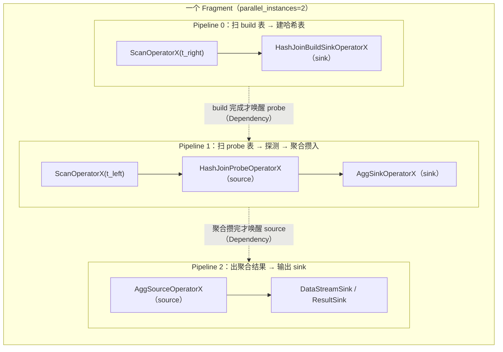

# 第 6 章：BE Pipeline 执行引擎

上一章末尾，FE 的 `Coordinator` 把每台 BE 该跑的那几个 Fragment 用 brpc 打包发下去，落到 `FragmentMgr::exec_plan_fragment()`（`be/src/runtime/fragment_mgr.cpp`）。BE 此刻手里拿到的是一份 `TPipelineFragmentParams`：一棵**算子计划树**（`plan.nodes`，扁平化的 `TPlanNode` 序列）、一个输出 sink 描述、一组要扫的 scan range、以及一个并行度 `parallel_instances`。但这棵树还只是"该算什么"的静态描述——它没有被切成能调度的执行单元，也没有和这台机器上正在跑的另外几百个查询片段一起排进那个固定大小的线程池。本章负责的就是这段**从一份 Fragment 参数到一批可被固定线程池反复挑起来跑的 PipelineTask**：`PipelineFragmentContext` 把算子树按阻塞点切成若干 pipeline、每个 pipeline 展开成若干 task，`Dependency` 把 task 之间"谁得等谁"的关系连起来，`TaskScheduler` 从多级队列里挑 task 执行、task 一旦要等就主动让出线程。等一条 join 查询的所有 task 都 FINISHED，本章结束。

读完本章，你应当能回答三件事：一台机器上同时压着几百个查询片段、每个片段又是一棵有 hash join、聚合、排序的算子树，凭什么能只用一个固定大小的线程池跑完而不把线程数撑爆——为什么切分点恰好是那些"要攒完全部输入才能出第一行"的阻塞算子；`Dependency` 的 `set_ready`/`block` 时序为什么不会漏唤醒——唤醒丢失是这类依赖驱动调度器的经典 bug 形态，Doris 用什么手法把它堵死，写错会怎样（task 永久挂起 = 查询 hang）；以及一个反复坑人的工程约束——为什么在算子里直接做一次同步阻塞 IO（不挂 `Dependency`）会把整个调度线程占死，而正确的写法是把等待表达成一个 `Dependency` 让出线程。

本章的行号引用基于写作时核实所用的 HEAD（`905718644c`，源码树与系列基线 `7bc98f696f` 一致）。代码演进会让行号漂移，但对象名与结构不变；写作时每一处 `路径:行号` 都在当前代码里核实过。

## 6.1 问题：一台机器上怎么跑几百个并发查询片段

**遇到了什么问题？** 第 5 章把一棵物理计划切成了 Fragment、摊到了一群机器上，但那是"机器之间"的并行。现在把镜头拉到**一台 BE 内部**：这台机器同时收到了几百个查询各自的 Fragment，每个 Fragment 又是一棵完整的算子树（扫描 → hash join → 聚合 → 排序 → sink），还要按并行度展开成好几份并行实例。一台机器就那么几十个物理核，怎么把这成百上千份算子链的执行，塞进有限的 CPU 里，既跑得满、又不互相拖死？

**有哪些候选、各有什么优劣？**

- **候选一：经典火山模型 + 每 instance 一线程。** 这是老 Doris（以及绝大多数早期 MPP）的做法：每个查询实例起一个（或几个）专属线程，算子树用 `get_next()` 逐层拉数据，一层调一层。实现直观、算子代码是纯同步的，好写好懂。但它有三个致命伤，都出在"一个执行流独占一个线程"这件事上：其一，**阻塞算子占着线程睡觉**——hash join 的 build 侧要把右表整个读进来建哈希表，这期间它的线程什么算力都不产出，只是阻塞地等 IO、等上游，却牢牢占着一个线程名额；其二，**线程数随并发爆炸**——几百个查询 × 每个几份实例 × 每份一个线程，轻松上千线程，远超物理核数，操作系统被迫疯狂上下文切换，真正干活的时间被调度开销吃掉；其三，**cache 不友好**——线程被 OS 在核之间来回迁移，算子刚热起来的 L1/L2 cache 就作废了。
- **候选二：协程（coroutine）。** 把每个执行流做成用户态协程，阻塞时 yield、就绪时 resume，线程数就能压到核数量级。它确实解决了线程爆炸。但代价是**侵入性**：要么依赖语言/运行时的协程支持，要么手写状态保存，整套算子代码得按"随时可挂起/恢复"来重写；栈式协程还有每协程一个栈的内存开销；调试和内存诊断也更难。对一个已经有大量同步算子实现的 C++ 存储引擎，全面协程化改造成本极高。
- **候选三：pipeline 化 + 任务调度到固定线程池。** 把算子树**在阻塞点切开**成若干段（pipeline），每段是一串"来了数据就能一路算下去、不会中途长时间阻塞"的非阻塞算子；把每段实例化成一个个小任务（task）扔进一个固定大小（约等于核数）的线程池；线程从队列里挑 task，跑一小片时间（时间片）或跑到"要等了"就**主动让出线程**，把 task 放回队列，线程立刻去挑下一个 task。这样固定几十个线程就能驱动成百上千个 task，谁在等谁就让出，CPU 始终喂饱，线程不爆、cache 亲和也好维护。

**Doris 怎么考量和解决的？** Doris 选候选三，就是本章的 Pipeline 执行引擎。关键设计是**在阻塞算子处把 pipeline 切成 source/sink 两态**。为什么阻塞算子恰好是切分点？看 hash join：它必须先把 build 侧（右表）**全部**数据攒进哈希表，才能开始 probe（左表）。这个"必须攒完全部输入才能产出"的算子，天然把数据流截成两半——攒输入的那一半（写哈希表）和消费结果的那一半（探哈希表）。Doris 就在这里落刀：把 hash join 拆成一个 **sink 算子**（`HashJoinBuildSinkOperatorX`，攒 build 侧，是某条 pipeline 的末端）和一个 **source 算子**（`HashJoinProbeOperatorX`，探测出结果，是另一条 pipeline 的起点）。聚合（`AggSinkOperatorX`/`AggSourceOperatorX`）、排序（`SortSinkOperatorX`/`SortSourceOperatorX`）都是同一个套路：sink 侧攒、source 侧吐。切开之后，**"攒"这段可以先跑、跑完让出，"吐"那段等前者攒好再被唤醒**——没有任何线程需要"阻塞地坐等哈希表建好"，等待被表达成了任务之间的依赖，而不是线程的阻塞睡眠。这正是候选一那三个毛病的根治：阻塞算子不再占线程睡觉（它跑完 sink 就让出），线程数固定（就是线程池大小），cache 亲和由调度器尽量维持（task 记住上次跑在哪个核）。

Doris 这套引擎经历过一次重要演进：早期 pipeline 与后来的 **PipelineX** 长期并存，PipelineX 把算子的"无状态逻辑"（`OperatorX`，全实例共享一份）和"每实例运行时状态"（`LocalState`，每 task 一份）彻底拆开，解决了老 pipeline 里每实例重复构建算子、共享哈希表（broadcast join）难做、runtime filter 难以跨实例协调等问题。如今 PipelineX 已合入成为唯一实现——你在 `be/src/exec/pipeline/pipeline.h:54` 的注释里还能看到 `Add operators for pipelineX` 这样的历史印记，而所有算子类名都带 `X` 后缀（`OperatorXBase`、`DataSinkOperatorXBase`，见 `be/src/exec/operator/operator.h:576`、`:812`）就是这次演进的化石。

## 6.2 源码走读：从 fragment 到 pipeline

入口是 `PipelineFragmentContext`（`be/src/exec/pipeline/pipeline_fragment_context.h:55`，`class PipelineFragmentContext : public TaskExecutionContext`）的 `prepare()`（`be/src/exec/pipeline/pipeline_fragment_context.cpp:359`）。它把一份 Fragment 参数变成可执行的 pipeline+task 集合，主干三步都在 `prepare` 里串好（`:287` 起）：

1. **`_build_pipelines()`（`:290`）**：把扁平的 `TPlanNode` 序列还原成算子树，同时在阻塞点切成多条 pipeline。
2. **`_create_data_sink()` + `root_pipeline->set_sink()`（`:323`、`:328`）**：给根 pipeline 接上输出 sink（比如把结果发回 FE 的 `DataStreamSink`，或写回 BE 的 sink）。
3. **`_build_pipeline_tasks()`（`:353`）**：把每条 pipeline 按并行度展开成若干 `PipelineTask`，并把 task 之间的依赖接好。

### 显而易见的部分：树怎么还原、算子怎么建

`_build_pipelines()`（`:701`）调 `_create_tree_helper()`（`:901`）递归遍历 `TPlanNode` 序列，对每个节点调 `_create_operator()`（`:1500`）建出对应算子，`cur_pipe->add_operator()` 把算子挂到当前 pipeline 上。一条 pipeline 内部就是一串 `[source → … → sink]` 的算子（`be/src/exec/pipeline/pipeline.h:159`）：`_operators` 存中间和 source 算子，`_sink` 单独存末端 sink 算子。这部分是直白的树遍历，不展开。

真正要看清的是**切分**——非阻塞算子留在当前 pipeline，遇到阻塞算子就另起一条 pipeline。

### tricky 点：目录即架构——算子不在 pipeline/ 目录下

先纠正一个几乎人人会踩的找代码误区。你可能以为"pipeline 执行引擎"的代码都在 `be/src/exec/pipeline/` 下。**错。** 这个目录只放**调度设施**，一共就那么几个文件：

```
be/src/exec/pipeline/
  pipeline_fragment_context.{h,cpp}   # 建 pipeline / task
  pipeline.{h,cpp}                    # pipeline 结构
  pipeline_task.{h,cpp}               # 任务与状态机
  task_scheduler.{h,cpp}              # 线程池调度
  task_queue.{h,cpp}                  # 多级任务队列
  dependency.{h,cpp}                  # 依赖与唤醒
```

而**算子实现全在平级的 `be/src/exec/operator/` 目录下**（150 个文件），跟 `pipeline/` 是兄弟目录，不是父子。`HashJoinBuildSinkOperatorX` 在 `be/src/exec/operator/hashjoin_build_sink.h:107`，`AggSourceOperatorX` 在 `be/src/exec/operator/aggregation_source_operator.h:94`，scan 算子 `ScanOperatorX` 在 `be/src/exec/operator/scan_operator.h:352`。此外 `be/src/exec/` 下还有平级的 `scan/`、`exchange/`（local exchange 算子在这里，见 6.4）、`sort/`、`spill/`。**"目录即架构"**：`pipeline/` 是"怎么调度"，`operator/` 是"算什么"，两者解耦——这也是 PipelineX 把无状态算子逻辑抽出来的直接体现。找算子实现别在 `pipeline/` 里翻，那里永远只有六七个调度文件。

### 一条 join SQL 的 fragment → pipelines → tasks 分解

以一个 Fragment 内含 `Aggregate(HashJoin(Scan t_left, Scan t_right))` 为例。`_create_operator()` 处理到 hash join 时（`be/src/exec/pipeline/pipeline_fragment_context.cpp:1780` 起）会做一次**关键的切分**：probe 算子留在当前 pipeline，而 build 侧**另起一条新 pipeline**：

```cpp
PipelinePtr build_side_pipe = add_pipeline(cur_pipe);          // :1788 新建 build 侧 pipeline
_dag[downstream_pipeline_id].push_back(build_side_pipe->id()); // :1789 登记：下游 pipeline 依赖 build 侧
sink_ops.push_back(std::make_shared<HashJoinBuildSinkOperatorX>(...)); // :1791 build 侧的 sink
RETURN_IF_ERROR(build_side_pipe->set_sink(sink_ops.back()));   // :1793
```

于是这个 Fragment 被切成三条 pipeline，展开成 task 后如下（并行度设为 2）：



每条 pipeline 按并行度展开成 N 个 task（这里 N=2，所以 P0/P1 各 2 个 task，P2 通常收口成 1 个）。**pipeline 之间的虚线就是本章的主角——`Dependency`**：P1 的 probe task 必须等 P0 的 build task 把哈希表建好才能跑，P2 必须等 P1 把聚合攒完。

### 易错点：pipeline 之间的依赖（build 完才能 probe）怎么表达

这条"build 先于 probe"的依赖**不是**靠代码里的顺序或 sleep 保证的，而是靠一个跨 pipeline 共享的 `BasicSharedState`（`be/src/exec/pipeline/dependency.h:70`）+ 一对 `Dependency`。build 侧和 probe 侧共享一个 `HashJoinSharedState`（`be/src/exec/pipeline/dependency.h:712`），它内部有两组依赖：`sink_deps`（build 侧写哈希表用）和 `source_deps`（probe 侧读哈希表用）。probe 侧的 source 依赖**初始是 blocked 的**（source 默认阻塞、sink 默认就绪，见 `be/src/exec/AGENTS.md`）。当 build sink 把哈希表建完、到达 eos 时，它显式把 probe 侧的 source 依赖置就绪：

```cpp
// be/src/exec/operator/hashjoin_build_sink.cpp:918
if (eos) {
    local_state._dependency->set_ready_to_read(...);  // 唤醒 probe 侧 source
}
```

`set_ready_to_read()`（`be/src/exec/pipeline/dependency.h:127`）就是去 `_shared_state->source_deps[channel_id]->set_ready()`。**如果写错**——比如忘了在 build eos 时置就绪，或把 source 依赖初始设成 ready——后果分两种：前者 probe task 永远等不到唤醒、永久 BLOCKED，查询 hang；后者 probe 在哈希表还没建好时就跑，读到空表或半成品，结果错。这就是为什么"依赖初始状态"和"何时置就绪"必须精确成对，`be/src/exec/AGENTS.md` 的评审清单里专门有一条"Source starts blocked; sink starts ready"。

## 6.3 源码走读：依赖驱动调度

task 建好了、依赖连好了，接下来是运行时：`TaskScheduler` 怎么挑 task 跑、task 怎么在"要等"时让出线程、依赖就绪时怎么把 task 重新唤醒回队列。这一节是本章的核心。

### PipelineTask 状态机

`PipelineTask`（`be/src/exec/pipeline/pipeline_task.h:46`）有五个状态（`:301`）和一张合法迁移表（`:308`）。正常流转（源码注释 `:286` 给了 ASCII 图）是：

```
INITED ──► RUNNABLE ──────────────┬──► FINISHED ──► FINALIZED
              ▲                    │
              └──── BLOCKED ◄──────┘
```

- **INITED**：刚建好，还没进队列。
- **RUNNABLE**：在队列里或正在被某个线程执行。
- **BLOCKED**：执行到一半发现某个 `Dependency` 没就绪（哈希表没建好、上游没来数据、下游背压、内存不够），主动让出线程、挂到那个依赖上等唤醒。
- **FINISHED**：算子链跑到 eos，逻辑执行完。
- **FINALIZED**：资源已释放，终态。

迁移由 `_state_transition()`（`be/src/exec/pipeline/pipeline_task.cpp:1084`）统一把关，非法迁移直接返回 `InternalError`——这是一道防线，保证"已 FINALIZED 的 task 不会被再次当 RUNNABLE 跑"这类会 SIGSEGV 的事被拦下（`wake_up()` 里也专门处理了延迟唤醒撞上已终止 task 的情况，`:1076`）。此外还有一张 `WAKE_UP_EARLY_LEGAL_STATE_TRANSITION`（`:316`）扩展表，用于查询被取消或 sink 提前结束（如 `LIMIT` 够了）时允许 BLOCKED 直接跳到 FINISHED。

task 在 `execute()`（`be/src/exec/pipeline/pipeline_task.cpp:450`）里的主循环大致是：跑一小片（时间片 `pipeline_task_exec_time_slice`，默认 100ms，`be/src/common/config.cpp:311`）→ 每轮先 `_is_blocked()`（`:325`）检查所有读/写依赖是否就绪，一旦有依赖没就绪就 `return Status::OK()` 退出执行、状态转 BLOCKED（挂到那个依赖上）→ 时间片耗尽则 `_yield_counts++` 主动让出、放回队列 → 算子链 eos 则 `_eos=true`、转 FINISHED。**"要等就退出、把线程还回去"**是整个引擎不阻塞线程的根本：`_is_blocked()` 里对每个依赖调 `dep->is_blocked_by(shared_from_this())`，没就绪就把自己登记为该依赖的等待者并转 BLOCKED，然后干净地退出 `execute()`，线程立刻去挑别的 task。

### TaskScheduler 与多级任务队列

`TaskScheduler`（`be/src/exec/pipeline/task_scheduler.h:46`）就是那个固定大小线程池：`start()`（`be/src/exec/pipeline/task_scheduler.cpp:54`）给每个线程 submit 一个 `_do_work(i)` 死循环（`:63`）。`_do_work()`（`:93`）的主干很短：

```cpp
auto task = _task_queue.take(index);           // :95 从本核队列取（取不到会 work-steal）
if (task->set_running(true)) {                 // :104 已在别的线程跑？放回队列，避免并发执行同一 task
    _task_queue.push_back(task, index); continue;
}
...
ASSIGN_STATUS_IF_CATCH_EXCEPTION(status = task->execute(&done), status);  // :149 真正执行
```

队列是 `MultiCoreTaskQueue`（`be/src/exec/pipeline/task_queue.h:105`）——**每个核一个子队列**，`take(core_id)` 优先取本核的，取不到就去别的核 `_steal_take()`（work stealing，保持 cache 亲和的同时不让某个核饿着）。每个核的子队列又是 `PriorityTaskQueue`（`:68`），一个**多级反馈队列**（MLFQ，6 级，`:87`）：跑得久的 task 逐级降到低优先级，短 task 优先被挑，避免一个大 task 长期霸占、拖垮交互式短查询的延迟。`set_running` 那个 CAS（`be/src/exec/pipeline/pipeline_task.h:158`）是并发正确性的关键——同一个 task 可能同时被"线程取出准备跑"和"依赖就绪重新入队"两条路碰到，`set_running(true)` 用 compare_exchange 保证任一时刻只有一个线程真正在 `execute` 它。

> **进阶：阻塞型 task 走单独的调度器。** 有些 task 本身注定要长时间阻塞（比如某些 sink 的收尾）。`HybridTaskScheduler`（`be/src/exec/pipeline/task_scheduler.h:85`）的 `submit()`（`be/src/exec/pipeline/task_scheduler.cpp:170`）会先问 `task->is_blockable()`，是的话丢进一个独立的 `_blocking_scheduler`（`:171-172`）线程池，不占用主调度线程池的名额——这样阻塞型 task 不会挤占非阻塞 task 的 CPU。

### tricky 点：`Dependency` 的 set_ready/block 时序——怎么堵住唤醒丢失

这是全章最该抠清楚的一段。**唤醒丢失（lost wakeup）**是所有"检查条件→不满足就睡→别人满足条件后唤醒"这类机制的经典 bug：如果"检查+登记等待"和"满足条件+发唤醒"两步之间有缝，就可能出现——消费者刚检查完"没就绪"、还没来得及把自己挂上去，生产者就把条件置就绪并发了唤醒（但此时没人在等，唤醒白发了），接着消费者才挂上去、然后**永远等不到下一次唤醒**。落到本引擎里，就是 task 永久 BLOCKED = 查询永久 hang。

Doris 怎么堵这条缝？看两个函数（`be/src/exec/pipeline/dependency.cpp`）。消费者侧 `is_blocked_by()`（`:86`）：

```cpp
Dependency* Dependency::is_blocked_by(std::shared_ptr<PipelineTask> task) {
    std::unique_lock<std::mutex> lc(_task_lock);   // :87 先拿锁
    auto ready = _ready.load();                    // :88 锁内读就绪状态
    if (!ready && task) {
        _add_block_task(task);                     // :90 锁内登记等待者
        start_watcher();
        THROW_IF_ERROR(task->blocked(this, lc));   // :92 锁内转 BLOCKED
    }
    return ready ? nullptr : this;
}
```

生产者侧 `set_ready()`（`:64`）：

```cpp
void Dependency::set_ready() {
    if (_ready) { return; }                        // :65 无锁快速路径：已就绪直接返回
    std::vector<std::weak_ptr<PipelineTask>> local_block_task {};
    {
        std::unique_lock<std::mutex> lc(_task_lock); // :70 拿同一把锁
        if (_ready) { return; }                      // :71 锁内重检查（double-check）
        _watcher.stop();
        _ready = true;                               // :75 置就绪
        local_block_task.swap(_blocked_task);        // :76 锁内取走全部等待者
    }
    for (auto task : local_block_task) {             // :78 锁外逐个唤醒
        if (auto t = task.lock()) {
            std::unique_lock<std::mutex> lc(_task_lock);
            t->wake_up(this, lc);
        }
    }
}
```

**关键在于"检查就绪 + 登记等待者"和"置就绪 + 取走等待者"共用同一把 `_task_lock`，构成互斥的临界区。** 于是不存在那条缝：

- 若消费者先进临界区——它锁内看到 `_ready==false`，就在锁内把自己 `_add_block_task` 挂上去。之后生产者进临界区置就绪时，`swap` 一定能取到这个已挂上的等待者，唤醒它。
- 若生产者先进临界区——它置 `_ready=true`。之后消费者进临界区，锁内 `_ready.load()` 读到 `true`，**根本不会**把自己挂起、直接返回不阻塞。

两种次序都不会漏。`_ready` 用 `std::atomic<bool>`（`be/src/exec/pipeline/dependency.h:166`），配合 `set_ready` 开头那个无锁快速路径（`:65`）——已就绪的常态直接返回、不抢锁，把锁竞争压到只发生在"恰好在临界翻转点"的少数情况；而真正决定正确性的翻转点，一律回到锁内 double-check。`be/src/exec/AGENTS.md` 把这条不对称总结为一句评审要点：「`set_ready()` fast-path precheck vs `is_blocked_by()` lock-first asymmetry respected?」——快速路径只能出现在生产者侧且必须配锁内重检查，消费者侧则必须一进来就拿锁，绝不能先无锁读一把 `_ready` 再决定挂不挂。

> **错写会怎样？** 如果有人图省事，把 `is_blocked_by` 改成"先无锁读 `_ready`，读到 false 再拿锁登记"——那条缝就回来了：无锁读到 false 之后、拿锁之前，生产者可能已经 `set_ready` 并 swap 走了（空的）等待者列表，随后消费者才挂上去，从此无人唤醒，task 永久 BLOCKED、查询 hang。这正是这类调度器最隐蔽的 bug：低并发下几乎复现不出，压测高并发才偶发一个查询卡死，且栈上看就是个安安静静 BLOCKED 的 task，不 crash、不报错，极难定位。所以这段代码的锁序不是"能优化的性能细节"，而是正确性红线。

### 易错点：在算子里做同步阻塞 IO 而不挂 Dependency

理解了上面的机制，就能理解一条对写算子的人最要命的纪律：**绝不要在算子的执行路径里直接做同步阻塞调用（阻塞 IO、抢一把可能长期被占的锁、`sleep` 等），除非把这个等待表达成一个 `Dependency`。**

原因是引擎的全部前提是"线程永远在干活或在挑下一个 task，没有线程会阻塞地睡"。整个 BE 的 pipeline 线程池就核数量级那么大。如果某个算子在 `execute()` 里直接 `read()` 一个可能要等几百毫秒的远程文件、或同步等一个 RPC 回来——那这个**调度线程就被这次阻塞占死了**，它既没在算数据，也回不到队列去挑别的 task。几十个这样的算子实例就能把整个线程池占空，此时机器 CPU 空闲、却没有一个 task 在推进，全 BE 的查询一起卡住。这跟候选一"每 instance 一线程、阻塞算子占着线程睡觉"的病是一样的，只不过在固定线程池下后果更严重（线程池小得多）。

正确写法是把"要等的东西"做成一个 `Dependency`：发起异步 IO/RPC 后立刻让算子返回"我 blocked 在这个依赖上"，task 转 BLOCKED、让出线程；等异步操作完成的回调里 `set_ready()`，task 被唤醒重新入队继续。这也是为什么 scan（第 7 章）、exchange、spill 这些天生要等 IO 的地方，全都配了各自的 `Dependency`（scan 有 scan dependency、内存不足有 `_memory_sufficient_dependency`，见 `be/src/exec/pipeline/pipeline_task.cpp:341`）——等待一律换成依赖、换成让出线程，而不是让线程去阻塞地扛着。

## 6.4 并行度与 local exchange

**并行度从哪来。** 一个 pipeline 展开成几个 task，源头是 FE 下发的 `parallel_instances`——`PipelineFragmentContext` 在构造时读进 `_parallel_instances`（`be/src/exec/pipeline/pipeline_fragment_context.cpp:150`），`add_operator` 时透传给每条 pipeline。这个值追回 FE 侧，就是第 5 章讲过的那条链路：会话变量 `parallel_pipeline_task_num`（常量名 `PARALLEL_PIPELINE_TASK_NUM`，`fe/fe-core/src/main/java/org/apache/doris/qe/SessionVariable.java:180`；字段 `parallelPipelineTaskNum`，`:1420`，**默认 0 代表"自动"**）经 `getParallelExecInstanceNum()`（`:4453`）算出实际并行度——为 0 时取本计算组 BE 最小 pipeline 线程数的一半（`:4466`），非 0 则直接用（`:4471`）。注意扫描 pipeline 的 task 数还会被"本 BE 该扫的 tablet 数"二次封顶（第 5 章 `computeFragmentExecParams` 的 `expectedInstanceNum`）——所以并行度调大对扫描段可能无效，真正的效果要在 6.6 实验里对着 profile 数。

**local exchange：单机内重分布。** 有一种情况需要在**一台 BE 内部**把数据重新分布：上游 pipeline 的 N 个 task 产出的数据，其分布方式和下游算子要求的不一致（比如下游要按 key 分组聚合，但上游是按 tablet 并行扫出来的、同一个 key 散在不同 task 里）。跨机 shuffle 由 Exchange 算子管（第 5 章），而**机内**这种重分布就交给 **local exchange**：`_plan_local_exchange()`（`be/src/exec/pipeline/pipeline_fragment_context.cpp:1209`）遍历每条 pipeline 的每个算子，若某算子的 `required_data_distribution()` 要求 local exchange，就调 `_add_local_exchange()`（`:1167`）**在这里把 pipeline 再切一刀**：插入一个 `LocalExchangeSinkOperatorX`（`be/src/exec/exchange/local_exchange_sink_operator.h:71`）作为上半段的 sink、一个 `LocalExchangeSourceOperatorX`（`be/src/exec/exchange/local_exchange_source_operator.h:62`）作为下半段的 source，中间靠一个 `Exchanger`（`be/src/exec/exchange/local_exchanger.h:228`）在内存里把 block 按需重分布。重分布策略由 Exchanger 子类决定：`ShuffleExchanger`（`:273`，按 key 哈希重分）、`PassthroughExchanger`（`:310`，只是解耦并行度、不改分布）、`BroadcastExchanger`（`:339`）、`PassToOneExchanger`（`:325`，收成一路）。它们共享一个 `LocalExchangeSharedState`（`be/src/exec/pipeline/dependency.h:879`）来传递 block 和背压依赖。local exchange 最典型的用途之一是**数据倾斜时把热点 key 打散重分**，倾斜场景的排查见第 8 章排查清单，这里只需建立"机内也能重分布、且同样是靠切 pipeline + sink/source + Dependency 实现"的整体印象。

## 6.5 双模式对比

本环节两模式一致：不论存算一体还是存算分离，Pipeline 执行引擎（pipeline 切分、PipelineTask 状态机、Dependency 唤醒、TaskScheduler 调度）完全相同——它调度的是算子，不关心数据从本地磁盘还是对象存储来。两模式的差异集中在**最底层的 scan 算子怎么读数据**（本地 tablet vs 对象存储 + File Cache），那是第 7 章的主战场。

## 6.6 动手实验

环境（编译、单机部署、开 profile、日志调整）沿用第 1 部分第 5 章（`docs/doris-internals/part1-architecture/05-source-map-and-dev-env.md`），不再重复。本节一个实验，核心点是把 6.2 的 pipeline/task 分解对到真实 profile 上，易错点是亲手用 `parallel_pipeline_task_num` 踩一遍并行度的真实作用位置。

### 实验（验证核心点 + 踩并行度易错点）：join 查询的 profile 里数 pipeline 与 task

**目标**：把 6.2 那张"一个 Fragment 切成 3 条 pipeline、每条展开成 N 个 task"的分解图，在真实 profile 里逐条对上；再用 `parallel_pipeline_task_num=1` 与默认值对比，看清并行度改的到底是哪一层。

第一步，建两张表做一个带聚合的 join，开 profile 跑一次：

```sql
SET enable_profile = true;
SELECT t_left.v, COUNT(*)
FROM t_left JOIN t_right ON t_left.k = t_right.k
GROUP BY t_left.v;
```

跑完从 FE 的 profile（Web UI 的 Profile 页，或 `SHOW QUERY PROFILE`）里，找到这个 Fragment。profile 是**按 pipeline 分组、每条 pipeline 下挂若干 `PipelineTask`** 打印的（task 的 profile 由 `PipelineTask::_init_profile()`（`be/src/exec/pipeline/pipeline_task.cpp:234`）初始化，task 名字形如 `task{id}(pipeline_name)`，见 `task_name()`（`be/src/exec/pipeline/pipeline_task.h:166`））。对照 6.2：你应能数出**扫 build 表建哈希表**、**扫 probe 表探测并攒聚合**、**出聚合结果并输出**这几条 pipeline，每条 pipeline 的算子链末端是一个 sink 算子（`HashJoinBuildSinkOperatorX`/`AggSinkOperatorX`）、下一条的开头是对应 source（`HashJoinProbeOperatorX`/`AggSourceOperatorX`）——source/sink 的成对出现，就是 6.1 那个"阻塞点切分"在 profile 里的样子。每条 pipeline 下的 task 数就是它的并行度。**建立的能力**：把"阻塞算子=切分点=source/sink 成对"从源码变成能在 profile 里亲眼数出来的结构。

第二步（踩易错点），把并行度压到 1，同一条查询再跑一次对比：

```sql
SET parallel_pipeline_task_num = 1;   -- 从默认的 0（自动）压到 1
-- 重跑上面那条 SELECT，看 profile
SET parallel_pipeline_task_num = 0;   -- 记得改回自动
```

**观察两点**：其一，**profile 形态变了**——每条非收口 pipeline 下的 `PipelineTask` 从多个变成 1 个，pipeline 的条数（切分结构）却**不变**。这就直观说明：`parallel_pipeline_task_num` 改的是"每条 pipeline 展开成几个 task"（并行度），**不改** pipeline 怎么切（切分由阻塞算子决定，与并行度无关）。其二，**耗时对比**——数据量够大时，并行度 1 明显更慢（一个 task 串行扛一条 pipeline 的全部数据），CPU 利用率上不去；恢复默认（自动并行度）后耗时下降。但别急着把它调成一个很大的值：如 6.4 与第 5 章所述，扫描 pipeline 的 task 数会被 tablet 数封顶，设得远超核数只会让 task 互抢 CPU、调度开销上升——你可以顺手把它设成一个远超核数的值（比如 64）再看 profile，会发现扫描 pipeline 的 task 数并不会跟着涨到 64（被 tablet 数卡住），而整体耗时可能因调度开销不降反升。这一步让你亲手确认**并行度的真实作用位置是"每条 pipeline 的 task 数"，且并非越大越好**。

## 6.7 排查清单

按"症状 → 定位入口"组织，覆盖 BE pipeline 执行阶段最高频的三类问题。

### 症状 A：查询 hang（迟迟不返回、也不报错）

- **先抓 BE 栈看 task 状态。** pipeline 引擎下"hang"最典型的形态是**某个 `PipelineTask` 永久 BLOCKED**——它在等一个永远不会 `set_ready()` 的 `Dependency`（6.3 的唤醒丢失，或某算子忘了在 eos 置就绪）。看 BE 的 query profile 里各 task 的 `TaskState`/`BlockedByDependency` 字段（`_state_transition` 会把当前状态和阻塞它的依赖名写进 profile，`be/src/exec/pipeline/pipeline_task.cpp:1108`）——停在 BLOCKED 且 `BlockedByDependency` 指向某个依赖、而该依赖迟迟不就绪，基本就是依赖没被唤醒。结合 `pstack`/`gdb` 抓 BE 线程栈确认调度线程是否都空转在 `_task_queue.take()`（说明没 task 可跑、都在等依赖），还是卡在某个同步阻塞调用（对应下面 B 的一种）。
- **区分"依赖没就绪"与"上游没数据"。** 若 BLOCKED 在 exchange source 依赖上，往上追是不是上游 Fragment 挂了/没发数据（第 5 章执行期故障），而不是本 BE 的 bug。

### 症状 B：CPU 打满但吞吐低

- **调度开销 or 倾斜。** 两个常见根因：一是并行度设太大（6.6），task 数远超核数，CPU 时间被上下文切换和 MLFQ 调度吃掉——profile 里 `_yield_counts`、`_core_change_times` 偏高是信号，把 `parallel_pipeline_task_num` 调回自动（0）。二是数据倾斜，某个 key 全压到一个 task 上，其余 task 早就 FINISHED、就它在满核跑——profile 里对比同一 pipeline 各 task 的处理行数/耗时，找出拖尾的那个（考虑 local exchange 打散，第 8 章）。
- **同步阻塞占死线程的反面。** 若 CPU 反而**打不满**、吞吐还低、task 大量 BLOCKED，怀疑有算子在做同步阻塞调用把调度线程占死（6.3 易错点）——抓栈看是否有 pipeline 线程卡在 `read`/锁/RPC 等待上。

### 症状 C：单个查询把 BE 打挂（OOM / 拖垮全机）

- **定位入口：内存与并行度。** 一个大 join/聚合查询展开成大量 task、每个 task 的算子都要占内存（哈希表、排序缓冲），并行度越大瞬时内存越高。先看是不是并行度 × 单 task 内存超了 workload group 限额——引擎有 `_memory_sufficient_dependency`（`be/src/exec/pipeline/pipeline_task.cpp:341`）和 spill 机制在高内存压力时让 task 挂起、触发落盘（`_should_trigger_revoking`，`:384`），若这些没生效（比如没开 spill）就可能 OOM。降并行度、开 spill、给 workload group 设内存上限是三条常规止血路径。
- **确认是不是一个查询的锅。** BE 的 pipeline 线程池是全机共享的——一个失控查询占满线程池会连累所有查询变慢（症状像"全 BE 变卡"）。用 workload group 把大查询隔离、限它的并发 task 数与内存，是防止"单查询打挂全机"的根本手段。

---

本章走完了查询链路在**单台 BE 内部**的执行框架：`FragmentMgr` 收到的 Fragment 参数，经 `PipelineFragmentContext::prepare` 在阻塞算子处被切成多条 pipeline（source/sink 两态），每条 pipeline 按并行度展开成 `PipelineTask`，pipeline 之间用共享 `BasicSharedState` + `Dependency` 表达"build 完才能 probe"这类先后关系；运行时 `TaskScheduler` 用固定线程池 + 每核多级反馈队列 + work stealing 挑 task 跑，task 一旦 `_is_blocked()` 就让出线程转 BLOCKED、依赖 `set_ready()` 时再唤醒回队列。我们重点抠了三个点：目录即架构（算子在平级的 `operator/`、`pipeline/` 只放调度设施，找代码别走错）；`Dependency` 的 `set_ready`/`is_blocked_by` 靠共用 `_task_lock` 的临界区堵死唤醒丢失（消费者锁内"检查+登记"、生产者锁内"置就绪+取走等待者"，两种次序都不漏，写反了就查询永久 hang）；以及"算子里做同步阻塞 IO 不挂 Dependency 会占死调度线程"这条写算子的红线。下一章深入本框架的最底层算子——scan：它怎么从本地 tablet（存算一体）或对象存储 + File Cache（存算分离）把数据读上来喂给 pipeline，正是两模式差异最深的一环。
