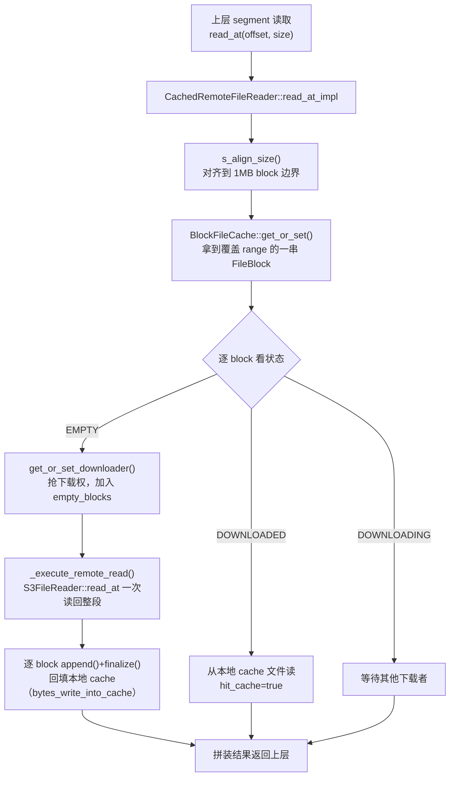

# 第 7 章：Scan 路径 —— 本地读与 File Cache 远端读

上一章末尾我们留下一条纪律：算子的执行线程绝不能阻塞地做 IO，等待必须表达成 `Dependency` 让出线程。scan 正是这条纪律最典型、也最先被逼出来的那个算子——它天生要等磁盘、等对象存储，而它又坐在每一棵算子树的最底层，喂着上面所有的 join、聚合、排序。本章就把镜头怼到这最底层：`ScanOperatorX`（`be/src/exec/operator/scan_operator.h:352`，第 6 章已见）产出的每一个 block，究竟是谁在什么线程上、从哪里读上来的。你会看到 Doris 把"读数据"整个从 pipeline 执行线程里剥出去，扔进一个独立的 scanner 线程池，用生产者-消费者队列 + 一个 scan `Dependency` 把两边缝起来；而在存算分离模式下，最底层那次 `read()` 又会拐进 `CachedRemoteFileReader`（`be/src/io/cache/cached_remote_file_reader.h:40`），先问一遍本地 File Cache，miss 了才去对象存储、读回来还要回填。这两条路——本地盘直读、远端读带 cache——就是本部分双模式差异最深的一章（另一处是第 5 章的分发差异）。

读完本章，你应当能回答三件事：为什么 scan 不能像火山模型那样在算子的 `get_next()` 里同步把数据读上来，而必须拆成"异步 scanner 生产 + 算子消费"，拆开之后**并发和内存靠什么兜住不失控**（背压）；存算分离下 File Cache 到底以什么粒度缓存、一次 miss 读走过哪些状态、cache 满了之后为什么冷查询延迟会**周期性**抖动；以及同一条 SQL 的 scan 在两模式下路径怎么分叉、这对容量规划意味着什么（答案是：算 cache 命中率）。

本章的行号引用基于写作时核实所用的 HEAD（`b0f86480b5`，源码树与系列基线 `7bc98f696f` 一致）。代码演进会让行号漂移，但对象名与结构不变；写作时每一处 `路径:行号` 都在当前代码里核实过。段内细节（segment 内的谓词下推、索引、列存读取）属于存储层，本章只到"调 `TabletReader` 读一个 block"为止，更深的部分前向链接到第 5 部分（存储引擎）。

## 7.1 问题：扫描为什么要从执行线程里拆出去

**遇到了什么问题？** 第 6 章立下的规矩是：pipeline 线程池就核数量级那么大，任何线程都不许阻塞地睡。可 scan 偏偏是全 BE 里最爱阻塞的算子——它要 `read()` 本地磁盘（几毫秒到几十毫秒），存算分离下更可能要 `read()` 对象存储（几十到几百毫秒，还可能被限流）。如果按经典火山模型，让 `ScanOperatorX::get_block()` 直接在 pipeline 执行线程里同步把数据读上来，那么这个调度线程在这几百毫秒里既没算数据、也回不到队列去挑别的 task——几十个这样的 scan 实例就能把整个 pipeline 线程池占空，机器 CPU 空转、全 BE 查询一起卡死。这正是第 6 章"算子里做同步阻塞 IO 会占死调度线程"那条红线的具象。

**有哪些候选、各有什么优劣？**

- **候选一：scan 就在 pipeline task 里同步读。** 实现最简单，`get_block()` 里调一次存储读接口拿 block 返回。但它把阻塞 IO 直接压在了固定大小的调度线程池上，违反第 6 章的全部前提，后果如上——线程被 IO 占死、CPU 喂不饱。对一个要抗高并发的 MPP 引擎，这条路不可接受。
- **候选二：异步 scanner 线程池 + 生产者-消费者队列。** 把"读数据"这件事整个搬到一个**独立的 scanner 线程池**去做：scanner 作为生产者在自己的线程里阻塞地读，读出一个 block 就塞进一个队列；`ScanOperatorX` 作为消费者，在 pipeline 线程里只从队列里**取**（非阻塞），取不到就挂到 scan `Dependency` 上让出线程。这样阻塞 IO 被隔离在 scanner 线程池里，pipeline 调度线程永远只做"取一下队列"这种非阻塞动作。IO 与计算彻底解耦——这是对的方向。**但它引入一个新问题：背压。** 如果 scanner 读得比算子消费得快，队列会无限膨胀、内存爆掉；如果放任每个 scan 起任意多个 scanner，几百个并发查询的 scanner 加起来能把磁盘/对象存储的 IO 带宽和线程全占满，互相拖死。所以生产者必须被"下游消费速度"和"内存/并发上限"两头约束住。
- **候选三：协程化 scan。** 和第 6 章讨论过的一样，全面协程改造成本极高，且对一个已有大量同步存储读代码的 C++ 引擎不划算。略。

**Doris 怎么考量和解决的？** Doris 选候选二，并把"背压"做成整套机制。核心是三个对象的分工：`ScannerScheduler`（`be/src/exec/scan/scanner_scheduler.h:103`）持有独立的 scanner 线程池（本地一套、远端一套，见 7.2）；`ScannerContext`（`be/src/exec/scan/scanner_context.h:171`）是一个 scan 实例的"生产者-消费者交汇点"，管着待调度队列、已完成队列、并发计数、内存上限；`Scanner`/`OlapScanner`（`be/src/exec/scan/scanner.h:52`、`be/src/exec/scan/olap_scanner.h:59`）是真正干读活的生产者。背压落在两个维度上：**并发维度**——`ScannerContext` 用 `_max_scan_concurrency`/`_min_scan_concurrency`（`be/src/exec/scan/scanner_context.h:350`、`:351`）限制同时在飞的 scanner 数，并做自适应升降；**内存维度**——`_max_bytes_in_queue`（`be/src/exec/scan/scanner_context.h:292`）限制队列里堆积的 block 内存，超了就不再让新 block 进来。而"消费者取不到就让出线程、有数据了再唤醒"由第 6 章那个 `Dependency` 完成：scan 实例持有一个 `_scan_dependency`（`be/src/exec/operator/scan_operator.h:116`），队列空了 `block()`、有 block 了 `set_ready()`。这样 IO 解耦、内存有界、并发受控、消费驱动生产——候选二的优点保住、缺点被机制堵死。

## 7.2 源码走读：存算一体本地读

先看存算一体（本地盘）的完整链路，把生产者-消费者的骨架立起来；存算分离只是把最底层那次 `read()` 换成带 cache 的远端读，7.3 单独展开。

### 显而易见的部分：一次消费的主干

算子侧的消费入口是 `ScannerContext::get_block_from_queue()`（`be/src/exec/scan/scanner_context.cpp:347`）。它被 `ScanOperatorX` 在 pipeline 线程里调用，主干很直白（`:360` 起）：从 `_completed_tasks`（已完成队列）取一个 `ScanTask`、把它 `cached_block` 交换出来给上游、然后**顺手把这个 scanner 重新调度回去**继续读下一批（`schedule_scan_task`，`:395`/`:399`）——非 eos 的 scanner 读完一轮要回炉再读，这就是"消费一次、驱动生产一次"的消费驱动。最后一段是背压的关键（`:410` 起）：

```cpp
*eos = done();
if (_completed_tasks.empty()) {
    _dependency->block();          // 队列空了，挂起 scan 依赖，算子让出 pipeline 线程
}
```

队列空了就 `block()` scan 依赖，算子转 BLOCKED、退出 pipeline 线程（第 6 章的机制）；等 scanner 线程读出新 block、`push_back_scan_task()` 把它塞进 `_completed_tasks` 后，会去 `_dependency->set_ready()`（`be/src/exec/scan/scanner_context.cpp:344`）把算子唤醒回队列。生产者侧的主干在 `ScannerScheduler::_scanner_scan()`（`be/src/exec/scan/scanner_scheduler.cpp:132`）——它在 scanner 线程池的线程里跑，循环调 `scanner->get_block_after_projects()`（`:249`）读一个 block，读满或到时间/字节上限就 `push_back_scan_task()`（`:311`）把结果交回 `ScannerContext`。`OlapScanner::_get_block_impl()`（`be/src/exec/scan/olap_scanner.h:93`）再往下就是 `TabletReader`（`be/src/storage/tablet/tablet_reader.h`）——从这里进入存储引擎，段内的列读取、谓词下推、索引全在这层，**留给第 5 部分**，本章到"scanner 调 `TabletReader` 拿到一个 block"为止。

### tricky 点：本地与远端是两套线程池，别配错

第一个易错点是"scanner 线程池"其实是**两套**。看 `ScannerScheduler` 的静态方法（`be/src/exec/scan/scanner_scheduler.h:109`、`:111`）：`default_local_scan_thread_num()` 和 `default_remote_scan_thread_num()`。存算一体走本地池，其大小由 `doris_scanner_thread_pool_thread_num`（`be/src/common/config.cpp:328`，默认 `-1` 表示按核数自适应）、下限 `doris_scanner_min_thread_pool_thread_num`（`:330`，默认 8）、队列 `doris_scanner_thread_pool_queue_size`（`:334`，默认 102400）控制；存算分离走**远端池**，由 `doris_remote_scanner_thread_pool_thread_num`（`be/src/common/config.cpp:1096`，默认 **48**）、`doris_remote_scanner_thread_pool_queue_size`（`:1098`，默认 102400）、上限 `doris_max_remote_scanner_thread_pool_thread_num`（`:332`，默认 `-1`）控制。**为什么要分两套？** 因为两者的阻塞时长量级差一个数量级：本地读几毫秒、远端读几十到几百毫秒。如果混用一套池，慢的远端读会长期占着线程、把快的本地读饿死；分开之后，远端池可以配得更"胖"（默认 48 个线程，因为每个线程大部分时间在等网络、需要更多线程数来填满 IO 带宽）而不影响本地读。**错配会怎样？** 存算分离集群若误以为"scanner 线程不够"去调大 `doris_scanner_thread_pool_thread_num`（本地池），对远端读毫无帮助——远端读根本不走这个池；正确的旋钮是 `doris_remote_scanner_thread_pool_thread_num`。反过来，纯本地集群调大远端池也是空耗。此外 `min_active_scan_threads`/`min_active_file_scan_threads`（`be/src/common/config.cpp:367`、`:368`）控制活跃下限，用于避免线程池在低负载时缩到 0 导致新查询冷启动慢。

### tricky 点：队列内存上限怎么算，配小了会怎样

第二个易错点是内存背压那个 `_max_bytes_in_queue` 的算法，很多人以为它就等于某个 config，其实不是。看 `ScannerContext::init()`（`be/src/exec/scan/scanner_context.cpp:201`）：

```cpp
_max_bytes_in_queue = std::max(_state->scan_queue_mem_limit(), (int64_t)1024 * 1024 * 10);  // :201 至少 10MB
...
_max_bytes_in_queue *= _output_tuple_desc->slots().size() / 300 + 1;                        // :204 按列数放大
```

它先取会话变量 `scan_queue_mem_limit`（`fe/fe-core/src/main/java/org/apache/doris/qe/SessionVariable.java:96`，透传到 `RuntimeState::scan_queue_mem_limit()`，`be/src/runtime/runtime_state.h:122`）与 10MB 的较大者，**再按输出列数放大**（每多 300 列翻一倍）。为什么要按列数放大？因为宽表的一个 block 占的内存远大于窄表，固定字节上限对宽表意味着队列里只能放很少几个 block、背压过早触发、scanner 频繁挂起，吞吐上不去。放大之后宽表和窄表的"队列能容纳的 block 个数"大致拉平。这个上限在 `get_free_block()`（`be/src/exec/scan/scanner_context.cpp:291`）里生效：`_block_memory_usage < _max_bytes_in_queue` 才允许分配新的 free block 给 scanner 用，否则 scanner 拿不到 block、被迫停下——这就是内存背压的落点。**配小了会怎样？** 若把 `scan_queue_mem_limit` 调得过小，队列里堆不下几个 block，scanner 生产一个、算子消费一个就顶格，生产者和消费者被迫近乎串行、并行度形同虚设，scan 吞吐骤降；profile 里会看到 scanner 大量时间耗在等 free block 上（`PerScannerWaitTime` 偏高）。反过来调得过大则单查询 scan 缓冲吃内存，高并发下叠加起来有 OOM 风险。

### 易错点：tablet 又多又小时，调度开销反超 IO（反直觉）

最后一个也是最反直觉的坑。直觉上"scanner 越多、并行度越高、scan 越快"，但存在一个拐点。scan 的并行度并非无限——第 6 章讲过，扫描 pipeline 的 task 数会被"本 BE 该扫的 tablet 数"二次封顶；而在 `ScannerContext` 内部，每个 tablet（或 tablet 的一段）通常对应一个 scanner，`ScannerScheduler` 要为每个 scanner 做一次"提交进线程池→读一小批→交回队列→重新调度"的完整调度往返。**当 tablet 又多又小时**（比如建表分桶数设得过大、每个 tablet 只有几 MB 数据），单个 scanner 一次读几毫秒就 eos 了，但它撑起的这套调度往返（加锁 `_transfer_lock`、进出线程池队列、更新并发计数、`Dependency` 的 block/ready）的固定开销并不随数据量缩小——于是**调度开销反而盖过了真正的 IO 时间**，成千上万个小 scanner 把 CPU 耗在调度上而不是读数据上。这就是为什么"分桶数不是越大越好"：过度分桶在写入侧增加 compaction 压力，在查询侧就体现为 scan 的调度开销爆炸。识别信号是 profile 里 `NumScanners`（`be/src/runtime/runtime_profile_counter_names.h:77`）巨大、而单个 `PerScannerRowsRead`（`be/src/exec/scan/scanner_context.cpp:517`）很小、`ScannerCpuTime` 却不低。解法是建表时按数据量合理设分桶、或用 `ScannerContext` 的自适应并发（`_max_scan_concurrency`，7.1）让它别一次把所有小 scanner 都铺开。

## 7.3 源码走读：存算分离远端读与 File Cache（本章重点段）

存算一体读到 `TabletReader` 那层，最终落到本地文件系统的 `read()`。存算分离的不同点集中在**最底层的文件读接口**：tablet 的数据文件在对象存储上，本地只有一层 File Cache 做加速。这一层由 `CachedRemoteFileReader`（`be/src/io/cache/cached_remote_file_reader.h:40`）包裹真正的远端 reader（`S3FileReader`，`be/src/io/fs/s3_file_reader.h:37`），对上层伪装成一个普通 `FileReader`——上层的 segment 读取代码完全不知道数据是从本地 cache 还是从 S3 来的。这是本章最该抠清楚的一段。

### 缓存的粒度：block，不是文件

第一个必须建立的概念：File Cache **以固定大小的 block 为缓存单位，不是整文件**。块大小是 `file_cache_each_block_size`（`be/src/common/config.cpp:1202`，默认 **1MB**）。任何一次读，`CachedRemoteFileReader` 先把请求的 `[offset, offset+size)` 用 `s_align_size()`（`be/src/io/cache/cached_remote_file_reader.cpp:143`）**对齐到 block 边界**：向下取整到 block 起点、向上取整到 block 终点。于是"读文件第 100 字节起的 200 字节"会被对齐成"读第 0 个 1MB block"。**为什么按块而非按文件？** 一个 segment 文件可能几百 MB，查询往往只读其中被谓词命中的少数几段；按文件缓存会把海量用不到的数据也拉下来、浪费本地磁盘，按块缓存则只缓存真正读过的那些 1MB 片段。**这带来一个 tricky 的"部分命中"行为**：一个大文件在 cache 里的状态是"某些 block 有、某些没有"的马赛克。一次跨多个 block 的读，可能前两个 block 命中本地、第三个 miss 要去 S3——`get_or_set()`（`be/src/io/cache/block_file_cache.h:237`）返回的是一个 `FileBlocksHolder`（`be/src/io/cache/file_block.h:183`），里面是覆盖这段 range 的一串 block，每个 block 各有各的状态。所以"这个文件在 cache 里吗"这个问题本身就是错的问法，正确的问法永远是"这些 block 在吗"。

### block 的四种状态与一次 miss 读的路径

`get_or_set()` 返回的每个 `FileBlock`（`be/src/io/cache/file_block.h:42`）有四种状态（`be/src/io/cache/file_block.h:50` 的 `enum class State`）：`DOWNLOADED`（已缓存，可直接本地读）、`EMPTY`（没缓存，需要有人去下载）、`DOWNLOADING`（别的线程正在下载，本线程等它）、`SKIP_CACHE`（cache 满/受限，本次不缓存、直接透传远端）。`read_at_impl()`（`be/src/io/cache/cached_remote_file_reader.cpp:274`）遍历 holder 里的每个 block，按状态分派（`:404` 起的 switch）：`DOWNLOADED` 的直接从本地 cache 文件读、记一次 cache 命中（`stats` 里的 `hit_cache` 置真）；`EMPTY` 的调 `get_or_set_downloader()` 抢下载权，抢到就加进 `empty_blocks` 待会儿一起去远端读、命中标记置假。收集完所有 miss 的 block 后（`:432` 起），把它们合并成一段连续 range 一次性发给远端读（`_execute_remote_read()`，`be/src/io/cache/cached_remote_file_reader.cpp:230`，内部走 `S3FileReader::read_at`），读回缓冲区后**回填**：对每个 block 调 `append()` 写入本地 cache 文件、再 `finalize()`（`be/src/io/cache/cached_remote_file_reader.cpp:465`、`:467`）落定，`stats.bytes_write_into_file_cache` 记回填量。下次再读同一段就命中了。



**易错点：`get_or_set_downloader` 抢下载权是防重复下载的关键。** 高并发下同一个 EMPTY block 可能被多个 scanner 同时读到，如果每个都去 S3 下一遍、都往同一个 cache 文件写，就是重复流量 + 写冲突。`get_or_set_downloader()` 用 CAS 保证只有一个线程成为该 block 的 downloader、其余线程看到 `DOWNLOADING` 去等（`WaitOtherDownloaderTimer` 记这段等待）。理解这点才能读懂 profile 里"明明是 miss 却没产生对应的 S3 流量"——那是别的线程在下、本线程在等。

### 缓存的分类与淘汰：四条 LRU 队列 + TTL

第二个必须建立的概念：File Cache 内部**不是一条 LRU，而是按用途分成四类、四条独立的 LRU 队列**。类型枚举 `FileCacheType`（`be/src/io/cache/file_cache_common.h:39`）有四个值：`DISPOSABLE=0`、`NORMAL=1`、`INDEX=2`、`TTL=3`；`BlockFileCache`（`be/src/io/cache/block_file_cache.h:166`）里对应四条队列 `_disposable_queue`、`_normal_queue`、`_index_queue`、`_ttl_queue`（`be/src/io/cache/block_file_cache.h:553`~`:556`）。默认容量按比例切分（`be/src/io/cache/file_cache_common.h:32`~`:35`）：`NORMAL` 40%、`TTL` 50%、`INDEX` 5%、`DISPOSABLE` 5%。**为什么要分类？** 因为不同数据的复用价值不同：`INDEX`（索引，如 zone map、前缀索引）几乎每次查询都要读、复用率极高，单独划一块地盘防止被大扫描的数据块挤掉；`DISPOSABLE`（一次性数据，如某些 compaction 中间产物）读完基本不再用，给它很小一块、快速淘汰；`TTL` 是带过期时间的数据（如按时间分区的冷热数据下沉场景），到期由 `block_file_cache_ttl_mgr`（`be/src/io/cache/block_file_cache_ttl_mgr.h`）管理淘汰；`NORMAL` 是普通数据块的大头。四条队列各自 LRU、互不挤占，避免"一次大扫描把索引缓存冲光、之后所有查询都要重读索引"这种灾难。

### 易错点：file_cache_path 容量 vs 磁盘实际，以及淘汰抖动

第三个易错点，也是运维上最常踩的：`file_cache_path`（`be/src/common/config.cpp:1201`）里配的容量和磁盘实际容量的关系。这个配置是一个 JSON 数组，每项形如 `{"path":"...","total_size":...}`，声明"我打算用这块盘的多少空间做 cache"。**坑在于这个声明值和磁盘物理容量是两回事**，而 File Cache 有两道独立的水位保护：其一是**磁盘资源限制模式**（`check_disk_resource_limit()`，`be/src/io/cache/block_file_cache.cpp:1931`）——当**磁盘实际使用率**（不只是 cache 自己用的，是整块盘）超过 `file_cache_enter_disk_resource_limit_mode_percent`（`be/src/common/config.cpp:1206`，默认 90%）就进入限制模式、强制缩容并从四条队列大批淘汰，降到 `file_cache_exit_disk_resource_limit_mode_percent`（`:1207`，默认 88%）才退出。**这意味着：如果你把 cache 容量配得比磁盘可用空间还大，或者这块盘被别的东西（日志、tablet 数据）占着，cache 永远够不到自己声明的容量就被磁盘水位打回来了**——表现为命中率上不去、频繁淘汰。其二是**提前淘汰**（evict in advance，`enable_evict_file_cache_in_advance`，`be/src/common/config.cpp:1208`，默认开）——在使用率达到 `file_cache_enter_need_evict_cache_in_advance_percent`（`:1209`，默认 88%）时就后台分批淘汰、每批 `file_cache_evict_in_advance_batch_bytes`（默认 30MB）、间隔 `file_cache_evict_in_advance_interval_ms`（默认 1000ms），降到 exit 水位（`file_cache_exit_need_evict_cache_in_advance_percent`，`:1210`，默认 85%）停。

**这两道水位合起来解释了那个最迷惑的现象：冷查询延迟为什么周期性出现。** 当 cache 长期处于接近满的状态，提前淘汰线程就周期性地（每秒一批）把最久没用的 block 踢掉腾地方；如果工作集比 cache 大、查询访问又有一定周期性（比如每小时一批报表），那些刚被淘汰掉的 block 在下一轮查询到来时又变成 miss、要重新去 S3 拉——于是同一条查询在 cache 被冲刷后就慢一截，冲刷是周期性的，慢也就周期性地出现。这不是查询本身的问题，是**cache 容量兜不住工作集 + 淘汰抖动**的联合表现。识别它要看 File Cache 的淘汰指标（bvar `file_cache_total_evict_size`、`file_cache_disk_limit_mode`，`be/src/io/cache/block_file_cache.cpp:217`、`:367`）是否持续非零，以及 profile 里 `BytesScannedFromRemote`（下一节）是否周期性回升。**解法**要么扩 cache 容量到能装下工作集、要么把 `file_cache_path` 的容量配得符合磁盘实际（别让磁盘水位提前触发限制模式）、要么用 warm up（`CloudWarmUpManager`，`be/src/cloud/cloud_warm_up_manager.h:67`）在查询前主动把热数据灌进 cache。

## 7.4 双模式对比

本章即双模式差异的主体，把同一条 SQL 的 scan 在两模式下的路径分叉摆在一起。

| 环节 | 存算一体（本地读） | 存算分离（远端读 + File Cache） |
| --- | --- | --- |
| 底层 FileReader | 本地文件系统 reader | `CachedRemoteFileReader` 包 `S3FileReader` |
| scanner 线程池 | 本地池（`doris_scanner_thread_pool_thread_num`） | 远端池（`doris_remote_scanner_thread_pool_thread_num`，默认 48） |
| 一次读的去向 | 本地磁盘，几毫秒，延迟稳定 | cache 命中→本地几毫秒；miss→S3 几十~几百毫秒 + 回填 |
| 关键 profile 指标 | `RowsRead`/谓词过滤类计数 | 上述 + `FileCache` 组：`BytesScannedFromCache`/`BytesScannedFromRemote`/`NumRemoteIOTotal` |
| 性能特征 | 延迟稳定、无冷热差 | 命中时与本地相当；miss 慢一个数量级；有冷热差、有淘汰抖动 |
| 容量规划 | 按数据总量配本地盘 | **按 cache 命中率配 cache 盘**（见下） |

从 `ScanOperatorX` 往上，两模式**完全一致**——pipeline 调度、生产者-消费者队列、背压、`Dependency` 唤醒都不变；差异被完全封装在最底层那个 `FileReader` 的多态里。这正是好的抽象：上层对"数据从哪来"无感。

**运维含义：分离模式的容量规划本质是算命中率。** 一体模式下磁盘容量按数据总量配就行；分离模式下数据总量在对象存储上（便宜、近乎无限），本地 cache 盘配多大是一道**成本-性能权衡题**：cache 配得刚好装下热工作集，命中率就高、绝大多数读走本地、延迟接近一体；cache 配小了工作集装不下、命中率跌、大量读回退到 S3、延迟劣化还叠加 7.3 的淘汰抖动。所以规划公式不是"数据有多大配多大盘"，而是"**热工作集有多大、要多少命中率、就配多大 cache**"——先测出查询实际访问的数据集大小（可从 `BytesScannedFromCache + BytesScannedFromRemote` 估），再定 cache 容量让命中率达到目标（比如 95%），剩下 5% 的 miss 用 S3 兜底。这也是为什么分离模式上线前必须压测 cache 命中率、而不是照搬一体的容量经验。

## 7.5 动手实验

环境（编译、单机部署、开 profile、日志调整）沿用第 1 部分第 5 章（`docs/doris-internals/part1-architecture/05-source-map-and-dev-env.md`），不再重复。本节两个实验：核心点在存算一体即可做，用 profile 把 7.2 的链路和指标对上；易错点是 File Cache 的冷热对比，需要存算分离环境。

### 实验一（验证核心点，存算一体即可）：从 profile 读出 scan 链路

**目标**：把 7.2 的"scanner 数、读行数、谓词过滤"三类指标在真实 profile 里对上，理解 scan 到底扫了多少、过滤掉多少。

建一张有数据的表，加一个能过滤掉大部分行的谓词，开 profile 跑：

```sql
SET enable_profile = true;
SELECT * FROM t WHERE k > 1000000;   -- 谓词过滤掉大部分行
```

从 profile 里找到 scan 算子（本地表对应 `OlapScanOperatorX`，`be/src/exec/operator/olap_scan_operator.h:344`），对照这几个计数器（名字都在源码里核实过）：

- `NumScanners`（`be/src/runtime/runtime_profile_counter_names.h:77`）：这个 scan 起了几个 scanner——对照 7.2，它受 tablet 数和自适应并发影响。
- `RowsRead`（`:76`）：真正返回给上层的行数。
- `ScanRows`（`be/src/exec/operator/olap_scan_operator.cpp:130`）：从存储层扫出来的原始行数。
- 谓词过滤类（`be/src/exec/operator/olap_scan_operator.cpp`）：`RowsVectorPredFiltered`（`:204`）、`RowsShortCircuitPredFiltered`（`:206`）、`RowsStatsFiltered`（`:229`）、`RowsBloomFilterFiltered`（`:232`）、`RowsZoneMapRuntimePredicateFiltered`（`:231`）。

**建立的能力**：`ScanRows` 远大于 `RowsRead`、且差值主要落在某个 `Rows*Filtered` 上，说明谓词在存储层就把大部分行过滤掉了（下推有效）；如果 `ScanRows ≈ RowsRead`（几乎没过滤）却查询慢，那 scan 慢的原因是 IO 量大而非计算，方向完全不同——这正是 7.6 排查的第一个分叉。顺手看 `PerScannerWaitTime`（`be/src/exec/scan/scanner_context.cpp:518`）是否偏高，若高则 scanner 在等 free block（内存背压），对应 7.2 那个 `_max_bytes_in_queue` 配小的现象。

### 实验二（踩易错点，需存算分离环境）：冷热 cache 的 miss 代价

**依赖**：本实验需要一套存算分离（cloud 模式）部署——它涉及 MetaService、对象存储、File Cache 的完整搭建，按本系列约定，分离模式的部署流程统一放在**第 4 部分**展开，此处仅给实验设计；若你手头暂无分离环境，先读懂设计、待第 4 部分搭好环境再回来做。

**目标**：亲眼看一次 miss 比 hit 贵多少，把 7.3 的路径落到指标上。

1. 存算分离集群上，对一张远端表跑一次查询，记下 profile 里 `FileCache` 组的指标（`be/src/io/cache/block_file_cache_profile.cpp`）：`BytesScannedFromCache`（`:125`）、`BytesScannedFromRemote`（`:127`）、`NumLocalIOTotal`（`:109`）、`NumRemoteIOTotal`（`:110`）、`RemoteIOUseTimer`（`:114`）、`BytesWriteIntoCache`（`:121`）。
2. **制造冷 cache**：把 `clear_file_cache`（`be/src/common/config.cpp:1204`）临时置 true 清空、或缩小 `file_cache_path` 容量逼它淘汰，再跑同一条查询——这是"冷"的一次。
3. **对比**：冷的一次 `BytesScannedFromRemote`、`NumRemoteIOTotal`、`RemoteIOUseTimer` 会显著抬高，`BytesWriteIntoCache` 非零（正在回填）；紧接着**不清 cache 再跑第二次**（热），`BytesScannedFromCache` 占绝对多数、`BytesScannedFromRemote` 趋近 0、查询耗时明显下降。

**踩到的坑**：你会亲眼确认 miss 慢一个数量级（远端读 + 回填 vs 本地读），以及回填的存在——第一次冷查询不仅慢，还额外付出了写 cache 的成本；这解释了 7.3 为什么"淘汰抖动会让冷查询延迟周期性出现"。若第二次仍不命中，检查是不是 cache 容量太小（工作集根本装不下，`file_cache_total_evict_size` 持续增长）或磁盘水位触发了限制模式（`file_cache_disk_limit_mode` 为 1）。

## 7.6 排查清单

按"症状 → 定位入口"组织，覆盖 scan 阶段最高频的三类问题。

### 症状 A：scan 慢——先分"谓词过滤少"还是"IO 慢"

- **第一刀：看 `ScanRows` 与 `RowsRead` 的比值。** 若 `ScanRows` 远大于 `RowsRead`、差值落在某个 `Rows*Filtered`（实验一）——说明扫了很多行但大部分被过滤，方向是"能不能过滤得更早/更多"：检查谓词是否下推、有没有可用的索引/zone map（`RowsZoneMapRuntimePredicateFiltered`、`RowsBloomFilterFiltered` 是否为 0，为 0 说明这些索引没生效），这属于存储层优化（第 5 部分）。若 `ScanRows ≈ RowsRead`（几乎没过滤）——scan 慢是 IO 量大或 IO 慢，方向是下面两条。
- **IO 慢还是调度慢。** 看 `PerScannerWaitTime` 高不高：高则 scanner 在等 free block（内存背压，`scan_queue_mem_limit` 配小，7.2）或在等 worker 线程（线程池不够）。看 `NumScanners` 是否巨大而单 scanner 行数极小——是则 tablet 又多又小、调度开销反超 IO（7.2 反直觉易错点），根因在建表分桶。

### 症状 B：存算分离冷查询慢 / 命中率低

- **命中率在哪看。** profile 的 `FileCache` 组：`BytesScannedFromCache` vs `BytesScannedFromRemote` 的比例就是命中率（实验二）；`NumRemoteIOTotal` 大、`RemoteIOUseTimer` 高说明大量走了 S3。
- **是冷启动还是容量不够。** 若只有第一次慢、之后热了就快——正常冷启动，可用 warm up（`CloudWarmUpManager`，7.3）预热。若反复慢、命中率长期上不去——看 File Cache 淘汰指标（`file_cache_total_evict_size` 持续增长 = 工作集比 cache 大在颠簸；`file_cache_disk_limit_mode=1` = 磁盘水位触发了限制模式，7.3 易错点），对应扩 cache 或修正 `file_cache_path` 容量配置。

### 症状 C：对象存储限流报错的识别

- **看 S3 侧 429 / TooManyRequests。** 存算分离下若对象存储被打限流，`S3FileReader::read_at_impl`（`be/src/io/fs/s3_file_reader.cpp:162`）会对 HTTP 429（`TOO_MANY_REQUESTS`）做指数退避重试（最多 `max_s3_client_retry` 次，`be/src/common/config.cpp:1494`，默认 10），并累加 `s3_file_reader_too_many_request_counter` 这个 bvar（`be/src/io/fs/s3_file_reader.cpp:174`）。表现是 scan 延迟突然抬高且抖动大、BE 日志里出现 "read s3 file ... succeed after N times" 的重试日志。**根因通常是 cache 命中率过低导致 S3 QPS 打满**——治标是降并发/加退避，治本还是回到症状 B 把命中率提上去，让绝大多数读不去打对象存储。

---

本章走完了查询链路的最底层——数据怎么从存储读上来喂给 pipeline。存算一体走本地盘：`ScannerContext` 作为生产者-消费者交汇点，`ScannerScheduler` 的独立线程池里 scanner 阻塞地读、`ScanOperatorX` 在 pipeline 线程里非阻塞地取，两边用 scan `Dependency` 缝合，并发靠 `_max_scan_concurrency`、内存靠 `_max_bytes_in_queue` 两维背压兜住；我们重点抠了本地/远端两套线程池别配错、队列内存上限按列数放大的算法、以及 tablet 又多又小时调度开销反超 IO 的反直觉拐点。存算分离把最底层 `read()` 换成 `CachedRemoteFileReader`：以 1MB block 为粒度、四条 LRU 队列分类缓存、miss 走 S3 读回并回填；我们把一次 miss 的完整路径（对齐→get_or_set→按 block 状态分派→远端读→回填）画成了图，并解释了 `file_cache_path` 容量与磁盘实际的关系、以及淘汰抖动为什么让冷查询延迟周期性出现。两模式的差异被完全封装在底层 `FileReader` 的多态里，上层无感——这也让"分离模式容量规划=算命中率"成为一条独立于查询逻辑的运维准则。下一章转向另一类难题：数据倾斜时，scan 出来的数据在算子间怎么重分布才不至于把某个 task 压垮。
