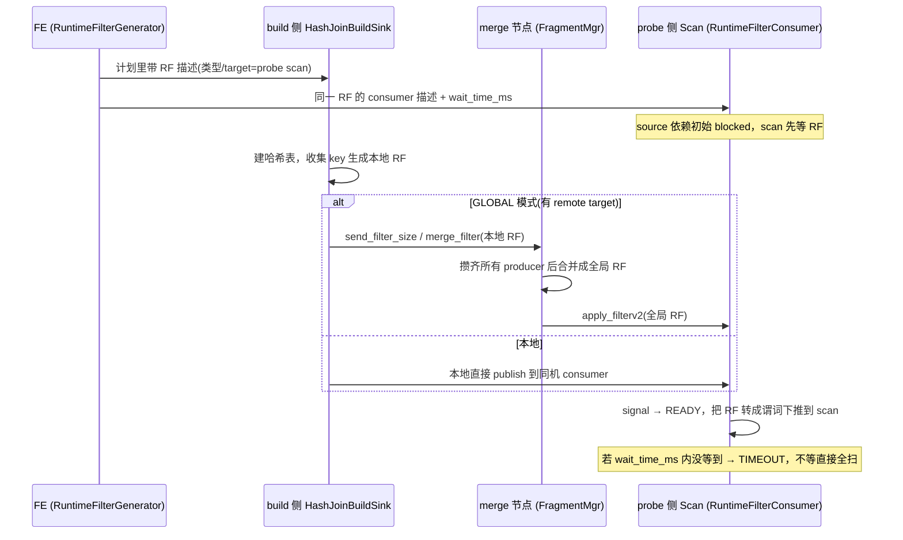

# 第 8 章：Join / 聚合 / 排序算子与 Runtime Filter、Spill

第 6 章把算子树在阻塞点切成了 source/sink 两态的 pipeline、用 `Dependency` 把 "build 完才能 probe" 这类先后关系连了起来，第 7 章看了最底层的 scan 怎么把数据读上来。本章补上中间那三个"重"算子——hash join、聚合、排序——它们既是 pipeline 切分点（都拆成 sink 攒 + source 吐），又是一条查询里最吃内存、最容易慢和挂的地方。围绕它们还有两套横切机制：**Runtime Filter**（RF，用 build 侧的数据在运行期现造一个过滤器回推到 probe 侧的 scan，少扫无用行）和 **Spill**（内存放不下时把算子状态按分区落盘）。本章不重复第 6 章的两态框架，只讲这三个算子如何在两态拆分下协作、以及 RF 与 Spill 那些"写错就慢/就挂/就错"的 tricky 语义。

本章的行号引用基于写作时核实所用的 HEAD（`41d25ebdec`，源码树与系列基线 `7bc98f696f` 一致）。代码演进会让行号漂移，但对象名与结构不变；写作时每一处 `路径:行号` 都在当前代码里核实过。

## 8.1 问题：内存不够 join 一张大表怎么办

一条 `SELECT ... FROM big JOIN dim ON big.k = dim.k WHERE dim.region='EU'` 看着简单，但 BE 要落地它，一次撞上三个独立的难题。用三连问把它们串起来。

### 问题一：hash join 怎么塞进 pipeline

**遇到了什么？** hash join 语义上要求"先把一侧全读进哈希表，再拿另一侧逐行探测"。这个"必须攒完全部 build 输入才能产出第一行"的阻塞点，和火山模型的 `get_next()` 逐层拉取天然冲突——build 侧还没建完，probe 侧不能动。

**候选方案。** 其一，一个线程串起 build 再串起 probe，中间阻塞等待——就是第 6 章批判的"阻塞算子占着线程睡觉"，固定线程池下几十个这样的实例就能把线程池占空。其二，把 join 拆成两个算子、放进两条 pipeline，用依赖表达先后。

**Doris 怎么解决。** 走候选二，且这正是第 6 章讲过的套路：build 侧是 `HashJoinBuildSinkOperatorX`（`be/src/exec/operator/hashjoin_build_sink.h:107`，某条 pipeline 的末端 sink），probe 侧是 `HashJoinProbeOperatorX`（`be/src/exec/operator/hashjoin_probe_operator.h:124`，另一条 pipeline 的起点 source），两者共享一个 `HashJoinSharedState`（`be/src/exec/pipeline/dependency.h:712`）。probe 侧 source 依赖初始 blocked，build sink 到 eos 时调 `set_ready_to_read`（`be/src/exec/operator/hashjoin_build_sink.cpp:922`）唤醒 probe。框架细节见第 6 章 6.2，本章不再展开。

### 问题二：probe 侧那些注定匹配不上的行，能不能提前不扫

**遇到了什么？** 上面那条 SQL 里 `dim` 过滤后可能只剩几十个 `k`，可 `big` 有几十亿行。probe 侧的 scan 会把 `big` 整表读上来，逐行探哈希表，绝大多数行探空、白扫白探。I/O 和 CPU 全浪费在"注定匹配不上的行"上。

**候选方案。** 其一，什么都不做，老实全扫——正确但慢。其二，寄望优化器在编译期下推静态谓词——但 `big.k` 的取值范围要等 `dim` 过滤完、运行期才知道，编译期下推不了。其三，**运行期现造过滤器**：build 侧建哈希表时顺手把出现过的 key 收集成一个过滤器，回推给 probe 侧的 scan，让 scan 在读 `big` 时就把不可能命中的行/数据块跳掉。这就是 Runtime Filter。

过滤器用什么形式，又是一组权衡，对应 `be/src/exec/runtime_filter/runtime_filter_definitions.h:23` 的 `RuntimeFilterType` 枚举：

- `IN_FILTER`——把 build 侧 key 收成一个集合，probe 侧 `k IN (...)`。最精确（零误判），还能进一步做**分区裁剪**，但 key 太多时集合膨胀、下推和匹配都变贵。
- `BLOOM_FILTER`——布隆过滤器，空间恒定、支持海量 key，代价是有假阳性（漏放几行无害，只是少过滤一点）。
- `MINMAX_FILTER`（及只留一端的 `MIN_FILTER`/`MAX_FILTER`）——只传 build 侧 key 的最小/最大值，probe 侧按区间粗筛。最省，但只对有序/有区间意义的列有效，过滤力最弱。
- `IN_OR_BLOOM_FILTER`——**自适应**：key 少时当 IN 用、多到超过阈值就退化成 Bloom。判定在 `RuntimeFilterWrapper::get_real_type()`（`be/src/exec/runtime_filter/runtime_filter_wrapper.h:64`）：有 `_hybrid_set`（IN 集合还没超限）就返回 `IN_FILTER`，否则返回 `BLOOM_FILTER`。默认类型正是它，兼顾小表精确与大表可控。

### 问题三：build 侧那张表内存放不下

**遇到了什么？** 如果 build 侧本身就大（或聚合的 group 太多、排序的数据太多），哈希表/聚合表/排序缓冲撑爆了 query 内存上限，怎么办。

**候选方案。** 其一，直接 OOM 报错——最省事，但一个大查询就废了。其二，一开始就按最坏情况全量预留内存——浪费且仍可能不够。其三，**分区落盘（partitioned spill）**：把 build 数据按 hash 分成若干分区，内存扛不住时挑分区写盘，probe 阶段再一分区一分区读回来处理。用磁盘换"不 OOM"，代价是慢。

**Doris 怎么解决。** 走候选三，为 join/agg/sort 各准备了一套 `partitioned_*` 算子（`be/src/exec/operator/partitioned_hash_join_sink_operator.h` 等）。触发是**内存水位驱动**的、按需的：不到水位不落盘，到了才挑最大的算子落。细节见 8.4。

三个问题的答案分别落在 8.2（算子两态协作与 join 语义）、8.3（RF 全链路）、8.4（Spill）。

## 8.2 源码走读：三大算子

三个算子共享同一套两态骨架：sink 侧 `LocalState` 攒数据进 `SharedState`，eos 时置就绪唤醒 source 侧。哈希表/聚合表的具体实现（开链、SIMD 探测等）不是本章重点，一笔带过；重点看**两态怎么协作**和**join 语义在拆分下落在哪**。

### Hash Join：build 攒、probe 吐

build 侧 `HashJoinBuildSinkLocalState`（`be/src/exec/operator/hashjoin_build_sink.h:28`）把右表逐 block 灌进哈希表；attach 在它上面的还有 RF 生成（`_runtime_filter_producer_helper`，`be/src/exec/operator/hashjoin_build_sink.h:79`），build 完顺手把 RF 造好发出去（见 8.3）。probe 侧 `HashJoinProbeLocalState`（`be/src/exec/operator/hashjoin_probe_operator.h:46`）拿左表探测。

**tricky 点：outer/anti/null-aware 语义在两态拆分下落在哪。** 内连接很简单——probe 到一行、匹配上就输出。但下面几种语义要求"probe 扫完之后还得再做一轮"，正是两态拆分容易漏的地方：

- **RIGHT/FULL OUTER JOIN 的右表未匹配行**：右表里从没被任何左行命中的行也要输出（补 NULL）。这没法在 probe 逐行时判定——必须等**整个** probe 阶段结束、才知道哪些 build 行"从未被访问"。所以哈希表里每个 build 行带一个 visited 标记，probe 结束后再遍历一遍哈希表把未访问行吐出来。判定分支在 `be/src/exec/operator/hashjoin_probe_operator.cpp:454`（`RIGHT_OUTER_JOIN || FULL_OUTER_JOIN`）。**错写会怎样**：如果在 probe 每个 block 结束就"收尾"、而不是等 source 真正 eos，右表未匹配行会漏输出——结果少行，且因为依赖数据分布，小数据量测不出来。
- **build 侧为空的短路**：build 表 0 行时，LEFT_OUTER/FULL_OUTER/LEFT_ANTI 的结果就是"probe 表 + 右侧全 NULL"，代码在 `be/src/exec/operator/hashjoin_probe_operator.cpp:199` 的 `empty_right_table_shortcut()` 直接短路输出。**错写会怎样**：漏了这个短路、按普通 probe 走，build 侧哈希表为空会让所有左行探空——LEFT ANTI 恰好全部输出、LEFT OUTER 补 NULL 输出，逻辑上碰巧能对；但真正的坑是反过来——把该短路的 join 类型判错，就会多输出或少输出。
- **NULL_AWARE_LEFT_ANTI/SEMI JOIN**：这是 `NOT IN (subquery)` 的落地，NULL 具有"传染性"（build 侧只要有一个 NULL，左侧任何行都不能确定不在集合里）。probe 算子为它保留了独立的 `TJoinOp::NULL_AWARE_LEFT_ANTI_JOIN` 分支（`be/src/exec/operator/hashjoin_probe_operator.h:40`、`:137`）。**错写会怎样**：当成普通 ANTI JOIN 处理、忽略 NULL 传染，`NOT IN` 结果直接错——这是 SQL 语义级的错，不是性能问题。

这几个变体的存在，正说明"两态拆分"不是无脑切一刀：凡是语义上依赖"probe 全部结束"的输出（outer 未匹配、mark join 标记），都必须挂在 source 侧 eos 之后，而不能在 sink 侧或 probe 中途做。

### 聚合：sink 攒哈希表、source 吐结果

`AggSinkOperatorX`（`be/src/exec/operator/aggregation_sink_operator.h:135`）把输入按 group by key 聚进哈希表，`AggSourceOperatorX`（`be/src/exec/operator/aggregation_source_operator.h:94`）把聚合结果吐出去，共享 `AggSharedState`。除全量聚合外还有几个变体，从文件名即可读出：`streaming_aggregation_operator`（流式预聚合，边攒边吐、降低下游压力）、`distinct_streaming_aggregation_operator`（`DISTINCT`）、`partitioned_aggregation_sink_operator`（可落盘版，见 8.4）。选哪个由 FE 计划决定，BE 照单执行。

### 排序：三种算法一个骨架

`SortSinkOperatorX`（`be/src/exec/operator/sort_sink_operator.h:56`）攒行、`SortSourceOperatorX`（`be/src/exec/operator/sort_source_operator.h:39`）吐有序结果。tricky 点在 sink 侧按 `TSortAlgorithm` 选了三种截然不同的 sorter（`be/src/exec/operator/sort_sink_operator.cpp:52`）：

- `HEAP_SORT` → `HeapSorter`（`be/src/exec/sort/heap_sorter.h:24`）：`ORDER BY ... LIMIT n` 且 n 小，维护一个大小 n 的堆，只留 top-n，内存 O(n)。
- `TOPN_SORT` → `TopNSorter`（`be/src/exec/sort/topn_sorter.h:39`）：top-n 的另一实现，n 较大时用。
- `FULL_SORT` → `FullSorter`（`be/src/exec/sort/sorter.h:177`）：无 limit 或 limit 很大，必须全排。

这解释了一个常见观感：`ORDER BY ... LIMIT 10` 飞快而去掉 `LIMIT` 就慢——不是"多返回了几行"的差别，而是算法从堆退化成全排、内存与耗时量级不同。此外 heap sort 还能和 scan 的 topn runtime predicate 联动下推（`be/src/exec/operator/sort_sink_operator.cpp:122`），这也是 `LIMIT` 下推优化的一环。

## 8.3 源码走读：Runtime Filter 全链路

RF 的链路横跨 FE 编译、BE build 侧生成、（可选的）全局 merge、下发到 probe 侧 scan 四段。先看时序，再抠 tricky 点。



### FE 侧：谁生成、推给谁

RF 由 Nereids 后置处理生成，入口 `RuntimeFilterGenerator`（`fe/fe-core/src/main/java/org/apache/doris/nereids/processor/post/RuntimeFilterGenerator.java`），下推路径 `fe/fe-core/src/main/java/org/apache/doris/nereids/processor/post/RuntimeFilterPushDownVisitor.java`，无用 RF 的裁剪在 `fe/fe-core/src/main/java/org/apache/doris/nereids/processor/post/RuntimeFilterPruner.java`（都在同目录）。FE 决定：从哪个 join 的 build 侧（`srcExpr`）生成、推到哪个 scan（`targetExpr`）、用什么类型。

### BE build 侧：现造过滤器

build sink 在哈希表建完、eos 那一刻造 RF（`be/src/exec/operator/hashjoin_build_sink.cpp:271`~`:286`）：`_runtime_filter_producer_helper->build(...)` 收集 key、`detect_local_in_filter` 判断是否退化、`publish` 发出去。`RuntimeFilterProducerHelper`（`be/src/exec/runtime_filter/runtime_filter_producer_helper.h:37`）封装单个算子的所有 producer，底层每个过滤器是一个 `RuntimeFilterProducer`（`be/src/exec/runtime_filter/runtime_filter_producer.h:96`）。它顺手把三个 profile 计数挂到算子的 `RuntimeFilterInfo` 分组下：`BuildTime`、`PublishTime`、`SkipProcess`（`be/src/exec/runtime_filter/runtime_filter_producer_helper.cpp:224`~`:231`）——8.6 实验就靠这几个名字定位。

### merge 节点：全局协调角色

**tricky 点：为什么需要一个 merge 节点。** 一个 RF 的 build 侧往往被打散在多台 BE 上（build 侧 pipeline 有多个实例、甚至跨机），每个实例只见到 build 数据的一部分。若各自把"局部 RF"直接推给 probe scan，probe 会被局部过滤器误杀——某个 key 只是没出现在这台 BE 的 build 分片里，不等于全局不存在。所以 `runtime_filter_mode = GLOBAL`（默认，`fe/fe-core/src/main/java/org/apache/doris/qe/SessionVariable.java:238`、默认值 `"GLOBAL"` 在 `:1702`）下，所有 producer 的局部 RF 先汇聚到一个**指定的 merge 节点**合并成全局 RF，再统一下发。

merge 节点是 FE 在编译期指定的一台 BE，地址写在 `RuntimeFiltersThriftBuilder`（`fe/fe-core/src/main/java/org/apache/doris/qe/runtime/RuntimeFiltersThriftBuilder.java:50` 的 `mergeAddress`，赋值在 `:155`）。BE 侧汇聚走 brpc：`send_filter_size`/`merge_filter`/`apply_filterv2`（`be/src/service/internal_service.cpp:1524`、`:1501`、`:1566`），落到 `FragmentMgr` 里由 `RuntimeFilterMerger`（`be/src/exec/runtime_filter/runtime_filter_merger.h:30`）合并。合并核心 `merge_from`（`:57`）用 `_received_producer_num` 计数——**攒齐 `_expected_producer_num` 个 producer 才置 READY**，这是全局正确性的关键：少收一个都不能提前下发，否则又回到"局部误杀"。

**tricky 点：为什么 merge 前先要一轮"报尺寸"。** Bloom filter 的位数组一旦建好就不能无损扩缩，而它的大小该按**全局** key 总数来定——可各 producer 只知道自己那份的行数。于是 GLOBAL 模式下 merge 分两阶段：第一阶段每个 producer 先把自己的 build 行数 `send_filter_size` 汇报给 merge 节点，merge 节点 `sync_filter_size`（`be/src/exec/runtime_filter/runtime_filter_mgr.h:114`、`:170`）累加出全局尺寸再广播回去，各 producer 用统一尺寸建 Bloom；第二阶段才 `merge_filter` 把等尺寸的位数组按位或合并。**错写会怎样**：省掉第一阶段、各 producer 按本地行数各建各的 Bloom，位数组尺寸不一致就无法按位或合并——要么合并报错，要么被迫取最小尺寸导致假阳性率飙升、过滤形同虚设。这也是为什么 RF 链路上有 `send_filter_size`/`sync_filter_size` 这一对看似多余的 RPC。

而 `runtime_filter_mode = LOCAL` 则跳过 merge，仅在本机 build↔probe 之间用（只对同机 co-located 的 join 有效）。

### probe 侧 scan：尽力而为，超时就全扫

**这是 RF 最反直觉、也最容易被误判的一点：RF 是尽力而为（best-effort），失效表现为"慢而不是错"。** scan 侧 consumer（`RuntimeFilterConsumer`，`be/src/exec/runtime_filter/runtime_filter_consumer.h:33`）有一个状态机（`:35`）：

```
NOT_READY ──signal──► READY ──► APPLIED
    └────等待超时────► TIMEOUT
```

scan 的 source 依赖初始 blocked，先等 RF 到位（`be/src/exec/operator/scan_operator.cpp:74` 的 `update_late_arrival_runtime_filter` / `:79` 的 `try_append_late_arrival_runtime_filter`，helper 是 `be/src/exec/operator/scan_operator.h:142` 的 `_helper`，即 `RuntimeFilterConsumerHelper`，`be/src/exec/runtime_filter/runtime_filter_consumer_helper.h:31`）。但它**不会无限等**：等待上限是 `_rf_wait_time_ms`（`be/src/exec/runtime_filter/runtime_filter_consumer.h:96`~`:99`，取会话变量 `runtime_filter_wait_time_ms`，`fe/fe-core/src/main/java/org/apache/doris/qe/SessionVariable.java:248`，默认 **1000ms**，`:1714`）。超时进 `TIMEOUT` 态，scan **不等了、直接全扫**——结果完全正确，只是没享受到过滤。

**IN filter 的额外红利：分区裁剪。** 当 RF 是精确的 IN 集合、且 target 列正好是 scan 表的分区列时，scan 不只是逐行过滤，还能整段跳过——直接把不含任何命中 key 的 tablet/分区从扫描列表里剔掉，连 I/O 都省了。这条路径在 `RuntimeFilterPartitionPruner`（`be/src/exec/runtime_filter/runtime_filter_partition_pruner.h:138`），RF 一到位就调 `prune_by_runtime_filters`（`:145`）重算分区（`be/src/exec/operator/scan_operator.cpp:128`），受会话变量 `enable_runtime_filter_partition_prune` 控制（`be/src/exec/operator/scan_operator.cpp:120`）。这也是"小表 build → IN filter"最理想的形态：Bloom/MinMax 只能逐行/逐块粗筛，唯有精确 IN 能做分区级裁剪，量级不同。所以看到 join 的 probe 侧是分区表时，RF 类型能不能保持 IN（别因 key 太多退化成 Bloom）直接决定了能不能吃到这份红利。

**易错点一：wait time 配得太短。** build 侧哈希表建得慢（build 表大、或有 spill），RF 还没造好 scan 就超时全扫了，profile 里看得到 RF 描述却过滤行数为 0。此时把 `runtime_filter_wait_time_ms` 调大能让 scan 多等一会儿、把过滤等回来；但调太大又会让 scan 空等、拖慢那些本就没多少可过滤的查询。这是个权衡，不是越大越好。

**易错点二：join 左右表颠倒，RF 直接作废。** RF 永远从 **build 侧**生成、推给 **probe 侧** scan。如果优化器（或人为 hint）把大表放到了 build 侧、小表放到 probe 侧，那生成的 RF 包含大表的海量 key，对小表 scan 毫无过滤价值——RF 名义上生成了，实际零收益，甚至因为 build 侧建大表哈希表更慢而更糟。所以"小表 build、大表 probe"是 RF 生效的前提；看到 RF 不起作用，先确认左右表没颠倒（profile 里 build/probe 两侧的行数一眼可辨）。

## 8.4 源码走读：Spill

### 触发：内存水位驱动，而非一开始就落盘

Spill 不是常开的，判定在 `PipelineTask::_should_trigger_revoking`（`be/src/exec/pipeline/pipeline_task.cpp:384`），逻辑分三道闸：

1. **没开 spill 直接不落**：`if (!_state->enable_spill()) return false;`（会话变量 `enable_spill`，默认 **false**，`fe/fe-core/src/main/java/org/apache/doris/qe/SessionVariable.java:680`、`:3262`）。这解释了一个高频困惑——不显式开 spill，大查询是直接 OOM 报错、不会自动落盘的。
2. **申请量太小不落**：`(reserve_size * parallelism) <= (query_limit / 5)` 就返回 false——一次要的内存还不到 query 上限的 1/5，犯不着落盘。
3. **到高水位才落**：`used_mem >= query_limit * 90%`（`query_water_mark = 90`）判为高内存压力。命中后 task 触发 revoke，挑当前**可撤销内存最大**的算子落盘（`do_revoke_memory`，`:748`），且只在最大算子的可撤销量超过 `spill_min_revocable_mem`（会话变量 `SPILL_MIN_REVOCABLE_MEM`，`fe/fe-core/src/main/java/org/apache/doris/qe/SessionVariable.java:683`）时才真正落，避免把一堆小算子都落了得不偿失（`:823`）。

query 内存上限来自 `exec_mem_limit`（`fe/fe-core/src/main/java/org/apache/doris/qe/SessionVariable.java:92`，字段 `maxExecMemByte`）与 workload group 限额中更严的那个。这就是"query limit / workload group 水位"两个触发口径的来源。

**tricky 点：落盘期间 task 是"挂起"而不是"阻塞线程"。** 这里最容易踩第 6 章那条红线——落盘是磁盘 I/O，若让算子在 `execute()` 里同步写盘，调度线程就被占死了。Doris 的做法仍是把等待表达成依赖：命中高压后，task 挂到 `_memory_sufficient_dependency`（`be/src/exec/pipeline/pipeline_task.cpp:341`）上、让出线程，并被登记进 workload group 的 paused query 队列（`add_paused_query`，`:635`、`:670`）；后台真正执行 `do_revoke_memory`（`:748`）把选中算子的数据异步落盘，落完再 `set_ready()`（`:370`）唤醒 task 继续。一个 `SpillContext` 按 task 计数（`:772`~`:775`）来判断这一轮 revoke 是否全部完成。所以"spill 中"的 task 在 profile 里表现为 BLOCKED 在内存依赖上、而非某线程卡在 write——这也是识别 spill 的一个侧面特征。

### 分区落盘与递归回读

以 partitioned hash join 为例。sink 侧 `PartitionedHashJoinSinkLocalState` 把 build 数据用 hash 分成 `_partition_count` 个分区（`be/src/exec/operator/partitioned_hash_join_sink_operator.cpp:421`，取会话变量 `spill_hash_join_partition_count`，`fe/fe-core/src/main/java/org/apache/doris/qe/SessionVariable.java:686`，典型 32），内存不够时挑分区 `_spill_to_disk`（`be/src/exec/operator/partitioned_hash_join_sink_operator.h:63`）写盘。probe 阶段一个分区一个分区处理：某分区 build 数据能装进内存就正常 join，装不下就**再分**。

**tricky 点：spill 是按分区递归的，且有降级。** 若单个分区仍然太大（数据倾斜、大量相同 key 挤在一个分区），probe 侧会对该分区**重分区（repartition）**——`repartition_current_partition`（`be/src/exec/operator/partitioned_hash_join_probe_operator.cpp:424`）用一个 FANOUT 大小的 partitioner 把它切成更细的子分区，递归下去。但递归不能无限：深度上限 `_repartition_max_depth`（默认 `SpillRepartitioner::MAX_DEPTH = 8`，`be/src/exec/spill/spill_repartitioner.h:74`）。**到达上限仍放不下会直接报错**（`be/src/exec/operator/partitioned_hash_join_probe_operator.cpp:429`~`:433`：`repartition exceeded max depth`），而不是死循环——这是有意的降级边界：8 层重分区还压不下的分区，几乎必然是极端倾斜（同一个 key 的行本身就超内存），继续切也无益，报错让用户去处理倾斜比让查询无声地耗尽资源更好。

落盘文件由 `be/src/exec/spill/` 下的 `spill_file_writer`/`spill_file_reader`/`spill_file_manager` 管理，写到 `SpillDataDir`（`be/src/runtime/exec_env_init.cpp:232`）。

回读同样是一分区一分区来的。partitioned agg 的 source 侧 `PartitionedAggLocalState`（`be/src/exec/operator/partitioned_aggregation_source_operator.h:48`）用 `_recover_blocks_from_partition`（`:88`）把某个落盘分区的 block 读回、重新聚进一个内存哈希表再吐结果，处理完一个分区（`_current_partition`）再取下一个——**任一时刻内存里只有一个分区的聚合表**，这正是分区落盘"用磁盘把峰值内存摊平"的本质。读盘也是 I/O，同样挂依赖跨 yield 进行（reader 对象 `:111` 特意做成"跨 yield 存活"，避免每次调度重开文件）。这解释了为什么落盘查询不仅写慢、回读阶段也慢：source 侧要串行地把每个分区读回来重聚一遍。

### 易错点：spill 打开后的性能断崖是预期，不是内存泄漏

**开了 spill 又恰好触发落盘的查询，会明显变慢——这是设计使然，不是 bug。** 落盘把内存里的 O(1) 哈希探测换成了"写盘 + 回读 + 可能的多轮重分区"，慢几倍很正常。运维上最容易的误判是：看到某查询在高峰期突然变慢、BE 磁盘 I/O 飙高，怀疑"内存泄漏"或"磁盘故障"去查内存/换盘。真正该做的是看 profile 里有没有 spill 相关计数（写盘行数/字节、`_spill_*` 系列计数器由 `partitioned_*` 算子挂出）——有，就是内存压力触发了落盘这个正常止血机制，方向是"给它更多内存或降并发让它不落盘"，而不是排查泄漏。反过来，如果 spill 计数为 0 而内存持续涨到 OOM，那才可能是没开 spill（回到第 1 道闸）或真有内存问题。

## 8.5 双模式对比

本章三大算子的执行逻辑、RF 链路、Spill 触发与分区递归，**存算一体与存算分离完全一致**——它们操作的是内存里的 block，不关心数据最初从本地 tablet 还是对象存储来（那是第 7 章 scan 的差异）。

唯一值得点出的是 **spill 的落盘位置**：即便在存算分离模式下，spill 文件也**仍然写到 BE 本地磁盘**，不是对象存储。证据在 BE 启动路径——`spill_storage_root_path`（`be/src/common/config.cpp:1481`）默认为空，为空时回退到 `storage_root_path`（本地盘）：`if (config::spill_storage_root_path.empty()) config::spill_storage_root_path = config::storage_root_path;`（`be/src/service/doris_main.cpp:425`~`:426`），配额受 `spill_storage_limit`（默认 `20%`，`be/src/common/config.cpp:1482`）约束。这是"分离模式下 BE 并非完全无状态"的又一例证，与第 1 部分 4.3 的论断呼应：分离模式把**存储**下沉到了对象存储，但**计算的临时溢写**依然依赖 BE 的本地盘——这也意味着分离模式给 BE 配盘时，不能只按 File Cache 算，还要给 spill 留空间。

## 8.6 动手实验

环境（编译、单机部署、开 profile）沿用第 1 部分第 5 章（`docs/doris-internals/part1-architecture/05-source-map-and-dev-env.md`），不再重复。两个实验：核心点验 RF 生效、易错点亲手触发 spill 断崖。

### 实验一（核心点）：RF 的生成 / 下发 / 过滤行数，以及关掉它

**目标**：在真实 profile 里找到 RF 的三类指标，再关掉 RF 对比 scan 输出行数，量化 RF 到底省了多少扫描。

建一张大表 `big`（几千万行）和一张过滤后很小的表 `dim`，跑一个小表 build、大表 probe 的 join：

```sql
SET enable_profile = true;
SELECT COUNT(*) FROM big JOIN dim ON big.k = dim.k WHERE dim.region = 'EU';
```

从 profile 里找两处：build 侧算子下 `RuntimeFilterInfo` 分组里的 `BuildTime`/`PublishTime`（RF 生成与下发耗时，`be/src/exec/runtime_filter/runtime_filter_producer_helper.cpp:224`），probe 侧 scan 算子里 RF 谓词的过滤行数计数（`predicate_filtered_rows_counter`，`be/src/exec/operator/scan_operator.cpp:437`）——这一项就是"RF 帮你少 probe 的行数"。

第二步，关掉 RF 再跑一次：

```sql
SET runtime_filter_mode = 'OFF';   -- 或 SET runtime_filter_type = 0;
-- 重跑上面那条 SELECT
SET runtime_filter_mode = 'GLOBAL';   -- 记得改回默认
```

对比两次 profile 里 **scan 的输出行数 / RowsRead**：关掉 RF 后，`big` 的 scan 会读回全部行（过滤计数消失、输出行数暴涨），join 总耗时随之上升。这一步把"RF 少扫了多少"从一个抽象概念变成 profile 上可量的两个数。**建立的能力**：会在 profile 里判断 RF 是否真的生效——有 `RuntimeFilterInfo` 分组不等于生效，要看 probe 侧过滤行数是否真的非 0。

### 实验二（易错点）：调小内存强制 spill，学会识别"spill 导致的慢"

**目标**：亲手制造一次 spill，看清它的 profile 特征和性能断崖，避免日后把它误判成内存泄漏或磁盘故障。

跑一个大 build 侧的 join 或大 group 的聚合，先开 spill、再把 query 内存压到很小逼它落盘：

```sql
SET enable_spill = true;              -- 默认 false，不开不会落盘
SET exec_mem_limit = 100000000;       -- 压到 ~100MB 逼近水位（够小才触发）
SELECT g, COUNT(*), SUM(v) FROM big GROUP BY g;   -- 大量 group，聚合表吃内存
```

对比"内存充足不落盘"和"内存受限落盘"两次 profile：后者会出现 spill 写盘/回读计数、耗时成倍上升，BE 本地盘 I/O 升高。**关键认知**：这个变慢是 8.4 讲的预期行为——`exec_mem_limit` 压小了内存、命中 90% 水位触发了 revoke。**踩坑点**：如果你先不开 `enable_spill` 就把 `exec_mem_limit` 压这么小，查询大概率直接**报内存超限错**而不是落盘——这正好复现 8.4 第 1 道闸"不开 spill 就 OOM"。跑通这两种结果，你就能在生产里一眼区分：profile 有 spill 计数 = 内存压力下的正常落盘（该加内存/降并发），无 spill 计数却 OOM = 没开 spill 或真有内存问题。收尾把 `exec_mem_limit` 改回默认。

## 8.7 排查清单

按"症状 → 定位入口"组织，覆盖这三个算子最高频的三类问题，part6 的查询故障排查会直接引用本节。

### 症状 A：join 慢，怀疑 RF 没生效

- **先看 RF 过滤行数，而非有没有 RF。** profile 里 scan 算子的 RF 谓词过滤行数（`be/src/exec/operator/scan_operator.cpp:437` 的 `predicate_filtered_rows_counter`）为 0，才是真没生效。为 0 时依次查：(1) 左右表是否颠倒（build 侧行数远大于 probe 侧 = 颠倒了，8.3 易错点二）；(2) build 侧慢导致 scan `runtime_filter_wait_time_ms`（默认 1000ms）超时全扫——看 build 侧 `BuildTime`/`PublishTime` 是不是很长、consumer 是否 `TIMEOUT`；(3) `runtime_filter_mode` 是否被设成了 `OFF`。
- **类型不对也会弱过滤。** IN 退化成 Bloom（key 太多，`be/src/exec/runtime_filter/runtime_filter_wrapper.h:64`）后过滤力下降属正常，不是 bug。

### 症状 B：内存超限报错（Memory Limit Exceeded）

- **先定位是哪个算子申请的。** 报错信息里带算子名与申请量。大 build 侧 join → hash join build sink；大 group 聚合 → agg sink；大 sort 无 limit → full sort。
- **两条止血路径。** 其一开 spill（`enable_spill = true`，默认关，`fe/fe-core/src/main/java/org/apache/doris/qe/SessionVariable.java:680`）让它落盘而非报错；其二给 workload group / `exec_mem_limit` 更合理的额度或降并行度。注意开了 spill 若报 `repartition exceeded max depth`（`be/src/exec/operator/partitioned_hash_join_probe_operator.cpp:429`），是单分区极端倾斜、8 层重分区仍压不下——这时要处理倾斜的 key，而不是继续加内存。

### 症状 C：单 instance 拖尾（倾斜）vs spill 慢，怎么区分

- **两者 profile 特征不同。** 倾斜：同一 pipeline 各 task 处理行数/耗时严重不均，个别 task 满核跑、其余早 FINISHED（第 6 章症状 B），但**无** spill 计数——治法是 local exchange 打散热点 key。spill 慢：有明确的写盘/回读计数与 I/O，各 task 可能都慢（都在落盘），治法是加内存/降并发让它不落盘。
- **两者会叠加。** 倾斜的分区最容易先撑爆内存触发 spill，于是同时出现"某 task 特别慢 + 该 task 有大量 spill"——此时根因是倾斜，spill 只是它的下游后果，优先解倾斜。

---

本章补齐了查询链路里最"重"的三个算子：hash join（build sink 攒哈希表 + probe source 探测，outer/anti/null-aware 这些依赖"probe 全部结束"的语义必须挂在 source eos 之后）、聚合（sink 攒 source 吐）、排序（heap/topn/full 三算法一骨架，`LIMIT` 决定量级）。横切其上的两套机制各有一条必须记牢的红线：Runtime Filter 是**尽力而为**的——从 build 侧现造、（GLOBAL 模式经 merge 节点攒齐所有 producer 再）下发到 probe scan，wait 超时就全扫，所以它失效是"慢而不是错"，且左右表颠倒会让它彻底作废；Spill 是**内存水位驱动**的按需落盘——不开 `enable_spill` 就直接 OOM，开了则到 90% 水位挑最大算子分区落盘、单分区太大按 FANOUT 递归重分区至多 8 层，打开后的性能断崖是预期而非内存泄漏。两模式下算子逻辑一致，唯 spill 始终落 BE 本地盘、再次印证分离模式 BE 并非完全无状态。至此第 2 部分把一条查询从连接、解析、优化、分发一路走到了 BE 的算子执行；下一章转向写入链路。
