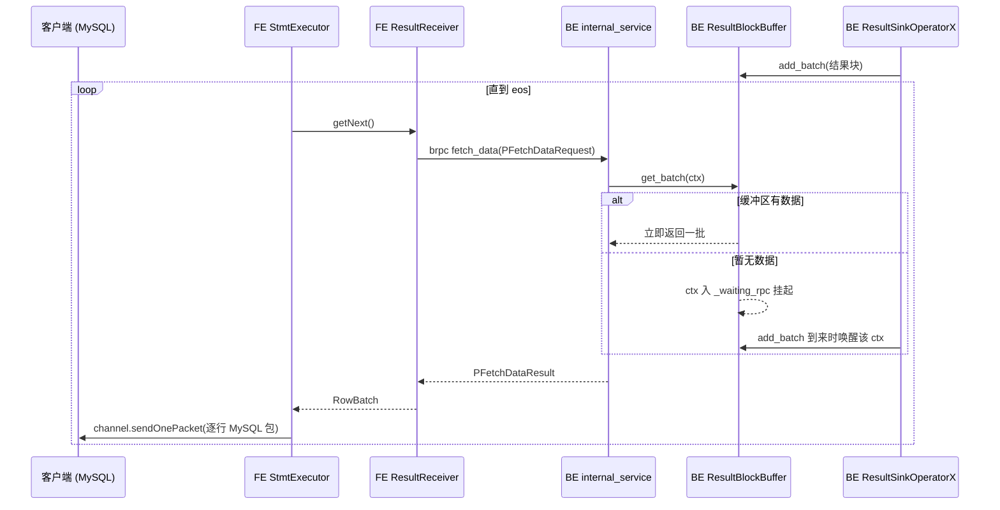
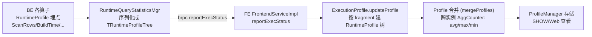

# 第 9 章：结果回传与 Profile 精读

前八章把一条 SELECT 从连接、解析、优化、分发一路走到 BE 算子执行——数据在几十上百个 pipeline 实例里被扫、被 join、被聚合。可这条链路还差最后一公里：算好的结果块散在一群 BE 上，得回到那**一个**敲了回车的客户端；而当这条链路慢了、卡了、挂了，你需要一面回望整条链路的镜子——这面镜子就是 **Profile**。本章合上第 2 部分的闭环：先讲结果怎么从 N 个 BE 汇回单个 MySQL 连接（呼应第 1 章的协议通道）、查询取消怎么从 FE 传播到所有 BE fragment；再讲 Profile 体系怎么生成，以及——本章真正的价值所在——**怎么读一份慢查询 Profile、按指纹快速定位瓶颈**。前者是收尾，后者是你日后排查绝大多数查询问题的主武器，part6 查询故障篇会直接建立在本节之上。

本章的行号引用基于写作时核实所用的 HEAD（`bc713131d6`，源码树与系列基线 `7bc98f696f` 一致）。代码演进会让行号漂移，但对象名与结构不变；写作时每一处 `路径:行号` 都在当前代码里核实过。

## 9.1 问题：结果从一群 BE 回到一个客户端

一条 `SELECT ... GROUP BY ...` 的最终结果，物理上产生在**顶层 fragment 的多个实例**里——可能分布在多台 BE、每台多个并行实例。而客户端只有一条 MySQL 连接，且这条连接（第 1 章）**只连着 FE**、BE 根本不认识这个客户端。怎么把散在一群 BE 上的结果，收敛成一股字节流、按 MySQL 结果集协议回写给客户端？用三连问拆开。

**遇到了什么问题？** N 个结果生产者（BE 实例）对 1 个消费者（FE 上的一条 MySQL channel），中间隔着网络。既要保证顺序合理、不丢不重，又不能让快的生产者把内存撑爆——因为客户端可能读得很慢（BI 工具翻页、`mysql` 客户端管道给了个 `less`），生产端却在全速算。

**有哪些候选方案？**

- **候选一：各 BE 直接把结果回给客户端。** 协议上根本不成立——MySQL 连接建立在 FE 上，BE 没有这条连接，也不会 MySQL 结果集编码。直接否掉。
- **候选二：所有结果先汇到某个"汇聚 fragment"，再由 FE 从这一个点转发。** 顶层 fragment 本就常是单实例的汇聚点（如全局聚合、`ORDER BY ... LIMIT` 的最终 merge），把结果都收到它这里，FE 只跟这一个点打交道。收敛问题在计划层就解决了，但 FE 仍要有一个"从 BE 拉字节"的机制。
- **候选三：BE 侧放一个结果缓冲区，FE 主动来拉（pull）。** 顶层 fragment 的 result sink 把结果块写进一个本机缓冲区，FE 通过 brpc 一批一批地拉、拉一批编码一批回写 channel。拉取节奏由 FE（其实由客户端消费速度）决定，天然形成背压。

**Doris 怎么解决？** Doris 用的是**候选二定收敛点 + 候选三定传输**的组合：计划层把结果收敛到顶层 fragment 的 `ResultSinkOperatorX`（`be/src/exec/operator/result_sink_operator.h:156`），它把每个结果块 `add_batch` 进本机的 `ResultBlockBuffer`（`be/src/runtime/result_block_buffer.h:81`）；FE 侧的 `ResultReceiver`（`fe/fe-core/src/main/java/org/apache/doris/qe/ResultReceiver.java:45`）通过 brpc `fetch_data` 一批批拉、`StmtExecutor` 拿到就按 MySQL 协议编码回写 channel。**关键是这条链路是 pull 而非 push**——由消费端拉动。

**那背压到底怎么发生的？** 这是最值得抠的一点，因为它决定了"客户端不读时会不会把 BE 撑爆"。答案藏在 `ResultBlockBuffer::_update_dependency()`（`be/src/runtime/result_block_buffer.cpp:130`）：result sink 是个 pipeline sink 算子，它挂着一个 `Dependency`；每次 `add_batch`/`get_batch` 后都会重算这个依赖的状态——当某实例已入队但还没被 FE 取走的行数 `_instance_rows` 超过一个 batch 大小时（`:139`），就 `block()` 该依赖（`:140`）、否则 `set_ready()`。sink 依赖一旦 block，顶层 fragment 的这个 pipeline task 就**让出线程、停止产出**，背压顺着算子树一路往下传到 scan（第 7 章讲的 scan 侧背压），整条 fragment 就慢下来等 FE 来取。所以答案是：**客户端不消费 → FE 不 fetch → 缓冲区堆积 → result sink 依赖 block → 上游停产**，内存不会无界增长，代价是查询"卡在回传上"而非算不动。识别这种"卡"正是 9.4 的功课。

顺带澄清"顺序不丢不重"这半个问题：结果的**排序正确性**其实在计划层就解决了，不归缓冲区管。需要有序输出的查询（`ORDER BY`），顶层 fragment 会有一个单实例的最终 merge，把各上游有序流归并成一个全局有序流再喂给 result sink；缓冲区只需**保持到达顺序**逐批交给 FE 即可。这也是候选二"先收敛到顶层 fragment"的另一层价值——把"多路结果合成一路且有序"这件事留在算子层用 merge 做掉，回传层就退化成一个纯粹的"先进先出 + 背压"缓冲，简单且不易错。

## 9.2 源码走读：回传链路

先看时序，把角色摆清楚，再抠取消传播这个 tricky 点。



**BE 侧：缓冲与"轻量"的 fetch。** result sink 在 open 时向 `ResultBufferMgr`（`be/src/runtime/result_buffer_mgr.h:55`）`create_sender` 注册一块缓冲区（`be/src/exec/operator/result_sink_operator.cpp:63`、并行 result sink 模式在 `:128`），此后每块结果 `add_batch`（`be/src/runtime/result_block_buffer.cpp:186`）。FE 的拉取落到 `PInternalService::fetch_data`（`be/src/service/internal_service.cpp:653`）——注意它的注释明确写着这是个 light operation：**有数据就立刻返回，没数据不原地阻塞、而是把请求 ctx 塞进 `_waiting_rpc` 队列挂起**（`get_batch`，`be/src/runtime/result_block_buffer.cpp:148`，无数据时 `:181` push 进等待队列），等下一次 `add_batch` 发现有等待者就直接喂给它（`:248`）。这样 brpc 工作线程不会被"等结果"占死。

**FE 侧：拉一批、编码一批。** `ResultReceiver.getNext()`（`fe/fe-core/src/main/java/org/apache/doris/qe/ResultReceiver.java:97`）异步发 `fetch_data`（`:88`）拿回 `PFetchDataResult`。`StmtExecutor` 的回传主循环（`fe/fe-core/src/main/java/org/apache/doris/qe/StmtExecutor.java:1443`）很直白：`coordBase.getNext()` 拿一个 `RowBatch`（`:1446`），逐行 `channel.sendOnePacket(row)`（`:1473`）经 `MysqlChannel` 回写客户端，`batch.isEos()` 为真才跳出（`:1479`）。这里编码成 MySQL 字段包，正是第 1 章说的"结果集协议全要照抄"的另一半代价。循环里还顺手记了几个 SummaryProfile 计时——`Fetch Result Time`（`fe/fe-core/src/main/java/org/apache/doris/common/profile/SummaryProfile.java:106`）和 `Write Result Time`（`:107`）——9.4 靠这两个数区分"是执行慢还是回传/客户端慢"。

**tricky 点：cancel 传播——为什么有时"客户端已断，查询还在跑"。** 取消不是一个动作，而是一条要走完的链，任何一环延迟都会留下"僵尸查询"的观感。正常路径是：`ConnectContext.cancelQuery()`（`fe/fe-core/src/main/java/org/apache/doris/qe/ConnectContext.java:1185`）→ `StmtExecutor.cancel` → `Coordinator.cancel`（`fe/fe-core/src/main/java/org/apache/doris/qe/Coordinator.java:1396`）→ `cancelInternal`（`:1447`，先 `receiver.cancel` 停 FE 侧拉取、再 `cancelRemoteFragmentsAsync`）→ 逐 BE 发 brpc → BE `FragmentMgr::cancel_query`（`be/src/runtime/fragment_mgr.cpp:710`）。链走完，所有 BE fragment 才停。

问题在**触发**这一端。FE 要先"知道"该取消——它靠什么知道？要么用户显式 `KILL`（`ConnectContext.kill`，`:1153`），要么超时检查器 `checkTimeout`（`:1192`）发现查询超了 `query_timeout`，要么 FE 往 channel 写结果包时**写失败**才发觉客户端没了。但如果客户端只是**静默地关掉了 TCP 连接**（半关闭、拔网线、进程被杀），FE 在下一次写包失败或超时检查器触发之前，**根本感知不到**——于是 Coordinator 迟迟不发那个 cancel RPC，BE 就一直在跑。这就是"客户端已断、查询还在跑"的由来：不是取消坏了，而是取消还没被触发。

BE 侧为此留了一道**兜底**：`FragmentMgr::cancel_worker`（`be/src/runtime/fragment_mgr.cpp:732`）是个后台 reaper，每 `fragment_mgr_cancel_worker_interval_seconds`（`:826`）扫一遍，取消两类查询——已超时的（`:807`）、以及**协调者 FE 已死/重启**的（`:820`，靠 FE 进程 uuid 比对）。但它**很保守**：若一个 running FE 都找不到（可能在升级/重启），宁可不取消任何查询（`:781`）。**错写会怎样**：如果省掉这道 reaper、只依赖 FE 主动发 cancel，那么 FE 崩溃或网络分区时，BE 上的 fragment 会永远跑下去、占着内存和 CPU，直到 BE 重启——这正是为什么需要一个基于 FE 存活性的兜底取消，而它保守的代价是取消不即时（有一个扫描周期的窗口）。运维上看到"查询已经在客户端消失、BE 上 profile/内存还挂着"，先别怀疑泄漏，多半是这条链的某一环还在窗口期内。

**另一个易被忽略的 tricky 点：结果缓冲区在查询"结束"后还会多活一会儿。** result sink 的每个实例关闭时调 `_sender->close`（`be/src/exec/operator/result_sink_operator.cpp:200`），但缓冲区**不是立刻销毁**——只有当最后一个实例关闭（`is_fully_closed`）时，才安排一次**延迟清理** `cancel_at_time`（`:208`，`be/src/runtime/result_buffer_mgr.h:75`），延迟量是 `result_buffer_cancelled_interval_time`。为什么要留这个尾巴？因为 fragment 执行结束的那一刻，FE 可能还没把最后几批结果 `fetch_data` 拉完；若执行一 eos 就把缓冲区连同未取走的数据一起销毁，FE 最后一次拉取会扑空、客户端会莫名少几行结果。所以缓冲区要在所有 producer 关闭后再存活一个可配置的窗口，给 FE 留出把尾批拉干净的时间。**错写会怎样**：把这个延迟设成 0 或漏掉，就会在高并发、FE 拉取偶有延迟时，间歇性丢掉查询的尾部结果——这类"偶发少行"极难复现和定位。

## 9.3 Profile 体系：结构与生成

Profile 是把每个算子在运行期埋的计数器（耗时、行数、字节、内存）收集、按算子树组织、跨实例合并后，回传给 FE 汇成一棵可读的树。理解它的生成方式，才不会误读它。



**BE 埋点与上报。** 每个算子在自己的 `RuntimeProfile`（`be/src/runtime/runtime_profile.h:98`）上 `ADD_TIMER`/`ADD_COUNTER` 埋点，如 scan 的 `ScanRows`（`be/src/exec/operator/scan_operator.cpp:1101`，名字常量在 `be/src/runtime/runtime_profile_counter_names.h:78`）、`RowsRead`（`:1065` / `be/src/runtime/runtime_profile_counter_names.h:76`）。这些计数由 `RuntimeQueryStatisticsMgr`（`be/src/runtime/runtime_query_statistics_mgr.h:38`）周期性序列化成 `TRuntimeProfileTree`、经 brpc 上报（`report_runtime_query_statistics`，`be/src/runtime/runtime_query_statistics_mgr.cpp:338`）。FE 入口是 `FrontendServiceImpl.reportExecStatus`（`fe/fe-core/src/main/java/org/apache/doris/service/FrontendServiceImpl.java:1039`），落到 `ExecutionProfile.updateProfile`（`fe/fe-core/src/main/java/org/apache/doris/common/profile/ExecutionProfile.java:256`）按 fragment 建起 FE 侧的 `RuntimeProfile` 树（`fe/fe-core/src/main/java/org/apache/doris/common/profile/RuntimeProfile.java:57`），最后由 `Profile`（`fe/fe-core/src/main/java/org/apache/doris/common/profile/Profile.java:102`）汇总、`ProfileManager` 存储供查看。

**tricky 点一：Profile 是"多实例合并"的产物，一个计数器背后是一群实例。** 同一个算子在多实例/多 BE 上各有一份 profile，FE 用 `mergeProfiles`（`fe/fe-core/src/main/java/org/apache/doris/common/profile/RuntimeProfile.java:514`）把它们合并成一份，每个计数器变成一个 `AggCounter`（`fe/fe-core/src/main/java/org/apache/doris/common/profile/AggCounter.java:23`），打印成 `avg ..., max ..., min ...`（`AggCounter.print`，`:68`~`:90`）。**这行 `avg/max/min` 就是读 profile 的信息金矿**：一个耗时计数器 `max` 远大于 `min`，意味着某个实例拖了后腿——这正是数据倾斜的指纹（见 9.4、9.6）。若只看 avg，倾斜会被平均掉、完全看不出来。

**tricky 点二：某个 instance 在 profile 里"缺失"意味着什么。** 合并时若某份 profile 里找不到对应计数器，代码是**静默跳过**的（`fe/fe-core/src/main/java/org/apache/doris/common/profile/RuntimeProfile.java:563`~`:567` 注释明说 "ignore the counter if it is not found"）。所以 profile 里某个 fragment 的实例数比预期少，**不等于那些实例没干活、也不等于它们干的活是 0**——而是它们**根本没上报**：可能还没跑完就被取消、可能 BE 崩了、可能上报超时被丢。把"缺失"错当成"0 耗时/0 行"是读 profile 最常见的误判之一。看到实例数对不上，第一反应应是"少的那些去哪了"，而不是"它们没贡献"。

**tricky 点三：`enable_profile` 默认关，事后想看看不到。** Profile 采集有成本，所以会话变量 `enable_profile`（`fe/fe-core/src/main/java/org/apache/doris/qe/SessionVariable.java:109`）**默认 `false`**（`:1199`）。**这意味着 profile 必须在查询运行前就打开**——一条已经跑完的慢查询，如果当时没开 profile，事后无论如何都拿不到它的 profile，只能改开关重跑。这是运维现场最扎心的一课。缓解手段有二：一是 `auto_profile_threshold_ms`（`:111`，默认 `-1` 即不启用，`:1207`）——在 `enable_profile` 为真的前提下，只把耗时超过阈值的查询 profile 落盘，兼顾"平时不采、慢的留证"；二是把采集粒度用 `profile_level`（`:181`，默认 `2`，`:1448`）调低减负。`profile_level` 决定埋点的详细程度：级别越高、计数器越细（不少 `ADD_TIMER_WITH_LEVEL`/`ADD_COUNTER_WITH_LEVEL` 埋点带 level 参数，只有当前 level 够高才生效），代价是采集与上报开销更大。排查具体算子内部瓶颈时可临时调高级别拿到更细的计时，日常则用默认级别控制成本——这也解释了为什么有时"同一条查询、别人的 profile 里有某个细计数器、你的没有"：多半是 `profile_level` 不同。存下来的 profile 也不是无限的：FE 只保留最近 `max_query_profile_num`（`fe/fe-common/src/main/java/org/apache/doris/common/Config.java:2050`，默认 500）条，旧的会被挤掉。查看入口有二：`SHOW QUERY PROFILE`（命令 `fe/fe-core/src/main/java/org/apache/doris/nereids/trees/plans/commands/ShowQueryProfileCommand.java`）和 FE Web 的 Profile 页（`fe/fe-core/src/main/java/org/apache/doris/httpv2/rest/manager/QueryProfileAction.java`）。所以对慢查询的正确纪律是：**怀疑之前就开着 profile**，而不是出事后再想办法。

## 9.4 Profile 精读方法论（本章重点段）

有了前面的机制，才能谈"怎么读"。一份完整 profile 动辄上千行、上百个计数器，逐行看是灾难，凭直觉挑几个眼熟的看又容易被假象带偏。专家读 profile 靠的是**自顶向下的漏斗 + 瓶颈指纹对照**：先用漏斗把范围从"整条查询"逐层收敛到"某个具体算子"，再用指纹把这个算子的病因定性。核心心法只有一条——**永远先归因、再优化**：任何优化动作之前，都要能在 profile 上指出"时间花在这个 fragment 的这个算子的这个计数器上"，否则就是在猜。下面先讲四步漏斗，再给指纹对照表，最后走一遍完整示例。

### 精读工作流：总耗时 → 最长 fragment → 最长算子 → 关键计数器

**第一步，看 `Execution Summary`，把总耗时拆成几大段。** profile 顶部的 Summary（`getProfileByLevel`，`fe/fe-core/src/main/java/org/apache/doris/common/profile/Profile.java:342`）里，`Total`（`fe/fe-core/src/main/java/org/apache/doris/common/profile/SummaryProfile.java:63`）是端到端总时间。先把它拆开：编译期（`Nereids Analysis/Rewrite/Optimize Time` 等，第 2~4 章）、执行期、回传期（`Fetch Result Time`/`Write Result Time`，`fe/fe-core/src/main/java/org/apache/doris/common/profile/SummaryProfile.java:106`/`:107`；等结果的空转记在 `Wait and Fetch Result Time`，`:105`）。**这一步先分诊**：若 `Nereids Optimize Time` 就占了大头，问题在优化器不在执行（去第 4 章）；若 `Write Result Time` 巨大而执行很快，是回传/客户端慢（9.1 的背压，去看客户端消费或结果集是否过大）；只有执行期占大头，才往下钻算子。

**第二步，在 `DetailProfile` 里找最长的 fragment。** 执行细节按 fragment 组织。每个 fragment 有它的墙钟时间，挑最长的那个进去——它是关键路径所在。这里有个常见误区：fragment 数量多不代表复杂度高，也别按 fragment 编号顺序读；只认墙钟时间，最长的那个才是你要钻进去的地方，其余先搁着。若最长 fragment 的时间又主要花在等下游 exchange（`DataArrivalWaitTime` 大），说明关键路径其实在它的上游 fragment，顺着 exchange 的数据来源再跳一层。

**第三步，在该 fragment 内找最长的算子。** 看每个算子的自身耗时（各算子的 `ExecTime` 类计数与其 `WaitForDependencyTime`）。注意区分**真在算**还是**在等**：`WaitForDependencyTime`（如 result sink 的 `be/src/exec/operator/result_sink_operator.cpp:46`、exchange source 的等待）大，说明这个算子是被下游/依赖拖着等，真正的瓶颈在别处（顺着依赖找上游）；只有算子自身的处理计时大，它才是元凶。

**第四步，读元凶算子的关键计数器，对照下面的指纹表定性。** 读单个算子时，先认准它这一类的"主计数器"再看细节：hash join 看 `BuildHashTableTime`（`be/src/exec/operator/hashjoin_build_sink.cpp:95`）与 `MemoryUsageHashTable`（`:89`），判断是 build 侧大还是探测慢；聚合看 `BuildTime`（`be/src/exec/operator/aggregation_sink_operator.cpp:68`）与 `HashTableSize`（`:62`），判断是 group 太多还是聚合本身重；scan 看 `ScanRows`/`RowsRead` 与 `PerScannerWaitTime`，判断是读得多还是等 IO。这些主计数器就是把"最长算子"翻译成"具体病因"的钥匙。

### 瓶颈模式指纹对照表

下表每种模式给出"在 profile 上长什么样"。计数器名均在 BE 源码里核实（引用见各行），排查时按名字在 profile 里搜。

| 瓶颈模式 | Profile 指纹（关键计数器） | 源码锚点 |
|---|---|---|
| **Scan IO 慢** | scan 算子 `ScanRows`/`RowsRead` 巨大且 `PerScannerWaitTime` 高、`NumScanners` 打满；耗时集中在最底层 scan | `be/src/exec/operator/scan_operator.cpp:1101`/`:1065`；`be/src/exec/scan/scanner_context.cpp:518`（PerScannerWaitTime） |
| **RF 未生效** | 有 `RuntimeFilterInfo`（`BuildTime`/`PublishTime`）却 probe 侧 scan 的 RF 过滤行数≈0；left/right 表行数颠倒（第 8 章易错点二） | `be/src/exec/runtime_filter/runtime_filter_producer_helper.cpp:224`；`be/src/exec/operator/scan_operator.cpp:437`（过滤行数） |
| **数据倾斜** | 合并计数器 `max ≫ min`——某算子（如 join `BuildHashTableTime`、agg `BuildTime`）或整个 fragment 的耗时，`max` 是 `min` 的数倍；个别实例满核、其余早停 | `fe/fe-core/src/main/java/org/apache/doris/common/profile/AggCounter.java:68`（avg/max/min 打印）；`be/src/exec/operator/hashjoin_build_sink.cpp:95`；`be/src/exec/operator/aggregation_sink_operator.cpp:68` |
| **Spill 落盘** | 出现 `SpillBuildTime`/`SpillRePartitionTime`/`SpillInMemRow`/`SpillSerializeHashTableTime` 等非零计数，耗时成倍、BE 本地盘 IO 升高 | `be/src/exec/operator/partitioned_hash_join_sink_operator.cpp:53`~`:56`；`be/src/exec/operator/partitioned_aggregation_sink_operator.cpp:105` |
| **Exchange 网络慢** | exchange source `DataArrivalWaitTime`/`FirstBatchArrivalWaitTime` 高、`RemoteBytesReceived` 远大于 `LocalBytesReceived`、`DeserializeRowBatchTimer`/`DecompressTime` 占比高 | `be/src/exec/exchange/vdata_stream_recvr.cpp:412`/`:414`/`:408`/`:409`/`:411`/`:415` |
| **结果回传慢** | 执行期算子都不慢，但 result sink `WriteDataTime` 或 Summary 的 `Write Result Time` 大；result sink `WaitForDependencyTime` 大=被 FE/客户端背压 | `be/src/exec/operator/result_sink_operator.cpp:44`（WriteDataTime）/`:46`；`fe/fe-core/src/main/java/org/apache/doris/common/profile/SummaryProfile.java:107` |

### 三对最容易混淆的指纹，怎么再确认一步

指纹表能把嫌疑范围缩到一两种，但有三对指纹长得像、根因却不同，值得再抠一层，否则容易开错药方。

- **"scan 慢"是磁盘/网络慢，还是 cache 没命中（分离模式）。** 同样是 scan 耗时高，一体模式基本就是本地盘 IO 或读的行数太多（看 `ScanRows`）；但分离模式要多看一眼 File Cache 指标——`BytesScannedFromRemote` 高、`BytesScannedFromCache` 低（9.5），说明是冷查询在打对象存储，治法是让 cache 热起来（预热/扩本地盘），而不是去优化查询本身。把 cache miss 误当成"查询写得烂"去调 SQL，方向就全错了。
- **"exchange 慢"是网络慢，还是反序列化/解压慢。** exchange source 耗时高时，`DataArrivalWaitTime`/`FirstBatchArrivalWaitTime` 大指向**上游产出慢或网络慢**（数据迟迟不到），要顺着 exchange 往上游 fragment 找真正的生产瓶颈；而 `DeserializeRowBatchTimer`/`DecompressTime` 占比大则是**本地 CPU 花在拆包解压上**——两者治法完全不同，前者解决上游或网络，后者考虑压缩策略或并行度。
- **算子"耗时大"是真在算，还是在等。** 这是最普遍的误读。`WaitForDependencyTime` 大的算子是**被依赖挡着空等**（下游没消费、build 侧没就绪、内存不足挂起），它自己没干活，真凶在它等的那个对象上——顺着依赖往上游/build 侧找。只有算子**自身处理计时**（如 join 的 `BuildHashTableTime`、agg 的 `BuildTime`、scan 的实际读取耗时）大，它才是元凶。把"等待时间"当成"计算时间"去优化这个算子，纯属白费力气。

### 一段示意 profile 的走读

下面这段 profile 是**为讲解而编排的示意（非某次真实运行的原文，数值经过挑选以突出指纹）**，用来演示上面的漏斗怎么走。真实 profile 字段更多、更乱，但漏斗方法一致。

```
Execution Summary:
    - Total: 12s450ms
    - Nereids Analysis Time: 15ms   Nereids Optimize Time: 30ms   （编译期 ~45ms，排除）
    - Write Result Time: 120ms      （回传不慢，排除）
DetailProfile:
  Fragment 1 (总 12s100ms)          ← 最长 fragment，进这里
    HASH_JOIN_OPERATOR (BuildHashTableTime: avg 800ms, max 11s200ms, min 60ms)  ← max≫min
    HASH_JOIN_BUILD_SINK (SpillBuildTime: avg 300ms, max 9s, min 0ns)           ← 有 spill
  Fragment 2 (总 900ms)             ← 短，跳过
```

走读：总 12.45s，编译期 45ms、回传 120ms 都可排除 → 执行期占大头 → 进最长的 Fragment 1 → join 的 `BuildHashTableTime` 是 `avg 800ms 但 max 11.2s、min 60ms`——**`max` 是 `min` 的近 200 倍，倾斜指纹**；同一算子 `SpillBuildTime max 9s` 又说明那个被塞爆的实例触发了落盘。定性结论：**某个 join key 严重倾斜，热点实例的哈希表建得极慢并触发 spill**，根因是倾斜、spill 是它的下游后果（第 8 章症状 C）。治法优先解倾斜（打散热点 key），而非盲目加内存。整个判断只看了 Summary 三行 + 一个 fragment 两个算子的三个计数器——这就是漏斗 + 指纹的效率。

## 9.5 双模式对比

结果回传与 Profile 体系的机制，**存算一体与存算分离完全一致**——回传走的是内存里的结果块与 brpc，profile 走的是算子计数器上报，都不关心数据最初从本地 tablet 还是对象存储来。

唯一的差异在**分离模式的 profile 里多出一组 File Cache 指标**，正好呼应第 7 章：scan 之下的远端读会额外埋 `BytesScannedFromCache`/`BytesScannedFromRemote`（`be/src/io/cache/block_file_cache_profile.cpp:125`/`:127`）、`BytesWriteIntoCache`（`:121`）、`NumLocalIOTotal`/`NumRemoteIOTotal`（`:109`/`:110`）。读分离模式的 profile 多一步：把这几个数一比就知道 cache 命中率——粗略地看 `BytesScannedFromCache / (BytesScannedFromCache + BytesScannedFromRemote)` 就是这次 scan 的字节命中率。命中率低（`BytesScannedFromRemote` 高、`BytesWriteIntoCache` 也高，说明这次读把大量数据现下现回填）说明冷查询在打对象存储，慢是 cache 没热而非查询本身有问题；治法是预热或扩本地 cache 盘，而不是改 SQL。这是分离模式独有的一类"scan 慢"根因，一体模式没有——所以在分离集群上诊断 scan 慢，第一件事就是看这组 cache 指标，别一上来就怀疑查询计划。

## 9.6 动手实验

环境（编译、单机部署、开 profile）沿用第 1 部分第 5 章（`docs/doris-internals/part1-architecture/05-source-map-and-dev-env.md`），不再重复。两个实验：核心点走一遍 9.4 的完整漏斗，易错点亲手造倾斜、在 profile 里认出它的指纹。

### 实验一（核心点）：对一条 join+agg 查询完整走一遍精读漏斗

**目标**：把 9.4 的"总耗时 → 最长 fragment → 最长算子 → 关键计数器"跑通一次，写出你自己的瓶颈结论。

造一张较大的事实表 `big`（几千万行、有一列 `k` 做 join key、一列 `g` 做分组）和一张维表 `dim`，跑一条既有 join 又有聚合的查询：

```sql
SET enable_profile = true;                 -- 必须查询前就开，否则事后拿不到（9.3）
SELECT big.g, COUNT(*), SUM(big.v)
FROM big JOIN dim ON big.k = dim.k
WHERE dim.region = 'EU'
GROUP BY big.g;
```

跑完后 `SHOW QUERY PROFILE` 或到 FE Web Profile 页取这条 profile，严格按四步走：(1) 看 `Execution Summary` 的 `Total`，把 `Nereids * Time`、`Write Result Time` 减掉，确认时间花在执行期；(2) 在 `DetailProfile` 里找耗时最长的 fragment；(3) 进去找自身耗时最大的算子——分清是 join、agg 还是 scan；(4) 读它的关键计数器（join 看 `BuildHashTableTime`/`MemoryUsageHashTable`，agg 看 `BuildTime`/`HashTableSize`，scan 看 `ScanRows`/`RowsRead`），对照 9.4 指纹表定性。把结论写成一句话，例如"瓶颈在 Fragment N 的 agg build，HashTableSize 极大、耗时占 70%"。写不出这句话，就说明漏斗还没走到底、别急着动手优化。做完后再自查一次：你结论里那个算子的耗时，占 `Total` 里执行期的比例有多大？如果只占 20%，那它顶多是次要因素，真正的大头还在别处，得回到第二步重挑 fragment。**建立的能力**：面对任意一份 profile，都能在几分钟内把总耗时归因到某个具体算子，并用占比验证这个归因站得住脚，而不是从头读到尾、也不是抓到一个眼熟的计数器就下结论。

### 实验二（易错点）：造数据倾斜，在 profile 里认出倾斜指纹

**目标**：亲手制造 join 数据倾斜，看清它在 profile 里的指纹（合并计数器的 `max/min` 巨大落差），并与均匀数据对比，避免日后把倾斜误判成"整体慢"。

先跑**均匀数据**版本作为基线：让 `big.k` 大致均匀分布，跑上面那条 join，记下 join build 算子 `BuildHashTableTime` 的 `avg/max/min`——均匀时三者应当接近。

再造**倾斜数据**：把 `big` 里约 90% 的行的 `k` 都设成同一个值（其余 10% 分散），重跑同一条 join：

```sql
-- 造倾斜：让单个 key 占绝大多数行（示意，按你的建表方式调整）
UPDATE big SET k = 1 WHERE rand() < 0.9;   -- 或建表时就让 90% 行 k=1
SET enable_profile = true;
SELECT COUNT(*) FROM big JOIN dim ON big.k = dim.k;
```

对比两次 profile 里 join build 侧 `BuildHashTableTime`（以及整个 fragment 耗时）的 `avg/max/min`：倾斜版会呈现 **`max` 远大于 `min`、也远大于 `avg`** 的形态——那个接到 90% 相同 key 的实例把哈希表建得奇慢，其余实例早已 FINISHED。这就是 9.4 说的倾斜指纹，它来自 `AggCounter` 的跨实例合并打印（`fe/fe-core/src/main/java/org/apache/doris/common/profile/AggCounter.java:68`）。**踩坑点**：如果你只盯着 `avg`，倾斜会被平均值掩盖、看起来"稍慢而已"；必须看 `max` 与 `min` 的比值才能暴露它。跑通这两组，你就掌握了 profile 里最有价值的一条判据——**倾斜看 max/min 落差，不看均值**。收尾把 `big.k` 改回、关掉 profile。

## 9.7 排查清单

按"症状 → 定位入口"组织，覆盖回传与 profile 三类最高频问题，part6 查询故障排查会直接引用本节。

### 症状 A：客户端等很久没结果——是执行慢、回传卡、还是客户端不取

- **先分诊，别急着看算子。** 开 profile 看 `Execution Summary`：执行期算子耗时大 → 真的执行慢，进 9.4 漏斗找算子；`Write Result Time`/`Wait and Fetch Result Time`（`fe/fe-core/src/main/java/org/apache/doris/common/profile/SummaryProfile.java:107`/`:105`）大而执行期不大 → 回传/客户端瓶颈。
- **回传卡看背压。** result sink 的 `WaitForDependencyTime`（`be/src/exec/operator/result_sink_operator.cpp:46`）大，说明缓冲区堆积、FE 没及时 fetch——多半是客户端消费慢（BI 翻页、结果集过大、客户端侧管道阻塞，9.1 的背压链），不是 Doris 算不动。此时优化点在客户端消费或减小结果集，不在执行计划。

### 症状 B：查询取消不掉（客户端已断，BE 还在跑）

- **理解取消是一条链，且有窗口。** 正常靠 FE 触发（`KILL`/超时/写包失败）→ `Coordinator.cancel`（`fe/fe-core/src/main/java/org/apache/doris/qe/Coordinator.java:1396`）→ 逐 BE brpc → `FragmentMgr::cancel_query`（`be/src/runtime/fragment_mgr.cpp:710`）。客户端静默断开时 FE 可能感知不到，直到超时检查器或下次写包失败（9.2 tricky）。
- **兜底是 reaper，保守且有延迟。** BE `cancel_worker`（`be/src/runtime/fragment_mgr.cpp:732`）按周期取消"协调者已死/超时"的查询，但找不到任何 running FE 时不取消（`:781`）。所以先确认：查询有没有设 `query_timeout`？FE 是否存活？确需立即清理可显式 `KILL`。

### 症状 C：Profile 拿不到（开关没开 / 已过期）

- **事后拿不到，多半是当时没开。** `enable_profile` 默认 `false`（`fe/fe-core/src/main/java/org/apache/doris/qe/SessionVariable.java:1199`），查询跑时没开就无 profile 可查、只能重跑。长期方案：对目标会话/负载开 `enable_profile`，配 `auto_profile_threshold_ms`（`:1207`）只留慢查询证据。
- **拿到但实例数不全，别当成 0。** 合并时缺失的实例是静默跳过（`fe/fe-core/src/main/java/org/apache/doris/common/profile/RuntimeProfile.java:563`），意味着那些实例没上报（被取消/崩溃/上报超时），不是没干活（9.3 tricky 二）。
- **旧 profile 被挤掉。** FE 只留最近 `max_query_profile_num`（`fe/fe-common/src/main/java/org/apache/doris/common/Config.java:2050`，默认 500）条，太久的查询 profile 已淘汰，需靠落盘的历史 profile。

---

本章合上了第 2 部分的闭环。结果回传是一条 **pull 链**：顶层 fragment 的 `ResultSinkOperatorX` 把结果写进本机 `ResultBlockBuffer`，FE 的 `ResultReceiver` 经 brpc `fetch_data` 一批批拉、`StmtExecutor` 按 MySQL 协议逐行回写 channel（呼应第 1 章）；客户端不消费时，缓冲区堆积会 block result sink 的依赖、背压顺算子树传到 scan，内存不会无界涨。取消是一条要走完的链、且触发端可能感知不到客户端静默断开，所以有 `cancel_worker` reaper 兜底、代价是不即时。Profile 是回望整条链路的镜子：BE 算子计数器上报、FE 跨实例合并成 `avg/max/min`——而读它的方法就是本章的核心价值：**总耗时 → 最长 fragment → 最长算子 → 关键计数器**的漏斗，配合 scan IO 慢 / RF 未生效 / 倾斜 / spill / exchange 慢 / 回传慢六种指纹，其中"倾斜看 `max/min` 落差、不看均值"是最有价值的一条判据。记住两条纪律：**怀疑慢查询之前就开着 profile**（默认关，事后补不了）；**profile 里的缺失不是 0，而是没上报**。至此，一条 SELECT 从连接、解析、优化、分发、执行到结果回家，走完了完整一生；下一部分转向写入链路。
