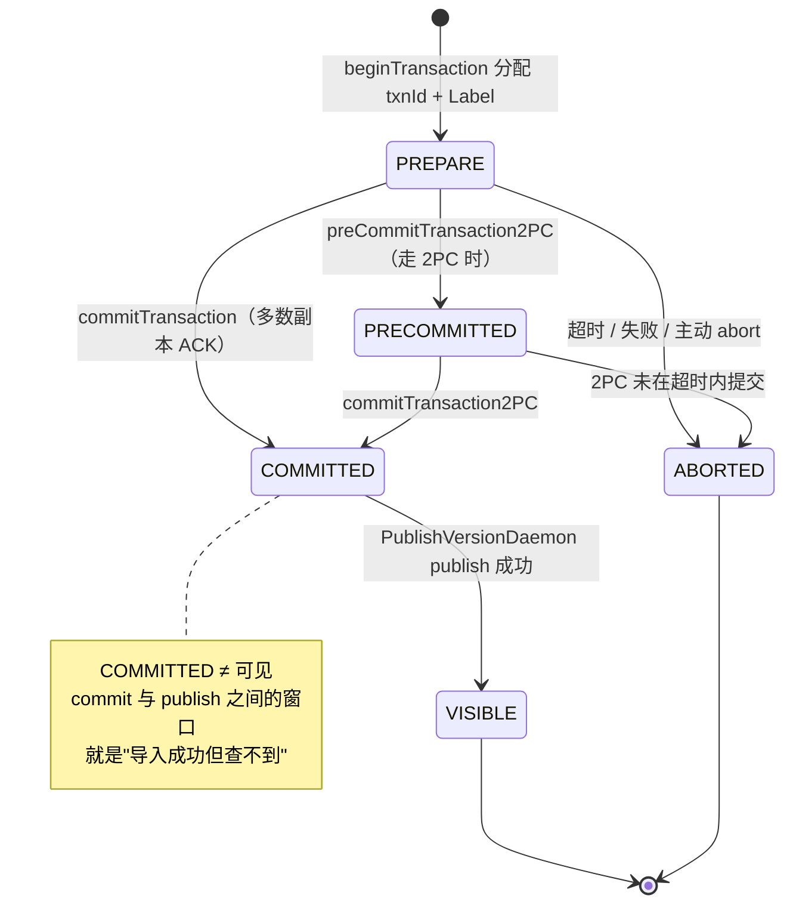

# 第 1 章：导入方式总览与事务模型

第二部分跟着一条 SELECT 走完了查询链路：从连接、解析、优化到 BE 上的执行与结果回传。那条链路的前提是"数据已经在库里"。这一部分换到写入侧，跟着**一次 Stream Load** 走一遍——从客户端 `curl` 灌数据，到 FE 开事务、BE 攒 memtable、刷 rowset，再到 publish 让数据可见。这条纵向链路比查询更长、更容易出错，因为它要在一个多 tablet、多副本的分布式系统里保证"一批数据要么全进、要么全不进"。

本章负责这条链路的地基。它不深入任何一种导入方式的执行细节（那是后面各章的事），而是先把三件底层的东西讲透：**为什么 Doris 用批级事务 + Label 幂等 + 两阶段提交这一套，而不是逐行幂等或无事务尽力写**；**五种导入方式在这套事务地基上如何分类**；以及**事务状态机长什么样、双模式（存算一体 / 存算分离）下事务管理的语义差在哪里**。`TransactionState` 和它的状态枚举会贯穿整个第三部分——后面每一章讲到"提交""可见""回滚"，都是在这张状态机上移动。

本章的行号引用基于写作时核实所用的 HEAD（`d23cc94775`，源码树与系列基线 `7bc98f696f` 一致）。代码演进会让行号漂移，但对象名与状态语义不变；写作时每一处 `路径:行号` 都在当前代码里核实过。另外提醒一个容易踩的资料坑：**本 master 的 BE 导入逻辑已集中重构到 `be/src/load/` 目录下**（旧文章常写在 `runtime/` 或 `olap/` 下，已过时），后面几章的 BE 引用都以此为准。

## 1.1 问题：怎么把"一批数据"原子地放进一个分布式系统

**遇到了什么问题？** 一张 Doris 表被水平切成若干 partition、每个 partition 再切成若干 tablet、每个 tablet 又有多个副本分散在不同 BE 上。现在要导入一批数据（可能几万行、也可能上亿行），这批数据会被按分区分桶规则打散、分别写到几十上百个 tablet 的多个副本里。核心难题是**原子性与幂等性**：这批写入分散在这么多物理位置上，如何保证要么整批对查询可见、要么整批不可见（不能出现"一半 tablet 写进去了、另一半失败"的中间态被查到）？以及,导入客户端一旦超时重试,如何保证同一批数据不会被**重复灌入两次**？分布式、多副本、还要能重试,三个约束叠在一起,这不是单机数据库"BEGIN…COMMIT"能直接照搬的。

**有哪些候选、各有什么优劣？**

- **候选一：无事务、尽力而为地写。** 客户端把数据推给 BE，BE 写哪算哪，谁写成功谁可见。实现最简单、吞吐也高。但代价是致命的：部分副本写成功、部分失败时，查询会读到残缺的一批数据；客户端超时重试会造成重复写入，分析结果直接错。对一个要给报表和决策供数的分析库来说，这种"脏读 + 重复"是不可接受的。
- **候选二：每行独立幂等（按主键去重）。** 给每行数据一个唯一键，写入时按键覆盖，重复写同一行是幂等的。这确实能解决重复问题，但它把幂等的粒度压到了"行"级：每写一行都要查一次是否已存在、要维护每行的版本，写放大和元数据开销巨大。分析型导入动辄百万行一批，逐行幂等对吞吐极不友好——这套思路更适合 OLTP 的点写，不适合 OLAP 的批量灌入。（Doris 主键模型的 Delete Bitmap 是在**批**的粒度上做行级去重，和这里说的"每行独立走一遍幂等协议"完全是两码事，详见第 3 章 3.3，内核级深潜见 part5 主键模型章节。）
- **候选三：批级事务 + Label 幂等 + 两阶段提交。** 把"一批导入"整体当成一个事务：开始时分配一个事务 ID 和一个用户可指定的**标签（Label）**，这一批的所有 tablet 写入都挂在这个事务下；只有当足够多的副本都写成功、事务提交并 publish 后，这批数据才**整体**变得可见；任何一步失败，整个事务回滚，一行都不进。幂等性靠 Label 保证：同一个 Label 在库内唯一，重复用一个已成功的 Label 提交会被直接挡回。

**Label 机制为什么能挡重复提交？** 关键在 FE 把 `label -> txn ids` 的映射常驻内存并持久化（`fe/fe-core/src/main/java/org/apache/doris/transaction/DatabaseTransactionMgr.java:154` 的 `labelToTxnIds`）。开事务时先查这个 Label 有没有对应的"未 ABORTED"事务：有且不是本次重试请求，就抛 `LabelAlreadyUsedException` 挡回去。于是客户端只要对同一批数据用同一个 Label（比如用业务批次号当 Label），无论超时重试多少次，成功的那批也只会进一次——幂等的判断从"逐行比对"上移到了"一个 Label 一次事务"，代价只是维护一张 Label 表，而不是给每行加版本。这就是把幂等做在**批级**而非**行级**的杠杆所在。

**Doris 怎么考量和解决的？** Doris 选了候选三，并把它作为**所有**导入方式共同的地基——无论 Stream Load、Broker Load 还是 Insert Into，最终都落到同一套 `beginTransaction / commit / publish / abort` 上。这么选的收益是：批级事务天然契合 OLAP"大批量、低频次"的写入模式，幂等开销被摊薄到可忽略；两阶段提交（commit 与 publish 分离）让"多副本达成一致"和"数据对外可见"解耦，提交只要多数副本 ACK 就能返回、可见性交给后台异步 publish 推进。代价也要认清：**commit 成功不等于查得到**——commit 和 publish/visible 之间有一个时间窗口，这正是运维中常被提及的"导入成功但查不到"现象的根源——1.3 与第 4 章会把这两个时间点的语义讲透。理解了"批级事务 + Label + 两阶段"这三件套，后面所有导入方式的行为就都能顺着这条主线推出来。

## 1.2 导入方式全景

Doris 对外提供五种主要导入方式，它们的触发方、数据源、同步性各不相同，但**底层都复用 1.1 说的那套批级事务**。本节只建立分类心智——记住"谁触发、数据从哪来、是否等结果返回、什么场景用它"，具体执行链路留给后面各章。

| 导入方式 | 触发方 | 数据源 | 同步性 | 适用场景 | FE/BE 入口类（一句话） |
| --- | --- | --- | --- | --- | --- |
| Stream Load | 用户主动发 HTTP PUT | 本地文件 / 程序内存流 | 同步（等最终结果） | 单批 GB 级实时导入、程序对接 | BE `StreamLoadAction`（`be/src/service/http/action/stream_load.h:34`）收 HTTP，FE 侧规划走 `StreamLoadHandler`（`fe/fe-core/src/main/java/org/apache/doris/load/StreamLoadHandler.java`） |
| Broker Load | 用户提交 SQL 作业 | HDFS / 对象存储的大文件 | 异步（提交后轮询） | 数仓离线批量导入、TB 级 | `BrokerLoadJob`（`fe/fe-core/src/main/java/org/apache/doris/load/loadv2/BrokerLoadJob.java:85`） |
| Routine Load | 用户建常驻作业，FE 自动调度 | Kafka 等消息流 | 持续（作业常驻，分批提交） | 流式实时接入、准实时数仓 | `RoutineLoadJob`（`fe/fe-core/src/main/java/org/apache/doris/load/routineload/RoutineLoadJob.java:115`） |
| Insert Into | 用户发 SQL | 另一张表 / VALUES / 外部表查询结果 | 同步 | 表间加工、小批量写入、`INSERT INTO SELECT` | `InsertIntoTableCommand`（`fe/fe-core/src/main/java/org/apache/doris/nereids/trees/plans/commands/insert/InsertIntoTableCommand.java`），成功后登记 `InsertLoadJob`（`fe/fe-core/src/main/java/org/apache/doris/load/loadv2/InsertLoadJob.java:44`） |
| Group Commit | 用户高频小写入，服务端攒批 | 同 Insert / Stream Load，但服务端合并多次提交 | 半同步（可选等待模式） | 高并发小批量写入（削减小事务数） | `GroupCommitManager`（`fe/fe-core/src/main/java/org/apache/doris/load/GroupCommitManager.java`）、`GroupCommitPlanner`（`fe/fe-core/src/main/java/org/apache/doris/planner/GroupCommitPlanner.java`） |

几点要点：

- **同步 vs 异步不是"快慢"，而是"谁负责轮询结果"。** Stream Load、Insert Into 是同步的——发起方阻塞等最终成败；Broker Load 是异步的——提交即返回一个作业，成败靠 `SHOW LOAD` 轮询；Routine Load 更特殊，它是一个**常驻作业**，FE 周期性地把它拆成一个个子任务、每个子任务对应一次独立的批级事务。
- **Group Commit 是"事务合并"而非新事务模型。** 高并发小写入会产生海量小事务，每个都要走一遍 begin/commit/publish，FE 事务表和 BE 版本数都会被打爆（还记得 [part1 第 3 章](../part1-architecture/03-data-model.md) 排查清单提过的 `-235 TOO_MANY_VERSION` 吗）。Group Commit 让服务端把短时间内的多次写入攒成一批、共用一次提交，用"牺牲一点可见延迟"换"事务/版本数量级下降"。它仍然是本章那套事务的应用，只是提交粒度变粗了。
- 本章不展开任何一种的执行细节。Stream Load 的完整链路（HTTP 入口 → memtable → delta writer → rowset → publish）是本部分主线，从第 2 章开始逐环拆；Broker Load / Routine Load / Group Commit 的差异在各自专章交代（详见 part3 后续章节）。这里只要建立"五种入口、一套地基"的分类心智即可。

## 1.3 源码走读：事务状态机

一次导入在 FE 侧就是一个 `TransactionState`（`fe/fe-core/src/main/java/org/apache/doris/transaction/TransactionState.java:61`）对象在状态机上移动。状态枚举定义在独立文件 `fe/fe-core/src/main/java/org/apache/doris/transaction/TransactionStatus.java`（整份文件就是这个枚举），一共六个值：

```java
public enum TransactionStatus {
    UNKNOWN(0),
    PREPARE(1),
    COMMITTED(2),
    VISIBLE(3),
    ABORTED(4),
    PRECOMMITTED(5);
```

其中 `UNKNOWN` 是查询不到 Label 时的占位返回，不是事务真实会停留的态。真正的生命周期是：`PREPARE`（开事务，`TransactionState` 构造即置为 `PREPARE`，见 `fe/fe-core/src/main/java/org/apache/doris/transaction/TransactionState.java:347`）→ 可选的 `PRECOMMITTED`（走 2PC 预提交时）→ `COMMITTED`（多数副本写成功、事务提交）→ `VISIBLE`（后台 publish 完成、数据对查询可见）；任意阶段失败则转 `ABORTED`。`VISIBLE` 与 `ABORTED` 是仅有的两个终态——`fe/fe-core/src/main/java/org/apache/doris/transaction/TransactionStatus.java:57` 的 `isFinalStatus()` 就只认这两个。

状态迁移不是在枚举里发生的，而是分层管理：`GlobalTransactionMgr`（`fe/fe-core/src/main/java/org/apache/doris/transaction/GlobalTransactionMgr.java`）是全局入口，但它本身几乎不持有状态——它按 dbId 把请求**转发**给每个库自己的 `DatabaseTransactionMgr`（`fe/fe-core/src/main/java/org/apache/doris/transaction/DatabaseTransactionMgr.java`）。为什么分库？因为事务的并发热点在库级别（一个库内的事务要串行校验 Label、检查配额），分库管理让不同库的事务互不争锁。`GlobalTransactionMgr` 上的几个关键方法都只是"找到 dbTransactionMgr 再调它"：`beginTransaction`（`fe/fe-core/src/main/java/org/apache/doris/transaction/GlobalTransactionMgr.java:164`）、`preCommitTransaction2PC`（`fe/fe-core/src/main/java/org/apache/doris/transaction/GlobalTransactionMgr.java:197`）、`commitTransaction`（`fe/fe-core/src/main/java/org/apache/doris/transaction/GlobalTransactionMgr.java:280`）、`commitAndPublishTransaction`（`fe/fe-core/src/main/java/org/apache/doris/transaction/GlobalTransactionMgr.java:310`）、`abortTransaction`（`fe/fe-core/src/main/java/org/apache/doris/transaction/GlobalTransactionMgr.java:387`）。而状态真正翻转发生在 `TransactionState.setTransactionStatus`（`fe/fe-core/src/main/java/org/apache/doris/transaction/TransactionState.java:527`，会记下 `preStatus` 以支持回放）与迁移前的校验 `beforeStateTransform`（`fe/fe-core/src/main/java/org/apache/doris/transaction/TransactionState.java:544`）。COMMITTED → VISIBLE 这一步由后台守护线程 `PublishVersionDaemon`（`fe/fe-core/src/main/java/org/apache/doris/transaction/PublishVersionDaemon.java:60`）推进，它给各 BE 下发 publish 任务、成功后调 `finishTransaction`（`fe/fe-core/src/main/java/org/apache/doris/transaction/PublishVersionDaemon.java:281`）把事务置为 `VISIBLE`。



### tricky 点一：COMMITTED ≠ VISIBLE，两个时间点的语义

这是整章最容易误解、也最需要讲透的一点。`COMMITTED` 的含义是**这批数据已经在足够多的副本上落盘、事务的成败已经定了**——它绝不会再回滚（状态机里 COMMITTED 没有指向 ABORTED 的边）。但 `COMMITTED` 的数据**还查不到**：要等 `PublishVersionDaemon` 给每个 tablet 下发 publish、把这批数据对应的版本"接上"tablet 的版本链、状态推进到 `VISIBLE`，查询才会带上这个新版本。

为什么要把"提交"和"可见"拆成两步？因为多副本一致性和对外可见性是两件事：commit 只需要多数副本确认收到数据就能对客户端返回成功（低延迟）；而让所有副本的版本链都对齐、让查询能一致地读到，是一个可以异步推进的过程。拆开之后，导入的返回延迟不被 publish 拖累，publish 可以批量、可重试。**这个窗口就是运维中常见的"导入返回成功了、可 `SELECT` 却查不到刚写的数据"现象的来源**——在存算一体下，publish 落到 `be/src/storage/task/engine_publish_version_task.cpp`（详见 part3 后续 publish 章节）。

这也是为什么同步导入（Stream Load / Insert Into）默认会在返回前**等到 `VISIBLE`**：它们要给客户端一个"发完就能查到"的承诺，所以宁可在 FE 侧多等一会儿 publish。而异步导入（Broker Load）返回的只是"作业已受理"，可见性靠后续轮询确认——两类导入对这个窗口的处理策略不同，根源都在"commit 与 visible 是两个语义时刻"。

**错写会怎样**：如果代码里把"commit 成功"直接当成"数据可见"来对客户端承诺，同步导入返回后立刻查却查不到，用户会认为丢数据。反过来，如果误以为 `COMMITTED` 还能回滚、在 publish 卡住时去 abort 一个 `COMMITTED` 事务，就会违反"COMMITTED 只进不退"的语义——正确的做法是让 publish 重试直到 `VISIBLE`，而不是回滚。可以用 `getLabelState`（`fe/fe-core/src/main/java/org/apache/doris/transaction/DatabaseTransactionMgr.java:1031`）查一个 Label 当前停在哪个态来区分"还没提交"和"提交了没可见"。

### tricky 点二：Label 复用的三种时机，行为各不相同

Label 幂等的全部逻辑集中在 `DatabaseTransactionMgr.beginTransaction`（`fe/fe-core/src/main/java/org/apache/doris/transaction/DatabaseTransactionMgr.java:321`）开头那段 Label 校验（`fe/fe-core/src/main/java/org/apache/doris/transaction/DatabaseTransactionMgr.java:347` 起）。它的算法是：取出该 Label 的所有历史事务，滤掉 `ABORTED` 的，剩下的"非 ABORTED 事务"至多一个；如果存在这样一个事务，再看它处于什么态。这就导致**同一个 Label 在三种时机重投，行为完全不同**：

1. **该 Label 的事务正在进行中（`PREPARE` / `PRECOMMITTED`）**：如果本次请求带的 `requestId` 与那个在途事务的 `requestId` 相同（即认定为同一次提交的重试），抛 `DuplicatedRequestException`（`fe/fe-core/src/main/java/org/apache/doris/transaction/DatabaseTransactionMgr.java:371`）并**返回已存在的 txnId**——这是幂等地"接管"同一个事务，不报错。若 `requestId` 不同（是另一次提交想蹭同一个 Label），则抛 `LabelAlreadyUsedException`（`fe/fe-core/src/main/java/org/apache/doris/transaction/DatabaseTransactionMgr.java:374`）挡回。
2. **该 Label 的事务已成功（`COMMITTED` / `VISIBLE`）**：它属于"非 ABORTED"，一律抛 `LabelAlreadyUsedException`。**这正是幂等挡重复的核心场景**——一批数据已经成功进库，再用同一个 Label 提交会被直接拒绝，数据不会进第二次。
3. **该 Label 的事务已失败（`ABORTED`）**：ABORTED 事务在第一步就被滤掉了，等于该 Label"没有活跃事务"，于是**放行、开一个新事务**。这也符合直觉：一批数据导失败了，用同一个 Label 重试是应该被允许的。

**错写会怎样**：如果把第 1 种时机的 `requestId` 判断漏掉，同一次提交的正常重试会被误判成"Label 冲突"而报错，同步导入的重试机制直接失效。如果把第 3 种时机也当成冲突挡回，导入一失败这个 Label 就永久废了，用户被迫每次换 Label，业务批次号做幂等键的用法就崩了。Doris 用"滤掉 ABORTED + requestId 区分重试"精确地覆盖了这三种时机——读代码时务必把这三条分支对上。

### tricky 点三：`label_keep_max_second` 过期后幂等失效

Label 幂等依赖 FE 内存里那张 `labelToTxnIds` 表。但这张表不能无限增长——事务到终态后会被后台清理线程按过期时间搬走。过期时间由两个配置控制：普通导入用 `label_keep_max_second`（`fe/fe-common/src/main/java/org/apache/doris/common/Config.java:178`，默认 3 天），流式/高频导入用更短的 `streaming_label_keep_max_second`（`fe/fe-common/src/main/java/org/apache/doris/common/Config.java:183`，默认 12 小时）。终态事务分别挂在两条队列上（`fe/fe-core/src/main/java/org/apache/doris/transaction/DatabaseTransactionMgr.java:143` 的 `finalStatusTransactionStateDequeShort` 与 `Long`），清理时从队头弹出、调 `clearTransactionState`（`fe/fe-core/src/main/java/org/apache/doris/transaction/DatabaseTransactionMgr.java:2192`）把该事务连同它在 `labelToTxnIds` 里的记录一并删掉。此外还有个数量上限 `label_num_threshold`（`fe/fe-common/src/main/java/org/apache/doris/common/Config.java:2834`，默认 2000），即使没到时间，终态事务过多也会被裁掉。

**错写会怎样 / 使用者要注意什么**：一旦某个 Label 的成功事务被清理出内存，`labelToTxnIds` 里就查不到它了，此时**再用这个老 Label 提交同一批数据会被当成"全新 Label"放行，数据会被重复导入一次**。也就是说，Label 幂等只在 `label_keep_max_second` 窗口内有效。这对"用天级批次号做幂等键、但可能几天后才补数重跑"的场景是个隐蔽的坑：补数时那个 Label 可能已过期，幂等保护失效。要点是——**幂等窗口 = Label 保留时长**，需要更长幂等保证就调大 `label_keep_max_second`，但代价是 FE 内存里事务表更大。

## 1.4 双模式对比（本章重点段）

part1 第 4 章 4.4 节已经确认过一个关键事实：`GlobalTransactionMgr` 和 `CloudGlobalTransactionMgr`（`fe/fe-core/src/main/java/org/apache/doris/cloud/transaction/CloudGlobalTransactionMgr.java`）是同一个接口 `GlobalTransactionMgrIface` 的两个兄弟实现，FE 按部署形态选其一；云侧的提交最终经 `MetaServiceProxy.commitTxn` 落到 MetaService。本节不重复那个"类对子"事实，而是深入**这个选择在语义上的后果**——事务状态存在哪、FE 重启后从哪恢复、2PC 的预提交与提交在两种模式下分别落在哪个组件。

**事务状态住在哪里，是两种模式最根本的分野。**

- **存算一体（`GlobalTransactionMgr` + `DatabaseTransactionMgr`）**：事务状态是 FE 的**一等公民**，活在 FE 进程内存里（`idToRunningTransactionState` 等结构），同时通过 editlog 持久化到 BDBJE。每一次状态迁移都要落一条 editlog——`beginTransaction` 里开完事务就调 `persistTransactionState`（`fe/fe-core/src/main/java/org/apache/doris/transaction/DatabaseTransactionMgr.java:1836`），其内部 `editLog.logInsertTransactionState`（`fe/fe-core/src/main/java/org/apache/doris/transaction/DatabaseTransactionMgr.java:1843`）把 `TransactionState` 写进 BDBJE。也就是说，**FE 自己就是事务状态的权威存储**。
- **存算分离（`CloudGlobalTransactionMgr`）**：FE 退化成一个**薄客户端**，它不在本地持久化事务状态——事务的权威状态在 MetaService（背后是 FoundationDB）。`CloudGlobalTransactionMgr` 的每个动作都是一次 RPC：begin 走 `MetaServiceProxy.getInstance().beginTxn`（`fe/fe-core/src/main/java/org/apache/doris/cloud/transaction/CloudGlobalTransactionMgr.java:337`），commit 走内部 `commitTxn`（`fe/fe-core/src/main/java/org/apache/doris/cloud/transaction/CloudGlobalTransactionMgr.java:819`）里的 `MetaServiceProxy.getInstance().commitTxn`（`fe/fe-core/src/main/java/org/apache/doris/cloud/transaction/CloudGlobalTransactionMgr.java:832`）。FE 这边基本不写 editlog 来记事务。

**FE 重启后事务从哪恢复，是上一条的直接推论。** 存算一体下，FE 重启要从 BDBJE 回放 editlog 重建内存里的事务表，回放入口是 `GlobalTransactionMgr.replayUpsertTransactionState`（`fe/fe-core/src/main/java/org/apache/doris/transaction/GlobalTransactionMgr.java:959`）——它把持久化的每条 `TransactionState` 重新塞回对应 `DatabaseTransactionMgr`。这意味着事务的高可用边界**就是 FE（BDBJE 多数派）的高可用边界**：FE 集群在，事务状态就在。而存算分离下，FE 重启后不需要回放事务——它需要用时直接去 MetaService 查即可，事务状态的持久性与高可用**由 MetaService/FDB 负责，与某个 FE 实例的存活解耦**。这带来一个语义差：存算分离下换一个 FE 节点接管、甚至 FE 全部重启，在途事务的权威记录都不受影响；存算一体下事务状态的命运和 FE 的 BDBJE 绑定在一起。

**2PC 的预提交/提交落点，在两种模式下打在不同组件上。** 2PC（先 precommit 到 `PRECOMMITTED`、再由外部协调者 commit）在两模式都支持，但落点不同：

- 存算一体：`preCommitTransaction2PC`（`fe/fe-core/src/main/java/org/apache/doris/transaction/GlobalTransactionMgr.java:197`）最终在 `DatabaseTransactionMgr` 内把 `TransactionState` 置为 `PRECOMMITTED` 并持久化到 BDBJE；随后的 `commitTransaction2PC`（`fe/fe-core/src/main/java/org/apache/doris/transaction/GlobalTransactionMgr.java:368`）把它推到 `COMMITTED`。预提交态就存在 FE 本地。
- 存算分离：`CloudGlobalTransactionMgr.preCommitTransaction2PC`（`fe/fe-core/src/main/java/org/apache/doris/cloud/transaction/CloudGlobalTransactionMgr.java:381`）构造 `PrecommitTxnRequest` 发给 MetaService（`MetaServiceProxy.getInstance().precommitTxn`，`fe/fe-core/src/main/java/org/apache/doris/cloud/transaction/CloudGlobalTransactionMgr.java:410`），预提交态由 MetaService 记录；commit 阶段同样走 `MetaServiceProxy.commitTxn`。

这套分野还有一个直接的运维后果，值得单独点出：**排查事务问题时，"去哪里看权威状态"在两种模式下完全不同**。存算一体下，`SHOW TRANSACTION` / `SHOW PROC '/transactions'`（见 1.5）读的就是 FE 内存里的事务表，它本身即权威，看到什么就是什么；FE 主从切换时，新 Master 靠回放 BDBJE editlog 把这张表重建出来，切换窗口内在途事务的推进会短暂停顿。而存算分离下，FE 只是 MetaService 的一个视图——同一个事务，不同 FE 节点看到的应当一致，因为它们都向 MetaService 查；真正的权威在 MetaService/FDB 里，所以定位"事务到底提交没有"这类问题时，必要时得下沉到 MetaService 侧的记录，而不能只信某个 FE 的内存快照。这也解释了为什么存算分离能把 FE 做成近乎无状态、可以随意扩缩容和替换：事务这个最"有状态"的东西已经被搬走了。

一句话概括这套差异：**存算一体把事务状态机运行在 FE + BDBJE 上，存算分离把它托管给 MetaService/FDB，FE 只当调用方**。后面讲提交与可见性（Publish vs MetaService 通知 BE 可见）、讲 Compaction 执行位置时，会再三回到这条主线——凡是"状态存哪、谁来推进"的问题，答案都由这个分野决定。

## 1.5 动手实验

前置环境（编译集群、单机拉起、日志级别调整）一律沿用 part1 第 5 章，不再重复。本实验**一个核心 + 一个踩坑**。

先确认观测命令真实存在。事务状态可以从两个入口看：一是 `SHOW PROC '/transactions'` 系列，其目录树由 `ProcService`（`fe/fe-core/src/main/java/org/apache/doris/common/proc/ProcService.java:48` 注册了 `transactions` 根）逐层展开——根节点 `TransDbProcDir`（`fe/fe-core/src/main/java/org/apache/doris/common/proc/TransDbProcDir.java:27`）列出各库的 `RunningTransactionNum`，下钻到某个 dbId 是 `TransStateProcDir`（`fe/fe-core/src/main/java/org/apache/doris/common/proc/TransStateProcDir.java:27`，只有 `running` / `finished` 两个子节点），再下钻是 `TransProcDir`（`fe/fe-core/src/main/java/org/apache/doris/common/proc/TransProcDir.java:29`），列出每个事务的 `TransactionId / Label / TransactionStatus / PrepareTime / PreCommitTime / CommitTime / PublishTime / FinishTime` 等字段。二是 `SHOW TRANSACTION`（由 `ShowTransactionCommand`，`fe/fe-core/src/main/java/org/apache/doris/nereids/trees/plans/commands/ShowTransactionCommand.java` 实现），支持 `WHERE label = '...'` 或 `WHERE id = ...` 精确查一个事务。

### 实验一（核心）：观察一次导入的状态流转

**目标**：亲眼看到一次导入在 `PREPARE → COMMITTED → VISIBLE` 上移动，并对上 1.3 的状态机与那几个时间戳字段。

1. 准备一张简单表和一个数据文件，用 Stream Load 导入，**显式指定一个自己记得住的 Label**：
   ```bash
   curl --location-trusted -u root: \
     -H "label:exp_txn_001" \
     -H "column_separator:," \
     -T ./data.csv \
     http://127.0.0.1:8030/api/demo_db/demo_tbl/_stream_load
   ```
   返回体里的 `Status` 为 `Success` 表示这批已经 `VISIBLE`（Stream Load 是同步的，返回即最终态）。
2. 用 `SHOW TRANSACTION` 按 Label 查这次事务的落点与时间戳：
   ```sql
   SHOW TRANSACTION FROM demo_db WHERE label = 'exp_txn_001';
   ```
   观察 `TransactionStatus` 列（应为 `VISIBLE`）以及 `PrepareTime / CommitTime / PublishTime` 三个时间戳——`CommitTime` 与 `PublishTime` 之间的差，就是 1.3 讲的"COMMITTED 到 VISIBLE"那个窗口的实测宽度。
3. 想看它在库级的聚合视图，用 PROC 目录逐层下钻：
   ```sql
   SHOW PROC '/transactions';                 -- 各库的 RunningTransactionNum
   SHOW PROC '/transactions/<dbId>';          -- 该库 running / finished 计数
   SHOW PROC '/transactions/<dbId>/finished'; -- 逐事务明细（含刚才那条）
   ```

**这个实验验证的核心点**：一次导入不是"写完就可见"，它是一个事务在状态机上走完 `PREPARE → COMMITTED → VISIBLE` 的过程；`CommitTime` 与 `PublishTime` 两个时间戳把"提交"和"可见"这两个语义时刻分得清清楚楚。

### 实验二（踩坑）：同一 Label 在三种时机重投，看三种不同行为

**目标**：亲手把 1.3 tricky 点二的三种时机各踩一遍，认清"幂等接管 / Label 冲突 / 放行重试"三种截然不同的结果。

1. **对已成功的 Label 重投（时机二：COMMITTED/VISIBLE）**：直接把实验一那条 `curl` **原样再发一次**（Label 仍是 `exp_txn_001`）。返回体的 `Status` 会是 `Label Already Exists`（对应 `LabelAlreadyUsedException`）、`ExistingJobStatus` 显示 `FINISHED`。**数据不会被导第二次**——这就是幂等挡重复。
2. **对进行中的 Label 重投（时机一：PREPARE）**：换一张大表或大文件，让一次导入耗时够长；在它还在跑时，另开一个终端用**同一个新 Label**再发一次。你会看到它同样被 `Label Already Exists` 挡回，且 `ExistingJobStatus` 显示为运行中（`RUNNING`/`PRECOMMITTED`）——因为这次重投的 `requestId` 与在途事务不同，不被认作"同一次重试"。（真正 `requestId` 相同的重试是同步导入客户端内部的重试链路才会触发，会走 `DuplicatedRequestException` 幂等接管、不报错。）
3. **对已失败的 Label 重投（时机三：ABORTED）**：先制造一次失败——比如故意用错分隔符或超出 `max_filter_ratio` 让导入被 abort；确认失败后，用**同一个 Label**把正确的数据重投一次。这次会**正常放行、导入成功**，因为 ABORTED 事务在 Label 校验时被滤掉了，该 Label 视同可用。

**要建立的区分能力**：看到 `Label Already Exists` 先别急着换 Label——它可能是"这批已经成功了"（时机二，说明你的幂等生效了、无需重导），也可能是"上一次还在跑"（时机一，等它结束即可）。只有确认上一次是 ABORTED（时机三），同 Label 重投才会真正开新事务。把这三种结果和 `SHOW TRANSACTION` 查到的 `ExistingJobStatus` / `TransactionStatus` 对照着看，就把 1.3 的三条分支从代码落到了现象。

## 1.6 排查清单

按"症状 → 定位入口"组织，覆盖事务层最高频的三类问题。

### 症状 A：导入卡在 COMMITTED 不 VISIBLE

- **先分清停在哪个态**：`SHOW TRANSACTION ... WHERE label='...'` 看 `TransactionStatus`。若为 `COMMITTED`（有 `CommitTime` 无 `PublishTime`），说明事务已提交、卡在 publish；这不是"导入失败"，也不能 abort（COMMITTED 只进不退），要往 publish 侧查。
- **publish 卡住的常见根因**：某些副本不可达 / 落后太多导致版本无法在多数副本上对齐；或后台 publish 线程 `PublishVersionDaemon`（`fe/fe-core/src/main/java/org/apache/doris/transaction/PublishVersionDaemon.java:60`）积压。存算一体下 publish 任务落到 BE 的 `be/src/storage/task/engine_publish_version_task.cpp`，可结合 BE 日志看具体 tablet 的 publish 报错。
- **和"查不到"区分**：如果事务已经是 `VISIBLE` 但查询仍看不到，那是查询侧读版本的问题（见 [part2 第 7 章](../part2-query-lifecycle/07-scan-path.md) 或 part1 3.3 版本机制），不是事务没推进——两者定位入口完全不同。

### 症状 B：`Label Already Used` 误判

- **它常常不是 bug 而是幂等在工作**：先看该 Label 对应事务的当前态。已 `VISIBLE`/`COMMITTED`——这批已成功，重复提交被正确挡回，无需重导（见 1.5 实验二时机二）。仍在 `PREPARE`/`PRECOMMITTED`——上一次还没结束，等它完成或超时（见时机一）。
- **确属需要重导却被挡**：确认上一次事务是否已 `ABORTED`。若确已失败仍报 Label 冲突，检查 `labelToTxnIds`（`fe/fe-core/src/main/java/org/apache/doris/transaction/DatabaseTransactionMgr.java:154`）里该 Label 是否还挂着未 ABORTED 的残留事务。
- **反向的隐患**：老 Label 补数时"意外放行导致重复导入"，多半是 Label 已过 `label_keep_max_second`（`fe/fe-common/src/main/java/org/apache/doris/common/Config.java:178`）窗口被清理，幂等失效（见 1.3 tricky 点三）。需要长幂等窗口就调大该配置。

### 症状 C：事务数超限报错

- **`current running txns on db ... larger than limit`**：来自 `checkRunningTxnExceedLimit`（`fe/fe-core/src/main/java/org/apache/doris/transaction/DatabaseTransactionMgr.java:2289`），说明该库在途事务数触达配额。根因通常是导入频率过高、或 publish 积压让事务迟迟不进终态。治本是降低小事务频率（考虑 Group Commit 合并），治标是核对 `max_running_txn_num_per_db`（`fe/fe-common/src/main/java/org/apache/doris/common/Config.java:678`，默认 10000）与该库的 transaction quota。
- **终态事务表膨胀**：若 FE 内存里终态事务过多，检查 `label_num_threshold`（`fe/fe-common/src/main/java/org/apache/doris/common/Config.java:2834`）与 `label_keep_max_second` 的配置是否让清理跟不上产生速度——高频导入建议用更短的 `streaming_label_keep_max_second`（`fe/fe-common/src/main/java/org/apache/doris/common/Config.java:183`）。

---

本章打好了导入链路的地基：我们先论证了 Doris 为什么用"批级事务 + Label 幂等 + 两阶段提交"而非逐行幂等或无事务尽力写；用一张表把 Stream Load / Broker Load / Routine Load / Insert Into / Group Commit 五种入口归到同一套事务上；从真实枚举 `TransactionStatus` 出发画出了 `PREPARE → (PRECOMMITTED) → COMMITTED → VISIBLE / ABORTED` 的状态机，并把三个易错点讲透——COMMITTED 不等于可见的窗口语义、Label 复用在进行中/已成功/已失败三种时机的不同行为、以及 `label_keep_max_second` 过期后幂等失效；最后对比了双模式下事务状态"住在 FE+BDBJE 还是 MetaService/FDB"这个根本分野及其对重启恢复和 2PC 落点的影响。`TransactionState` 这张状态机是整个第三部分的坐标系。下一章从 Stream Load 的 HTTP 入口出发，看一批数据是怎么进 BE、开始它在这张状态机上的旅程的。
