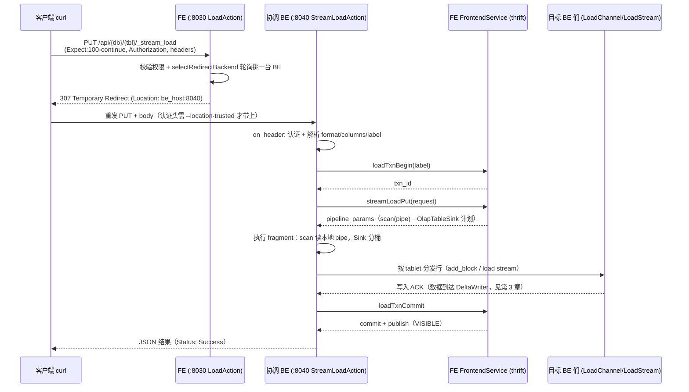

# 第 2 章：Stream Load 全路径 —— 从 HTTP 请求到数据分发

上一章把导入链路的地基打好了：批级事务、Label 幂等、`PREPARE → COMMITTED → VISIBLE` 的状态机。那一章的视角在 FE，讲的是"一批数据在事务上如何被管理"。这一章切换到数据流的视角，跟着一条真实的 `curl` 命令走完 Stream Load 的前半程——从 HTTP 请求打到 BE，到 BE 向 FE 开事务、要来一份导入计划，再到这份计划把一条 HTTP 字节流切分、分发到几十上百个 tablet 副本所在的 BE 上。这条链路的终点是 `DeltaWriter`——数据在那里开始攒 memtable、刷 rowset，那是第 3 章的主题；本章负责把数据"送到 `DeltaWriter` 门口"。

为什么 Stream Load 值得单独拆一章？因为它是 Doris 五种导入方式里链路最短、也最能暴露"接入设计"本质的一种：没有 Broker、没有 Kafka 消费、没有 SQL 优化器，就是一条裸的 HTTP 流直灌进来。把这条最短路径讲透，Broker Load / Routine Load 无非是在"数据从哪来"这一段换了源头，后半程的计划与分发是共用的。所以本章挖的每一个点——重定向、认证透传、导入计划的形状、Sink 的分桶分发、`max_filter_ratio` 的容错——在后面几种导入里都会复现。

本章的行号引用基于写作时核实所用的 HEAD（`fa3fc6d8a4`，源码树与系列基线 `7bc98f696f` 一致）。代码演进会让行号漂移，但对象名与链路结构不变；写作时每一处 `路径:行号` 都在当前代码里核实过。承接上一章的提醒：BE 导入逻辑集中在 `be/src/load/` 下，HTTP 入口在 `be/src/service/http/action/`，本章引用以此为准。

## 2.1 问题：客户端一条 HTTP 流怎么变成分布在多台 BE 上的写入

**遇到了什么问题？** 客户端手里只有一条顺序的字节流——一个 CSV 文件、或者程序内存里一段数据，通过一次 HTTP PUT 推出去。但这批数据的归宿是一张被切成多 partition、多 tablet、每 tablet 又多副本、副本散落在不同 BE 上的表。于是有两个必须回答的设计问题：**第一，这条流该由谁来接？** 是让 FE 统一收下再往后发，还是让 BE 直接收？**第二，一条顺序流怎么变成"分散在几十上百个 tablet 副本上的并行写入"？** 谁负责把每一行算出它该去哪个 tablet、再把去往同一个 BE 的行攒成一批发过去？

**有哪些候选、各有什么优劣？**

- **候选一：FE 当接入代理，收数据再转发。** 客户端把流打到 FE，FE 解析、按分桶规则切分、再分发给各 BE。心智上最直观——FE 本来就是元数据中枢，路由信息都在它手里。但代价是致命的：FE 是整个集群的**元数据大脑和高可用关键点**，让 GB 级的导入数据字节**穿过 FE**，等于把 FE 的网卡和 CPU 变成全集群导入吞吐的瓶颈；导入一上量，FE 忙于搬运数据，连正常的元数据服务和查询规划都会被拖垮。数据平面绝不该压在控制平面上。
- **候选二：BE 直收，但由客户端自己挑一台 BE。** 客户端直接把流发给某台 BE。这确实把数据平面从 FE 上卸下来了，但把负担推给了客户端：客户端得知道集群里有哪些 BE、哪台还活着、哪台负载低——它得懂集群拓扑。而且没有统一的调度，容易所有客户端都往同一台 BE 上灌，负载严重倾斜。
- **候选三：FE 只做轻量路由 + BE 直收数据 + BE 内部起一个导入计划来分发。** 客户端仍把请求发给 FE，但 FE 只做两件轻活：校验权限、按轮询挑一台 BE，然后用 HTTP 重定向把这条**重数据流直接甩给那台 BE**——FE 自己一个数据字节都不碰。被选中的这台 BE（下称"协调 BE"）收下整条流，向 FE 开一个事务、要来一份**导入计划**，这份计划本质是一个只有"从流里读 → 写到表"两步的迷你查询；计划里的 Sink 算子负责把每一行按分桶规则算出目标 tablet、再把去往同一台 BE 的行攒批发过去。

**Doris 怎么考量和解决的？** Doris 选了候选三，并且把它落在了一套已有的基础设施上——part2 讲过的 **fragment 执行框架和 pipeline 引擎**。这是这个设计最漂亮的地方：导入不需要另造一套数据分发系统，它复用了查询侧已经磨得很成熟的东西。"从流里读"就是一个 scan 算子（数据源是 HTTP 管道而不是磁盘文件），"写到表"就是一个 `OlapTableSink` 算子，两者串成一个只有一个 fragment 的执行计划，交给 pipeline 引擎跑。分桶、分发、多目标批量发送这些脏活，全都封装在 Sink 算子里，跟一条普通 SQL 里的 sink 用的是同一套代码。

这样一来，三个约束就各归其位了：**数据平面完全下沉到 BE**（FE 只做路由，永不搬数据），**客户端无需懂拓扑**（FE 的重定向替它选了 BE），**"一条流变多点写入"由 Sink 算子承担**（复用查询执行框架，不重复造轮子）。代价是引入了一次 HTTP 重定向——这个重定向看似不起眼，却是 Stream Load 最经典的踩坑点（`--location-trusted`），2.2 会专门讲。下面就从这条重定向开始，一段段走完链路。

## 2.2 源码走读：HTTP 接入与事务开启

先建立整条链路的骨架，再逐段挖细节。下面这张时序图是本章的主地图，2.2 和 2.3 都是在给它填内容——建议对照着看：



### 从 FE 的重定向说起：路由发生在哪、怎么发生

客户端 `curl .../_stream_load` 第一站不是 BE，而是 FE 的 HTTP 端口（默认 8030）。接这个请求的是 `LoadAction`（`fe/fe-core/src/main/java/org/apache/doris/httpv2/rest/LoadAction.java:71`），`_stream_load` 路径映射在 `fe/fe-core/src/main/java/org/apache/doris/httpv2/rest/LoadAction.java:102`。它走进 `executeWithoutPassword`（`fe/fe-core/src/main/java/org/apache/doris/httpv2/rest/LoadAction.java:258`），做的事情非常克制：先检查请求带没带 `Expect: 100-continue` 头（`fe/fe-core/src/main/java/org/apache/doris/httpv2/rest/LoadAction.java:265`，没有直接拒），校验库表权限（`checkTblAuth`，`fe/fe-core/src/main/java/org/apache/doris/httpv2/rest/LoadAction.java:286`），然后调 `selectRedirectBackend`（`fe/fe-core/src/main/java/org/apache/doris/httpv2/rest/LoadAction.java:388`）挑一台 BE，最后返回一个重定向响应。**整个过程 FE 没有读取任何一个 body 字节**——这正是 2.1 候选三"FE 只做轻量路由"的落地。

BE 是怎么挑的？存算一体走 `selectLocalRedirectBackend`（`fe/fe-core/src/main/java/org/apache/doris/httpv2/rest/LoadAction.java:414`），用一个开了轮询的 `BeSelectionPolicy`（`setEnableRoundRobin(true).needLoadAvailable()`）在当前计算组的可用 BE 里轮着选一台；轮询游标由 `getLastSelectedBackendIndexAndUpdate`（`fe/fe-core/src/main/java/org/apache/doris/httpv2/rest/LoadAction.java:363`）维护，保证连续多个导入请求被摊到不同 BE 上。存算分离走 `selectCloudRedirectBackend`（`fe/fe-core/src/main/java/org/apache/doris/httpv2/rest/LoadAction.java:445`），改用 `StreamLoadHandler.selectBackend`（`fe/fe-core/src/main/java/org/apache/doris/load/StreamLoadHandler.java:97`）在指定计算组里选——这就是 2.4 要展开的双模式差异之一。

### tricky 点一：307 重定向与认证头透传——`--location-trusted` 的经典失败

这是 Stream Load 上手阶段撞得最多的坑，值得逐字讲清。FE 返回的重定向具体是怎么发的？看 `redirectTo`（`fe/fe-core/src/main/java/org/apache/doris/httpv2/rest/RestBaseController.java:125`）：它构造一个 `RedirectView`，并显式把状态码设成 **`HttpStatus.TEMPORARY_REDIRECT`**，也就是 **HTTP 307**（`fe/fe-core/src/main/java/org/apache/doris/httpv2/rest/RestBaseController.java:128`）。为什么必须是 307 而不是 301/302？因为 301/302 在很多客户端实现里会把重定向后的请求方法改成 GET、并丢掉请求体；而 307 的语义是"换个地址、**方法和 body 原样重发**"。Stream Load 是 PUT + 大 body，必须用 307 才能把数据完整转投到 BE。

问题出在**认证头**上。HTTP 的一条安全规则是：客户端跟随重定向到**另一个 host** 时，默认**不会**把 `Authorization` 头带过去（防止把凭据泄露给非预期的服务器）。curl 严格遵守这条规则——`curl -L`（`--location`）会跟随 307 重定向，但**不会**把 `-u user:passwd` 生成的 `Authorization` 头发给重定向目标 BE。于是 BE 端收到一个**没有认证头**的请求，直接在认证环节失败。

BE 端认证失败发生在哪？请求打到 BE 的 8040 端口，由 `StreamLoadAction`（`be/src/service/http/action/stream_load.h:34`）接手。它的 `on_header`（`be/src/service/http/action/stream_load.cpp:240`）**第一件事**就是调父类 `HttpHandlerWithAuth::on_header`（`be/src/service/http/action/stream_load.cpp:242`）做认证检查，返回非 0 直接中止；即便这一关放过，进 `_on_header` 后还有一次 `parse_basic_auth`（`be/src/service/http/action/stream_load.cpp:292`），拿不到合法 Basic 认证就返回 `Status::NotAuthorized("no valid Basic authorization")`。所以**认证头一丢，BE 立刻回 401 语义的失败**。

**错写/误配会怎样**：用 `curl -L -u root: -T data.csv .../_stream_load`（只加了 `-L` 没加 `--location-trusted`），你会看到请求在 FE 那关过了、被 307 到 BE，然后 BE 报认证失败——现象是"用户名密码明明对，却报没权限"，极具迷惑性。正确写法是用 **`--location-trusted`**：它告诉 curl"我信任重定向目标，凭据可以带过去"，于是认证头会一并转发给 BE。这就是为什么 Doris 官方所有 Stream Load 示例都用 `curl --location-trusted -u user:passwd ...`——**不是可选项，是重定向架构的必然要求**。2.5 的实验会故意去掉这个参数踩一遍这个坑。

### 认证之后：请求头解析与"格式错误在哪一层报出来"

认证通过后，`_on_header`（`be/src/service/http/action/stream_load.cpp:290`）开始解析这次导入的形态。这里是 Stream Load 把 HTTP 头翻译成内部参数的地方，几类关键头各有归属：

- **format**：`format` 头经 `LoadUtil::parse_format`（`be/src/service/http/action/stream_load.cpp:305`）解析成 `TFileFormatType`；如果解析结果是 `FORMAT_UNKNOWN`，立刻返回 `DATA_FILE_TYPE_ERROR`（`be/src/service/http/action/stream_load.cpp:307`）。注意：**"格式名不认识"在 BE 的 header 阶段就被挡下**，压根不会开事务、不会读数据。
- **body 大小**：从 `Content-Length` 头读 body 字节数，CSV 超过 `streaming_load_max_mb`（默认 102400，即 100GB，`be/src/common/config.cpp:667`）、JSON 超过 `streaming_load_json_max_mb`（默认 100MB，`be/src/common/config.cpp:671`）直接报 `EXCEEDED_LIMIT`（`be/src/service/http/action/stream_load.cpp:332` 起）。这也解释了一个常见困惑：JSON 导入天然被限制在很小的体量，因为整份 JSON 往往要一次性读进内存解析；要导大 JSON 得开 `read_json_by_line`。
- **label**：`label` 头在更早的 `on_header`（`be/src/service/http/action/stream_load.cpp:260`）就读了；用户没给的话，非 group commit 场景会自动生成一个 UUID（`be/src/service/http/action/stream_load.cpp:264`）——所以"不指定 Label 也能导"，只是失去了上一章讲的 Label 幂等保护。

这里要区分清楚**两类错误各自在哪层报出**，这是排查时定位问题的关键：

1. **"这批请求本身不合法"**——格式名不认识、body 超限、认证缺失、`Content-Length` 与 `Transfer-Encoding` 冲突（`be/src/service/http/action/stream_load.cpp:357` 起）等，都在 **BE 的 header 解析阶段（`_on_header`）同步报出**，此时事务还没开、数据还没读。现象是 `curl` 很快返回、返回体里 `Status` 不是 `Success` 而是具体的参数错误。
2. **"格式合法但内容有问题"**——列数对不上、类型转换失败、`columns` 映射写错导致某列解析不出来等，**发生在数据真正被读取、被 scan 算子逐行解析的时候**，也就是 fragment 执行阶段（2.3）。这类错误不会让整个请求秒失败，而是被计入"过滤行"，最终由 `max_filter_ratio` 裁决整批成败（2.3 的 tricky 点二）。

**错写/误配会怎样**：把 `column_separator` 写错（比如数据是逗号分隔却没设 `-H "column_separator:,"`，默认按 `\t` 切），不会在 header 阶段报错——因为分隔符本身是合法的；错误要等到 scan 逐行按错误的分隔符切、切出来的列数或类型对不上时才浮现，表现为大量过滤行、最终触发 `too many filtered rows`。如果误以为"分隔符错了应该秒报"，就会在 header 逻辑里白找半天。**记住这条分界线：形态错误在 header 层同步报，内容错误在执行层按行统计报。**

### 开事务 + 要计划：BE 向 FE 的两次 thrift 调用

header 解析完，`_on_header` 干两件承上启下的事。第一件是**开事务**：非 group commit 场景调 `StreamLoadExecutor::begin_txn`（`be/src/service/http/action/stream_load.cpp:380`）。`begin_txn`（`be/src/load/stream_load/stream_load_executor.cpp:180`）构造 `TLoadTxnBeginRequest`（带上 db、tbl、label、`request_id`），通过 thrift 调 FE 的 `loadTxnBegin`（`be/src/load/stream_load/stream_load_executor.cpp:211`）。这一步落到的正是上一章的 `GlobalTransactionMgr.beginTransaction`——**Stream Load 的事务旅程从这里正式在状态机上起步，进入 `PREPARE`**。Label 幂等的三种时机（上一章 tricky 点二）也是在这一次 RPC 里裁决的。

第二件是**要一份导入计划**：调 `_process_put`（`be/src/service/http/action/stream_load.cpp:388` → 实现在 `:447`）。`_process_put` 先根据格式决定用不用流式（`use_streaming`，`be/src/service/http/action/stream_load.cpp:450`）——CSV/JSON 这类可边读边解析的格式走流式，会创建一个 `StreamLoadPipe`（`be/src/service/http/action/stream_load.cpp:465`/`:469`）作为 body 的落点，并把它以本次 `load_id` 为键注册进 `new_load_stream_mgr`（`be/src/service/http/action/stream_load.cpp:476`）——记住这个"以 load_id 注册 pipe"的动作，2.3 讲 scan 读流时会回来取它。然后把所有导入参数（`columns`、`where`、`column_separator`、`partitions`、`strict_mode`、`jsonpaths` 等 HTTP 头）逐一填进 `TStreamLoadPutRequest`，最后通过 `ThriftRpcHelper` 调 FE 的 `streamLoadPut`（`be/src/service/http/action/stream_load.cpp:805`-`808`，thrift 定义在 `gensrc/thrift/FrontendService.thrift:1984`）。FE 返回的 `put_result.pipeline_params` 里，装着一份**完整的、可执行的 pipeline fragment 计划**——这就是下一节的主角。

## 2.3 源码走读：导入计划与 Sink 分发

### 导入计划的形状：一个 scan(pipe) → OlapTableSink 的迷你 fragment

`streamLoadPut` 在 FE 侧由 `StreamLoadHandler`（`fe/fe-core/src/main/java/org/apache/doris/load/StreamLoadHandler.java:66`）处理，核心是 `generatePlan`（`fe/fe-core/src/main/java/org/apache/doris/load/StreamLoadHandler.java:257`）。它把 `TStreamLoadPutRequest` 包成一个 `NereidsStreamLoadTask`，交给 `NereidsStreamLoadPlanner`（`fe/fe-core/src/main/java/org/apache/doris/nereids/load/NereidsStreamLoadPlanner.java`）的 `plan`（`fe/fe-core/src/main/java/org/apache/doris/nereids/load/NereidsStreamLoadPlanner.java:106`）生成执行计划。这份计划的结构简单到一句话就能说清——源码里的注释说得比任何转述都清楚（`fe/fe-core/src/main/java/org/apache/doris/nereids/load/NereidsStreamLoadPlanner.java:267`-`268`）：**"for stream load, we only need one fragment, ScanNode -> DataSink"**。

具体是：一个 `FileLoadScanNode`（`fe/fe-core/src/main/java/org/apache/doris/nereids/load/NereidsStreamLoadPlanner.java:261`）当 scan 源，一个 `OlapTableSink`（`fe/fe-core/src/main/java/org/apache/doris/planner/OlapTableSink.java:109`）当 sink，`fragment.setSink(...)`（`fe/fe-core/src/main/java/org/apache/doris/nereids/load/NereidsStreamLoadPlanner.java:270`）把两者串成**只有一个 fragment 的 pipeline**。这印证了 2.1 的核心设计：导入没有另起炉灶，它就是一条退化的查询——只不过数据源是 HTTP 流、结果不是回给客户端而是写进表。

这份计划回到协调 BE 后，`_process_put` 把它存进 `ctx->put_result.pipeline_params`（`be/src/service/http/action/stream_load.cpp:812` 附近），然后走 `StreamLoadExecutor::execute_plan_fragment`（`be/src/service/http/action/stream_load.cpp:852`）。`execute_plan_fragment`（`be/src/load/stream_load/stream_load_executor.cpp:76`）最终把这份 `pipeline_params` 交给 `fragment_mgr()->exec_plan_fragment`（`be/src/load/stream_load/stream_load_executor.cpp:166`）——**至此，导入这条数据流正式进入了 part2 讲过的那套 pipeline 执行框架**，跟一条 SELECT 用的是同一个 `FragmentMgr`、同一套算子调度。

那 scan 算子从哪读数据？答案就是刚才注册的那个 pipe。BE 侧的 `FileScanner`（`be/src/exec/scan/file_scanner.h:60`）在遇到 `FILE_STREAM` 类型时（`be/src/exec/scan/file_scanner.cpp:2091`），通过 `FileFactory`（`be/src/io/file_factory.cpp:288`）用 `new_load_stream_mgr()->get(load_id)` 把协调 BE 上、以本次 `load_id` 注册的那个 `StreamLoadPipe`（`be/src/io/fs/stream_load_pipe.h:43`）取回来当数据源。这条链就闭合了：**HTTP body 通过 `on_chunk_data`（`be/src/service/http/action/stream_load.cpp:391`）源源不断地 append 进 pipe 的一端，scan 算子从 pipe 的另一端读出来解析成 Block**——同一台 BE 内，一进一出，边收边算。

### Sink 分发：从一个 Block 到"每台 BE 一批"

数据被 scan 成 Block 后进 `OlapTableSink`，接下来是本章的分发核心。BE 侧 `OlapTableSink` 有两条实现路径，选哪条由 fragment 计划里的 `enable_memtable_on_sink_node` 开关决定——但要注意，**这个开关对 Stream Load 的取值链路，和常被误当作依据的会话变量不是一回事**。FE 生成计划时（`fe/fe-core/src/main/java/org/apache/doris/nereids/load/NereidsStreamLoadPlanner.java:324`-`326`）的赋值是：`destTable.getTableProperty().getUseSchemaLightChange() ? taskInfo.isMemtableOnSinkNode() : false`——只有目标表开启了 light schema change 才可能走 memtable-on-sink，否则**直接钉死为 `false`**。而 `taskInfo.isMemtableOnSinkNode()`（`NereidsStreamLoadTask`）来自 HTTP 头 `memtable_on_sink_node`；用户没传这个头时，回落到 FE 配置 `stream_load_default_memtable_on_sink_node`（`fe/fe-common/src/main/java/org/apache/doris/common/Config.java:628`，**默认 `false`**，见 `fe/fe-core/src/main/java/org/apache/doris/nereids/load/NereidsStreamLoadTask.java:514`-`518`）。http_stream 入口甚至会把会话变量本身也覆写成同一个 `false` 默认（`fe/fe-core/src/main/java/org/apache/doris/service/FrontendServiceImpl.java:3022`-`3025`）。**结论：Stream Load 默认走 v1 路径，且额外受 `useSchemaLightChange` 门控**——那个 `SessionVariable` 里默认 `true` 的 `enableMemtableOnSinkNode`（`fe/fe-core/src/main/java/org/apache/doris/qe/SessionVariable.java:2656`）管的是 INSERT / Broker / Routine 等其它导入，不是这里的 Stream Load。

- **默认路径（v1）**：算子是 `OlapTableSinkOperatorX`（`be/src/exec/operator/olap_table_sink_operator.h:37`），写出器是 `VTabletWriter`（`be/src/exec/sink/writer/vtablet_writer.h:636`），用 brpc **一元 RPC**（`PTabletWriterAddBlockRequest`）分批发送。memtable 在**接收侧**（目标 BE）攒。
- **可选路径（memtable 在 sink 端，v2）**：需显式开 `memtable_on_sink_node` 且表支持 light schema change 才启用。算子是 `OlapTableSinkV2OperatorX`（`be/src/exec/operator/olap_table_sink_v2_operator.h:38`），底层写出器是 `VTabletWriterV2`（`be/src/exec/sink/writer/vtablet_writer_v2.h:97`），它用 brpc **stream** 把数据推给目标 BE，通道抽象是 `LoadStreamStub`（`be/src/exec/sink/load_stream_stub.h:118`），memtable 提前到**发送侧**（协调 BE）攒。

两条路径的**分桶分发逻辑是共享的**，也是理解"一条流变多点写入"的关键。不管哪条路径，行到达 sink 后都要先算"这一行该去哪个 tablet"，这件事由 `VRowDistribution`（`be/src/exec/sink/vrow_distribution.h:69`）的 `generate_rows_distribution`（`be/src/exec/sink/vrow_distribution.h:147`）完成：它对每一行先按分区列算出目标 partition，再按分桶列（distribution key）的哈希对分桶数取模算出 bucket，partition + bucket 唯一确定一个 tablet（借助 `OlapTabletFinder`）。**一个 Block 进来，出来的是"行 → 目标 tablet"的映射**。

有了这个映射，v1 路径的组织方式很能说明问题（v2 结构类似，只是传输换成 stream）。`VTabletWriter` 内部按**物化索引（base 表 + 各 rollup/物化视图）**建 `IndexChannel`（`be/src/exec/sink/writer/vtablet_writer.h:451`）——一个索引一个；每个 `IndexChannel` 下再按**目标 BE 节点**建 `VNodeChannel`（`be/src/exec/sink/writer/vtablet_writer.h:228`）——一个目标 BE 一个。行分好 tablet 后，被塞进对应 `VNodeChannel` 的缓冲区，`VNodeChannel::add_block`（`be/src/exec/sink/writer/vtablet_writer.h:261`）攒够一批就通过 brpc 异步发给那台 BE。**这就是分发的全貌：`IndexChannel` 管"写几份索引"，`VNodeChannel` 管"发给哪台 BE"，两层嵌套把一个 Block 摊成"每个索引 × 每台 BE"若干批并行发出去。**

数据到达目标 BE 后，接收侧是 `be/src/load/channel/` 下的一组类（v1 路径）：`LoadChannelMgr`（`be/src/load/channel/load_channel_mgr.h:50`）是这台 BE 上所有导入的总入口，它的 `open`（`be/src/load/channel/load_channel_mgr.h:57`）/`add_batch`（`be/src/load/channel/load_channel_mgr.h:59`）按 load_id 找到或新建一个 `LoadChannel`（`be/src/load/channel/load_channel.h:45`，一次导入一个）；`LoadChannel` 下挂 `TabletsChannel`（`be/src/load/channel/tablets_channel.h:213`，基类 `BaseTabletsChannel` 在 `:85`），它的 `add_batch`（`be/src/load/channel/tablets_channel.h:99`）经 `_write_block_data`（`be/src/load/channel/tablets_channel.h:124`）把每个 tablet 的数据交给对应的 `DeltaWriter`（`be/src/load/channel/tablets_channel.h:210`，基类 `BaseDeltaWriter` 在 `:78`）。**`DeltaWriter` 就是本章的终点、第 3 章的起点**——数据在它这里开始进 memtable。v2 路径对称：目标 BE 上接收方是 `LoadStream`（`be/src/load/channel/load_stream.h:124`），最终同样落到 `DeltaWriterV2`。

### tricky 点二：一行到不了"错的 BE"，但整批可能被少数脏数据拖垮——`max_filter_ratio`

先破一个常见误解：**Stream Load 里不存在"一行数据发错了 BE"这种事**。每一行的目标 tablet 是 sink 端按分桶规则确定性算出来的，`VNodeChannel` 只把行发给"这个 tablet 的副本所在 BE"。真正会出问题的不是"发错地方"，而是**数据质量**——某些行解析失败、类型转换失败、或违反约束，这些"脏行"会不会拖垮整批？

这正是 `max_filter_ratio` 的职责。裁决逻辑在 `execute_plan_fragment` 的执行回调里（`be/src/load/stream_load/stream_load_executor.cpp:102`-`112`）：fragment 跑完后，用 `number_filtered_rows / num_selected_rows`（过滤行数 / 参与导入的行数）算出实际过滤比例，**一旦超过用户设定的 `max_filter_ratio`，即使 fragment 本身执行成功，也会被改判为 `DataQualityError`**，错误信息就是那句著名的 `too many filtered rows, url: {}`（`be/src/load/stream_load/stream_load_executor.cpp:108`）。`max_filter_ratio` 默认是 0——**默认零容忍，一行脏数据就整批失败**。

那"哪些行错了、错在哪"怎么看？靠 error url。上面那句错误里的 `{}` 就是 `ctx->error_url`，它在同一处（`be/src/load/stream_load/stream_load_executor.cpp:101`）由 `to_load_error_http_path(state->get_error_log_file_path())` 生成。`to_load_error_http_path`（`be/src/runtime/fragment_mgr.cpp:115`）拼出的是一个指向**协调 BE 自己**的 HTTP 地址：`http://<be_host>:<webserver_port>/api/_load_error_log?file=<错误日志文件名>`。执行阶段每遇到一条被过滤的行，就把"原始行内容 + 被过滤的原因"追加进这个错误日志文件（文件路径由 `RuntimeState::get_error_log_file_path`，`be/src/runtime/runtime_state.cpp:397` 管理）。所以 error url 不是给个笼统结论，而是**逐行的脏数据审计**——`curl` 那个 url 就能看到到底哪几行、因为什么被丢。

**错写/误配会怎样**：

- **不理解"零容忍是默认值"**：不设 `max_filter_ratio` 时它是 0，只要有一行因编码、多余空格、空值进非空列等原因解析失败，整批就以 `too many filtered rows` 失败。很多人第一次导入一份"大体正确但有个别脏行"的数据时会困惑于"为什么全批不进"——因为默认就是一票否决。要容忍一定比例的脏数据，得显式 `-H "max_filter_ratio:0.1"`。
- **拿到 error url 却不看**：报了 `too many filtered rows` 却只盯着比例调参数，不去 `curl` error url 看具体原因，往往在错误的方向上打转（比如以为是比例问题，其实是分隔符设错导致**每一行**都解析失败——这种情况调 `max_filter_ratio` 到 1 也救不了，因为过滤率是 100%）。**正确姿势是先读 error url 定位根因，再决定是修数据、修参数、还是调容忍比例。**
- **误解 error url 的宿主**：error url 指向的是**协调 BE**（那台被 FE 重定向选中、真正执行 fragment 的 BE），不是 FE、也不一定是数据最终落盘的目标 BE。排查时要去那台 BE 的 webserver 端口取，别跑到 FE 上找。

fragment 跑完、`max_filter_ratio` 也过关后，`_on_finish`（`be/src/service/http/action/stream_load.cpp:152`）调 `commit_txn`（`be/src/load/stream_load/stream_load_executor.cpp:337` → FE 的 `loadTxnCommit`，`:351`）提交事务；同步导入会等到 `VISIBLE` 再把 JSON 结果回给客户端。如果任一步失败，`_send_reply`（`be/src/service/http/action/stream_load.cpp:175`）会触发 `rollback_txn`（`be/src/load/stream_load/stream_load_executor.cpp:374`）把事务回滚到 `ABORTED`。至此 Stream Load 的前半程闭环。

## 2.4 双模式对比

Stream Load 的**接入方式与计划结构在两种模式下完全一致**：都是 FE 轻量重定向、协调 BE 收流、`scan(pipe) → OlapTableSink` 的迷你 fragment。差异集中在两处，且都不改变主链路的形状。

**其一，分发目标 BE 的选择跟随计算组。** 存算一体下，行被分到某 tablet 后，`VNodeChannel` 发往的是这个 tablet 的**物理副本所在 BE**——BE 既算又存，数据就近落到持有该 tablet 的节点。存算分离下 tablet 没有固定的物理副本绑定，计算节点从共享存储读写，分发目标 BE 由**当前计算组**决定：FE 重定向阶段就用 `StreamLoadHandler.selectBackend`（`fe/fe-core/src/main/java/org/apache/doris/load/StreamLoadHandler.java:97`）在指定计算组里挑协调 BE（对比存算一体的 `selectLocalRedirectBackend` 轮询），后续 sink 分发也落在这个计算组的节点上。这跟 part2 第 5 章 5.4 节讲的 `CloudReplica` 映射是同一套逻辑——**tablet 到"哪台 BE 服务它"的映射，在分离模式下是计算组维度的动态映射，而非固定副本**。导入侧只是这个映射的又一个使用者。

**其二，事务提交的落点不同——云侧用 `CloudStreamLoadExecutor` 改写了 commit。** 协调 BE 用的 executor 在分离模式下是 `CloudStreamLoadExecutor`（`be/src/cloud/cloud_stream_load_executor.h:23`），它 `final : public StreamLoadExecutor`，`override` 了四个方法：`pre_commit_txn`（`be/src/cloud/cloud_stream_load_executor.h:31`）、`operate_txn_2pc`（`:33`）、`commit_txn`（`:35`）、`rollback_txn`（`:37`）——**接入和执行完全复用父类，只有事务收尾这几步被改写**。

改写的核心在 `commit_txn`（`be/src/cloud/cloud_stream_load_executor.cpp:105`）。它有一个分叉：对**主键（MoW）表**、或 `enable_stream_load_commit_txn_on_be` 关闭（默认关，`be/src/common/config.cpp:698`）、或 Routine Load，仍然**转发给 FE**走父类 `StreamLoadExecutor::commit_txn`（`be/src/cloud/cloud_stream_load_executor.cpp:118`，MoW 场景还带 `DELETE_BITMAP_LOCK_ERROR` 重试）；其余情况则**直接从 BE 提交给 MetaService**——`_exec_env->storage_engine().to_cloud().meta_mgr().commit_txn(*ctx, false)`（`be/src/cloud/cloud_stream_load_executor.cpp:133`）。`pre_commit_txn`（`be/src/cloud/cloud_stream_load_executor.cpp:47`）同理走 `meta_mgr().precommit_txn`。这印证了上一章 1.4 的结论：**存算分离下事务的权威状态在 MetaService/FDB，提交是一次到 MetaService 的 RPC，而非落到 FE 的 BDBJE**。存算一体则始终由 FE 的 `GlobalTransactionMgr` 持有并推进事务。

一句话概括：**两种模式的 Stream Load 只在"数据发给哪个计算节点"和"事务向谁提交"这两处分野，接入与计划零差异**——这正是导入链路能在两种架构上共用绝大部分代码的原因。

## 2.5 动手实验

前置环境（编译、单机拉起、日志级别）一律沿用 part1 第 5 章，不再重复。本实验**一个核心 + 两个踩坑**，全部对着 2.2 的时序图做。

### 实验一（核心）：发一次 Stream Load，把日志对上时序图

**目标**：亲手发一次导入，在 FE/BE 日志里找到重定向、开事务、要计划、提交这几个环节，和 2.2 的时序图逐段对应。

1. 准备一张表和一个 CSV，发起一次标准 Stream Load（注意 `--location-trusted`）：
   ```bash
   curl --location-trusted -u root: \
     -H "label:exp_sl_001" \
     -H "column_separator:," \
     -H "Expect:100-continue" \
     -T ./data.csv \
     http://127.0.0.1:8030/api/demo_db/demo_tbl/_stream_load
   ```
   返回 JSON 里 `Status: Success`、`NumberLoadedRows` 与行数一致即成功。
2. 在 **FE 日志**（`fe/log/fe.log`）里搜 `redirect load action to destination`（对应 `LoadAction` 打的重定向日志），能看到 FE 把请求重定向到了哪台 BE 的地址——这就是时序图里 FE→client 的 307。
3. 在**那台被选中的 BE** 的日志（`be/log/be.INFO`）里，按顺序能找到：`new income streaming load request`（`on_header`，收到重定向来的请求）→ 关于 `txn_id` 的日志（`begin_txn` 开事务）→ `begin to execute stream load`（`execute_plan_fragment`，计划开始执行）→ `finished to execute stream load. label=... txn_id=... error_url=...`（`_send_reply` 收尾）。把这四条日志和时序图的四段(收流 / 开事务 / 执行计划 / 提交)对齐。

**这个实验验证的核心点**：一次 Stream Load 不是"HTTP 打到哪台机器就在哪写"，而是**FE 重定向选 BE → BE 开事务 → BE 要计划 → BE 执行 scan-sink fragment → 提交**这一串明确的环节，每一环在日志里都有据可查。

### 实验二（踩坑一）：去掉 `--location-trusted`，观察认证在重定向后丢失

**目标**：亲手踩一遍 2.2 tricky 点一，把"用户名密码明明对却报没权限"这个假象和"307 重定向不透传认证头"这个真因对上。

1. 把实验一的命令里的 `--location-trusted` 换成普通的 `-L`，其余不变：
   ```bash
   curl -L -u root: \
     -H "label:exp_sl_002" -H "column_separator:," -H "Expect:100-continue" \
     -T ./data.csv \
     http://127.0.0.1:8030/api/demo_db/demo_tbl/_stream_load
   ```
2. 观察结果：请求在 FE 那关能过（FE 日志里照样有 `redirect ... to destination`），但**最终返回认证失败**（`no valid Basic authorization` 之类）。加 `curl -v` 能看到 curl 收到 307 后向 BE 重发请求时，**没有带 `Authorization` 头**。
3. 换回 `--location-trusted` 再发一次（记得换个 Label），立刻成功。

**要建立的认知**：这个失败不是权限配错，而是 **curl 默认不把凭据跟随重定向到另一个 host**；`--location-trusted` 是显式授权透传。BE 端的两道认证关（`HttpHandlerWithAuth::on_header` 与 `parse_basic_auth`）收到无认证头的请求只能拒。凡是"Stream Load 报没权限、但账号确实有 LOAD 权限"，第一反应就该是检查有没有 `--location-trusted`。

### 实验三（踩坑二）：构造超 `max_filter_ratio` 的脏数据，读 error url

**目标**：踩一遍 2.3 tricky 点二，看脏数据如何导致整批失败，并学会用 error url 定位到具体是哪几行。

1. 在 CSV 里故意混入几行脏数据（比如给 INT 列填非数字、或少一列），保持 `max_filter_ratio` 默认（不设，即 0）：
   ```bash
   curl --location-trusted -u root: \
     -H "label:exp_sl_003" -H "column_separator:," -H "Expect:100-continue" \
     -T ./dirty.csv \
     http://127.0.0.1:8030/api/demo_db/demo_tbl/_stream_load
   ```
2. 返回 JSON 里 `Status: Fail`、`Message` 含 `too many filtered rows`，并且有一个 `ErrorURL` 字段。**直接 `curl` 那个 URL**：
   ```bash
   curl "http://<be_host>:8040/api/_load_error_log?file=__shard_xx/error_log_xxx"
   ```
   （URL 就是返回体里的 `ErrorURL` 原值。）你会看到逐行的原始内容和被过滤原因——比如 `Reason: column count mismatch` 或类型转换失败。
3. 现在把 `max_filter_ratio` 放宽再发一次（换 Label）：`-H "max_filter_ratio:0.5"`。如果脏行比例低于 50%，这次会 `Success`，且 `NumberFilteredRows` 记录了被丢弃的行数——脏行被跳过、干净行入库。

**要建立的认知**：`max_filter_ratio` 默认 0 = 零容忍；报 `too many filtered rows` 时**先读 error url 看根因**再决定对策——是修数据、修 `column_separator`/`columns` 映射，还是调容忍比例。error url 指向的是**协调 BE**（不是 FE），端口是 BE 的 webserver 端口。

## 2.6 排查清单

按"症状 → 定位路径"组织，覆盖 Stream Load 接入与分发阶段最高频的三类问题（事务层问题见上一章 1.6，`DeltaWriter` 之后的写入问题见第 3 章）。

### 症状 A：认证失败 / 报没权限，但账号确实有 LOAD 权限

- **首查 `--location-trusted`**：这是最高频原因。Stream Load 请求先到 FE（8030）、被 307 重定向到 BE（8040），curl 默认不把 `Authorization` 头跟随到另一个 host。命令里用 `-L` 而非 `--location-trusted`，或用其他 HTTP 库没处理好重定向透传，都会让 BE 端 `parse_basic_auth`（`be/src/service/http/action/stream_load.cpp:292`）拿不到认证而失败。
- **确认重定向确实发生了**：FE 日志搜 `redirect load action to destination`（`LoadAction`）。如果连重定向都没发生（比如直接把请求打到了 BE 端口但姿势不对），排查方向不同。
- **再查库表权限本身**：FE 侧 `checkTblAuth`（`fe/fe-core/src/main/java/org/apache/doris/httpv2/rest/LoadAction.java:286`）会拦真正无权限的请求——这类失败在 FE 阶段就报，不会走到 BE。

### 症状 B：`too many filtered rows` / 数据质量失败

- **第一步永远是读 error url**：返回体的 `ErrorURL` 字段直接 `curl`，看逐行的过滤原因（error url 由 `to_load_error_http_path` 生成，`be/src/runtime/fragment_mgr.cpp:115`，指向协调 BE 的 webserver 端口）。
- **区分"个别脏行" vs "全行解析错"**：如果 error url 里几乎每行都报错（过滤率接近 100%），多半是**形态设错**——`column_separator`/`line_delimiter` 不对、`columns` 映射列数不匹配、format 与数据实际格式不符。这种情况调 `max_filter_ratio` 无解，得修参数（参见 2.2"格式错误在哪一层报出来"）。只有真的是少量脏数据时，放宽 `max_filter_ratio`（`be/src/load/stream_load/stream_load_executor.cpp:103` 的裁决）才有意义。
- **记住默认零容忍**：不设 `max_filter_ratio` 即为 0，一行脏数据整批失败。

### 症状 C：卡在数据传输 vs 卡在开事务/要计划

- **先判断卡在链路哪一段**：看协调 BE 日志。只有 `new income streaming load request`、迟迟没有 `begin to execute stream load`，多半卡在**开事务或要计划**这两次到 FE 的 thrift（`begin_txn`/`streamLoadPut`）——查 FE 是否在忙、事务是否触达配额（上一章症状 C 的 `current running txns` 限制）。
- **已经 `begin to execute` 但长时间不返回**：卡在**数据传输/写入**阶段，多半是下游写入反压——`VNodeChannel` 发出的数据在目标 BE 侧攒不动，典型根因是 memtable limiter / flush 堆积把写入拖住（详见第 3 章）。这是"卡住、迟迟不返回"一类。
- **反而是秒级快速报错**：则多半是目标 tablet 版本过多，写入 prepare 阶段直接触发 `-235 TOO_MANY_VERSION`（[part1 第 3 章](../part1-architecture/03-data-model.md) 排查清单已证：`be/src/common/status.h`，与 `max_tablet_version_num` 相关，`be/src/common/config.cpp`）——这不是"卡住"而是**快速失败**，根因和缓解见第 6 章 compaction。
- **超大 body 秒失败**：报 `body size ... exceed BE's conf` 是 header 阶段的体量检查（`be/src/service/http/action/stream_load.cpp:332`/`:340`），CSV 调 `streaming_load_max_mb`、JSON 调 `streaming_load_json_max_mb`（或开 `read_json_by_line` 分行读）。

---

本章跟着一条 HTTP 流走完了 Stream Load 的前半程：先论证了"FE 轻量重定向 + BE 直收 + 内部起导入计划"这个接入设计为何优于 FE 代理或客户端选 BE；再逐段走读了从 FE `LoadAction` 的 307 重定向（`--location-trusted` 之坑）、BE `StreamLoadAction` 的认证与头解析、到向 FE `loadTxnBegin` 开事务和 `streamLoadPut` 要计划；接着拆解了这份 `scan(pipe) → OlapTableSink` 迷你 fragment 如何复用 part2 的 pipeline 框架，Sink 又如何经 `VRowDistribution` 分桶、`IndexChannel`/`VNodeChannel`（或 v2 的 `LoadStreamStub`）分发到目标 BE 的 `LoadChannel`/`TabletsChannel`（或 `LoadStream`），并把 `max_filter_ratio` 与 error url 这条数据质量防线讲透；最后对比了双模式仅在"发给哪个计算组"和"事务向谁提交（`CloudStreamLoadExecutor` 改写 commit 走 MetaService）"两处分野。数据现在已经送到了 `DeltaWriter` 的门口——下一章从 `DeltaWriter` 接手，看这批数据怎么在 memtable 里攒、怎么刷成 rowset。
