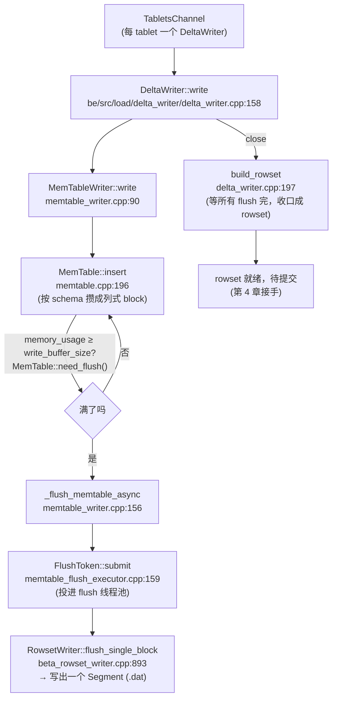

# 第 3 章：Tablet 写入细节 —— MemTable、Flush 与 Delete Bitmap

上一章把一批数据从 HTTP 流一路送到了目标 BE 的 `DeltaWriter` 门口：`OlapTableSink` 按分桶把行分发到各 tablet 副本所在的 BE，`LoadChannel` / `TabletsChannel` 为每个 tablet 准备好了一个 `DeltaWriter`。本章从 `DeltaWriter` 接手，回答一个具体的问题：这批数据到了单个 tablet 上，怎么在内存里攒、怎么变成磁盘上一个个列存 Segment 文件、主键表又是在什么时候算出"哪些旧行被这批新数据顶替了"。链路的终点是"一个 rowset 就绪、等待提交"——提交与 publish 是第 4 章的territory，本章在 rowset 落地、delete bitmap 预算完成的那一刻收手。

为什么这一段值得单独拆一章？因为它是导入链路上"慢"最容易发生、也最容易误判的一段。用户抱怨"导入变慢了"，根因八成落在本章讲的三个地方之一：memtable flush 跟不上、全局内存水位反压、主键表 delete bitmap 写放大。把 memtable→flush→segment 这条主干和 delete bitmap 这条支线讲清楚，后面排查才有坐标系。

本章的行号引用基于写作时核实所用的 HEAD（`2238c0b701`，源码树与系列基线 `7bc98f696f` 一致）。代码演进会让行号漂移，但对象名与链路结构不变；写作时每一处 `路径:行号` 都在当前代码里核实过。承接前两章：BE 导入逻辑集中在 `be/src/load/` 下，本章涉及的三块分别是 `be/src/load/delta_writer/`、`be/src/load/memtable/` 和 `be/src/storage/delete/`。

## 3.1 问题：高频小批写怎么变成列存大文件

**遇到了什么问题？** 列式存储的性能红利来自"大块、有序、编码压缩过的列文件"——扫描时只读需要的列、按块跳过、解压一次算一批。但导入的现实是反过来的：数据往往是**高频、小批量**地来，一次 Stream Load 可能只有几万行，Routine Load 每几秒就 flush 一小撮 Kafka 消息。如果每来一小批就直接生成一个列文件，那存储层会被无数个几 KB、几百 KB 的小文件淹没。列存最怕小文件：元数据开销、随机 IO、以及后续查询要合并成百上千个碎片。于是核心矛盾是：**上游是高频小批的写入，下游要的是低频大块的列文件，这中间的落差谁来填？**

**有哪些候选、各有什么优劣？**

- **候选一：来一批写一个文件。** 实现最简单，写入零延迟。但直接踩中列存的死穴——小文件爆炸。每个文件都得单独记元数据、单独被查询打开，version 数会疯涨（part2 已见识过 `-235 TOO_MANY_VERSION` 的威力）。这条路等于把攒批的责任甩给了 compaction，让后台永远追不上。
- **候选二：直接改写已有的列文件（in-place update）。** 让新数据就地追加或修改到现存的列文件里，避免产生新文件。这在行存里可行，但在列存里代价不可接受：列文件是编码压缩、块对齐的整体，改一行意味着解压整个块、重排、重新编码、重写——写放大是灾难性的，而且破坏了列文件"只读、不可变"这个让并发查询无锁的关键前提。
- **候选三：WAL + 内存表攒批（LSM 经典）。** 像 RocksDB 那样：写入先落一条 WAL 保证持久性，同时进内存的 MemTable 攒着；MemTable 攒满了再一次性 flush 成一个不可变的有序文件（SSTable）。攒批解决了小文件问题，WAL 解决了"内存数据在 flush 前宕机会丢"的持久性问题。代价是每条写入都要过一次 WAL 的顺序 IO。

**Doris 怎么考量和解决的？** Doris 选了候选三的**攒批思想**，但对持久性做了不同于 RocksDB 的取舍。写入先进内存的 `MemTable`（按 schema 攒成列式的 block），攒到 `write_buffer_size`（默认 200MB，`be/src/common/config.cpp:750`）触发一次异步 flush，把 memtable 刷成一个不可变的列存 Segment，若干 Segment 归入一个 rowset。这样"高频小批"在内存里被合并成"低频大块"，落盘的每个 Segment 都是编码压缩好的完整列文件——碎片问题从源头被摊平。

**但 WAL 这件事必须说实话。** 常规导入路径（Stream Load / Broker Load 等）**没有 per-row WAL**：memtable 里的数据在 flush 成 rowset、事务 publish 之前，都不是持久的。如果 BE 在 flush 前宕机，这批未提交数据就丢了——但这**没关系**，因为 Doris 的持久性是建立在**批级事务**上的（第 1 章讲过）：一批导入要么整体 commit+publish 变可见，要么整体失败。失败了客户端重试整批即可，没有"提交了一半"的中间态需要 WAL 来恢复。换句话说，Doris 把 RocksDB 那种"单条写入即持久"的语义，换成了"整批事务要么成要么重来"的语义——持久性的粒度从"行"上移到了"事务"，WAL 就不再是必需品了。

那 `be/src/load/group_commit/wal/` 里那些 `be/src/load/group_commit/wal/wal_writer.h`、`be/src/load/group_commit/wal/wal_manager.h` 是什么？那是 **Group Commit 专属**的 WAL（配置项前缀 `group_commit_wal_`，如 `group_commit_wal_path`、`group_commit_wal_max_disk_limit`，`be/src/common/config.cpp:1411` 起）。Group Commit 的场景是"海量高频小 INSERT 攒成一批异步提交"，客户端发完就返回、不等 publish——这时候客户端手里已经没有数据可重试了，所以必须用 WAL 兜底，宕机后重放 WAL 把攒着的小批补回来。**这是个针对特定导入模式的局部机制，不是全局的写前日志。** 把"Doris 有 WAL"当成通用结论去理解它的持久性模型，会得出完全错误的图景。

## 3.2 源码走读：DeltaWriter → MemTable → Flush

先建立主干骨架，再挖易错点。整条写入路径的对象接力如下：



**主干（一句话带过的部分）。** `TabletsChannel` 为每个 tablet 建一个 `DeltaWriter`（`class DeltaWriter` 定义在 `be/src/load/delta_writer/delta_writer.h:123`，继承自 `BaseDeltaWriter`）。`DeltaWriter::write`（`be/src/load/delta_writer/delta_writer.cpp:158`）把 block 转交给它持有的 `MemTableWriter`（`class MemTableWriter`，`be/src/load/memtable/memtable_writer.h:55`），`MemTableWriter::write`（`be/src/load/memtable/memtable_writer.cpp:90`）再调 `MemTable::insert`（`be/src/load/memtable/memtable.cpp:196`）把行追加进内存的列式结构。攒满后异步 flush，`DeltaWriter::close` 时经 `build_rowset`（`be/src/load/delta_writer/delta_writer.cpp:197`）等所有 flush 落地、收口成一个 rowset。对象职责很清晰：`DeltaWriter` 是门面、`MemTableWriter` 管 memtable 的生命周期与 flush 调度、`MemTable` 是内存数据本体、`RowsetWriter` 负责把 memtable 写成 Segment。

**MemTable 的内存组织与"聚合模型在内存先聚合"。** 这里有个常见误解要澄清。很多人以为 memtable 会对所有模型都在内存里做去重/预聚合——**并非如此**。`MemTable::need_agg()`（`be/src/load/memtable/memtable.cpp:735`）的逻辑是分模型的：

- **Aggregate 模型（`AGG_KEYS`）**：会在内存里持续预聚合。`need_agg()` 对 `AGG_KEYS` 判断"自上次聚合以来又攒了 `write_buffer_size_for_agg`（默认 100MB，`be/src/common/config.cpp:753`）就再聚合一轮"，`MemTableWriter::write` 里据此调 `shrink_memtable_by_agg()`（`be/src/load/memtable/memtable_writer.cpp:137`）在 flush 前就把相同 key 的行聚合掉，减少落盘量。
- **Unique 模型 MoW（`UNIQUE_KEYS` 且开启 merge-on-write）**：flush 前会做一次按 key 的去重（`_aggregate` 相关逻辑，`be/src/load/memtable/memtable.cpp:762` 一带），保证一个 memtable 内相同主键只留最新一行。
- **Duplicate 模型（`DUP_KEYS`）**：`need_agg()` 直接返回 false（`AGG_KEYS` 之外的分支），memtable 只是纯追加、不做任何合并——因为 Duplicate 语义就是"来多少存多少、不去重"。

**易错点：把"聚合模型的聚合"当成"所有导入都会在内存去重"。** 如果你在 Duplicate 表上期待 memtable 帮你去重，那是不会发生的；反过来，在 Aggregate/Unique 表上，memtable 的这次内存预聚合是隐性的写放大来源之一（尤其 MoW，见 3.3）。搞混模型的 memtable 行为，会让你对"为什么这张表导入 CPU 高"判断错方向。

**flush 的触发：`write_buffer_size` 与异步刷盘。** 每次 `insert` 后，`MemTableWriter::write` 检查 `_mem_table->need_flush()`（`be/src/load/memtable/memtable_writer.cpp:140`）。`need_flush()`（`be/src/load/memtable/memtable.cpp` 的定义）比较 `memory_usage()` 与自适应后的 `write_buffer_size`——达标就调 `_flush_memtable()`。flush 是**异步**的：`_flush_memtable_async`（`be/src/load/memtable/memtable_writer.cpp:156`）把当前 memtable 从 `_mem_table` 摘下、塞进 `_freezed_mem_tables`、再 `_flush_token->submit(memtable)` 投进 flush 线程池，然后立刻 `_reset_mem_table()` 换一个新的空 memtable 继续接收写入。也就是说，写入线程不等 flush 完成——一个 memtable 在后台刷盘，前台已经在往下一个 memtable 攒了。落盘动作最终由 `RowsetWriter` 完成：`BaseBetaRowsetWriter::flush_single_block`（`be/src/storage/rowset/beta_rowset_writer.cpp:893`）经 `_segment_creator` 把一个 block 写成一个 Segment 文件（`be/src/storage/segment/segment_writer.h`）。

**别把 `write_buffer_size` 当成一个死值：它是自适应的。** `need_flush()` 里比较的不是配置里那个 200MB 常量，而是 `_adaptive_write_buffer_size()`（`be/src/load/memtable/memtable.cpp:713`）算出来的动态阈值。逻辑很妙：它反过来看全局 memtable 内存用了多少——内存宽裕时（占 hard limit 的 50% 以下）把单个 memtable 的 flush 阈值放大到 `write_buffer_size × 4`（即 800MB），让 memtable 攒得更大、flush 次数更少、落盘的 Segment 更大；内存吃紧时（超 80%）缩回 `× 1`。这是一条负反馈：内存越紧，memtable 越小、flush 越勤，主动给全局内存减压。`enable_adaptive_write_buffer_size` 默认开（`be/src/common/config.cpp:751`）。**所以"单批导入产生几个 Segment"不是固定的，它随集群当时的内存压力浮动**——这也解释了为什么同样一份数据，忙时导入和闲时导入落盘的 Segment 数量会不一样。理解这条自适应，才不会把"Segment 数量变化"误当成配置漂移或 bug。

**tricky 点一（高频根因）：`MemTableMemoryLimiter` 全局内存水位反压——"导入突然全都变慢"的头号嫌疑。** 单个 memtable 通常攒到几百 MB（见上文自适应阈值）才 flush，但一台 BE 上可能同时有成百上千个 `DeltaWriter`（多张表 × 多 tablet × 多并发导入），每个都在攒 memtable。如果不设全局闸门，这些 memtable 加起来能把整台 BE 的内存吃穿。`MemTableMemoryLimiter`（`class MemTableMemoryLimiter`，`be/src/load/memtable/memtable_memory_limiter.h:36`）就是这道全局闸门。每个 `DeltaWriter` 初始化时会 `register_writer` 把自己的 memtable_writer 注册进去（`be/src/load/delta_writer/delta_writer.cpp:153`），limiter 据此掌握全局 memtable 内存总量。三条水位线由 `init` 算出（`be/src/load/memtable/memtable_memory_limiter.cpp:64`）：

- **hard limit** = 进程内存 × `load_process_max_memory_limit_percent`（默认 50，即进程内存的 50%，`be/src/common/config.cpp:761`）；
- **soft limit** = hard × `load_process_soft_mem_limit_percent`（默认 80，即 hard 的 80% ≈ 进程的 40%，`be/src/common/config.cpp:768`）；
- **safe permit** = hard × `load_process_safe_mem_permit_percent`（默认 5，`be/src/common/config.cpp:772`）。

当全局 memtable 内存越过 soft limit，limiter 会主动挑占用最大的若干 memtable 强制 flush（`_flush_active_memtables`）；越过 hard limit，`handle_memtable_flush`（在 `be/src/load/channel/load_channel_mgr.cpp:168` 与 v2 的 `be/src/exec/sink/writer/vtablet_writer_v2.cpp:596` 被调用）会**阻塞写入线程**直到内存降回安全线（`be/src/load/memtable/memtable_memory_limiter.cpp:181` 的 `while (_hard_limit_reached() && !_load_usage_low())` 循环）。这就是反压：不是某一张表慢，而是**全局 memtable 内存到顶了，所有导入一起被卡住等 flush 腾内存**。

**错配会怎样？** 把 `load_process_max_memory_limit_percent` 调得过大（比如 90%），memtable 会挤占查询和其他子系统的内存，触发进程级 OOM 或 GC 抖动；调得过小，则 memtable 稍微多几个导入就撞水位、频繁反压，表现为"导入莫名其妙集体变慢、但 CPU/IO 都不满"。识别它的日志证据是关键：反压触发时会打 `reached memtable memory hard limit` / `... soft limit`（`be/src/load/memtable/memtable_memory_limiter.cpp:157` 与 `:259`），带上 `load mem` 当前值、`active/queue/flush` 三段内存明细。看到这行日志，就说明慢的根因是全局内存水位，而不是你正在调的那张表本身。

**易错点二：flush 线程池打满时的堆积表现。** flush 线程池由 `MemTableFlushExecutor`（`class MemTableFlushExecutor`，`be/src/load/memtable/memtable_flush_executor.h`）持有，线程数由 `flush_thread_num_per_store`（默认 6，`be/src/common/config.cpp:848`）× store 数、并受 `max_flush_thread_num_per_cpu`（默认 4，`be/src/common/config.cpp:853`）封顶。这里还有个容易忽略的细节：executor 其实维护了**两个池**——普通池 `_flush_pool` 和高优先级池 `_high_prio_flush_pool`（`be/src/load/memtable/memtable_flush_executor.cpp:500` 与 `:507`，后者线程数走 `high_priority_flush_thread_num_per_store`）；若导入挂在某个 Workload Group 下，还会用该组独享的 `get_memtable_flush_pool()`（`be/src/load/memtable/memtable_flush_executor.cpp:231`）。分池的意义是让高优先级导入的 flush 不被普通导入排队饿死、并让 Workload Group 之间的 flush 资源相互隔离。**误配一个 Workload Group 的 flush 线程配额，只会拖慢那个组的导入，不会波及别的组**——排查时先确认这个导入落在哪个组、用的是哪个池，再看池是否打满。除此之外还有一道 per-writer 的闸：`DeltaWriter::write`（`be/src/load/delta_writer/delta_writer.cpp:166`）在写之前会检查 `_memtable_writer->flush_running_count() >= config::memtable_flush_running_count_limit`（默认 2，`be/src/common/config.cpp:756`），达到就 `sleep 10ms` 自旋等待。含义是：**单个 writer 最多允许 2 个 memtable 同时在飞（in-flight）地 flush**，再多就把写入线程压住。当磁盘 IO 跟不上、flush 变慢时，这个 running count 一直卡在上限，写入线程被反复 sleep——表现为"导入吞吐掉下来、`_wait_flush_limit_timer` 时间飙升"。如果盲目把 `memtable_flush_running_count_limit` 或 flush 线程数调大而磁盘本身是瓶颈，只会让更多 memtable 堆在内存里、把 3.2 那个全局 limiter 更快顶到水位——两个机制会连锁。排查时要分清：是 flush 线程池不够（调线程数有用），还是磁盘 IO 到顶（调线程数只会恶化内存压力）。

## 3.3 源码走读：主键模型的 Delete Bitmap

这一节只针对 **Unique 模型 + Merge-on-Write（MoW）**。Duplicate 和 Aggregate 模型没有 delete bitmap 这回事。

**为什么 MoW 要算 delete bitmap？** Unique 模型保证主键唯一，语义上"新数据覆盖同主键的旧数据"。有两种实现：Merge-on-Read（MoR）在**查询时**把多个 rowset 里的同主键行合并、取最新——读放大大；Merge-on-Write（MoW）把合并成本挪到**写入时**：新数据到来时，立刻找出旧 rowset 里那些被本批新数据顶替掉的行，在一个 bitmap 里把它们标记为"已删除"。查询时直接跳过被标记的行，不用再做 merge——读快了，代价是写入时多了一步"算 bitmap"。这个 bitmap 就叫 delete bitmap：它记录"某个 rowset 的某个 segment 的第几行，从某个版本起不可见"。

数据结构上，`DeleteBitmap`（`class DeleteBitmap`，`be/src/storage/tablet/tablet_meta.h:460`）是一张以 `(rowset_id, segment_id, version)` 为 key、以 Roaring bitmap 为 value 的映射：Roaring bitmap 里存的是被删除行的行号集合。选 Roaring 而不是原始 bitset 是有讲究的——被删的行号往往是稀疏的（一批更新只顶替历史里零星几行），Roaring 对稀疏集合的压缩和位运算都远优于裸 bitset。带上 `version` 维度，是为了让不同版本的查询看到各自时点该跳过的行集合，保证 MoW 下的多版本读一致性。这也顺带解释了 3.2 提过的"Segment 只读不可变"为什么成立：MoW 从不回去改历史 Segment，它只往 delete bitmap 里追加"这些行以后不算数了"，历史列文件本身一个字节都不动。

**计算时机：两阶段，必须按真实代码理解。** 这是本节最容易讲错的地方。delete bitmap 不是一次算完的，而是**写入阶段预算 + publish 阶段定算**两步：

- **第一阶段（写入/close 时，commit phase 预算）**：`DeltaWriter::close` 后，`TabletsChannel` 会调 `submit_calc_delete_bitmap_task`（`be/src/load/channel/tablets_channel.cpp:392`）和 `wait_calc_delete_bitmap`（`:403`），一路走到 `BaseRowsetBuilder::submit_calc_delete_bitmap_task`（`be/src/storage/rowset_builder.cpp:308`）。它先处理本 rowset **内部多个 segment 之间**的去重（`calc_delete_bitmap_between_segments`，`:335`），再调 `BaseTablet::commit_phase_update_delete_bitmap`（`be/src/storage/tablet/base_tablet.cpp:1300`）针对**当前可见的历史 rowset**预算一遍 bitmap。这一步是**优化**：趁写入时把大部分活儿提前干掉，减轻 publish 时的负担。
- **第二阶段（publish 时，定算）**：真正权威的一遍在提交时。`TxnManager::publish_txn`（`be/src/storage/txn/txn_manager.cpp:489`）里，对 MoW 表调 `Tablet::update_delete_bitmap`（`be/src/storage/txn/txn_manager.cpp:596`，定义在 `be/src/storage/tablet/base_tablet.cpp:1461`），以最终分配到的版本为基准、覆盖第一阶段之后新增的 rowset，把 bitmap 定下来并 `save_delete_bitmap` 持久化。

**为什么非得两阶段、不能只在写入时算一次？** 因为 bitmap 的正确性依赖"这批数据要覆盖哪些历史行"，而"历史行"这个集合在**写入时和 publish 时可能不一样**——这正是下面的 tricky 点。

**tricky 点：bitmap 依赖的"可见版本集合"与并发导入的相互影响。** 算 bitmap 本质是"拿本批新数据的主键，去所有可见历史 rowset 里查这些 key 落在哪些旧行上，把旧行标删"。可见历史 rowset 的集合，取决于 `get_all_rs_id` 拿到的那一刻的版本快照（`be/src/storage/tablet/base_tablet.cpp:275` 一带）。现在设想两个导入 A、B 并发写同一个 tablet：A 在写入阶段预算 bitmap 时，B 的 rowset 还没 publish、对 A 不可见，所以 A 的第一阶段算不到 B；等 A 到 publish 阶段，B 可能已经先 publish 了、变成了新的可见版本——于是 A 必须在第二阶段**重新对包含 B 在内的最新版本集合**补算，才能保证"A 覆盖了 B 也覆盖的那些主键"这件事被正确裁决。第一阶段只是预热，第二阶段才是以最终版本序为准的定论。**理解这一点，才能理解为什么并发写同一主键 tablet 时，publish 阶段的 bitmap 计算会变重、甚至相互等待**（cloud 模式还要抢分布式锁，见 3.4）。

**易错点：主键表大批量随机 upsert 的写放大来源。** 主键表导入越写越慢、CPU 高，最常见的根因是 delete bitmap 的写放大，来源有三处叠加：其一，每批新数据都要拿主键去历史 rowset 里**查点**（point lookup）定位旧行，历史 rowset 越多、query 越随机（key 分布越散），命中的 segment 越多、查得越慢；其二，Partial Update（部分列更新）为了补全整行，计算 bitmap 时要**回读旧行的其余列**（`be/src/storage/rowset_builder.cpp:344` 附近的注释明说这步 resource-intensive，所以刻意跳过重复计算），随机 upsert 场景下这是实打实的随机读；其三，bitmap 本身随版本增长，publish 时要 merge 的历史 bitmap 也在变大。**所以主键表最忌"大批量、主键随机分布、还叠加 partial update"**——三者一起会把写入侧的点查和回读放大到离谱。缓解方向是让主键有序/聚集、控制单批规模、以及给主键表配好 compaction（把历史 rowset 压少，点查的目标就少）。这也解释了为什么 3.2 那些 flush 慢的表征，在主键表上往往还叠加一层 bitmap 计算慢——排查时要把这两层分开看。

## 3.4 双模式对比

本部分第 2、3 章只在对应小节交代双模式差异即可，主战场（事务提交点、Publish vs MetaService）在第 1、4、6 章。本章的差异集中在两处：rowset 落哪里、delete bitmap 怎么算。

**CloudDeltaWriter 与 DeltaWriter 的差异。** 存算分离模式用 `CloudDeltaWriter`（`class CloudDeltaWriter final : public BaseDeltaWriter`，`be/src/cloud/cloud_delta_writer.h:30`），和本地版共享 `BaseDeltaWriter` 的 memtable/flush 主干——攒 memtable、触发 flush、写 Segment 这套逻辑是复用的。分野在收口：本地 `DeltaWriter::build_rowset` 把 rowset 元数据写进 BE 本地的 tablet meta；`CloudDeltaWriter` 的 Segment 写到**共享对象存储**，rowset 元数据不落本地，而是经 `commit_rowset`（`be/src/cloud/cloud_delta_writer.cpp:112`）调 `_engine.meta_mgr().commit_rowset(...)` 提交给 **MetaService**（`be/src/cloud/cloud_meta_mgr.cpp`）。换句话说，存算分离下 BE 只是个无状态的计算+写盘节点，"这个 tablet 现在有哪些 rowset"这个事实由 MetaService 统一持有。空 rowset（没写到数据）也要显式 `_commit_empty_rowset`（`be/src/cloud/cloud_delta_writer.cpp:127`）向 MetaService 报备，不能像本地那样啥都不做——因为在共享存储模型里，MetaService 需要一份完整、无缺口的 rowset 账本来做版本连续性校验，"这个 tablet 这个事务没产出数据"也是必须记录在案的一条事实，缺了它后续版本推进会对不上号。至于 memtable/flush 这套内存攒批逻辑本身，在 cloud 模式下和本地是同一份代码，区别只在 `RowsetWriter` 背后的 `file_writer` 指向的是远端对象存储而非本地盘；写完的 Segment 后续被查询读取时，走的是 BE 本地的 File Cache（part1 第 3 章 3.5 已述），本地盘退化成一层缓存而非数据的家。这就是为什么存算分离下"导入把本地盘写满"这类本地模式的经典故障基本消失，取而代之的新变量是对象存储的写入延迟与带宽。

**delete bitmap 在分离模式的存放与锁。** 本地模式的 bitmap 计算发生在写入它的那台 BE 上、存本地——因为 tablet 就固定在那台 BE。但存算分离下，一个 tablet 可能被任意计算节点服务，"谁来算 bitmap、算完存哪"必须集中协调，否则两个计算节点各算各的会打架。于是 cloud 模式把 bitmap 的定算挪到了**提交阶段、由 FE 用分布式锁协调**：`CloudGlobalTransactionMgr`（`fe/fe-core/src/main/java/org/apache/doris/cloud/transaction/CloudGlobalTransactionMgr.java`）在 commit 时，先向 MetaService **申请 delete bitmap 更新锁**——`getDeleteBitmapUpdateLock`（`fe/fe-core/src/main/java/org/apache/doris/cloud/transaction/CloudGlobalTransactionMgr.java:1147`），锁的上下文封装在 `DeleteBitmapUpdateLockContext`（`fe/fe-core/src/main/java/org/apache/doris/cloud/transaction/DeleteBitmapUpdateLockContext.java`，构造于 `fe/fe-core/src/main/java/org/apache/doris/cloud/transaction/CloudGlobalTransactionMgr.java:443`）；拿到锁后 `sendCalcDeleteBitmaptask`（`:696`）把计算任务下发给 BE 执行（BE 侧入口 `be/src/cloud/cloud_engine_calc_delete_bitmap_task.cpp:363`，最终仍走 `CloudTablet::update_delete_bitmap`），算完把 bitmap 经 MetaService 持久化（`be/src/cloud/cloud_meta_mgr.cpp:1956` 的 `update_delete_bitmap`），最后 `removeDeleteBitmapUpdateLock`（`:459`）释放锁。**这把 MetaService 锁是 cloud 模式主键表并发提交的串行点**：并发写同一 MoW 表的多个事务，在 commit 时要排队抢这把锁——3.3 讲的"并发导入让 bitmap 计算相互等待"，在 cloud 模式下就具体化成"抢 delete bitmap update lock"。理解不到这一层，会把 cloud 主键表高并发导入的排队现象误判成网络或 MetaService 本身慢。

## 3.5 动手实验

环境准备见 part1 第 5 章，此处不重复。本节两个实验，一个验证核心点（memtable 攒批→flush→segment），一个主动踩 tricky 点（并发导入把 memtable 内存打到 limiter 水位、观察反压）。

### 实验一（核心点）：小 `write_buffer_size` 下观察 flush 与 segment 生成

**目标**：把 3.2 的主干链路在盘上和日志里对上号——看 memtable 攒满触发 flush、看 flush 在磁盘上生成 `.dat` Segment 文件。

1. 临时把 flush 阈值调小，让一次不大的导入也能触发多次 flush。`write_buffer_size` 是 mutable 配置（`DEFINE_mInt64`），可动态改：
   ```bash
   curl -X POST -u root: "http://<be_host>:8040/api/update_config?write_buffer_size=1048576"
   ```
   （改成 1MB。这是实验用的极端值，别用于生产。）
2. 建一张 Duplicate 表，导入一份稍大的 CSV（几十 MB，保证远超 1MB 阈值），用 Stream Load 灌进去（命令见第 2 章实验一）。
3. **看日志**：在协调 BE 与目标 BE 的 `be.INFO` 里，搜 flush 相关记录——`MemTableWriter` 侧的 flush 提交、以及 rowset 收口日志。会看到一次导入产生了**多次** memtable flush（因为阈值被调到 1MB）。
4. **在盘上找 Segment**：按 part1 第 3 章 3.3 的目录规则 `{storage_root}/data/{shard_id}/{tablet_id}/{schema_hash}/{rowset_id}_{seg_id}.dat`，用 `SHOW TABLETS FROM <table>` 拿到 tablet_id，然后：
   ```bash
   find <storage_root_path>/data -type d -name "<tablet_id>"
   ls -l <找到的 tablet 目录>/*/     # 会看到 {rowset_id}_0.dat、_1.dat ... 多个 segment
   ```
5. 把 `write_buffer_size` 调回默认（`209715200`），重导一次同样数据，对比 Segment 数量——阈值大了，同样的数据只 flush 成很少的几个大 Segment。

**要建立的认知**：Segment 文件不是"一批一个"，而是 memtable 攒到 `write_buffer_size` 才刷一个。阈值直接决定"多少个小 segment vs 少数大 segment"——这就是导入侧影响后续 compaction 压力的第一个旋钮。

### 实验二（踩 tricky 点）：并发导入撞 memtable 内存水位，观察反压

**目标**：亲手把 3.2 的全局 limiter 顶到水位，看到"不是某张表慢、而是所有导入一起被反压"的日志证据。

1. 把全局闸门调低，让水位更容易撞到（也是 mutable 配置）：
   ```bash
   curl -X POST -u root: "http://<be_host>:8040/api/update_config?load_process_max_memory_limit_percent=10"
   ```
   （把导入可用内存压到进程的 10%，制造紧张。实验后务必调回默认 50。）
2. **同时**发起多个大并发 Stream Load（比如开十几个 `curl` 并行灌大文件到不同表/不同 tablet），让全局 memtable 内存快速累积。
3. **看日志**：在 `be.INFO` 里搜 `reached memtable memory`——会看到 `reached memtable memory soft limit` 或 `hard limit`，后面跟着 `load mem: ...`、`active/queue/flush` 三段内存明细（`be/src/load/memtable/memtable_memory_limiter.cpp:157`/`:259`）。看到这行，就说明 limiter 正在强制 flush 甚至阻塞写入。
4. **观察现象**：这时所有并发导入的吞吐会一起掉下来，即便单张表的数据量并不大——因为它们共享同一个全局内存池，池满了大家一起等 flush 腾地方。
5. 把 `load_process_max_memory_limit_percent` 调回 50，重复并发导入，反压日志消失、吞吐恢复。

**要建立的认知**：导入"集体变慢"和"某张表慢"是两码事。前者的指纹是 `reached memtable memory ... limit` 日志——根因在全局内存水位，调单张表的参数没用，得从"降低 memtable 总占用（减小 `write_buffer_size` 或并发）/加快 flush（够不够线程、磁盘到没到顶）/放宽水位（谨慎，会挤查询内存）"三个方向下手。这一步踩过，3.6 排查清单里"MEM_LIMIT_EXCEEDED / 导入集体变慢"那条就有了肌肉记忆。

## 3.6 排查清单

按"症状 → 定位路径"组织，覆盖 `DeltaWriter` 接手之后、rowset 提交之前这一段最高频的问题。提交与 publish 阶段的问题（如 `-235`、事务配额）见第 1、4 章。

### 症状 A：导入慢——先分清 sink 慢 / flush 慢 / bitmap 慢

- **第一刀：是送不进来，还是写不下去？** sink 侧慢（分桶、网络、下游反压）属于第 2 章的链路；本章的"写不下去"从 `DeltaWriter` 之后算起。看协调 BE 的 profile 里 `_wait_flush_limit_timer`——如果这个等待时间高，说明卡在**单 writer 的 flush in-flight 上限**（`memtable_flush_running_count_limit`，默认 2，`be/src/load/delta_writer/delta_writer.cpp:166`），即 flush 追不上写入。
- **flush 追不上：是线程不够还是磁盘到顶？** 查 flush 线程池是否打满、磁盘 IO util 是否接近 100%。磁盘到顶时调大 `flush_thread_num_per_store`（`be/src/common/config.cpp:848`）或 `memtable_flush_running_count_limit` **只会恶化**——更多 memtable 堆内存，把全局 limiter 更快顶到水位。磁盘没到顶、纯粹线程少，才是调线程数的场景。
- **主键表额外一层：bitmap 计算慢。** MoW 表还要看 delete bitmap 的耗时（profile 里 `_submit_delete_bitmap_timer` / `_wait_delete_bitmap_timer`，`be/src/storage/rowset_builder.cpp` 一带）。这层慢的根因见症状 B。

### 症状 B：主键表（MoW）导入越来越慢

- **根因通常是 delete bitmap 写放大**（3.3 易错点）。历史 rowset 越多、主键分布越随机，写入时的点查越慢；partial update 还要回读旧行整列。
- **先看 compaction 是否落后**：`SHOW TABLETS` 看该 tablet 的 rowset/version 数。version 堆积说明 compaction 没追上，点查目标 rowset 多，bitmap 自然慢。优先让主键表的 compaction 跟上（详见 part3 后续 compaction 章节）。
- **再看导入形态**：大批量 + 主键随机 + partial update 三者叠加是最坏组合。缓解方向是让主键有序、缩小单批、避免不必要的 partial update。
- **cloud 模式额外看锁等待**：存算分离下并发写同一 MoW 表，commit 时要抢 MetaService 的 delete bitmap update lock（`fe/fe-core/src/main/java/org/apache/doris/cloud/transaction/CloudGlobalTransactionMgr.java:1147`）。高并发下的排队要和"网络/MetaService 慢"区分开——查 FE 日志里 `getDeleteBitmapUpdateLock` 的耗时。

### 症状 C：`MEM_LIMIT_EXCEEDED` / 导入集体变慢的读法

- **指纹日志**：BE `be.INFO` 里搜 `reached memtable memory soft limit` / `hard limit`（`be/src/load/memtable/memtable_memory_limiter.cpp:157`/`:259`）。看到它，说明是**全局 memtable 内存水位**在反压，不是单张表的问题——调那张表的参数无效。
- **读懂那行日志的三段内存**：`active`（正在写的 memtable）、`queue`（已冻结待 flush 的）、`flush`（正在刷盘的）。如果 `queue` 长期很大，说明 flush 消费不掉、堆在队列里——回到症状 A 查 flush 侧。
- **三个下手方向**：降总占用（减 `write_buffer_size` 或并发）、加快 flush（线程/磁盘）、放宽水位（`load_process_max_memory_limit_percent`，谨慎，会挤占查询内存触发别处 OOM）。默认 50% 是导入与查询内存的平衡点，动它之前先确认瓶颈真在 memtable 而非别处。

---

本章把一批数据在单个 tablet 上的"最后一公里"走完了：先论证了 Doris 为什么选"memtable 攒批 + 异步 flush 成不可变 Segment"、以及它的持久性为什么建立在批级事务而非 per-row WAL 上（Group Commit 的 WAL 是局部例外）；再逐段走读了 `DeltaWriter → MemTableWriter → MemTable → FlushToken → RowsetWriter` 这条主干，重点挖了两个最高频的慢因——`MemTableMemoryLimiter` 全局内存水位反压（"导入集体变慢"的指纹）与 flush 线程池/in-flight 上限的堆积表现；接着拆解了主键表 MoW 的 delete bitmap 为什么要算、以及"写入预算 + publish 定算"两阶段的真实分工，讲清了它对并发导入和随机 upsert 写放大的影响；最后对比了双模式在"rowset 落对象存储、元数据经 MetaService"和"delete bitmap 由 FE 抢 MetaService 分布式锁协调"两处的分野。到这里，一个 rowset 已经就绪、delete bitmap 已经预算完毕，只差最后一步——提交与 publish，让这批数据对查询可见。那是第 4 章的主题。
