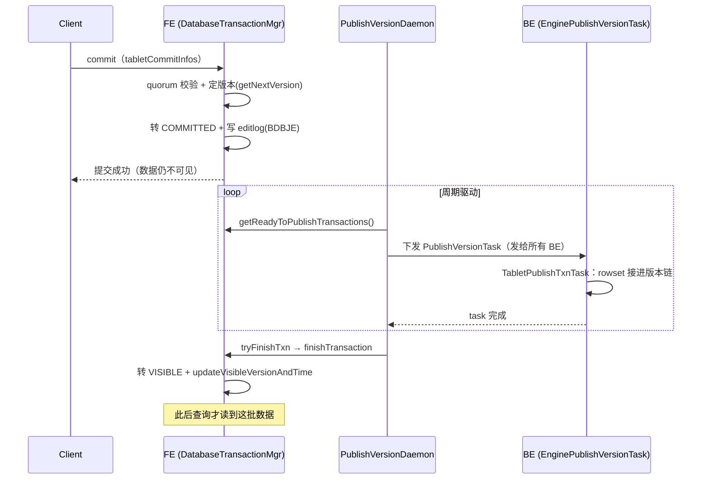

# 第 4 章：事务提交与可见性 —— Publish Version 与 MetaService 提交

第 3 章把一批数据在单个 tablet 上的"最后一公里"走完了：`DeltaWriter` 攒 memtable、flush 成不可变 Segment、收口成 rowset，主键表还预算好了 delete bitmap。到那一步为止，rowset 已经在盘上（或对象存储上）躺好，但它对查询**完全不可见**——它只是"就绪待提交"的候选，还没接进任何 tablet 的版本链。这一章负责把这批就绪的 rowset 真正"点亮"：先在 FE 侧把事务从 `PREPARE` 推到 `COMMITTED`（定下它该占哪个版本号），再让这个版本对查询可见（`VISIBLE`）。

这正是第 1 章 1.3 反复强调的那条语义分界线——**`COMMITTED ≠ VISIBLE`**——在源码层面的兑现。commit 只是"成败已定、版本已订"，可见性是另一个动作、另一个时刻。而这条分界线在双模式下走的是**两条完全不同的路**：存算一体靠 FE 的 `PublishVersionDaemon` 逐 BE 下发 publish 任务、把 rowset 接进每个副本的版本链；存算分离则没有 per-BE publish 这一步，版本推进在 MetaService 的**一次 FDB 事务**里一处完成，BE 读时再去拉。本部分第 1、4、6 章是双模式差异的主战场，本章就是其中的"提交与可见性"这一战——两种模式的提交延迟构成、失败模式、"卡住"的表现，都不一样，必须掰开讲。

本章的行号引用基于写作时核实所用的 HEAD（`a5a4f4746f`，源码树与系列基线 `7bc98f696f` 一致）。代码演进会让行号漂移，但对象名与提交/可见的语义不变；写作时每一处 `路径:行号` 都在当前代码里核实过。

## 4.1 问题：多副本多 tablet 的"同时可见"怎么做

**遇到了什么问题？** 一个导入事务落到物理层，是几十上百个 tablet、每个 tablet 又有 2~3 个副本散在不同 BE 上的一大片写入。第 3 章结束时，这些写入分别在各自的 BE 上生成了 rowset。现在 commit 要返回给客户端了，核心难题是：**怎么让"这一整批"数据对查询同时可见？** 不能出现"这个 tablet 的新数据能查到、那个还查不到"的撕裂状态；更棘手的是同一个 tablet 的三个副本——它们各自独立落盘，落盘完成的时刻天然不一致，如果放任每个副本"自己写好了就自己对外服务新数据"，同一条查询打到不同副本就会读到**不同版本**，这就是分布式读一致性里最经典的坑。

**有哪些候选、各有什么优劣？**

- **候选一：每副本自行可见。** 每个副本 rowset 一落盘就把它接进自己的版本链、立刻对查询服务。实现最省事，可见延迟也最低。但代价致命：同一个 tablet 的三副本推进节奏不同步，某一瞬间可能副本 A 已经带上了新版本、副本 B/C 还没。查询按副本路由（负载均衡会挑不同副本），于是**同一张表、同一时刻，两条相同的查询会读到不一样的结果**——这批数据"一半可见一半不可见"的撕裂被直接暴露给用户。对一个给报表供数的分析库，这是不可接受的。
- **候选二：全局锁 + 全副本同步可见。** commit 时锁住这批涉及的所有 tablet，等**所有**副本都把 rowset 写好、一起翻可见，再放锁返回。一致性拉满，但吞吐直接死：锁的持有时间被这批里**最慢**的那个副本决定（最慢副本的网络抖动、磁盘毛刺、GC 停顿都会拖住整批），而且这段时间里相关 tablet 上的其它导入/compaction 都得排队。多副本本是为了容错和并发，全局锁却把它们串成了木桶的短板，得不偿失。
- **候选三：版本号推进，commit 与 visible 解耦。** 给每个 partition 维护一个单调递增的版本号。commit 时**只做一件事——把这个事务钉在某个新版本号上**（`partition.getNextVersion()`，见 4.2），并不等任何副本追平就能返回；随后由后台把这个版本号"发"给各副本，让它们各自把对应 rowset 接进版本链（这一步叫 publish）；查询永远只读**已确认可见的那个版本**（`visibleVersion`），一个副本只有当它的版本链推进到了 `visibleVersion` 才被允许服务该查询。这样，"提交成功"和"数据可见"被拆成两个时刻，既不撕裂（读只认统一的 `visibleVersion`）、也不因等最慢副本而阻塞提交。

**Doris 怎么考量和解决的？** Doris 选了候选三，并叠加了 **quorum 提交**来进一步松绑："多数副本写成功"就判定 commit 成功——`getLoadRequiredReplicaNum` 取 `totalReplicaNum / 2 + 1`（`fe/fe-core/src/main/java/org/apache/doris/catalog/OlapTable.java:2730`，三副本即需 2 个）。commit 阶段逐 tablet 检查成功副本数是否够 quorum（`fe/fe-core/src/main/java/org/apache/doris/transaction/DatabaseTransactionMgr.java:651`），够了就定版本、转 `COMMITTED`；否则整批提交失败。**这个取舍要认清**：quorum 让一个副本临时掉队（宕机、慢盘）不至于拖垮整批提交，代价是 commit 返回时可能确实有副本还没这批数据。**那谁来修复落后副本？** 两条线兜底：一是 publish 阶段会持续向未完成的 BE 重试下发（4.2 详述）；二是 commit 时若发现某 tablet 成功副本不足，会顺手把它塞进副本修复队列——`fe/fe-core/src/main/java/org/apache/doris/transaction/DatabaseTransactionMgr.java:656` 直接调 `TabletScheduler`（`fe/fe-core/src/main/java/org/apache/doris/clone/TabletScheduler.java`）的 `tryAddRepairTablet`，由克隆机制从健康副本补齐落后副本。于是"提交只要多数、可见靠版本推进、落后交给修复"这三件事各司其职，既保证了对外读的一致，又没让最慢副本决定提交延迟。理解了这条主线，下面两节的双模式源码就都能顺着"commit 定版本 / 可见性另算 / 落后副本另修"这个骨架去读。

## 4.2 源码走读：存算一体的两段——commit 与 publish

存算一体下，一个导入事务的"变可见"清清楚楚分成 **commit** 和 **publish** 两段，分别由 FE 的两处代码驱动。

### 第一段：commit —— 定版本、写日志，不碰 BE

commit 的核心逻辑在 `DatabaseTransactionMgr.commitTransaction`（`fe/fe-core/src/main/java/org/apache/doris/transaction/DatabaseTransactionMgr.java:856`）。它做三件事，都在 FE 内存 + BDBJE 里完成，**全程不联系任何 BE**：

1. **quorum 校验。** 遍历这批每个 tablet，数它上报成功的副本数 `successReplicaNum`，与 `loadRequiredReplicaNum` 比较；只要有一个 tablet 不够多数，就抛错、整批提交失败（`fe/fe-core/src/main/java/org/apache/doris/transaction/DatabaseTransactionMgr.java:651`）。这就是 4.1 说的 quorum 提交落点。
2. **定版本。** 对每个涉及的 partition，把这个事务钉在 `partition.getNextVersion()` 上——`generatePartitionCommitInfo(table, partitionId, partition.getNextVersion())`（`fe/fe-core/src/main/java/org/apache/doris/transaction/DatabaseTransactionMgr.java:1622`）。注意此刻**只是把版本号记进事务的 commit info，并没有真的推进 partition 的可见版本**；`nextVersion` 要等 publish 成功、数据真可见了才递增（见下）。
3. **转状态 + 写编辑日志。** `beforeStateTransform(TransactionStatus.COMMITTED)` 做迁移前校验，随后把 `TransactionState`（`fe/fe-core/src/main/java/org/apache/doris/transaction/TransactionState.java:61`）置为 `COMMITTED` 并写 editlog 持久化到 BDBJE。日志一落，这个事务的成败就**永久定了**——状态机里 `COMMITTED` 没有指向 `ABORTED` 的边（第 1 章 1.3 的状态机）。

到这里 commit 返回，客户端拿到"提交成功"。但这批数据**还查不到**——它只是"版本已订、日志已记"，rowset 还没接进任何副本的版本链。

这里值得点一句 editlog 的分量：commit 之所以敢在不联系 BE 的情况下就对客户端承诺"成败已定"，靠的正是第 3 步那条持久化到 BDBJE 的编辑日志。第 1 章 1.4 讲过，FE 主从切换时新 Master 靠**回放 BDBJE editlog** 把事务表重建出来——所以一个已写日志的 `COMMITTED` 事务，即便 Master 此刻宕机、由 Follower 顶上，回放到这条日志后它依然是 `COMMITTED`、依然会被新 Master 的 `PublishVersionDaemon` 接着 publish。commit 与 publish 的解耦因此不只是性能优化，也是**故障恢复的边界**：日志已落即不可丢，日志未落则整批当未提交处理。这也解释了为什么定版本这一步只把版本号记进 commit info 而不急着推进 `visibleVersion`——推进可见版本是 publish 成功后才该做的事，提前推进会让"日志说可见、副本却还没数据"的不一致有机可乘。

### 第二段：publish —— 后台守护线程逐 BE 下发

把 `COMMITTED` 推到 `VISIBLE` 的是后台守护线程 `PublishVersionDaemon`（`fe/fe-core/src/main/java/org/apache/doris/transaction/PublishVersionDaemon.java:60`，继承自 `MasterDaemon`，`fe/fe-core/src/main/java/org/apache/doris/common/util/MasterDaemon.java:29`，只在 FE Master 上跑）。它周期性执行 `publishVersion()`（`fe/fe-core/src/main/java/org/apache/doris/transaction/PublishVersionDaemon.java:90`），流程是：

1. `getReadyToPublishTransactions()` 捞出所有已 `COMMITTED`、可以 publish 的事务（`fe/fe-core/src/main/java/org/apache/doris/transaction/GlobalTransactionMgr.java:443`）。
2. 对每个事务，`genPublishTask` 给**所有 BE**（`getAllBackendIds`，含当下 dead 的 BE）生成 publish 任务，通过 `AgentBatchTask` 批量下发。为什么连 dead BE 也发？源码注释点明了：不发给 dead BE，等它复活后就永远漏了这个版本；宁可发过去、发不到就发不到，也不能漏。任务实体是 `PublishVersionTask`（`fe/fe-core/src/main/java/org/apache/doris/task/PublishVersionTask.java:35`），携带 `{partitionId → version}` 的映射。
3. BE 侧由专门的 `PUBLISH_VERSION` worker 线程池接收（`be/src/agent/task_worker_pool.cpp:2122`），执行 `EnginePublishVersionTask::execute`（`be/src/storage/task/engine_publish_version_task.cpp:98`，类声明在 `be/src/storage/task/engine_publish_version_task.h:100`）。它对每个 tablet 起一个 `TabletPublishTxnTask`（`be/src/storage/task/engine_publish_version_task.h:64`），把这批 rowset 以 `commit info` 里那个版本号**接进 tablet 的版本链**（add inc rowset），rowset 从此对查询可见。
4. FE 侧 `tryFinishTxn` 检查 publish 结果。当"没有活着且未完成的 BE 任务"（`!hasBackendAliveAndUnfinishedTask`，`fe/fe-core/src/main/java/org/apache/doris/transaction/PublishVersionDaemon.java:227`）或已 publish 超时时，调 `finishTransaction`（`fe/fe-core/src/main/java/org/apache/doris/transaction/DatabaseTransactionMgr.java:1144`）把事务置为 `VISIBLE`（`fe/fe-core/src/main/java/org/apache/doris/transaction/DatabaseTransactionMgr.java:1210`），并在 `updateCatalogAfterVisible`（`fe/fe-core/src/main/java/org/apache/doris/transaction/DatabaseTransactionMgr.java:2413`）里真正推进 partition 版本：`partition.updateVisibleVersionAndTime(version, ...)`（`fe/fe-core/src/main/java/org/apache/doris/transaction/DatabaseTransactionMgr.java:2541`）把 `visibleVersion` 抬到新版本，同时 `partition.setNextVersion(version + 1)`（`fe/fe-core/src/main/java/org/apache/doris/transaction/DatabaseTransactionMgr.java:2408`）。至此查询才会带上这个新版本。

完整链路的时序如下：



### tricky 点一：publish 是异步尽力而为——"卡在 COMMITTED"的成因

`PublishVersionDaemon` 是**周期驱动、逐 tablet 尽力而为**的：它把版本发下去，成功的 tablet 就地生效，失败的 tablet 进 `error_tablet_ids`、**下个周期继续重试**，直到全成或超时。这套"尽力而为 + 重试"很稳健，但也意味着 publish 可能**长时间推不动**，事务卡在 `COMMITTED` 迟迟不 `VISIBLE`。运维里"提交成功了但就是查不到"，十有八九卡在这里。真正阻塞 publish 的成因有两类，各自的机理和"错写会怎样"都不同：

- **成因一：目标副本所在 BE 宕机。** publish 发给所有 BE，宕机 BE 的任务当然完不成。但这**通常不阻塞**——`shouldFinishTxn` 的判据是"有没有**活着且未完成**的 BE 任务"（`fe/fe-core/src/main/java/org/apache/doris/transaction/PublishVersionDaemon.java:227`），宕机 BE 不 alive，不计入阻塞；只要活着的多数副本 publish 成功，事务照样能 finish 到 `VISIBLE`（落后的那个副本靠 4.1 的修复线补）。真正卡住的是**活着但迟迟不完成**的 BE——它没死、任务却因为下面的版本不连续返回失败，于是被反复重试。
- **成因二：版本不连续 / schema change 冲突（队头阻塞）。** 版本链**必须连续**——tablet 只能 add 进 `max_version + 1`。`be/src/storage/task/engine_publish_version_task.cpp` 里显式判断：若 `version.first != max_version + 1` 且这个版本不是已存在的（`be/src/storage/task/engine_publish_version_task.cpp:216` 一带），就走 `_handle_publish_version_not_continuous`（`be/src/storage/task/engine_publish_version_task.cpp:332`）——**等前序版本先 publish**，日志会打 `version not continuous`（`be/src/storage/task/engine_publish_version_task.cpp:370`，主键表还会打 `uniq key with merge-on-write version not continuous`，`:380`）。这意味着 publish 存在**队头阻塞**：一个较早的事务因为副本原因卡住，排在它后面的所有事务都会因为"前序版本没到"而堆在它身后，一起卡 `COMMITTED`。schema change 期间对版本连续性的要求更严（`be/src/storage/task/engine_publish_version_task.cpp:216`~`236` 那段对 schema change 窗口做了额外的连续性判断）。

**一个常被误挂在 publish 头上的锅：`-235` / `TOO_MANY_VERSION` 其实发生在写入阶段，不在 publish。** 直觉上容易以为"tablet 版本太多导致 publish 时 add rowset 失败"，但核对代码会发现 publish 路径**根本没有版本数检查**：`-235`（[part1 第 3 章](../part1-architecture/03-data-model.md) 排查清单已验证 `-235` = `TOO_MANY_VERSION`）只在 `RowsetBuilder::check_tablet_version_count`（`be/src/storage/rowset_builder.cpp:182`）里抛，而它由 `RowsetBuilder::init`（`be/src/storage/rowset_builder.cpp:212`，第 222 行调用）触发——那是第 3 章的**写入/prepare 阶段，发生在 commit 之前**。撞 `-235` 的导入在写入时就 fast-fail 了，根本走不到 `COMMITTED`，更谈不上卡 publish。它和成因二其实是**版本堆积**这同一个根因的两副面孔：publish 侧表现为队头阻塞（成因二里"前序事务卡住"堆积版本），写入侧表现为**后续导入在 prepare 阶段直接报 `-235`**。两者根因都是 compaction 追不上导入，缓解都得让 compaction 跟上（详见本部分后续 compaction 章）；但排查入口不同——`-235` 要在写入报错里找，别去翻 publish 日志。

**错写会怎样？** 假如 publish 图省事，允许"跳过缺口版本、直接把后面的版本接上"——版本链就断了一段，查询按连续版本区间取数时会**读到缺一截的数据**（第 1 部分 3.3 讲过版本区间语义）。所以宁可让后面的事务全部排队等，也绝不能跳版本 publish。另一个常见误判：看到事务卡在 `COMMITTED`，就想"abort 掉重来"——但 `COMMITTED` 是不可回滚的终定态，正确动作是**让 publish 重试直到 `VISIBLE`**（或排查并解除卡点，如修副本、等前序 publish），而不是 abort。

### 易错点：`visibleVersion` 与 `nextVersion` 的差值就是积压深度

partition 上有两个版本号：`visibleVersion`（已可见的最新版本）和 `nextVersion`（下一个待分配的版本）。而 `getCommittedVersion()` 返回的正是 `nextVersion - 1`（`fe/fe-core/src/main/java/org/apache/doris/catalog/Partition.java:245`）——即"已经 commit、定了版本号"的最新版本。于是：

> **积压深度 = committedVersion − visibleVersion = (nextVersion − 1) − visibleVersion**

这个差值就是"已提交但还没 publish 可见"的版本个数。差值为 0 说明 publish 完全跟上；差值持续变大，说明 publish 积压、正卡在上面三种成因之一。**怎么看？** 两个入口：事务级看第 1 章 1.5 验证过的 `SHOW PROC '/transactions/<dbId>/running'`，堆积的 `COMMITTED` 事务会都挂在 `running` 下（`finished` 里才是已 `VISIBLE`/`ABORTED` 的）；partition 级看 `SHOW PARTITIONS`，它的 `VisibleVersion` 列由 `PartitionsProcDir`（`fe/fe-core/src/main/java/org/apache/doris/common/proc/PartitionsProcDir.java:112`）输出，反复刷这一列、看它涨不涨，就能直观判断某个分区的 publish 有没有推进。

## 4.3 源码走读：存算分离的提交（本章重点段）

存算分离下，上面这套"commit 定版本、publish 逐 BE 接版本链"被**整体搬进了 MetaService**。FE 不再自己维护权威版本、也不再向 BE 下发 publish 任务；它只是把提交请求转发给 MetaService，由后者在**一次 FDB 事务**里把版本推进这件事一处做完。

### FE 侧：转发 + 冲突重试

入口是 `CloudGlobalTransactionMgr.commitTxn`（`fe/fe-core/src/main/java/org/apache/doris/cloud/transaction/CloudGlobalTransactionMgr.java:819`，类声明在 `:166`）。它构造 `CommitTxnRequest`，通过 `MetaServiceProxy.getInstance().commitTxn(...)` 发 RPC（`fe/fe-core/src/main/java/org/apache/doris/cloud/transaction/CloudGlobalTransactionMgr.java:832`）。关键是外面套了一层**冲突重试循环**：

```java
while (retryTime < Config.metaServiceRpcRetryTimes()) {
    commitTxnResponse = MetaServiceProxy.getInstance().commitTxn(commitTxnRequest);
    if (commitTxnResponse.getStatus().getCode() != MetaServiceCode.KV_TXN_CONFLICT) {
        break;
    }
    backoff();   // sleep random [20,200] ms
    retryTime++;
}
```

`backoff()` 是随机 `[20ms, 200ms]` 退避（`fe/fe-core/src/main/java/org/apache/doris/cloud/transaction/CloudGlobalTransactionMgr.java:2522`）。为什么要重试 `KV_TXN_CONFLICT`？留到本节 tricky 点讲。提交成功后，`afterCommitTxnResp`（`fe/fe-core/src/main/java/org/apache/doris/cloud/transaction/CloudGlobalTransactionMgr.java:507`）会用响应里 MetaService 定好的版本刷新 FE 本地缓存的 partition 版本，并**尽力**通知 BE（见下）。

### MetaService 侧：一次 FDB 事务里的关键步骤

RPC 落到 `MetaServiceImpl::commit_txn`（`cloud/src/meta-service/meta_service_txn.cpp:3269`，类声明在 `cloud/src/meta-service/meta_service.h:83`）。它先按事务大小分派：普通事务走 `commit_txn_immediately`（`cloud/src/meta-service/meta_service_txn.cpp:1524`，声明在 `cloud/src/meta-service/meta_service.h:479`），特别大的事务（涉及 tablet/rowset 太多、可能超 FDB 单事务字节上限）走 lazy/eventually 路径（`commit_txn_eventually`，`cloud/src/meta-service/meta_service_txn.cpp:2188`）。以 `commit_txn_immediately` 为主线，它在**一个 FDB `Transaction`**（`cloud/src/meta-store/txn_kv.h:136`）里依次做：

1. **取本事务写入的临时 rowset。** `scan_tmp_rowset`（`cloud/src/meta-service/meta_service_txn.cpp:1106`）扫出这个 txn 之前（在写入阶段）落下的 tmp rowset 元数据——它们此刻还挂在临时 key 下，对读不可见。
2. **读各分区当前版本。** `get_partition_versions`（`cloud/src/meta-service/meta_service_txn.cpp:1455`）读出每个涉及 partition 的当前版本号。
3. **给 rowset 定版本 + 转正。** 对每个 partition，`new_version = version + 1`（`cloud/src/meta-service/meta_service_txn.cpp:1732`），把该分区下 rowset 的 `start_version` / `end_version` 都设成 `new_version`（`cloud/src/meta-service/meta_service_txn.cpp:1733`），并把 rowset meta 从临时 key **改写到正式 key**——这一步就等价于存算一体里 BE 的"接进版本链"，只不过是在 KV 里改一条元数据。
4. **推进分区版本。** `put` 新的 `partition_version_key`（`cloud/src/meta-service/meta_service_txn.cpp:1815`）把分区版本抬到 `new_version`，并把版本回填进响应（`response->add_versions(new_version)`，`:1834`）。
5. **累加 tablet 统计。** `update_tablet_stats`（`cloud/src/meta-service/meta_service_txn.cpp:1232` / 调用点 `:1941`）把行数、数据量等增量累加到 tablet stats。
6. **主键表处理 delete bitmap 锁。** MoW 表要走 `process_mow_when_commit_txn`（`cloud/src/meta-service/meta_service_txn.cpp:1345`），围绕 `meta_delete_bitmap_update_lock_key`（`cloud/src/meta-service/meta_service_txn.cpp:1296`）校验/处理这张表的 delete bitmap update lock——这与第 3 章 3.3 讲的"存算分离下 delete bitmap 由 FE 抢 MetaService 分布式锁协调"是同一把锁的两端。
7. **一次性原子提交。** 写入 `commit_txn` 的 operation log（`cloud/src/meta-service/meta_service_txn.cpp:1985`），最后 `txn->commit()`（`cloud/src/meta-service/meta_service_txn.cpp:2025`）把上面所有改动作为**一个 FDB 事务原子提交**。要么全生效、要么全不生效——不存在存算一体那种"部分 tablet publish 成功、部分失败"的中间态。

**关键区别一目了然：没有 per-BE publish。** 版本推进（rowset 转正 + `partition_version_key` 抬升）在 FDB 的这一次事务里一处完成，`txn->commit()` 返回的那一刻，这批数据在权威元数据里就**已经是可见版本**了。没有 `PublishVersionDaemon`、没有逐 BE 下发任务、没有 `COMMITTED → VISIBLE` 那段等待。

### BE 怎么发现新版本？push 兜 pull

既然 MetaService 一处就把版本推上去了，散在各处的 BE（它们是无状态的算力节点，本地只缓存 rowset 列表）怎么知道"这个 tablet 有新版本了"？两条路，**pull 为权威、push 为优化**：

- **pull（权威）：读时同步。** BE 处理查询要 capture 指定版本的 rowset 时，若本地缓存的 `max_version` 低于要读的 `query_version`，就触发 `CloudTablet::sync_rowsets`（`be/src/cloud/cloud_tablet.cpp:294`，类声明在 `be/src/cloud/cloud_tablet.h:77`）——它先 `sync_if_not_running`，再在版本不够时调 `CloudMetaMgr::sync_tablet_rowsets_unlocked`（`be/src/cloud/cloud_meta_mgr.cpp:665`，类声明在 `be/src/cloud/cloud_meta_mgr.h:67`）向 MetaService 拉这个 tablet 的最新 rowset 列表。**只要 FDB 里版本推上去了，BE 下次读一定能拉到**——这是可见性的权威保证，不依赖任何主动通知。
- **push（优化）：commit 后通知。** 每次读都同步一次太慢，所以 FE 在 `afterCommitTxnResp` 里会**尽力**通知相关 BE 把刚提交的 tmp rowset 就地转正——`notifyBesMakeTmpRsVisible`（`fe/fe-core/src/main/java/org/apache/doris/cloud/transaction/CloudGlobalTransactionMgr.java:2784`），受 `enable_notify_be_after_load_txn_commit` 开关控制。它是**best-effort**的：抛异常也只 `warn` 不影响主流程（`fe/fe-core/src/main/java/org/apache/doris/cloud/transaction/CloudGlobalTransactionMgr.java:2823`）。通知丢了也没关系，pull 会兜底。

### 逐点对照 4.2

| 维度 | 存算一体（4.2） | 存算分离（4.3） |
| --- | --- | --- |
| commit 延迟构成 | quorum 个副本 ACK（多副本网络 + 落盘），FE 内存改状态 + 写 BDBJE | 一次 MetaService RPC + 一次 FDB 事务提交（+ 可能的冲突重试） |
| 版本推进落点 | 分两处：FE 定版本号（commit），各 BE 各自接版本链（publish） | 一处：MetaService 在一次 FDB 事务里改元数据 |
| 可见性动作 | 异步 publish，逐 tablet 尽力而为 + 重试 | 无独立 publish；FDB 事务提交即可见，BE pull/push 发现 |
| 失败原子性 | tablet 级：部分 tablet 可先可见，失败的重试 | 事务级：FDB 事务整体成败，要么全可见要么整体重试 |
| "卡 COMMITTED" 对应什么 | publish 积压（副本慢 / 版本不连续队头阻塞），可长时间卡 | **没有这个窗口**；卡点前移到 commit 本身——FDB 冲突重试、delete bitmap 锁抢不到、事务过大转 lazy commit |

一句话概括这张表：**存算一体把"可见"做成了 commit 之后一段可观测、可能卡住的异步过程；存算分离把"可见"折叠进了 commit 那一次原子事务，代价是把并发压力集中到了 FDB 的这次提交上。**

### tricky 点：FDB 冲突重试对高频提交的影响

FDB 是**乐观并发控制**：一个事务提交时，如果它读过的 key 在它执行期间被别的事务改过（读写冲突），提交会被判定冲突而 abort。在 Doris 云侧，`fdb_transaction_commit` 拿到 FDB 错误码 `1020`（`FDB_ERROR_CODE_TXN_CONFLICT`，`cloud/src/meta-store/txn_kv.cpp:323`）时映射为 `TxnErrorCode::TXN_CONFLICT`（`cloud/src/meta-store/txn_kv_error.h:29`），并累加冲突指标 `g_bvar_txn_kv_commit_conflict_counter`、打 `fdb commit error` 日志（`cloud/src/meta-store/txn_kv.cpp:887`）。这个冲突向上传成 `KV_TXN_CONFLICT`，回到 FE 的 `commitTxn` 就触发前面那段 backoff 重试。

**为什么高频提交会放大它？** 因为 commit_txn 要读改**同一个 `partition_version_key`**（步骤 2/4）。如果大量导入**高频提交到同一张表、同一个分区**，它们会争抢同一把"分区版本"key——A 读到版本 v、准备写 v+1 时，B 已经先提交把版本推到了 v+1，A 的读集失效、提交冲突、被迫 backoff 重试；重试时再读到新版本、可能又撞上 C……冲突率随并发上升，`[20,200]ms` 的退避会一次次叠加到 commit 延迟的尾部。这就是存算分离模式下"提交延迟长尾"的主要来源，也是它与存算一体最不一样的性能特征：一体的瓶颈在"最慢副本 + publish 积压"，分离的瓶颈在"热点分区的 FDB 提交冲突"。缓解方向是降低对单一分区的提交频率（增大导入攒批、减少并发写同分区的作业数），本质上是给这把热点 key 降压。

## 4.4 动手实验

环境说明沿用 part1 第 5 章，不重复。本节两个实验分别验证核心点（抓 `COMMITTED → VISIBLE` 窗口）和主动踩易错点（quorum 提交成功但副本落后）。

### 实验一（核心点）：循环查事务状态，抓 COMMITTED→VISIBLE 窗口

**目标**：亲眼看到一次导入在提交后短暂停在 `COMMITTED`、再翻到 `VISIBLE`，把 4.2 的两段链路对上号。

1. 用一个能拖慢 publish 的手段放大窗口。最省事的是导入**较大一批**数据到一张**多分区多 tablet** 的表（tablet 越多，publish 逐 tablet 铺开越久，窗口越容易被抓到）。发起一个 Stream Load（命令见第 2 章实验一），**不要等它返回**。
2. 立刻在另一个会话里循环查事务状态：
   ```sql
   -- 每隔几十毫秒刷一次，盯住那个 Label 的事务
   SHOW PROC '/transactions/<dbId>/running';    -- COMMITTED 但未可见的事务挂在这
   SHOW PROC '/transactions/<dbId>/finished';   -- 翻到 VISIBLE 后落到这
   ```
   运气好会先在 `running` 里看到它、`TransactionStatus` 为 `COMMITTED`，几个刷新周期后消失、出现在 `finished` 里且为 `VISIBLE`。
3. 事后用第 1 章 1.5 的办法看时间戳：`SHOW PROC '/transactions/<dbId>/finished'` 里 `CommitTime` 与 `PublishTime` 的差，就是这次窗口的实测宽度。
4. **对照存算分离**：在存算分离集群上重复同样操作，你会发现**几乎抓不到 `COMMITTED` 停留**——因为 4.3 讲过，MetaService 的 FDB 事务提交即可见，没有独立 publish 窗口。这时该盯的不是"窗口宽度"而是"commit 延迟本身"（`CommitTime − PrepareTime`），以及高并发下是否出现冲突重试（见实验二的排查方向）。

**这个实验验证的核心点**：存算一体的可见性是 commit 之后一段**可观测的异步过程**；存算分离把它折叠进了提交，两种模式该盯的指标不同。

### 实验二（踩易错点）：停一个 BE，看 quorum 提交成功但副本落后

**目标**：亲手制造"多数副本成功、少数副本落后"的局面，验证 4.1 的 quorum 提交与副本修复。

1. 建一张**三副本**表（`replication_num = 3`），确认它的 tablet 三副本分别落在三台不同 BE 上（`SHOW TABLETS FROM <table>` 看 `BackendId`）。
2. **停掉其中一台 BE**（`SHOW PROC '/backends'` 确认它变为非 alive）。此时每个 tablet 只剩 2 个健康副本——恰好等于三副本的 quorum（`3/2+1=2`）。
3. 向这张表导入一批数据。**观察点一：commit 仍然成功**——因为每个 tablet 都有 2 个副本写成功、够 quorum，`commitTransaction` 的 quorum 校验（`fe/fe-core/src/main/java/org/apache/doris/transaction/DatabaseTransactionMgr.java:651`）通过。这验证了 quorum 提交不被单个掉队副本卡住。
4. **观察点二：落后副本被标记。** 停掉的那台 BE 上的副本没有这批数据，版本落后于 `VisibleVersion`。用副本状态命令看：
   ```sql
   -- status 取值：OK / DEAD / VERSION_ERROR / SCHEMA_ERROR / MISSING
   ADMIN SHOW REPLICA STATUS FROM <table> WHERE STATUS = "VERSION_ERROR";
   ```
   该命令由 `ShowReplicaStatusCommand`（`fe/fe-core/src/main/java/org/apache/doris/nereids/trees/plans/commands/ShowReplicaStatusCommand.java:54`）实现，`WHERE STATUS` 的合法取值就是上面注释里那几个（见 `fe/fe-core/src/main/java/org/apache/doris/nereids/trees/plans/commands/ShowReplicaStatusCommand.java:100`）。落后副本会以 `VERSION_ERROR` 之类的状态出现。
5. **观察点三：副本修复补齐。** 把停掉的 BE 拉起来。commit 阶段其实已经把不够副本的 tablet 塞进了修复队列（`fe/fe-core/src/main/java/org/apache/doris/transaction/DatabaseTransactionMgr.java:656` 调 `TabletScheduler.tryAddRepairTablet`），克隆机制会从健康副本把落后副本补齐。再刷 `ADMIN SHOW REPLICA STATUS` 和 `SHOW PARTITIONS` 的 `VisibleVersion`，会看到落后副本逐渐回到 `OK`。

**要建立的认知**：quorum 提交让"提交成功"和"所有副本都有数据"是**两回事**——提交只保证多数，落后副本的追平是另一条异步修复线。生产里看到某副本 `VERSION_ERROR` 不必惊慌，先确认是否只是还没被修复线补上；持续不恢复才要查克隆是否卡住。

## 4.5 排查清单

按"症状 → 定位路径"组织，覆盖提交与可见性这一段最高频的三类问题。写入阶段的问题（flush/内存/bitmap 计算）见第 3 章 3.6。

### 症状 A：查询读不到刚导入的数据

- **先分模式。** 存算一体：多半卡在 `COMMITTED` 还没 `VISIBLE`。查 `SHOW PROC '/transactions/<dbId>/running'`——如果那个 Label 的事务在 `running` 里且为 `COMMITTED`，就是 publish 还没跟上，转症状 B 查卡点；如果已在 `finished` 里且 `VISIBLE`，那数据确实可见了，读不到要往查询侧查（是否读了旧版本快照、是否连错库表）。
- **存算分离：** commit 成功即应可读。若读不到，重点查 BE 有没有 pull 到新版本——`notifyBesMakeTmpRsVisible` 的 push 可能丢了、而这台 BE 的 `sync_rowsets`（`be/src/cloud/cloud_tablet.cpp:294`）还没被下一次读触发。确认 `CommitTxnResponse` 里 MetaService 返回的版本已推进（FE `afterCommitTxnResp` 日志），再看 BE 是否因缓存旧 `max_version` 没去同步。

### 症状 B：publish 积压——怎么看深度与卡点

- **看深度**：`积压深度 = committedVersion − visibleVersion = (nextVersion−1) − visibleVersion`（`fe/fe-core/src/main/java/org/apache/doris/catalog/Partition.java:245`）。用 `SHOW PARTITIONS` 盯 `VisibleVersion`（`fe/fe-core/src/main/java/org/apache/doris/common/proc/PartitionsProcDir.java:112`）涨不涨；`SHOW PROC '/transactions/<dbId>/running'` 里堆积的 `COMMITTED` 事务个数就是直观的积压。
- **找卡点**：到目标 BE 的 `be.INFO` 搜 `version not continuous`（`be/src/storage/task/engine_publish_version_task.cpp:370`，版本队头阻塞，找那个卡住的最早版本事务）以及 publish 失败的 tablet 报告。定位到最早卡住的那个 tablet/版本，解除它（修副本、等前序 publish），后面排队的自然疏通。
- **别把 `-235` 当 publish 卡点找**：如果**同时**有新导入报 `-235` / `TOO_MANY_VERSION`，那是版本堆积已经严重到**写入侧**也开始 fast-fail——它抛在 `RowsetBuilder::init`（`be/src/storage/rowset_builder.cpp:212`）的 prepare 阶段，不在 publish 日志里。它和 publish 队头阻塞是同一个根因（compaction 落后）的两副面孔，根治都是让 compaction 追上。
- **别做的动作**：不要去 abort 一个卡在 `COMMITTED` 的事务——它不可回滚，正确做法是让 publish 重试直到 `VISIBLE`（4.2 tricky 点一）。

### 症状 C：存算分离 commit 冲突重试的日志特征

- **FE 侧指纹**：搜 `commitTxn KV_TXN_CONFLICT, transactionId:..., retryTime:...`（`fe/fe-core/src/main/java/org/apache/doris/cloud/transaction/CloudGlobalTransactionMgr.java:840` 一带打的日志）。`retryTime` 涨得高，说明这个事务反复撞 FDB 冲突。
- **MetaService 侧指纹**：搜 `fdb commit error`（`cloud/src/meta-store/txn_kv.cpp:887`）并看冲突计数指标 `g_bvar_txn_kv_commit_conflict_counter`。冲突集中在少数分区，基本可断定是**高频提交到同一热点分区**争抢 `partition_version_key`（4.3 tricky 点）。
- **缓解方向**：降低对单一分区的提交频率——增大导入攒批、合并高频小导入、减少并发写同一分区的作业数。另一类相关问题是单批事务过大（涉及 tablet/rowset 太多）：**未开启** lazy commit 时会直接返回 `TXN_BYTES_TOO_LARGE` 并附提示 "reduce the number of partitions involved in the load"（`cloud/src/meta-service/meta_service_txn.cpp:3336`，仅在非 lazy 回退分支追加）；开启 lazy commit（`enable_txn_lazy_commit`）则改走 `commit_txn_eventually`（`cloud/src/meta-service/meta_service_txn.cpp:2188`）分批提交。看到这条提示，方向就是减少单批涉及的分区/tablet 数。

---

本章把第 3 章就绪的 rowset 真正点亮，走完了"一次导入的一生"里最后、也最容易被误解的一段。先从"多副本多 tablet 怎么同时可见"这个分布式读一致性问题出发，论证了 Doris 为什么选"版本号推进 + quorum 提交"而非每副本自可见或全局锁；再逐段走读了存算一体的两段式——`commitTransaction` 定版本写日志、`PublishVersionDaemon` 逐 BE 下发 publish 任务接版本链，重点挖了"卡在 COMMITTED"的真成因（副本宕机、版本不连续队头阻塞）以及一个常被误挂在 publish 头上的锅（`-235` 其实发生在写入 prepare 阶段），并给出"积压深度 = committedVersion − visibleVersion"的观测法；接着以本章重点段拆解了存算分离如何把这两段折叠进 MetaService 的一次 FDB 事务、没有 per-BE publish、BE 靠 pull 兜 push 发现新版本，并逐点对照了两种模式的延迟构成、失败原子性与"卡住"表现，落在 FDB 乐观并发冲突重试这个分离模式独有的性能特征上。到这里，一批数据已经对查询可见，一次导入的主干链路就此闭环。下一章先看其他导入方式如何复用这条链路，随后第 6 章再谈可见之后的隐忧——版本越堆越多、小文件越来越碎，需要后台把它们合并整理。
