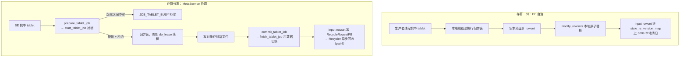

# 第 6 章：Compaction —— 版本合并的艺术

本章的行号引用基于写作时核实所用的 HEAD（`afc5cdda43`，源码树与系列基线 `7bc98f696f` 一致）。代码演进会让行号漂移，但对象名与设计语义不变；写作时每一处 `路径:行号` 都在当前代码里核实过。

第 3~5 章把一批数据从五种源头送进内核、写成 rowset、推进版本、直到可见，反复撞见同一个告警：`-235 TOO_MANY_VERSION`。第 4、5 章已经把它的抛出点钉死在**写入 prepare 阶段**（`RowsetBuilder::check_tablet_version_count`，`be/src/storage/rowset_builder.cpp:173`），并给出了一句诊断：**版本产生速率超过了 compaction 合并速率**。但"compaction 到底怎么合、凭什么合、为什么会跟不上"一直是个黑箱。这一章把黑箱打开——它既是 part3 的收官，也是 -235 这条故事线的终点：读到这里，你会明白 -235 不是导入的病，而是**后台合并的告警灯**。

## 6.1 问题：LSM 类系统绕不开的一笔账

### 遇到了什么问题

回顾 part1 3.3 的版本机制：每一次成功的导入事务让分区版本 +1，并在命中的 Tablet 上生成一个新 rowset，区间是 `[n, n]`。所以一张持续被写入的表，Tablet 上会挂着一长串单版本 rowset：`[2-2]`、`[3-3]`、`[4-4]`……高频小批导入下，这个列表会以每秒数个的速度膨胀。

这串 rowset 不会自己消失，它同时压着三笔账：

- **读放大**：一次查询要读版本 `V`，本质是挑一组区间首尾相接、无缝覆盖 `[0, V]` 的 rowset（version path，见 part1 3.3）。rowset 越多，version path 越长，要打开的 Segment 文件越多、要归并的流越多。Unique MoR、Aggregate 模型还要在读时跨 rowset 去重/聚合，读放大随 rowset 数量线性恶化。
- **元数据与版本上限**：Tablet 的可见 rowset 列表 `rs_metas`（part1 3.3 的 `TabletMetaPB`）不能无限长。Doris 给它设了硬上限 `max_tablet_version_num`（`be/src/common/config.cpp:915`，默认 2000；时序表走 `time_series_max_tablet_version_num`，`:917`，默认 20000），超过就在写入 prepare 阶段抛 -235。
- **主键表放大**：MoW 表每个 rowset 还挂一份 delete bitmap，版本越多，bitmap 越碎、TabletMeta 越大、`save_meta` 越慢。

### 有哪些候选方案，各有什么优劣

问题的核心是：小 rowset 迟早要合并成大 rowset，**什么时候合、合多少**？三条极端路线：

- **候选一：永不合并。** 导入只管追加，读时现场归并所有 rowset。写入零额外开销，但读放大爆炸、版本数无上限——这正是上面三笔账全部爆掉的情形，工程上不可用。
- **候选二：每次导入即时合并。** 每写一个新 rowset，就立刻把它和已有的大 rowset 合成一个更大的。读永远只面对一个 rowset，读放大最优；但每次导入都要重写全部历史数据，**写放大爆炸**——一张 100GB 的表，追加 1MB 也要重写 100GB，高频导入直接把磁盘带宽打满。
- **候选三：分层摊销合并。** 不追求"永远一个 rowset"，而是把 rowset 按大小/新旧分层：新来的小 rowset 先快速合成中等 rowset，中等的攒够了再合成大 rowset，越老越大的越少动。任何一次合并只碰"同一量级"的数据，写放大被摊薄到 O(log N) 量级；读放大也被压在每层常数个 rowset 内。

这就是 LSM 类系统绕不开的**读放大 / 写放大 / 空间放大三选二**的经典权衡。候选三是所有 LSM 存储的共同答案，区别只在分层策略。

### Doris 怎么解决的

Doris 走候选三，但把"分层"简化成**两层**：**cumulative（增量层）** 与 **base（基线层）**。

- **cumulative compaction** 只合并最近的、较小的增量 rowset，把 `[5-5][6-6][7-7]` 这样一串窄区间合成 `[5-7]` 一个宽区间。它跑得频繁、每次只碰少量新数据，是**削减版本数的主力**。
- **base compaction** 把 cumulative 攒出来的中等 rowset 与最老的 base rowset（起始版本为 0 的那个）合并成一个更大的 base。它跑得稀疏、每次搬动大量老数据，是**控制总 rowset 层数**的兜底。

设计直觉很朴素：**新数据频繁被合、老数据极少被动**。绝大多数写入都落在版本时间线的尾部，cumulative 用小代价频繁清扫尾部;base 只在增量攒到一定体量时才启动一次昂贵的全量重写。这与 RocksDB 的分层思想同源，但取舍不同：RocksDB 的 **leveled** 策略维护 L0~Ln 多层、每层有序不重叠，读放大小但写放大较大；**tiered**（size-tiered）策略同层攒够几个 SST 就合成下一层一个，写放大小但读放大较大。Doris 的两层结构更接近 tiered 的精简版——用 base/cumulative 两级近似 tiered 的多级，牺牲一点读放大换取实现简单和写放大可控。对分析型负载（大批量扫描、少量点查）而言，这个取舍是划算的。

**回到 -235。** 现在这句诊断有了完整含义：cumulative compaction 是削减版本数的水龙头，导入是灌水的进水口。-235 不是"版本机制的 bug"，而是**进水速率持续压过出水速率、水位漫过 `max_tablet_version_num` 这道堤**的告警。第 5 章"高频小写入的敌人永远是版本数"那条主线，到这里终于接上了它的下半句：**而版本数的唯一出口，就是 compaction**。

## 6.2 源码走读：触发与选择

Compaction 是后台自驱的，没有谁"命令"它跑。整条链路分三步：**周期性挑 tablet → 算分决定谁最该合 → 提交到线程池执行**。前两步是本节主角，第三步交给 6.3。

### 生产者线程：周期扫描与打分（高度概括）

BE 启动时拉起一个常驻的 compaction 生产者线程，回调是 `StorageEngine::_compaction_tasks_producer_callback`（`be/src/storage/olap_server.cpp:649`，注册于 `:280`）。它的骨架是一个 `do-while` 轮询：

- **交替选型**：一个计数器 `round` 在 cumulative 和 base 之间轮换——连续跑 `cumulative_compaction_rounds_for_each_base_compaction_round`（`be/src/common/config.cpp:543`，默认 9）轮 cumulative，才安排一轮 base（`be/src/storage/olap_server.cpp:675`）。这个 9:1 的配比正是 6.1 里"cumulative 频繁、base 稀疏"的直接落地。
- **动态节流**：每轮生成多少个 compaction 任务不是固定的。若线程池队列已排空，就把每轮任务数翻倍（上限 `max_automatic_compaction_num_per_round`）；若队列积压超过上轮一半，就减半、最低到 1（`be/src/storage/olap_server.cpp:700-716`）。这是一个简单的自适应背压：合得动就多派活，合不动就少派活。
- **提交**：挑出的每个 tablet 经 `_submit_compaction_task` 投进对应线程池（`be/src/storage/olap_server.cpp:740`）。cumulative 和 base 各有独立线程池 `_cumu_compaction_thread_pool` / `_base_compaction_thread_pool`（`be/src/storage/olap_server.cpp:254`、`:258`），互不抢占。

真正决定"谁被挑中"的是 **compaction score**——一个 tablet 越"该合"，分越高。入口是 `Tablet::calc_compaction_score`（`be/src/storage/tablet/tablet.cpp:1177`），它按类型分派到 `_calc_cumulative_compaction_score`（`:1264`）或 `_calc_base_compaction_score`（`:1277`）。base 的分很直白：把 cumulative point 以下、本地的、非空的 rowset 的 compaction score 累加（`be/src/storage/tablet/tablet.cpp:1277-1304`）。cumulative 的分则委托给策略类，这才是需要逐段看的地方。

### tricky 点：cumulative point 的推进语义

**这是理解整套挑选行为的钥匙，读错它后面全看不懂。**

cumulative point 是 Tablet 上的一个版本号游标，它把所有 rowset 切成两个域：**end_version < point 的归 base 域，end_version >= point 的归 cumulative 域**。cumulative compaction 只在 cumulative 域里挑 rowset，base compaction 只吃 base 域。point 就是这两个域的分界线，而**它只朝一个方向走：单调右移**。

它怎么右移？看 `SizeBasedCumulativeCompactionPolicy::update_cumulative_point`（`be/src/storage/compaction/cumulative_compaction_policy.cpp:142`）——每次 cumulative compaction 成功后被调用：

```cpp
// ...（省略 delete 版本快速推进与状态保护分支）
size_t total_size = output_rowset->rowset_meta()->total_disk_size();
if (total_size >= tablet->cumulative_promotion_size()) {
    tablet->set_cumulative_layer_point(output_rowset->end_version() + 1);
}
// ...（省略 delete 版本快速推进与状态保护分支）
```

关键在"晋升（promotion）"这个语义：cumulative 合出来的新 rowset，**只有体量攒够了 `cumulative_promotion_size`，point 才越过它、把它"下放"到 base 域**（`be/src/storage/compaction/cumulative_compaction_policy.cpp:155-157`）。没攒够就把 point 留在原地，让这个中等 rowset 继续参与后续 cumulative 合并、继续长大。promotion size 是按 base rowset 大小乘一个比例算出来的、夹在上下限之间的动态值（`_calc_promotion_size`，`:122-135`）。这就实现了"分层"：小 rowset 在 cumulative 域里反复合、越合越大，够大了才沉底进 base 域，等着某天被 base compaction 收编。

point 初始化的逻辑在 `calculate_cumulative_point`（`:45`）：它**只在 point 尚未初始化（`K_INVALID_CUMULATIVE_POINT`）时算一次**（`:49-52`），之后一律靠上面的 promotion 推进。初始化时从 base 往后扫，遇到第一个"体量小于 promotion size"或"segment 内部 overlapping（还没排好序去重）"的 rowset，就把 point 定在那里（`:82-105`）——直觉是"从这个 rowset 开始都是没整理过的增量"。

**MoW 表有个额外的推进条件**，很值得记：即便体量没攒够，只要输出 rowset 的版本跨度超过 `_promotion_version_count`，point 也强制右移（`be/src/storage/compaction/cumulative_compaction_policy.cpp:158-167`）。注释说得很直白——MoW 表版本数一多，delete bitmap 会膨胀到让 TabletMeta 过大、`save_meta` 变慢。这是 6.1"主键表放大"那笔账在挑选逻辑里的直接对策。

**错读会怎样？** 如果误以为 point 是"当前最大版本"或"能倒退",你会完全看不懂两件事：一是为什么一个刚合并完的 tablet，compaction score 还是没降到 0（因为新合出的中等 rowset 没晋升、还留在 cumulative 域里等着继续合）；二是为什么某些 rowset 明明很老却总不进 base（因为 point 没越过它们）。把 point 理解成"一条只进不退、按体量晋升的分界线"，这些现象才自洽。

### CumulativeCompactionPolicy 挑 input rowset 的规则

score 算出来只决定"这个 tablet 值不值得排队"，真正合哪几个 rowset 由 `SizeBasedCumulativeCompactionPolicy::pick_input_rowsets`（`be/src/storage/compaction/cumulative_compaction_policy.cpp:246`）决定。核心是一个 **level_size 分层过滤**：

从 cumulative 域的候选 rowset 里，先全收进来累加 score 和 size；然后从头逐个检查——若某个 rowset 的"量级"（`_level_size`，按 2 的幂归档）**不小于**剩余 rowset 的量级，就从这里截断，只合它之后的（`:339-353`）。用注释里的例子：`128, 16, 16, 16` 会挑出 `[16,16,16]` 去合，把那个已经很大的 128 留下——**不同量级不混合，永远只合同一量级的一批小 rowset**。这正是 tiered 分层的精髓，也是写放大被摊薄的机制来源。

还有两个必须看的边界：

- **delete 版本是硬边界**。遇到带 delete predicate 的 rowset，就在它之前截断，把 delete 之前的先合掉、交给 base 处理 delete（`:287-302`）。delete 语义必须按版本顺序生效，不能跨 delete 乱合。
- **min/max 阈值**。`cumulative_compaction_min_deltas`（`be/src/common/config.cpp:520`，默认 5）作为 `min_compaction_score` 传入：若挑出的 rowset 总量既小于 `_compaction_min_size` 又不够 min 分，就清空、这轮不合（`:391-393`）——**攒不够一批就不劳师动众**。上限 `cumulative_compaction_max_deltas`（`be/src/common/config.cpp:521`，默认 1000）防止一次合并吃太多。**记住 `cumulative_compaction_min_deltas` 这个名字，6.5 的易错点实验就靠调大它来复现 -235。**

### 易错点：把并发/内存参数调过头

面对 -235，最诱人的"优化"是猛调 compaction 并发，想让合并跑得更快。相关配置有：`max_base_compaction_threads`（`be/src/common/config.cpp:471`，默认 4）、`max_cumu_compaction_threads`（`:472`，默认 -1 表示自适应）、`compaction_task_num_per_disk`（`:532`，默认 4，每块盘的并发任务数）。它们全是 `DEFINE_m*` 打头，**运行时可 `update_config` 热改**。

但调过头会反噬：compaction 是**读放大与写放大双高**的重活——它要打开一批 rowset 全量归并读、再写出一个大 rowset，同时吃 CPU、内存、磁盘 IO。把并发拉满，等于让后台合并和前台导入、查询抢同一批资源。真实现场里"调大并发想救 -235，结果导入更慢、查询抖动、-235 反而更频繁"是常见反模式——因为导入被 compaction 挤得更慢，版本产生速率没降、合并却因资源争抢没提上去。生产者线程那套动态节流（`be/src/storage/olap_server.cpp:700-716`）本就是为了避免这种自伤，手动强行拉高并发是在跟它对着干。正确姿势是先分析**进水口**（降导入频率、增大批次），并发只是最后的微调旋钮。

## 6.3 源码走读：执行与版本替换

一个 tablet 被挑中、投进线程池后，`CompactionMixin`（`be/src/storage/compaction/compaction.h:190`）执行三步：**归并读 → 写新 rowset → 元数据原子替换**。

### 归并读复用查询的读路径（高度概括）

合并不是"拼接字节",而是**把 input rowset 当成一次查询来读**。核心调用是 `Merger::vmerge_rowsets`（`be/src/storage/compaction/compaction.cpp:318`，实现在 `be/src/storage/merger.cpp:66`）。翻开 `be/src/storage/merger.cpp` 会看到它构造了一个 `BlockReader`（`be/src/storage/iterator/block_reader.h`），并把 `reader_type` 设成对应的 compaction 类型。

这一步的精妙在于**语义完全复用查询侧**：读取时按 `KeysType`（part1 3.3 那个贯穿始终的参数）决定怎么处理相同 key——Duplicate 全保留、Unique 取最新、Aggregate 按函数聚合。所以 compaction 不需要一套独立的"合并规则"，它就是一次以合并为目的的读。这也解释了 part1 3.3 那个"count 随 compaction 进度变化"的现象：跨 rowset 的相同 key 在合并这一刻才真正被去重/聚合，输出 rowset 里它们就收敛成了最终形态。写出新 rowset 用 `_output_rs_writer->build`（`be/src/storage/compaction/compaction.cpp:334`），落成一个宽区间的 Segment 文件。

### 元数据原子替换与 stale rowset 保留窗口

新 rowset 写好后，要用它替换掉那批 input rowset。这一步是 `CompactionMixin::modify_rowsets`（`be/src/storage/compaction/compaction.cpp:1400`）调 `Tablet::modify_rowsets`（`be/src/storage/tablet/tablet.cpp:603`），把新 rowset 加入、input rowset 移除——但**移除不等于删除**。

tricky 在这里：一个正在执行的查询，可能早已选定了旧版本的 rowset 集合（part1 3.3 讲的 version path）。compaction 一旦物理删掉旧 rowset，这个查询就会读到半截数据。所以 `Tablet::modify_rowsets` 把被替换的 input rowset **搬进 `_stale_rs_version_map`**（`be/src/storage/tablet/tablet.cpp:660`、`:339`）而非直接删——这就是 part1 3.3 里 `TabletMetaPB.stale_rs_metas` 字段的由来。它们是 MVCC 读的必要保留：等还在读旧版本的查询全部走完、过了保留窗口，才由后台清扫。

保留窗口由 `tablet_rowset_stale_sweep_time_sec`（`be/src/common/config.cpp:381`，默认 600 秒）控制，清扫入口 `delete_expired_stale_rowset`（`be/src/storage/compaction/compaction.cpp:1570`，判定用到该配置见 `be/src/storage/tablet/tablet.cpp:889`）。改完元数据后 `save_meta`（`be/src/storage/compaction/compaction.cpp:1577`）持久化。**保留窗口调得太小会怎样？** 长查询还没读完、stale rowset 就被扫掉，查询报"rowset 找不到"；调得太大则 stale rowset 堆积、占盘占内存。600 秒是给长查询留的安全余量。

### tricky 点：合并期间新导入照常追加，版本区间凭什么不重叠

compaction 是后台异步的，它跑的这几秒到几分钟里，前台导入**不会被挡住**——`be/src/storage/compaction/compaction.cpp:1423-1426` 的注释写得明明白白："New loads are not blocked"。那么问题来了：compaction 在合 `[5-7]`，与此同时新导入进来了，会不会撞版本？

不会，靠的是 part1 3.3 那套版本分配纪律：**新导入永远拿"当前最大版本 +1"这个全新的、更大的版本号**。compaction 合的是历史区间 `[5-7]`，新导入拿到的是 `[8-8]`——两者区间天然不重叠。compaction 输出的 `[5-7]` 替换掉 `[5-5][6-6][7-7]`，而 `[8-8]` 是并列新增的一格，互不干涉。`Tablet::modify_rowsets` 在替换时还会校验 input rowset 是否仍在 `_rs_version_map` 里（`be/src/storage/compaction/compaction.cpp:1450-1451` 提到这一检查），确保没有并发把它们动过。**版本号单调递增 + 只替换连续历史区间**，就是并发安全的全部秘密。

### 主键表：delete bitmap 的搬运（第 3 章伏笔回收）

MoW 表还多一步。第 3 章埋过的 delete bitmap（标记哪些 key 被后来的行覆盖了）挂在 rowset 上，compaction 合并 rowset 时必须把 bitmap 也一并处理。`CompactionMixin::modify_rowsets` 里对 `enable_unique_key_merge_on_write` 的分支（`be/src/storage/compaction/compaction.cpp:1404-1432`）调 `calc_compaction_output_rowset_delete_bitmap`，**把 input rowset 的 delete bitmap 换算到 output rowset 的行号坐标系上**（rowid 会因合并去重而重排，bitmap 必须跟着重映射）。

更微妙的是"合并期间的增量删除"。合并读的是合并开始那一刻的快照，但合并过程中新导入可能又删了 input rowset 里的某些 key。`be/src/storage/compaction/compaction.cpp:1424-1426` 的注释点破了这层：这些增量删除要在合并完成后单独补算，靠 `add_sentinel_mark_to_delete_bitmap`（`be/src/storage/compaction/compaction.cpp:1535`）打标记来兜住。**错处理会怎样？** delete bitmap 换算错，已删的行会在合并后"复活"、被查询读到，主键唯一性直接破功。这也是 6.2 里 MoW 表要靠版本跨度强制推进 point、把 delete bitmap 控制在小范围的深层原因。

## 6.4 双模式对比（本章重点段）

到这里为止讲的都是**存算一体（local）** 模式：每个 BE 用本地磁盘存 rowset，compaction 也在本地自治完成。**存算分离（cloud）** 模式下，rowset 在对象存储、元数据在 MetaService，compaction 的执行位置和协调方式都要重写。这是本部分继"事务提交点""Publish vs MetaService"之后的第三个双模式主战场。

### 执行位置：BE 自治 vs 计算组内竞争一把锁

**一体模式**里，一个 tablet 只属于一个 BE，那台 BE 独占它的磁盘和元数据，compaction 是纯本地行为——生产者线程挑中、本地线程池执行、本地 `modify_rowsets` 替换，全程无需跟任何外部组件协调。6.2、6.3 讲的就是这条路径。

**分离模式**里，tablet 的数据在共享对象存储上，一个计算组内**多个 BE 都可能看到并想合并同一个 tablet**。若不加协调，两台 BE 同时合 `[5-7]`、各自写一份输出、各自去改 MetaService 的元数据，就会重复劳动甚至元数据打架。解法是**把"我要合这个 tablet 的这段版本"这件事，做成 MetaService 上的一把分布式锁**——tablet job lock（MetaService 的进程结构见 [part1 第 2 章](../part1-architecture/02-three-components.md) 2.4）。

云端 compaction 类是 `CloudCumulativeCompaction`（`be/src/cloud/cloud_cumulative_compaction.h:30`）、`CloudBaseCompaction`（`be/src/cloud/cloud_base_compaction.h:30`）、`CloudFullCompaction`（`be/src/cloud/cloud_full_compaction.h:30`），共用基类 `CloudCompactionMixin`（`be/src/storage/compaction/compaction.h:238`）。它们执行前先抢锁。

### tablet job lock：start / finish 的租约机制

抢锁走 `CloudMetaMgr::prepare_tablet_job`（`be/src/cloud/cloud_meta_mgr.cpp:1815`），它发的 RPC 就是 `start_tablet_job`（`:1823`），落到 MetaService 的 `MetaServiceImpl::start_tablet_job`（`cloud/src/meta-service/meta_service_job.cpp:531`）→ `start_compaction_job`（`:149`）。锁的语义值得逐层看：

- **锁是一条 job KV 记录**。MetaService 把这个 compaction job 以 `job_tablet_key` 为键写进事务性 KV（`cloud/src/meta-service/meta_service_job.cpp:375`）。同一个 tablet 上的 in-flight compaction 都记在这里。
- **冲突检测按"family + 版本区间"**。`start_compaction_job` 会遍历已存在的 job：若新 job 与某个已在跑的 job 同属一个冲突族（同类型，或涉及 FULL），且**输入版本区间重叠**，就返回 `JOB_TABLET_BUSY`、拒绝授锁（`cloud/src/meta-service/meta_service_job.cpp:298-345`）。这就挡住了"两台 BE 合同一段版本"。注意它精细到版本区间——不同 BE 合**不重叠**的两段版本是允许并行的，锁不是粗暴的 tablet 级互斥。
- **锁带过期 + 租约（expiration + lease）**。授锁时 job 必须带 `expiration` 和 `lease`（`cloud/src/meta-service/meta_service_job.cpp:168-179`），这是防"BE 抢了锁却崩了、锁永远不释放"的关键。持锁的 BE 要周期性续租：`CloudBaseCompaction::do_lease`（`be/src/cloud/cloud_base_compaction.cpp:481`）调 `lease_tablet_job`（`be/src/cloud/cloud_meta_mgr.cpp:1877`），把 lease 时间推到 `now + lease_compaction_interval_seconds * 4`（`be/src/cloud/cloud_base_compaction.cpp:494-496`；`lease_compaction_interval_seconds` 见 `be/src/cloud/config.cpp:48`，默认 20，即租约窗口约 80 秒）。MetaService 侧发现某个 job 的 lease 已过期，就认定持锁者已死、允许别人接管（`cloud/src/meta-service/meta_service_job.cpp:263-274`）。**这套租约的意义**：锁不是永久占用而是"限时租借、活着就续租、死了自动到期"，这是所有分布式协调锁的标准形态，避免了单点故障锁死整个 tablet。

### 合并产物：本地替换 vs 新文件 + 元数据切换 + 旧文件回收

产物落地方式是两模式最直观的差异：

- **一体模式**：output rowset 直接写本地盘，`modify_rowsets` 本地原子替换，input rowset 进 `_stale_rs_version_map` 等本地清扫（6.3）。
- **分离模式**：output rowset 是**对象存储上的一批新文件**——对象存储不支持原地改，只能新写。合并完成后走 `CloudMetaMgr::commit_tablet_job`（`be/src/cloud/cloud_meta_mgr.cpp:1830`）发 `finish_tablet_job` RPC（`cloud/src/meta-service/meta_service_job.cpp:2113` → `_finish_tablet_job`，`:1991`）。MetaService 在**一个事务里**做元数据切换：把临时输出 rowset 转正为正式 rowset meta、更新 tablet 统计、并把被替换的 input rowset 写成 `RecycleRowsetPB`（类型 `COMPACT`）投进回收队列（`cloud/src/meta-service/meta_service_job.cpp:1182-1198`）。

注意最后这步——**旧文件不在合并时删，而是交给一个叫 Recycler 的后台组件异步回收对象存储上的物理文件**。这是分离模式独有的"元数据先切换、物理文件后清理"两段式。Recycler 如何扫描回收队列、如何安全删对象存储文件，详见 part4。合并失败时，云端还要主动清理已写出的孤儿文件，入口是 `CloudCumulativeCompaction::garbage_collection`（`be/src/cloud/cloud_cumulative_compaction.cpp:460`）——一体模式没有这个负担，本地失败文件由存储引擎的 unused rowset 机制兜底。

### 费用视角

分离模式的 compaction 有一笔一体模式没有的账：**对象存储请求费**。每次合并要 GET input rowset 的一批 Segment、PUT output rowset 的新 Segment，都是计费的 API 请求。高频小批导入在分离模式下是**双重惩罚**：既堆版本逼近 -235，又让 compaction 频繁读写对象存储、产生可观的请求费。这反过来强化了 6.1 的结论——分离模式下"攒批导入、减少小 rowset"不只是性能问题，更是直接的成本问题。

下面这张图对比两模式的 compaction 协调路径：



## 6.5 动手实验

环境搭建见 part1 第 5 章，不重复。本实验在单机集群即可完成，核心点验证"compaction 削版本"，易错点主动复现 -235。全程用 BE 的 compaction HTTP 接口做**真实观测**——这些接口注册在 `be/src/service/http_service.cpp`：

- `GET /api/compaction/show?tablet_id=<id>`（`be/src/service/http_service.cpp:402`）：看某个 tablet 当前 rowset 列表、版本区间、compaction score、cumulative point。
- `POST /api/compaction/run?tablet_id=<id>&compact_type=cumulative`（`:407`）：手动触发一次 compaction。
- `GET /api/compaction/run_status`（`:413`）：看正在跑的 compaction。
- `GET /api/compaction_score?top_n=N`（`:460`）：看 score 最高的若干 tablet。

（对应的处理类是 `CompactionAction`，`be/src/service/http/action/compaction_action.h:48`。分离模式下这些接口由 `cloud_compaction_action.*` 提供，注册见 `be/src/service/http_service.cpp:472` 起。）

### 实验一（核心点）：高频小批导入把版本推高，观察 compaction 削回去

**目标**：亲眼看到 score 随小批导入上升、compaction 触发后版本数回落。

1. 建一张单分区单副本表 `t`，插一行、`SHOW TABLETS FROM t;` 记下 `TabletId`（记为 TID）。
2. **制造版本堆积**：对 `t` 跑一个循环逐条 `INSERT INTO t VALUES (...)`（不开 group commit），发几十上百次——每条一个事务一个版本（第 5 章结论）。
3. **观测版本与 score**：`curl 'http://<be_host>:<webserver_port>/api/compaction/show?tablet_id=TID'`，看 rowset 列表里挤了一长串 `[n-n]` 单版本 rowset、`cumulative point` 停在低位、score 高企；或 `curl 'http://<be>/api/compaction_score?top_n=10'` 确认 TID 排在前面。
4. **看它自己合**：等生产者线程的一轮（默认 `generate_compaction_tasks_interval_ms` 百毫秒级，`be/src/common/config.cpp:528`），或直接 `curl -X POST 'http://<be>/api/compaction/run?tablet_id=TID&compact_type=cumulative'` 手动催一次。再查 `compaction/show`：一串窄区间会被合成一个宽区间 `[a-b]`，rowset 数骤降，cumulative point 右移。
5. 对照 FE 侧 `SHOW TABLETS FROM t;` 的 `Version`——可见版本号不变（compaction 不改可见性，只改物理组织），但底层 rowset 数已经塌下来了。

**这个实验验证的核心点**：版本数是被 cumulative compaction 削掉的；cumulative point 会随合并右移；compaction 只重排物理 rowset、不动逻辑可见版本。

### 实验二（踩易错点）：调大 cumulative 触发阈值复现 -235，再调回观察恢复

**目标**：亲手把出水口关小，看进水口如何漫堤到 -235，再打开出水口看它退潮。

1. **关小出水口**：`curl 'http://<be>/api/update_config?cumulative_compaction_min_deltas=100000'`。这个配置是 `DEFINE_mInt64`（`be/src/common/config.cpp:520`），**运行时可热改**——把"攒够多少个 rowset 才肯合"抬到十万，cumulative compaction 实际上永远不触发（6.2 讲的 `min_compaction_score` 门槛，`be/src/storage/compaction/cumulative_compaction_policy.cpp:391`）。
   - （吸取第 3 章的教训：改配置前先确认是 `DEFINE_m*` 前缀才能热改；`cumulative_compaction_min_deltas` 确是 `DEFINE_mInt64`，可改。若误挑一个非 `m` 的配置，`update_config` 会拒绝。）
2. **把堤坝也降低**，加速复现：`curl 'http://<be>/api/update_config?max_tablet_version_num=50'`（同为 `DEFINE_mInt32`，`be/src/common/config.cpp:915`，可热改）。
3. **灌水**：对 `t` 继续逐条 insert。因为 compaction 被关死、版本只进不出，很快某次 insert 报 `[E-235] TOO_MANY_VERSION`。
4. **确认抛出点**：去 BE 的 `be.INFO` 看，报错来自写入 prepare 阶段的 `RowsetBuilder::check_tablet_version_count`（`be/src/storage/rowset_builder.cpp:173`），**不是** publish 日志——复刻第 4、5 章"别把 -235 当 publish 卡点找"的结论。用 `compaction/show` 看 TID 的 rowset 数正卡在 `max_tablet_version_num` 上。
5. **打开出水口看恢复**：把两个配置调回默认（`cumulative_compaction_min_deltas=5`、`max_tablet_version_num=2000`）。生产者线程很快挑中这个高 score 的 tablet 开合，或手动 `compaction/run` 催几次。`compaction/show` 里 rowset 数一路回落，新的 insert 不再报 -235。

**要建立的认知**：-235 是"进水（导入）压过出水（compaction）"的必然结果，把出水口人为关小就能稳定复现。生产中 -235 的根因通常是**导入太碎让出水口跟不上**，而非配置被调坏；但排查方向一致——先看是不是 compaction 卡了（出水口堵没堵），再决定是催合并还是限导入。这直接引出 6.6 的排查清单。

## 6.6 排查清单

按"症状 → 定位路径"组织。写入侧慢因见第 3 章 3.6，事务/publish 侧见第 4 章 4.5，本清单专治 compaction 相关。

### 症状 A：导入报 -235 / -238（TOO_MANY_VERSION / 版本相关）

- **先分清是进水太猛还是出水太堵**。查 `compaction/show?tablet_id=<id>` 的 score 和 rowset 数，再查 `compaction/run_status` 看 compaction 有没有在跑。
- **若 compaction 在正常跑、只是追不上**：根因是进水口——导入太碎。处置顺序是**先限导入频率、增大单批**（第 5 章的攒批解药：group commit、调大 `max_batch_interval`），而不是先猛催合并。临时可调大 `max_tablet_version_num`（`be/src/common/config.cpp:915`）续命，但那是治标。
- **若 compaction 压根没动**：转症状 B。
- 别一上来就调 compaction 并发（6.2 易错点）——出水口没堵的情况下加并发只会挤占导入、适得其反。

### 症状 B：compaction 不动了 / score 一直高不下来

- **线程池是否被占满/卡死**：`compaction/run_status` 看是否有任务但迟迟不完成。检查 `max_cumu_compaction_threads` / `max_base_compaction_threads`（`be/src/common/config.cpp:472`、`:471`）是否被调成过小的值。
- **是否被全局开关关掉**：`disable_auto_compaction`（`be/src/common/config.cpp:444`，`DEFINE_mBool` 可热改）若被置 true，所有自动 compaction 停摆；`enable_compaction_pause_on_high_memory` 触发时也会因内存高而暂停（`be/src/storage/olap_server.cpp:670`）。
- **是否反复失败重试**：BE 日志搜该 tablet 的 compaction 失败原因——常见是内存不足（`MEM_LIMIT_EXCEEDED`，会自动缩小单次合并的 `max_score`，`be/src/storage/compaction/cumulative_compaction.cpp:183-186`）或校验失败。
- **分离模式特有**：抢不到 tablet job 锁。MetaService 日志里该 tablet 反复 `JOB_TABLET_BUSY`（`cloud/src/meta-service/meta_service_job.cpp:315`），多半是另一个 BE 持锁未释放、或某个崩溃的 BE 留下的锁还没到 lease 过期（等约 80 秒自动接管，见 6.4）。
- **cumulative point 卡住不前**：`compaction/show` 看 point 是否长期不动——可能是最新的合并输出总攒不够 promotion size、一直没晋升；对 MoW 表还要看是否触发了版本跨度强制推进（6.2）。

### 症状 C：compaction 风暴打满 IO，导入/查询被拖慢

- **判断是不是合并抢资源**：磁盘 IO / CPU 打满，同时 `compaction/run_status` 里一堆任务在跑。
- **降并发退烧**：临时调小 `compaction_task_num_per_disk`（`be/src/common/config.cpp:532`）和线程数，给前台让路——这是 6.2 易错点的反向操作，说明并发这个旋钮是双向的，方向取决于当前瓶颈在前台还是后台。
- **别把风暴当常态**：持续的 compaction 风暴往往是前面导入太碎堆出的历史欠账在集中清算。根治还是回到进水口——把导入攒批，让 rowset 从源头就少产生，compaction 自然不必疯跑。
- **分离模式看请求费**：风暴期对象存储请求费会飙升（6.4），这是分离模式下把导入攒批的额外经济理由。

---

本章把 part3 反复出现的 -235 从"告警"追到了"病灶"：它是 compaction 这个唯一的版本出水口被进水口压过时的水位报警。我们先论证了 LSM 类系统绕不开读放大/写放大/版本上限的三笔账、以及 Doris 为什么用 cumulative/base 两层分层合并来摊销（6.1）；再逐段拆了触发与选择——生产者线程的交替选型与动态节流、compaction score 的算法，尤其是 cumulative point 这条"只进不退、按体量晋升"的分界线如何决定谁归 cumulative 谁归 base，以及把并发调过头挤占前台的反模式（6.2）；接着看执行——归并读如何复用查询侧的 `KeysType` 语义、元数据原子替换与 stale rowset 的 600 秒 MVCC 保留窗口、合并期间新导入靠版本单调递增天然不冲突、MoW delete bitmap 在合并时的换算与增量补算（6.3）；然后把双模式差异完整展开——一体的 BE 自治 vs 分离的 MetaService tablet job 锁（start/finish + expiration/lease 租约）、本地替换 vs 对象存储新文件加元数据切换加 Recycler 异步回收、以及分离模式独有的请求费账（6.4）；最后用两个实验分别验证"compaction 削版本"和"关小出水口稳定复现 -235"（6.5），并给出按进水/出水二分的排查清单（6.6）。

至此，part3《一次导入的一生》完整闭环：一批数据从五种源头进入（第 5 章）、汇入起事务→起计划→sink→commit 的同一条内核（第 2 章）、写成带版本区间的 rowset（第 3 章）、经 publish 变得可见（第 4 章）、再由 compaction 在后台把碎片合并整理、把版本数摁在堤坝之下（第 6 章）。数据从进入到安顿的全景就此讲完。接下来它静静躺在磁盘或对象存储上，等待被查询读取——那是 part2《一次查询的一生》已经讲过的旅程，也是 part5 存储读写路径会进一步深入的地方；而后台组件（Recycler、均衡、GC）如何长期照料这些数据，则留给 part4 详述。
