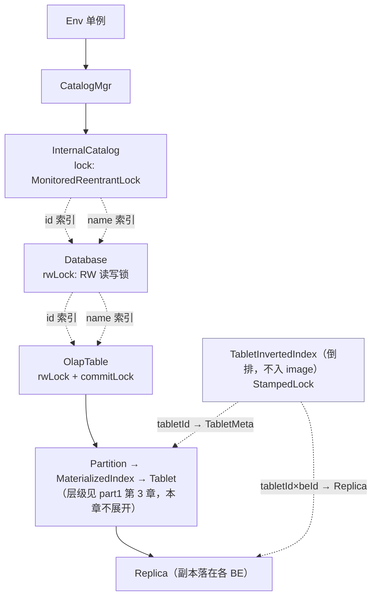

# 第 1 章：Catalog 体系与元数据内存结构

前三部分分别走完了查询链路（part2）和写入链路（part3）。这两条链路每往前一步，都要反复问 FE 同一类问题：这个库存在吗？这张表的 schema 是什么？这个 tablet 的三个副本落在哪些 BE 上、当前可见版本是多少？规划一条稍复杂的查询，这类元数据访问会发生几十上百次。第四部分转到 FE 内核，主线是**跟着一条元数据走完它的一生**——从诞生在内存、到持久化、到高可用复制、到（分离模式下）外移进 MetaService、再到被调度器消费。本章负责这一生的起点：元数据在 FE 内存里长什么样、怎么组织、被哪些锁保护。

本章讲的是**内存组织方式**，不是逻辑层级本身。Table→Partition→MaterializedIndex→Tablet 这套逻辑层级 [part1 第 3 章](../part1-architecture/03-data-model.md) 3.2 已经讲透，本章不重复；本章要回答的是另一组问题：这些对象在 JVM 堆里用什么容器装、为什么同一个库既按 id 又按 name 建两份索引、tablet 到 BE 的反向查找为什么要单独建一张倒排表、以及一整套读写锁如何在"高并发规划"与"低频 DDL 改结构"之间划清边界。

本章的行号引用基于写作时核实所用的 HEAD（`c967b279d3`，源码树与系列基线 `7bc98f696f` 一致）。代码演进会让行号漂移，但对象名与内存组织语义不变；写作时每一处 `路径:行号` 都在当前代码里核实过。

## 1.1 问题：元数据放哪、怎么组织才能又快又稳

**遇到了什么问题？** FE 是整个集群的大脑，每条 SQL 的解析、规划、权限校验都建立在"随手就能拿到最新元数据"这个前提上。这里有两个硬约束叠在一起：其一，**访问频次极高、延迟必须极低**——规划一条 join 查询要反复查库、表、列、分区版本、tablet 分布，任何一次访问慢一点，累积起来规划就慢一个数量级；其二，**必须强一致**——建表刚成功，紧接着的查询就得看到这张表，不能读到旧结构。海量、密集、低延迟、强一致的元数据访问，该把元数据放在哪、用什么结构组织，才能同时满足这几条？

**有哪些候选、各有什么优劣？**

- **候选一：外置元数据库（Hive Metastore 式）。** 元数据存在外部的关系库 / Metastore 里，FE 每次访问都发一次网络请求 + 一次 SQL 查询。优点是元数据容量不受单机内存限制、方案成熟、天然可被多个引擎共享。缺点对 OLAP 规划是致命的：**每次访问都是一次网络往返（毫秒级）**，规划一条查询的几十上百次访问累积成秒级延迟；而且 Metastore 本身成了一个外部单点与吞吐瓶颈，它一慢，所有 FE 都被拖住。
- **候选二：分布式 KV（FoundationDB 式）。** 元数据编码进分布式 KV，水平可扩、强一致。相比候选一，它把"单点"换成了"可扩展集群"，容量和弹性都更好。但**每次访问仍然是一次 RPC**——即便快过 HMS，也远高于本地内存访问，规划密集读元数据时依然扛不住裸访问，必须在计算侧再叠一层缓存把延迟补回来。
- **候选三：全内存镜像 + 日志复制。** 把**全部**元数据常驻 FE 的 JVM 堆，一次访问就是一次内存指针解引用（纳秒级）；任何修改先由唯一的 Master 串行写一条 editlog（日志复制给 Follower 保证多副本），再定期把内存快照 checkpoint 成 image 文件。优点是访问极快、且靠 Master 单点串行写天然强一致。代价也很实在：**受限于单机内存**——元数据规模一旦膨胀就撑爆 JVM 堆；**冷启动慢**——重启要先 load image 再回放增量 editlog 才能对外服务。

这三种候选可以粗略地按"访问延迟 / 容量上限 / 一致性成本"三个维度排一排：候选一延迟最高、容量最大、依赖外部单点；候选二延迟居中、容量随集群水平扩、一致性由 KV 保证；候选三延迟最低、但容量卡死在单机内存、一致性靠单点串行写。没有免费的午餐——延迟和容量在这里是直接对立的两端。

**Doris 怎么考量和解决的？** 存算一体形态选了候选三：全部元数据活在 FE 内存里，Master 独占写权、串行写 editlog，Follower/Observer 靠回放追平。这么选的核心理由就是第一约束——OLAP 规划对元数据的访问太密集，延迟是第一位的，只有全内存能把单次访问压到纳秒级；强一致则靠 Master 单点串行写来兜底。为把"重启要回放"的冷启动代价压下去，全内存模型配了两条持久化线：**增量的 editlog**（每条元数据变更追加一条）+ **定期的 image 快照**（把当前内存全量落一次盘），重启时先 load 最近的 image、再回放其后的增量 editlog 就能还原到最新——editlog、image、checkpoint 这三件事正是本部分第 2、3 章的主题，本章只需知道"内存是权威、这两条线是它的持久化影子"。但候选三的代价（受限于单机内存）不是可以忽略的小账：当 tablet 数量放大到百万级，FE 的堆内存、image 大小、checkpoint 耗时会一起顶到天花板。这正是 [part1 第 4 章](../part1-architecture/04-two-architectures.md) 4.1 列出的"第四堵墙：元数据内存瓶颈"——也正是存算分离把元数据从 FE 内存外移到 MetaService（背后 FDB，即候选二的思路）的直接动机。所以本章讲的存算一体全内存模型，和 ch4 讲的分离模式元数据外移，是同一个权衡的两个面：前者用单机内存换极致访问延迟，后者用一层 RPC + 缓存换容量与弹性。

## 1.2 源码走读：从 Env 到 Tablet 的内存对象树

FE 全局单例 `Env`（`fe/fe-core/src/main/java/org/apache/doris/catalog/Env.java:362`）是"FE 进程一切状态的根"，这一点 [part1 第 2 章](../part1-architecture/02-three-components.md) 已建立，本章不重复。元数据这一支从 `Env` 出发的路径是：`Env` → `catalogMgr`（`CatalogMgr`）→ 内部目录 `InternalCatalog` → `Database` → `OlapTable` → 逻辑层级。取内部目录的入口是 `Env.getInternalCatalog()`（`fe/fe-core/src/main/java/org/apache/doris/catalog/Env.java:708`），它转手委托给 `getCatalogMgr()`（`:692`）持有的 `CatalogMgr`（`fe/fe-core/src/main/java/org/apache/doris/datasource/CatalogMgr.java:81`）。`CatalogMgr` 管的是"多目录联邦"——内部目录之外还有 Hive、Iceberg 等外部目录（联邦扩展是 ch6 的主题），本章只盯内部目录 `InternalCatalog`（`fe/fe-core/src/main/java/org/apache/doris/datasource/InternalCatalog.java:198`，`implements CatalogIf<Database>`）。

从这里往下的层级本身 part1 第 3 章 3.2 已经讲过，本章不复述结构，只讲**内存怎么组织**，重点有三处。

**第一处：id 与 name 双索引，为什么两份都要。** `InternalCatalog` 里的库不是存一份，而是两份索引：

```java
private transient ConcurrentHashMap<Long, Database> idToDb = new ConcurrentHashMap<>();
private transient ConcurrentHashMap<String, Database> fullNameToDb = new ConcurrentHashMap<>();
```

（`fe/fe-core/src/main/java/org/apache/doris/datasource/InternalCatalog.java:207`-`208`）。同一个 `Database` 对象被两张表各引用一次。为什么不嫌浪费地建两份？因为访问元数据有两条本质不同的路径：**用户侧走 name**——`CREATE DATABASE`、`USE db`、SQL 里写的都是库名；**系统侧走 id**——editlog、image、事务、副本调度记录的全是 `dbId`。两者对稳定性的要求正好相反：name 是**可变的**（`RENAME DATABASE` 会改名，代码里改名只更新 `fullNameToDb`、把旧名摘掉换新名，见 `:839`、`:861`），id 是**建库时分配、终生不变的**。持久化和内部引用必须用不变的 id，否则一次改名就会让所有历史 editlog 里的引用失效；而对外展示、SQL 交互又必须用人能读的 name。双索引就是把"稳定引用"和"人类可读"两套需求各给一张表，改名时只动 `fullNameToDb`、`idToDb` 纹丝不动。`Database` 向下到 `OlapTable`（`fe/fe-core/src/main/java/org/apache/doris/catalog/OlapTable.java:135`）也是同样的 id/name 双索引套路。容器选 `ConcurrentHashMap` 而不是加锁的普通 map，是因为这一层**读远多于写**（规划疯狂读、DDL 偶尔写），并发读无需竞争锁。

还有一个值得留意的细节：这两张索引都标了 `transient`（`:207`-`208`）。也就是说持久化时并不直接序列化这两张 map——image 里存的是库对象本身，索引是加载后在内存里重建的派生结构。这与 1.2 后面要讲的 TabletInvertedIndex "不入 image、重启重建"是同一种设计哲学：**能从权威数据推导出来的索引，就不进持久化，只当内存加速结构**。连 `information_schema`、`mysql` 这两个内建的 MySQL 兼容库也是在 `InternalCatalog` 初始化时直接 `put` 进两张索引的（`:219`-`222`，`InfoSchemaDb`/`MysqlDb`），而不走建库的持久化路径。

**第二处：TabletInvertedIndex 倒排，为什么单独建。** 沿对象树从上往下是"正向"路径：库→表→分区→物化索引→tablet→副本。但 FE 有大量场景要**反着查**：BE 每次心跳上报一批 tablet 的状态，FE 要立刻知道每个 tablet 属于哪张表哪个分区、它的副本都在哪些 BE 上、该不该同步版本或触发修复；副本调度器要按 tablet 找副本。如果只有正向树，给一个裸 tabletId 反查归属，就得遍历所有库所有表——O(全集群)，完全不可行。所以 FE 单独维护一张倒排：抽象基类 `TabletInvertedIndex`（`fe/fe-core/src/main/java/org/apache/doris/catalog/TabletInvertedIndex.java:52`）持有 `tabletMetaMap`（`:63`，`Long2ObjectOpenHashMap<TabletMeta>`），把 tabletId 直接映射到它的 `TabletMeta`（`fe/fe-core/src/main/java/org/apache/doris/catalog/TabletMeta.java:25`，内含 table/partition/index id）。存算一体的实现 `LocalTabletInvertedIndex`（`fe/fe-core/src/main/java/org/apache/doris/catalog/LocalTabletInvertedIndex.java:68`）再叠一张 `replicaMetaTable`（`:72`，`HashBasedTable<Long, Long, Replica>`，即 tabletId × backendId → Replica），以及一张按 backendId 主键的反向表 `backingReplicaMetaTable`（`:76`），让"某 BE 上有哪些副本"也能 O(1) 拿到。

这张倒排最典型的消费者就是 **BE 心跳上报**：每个 BE 周期性把自己盘上所有 tablet 的状态汇报上来，FE 侧的 `tabletReport` 拿着一批裸 tabletId，要逐个判断"这个 tablet 在元数据里还存不存在、副本版本对不对、要不要同步或删除"。有了倒排，这一步是对每个 tabletId 做 O(1) 的 map 查找；没有倒排，就得对每次上报做一遍全树扫描，心跳频率下根本扛不住。所以倒排不是锦上添花，而是"BE 状态汇报"这条高频路径能成立的前提。

这张倒排有两个容易被忽略的设计点。其一，**它不写进 image**——类头注释写得很直白：checkpoint 线程无需修改这个倒排，因为所有元数据都在正向 catalog 里，倒排会在 FE 重启时重建。也就是说它是纯粹的内存派生索引，持久化只认正向树。其二，**它的并发容器和锁选型和上层不同**：key 用 fastutil 的 `Long2ObjectOpenHashMap`（原始 `long` 键、免装箱），锁用 `StampedLock`（`:60` 附近，支持乐观读）。原因是 tablet 数量级远大于库表数——百万级 tablet 下，`Long`/`ConcurrentHashMap` 的对象头和装箱开销会明显占内存，原始 long map 更省；而 tablet 上报是高频读、低频写，`StampedLock` 的乐观读比读写锁更轻。

**第三处：对象/索引/锁关系图。** 把上面两处拼起来，内存里的元数据不是一棵单纯的树，而是"一棵正向树 + 两套旁路索引 + 三层锁"：



图里刻意突出两件本章的主角：虚线是**索引边**（双索引、倒排索引，均不复述层级本身），每个节点标注了**保护它的锁类型**。下面 1.3 专讲锁，这里先把两个 tricky 点说清。

**tricky 点：内存元数据的"权威时刻"——只有 Master 的内存是权威的。** part1 第 2 章已证：`Env.isMaster()` 就一句 `feType == FrontendNodeType.MASTER`，且**只有 Master 能写 editLog**。这句话在内存视角下有个直接推论：**任一时刻，只有 Master 进程内存里的元数据是权威版本**。Follower 和 Observer 的内存不是自己算出来的，而是靠一个后台 `replayer` 线程不断回放 Master 产生的 editlog"追"上来的（回放循环见 `fe/fe-core/src/main/java/org/apache/doris/catalog/Env.java:3146` 起）。回放有延迟，于是存在一个**stale-read 窗口**：Master 上刚建好一张表、editlog 刚写下，但某个 Observer 还没回放到那一条，此刻在这个 Observer 上查这张表就是"查不到"。Doris 给这个窗口设了上限 `meta_delay_toleration_second`（`fe/fe-common/src/main/java/org/apache/doris/common/Config.java:243`，默认 300 秒）：非 Master 一旦发现自己落后 Master 超过这个阈值，就把 `canRead` 置 false、**主动停止对外读服务**，宁可不服务也不返回太旧的元数据。**错写会怎样**：如果运维脚本或应用误以为"连上任意一个 FE 读到的都是最新的",在负载均衡后面对着 Observer 建表后立刻查询，就会间歇性地"建表成功但查不到"——根因不是 bug，而是没理解权威只在 Master、非 Master 有回放窗口。想读到强一致的最新元数据，要么连 Master，要么容忍这个窗口。

**易错点：tablet 元数据放大在 FE 内存的真实占用，以及 checkpoint 的翻倍峰值。** part1 第 3 章 3.2 tricky 点二给过那个会出事的乘积：**单表 tablet 总数 = 分区数 × 分桶数 × 副本数 ×（1 + rollup 个数）**，一张按天两年、64 分桶、3 副本、1 rollup 的表就能到 28 万 tablet，而集群有成百上千张表。回到本章的内存视角，把这笔账落到具体对象上：每个 tablet 在 FE 内存里至少对应正向树上的一个 `Tablet` 对象、每个副本一个 `Replica` 对象，外加倒排里 `tabletMetaMap` 的一条 `TabletMeta` 和 `replicaMetaTable` 里每副本一格。tablet 数线性放大，这几类对象就线性放大，直接顶高 FE 的 JVM 堆。**更隐蔽的是 checkpoint 时的翻倍峰值**：把内存元数据快照成 image，需要在内存里完整地序列化一份，这一刻内存里近似同时存在"运行态的元数据"和"正在被写出的那一份"，峰值内存接近翻倍——这也是 part1 3.2 里"checkpoint 变慢""Full GC 频繁"那几个症状的内存侧根因。checkpoint 具体怎么做、翻倍峰值如何被 checkpoint 独立线程/独立进程手段规避，是**第 2 章**的正题，本章只在这里埋下这颗种子，第 2 章会讲 checkpoint 翻倍并把这半边账补完。

## 1.3 源码走读：锁模型

内存对象树是被高并发访问的：无数查询线程在读、少数 DDL 线程在改。保护它的是一套**分层读写锁**，共三层。

**第一层是库表对象上的读写锁。** `Database` 用 `MonitoredReentrantReadWriteLock rwLock`（`fe/fe-core/src/main/java/org/apache/doris/catalog/Database.java:96`，构造时 `new MonitoredReentrantReadWriteLock(true)` 传 `true` 即**公平锁**，见 `:154`），对外暴露 `readLock()`/`writeLock()`/`tryWriteLock(timeout, unit)`（`:181`-`214`）。`OlapTable` 的读写锁在其基类 `Table`（`fe/fe-core/src/main/java/org/apache/doris/catalog/Table.java:66`）上，同样是公平的 `MonitoredReentrantReadWriteLock rwLock`（`:85`、`:138`），此外还多一把 `commitLock`（`:89`，`MonitoredReentrantLock`）——它和读写锁是**两把独立的锁**，用于导入提交路径上需要串行、但又不想升级成表写锁（那会挡住所有查询读）的场景，把"提交互斥"与"结构读写"解耦。锁类型本身用了 Doris 自己包装的 `MonitoredReentrantReadWriteLock`（`fe/fe-core/src/main/java/org/apache/doris/common/lock/MonitoredReentrantReadWriteLock.java`）而非裸 JUC 锁，是为了带上"谁持有、持有多久"的监控能力——`tryWriteLock` 超时后能打印出当前持锁线程，方便排查锁等待（见下文症状 B）。用**读写锁**而非互斥锁，是因为访问模式极度读多写少：查询规划只需 `readLock`（彼此不互斥、可高并发），只有 DDL 改结构才拿 `writeLock`（与所有读互斥）。

`Table` 还埋了一个排查用的小机关：`readLockThreads`（`fe/fe-core/src/main/java/org/apache/doris/catalog/Table.java:128`），当 `Config.check_table_lock_leaky`（`fe/fe-common/src/main/java/org/apache/doris/common/Config.java:136`，默认 `false`）打开时，每次加读锁都会记下持锁线程（`:185`-`187`）。它专治"读锁泄漏"——某个线程拿了读锁忘了释放，会让后续的写锁（DDL）永远等不到。这是读写锁的一个隐蔽陷阱：读锁可重入、可并发，漏解一次不会立刻出问题，但会悄悄卡死后来的写者；打开这个开关就能把泄漏的线程栈揪出来。默认关闭是因为记录本身有开销。

**第二层是目录级锁。** `InternalCatalog` 自己持有一把 `MonitoredReentrantLock lock`（`fe/fe-core/src/main/java/org/apache/doris/datasource/InternalCatalog.java:206`），注意它是**互斥锁不是读写锁**，用来保护"库集合"这一层的结构性变更（建库、删库要动 `idToDb`/`fullNameToDb`）。它的用法很讲究——不是直接 `lock()`，而是 `tryLock` 加超时（`:320`-`325`），超时时间是 `catalog_try_lock_timeout_ms`（`fe/fe-common/src/main/java/org/apache/doris/common/Config.java:940`，默认 5000ms，注解为 `@ConfField(mutable = true)` 即可运行时热更）。代码里那行注释点明了动机：`// Use tryLock to avoid potential dead lock`（`:320`）。拿不到锁就超时放弃、报错返回，而不是无限等下去——这是死锁的**兜底**手段。

**锁顺序约定在哪里。** 当一个操作要同时锁住多个对象（例如一次涉及多张表的 DDL、或跨库操作），加锁顺序就成了死锁的关键。Doris 把这条约定写进了工具类 `MetaLockUtils`（`fe/fe-core/src/main/java/org/apache/doris/common/util/MetaLockUtils.java`）的类注释里：

> In order to escape dead lock, meta object in list should be sorted in ascending order by id first, and then MetaLockUtils can lock them.

即**批量加锁前，先把待锁对象按 id 升序排好，再依次加锁**。`MetaLockUtils` 提供 `readLockTables`/`writeLockTables`/`tryWriteLockTablesIfExist` 等一批方法（`:48` 起），共同的模式是：**正序加锁、逆序解锁**（解锁循环都是 `for (i = size-1; i >= 0; i--)`）；`try*` 版本在中途某把锁失败时，会把已拿到的锁逆序释放再返回，不留悬挂锁。全系统所有多对象加锁都走同一个升序 id 的全局顺序，就从根上消除了"AB / BA"式的循环等待。

**tricky 点：大 DDL 持库写锁，阻塞查询规划的连锁反应。** schema change、加/删分区这类 DDL 会拿 `Database` 或 `Table` 的 `writeLock`。写锁与读锁互斥，而查询规划需要拿同一对象的 `readLock` 去读 schema、分区、tablet 分布。于是一个跑得久的大 DDL 持写锁期间，落在同一张表上的查询规划全部卡在 `readLock` 上等待——**表现为 `SHOW` 类命令和查询突然集体变慢甚至超时**，但 CPU 并不忙。**错写会怎样**：如果把一个耗时操作（比如同步等待某个慢 RPC）放进写锁临界区，就会把这段等待放大成全表查询的停顿。Doris 的规避思路是尽量缩小写锁临界区、把耗时工作挪到锁外，并用前面的 `tryWriteLock` + 监控在等不到时暴露持锁者。

**易错点：跨库操作的锁顺序死锁——经典构造与 Doris 的规避。** 死锁的经典构造是：线程 1 先锁 dbA、再想锁 dbB；线程 2 先锁 dbB、再想锁 dbA——两者持有对方想要的锁、互相等待，形成循环。Doris 的规避正是 `MetaLockUtils` 那条"按 id 升序加锁"约定：无论线程 1 还是线程 2，只要都通过升序排序后再加锁，就一定是先锁 id 小的、再锁 id 大的，全局统一顺序下不可能构成反向的循环等待。再叠加 `InternalCatalog` 那把互斥锁的 `tryLock` + `catalog_try_lock_timeout_ms` 超时兜底，即便某处漏走了排序约定，也不会永久卡死而是超时报错、留下持锁者线索。这里要诚实：升序 id 是**约定**，靠调用方统一走 `MetaLockUtils`（或自己排序）来保证，代码注释是这条约定的唯一权威出处，语言层面并不强制。

## 1.4 双模式对比

分离模式下 FE 的元数据内存组织**骨架不变**：`CloudEnv`（`fe/fe-core/src/main/java/org/apache/doris/cloud/catalog/CloudEnv.java:73`）继承 `Env`，`CatalogMgr`→`InternalCatalog`→`Database`→`OlapTable` 这套正向树和 id/name 双索引完全复用，1.3 的锁模型也一样适用。差异集中在两处。

其一，**倒排索引换了实现**：存算一体是 `LocalTabletInvertedIndex`（维护 tablet→本地 BE 副本的映射，因为副本是 BE 本地盘上的 3 份实体），分离模式是 `CloudTabletInvertedIndex`（`fe/fe-core/src/main/java/org/apache/doris/cloud/catalog/CloudTabletInvertedIndex.java`）。分离模式下数据在对象存储上、逻辑上只有 1 份副本，tablet 的**位置与版本的权威不在 FE 内存、而在 MetaService（背后 FDB）**；FE 侧持有的更接近一份**缓存视图**，需要时向 MetaService 查询/刷新。这直接呼应 1.1：分离模式就是把"元数据权威"从 FE 内存（候选三）迁到了外部分布式 KV（候选二）。

其二，`CloudEnv` 多挂了几个云上专属组件，例如缓存热点管理 `cacheHotspotMgr`（`:82`、`:103`）、云上副本再均衡 `cloudTabletRebalancer`（`:102`）等，它们服务于对象存储 + File Cache 的形态。反过来，存算一体那套"本地副本"相关的内存结构在分离模式下大幅退化：既然逻辑上只有 1 份副本、数据在对象存储上天然冗余，本地副本调度、副本修复那一整套就无事可做（这一点 part1 4.3 已从"3 副本对 1 副本"的角度点过）。所以分离模式的 FE 内存不是"存算一体 + 一些云组件"，而是"骨架复用 + 副本侧瘦身 + 权威外移"三件事同时发生。

这些"元数据变成 MetaService 缓存视图后，FE 内存里还剩什么、少了什么"的完整账，以及缓存与 MetaService 之间如何保持一致，是 **ch4 分离模式专章**的正题，本章点到为止。

## 1.5 动手实验：量化 FE 元数据的内存占用

实验环境沿用 part1 第 5 章，不重复。本实验有两个目的：**核心目的**是用真实接口看清 FE 元数据内存由什么构成、建表如何推高它；**易错点目的**是主动构造一张高分区 × 高分桶的表，把 part1 3.2 的"放大效应"在 FE 侧量化，并观察它对内存与 checkpoint 的冲击。

用到的都是现成接口，无需改代码：

- `SHOW PROC '/statistic'`：由 `StatisticProcNode`（`fe/fe-core/src/main/java/org/apache/doris/common/proc/StatisticProcNode.java:42`）实现，逐库列出 `TableNum`/`PartitionNum`/`IndexNum`/`TabletNum`/`ReplicaNum`，末行 `Total` 汇总全集群。这是把"放大效应"变成数字的最直接入口。
- FE metrics 端点（FE HTTP 端口的 `/metrics`）里的 `jvm_heap_size_bytes`（指标名定义见 `fe/fe-core/src/main/java/org/apache/doris/metric/PrometheusMetricVisitor.java:55`），配合 `type="used"` 观察堆已用量。
- `jmap -histo:live <FE_PID>`：从 JVM 侧看 `Replica`、`Tablet`、`TabletMeta` 这些对象的实例数，与 `/statistic` 的 `ReplicaNum` 相互印证。

**核心步骤（建表前后对比）：**

1. 记录基线：`SHOW PROC '/statistic'` 看 `Total` 行的 `TabletNum`/`ReplicaNum`；`curl` 一次 `/metrics` 抓 `jvm_heap_size_bytes{type="used"}`。
2. 建一张 1000 分区、每分区 4 分桶、3 副本的表（存算一体默认 3 副本），灌少量数据让分区落地。
3. 再次看 `/statistic` 与堆内存：`TabletNum` 增量应约等于 1000 × 4 =4000，`ReplicaNum` 约 12000；堆 `used` 相应上抬。用 `jmap -histo` 确认 `Replica` 实例数增量与 `ReplicaNum` 量级吻合——这就把"一个 tablet/副本 = FE 堆里一组常驻对象"从抽象变成了可数的数字。

**易错点步骤（主动踩放大效应）：**

4. 再建一张**故意高放大**的表：例如 1000 分区 × 64 分桶 × 3 副本，`ReplicaNum` 一张表就逼近 19 万。对比第 2 步那张表，`/statistic` 的增量和堆内存的抬升会陡峭得多——同样"一张表"，分桶数从 4 拍到 64，FE 内存代价差了一个量级。这正是 part1 3.2 警告的"建表时一个拍脑袋的分桶数"埋下的雷，在 FE 侧被直接量化出来。
5. 观察 checkpoint 侧的影响：元数据越大，image 越大、checkpoint 越慢、checkpoint 时的内存峰值越高（1.2 埋的翻倍峰值）。本章只能观察到"元数据规模上去了"这半边；checkpoint 耗时与翻倍峰值的完整测量属于 **ch2 的实验**，那里会接着这颗种子把另一半账测完。诚实地说，本实验到此为止只证明了"输入端（元数据规模）被放大"，没有证明"输出端（checkpoint 代价）"——后者留给第 2 章。

一个配置可变性提醒：实验中若想调 `catalog_try_lock_timeout_ms` 观察目录锁超时行为，它是 `@ConfField(mutable = true)`（已核实，见 1.3），可用 `ADMIN SET FRONTEND CONFIG` 运行时热更，无需重启 FE。相对地，实验做完记得把故意造出来的高放大表删掉——那 19 万个 `Replica` 对象不会因为你不查它就释放，它们会一直常驻 Master 的堆，直到表被 drop、且经过回收才真正消失。

## 1.6 排查清单

- **症状 A：FE 内存持续增长 / Full GC 频繁。** 大概率是 tablet 元数据放大（1.2 易错点）。路径：`SHOW PROC '/statistic'` 看 `Total` 行的 `TabletNum`/`ReplicaNum` 有多大、集中在哪些库；对可疑表核对"分区数 × 分桶数 × 副本数 ×（1+rollup）"是不是被拍得过大；结合 `jmap -histo` 看 `Replica`/`Tablet` 实例数确认。缓解方向：合并过细的分区、下调新表分桶数、或（治标）加大 FE 堆。根因往往是建表期的分桶决策，改起来代价高，越早发现越好。
- **症状 B：`SHOW` / 建表命令突然集体变慢（锁等待）。** 大概率是大 DDL 持库/表写锁，阻塞了同对象上的读锁（1.3 tricky 点）；或目录级 `InternalCatalog.lock` 被长时间持有。路径：看是否有正在执行的 schema change / 加分区等长事务；`MonitoredReentrantLock` 在 `tryLock` 超时时会打印持锁线程（`catalog_try_lock_timeout_ms` 到点后日志里有 `catalog lock is held by ...` 线索），据此定位是谁把锁攥着不放。缓解：等大 DDL 结束，或排查是否有耗时操作被误放进了写锁临界区。
- **症状 C：FE OOM 后如何用更大堆重启。** 元数据全内存意味着堆必须装得下"运行态元数据 + 回放/加载所需的临时开销"。路径：确认 OOM 是元数据撑爆（结合症状 A 的 `/statistic` 数字）而非查询侧内存；在 `fe.conf` 的 `JAVA_OPTS`/`JAVA_OPTS_FOR_JDK_17` 里调大 `-Xmx` 后重启。要点是：**重启时 FE 要先 load image 再回放增量 editlog 才能对外服务**，这个过程本身也吃内存，若 image 已接近旧堆上限，必须先把堆加够再启动，否则会在启动阶段再次 OOM。此外，OOM 往往先砸在 Master 上（它承担全部元数据写 + checkpoint），Follower 可能还活着——但别指望 Follower 顶上就没事，它的内存结构和 Master 同构，同样的元数据规模换台机器也一样会爆，加堆要对全体 FE 一起加。若单机堆已顶到物理内存天花板仍不够，那就不是加堆能解决的了——这正是 1.1 说的"受限于单机内存"这堵墙，也是走向存算分离（ch4）的现实信号。至此，一条元数据在内存里的"诞生形态"就讲完了：它活在 Master 的堆里、被双索引和倒排加速、被三层锁保护；下一章起，跟着它走向持久化。
