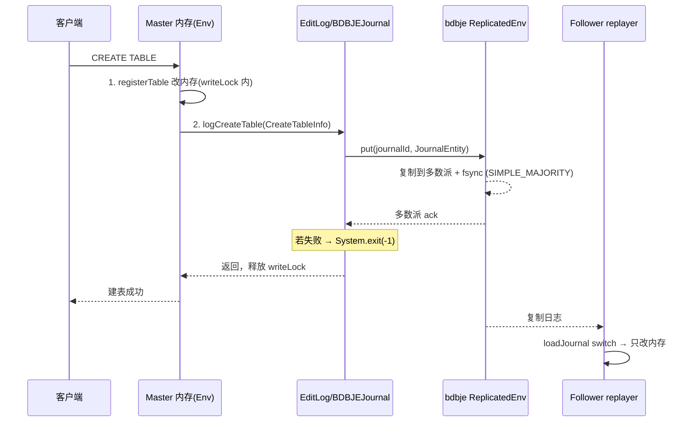

# 第 2 章：元数据持久化 —— EditLog、bdbje 与 Checkpoint

[第 1 章](./01-catalog-and-memory.md) 讲清了元数据在 FE 内存里的"诞生形态"：它活在 Master 的 JVM 堆里、被双索引和倒排加速、被三层锁保护。但 1.1 已经点破全内存模型的死穴——全内存是"权威"，可进程一重启内存就清零。本章接着这条线往下走：一条元数据变更如何被落盘、如何被复制到其它 FE、内存快照又如何定期成像。换句话说，第 1 章讲的是"内存里的权威"，本章讲的是"这份权威怎么活过进程重启、活过 Master 宕机"。

本章的行号引用基于写作时核实所用的 HEAD（`65e9881e54`，源码树与系列基线 `7bc98f696f` 一致）。代码演进会让行号漂移，但持久化的对象名与语义不变；每一处 `路径:行号` 都在当前代码里核实过。

## 2.1 问题：全内存元数据怎么不丢

**遇到了什么问题？** 第 1 章定下的前提是：元数据全常驻内存、只有 Master 能改。这带来极致的访问延迟，却也把"持久性"这道题原封不动地留给了本章——JVM 进程一旦退出（正常重启、OOM、kill、宕机），堆里那份权威元数据就灰飞烟灭。更棘手的是，FE 不是单机，是一主多从的集群：Master 改了元数据，Follower 的内存必须跟着变，否则一旦主从切换，新 Master 的内存就是错的。所以这道题其实是两道题叠在一起：**怎么让内存元数据活过进程重启（持久化）**，以及**怎么让多个 FE 的内存收敛到同一份（复制）**。

**有哪些候选、各有什么优劣？**

- **候选一：每次变更全量落盘。** 每改一次元数据，就把整个内存镜像写一遍盘。语义最简单、重启只需读最后一份镜像。但写放大完全不可接受——元数据镜像动辄几百 MB 到几 GB，一次 `ALTER` 改一个属性就要重写整份，磁盘和延迟都扛不住。
- **候选二：只写 WAL（预写日志），不做快照。** 每次变更追加一条日志（增量、极小），重启时从头回放所有日志重建内存。写入代价降到最低，但**回放窗口无限增长**——集群跑一年，日志攒到几千万上亿条，重启要从第一条回放到最后一条，冷启动能到小时级，实际不可用。
- **候选三：WAL + 定期快照。** 增量变更走 WAL（追加一条日志），同时**定期**把当前内存全量落一次快照（image/checkpoint）；重启时先加载最近的快照、再只回放快照之后的那一小段增量日志。这正是 HDFS NameNode 的 editlog + fsimage 经典组合：日志摊薄了写入代价，快照截断了回放窗口，两者互补。代价是多了一个"定期做快照"的后台负担，以及快照与日志之间的版本对齐问题。

候选三已是业界共识，但它只解决了"持久化"半道题，"复制"那半道还悬着。日志本身可以存两种地方：**存本地文件**（每个 FE 各写各的，复制要另起一套同步机制），或**存进一个复制状态机**（日志天生就是多副本、还自带选主）。Doris 选了后者——用 Oracle 的 Berkeley DB Java Edition（bdbje）的 Replicated Environment 当日志存储：一条日志写进 bdbje，就自动被复制到多数派 Follower 并落盘。

**Doris 怎么考量和解决的？** 存算一体形态用的正是候选三 + bdbje 复制状态机，一石二鸟：

- **持久化**：增量走 editlog（每条元数据变更追加一条日志），定期由 Checkpoint 线程把内存快照成 image 文件；重启 = 加载最近 image + 回放其后 editlog。
- **复制与选主**：editlog 不落本地文件，而是写进 bdbje 的 `ReplicatedEnvironment`。一条日志只有被**多数派**（`SIMPLE_MAJORITY`）确认才算写成功，这同一套多数派协议又直接充当 FE 的选主基础——谁是 Master、日志复制到哪、选举怎么进行，全托管给 bdbje。第 3 章的高可用/选主正是建立在这一层之上。

一石二鸟的代价也很实在：**bdbje 是个黑盒依赖**。它的复制、选主、磁盘管理都在库内部，出问题时 FE 只能看到"写日志超时""无法加入复制组"这类外部症状，排查往往要下沉到 bdbje 自身的日志和磁盘状态（2.6 排查清单会回到这点）。Doris 用 `edit_log_type`（`fe/fe-common/src/main/java/org/apache/doris/common/Config.java:214`，默认 `"bdb"`）留了个抽象口子——`EditLog` 构造时据此在 `BDBJEJournal` 与 `LocalJournal` 间二选一（`fe/fe-core/src/main/java/org/apache/doris/persist/EditLog.java:186`-`191`）——但生产上 `LocalJournal` 只用于单机测试，真正扛复制与选主的始终是 bdbje。

## 2.2 源码走读：一次 DDL 的日志之旅

跟着一次 `CREATE TABLE` 走完它的持久化之旅。入口是 `InternalCatalog.createTable`（`fe/fe-core/src/main/java/org/apache/doris/datasource/InternalCatalog.java:1230`），一路分析建表结构后，落到 `Database.createTableWithLock` → `createTableWithoutLock`（`fe/fe-core/src/main/java/org/apache/doris/catalog/Database.java:422`）。这个方法只有几十行，却藏着本章第一个、也是最容易想当然的 tricky 点。

**tricky 点：先改内存，还是先写日志？** 直觉上"预写日志"三个字暗示"先写日志、再改内存"。但 Doris 的真实顺序恰恰相反。看 `createTableWithoutLock` 的临界区（`fe/fe-core/src/main/java/org/apache/doris/catalog/Database.java:437`-`457`），整段在 `table.writeLock()` 保护下依次做两件事：

```java
table.writeLock();
try {
    registerTable(table);                    // 第一步：改内存，表此刻在 idToTable/nameToTable 里可见
    // ...
    if (!isReplay) {
        // Write edit log
        CreateTableInfo info = new CreateTableInfo(fullQualifiedName, id, table);
        Env.getCurrentEnv().getEditLog().logCreateTable(info);   // 第二步：写日志
    }
} finally {
    table.writeUnlock();
}
```

`registerTable`（`fe/fe-core/src/main/java/org/apache/doris/catalog/Database.java:463`）把表塞进 `idToTable`/`nameToTable` 是**第一步**，`logCreateTable` 写日志是**第二步**。也就是**先改内存、后写日志**。这为什么是对的、错写会怎样，要从两处细节看。

其一，**这个顺序保证 Master 与 Follower 不会分叉**。Master 是先在内存里真正完成建表（分配 id、校验重名、构建对象），确认这一切成功之后，才把这个"既成事实"编码成 `CreateTableInfo` 写进日志。日志记录的是一个**已经在 Master 内存里成立**的操作。假如反过来先写日志、再改内存：一旦日志写成功、但接下来内存应用抛了异常（重名冲突、非法结构），Master 自己没建成这张表，而 Follower 只认日志、会照单全收地把表建出来——**Master 与 Follower 就此分叉**。先改内存后写日志，等于用"内存应用成功"当作"日志值得被记"的前置条件。

其二，**写日志失败时进程自杀，这才让"内存先行"变得安全**。`logCreateTable` 最终走到 `EditLog.logEditDirectly`（`fe/fe-core/src/main/java/org/apache/doris/persist/EditLog.java:1664`），其中 `journal.write` 一旦抛出任何 `Throwable`（IOException、OOM、多数派写不成），代码不是 catch 后返回，而是直接 `System.exit(-1)`（`:1668`-`1675`）。含义是：如果这条日志没能持久化并复制成功，Master 就**带着那个尚未提交的内存变更一起去死**——重启后从最后一条已持久化的日志开始回放，这张没写进日志的表压根不曾存在。反过来说，**错写会怎样**：假如把 `System.exit` 改成"记个错误日志继续跑"，Master 内存里就留下一张既没落盘、也没复制给任何 Follower 的"幽灵表"；一旦发生主从切换或重启，这张表凭空消失，或者更糟——不同 FE 对同一张表各执一词。`System.exit` 是这套"内存先行"设计的安全阀：宁可让整个进程崩溃，也不容忍未提交状态存活。

由此得出本章第一条不变式：**一次元数据变更"提交成功"当且仅当它的 editlog 被多数派确认**。内存与日志必须一致，靠两件事强制——(a) 在同一把写锁下"先应用、后记日志"，且日志按锁获取顺序进队列（FIFO）；(b) 日志写失败即自杀。客户端拿到"建表成功"的回执，也一定发生在 `logCreateTable` 返回（即日志已多数派落盘）之后；在内存已改、日志未确认的那个瞬间窗口里，变更对客户端不可见（调用还没返回、还攥着写锁），对 Follower 也不可见（Follower 只回放已提交的日志）。

**日志怎么编码：JournalEntity + OperationType。** `logCreateTable` 把变更包装成一条日志。每条日志就是一个 `JournalEntity`（`fe/fe-core/src/main/java/org/apache/doris/journal/JournalEntity.java:160`），它的序列化格式极简（`:196`-`199`）：先写一个 `short` 的 **opCode**（操作类型码），再写 `data` 本身。opCode 取自 `OperationType`（`fe/fe-core/src/main/java/org/apache/doris/persist/OperationType.java:26`）里的常量，建表用 `OP_CREATE_TABLE`。`data` 则是各操作自己的持久化对象，例如 `CreateTableInfo`（`fe/fe-core/src/main/java/org/apache/doris/persist/CreateTableInfo.java`），它的 `write` 是一句 Gson 序列化（`Text.writeString(out, GsonUtils.GSON.toJson(this))`，`:91`-`93`），字段全用 `@SerializedName` 标注。

**写进 bdbje：多数派确认。** 日志下沉到 `BDBJEJournal.write`（`fe/fe-core/src/main/java/org/apache/doris/journal/bdbje/BDBJEJournal.java:230`）：以自增的 journalId 为 key、`JournalEntity` 序列化后的字节为 value，`currentJournalDB.put(...)` 写进 bdbje（`:273` 附近）。这个 `put` 会阻塞到满足 durability 要求——由 `master_sync_policy`（`fe/fe-common/src/main/java/org/apache/doris/common/Config.java:250`，默认 `SYNC`，即 fsync 落盘）与 `replica_ack_policy`（`:259`，默认 `SIMPLE_MAJORITY`，即多数派 Follower 确认）共同定义。若写入时本节点已不再是 Master（bdbje 抛 `ReplicaWriteException`），说明发生了主从切换，代码同样选择退出（`:288` 附近），把写权干净地让给新 Master。

**回放侧：loadJournal 的 switch 巨表。** Follower/Observer 的 `replayer` 线程（第 1 章 1.2 已述）不断从 bdbje 读出新日志，交给 `EditLog.loadJournal`（`fe/fe-core/src/main/java/org/apache/doris/persist/EditLog.java:315`）回放。回放的核心是一张按 opCode 分发的巨型 `switch`：读到 `OP_CREATE_TABLE` 就 `CreateTableInfo.read`（Gson 反序列化）再走建表的回放路径。注意回放走的是 `isReplay=true` 分支——它**只改内存、不再写日志**（`fe/fe-core/src/main/java/org/apache/doris/catalog/Database.java:450` 的 `if (!isReplay)`），确保日志始终单一源自 Master，Follower 绝不二次产日志。反序列化的分发同样是一张 `switch`：`JournalEntity.readFields`（`fe/fe-core/src/main/java/org/apache/doris/journal/JournalEntity.java:201`）先读 opCode，再 `case` 到对应类的 `read` 方法。

整条链路串起来：



**顺便说清一个易被忽略的细节：日志是批量异步刷的，但顺序不乱。** `enable_batch_editlog`（`fe/fe-common/src/main/java/org/apache/doris/common/Config.java:239`，默认 true）打开时，`logEdit` 不直接写 bdbje，而是把请求塞进一个阻塞队列 `logEditQueue`，由一个后台 `EditLog-Flusher` 线程 `drainTo` 出一批（上限 `batch_edit_log_max_item_num`，`:224`，默认 100）合并成一个 `JournalBatch` 一次写下（`fe/fe-core/src/main/java/org/apache/doris/persist/EditLog.java:206`-`217`）——这是把"每条日志一次 fsync + 一次多数派往返"的固定开销摊到一批上，提升吞吐。但批量不能破坏顺序，否则回放出来的元数据就错了。顺序靠两点保证：其一，入队是 FIFO 的，且调用方**在写锁内**入队（源码注释 `:1621`-`1633` 明说"在写锁内调用能保证日志按锁获取顺序排列"），锁的串行化直接决定了队列里的先后；其二，写完之后调用方要 `await` 到这批真正落盘才返回，durability 语义没被异步削弱。所以"批量异步刷盘"提升的是吞吐，"写锁 + FIFO 队列"守住的是全局顺序，两者不冲突。**错写会怎样**：若在写锁外入队、或让多个线程乱序进队列，回放时先建分区的日志排到了建表之前，回放直接崩。

**易错点：OperationType 新增字段的兼容规则。** FE 是独立编译、独立升级的进程，滚动升级或回滚时，新版本要能读旧版本写下的日志与 image，反之也不能崩。这套跨版本兼容靠两层纪律：

第一层是 **opCode 只增不改号**。`OperationType` 里的操作码是仅追加的：废弃的码永久保留、绝不复用。最直白的活教材是 `OP_CREATE_DB = 1`，它被标了 `@Deprecated`、注释写着 "deprecated, use OP_NEW_CREATE_DB instead"（`fe/fe-core/src/main/java/org/apache/doris/persist/OperationType.java:31`），新建库改用另一个更大的码，但 `1` 这个码连同它的回放分支要**永远**留着——`loadJournal` 里 `OP_CREATE_DB` 的 case 至今保留，注释明说"deprecated in 4.0，保留只为 3.x→4.0 升级时回放旧日志"。**错写会怎样**：若图省事把某个废弃码的编号让给新操作，旧集群升级后回放到那条老日志，会拿新码去 `case`、分发到错误的 `read` 方法，反序列化出垃圾或直接抛异常——**表现为 FE 启动阶段回放失败、整个节点起不来**，且因为是历史日志触发，极难定位。

第二层是**字段级用 Gson 的名字匹配容忍增删**。持久化对象用 `@SerializedName` 标注字段名，Gson 按**名字**（而非位置）匹配：新版本给 `CreateTableInfo` 加一个字段，去读旧日志（那时还没这个字段）时 Gson 找不到就留默认值/null，不报错；旧版本读新日志时，多出来的字段被忽略。所以**加字段是安全的，改名/删名是危险的**——改掉一个 `@SerializedName` 而不留兼容别名，等于让所有历史日志里那个字段静默丢失。

这一层纪律和 [part1 第 2 章](../part1-architecture/02-three-components.md) 2.5 讲的 gensrc thrift/proto 契约"字段只加不改号"是**同一条铁律的两个落点**：那里是 FE↔BE 跨进程 RPC 的按编号匹配，这里是 FE 自身跨版本持久化的按 opCode 分发 + 按字段名匹配。机制不同（编号 vs 名字），纪律相同——**只增不改、废弃不复用**，都是为了让独立升级的组件在版本共存期不静默错乱。

## 2.3 源码走读：Checkpoint 与镜像

只有 editlog、没有 image，就是 2.1 的候选二：回放窗口无限增长。Checkpoint 线程负责定期把内存快照成 image、截断这个窗口。它由 `Checkpoint`（`fe/fe-core/src/main/java/org/apache/doris/master/Checkpoint.java:62`）实现，继承 `MasterDaemon`，且**只在 Master 上启动**——它在 `Env.startMasterOnlyDaemonThreads`（`fe/fe-core/src/main/java/org/apache/doris/catalog/Env.java:1966`-`1975`）里被 `new` 出来并 `start()`，线程名就叫 `leaderCheckpointer`。这句"只在 Master 上跑"是理解下面内存翻倍的关键前提。

**触发条件：image 落后于 finalized 日志。** 核心逻辑在 `doCheckpoint`（`fe/fe-core/src/main/java/org/apache/doris/master/Checkpoint.java:99`）。它先比两个数（`:115`-`121`）：`imageVersion` = 现有最新 image 对应的 journalId，`checkPointVersion` = `editLog.getFinalizedJournalId()`（已"封存"的最大 journalId）。只有当 `imageVersion < checkPointVersion`——即上次成像之后又攒下了新的封存日志——才做一次 checkpoint。"封存"来自 `edit_log_roll_num`（`fe/fe-common/src/main/java/org/apache/doris/common/Config.java:221`，默认 50000）：每写 `edit_log_roll_num` 条日志，`EditLog` 就 roll 一次、开一个新的 bdbje database（`:1681`-`1685`），旧的那个即被封存；`getFinalizedJournalId`（`fe/fe-core/src/main/java/org/apache/doris/journal/bdbje/BDBJEJournal.java:706`）返回的正是最后一个已封存 database 之前的边界 id。所以 `edit_log_roll_num` 越小，日志滚动越频繁、checkpoint 触发越密（实验会用它主动触发一次）。Checkpoint 线程本身的调度周期是 `checkpoint_interval_second`（见 `Checkpoint` 构造，`:75`），到点跑一轮、够条件才真正成像。

**真实的成像机制：同进程里的第二个 Env（第 1 章伏笔回收）。** 这里是本章最需要读代码、也最容易想当然的地方。看 `doCheckpoint` 生成 image 的核心（`fe/fe-core/src/main/java/org/apache/doris/master/Checkpoint.java:156`-`184`）：

```java
env = Env.getCurrentEnv();      // 注意：在 checkpoint 线程里，这不是那个正在服务的 Env！
env.setEditLog(editLog);
createStaticFieldForCkpt();
env.loadImage(imageDir);              // 把上一份 image 加载进这个"影子 Env"
env.replayJournal(checkPointVersion); // 在影子 Env 里回放增量日志，追到 checkPointVersion
env.postProcessAfterMetadataReplayed(false);
latestImageFilePath = env.saveImage(); // 把影子 Env 序列化成新 image
env = null;
Env.destroyCheckpoint();              // 销毁影子 Env，回收内存
```

关键在 `Env.getCurrentEnv()`（`fe/fe-core/src/main/java/org/apache/doris/catalog/Env.java:936`）：它先判断 `isCheckpointThread()`（`:1082`，比较当前线程 id 是否等于 `checkpointThreadId`）。checkpoint 线程调它时返回的**不是**那个正在对外服务的单例 `SingletonHolder.INSTANCE`，而是一个**独立的 `CHECKPOINT` Env 实例**（`:456`、`:940`-`943`，惰性 new 出来）；其它线程调 `getCurrentEnv()` 拿到的仍是服务单例。也就是说，Doris 用"按线程分流的双单例"，让 checkpoint 逻辑透明地跑在一个**逻辑独立、但和 Master 同一个 JVM 进程**的第二个 Env 上：它 `loadImage` + `replayJournal` 从零重建出一份完整的元数据副本，`saveImage` 成像，然后 `destroyCheckpoint`（`:930`）把这份副本整个丢弃、释放内存。

**这正是第 1 章 1.2 埋下的"checkpoint 内存翻倍峰值"的真相，这里把账补完。** 第 1 章说 checkpoint 会让内存近似翻倍，并留了一句"如何被独立线程/独立进程手段规避、第 2 章讲"。读完真实代码要诚实地修正这句伏笔：**它并不是靠独立进程规避、翻倍也没有被消除**。真实做法是同一个 Master 进程里再建一个 Env——checkpoint 期间，Master 的 JVM 堆里**同时**装着"正在服务查询/DDL 的服务 Env"和"从 image+回放重建出来的影子 Env"两整份元数据，峰值内存 ≈ 2× 元数据规模。这份翻倍是真实存在、无法回避的，Doris 能做的是**在内存已经紧张时干脆不做 checkpoint**：`doCheckpoint` 成像前调 `checkMemoryEnoughToDoCheckpoint`（`:144`、`:366`），若 JVM 已用内存百分比超过 `metadata_checkpoint_memory_threshold`（`fe/fe-common/src/main/java/org/apache/doris/common/Config.java:1268`，默认 70）就跳过本轮，避免"为了做快照反而把自己 OOM"。想强行成像可打开 `force_do_metadata_checkpoint`（`:1274`，默认 false）——但那等于主动放弃这道 OOM 护栏，只应在明知内存够、且急需截断回放窗口时临时用。两个开关都是 `@ConfField(mutable = true, masterOnly = true)`，可对 Master 热更。

**image 文件格式：Header / Body / Footer + 索引 + 校验和。** 成像由 `MetaWriter.write`（`fe/fe-core/src/main/java/org/apache/doris/persist/meta/MetaWriter.java:96`）落地，格式在该文件头注释画得很清楚（`:36`-`64`）：文件首尾各一个 **Magic String**（`MetaMagicNumber`，`fe/fe-core/src/main/java/org/apache/doris/persist/meta/MetaMagicNumber.java:26`）当边界哨兵；紧接 **Header**（`MetaHeader`，`fe/fe-core/src/main/java/org/apache/doris/persist/meta/MetaHeader.java:40`）里放版本号等元信息；中间是 **Body**——按 `PersistMetaModules.MODULES_IN_ORDER`（`fe/fe-core/src/main/java/org/apache/doris/persist/meta/PersistMetaModules.java:37`）逐模块写出（`masterInfo`、`frontends`、`backends`、`db` 等，`:39`-`40`）；文件尾的 **Footer**（`MetaFooter`，`fe/fe-core/src/main/java/org/apache/doris/persist/meta/MetaFooter.java:45`）里放一个 8 字节 **Checksum** 和一张 **object index**——`MetaIndex`（`fe/fe-core/src/main/java/org/apache/doris/persist/meta/MetaIndex.java:25`）记录每个模块在文件里的起始偏移，让读取端（`MetaReader`，`fe/fe-core/src/main/java/org/apache/doris/persist/meta/MetaReader.java:68`）能按模块定位、而非从头顺序解析。Header/Footer 的 Magic 校验是启动时第一道防线：`MetaHeader` 读到不匹配的 Magic 就判定文件损坏（`fe/fe-core/src/main/java/org/apache/doris/persist/meta/MetaHeader.java:57`）。

还有一步容易被略过但很关键：成像后代码**立即把刚写出的 image 重新 load 一遍**做自校验（`fe/fe-core/src/main/java/org/apache/doris/master/Checkpoint.java:184`），能读通才算数、读不通就当本次失败并把这份坏 image 删掉。这道自检把"写坏的 image 悄悄成为下次启动基线"这个隐患挡在门外——毕竟 image 一旦被当作有效基线、旧日志又被清掉，损坏就不可逆了。

**MetaCleaner：清旧 image 与旧日志。** 成像并自校验通过后，`doCheckpoint` 先把新 image 通过 HTTP 推给所有非 Master 节点（`fe/fe-core/src/main/java/org/apache/doris/master/Checkpoint.java:234` 附近）——这样 Follower/Observer 无需各自重跑一遍 checkpoint，直接拿 Master 成好的 image 当新基线，省下每个节点都翻倍内存的代价，也保证全体 FE 的 image 一致。推送之后再删旧数据（`:266` 的 `deleteOldJournalsAndImages`）。删 image 由 `MetaCleaner`（`fe/fe-core/src/main/java/org/apache/doris/persist/MetaCleaner.java:26`）的 `clean`（`:35`）执行，保留最近的、删更旧的版本。删旧 bdbje 日志则更谨慎：**只能删到所有非 Master 节点都已回放过的那条之前**——否则某个回放落后的 Follower 会永远拿不到被删的日志、追不上主（这条约束写在 `:293` 附近的注释里）。若成像过程中抛异常，`finally` 里会用 `MetaCleaner.cleanTheLatestInvalidImageFile`（`:71`）把刚写坏的那份 image 删掉，绝不让半成品 image 留下来污染下次启动。

**易错点：image 损坏 / 版本不兼容导致启动失败，以及 metadata_failure_recovery 的边界。** 启动时 FE 要 load image，若 Magic 校验不过、或 image 版本比当前二进制还新（回滚场景），启动会直接失败退出——这是刻意的"宁可不起、不带病运行"。真正危险的误用是 `metadata_failure_recovery`：它**不是** FE 配置项，而是一个**启动参数**（`bin/start_fe.sh` 里 `--metadata_failure_recovery` 映射成 `-r`，`bin/start_fe.sh:35`、`:69`；对应常量 `FeConstants.METADATA_FAILURE_RECOVERY_KEY`，`fe/fe-core/src/main/java/org/apache/doris/common/FeConstants.java:69`）。它的语义是"丢掉未提交/未复制的元数据、强行拿本地这份把 bdbje 复制组重置起来"，只用于**多数派 Follower 已永久损毁、集群无法选主**的灾难恢复。`BDBJEJournal` 在 setup 时会检查这个标志（`fe/fe-core/src/main/java/org/apache/doris/journal/bdbje/BDBJEJournal.java:516` 附近），并明确警告：在 meta 目录为空（首次启动）时设它是不允许的。**错用会怎样**：在集群其实健康、只是某个节点起不来时贸然加 `-r` 重置，等于强行让一个可能落后的节点单方面宣称自己是权威，直接制造脑裂和元数据丢失。它是"最后手段"，不是"启动失败时的重试开关"。

## 2.4 双模式对比

分离模式下，这一整套 editlog + bdbje + checkpoint **仍然存在、且仍然基于 bdbje**。原因在第 1 章 1.4 已点明：`CloudEnv`（`fe/fe-core/src/main/java/org/apache/doris/cloud/catalog/CloudEnv.java`）继承 `Env`，它并不替换 `EditLog`——`edit_log_type` 默认仍是 `"bdb"`，FE 自身的状态（frontends 列表、权限、catalog 骨架、部分作业等）依旧靠 bdbje editlog 持久化、靠多数派复制、靠同一套 bdbje 协议选主。第 3 章的选主机制在两种模式下是**共用**的。

差异在于"日志和 image 里装什么"。image 的模块清单 `PersistMetaModules.MODULE_NAMES` 两种模式共用（`masterInfo`、`frontends`、`backends`、`db` 等），分离模式只是额外多挂一个云上模块（`CLOUD_MODULE_NAMES`，`fe/fe-core/src/main/java/org/apache/doris/persist/meta/PersistMetaModules.java:51`，如 `cloudWarmUpJob`），成像走的是同一个 `MetaWriter`。真正的区别不在模块名单，而在 `db` 这个模块里"装了多重"——存算一体下，最重、增长最快的元数据是 tablet / 副本 / 版本，它们挂在库表对象树上、既进 editlog 又进 image，是 image 膨胀和 checkpoint 变慢的主因。分离模式把这一整块**外移到了 MetaService（背后 FoundationDB）**：tablet 位置、版本、事务的权威不再由 FE 的 editlog/image 承载（这一点 [part3 第 1 章](../part3-load-lifecycle/01-load-overview-and-txn.md) 1.4 已从事务角度证过——`CloudGlobalTransactionMgr` 下 FE 基本不写事务 editlog，权威在 MetaService/FDB）。直接后果是：分离模式下 FE 的 image 更小、editlog 更薄、checkpoint 的翻倍峰值也随之减轻。`doCheckpoint` 里还能看到云上专属分支——即便没有新日志，也可能因 image 过期（`cloud_checkpoint_image_stale_threshold_seconds`，`fe/fe-common/src/main/java/org/apache/doris/common/Config.java:602`）而强制成一次像，好让 image 里的表/分区版本、tablet 统计保持较新。MetaService 侧那份"重"元数据落进 FDB 的持久化与恢复机制，是 **ch4 分离模式专章**的正题，本章点到为止。

## 2.5 动手实验

实验环境沿用 part1 第 5 章，不重复。本实验两个目的：**核心目的**是看清"变更 → journalId 推进 → checkpoint 成像 → 旧日志清理"这条持久化链路；**易错点目的**是主动在两次 checkpoint 之间 `kill -9` Master，亲身体会"回放窗口 = 宕机恢复时长"。

**核心步骤：观察 journalId 推进与主动触发一次 checkpoint。**

1. **看 journalId 推进。** 建几张表/做几次 DDL，然后 `SHOW PROC '/journal_id'`（或看 Master FE 日志里 `logEdit` 相关行）观察当前 journalId 单调增长——每条元数据变更 +1。想直接读 bdbje 里的原始日志，可用 `BDBTool`（`fe/fe-core/src/main/java/org/apache/doris/journal/bdbje/BDBTool.java:50`，配套 `BDBToolOptions`）：它经 `DorisFE` 的 `-b`/`--bdb` 启动（用法见 `fe/fe-core/src/main/java/org/apache/doris/DorisFE.java` 的参数注释，`:346`-`361`），`--listdb` 列出所有 bdbje database（每个对应一段被封存的日志区间）、`-d --db <name> --stat` 打印某段的条数与首尾 key。**注意这是离线工具**，要在 FE 停机、或对着 meta 副本跑，因为它要独占打开 bdbje 环境。另有交互式的 `BDBDebugger`（`fe/fe-core/src/main/java/org/apache/doris/journal/bdbje/BDBDebugger.java:57`），由 `enable_bdbje_debug_mode`（`fe/fe-common/src/main/java/org/apache/doris/common/Config.java:1542`）在启动时开启。

2. **主动触发一次 checkpoint，看 image 生成 + 旧日志清理。** 默认 `edit_log_roll_num` 是 50000，攒够 5 万条日志才 roll 一次，实验中等不起。好在它是 `@ConfField(mutable = true, masterOnly = true)`（已核实，`fe/fe-common/src/main/java/org/apache/doris/common/Config.java:219`-`221`），可热更：

   ```sql
   ADMIN SET FRONTEND CONFIG ("edit_log_roll_num" = "100");
   ```

   之后随便做上百次 DDL（建/删表循环即可）逼日志 roll、进而让 `imageVersion < checkPointVersion` 成立，Checkpoint 线程下一轮就成像。到 `meta_dir/image/` 下看新出现的 `image.<journalId>` 文件（journalId 会等于触发时的 `checkPointVersion`），并观察更旧的 image 与被封存的旧日志被 `MetaCleaner` 清掉。Master FE 日志里能看到 `begin to generate new image` / `checkpoint finished save image` / `push image` 一串。做完记得把 `edit_log_roll_num` 调回默认——调得过小会让 checkpoint 过于频繁，每次都吃一遍内存翻倍。

**易错点步骤：在两次 checkpoint 之间 kill Master，量出回放窗口。**

3. 触发一次 checkpoint、确认 image 已生成到某个 journalId 后，**别再让它 checkpoint**（把 `edit_log_roll_num` 调回大值），然后持续做 DDL / 导入，让 journalId 远远超过最新 image 的版本——人为拉大"最新 image → 当前 journalId"这段增量窗口。
4. 此刻 `kill -9` Master FE 进程（模拟宕机，绕过任何优雅退出）。
5. 重启该 FE，掐表看它从"进程起来"到"对外可服务"用了多久，并在日志里找回放进度。你会看到启动分两段：先 `loadImage`（加载最近那份 image），再 `replayJournal` 把 image 之后那一大段增量日志逐条回放完，才 `canRead`。回放条数越多、这段越长——**这就是"回放窗口 = 宕机恢复时长"**：image 越旧、宕机时攒下的未成像日志越多，重启恢复越慢。反过来把第 2 步的 checkpoint 触发一次、再 kill、再启，恢复明显更快。这条曲线正是 2.1 候选二"回放窗口无限增长"在生产里的具体形态，也解释了 checkpoint 为什么必须定期跑——它不是为了省磁盘，是为了把宕机恢复时长摁在可接受范围内。

## 2.6 排查清单

- **症状 A：FE 启动慢，卡在回放。** 日志停在 `replayJournal` 阶段、journalId 缓慢爬升。根因是 image 太旧、image 之后的增量日志太多（2.5 易错点）。处置顺序：先确认它在回放而非卡死（看 journalId 是否在动）；确认最近一次 checkpoint 是何时、为何没做（大概率撞上 `metadata_checkpoint_memory_threshold`——内存太满 checkpoint 被跳过，日志越攒越多，形成"内存满→不成像→回放越来越久"的恶性循环）；恢复后优先把内存问题解决（第 1 章症状 A/C），让 checkpoint 能正常跑起来截断窗口。
- **症状 B：image 目录异常大 / 增长过快。** 到 `meta_dir/image/` 看是否堆积了多份旧 `image.*` 没被清。处置：确认 `MetaCleaner` 是否在工作（成像后应删旧留新）；注意旧 bdbje 日志"只能删到所有非 Master 都已回放之前"——若某个 Follower 长期落后或离线，会**卡住日志回收**导致 bdbje 目录和 image 一起涨，此时要先把落后节点追平或移除。也要排查 `edit_log_roll_num` 是否被调得过小导致 checkpoint/成像过于频繁。
- **症状 C：bdbje 写日志超时 / 磁盘满 / 无法加入复制组。** 这类是 2.1 说的"黑盒依赖"外部症状。处置顺序：先看 `meta_dir` 所在磁盘是否满（bdbje 写不进去会让 `logEditDirectly` 抛异常进而 `System.exit`，表现为 Master 反复自杀重启）；再看是否多数派 Follower 不可达（`SIMPLE_MAJORITY` 拿不到多数派 ack，写日志会一直阻塞/超时）；必要时用 `BDBTool`/`BDBDebugger` 离线检查 bdbje 环境的健康与日志区间。**绝不要**在集群只是"某节点起不来"时贸然用 `--metadata_failure_recovery`（`-r`）去重置——它是多数派永久损毁时的最后手段，误用会制造脑裂与元数据丢失（2.3 易错点）。

至此，一条元数据的"持久化影子"就讲完了：内存里的每次变更先落定、再编码成 `JournalEntity` 写进 bdbje 并被多数派确认，Follower 靠回放追平；Checkpoint 线程定期在同进程的影子 Env 里重建快照、成 image、截断回放窗口，代价是一次真实的内存翻倍。下一章接着这条日志复制线往上走：多数派确认、选主、主从切换——bdbje 的另一半身份，FE 高可用的正题。
