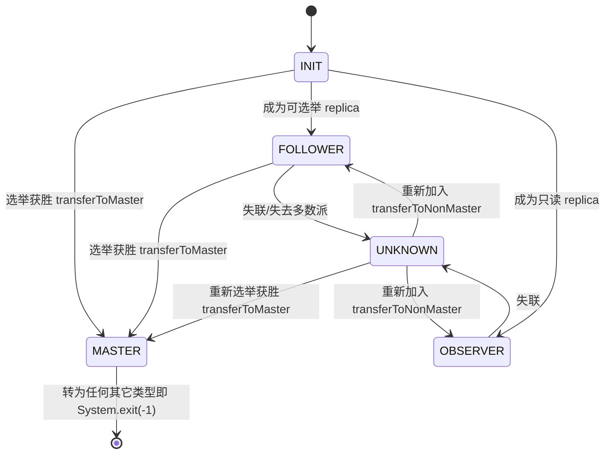

# 第 3 章：FE 高可用 —— 选主、角色与故障切换

[第 2 章](./02-editlog-and-checkpoint.md) 讲清了一条元数据变更如何写进 bdbje、被多数派确认、再复制给 Follower。那一章末尾把接力棒交到了本章手上：bdbje 不只是"日志存储"，它同时是 FE 的**选主基础**——谁是 Master、日志复制到哪、主挂了谁接班，全托管给同一套多数派协议。本章就把 bdbje 的这另一半身份讲透：一个 FE 集群怎么选出唯一的 Master、三种角色各自扮演什么、Master 宕机后新主如何顶上、以及这套机制在哪些运维场景里会咬人。

本章的行号引用基于写作时核实所用的 HEAD（`5b053010b7`，源码树与系列基线 `7bc98f696f` 一致）。代码演进会让行号漂移，但选主与角色迁移的对象名、状态语义不变；每一处 `路径:行号` 都在当前代码里核实过。

## 3.1 问题：谁说了算，挂了怎么办

**遇到了什么问题？** 第 1、2 章反复确认了一条铁律：**任一时刻只有 Master 的内存是权威、只有 Master 能写 editlog**。这条铁律是强一致的来源，却也把两个新问题顶到了台面上。其一，**唯一性**：多个 FE 里到底谁是 Master？必须保证任何时刻至多一个，两个 Master 同时写日志就是脑裂，元数据直接分叉。其二，**可用性**：Master 是单点，它一旦宕机，整个集群立刻失去写能力（建表、导入、事务全部停摆）——必须能自动、快速地从活着的节点里再推举一个新 Master 出来。既要"选出唯一一个"，又要"挂了能重选"，这正是分布式共识要解决的经典问题。

**有哪些候选、各有什么优劣？**

- **候选一：外置协调器（ZooKeeper / etcd 式）。** 把选主这件事外包给一个独立的协调服务：所有 FE 去抢一把分布式锁 / 一个临时节点，抢到的当 Master，会话断了锁自动释放、触发重选。方案成熟、语义清晰。但代价是**多引入一整个要独立部署、独立运维、独立高可用的系统**——ZK 自己也得三节点起步、也会挂、也要扩缩容。对一个已经有多副本日志复制需求的系统来说，这等于养了两套分布式协议栈。
- **候选二：自研 / 内嵌一套共识（Raft 式）。** 在 FE 内部实现一套 Raft，选主与日志复制统一在一个算法里。好处是全自主、可深度定制。缺点是**共识算法是出了名的难写对**——leader 选举、日志匹配、快照、成员变更每一处都是坑，自研要用大量线上事故去磨，内嵌第三方库又回到"黑盒依赖"的老问题。
- **候选三：复用日志复制层自带的选主（bdbje Paxos 系）。** Doris 的 editlog 本来就写进 bdbje 的 `ReplicatedEnvironment`（第 2 章），而 bdbje 的复制组自带一套基于多数派的选主：它内部维护一个可选举组，用 Paxos 族协议选出唯一的 master 节点接受写入、其余节点做 replica 复制日志。**日志复制和选主是同一套多数派协议的两个用途**——一条日志要多数派确认才算写成功，一个 master 要多数派投票才能当选，两件事共用一个复制组、一个仲裁基础。

**Doris 怎么考量和解决的？** 存算一体形态选了候选三：不额外引入 ZK、不自研 Raft，而是**直接复用 bdbje 复制组的选主能力**。一体化的收益很实在——editlog 写进 bdbje 那一刻，复制、持久化、选主、成员管理全在一个组件里闭环，FE 侧只需在 bdbje 状态回调上挂一个监听器，把"我变成 master 了 / 我变回 replica 了"翻译成自己的角色迁移。代价同样实在，且和第 2 章那句"bdbje 是黑盒依赖"是同一笔账的延续：**选主逻辑在库内部，FE 看不见投票细节**。当集群"选不出主"或"选主抖动"时，FE 日志只能给出"无法加入复制组""收不到多数派"这类外部症状，真正的病因往往要下沉到 bdbje 自身的复制状态去看（3.6 排查清单会回到这点）。

**为什么要两种角色，而不是一种？** 这是本章角色设计的题眼。选主需要"多数派投票"，投票节点越多，达成多数派的通信开销越大、选举越慢；但只读扩展又希望 FE 越多越好——查询规划可以分散到多个 FE 上并行跑。这两个诉求是**对立**的：能投票的节点必须参与仲裁（拖慢写和选举），只想分担读的节点最好别参与仲裁。Doris 的答案是把 FE 拆成两类可用节点：

- **FOLLOWER**：参与选举与多数派仲裁的"可选举节点"，是 Master 的候选池，也是 editlog 多数派确认的计票对象。它们决定集群的写可用性与选主能力。
- **OBSERVER**：**不参与**选举、不进多数派、只被动复制日志的只读节点。加再多 OBSERVER 也不改变仲裁基础，纯粹用来水平扩展读能力（承接查询规划、`SHOW` 类命令）。

于是"高可用"和"读扩展"被解耦成两个可独立调节的旋钮：想抗更多 FE 故障、就调整 FOLLOWER 数量（受奇数多数派约束，见 3.3）；想扛更多查询、就加 OBSERVER（不碰仲裁）。一种角色办不到这种解耦——要么所有节点都投票（读扩展的代价是选举变慢、多数派变大），要么都不投票（没法选主）。

## 3.2 源码走读：选主与状态迁移

**角色枚举与状态回调（高度概括）。** FE 的角色定义在 `FrontendNodeType`（`fe/fe-core/src/main/java/org/apache/doris/ha/FrontendNodeType.java:20`-`27`），枚举值有 `MASTER`、`FOLLOWER`、`OBSERVER`、`REPLICA`、`INIT`、`UNKNOWN`（`REPLICA` 是新加节点尚未定角色的过渡态，[part1 第 2 章](../part1-architecture/02-three-components.md) 已核实过这个枚举含 `REPLICA`）。bdbje 每次选主结果变化，都会回调注册在其上的监听器 `BDBStateChangeListener`（`fe/fe-core/src/main/java/org/apache/doris/ha/BDBStateChangeListener.java:37` 的 `stateChange`）。这个监听器做的事极简，却是理解整个角色体系的枢纽——它把 **bdbje 的复制状态**翻译成 **Doris 的 FE 角色**：

```java
switch (sce.getState()) {
    case MASTER:  newType = FrontendNodeType.MASTER; break;
    case REPLICA:
        if (isElectable) { newType = FrontendNodeType.FOLLOWER; }  // 可选举 → FOLLOWER
        else            { newType = FrontendNodeType.OBSERVER; }   // 不可选举 → OBSERVER
        break;
    case UNKNOWN: newType = FrontendNodeType.UNKNOWN; break;
    ...
}
Env.getCurrentEnv().notifyNewFETypeTransfer(newType);
```

（`fe/fe-core/src/main/java/org/apache/doris/ha/BDBStateChangeListener.java:40`-`64`）注意一个关键映射：bdbje 只有 `MASTER` / `REPLICA` / `UNKNOWN` 三种状态，**FOLLOWER 与 OBSERVER 在 bdbje 眼里都是 `REPLICA`**，区分它俩的是 FE 自己的 `isElectable`（本节点是否在可选举列表里）。也就是说"这个节点能不能投票选主"这件事，是 FE 启动时按角色配置决定、并注册进 bdbje 的（可选举节点走正常 durability，OBSERVER 在 `BDBEnvironment` 里被设为 `NodeType.SECONDARY`，`fe/fe-core/src/main/java/org/apache/doris/journal/bdbje/BDBEnvironment.java:140`——SECONDARY 节点不参与选举也不计入多数派）。回调最后只是把目标角色塞进一个队列 `notifyNewFETypeTransfer`（`fe/fe-core/src/main/java/org/apache/doris/catalog/Env.java:3228`，投进 `typeTransferQueue`）。

**状态机与迁移分发（详细）。** 真正执行角色迁移的是一个单独的 `stateListener` 守护线程（`fe/fe-core/src/main/java/org/apache/doris/catalog/Env.java:3240`），它不断从 `typeTransferQueue` 取出目标角色，按"当前 feType → 目标 newType"两级 `switch` 分发（`:3267`-`3338`）。合法迁移在源码注释里列得很清楚（`:3260`-`3265`）：



这张图有两处必须读进代码才不会想当然。第一处：**MASTER 是"单向"的**——一旦成为 Master，若 bdbje 又通知它变成别的类型，代码不是优雅降级，而是直接 `System.exit(-1)`（`fe/fe-core/src/main/java/org/apache/doris/catalog/Env.java:3328`-`3333`，日志 `transfer FE type from MASTER to ... exit`）。理由是一个曾经的 Master 若"退位"却继续留在进程里，极易和新 Master 产生状态混淆；干脆让它自杀、靠拉起脚本重启成干净的 Follower 重新入组，是最不容易出错的选择。第二处：`FOLLOWER`/`OBSERVER` 掉到 `UNKNOWN`（失去与多数派的联系）时走 `transferToNonMaster`，但**并不立刻停读**——见下文。

**tricky 点：新 Master 必须先回放完 backlog 才对外服务。** 这是本章最容易被运维误判的地方，必须扣着 `transferToMaster`（`fe/fe-core/src/main/java/org/apache/doris/catalog/Env.java:1702`）逐段看。当一个 FOLLOWER 被选为新 Master，`transferToMaster` 依次做这么几件事：

1. 停掉 `replayer` 回放线程（`:1705`-`1713`）——接下来它要自己当权威，不再被动回放。
2. 把 `isReady` 和 `canRead` 都置为 **false**（`:1716`-`1717`）——**此刻起，本节点明确宣告自己"没准备好"**。
3. 打开 editlog、做 fencing（`:1719`-`1727`，`haProtocol.fencing()` 失败就 `System.exit`，见下文脑裂防护）。
4. **`replayJournal(-1)`（`:1732`）——把 bdbje 里所有它还没回放的日志一次性追平。** `-1` 意为"回放到当前最大 journalId"。
5. roll editlog、写 meta version、写 `MasterInfo`、`postProcessAfterMetadataReplayed`（`:1749`-`1859`）。
6. 启动 Master 独有的守护线程（`startMasterOnlyDaemonThreads`，`:1871`，含第 2 章讲的 `leaderCheckpointer`）。
7. **直到这一切都成功，才 `canRead.set(true); isReady.set(true)`（`:1878`-`1879`），并打印 `master finished to replay journal, can write now.`（`:1882`）。**

而在整个 `transferToMaster()` 返回之前，`stateListener` 那行 `feType = newType`（`:3340`）**还没执行**——也就是说，在新 Master 回放 backlog 的**整个窗口内，`isMaster()`（`fe/fe-core/src/main/java/org/apache/doris/catalog/Env.java:5521`，就一句 `feType == MASTER`）仍然返回 false，`isReady()` 也是 false**。切换窗口内一条写请求（DDL/导入）打进来会怎样？它既不会被这个"准 Master"当成 Master 本地执行（`isMaster()` 为 false），旧 Master 又已经死了——表现就是**短暂的写不可用 / 元数据操作报错或阻塞**，直到新 Master 追平日志、翻牌成功。这个窗口的长度 ≈ 新 Master 需要回放的日志条数，也就是第 2 章那条"回放窗口 = 恢复时长"在选主场景下的复现：**image 越旧、宕机时攒的未回放日志越多，选主后不可写的窗口越长**。

**"切了主但没恢复"的误判，正是没理解这个窗口。** 运维看到"bdbje 已经选出新 master 了"（复制组层面），就以为集群立刻能写，结果发现建表还在报错，误判为"选主失败 / 脑裂"。真相是：bdbje 的 master 当选（复制层）和 Doris 的 Master 就绪（应用层回放追平）是**两个先后发生的事件**，中间隔着一个回放窗口。判断"新主到底好没好"，唯一可靠的信号是那句 `can write now.` 日志、或 `SHOW FRONTENDS` 里该节点 `IsMaster=true` 且 `ReplayedJournalId` 已追上——而不是 bdbje 层面的 master 归属。**错写会怎样**：假如把第 2 步的"先置 false"或第 7 步的"回放完才置 true"去掉、让节点一当选就宣称 `canRead/isReady`，那么它会在**尚未追平旧 Master 最后那批日志**时就对外服务，直接丢掉未回放的元数据、对客户端呈现"回退"的元数据视图——这比短暂不可写严重得多。这个"先 false、追平、再 true"的顺序是新主正确性的安全阀。

反方向的 `transferToNonMaster`（`:2093`）有个对称的细节值得一提：当一个 FOLLOWER/OBSERVER 掉到 UNKNOWN（暂时失去多数派联系），它**不立刻停止读服务**（`:2097`-`2103`，`still offer read service`，`canRead` 保持原值），把"要不要停读"这个决定继续交给 replayer 线程按元数据新鲜度判断（下一节的 stale-window）。这是可用性上的一个务实取舍：短暂失联不等于数据一定过期，先容忍着继续供只读，真落后超阈值了再停。

**脑裂防护：fencing 抢 epoch。** 上面第 3 步的 `fencing()`（`fe/fe-core/src/main/java/org/apache/doris/ha/BDBHA.java:72`）是防"双主写入"的最后一道闸。新 Master 上任前，往一个 epoch 数据库里 `putNoOverwrite` 一个自增的 epoch 号：抢到（`SUCCESS`）才继续，被别人先占（`KEYEXIST`）就说明有更新的主存在、fencing 失败进而 `System.exit`。这样即便出现网络分区导致的短暂"双 master"错觉，也只有 epoch 最大的那个能写下去，旧主写不进、自杀退出。多数派选举保证"至多一个 master 当选"，fencing 再兜一层"epoch 单调、旧主写不进"。

**易错点：sync policy 参数与掉电语义。** editlog 写进 bdbje 时的持久化强度，由三个参数在 `BDBEnvironment.setup` 里组装成一个 `Durability`（`fe/fe-core/src/main/java/org/apache/doris/journal/bdbje/BDBEnvironment.java:172`-`174`）：

- `master_sync_policy`（`fe/fe-common/src/main/java/org/apache/doris/common/Config.java:250`，默认 **`SYNC`**）：Master 本地写日志时的落盘强度。
- `replica_sync_policy`（`:254`，默认 **`SYNC`**）：Follower 复制到日志时的落盘强度。
- `replica_ack_policy`（`:259`，默认 **`SIMPLE_MAJORITY`**）：一条日志要多少个副本 ack 才算写成功（第 2 章已述）。

前两个的取值 `SYNC` / `WRITE_NO_SYNC` / `NO_SYNC` 由 `getSyncPolicy`（`:552`）翻译成 bdbje 的 `Durability.SyncPolicy`，语义差别正落在**掉电**上：`SYNC` 是"写入并 **fsync 落到物理磁盘**才返回"——机器**突然掉电也不丢**这条日志；`WRITE_NO_SYNC` 是"写到 OS 文件系统缓存就返回、不 fsync"——**进程崩溃能扛住**（数据已交给 OS），但**掉电会丢**尚未刷盘的那部分；`NO_SYNC` 连 OS 缓存都不保证，最快也最不安全。默认选 `SYNC`，就是把元数据的持久性摆在吞吐之前——宁可每条日志多一次 fsync，也不容忍掉电丢元数据。`fe/fe-common/src/main/java/org/apache/doris/common/Config.java:245`-`248` 的注释给了唯一的松绑场景：只有当 Follower 多于 3 个（即 4 台及以上）、多数派本身已提供跨机冗余时，才**可以**把 sync policy 调成 `WRITE_NO_SYNC` 换吞吐——因为此时一台机器掉电丢的那点未刷盘日志，还能从其它多数派副本补回来。**错写会怎样**：在只有 1~2 个 Follower 的小集群里贸然设成 `WRITE_NO_SYNC` 图快，一旦 Master 所在机器掉电，最近若干条已"提交成功"的元数据可能凭空消失，而客户端早已收到成功回执——这是最难排查的一类"元数据回退"事故。

## 3.3 源码走读：请求转发与读写路径

**非 Master 的写转发（引用，不重复）。** 一个写请求（DDL/DML）落在 FOLLOWER 或 OBSERVER 上时并不会失败，而是被透明转发给 Master 执行。这条路径 [part2 第 1 章](../part2-query-lifecycle/01-connection-and-protocol.md) 1.3 节已经逐段讲过——决策点是 `StmtExecutor` 的 `shouldForwardToMaster`，借 `MasterOpExecutor`（`fe/fe-core/src/main/java/org/apache/doris/qe/MasterOpExecutor.java:35`）经内部 RPC 把语句发给 Master、再把结果带回。本章只补一句它和高可用的关系：正因为有这层转发，客户端可以把连接**均匀打到任意 FE**（包括只读的 OBSERVER）而不必关心谁是 Master——写自动找主、读就地执行。但这也埋了个反直觉点：主从切换的那个回放窗口里 Master 尚未就绪，转发过去的写会短暂受阻（3.2 tricky 点），此时"连的是哪个 FE"不重要，"主好没好"才重要。

**Observer 的读一致性：回放延迟下的旧元数据语义。** OBSERVER 和 FOLLOWER 一样，内存元数据都是靠 replayer 线程回放 Master 日志"追"上来的，因此都存在一个 **stale-read 窗口**——这一点 [第 1 章](./01-catalog-and-memory.md) 1.2 节的 tricky 点已经讲透，并给出了那个上限 `meta_delay_toleration_second`（默认 300 秒）：非 Master 一旦发现自己落后 Master 超过这个阈值，replayer 线程就把 `canRead` 置 false、主动停止对外读（`fe/fe-core/src/main/java/org/apache/doris/catalog/Env.java:3197`-`3210` 附近），宁可不服务也不返回太旧的元数据。本章不重复那个窗口的成因，只强调它对角色选型的含义：**OBSERVER 扩展的是"读吞吐"，不是"读一致性"**。加 OBSERVER 能让更多查询并行规划，但每个 OBSERVER 读到的都是"最终一致"的元数据；要强一致的最新视图，得连 Master（或容忍并利用 3.2 提到的"落后就转发 Master"兜底）。

**tricky 点：FOLLOWER 为什么必须凑奇数，加减 FOLLOWER 的多数派变化。** 选主与日志提交都靠"多数派"（quorum），N 个可选举节点的多数派是 `⌊N/2⌋+1`。奇偶之别在于**容错性价比**：

- 3 个 FOLLOWER：多数派 = 2，能容忍 **1** 个故障。
- 4 个 FOLLOWER：多数派 = 3，仍只能容忍 **1** 个故障（挂 2 个就剩 2 < 3，选不出主）。
- 5 个 FOLLOWER：多数派 = 3，能容忍 **2** 个故障。

也就是说从 3 加到 4，多数派门槛涨了、容错数却没涨——**多花一台机器，容错力一点没多，写和选举的仲裁开销反而更大**。所以 FOLLOWER 数量应取奇数（1/3/5），偶数是纯亏。这就是"FOLLOWER 必须奇数"的算术根源。

可选举组的成员由谁管？由 `BDBHA`（`fe/fe-core/src/main/java/org/apache/doris/ha/BDBHA.java:46`）通过 bdbje 的 `ReplicationGroupAdmin` 维护：`getElectableNodes`（`:127`）列出可选举节点、`removeElectableNode`（`:163`）/`removeDroppedMember`（`:251`）在删 FE 时把节点移出复制组。加 FOLLOWER 的入口是 `Env.addFrontend`（`fe/fe-core/src/main/java/org/apache/doris/catalog/Env.java:3441`），其中对 `FOLLOWER`/`REPLICA` 角色会把新节点加进 `helperNodes` 并调 `addUnReadyElectableNode`（`:3466`-`3468`）。这里藏着一个很精巧、也很容易忽略的正确性处理（`fe/fe-core/src/main/java/org/apache/doris/ha/BDBHA.java:218` 的 `addUnReadyElectableNode`）：新加的 FOLLOWER 还没从零回放追平之前，它**没能力真正参与仲裁**（连日志都没同步全），如果一加进去就把它算进多数派分母，会导致"多数派门槛升高、但新节点还 ack 不了"，从而**卡住写入**。Doris 的处理是临时调用 `setElectableGroupSizeOverride(totalFollowerCount - unReadyElectableNodes.size())`，把多数派计算的分母**临时压回到"已就绪节点数"**，等新节点追平后再 `removeUnReadyElectableNode`（`fe/fe-core/src/main/java/org/apache/doris/ha/BDBHA.java:230`）恢复。理解了这个机制，就能看懂加 FOLLOWER 是个"两阶段"过程：先入组但不计票、追平后才计票。

**helper 节点：新 FE 怎么找到组织。** 上面 `ALTER SYSTEM ADD FOLLOWER` 是在 Master 侧把新节点**登记**进元数据，但新 FE 进程自己启动时还有一道"我是谁、该以什么角色入组、去哪抄集群身份"的问题——这靠 **helper 节点**解决。一个全新的 FE（本地没有 `ROLE`/`VERSION` 文件）启动时必须用 `--helper <已有FE>:<edit_log_port>` 指一个引路人，入口是 `getClusterIdAndRole`（`fe/fe-core/src/main/java/org/apache/doris/catalog/Env.java:1322`）：它向 helper 拉取自己的角色、`cluster_id` 与 token，核对一致后写下本地 ROLE/VERSION，再拿 helper 当 bdbje 复制组的接入点加入。有两个边界要读清楚（`:1340`-`1364` 注释）：其一，**集群的第一个节点** helper 指向自己、且本地无 ROLE 文件，代码把它定为 `FOLLOWER`（"Master 的角色也是 FOLLOWER，即可选举"）——首个可选举节点启动后自然当选 Master，这就是"首启即 Master"的来历；其二，**ROLE/VERSION 一旦已存在就以本地为准、忽略 helper**，反过来若 ROLE 文件被误删又乱指 helper，可能被"任意地"当成 FOLLOWER 重启而引发未定义行为。所以 helper 只是**首次入组的引路人**，不是身份的权威——身份一旦落到本地 ROLE 文件就固定了。这也解释了 3.5 实验里为什么第 2、3 个 FE 要带 `--helper` 起、而第一个不用。

**加错节点类型的后果（真实运维陷阱）。** 最典型的误操作是**把本该加成 OBSERVER 的节点加成了 FOLLOWER，或反过来**，尤其"以为多加个 OBSERVER 能增强高可用"。事实是：OBSERVER 是 `NodeType.SECONDARY`，**根本不进多数派**（3.2 已证），加再多也不改变选举的仲裁基础、不提升容错——它只增加读吞吐。反过来，为了"高可用"盲目多加 FOLLOWER 又会撞上刚才的奇偶算术（加成偶数是白花机器）。**这两个旋钮的作用域完全不同，混用就会得到"加了节点却没得到预期能力"的结果**——3.5 实验会亲手踩一遍：加一个 OBSERVER，再看多数派纹丝不动。

## 3.4 双模式对比

选主机制本身在两种模式下是**完全共用**的：分离模式的 `CloudEnv` 继承 `Env`，FE 自身的元数据（frontends 列表、权限、catalog 骨架等）**仍然靠 bdbje 做复制与选主**——第 2 章 2.4 节已经确认 `edit_log_type` 默认仍是 `"bdb"`，本章的 `BDBStateChangeListener` → `transferToMaster`/`transferToNonMaster` 这套角色迁移两种模式跑的是同一份代码。分离模式并没有换一套选主。

真正变化的是**切主的影响面**。存算一体下，事务状态、tablet 版本这些"重且高频变"的状态都在 FE 内存里、靠 bdbje editlog 持久化，所以主从切换那个回放窗口里，在途事务的推进会短暂停顿、新主要回放这些状态才能接管。而分离模式把这块权威**外移到了 MetaService（背后 FoundationDB）**——[part3 第 1 章](../part3-load-lifecycle/01-load-overview-and-txn.md) 1.4 节已从事务角度证过：`CloudGlobalTransactionMgr` 下 FE 基本不写事务 editlog，事务的权威状态在 MetaService，FE 重启 / 换节点接管都不影响在途事务的权威记录。直接后果是：**分离模式下切主要回放的 FE 自有元数据更薄、回放窗口更短、切换影响面大幅缩小**；而且"多个 FE 看到的事务/版本是否一致"这个问题，最终由"大家都去问同一个 MetaService"来兜底，而不再单纯依赖 FE 之间的日志复制。一句话：分离模式没换选主，但把切主时"最有状态、最耗回放"的那部分东西从 bdbje 搬到了 MetaService，于是切主变轻了。MetaService 侧那份权威状态自身的高可用（FDB 的多副本），是 **ch4 分离模式专章**的正题。

## 3.5 动手实验

实验环境沿用 part1 第 5 章，不重复。本实验两个目的：**核心目的**是拉起一个 3 FE 集群、观察角色分布、`kill` 掉 Master 亲眼看选主与恢复；**易错点目的**是主动把 OBSERVER 当"高可用增强"加进来、再验证它对多数派毫无影响，并把集群 kill 到失去多数派、观察"选不出主 = 集群不可写"的表现。

**核心步骤：3 FE 集群、观察角色、kill Master 看选主。**

1. **拉起 1 Master + 2 Follower。** 先起第一个 FE（首次启动即成为 Master），再用 `--helper <master_host>:<edit_log_port>` 启动另外两个 FE 作为 helper 加入（helper 节点是新 FE 的"入组引路人"，`Env.getHelperNodes`，`fe/fe-core/src/main/java/org/apache/doris/catalog/Env.java:1192`），然后在 Master 上执行：

   ```sql
   ALTER SYSTEM ADD FOLLOWER "fe2_host:9010";
   ALTER SYSTEM ADD FOLLOWER "fe3_host:9010";
   ```

   （语法见 `addFollowerClause`，`fe/fe-sql-parser/src/main/antlr4/org/apache/doris/nereids/DorisParser.g4:748`；对应 `Env.addFrontend`，`fe/fe-core/src/main/java/org/apache/doris/catalog/Env.java:3441`。）

2. **看角色分布。** `SHOW FRONTENDS`（列定义见 `fe/fe-core/src/main/java/org/apache/doris/tablefunction/FrontendsTableValuedFunction.java:48` 起）重点看几列：`Role`（`FOLLOWER`/`OBSERVER`）、`IsMaster`（当前只有一行为 `true`）、`Alive`、`ReplayedJournalId`（三个节点应彼此接近）、`IsHelper`。此刻应看到 3 行、全 `FOLLOWER`、其中一行 `IsMaster=true`。

3. **kill Master，看选主与恢复。** 对 `IsMaster=true` 那个 FE 进程 `kill -9`（模拟宕机）。在另外两个 Follower 的 `fe.log` 里对照 3.2 的状态机看日志流：先出现 bdbje 层面的选主，胜出者打印 `begin to transfer FE type from FOLLOWER to MASTER`（`fe/fe-core/src/main/java/org/apache/doris/catalog/Env.java:3254` 那句），随后是 `finish replay in ... msec`（同文件 `:1734`，回放 backlog），最后是 `master finished to replay journal, can write now.`（同文件 `:1882`）——**从"进程感知旧主死"到打印这句 `can write now` 的时间差，就是集群的写不可用窗口**。这期间去连另一个 Follower 建表，会看到短暂报错/阻塞，等新主打印 `can write now` 后恢复。再 `SHOW FRONTENDS` 确认 `IsMaster` 已转移到新节点。

**易错点步骤：把 OBSERVER 当高可用增强，以及 kill 到失去多数派。**

4. **加一个 OBSERVER，验证多数派不变。** 再起一个 FE，`ALTER SYSTEM ADD OBSERVER "fe4_host:9010";`（语法见 `addObserverClause`，`fe/fe-sql-parser/src/main/antlr4/org/apache/doris/nereids/DorisParser.g4:746`）。`SHOW FRONTENDS` 现在有 4 行，但 `Role=OBSERVER` 那行不参与选举。**验证点**：此时可选举组仍是 3 个 FOLLOWER、多数派仍是 2——kill 掉 1 个 FOLLOWER，集群照样能选主、能写（还剩 2 个 FOLLOWER 满足多数派）；而这个 OBSERVER 无论在不在，都不改变这个结论。这就直接证伪了"加 OBSERVER 能增强高可用"——它只增强读，不增强容错。

5. **kill 到失去多数派，观察只读/不可写。** 承接上一步，现在是 3 FOLLOWER + 1 OBSERVER。再 kill 掉**第 2 个** FOLLOWER，此刻只剩 **1 个** FOLLOWER 存活——`1 < 多数派 2`，**可选举组失去多数派**。现象：bdbje 选不出 master，`SHOW FRONTENDS` 里没有任何一行 `IsMaster=true`（或原 Master 已降为 UNKNOWN），所有写请求（建表、导入）报错或阻塞——**集群进入不可写状态**。而那个还活着的 OBSERVER 只要没超过 `meta_delay_toleration_second`，仍能提供**只读**服务（这正好复现 3.3：OBSERVER 扩的是读、救不了写）。诚实地把算术走一遍：3 FOLLOWER 的集群容忍 1 个故障、不容忍 2 个；想容忍 2 个故障就得上 5 个 FOLLOWER。把这个"kill 到 1 个 Follower 就整体不可写"亲手做出来，比记住"要奇数"更让人记得住多数派的边界。做完把 kill 掉的 FE 逐个拉起（它们会重新入组、追平日志），集群恢复多数派后自动重新可写。

## 3.6 排查清单

- **症状 A：选不出主（集群不可写、无 `IsMaster`）。** 根因几乎都是**可选举组失去多数派**（3.5 步骤 5）。排查顺序：`SHOW FRONTENDS` 数一下 `Role=FOLLOWER` 且 `Alive=true` 的节点够不够多数派（N 个 FOLLOWER 需 `⌊N/2⌋+1` 个存活）；不够就是死了太多 Follower，**优先把宕掉的 FOLLOWER 拉起来重新入组**，而不是去动别的。注意排查时别把 OBSERVER 算进可选举组（它不计票，3.3）。若是新加的 FOLLOWER 迟迟不 `Alive`，看它是否卡在从 helper 回放追平（`addUnReadyElectableNode` 阶段，`fe/fe-core/src/main/java/org/apache/doris/ha/BDBHA.java:218`），追平前它不计入多数派。
- **症状 B：新主起了但不服务（还在回放）。** `SHOW FRONTENDS` 已有一行 `IsMaster=true`，但写请求仍报错/超时。这不是脑裂、也不是选主失败，而是 3.2 那个**回放窗口**：bdbje 层已选出 master，但 Doris 层的 `transferToMaster` 还在 `replayJournal(-1)` 追平 backlog，`isReady` 尚为 false。判断依据是新主 `fe.log` 有没有打印 `master finished to replay journal, can write now.`（`fe/fe-core/src/main/java/org/apache/doris/catalog/Env.java:1882`）以及 `ReplayedJournalId` 是否还在爬升。处置：耐心等它追平（窗口长度 ≈ 未回放日志条数）；若窗口长得离谱，根因往往是 image 太旧、宕机时攒了太多未 checkpoint 的日志——回到第 2 章症状 A，让 checkpoint 正常跑起来截断回放窗口。
- **症状 C：怀疑元数据两边不一致 / 脑裂，以及 `metadata_failure_recovery` 的使用边界。** 先分清是不是真脑裂：正常情况下多数派选举 + fencing 的双保险（3.2）保证至多一个可写 Master，`SHOW FRONTENDS` 里 `IsMaster=true` 只该有一行；若不同 FE 读到的元数据不一致，多半是某个非 Master 回放落后（看它的 `ReplayedJournalId` 是不是明显落后、有没有超 `meta_delay_toleration_second` 停读），而非真分叉。**真正危险的是误用 `metadata_failure_recovery`**——和第 2 章 2.3 节说的完全一致：它**不是** FE 配置项，而是一个**启动参数**（`bin/start_fe.sh:35`、`:69`-`70` 把 `--metadata_failure_recovery` 映射成 `-r`），在 `BDBEnvironment.setup` 里触发 `DbResetRepGroup` 把整个复制组重置（`fe/fe-core/src/main/java/org/apache/doris/journal/bdbje/BDBEnvironment.java:105`-`114`）。它的语义是"丢掉未复制的日志、拿本地这份**单方面**把复制组重置起来"，**只用于多数派 FOLLOWER 已永久损毁、无论如何选不出主的灾难恢复**。**绝不能**在集群其实健康、只是某个节点起不来时拿它当"重启开关"——那等于让一个可能落后的节点强行宣称自己是权威，直接制造脑裂与元数据丢失。它是最后手段，不是重试按钮。

至此，bdbje 的两半身份就都讲完了：第 2 章讲它作为日志复制层，本章讲它作为选主基础——`BDBStateChangeListener` 把 bdbje 的 master/replica 状态翻译成 FE 的 MASTER/FOLLOWER/OBSERVER 角色，`transferToMaster` 用"先置 false、追平 backlog、再置 true"的顺序守住新主的正确性，FOLLOWER 的奇数多数派决定容错、OBSERVER 的 SECONDARY 身份只扩读不改仲裁。下一章转向存算分离：当元数据的权威搬进 MetaService/FDB，FE 的高可用边界、以及那份"重"元数据自身的持久化与恢复，又是另一套故事。
