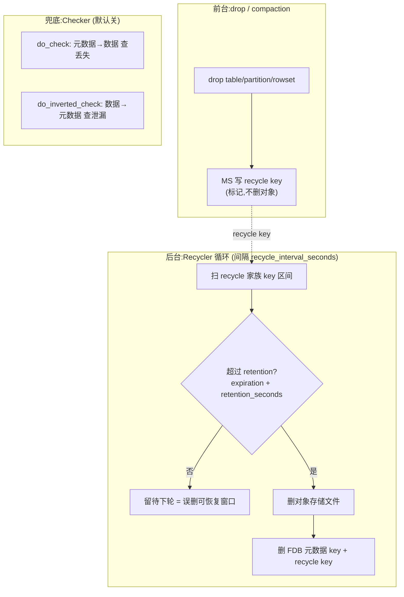

# 第 4 章：存算分离元数据 —— MetaService、FDB 布局与 Recycler

[第 2 章](./02-editlog-and-checkpoint.md) 和 [第 3 章](./03-fe-ha.md) 反复把一句话交到本章手上：分离模式把那份"重且高频变"的元数据——tablet 位置、版本、事务状态——**外移到了 MetaService（背后 FoundationDB）**，于是 FE 的 image 更小、editlog 更薄、切主回放窗口更短。那两章都在结尾点名"MetaService 侧那份权威状态自身的持久化与恢复，是 ch4 分离模式专章的正题"。本章就是这个专章：元数据搬出 FE 之后，究竟放在哪、按什么结构放、谁来读写、删了的东西谁来清、FE 又怎么知道集群里有哪些机器。

本章的行号引用基于写作时核实所用的 HEAD（`253fcc831e`，源码树与系列基线 `7bc98f696f` 一致）。代码演进会让行号漂移，但 key 编码体系、回收分类、同步机制的对象名与语义不变；每一处 `路径:行号` 都在当前代码里核实过。

## 4.1 问题：把元数据搬出 FE 之后放哪、怎么放

**遇到了什么问题？** 存算一体下，元数据的权威是 FE 的内存对象树 + bdbje editlog（第 1~3 章）。这套东西有个天花板：**所有权威元数据必须装进单机内存**。tablet / 副本 / 版本这类对象随数据规模线性膨胀，几千万 tablet 就能把 FE 堆内存顶到几十 GB，image 越做越大、checkpoint 越来越慢（[part1 第 2 章](../part1-architecture/02-three-components.md) 2.4 节讲的就是这个容量瓶颈）。存算分离要把 BE 做成无状态计算节点、数据落共享对象存储，那么"哪个 tablet 有哪些 rowset、版本推到几、事务提交没提交"这份权威元数据，就必须从 FE 内存里搬出来，找一个**能水平扩展、又能提供事务保证**的地方安家。问题随之而来：搬到哪种存储？

**有哪些候选、各有什么优劣？**

- **候选一：自研一套元数据存储引擎。** 完全按 Doris 的访问模式定制。好处是可控、能极致优化;坏处是**等于从零造一个分布式 KV + 事务 + 多副本 + 故障恢复的数据库**，这是几个团队几年的工程量，还要用线上事故去磨正确性。对一个查询/存储引擎项目来说，把精力砸在自研元数据库上得不偿失。
- **候选二：MySQL / 关系库系。** 现成、事务成熟、运维熟悉。但关系库的**横向扩展是老大难**——单机容量和写入吞吐有上限，分库分表又把跨行事务弄没了。元数据的访问恰恰充满跨对象的事务（一次导入提交要原子地改一批 tablet 的 rowset + 分区版本），分库分表后这些事务要么做不了、要么退化成两阶段提交的分布式事务，复杂度反而更高。
- **候选三：分布式事务 KV（FoundationDB）。** FDB 提供**严格串行化（strict serializability）的跨 key 事务 + 水平扩展的多副本存储**——这正好命中元数据的两个硬需求：既要能随 tablet 数量线性扩容,又要能在一次事务里原子地改任意一组 key。代价是**多运维一个新系统**：FDB 自己是一套要独立部署、独立扩缩容、独立调优的分布式数据库。

**为什么是 FDB 而不是 etcd / ZooKeeper？** 三者都是分布式协调/存储系统,但 etcd、ZK 的定位是**小数据量的强一致配置/协调**（选主、服务发现、配置分发),它们把全量数据放进内存、复制走 Raft/Zab,数据量一大就顶不住——而 Doris 元数据是**会随集群规模长到几十上百 GB 的业务数据**,根本不是 etcd/ZK 的目标场景。更关键的是**事务模型**:etcd 只有单 key 的 CAS、ZK 只有单节点原子写,都没有 FDB 那种"任意多 key 读写打包成一个可串行化事务"的能力,而元数据操作恰恰高度依赖多 key 原子性。所以选型不是"谁更成熟"、而是"谁的数据量上限和事务模型对得上"——只有 FDB 两条都对得上。

**Doris 最终怎么解决的:MetaService 作为无状态转换层。** FDB 选定了,但还有一层设计决定:**FE 和 BE 都不直接说 FDB 话**。中间插一个无状态的 C++ 进程 **MetaService**(下称 MS,类 `MetaServiceImpl`,[part1 第 2 章](../part1-architecture/02-three-components.md) 2.4 节已解剖其进程结构),对上用 brpc 暴露语义化的 RPC(`commit_txn`、`get_version`、`get_tablet` 等),对下把这些语义翻译成对 FDB 的 key 读写。这一层不持有任何持久状态(状态全在 FDB),所以可以随意多开、水平扩展、挂了重启没有恢复成本。

这个"谁能碰 FDB"的边界值得核实一遍,别想当然。翻 `cloud/src/main.cpp`,`doris_cloud` 这个二进制按启动参数决定角色:`meta-service`(`cloud/src/main.cpp:118`)或 `recycler`(`:119`),不指定就两个都跑;两种角色**共用同一个 `FdbTxnKv`**(`cloud/src/meta-store/txn_kv.h:521`)去连 FDB。也就是说,直接持有 FDB 客户端、能对 FDB 发起事务的,**只有 MS 进程和 Recycler 进程(以及下文的 Checker,它们同属 cloud 侧)**。FE 通过 brpc 调 MS、BE 通过 `CloudMetaMgr` 调 MS([part3 第 1 章](../part3-load-lifecycle/01-load-overview-and-txn.md) 已建立这条路径),**没有任何 FE/BE 代码路径能绕过 MS 直接连 FDB**。这条边界是后面所有讨论的地基:key 布局是 MS 的私有约定、事务限制的规避在 MS 内部完成、误改 FDB 的危险也正因为它绕过了 MS 的全部校验。

## 4.2 源码走读:FDB key 空间布局(本章重点段)

FDB 是个扁平的有序 KV,没有"表""行"的概念。Doris 全部元数据都要拍平成 `(key, value)`,value 一般是一个 protobuf 消息,而 **key 的编码体系就是这套元数据的"schema"**——它决定了哪些数据挨在一起、能不能范围扫描、会不会撞车。这套编码全部定义在 `cloud/src/meta-store/keys.h` / `cloud/src/meta-store/keys.cpp`,是本章最该逐字读的地方。

### 三个 key 空间与前缀分类

`cloud/src/meta-store/keys.h` 开头(`cloud/src/meta-store/keys.h:29`-`114`)有一段极其宝贵的注释,把全部 key 家族的布局画了出来。第一个字节是 **key space**,区分三大类(`cloud/src/meta-store/keys.h:119`-`121`):

- `0x01` `CLOUD_USER_KEY_SPACE01`:实例级业务元数据(绝大多数)。
- `0x02` `CLOUD_SYS_KEY_SPACE02`:MS 自身的系统级数据(服务注册表、加密密钥等),与具体 instance 无关。
- `0x03` `CLOUD_VERSIONED_KEY_SPACE03`:较新的**多版本 key**空间,key 尾部带 versionstamp 时间戳(下文详述)。

在 `0x01` 空间内,第二段是**家族前缀**,把元数据按用途分区。把 `cloud/src/meta-store/keys.h` 注释块和 `cloud/src/meta-store/keys.cpp` 里的前缀常量(`cloud/src/meta-store/keys.cpp:27`-`36`)对照,整理成下表(instance_id 一律紧跟前缀,省略):

| 家族前缀 | 典型 key 结构(前缀后) | value | 构造函数(`cloud/src/meta-store/keys.h`) |
|---|---|---|---|
| `instance` | `instance ${instance_id}` | `InstanceInfoPB` | `instance_key` (`:344`) |
| `txn` | `txn ... "txn_info" ${db_id} ${txn_id}` | `TxnInfoPB` | `txn_info_key` (`:352`) |
| `txn` | `txn ... "txn_label" ${db_id} ${label}` | `TxnLabelPB` | `txn_label_key` (`:351`) |
| `version` | `version ... "partition" ${db_id} ${tbl_id} ${partition_id}` | `VersionPB` | `partition_version_key` (`:361`) |
| `version` | `version ... "table" ${db_id} ${tbl_id}` | int64 | `table_version_key` (`:363`) |
| `meta` | `meta ... "tablet" ${table_id} ${index_id} ${partition_id} ${tablet_id}` | `TabletMetaCloudPB` | `meta_tablet_key` (`:370`) |
| `meta` | `meta ... "rowset" ${tablet_id} ${version}` | `RowsetMetaCloudPB` | `meta_rowset_key` (`:367`) |
| `meta` | `meta ... "tablet_index" ${tablet_id}` | `TabletIndexPB` | `meta_tablet_idx_key` (`:369`) |
| `meta` | `meta ... "schema" ${index_id} ${schema_version}` | `TabletSchemaCloudPB` | `meta_schema_key` (`:371`) |
| `stats` | `stats ... "tablet" ${table_id} ${index_id} ${partition_id} ${tablet_id}` | `TabletStatsPB` | `stats_tablet_key` (`:406`) |
| `recycle` | `recycle ... "rowset" ${tablet_id} ${rowset_id}` | `RecycleRowsetPB` | `recycle_rowset_key` (`:397`) |
| `recycle` | `recycle ... "partition" ${partition_id}` | `RecyclePartitionPB` | `recycle_partition_key` (`:396`) |
| `recycle` | `recycle ... "index" ${index_id}` | `RecycleIndexPB` | `recycle_index_key` (`:395`) |
| `recycle` | `recycle ... "txn" ${db_id} ${txn_id}` | `RecycleTxnPB` | `recycle_txn_key` (`:398`) |
| `job` | `job ... "tablet" ${table_id} ${index_id} ${partition_id} ${tablet_id}` | `TabletJobInfoPB` | `job_tablet_key` (`:433`) |
| `job` | `job ... "recycle"` / `"check"` | `JobRecyclePB` | `job_recycle_key`/`job_check_key` (`:426`,`:427`) |
| `storage_vault` | `storage_vault ... "vault" ${resource_id}` | `StorageVaultPB` | `storage_vault_key` (`:347`) |
| `copy` | `copy ... "job" ${stage_id} ${table_id} ${copy_id} ${group_id}` | `CopyJobPB` | `copy_job_key` (`:441`) |

这张表把分离模式的元数据全景摊开了:**tablet 的元数据(`meta "tablet"`)、它的每个 rowset(`meta "rowset"`)、它的统计(`stats "tablet"`)、它所属分区的版本(`version "partition"`)、正在跑的 compaction job(`job "tablet"`)、被删待回收的 rowset(`recycle "rowset"`)——原来在 FE 内存对象树上的这些字段,如今都是 FDB 里一条条独立的 key。**注意 key 里刻意冗余了层级 id**:`meta_tablet_key` 把 `table_id/index_id/partition_id/tablet_id` 全编进去(`cloud/src/meta-store/keys.cpp:308`),`stats_tablet_key` 也是同一组(`cloud/src/meta-store/keys.cpp:406` 附近),这不是浪费——它让"扫一张表下所有 tablet""扫一个分区下所有 stats"变成一次前缀范围扫描,这正是下面要讲的有序编码的用武之地。

### 编码方案:为什么必须是"有序"的

key 不是简单拼字符串,而是走一套**保序编码**(`cloud/src/meta-store/codec.h`)。核心两个函数:

- `encode_bytes`(`cloud/src/meta-store/codec.h:54`):字符串段,把原始字节做转义后追加,保证**编码后的字节序 = 原始字典序**。注释给的例子(`cloud/src/meta-store/codec.h:49`)是 `0xdead00beef` 编成 `0x10 dead 00ff beef 0001`——`0x00` 被转义成 `0x00ff`、结尾补 `0x0001`,目的就是让含 `0x00` 的串也能正确保序、且能界定边界。
- `encode_int64`(`cloud/src/meta-store/codec.h:124`-`130`):整数段,编成 **8 字节大端**,并用前缀标签区分正负(`0x11` 负、`0x12` 正,`cloud/src/meta-store/codec.h:30`-`31`),保证编码后的字节序 = 数值大小序。

一个 key 的组装过程一目了然:看 `encode_prefix`(`cloud/src/meta-store/keys.cpp:157`)先 `push_back` 那个 key space 字节,再 `encode_bytes` 家族前缀和 instance_id;然后各家族函数追加自己的段,比如 `meta_tablet_key`(`cloud/src/meta-store/keys.cpp:308`)在前缀后依次 `encode_bytes("tablet")` + `encode_int64(table_id)` + `encode_int64(index_id)` + `encode_int64(partition_id)` + `encode_int64(tablet_id)`。

**为什么"有序"这件事是整个布局的命门?** 因为 FDB 是有序 KV,`getRange(begin, end)` 按 key 字节序返回区间内所有 kv。只有当编码保序,"逻辑上相邻的元数据"才会"物理上相邻",范围扫描才能一次捞出来。举例:要扫某个 tablet 的所有 rowset,就用 `meta "rowset" ${tablet_id}` 做前缀、`${tablet_id}` 后不给 version,扫 `[prefix, prefix+1)` 区间——因为 version 是大端整数编码,同一 tablet 的 rowset 会按 version **有序连续排列**。假如整数不是大端、或字符串编码不保序,这个区间扫描就会漏掉或错乱。`get_version`、compaction 挑 rowset、Recycler 扫某 tablet 待回收 rowset,全都建立在这个保序前提上。

### tricky 点:FDB 单事务限制,以及 MS 怎么绕

FDB 对单个事务有硬限制:**事务时长上限约 5 秒(超了报 `transaction_too_old`,错误码 1007)、事务写入字节上限约 10MB(超了报 `transaction_too_large`,错误码 2101)**。这两个码在 `cloud/src/meta-store/txn_kv.cpp` 里被映射成 Doris 自己的错误:1007→`TXN_TOO_OLD`(`cloud/src/meta-store/txn_kv.cpp:322`、`:360`),2101→`TXN_BYTES_TOO_LARGE`(`cloud/src/meta-store/txn_kv.cpp:332`、`:352`)。

这个 `TXN_BYTES_TOO_LARGE` 正是 [part3 第 4 章](../part3-load-lifecycle/04-commit-and-visibility.md) 4.3 节埋的伏笔——那章讲 `commit_txn` 七步时提到"特别大的事务走 lazy/eventually 路径",现在把这段代码翻出来看它到底怎么规避。`commit_txn` 的分派逻辑在 `cloud/src/meta-service/meta_service_txn.cpp:3310`-`3352`:

1. 先算这次提交的 rowset 数。若没开 lazy commit 特性、或 rowset 数不超过阈值(`config::txn_lazy_commit_rowsets_thresold`),就走 `commit_txn_immediately`(`cloud/src/meta-service/meta_service_txn.cpp:1524`)——**在一个 FDB 事务里**把整批 rowset 转正、分区版本抬升、写 operation log,一次 `commit()` 原子落地(这就是 part3 第 4 章讲的七步)。
2. 如果这一把太大,`commit()` 返回 `TXN_BYTES_TOO_LARGE`(`cloud/src/meta-service/meta_service_txn.cpp:2029`、`3329`)。此时分两种走法:**未开** lazy commit 时,直接把错误返回给客户端,并追加提示 "reduce the number of partitions involved in the load"(`cloud/src/meta-service/meta_service_txn.cpp:3336`)——让用户减小单批导入涉及的分区/tablet 数;**开启** lazy commit 时,fallthrough 到 `commit_txn_eventually`(`cloud/src/meta-service/meta_service_txn.cpp:2188`、`3352`)。
3. `commit_txn_eventually` 的做法是**拆分成多个 sub-txn 分批提交**,每批各自把涉及的分区版本 +1(设计注释在 `cloud/src/meta-service/meta_service_txn.cpp:2683`-`2711` 用一张表举了例)。真正的"收尾转正"交给一个后台组件 `TxnLazyCommitter`(`cloud/src/meta-service/txn_lazy_committer.h:70`)异步完成——`commit_txn_eventually` 先把事务标记为已提交、再 `submit` 一个 `TxnLazyCommitTask`(`cloud/src/meta-service/txn_lazy_committer.h:35`)去慢慢把临时 rowset 转正(`cloud/src/meta-service/meta_service_txn.cpp:2637`)。

**为什么这么设计、错写会怎样?** FDB 的 10MB/5s 限制是硬约束,一次导入若涉及成千上万个 tablet,把全部元数据改动塞进一个事务必然撞墙。"分批 + lazy 收尾"就是把一个巨型原子提交拆成"若干个各自合法的小事务 + 一个最终一致的收尾",用**最终一致**换**能提交**。代价是:eventually 路径下,提交返回后到 lazy committer 收尾完之间有个短暂窗口,元数据处于"部分转正"的中间态;但因为事务本身已标记提交、版本已抬升,读路径看到的版本是一致的。如果不做这个规避、硬走 immediately,大导入就会稳定报 `TXN_BYTES_TOO_LARGE` 而完全无法提交。

### 易错点:直接改 FDB 数据的危险性,以及版本 key 的单调性依赖

第一个坑:**绕过 MS 直接改 FDB**。既然 key 布局是公开的、FDB 也能用 `fdbcli` 直连,是不是能直接改?**绝对不要**。所有一致性约束——多 key 事务原子性、版本单调、delete bitmap 锁、rowset 与 recycle key 的配对——都由 MS 的代码逻辑保证,FDB 本身只保证"单事务可串行化",不懂这些业务不变量。手工改一条 key,轻则让某个 tablet 元数据与其 rowset/stats 对不上,重则破坏版本单调、让读路径拿到错版本。

第二个坑,正是**版本 key 的单调性依赖**。`partition_version_key`(`cloud/src/meta-store/keys.h:361`)的 value 是分区当前版本,`get_version` 读它、`commit_txn` 读改它(part3 第 4 章 4.3 步骤 2/4)。整个可见性模型假设**这个版本只增不减、且每次 +1 连续**:导入提交把它从 v 抬到 v+1,查询按它决定读到哪个版本。如果有人手工把它改小、或跳号,后果是灾难性的——已提交的数据可能"看不见"了(版本被改回),或者读路径拿着不存在的版本去找 rowset。part3 第 4 章还证过:高频提交同一分区会争抢这把 `partition_version_key` 导致 `KV_TXN_CONFLICT`,那是**并发**层面的代价;这里说的是**手工破坏单调性**的代价,两者都指向同一条铁律:分区版本 key 是可见性的锚,只能由 MS 通过事务有序推进。

```mermaid
flowchart LR
    subgraph FDB["FoundationDB (有序 KV, 扁平)"]
      direction TB
      K1["0x01 instance ${id}"]
      K2["0x01 txn ${id} ..."]
      K3["0x01 version ${id} partition ..."]
      K4["0x01 meta ${id} tablet ..."]
      K5["0x01 meta ${id} rowset ..."]
      K6["0x01 stats ${id} tablet ..."]
      K7["0x01 recycle ${id} rowset ..."]
      K8["0x01 job ${id} tablet ..."]
      K9["0x02 system meta-service ..."]
      K10["0x03 version/meta ... ${versionstamp}"]
    end
    FE["FE (CloudEnv)"] -->|brpc RPC| MS["MetaService (MetaServiceImpl)"]
    BE["BE (CloudMetaMgr)"] -->|brpc RPC| MS
    MS -->|"FdbTxnKv 事务读写"| FDB
    REC["Recycler / Checker"] -->|"FdbTxnKv 事务读写"| FDB
```



## 4.3 源码走读:Recycler 与 Checker

**为什么需要一个独立的回收器?** 存算一体下,删数据靠本地文件系统 + 引用计数式的版本管理,tablet 删了、本地文件删了就完事。分离模式不行:数据在**对象存储**上,对象存储**没有"引用计数",也没有"删表即删文件"的级联**。而且元数据(FDB)和数据(对象存储)是两套系统,不能在同一个事务里既改元数据又删对象。于是 Doris 采用**标记—延迟清理**模式:drop 一张表/分区/rowset 时,MS 不立刻删对象,只在 FDB 里写一条 `recycle` 家族的 key(如 `recycle_rowset_key` → `RecycleRowsetPB`),表示"这堆对象待回收";真正的删除交给一个独立进程 **Recycler**(`cloud/src/recycler/recycler.h:80`)异步做。这就是 4.2 表里 `recycle` 家族的由来。这条路径 [part3 第 6 章](../part3-load-lifecycle/06-compaction.md) 6.4 节已见过一端:compaction 完成后,被替换的 input rowset 会被写成 `RecycleRowsetPB`(类型 `COMPACT`)投进回收队列——那些 recycle key 的另一端,就是这里的 Recycler 在消费。

### 回收循环与分类

Recycler 的主循环按 instance 遍历,对每个 instance 起一个 `InstanceRecycler`(`cloud/src/recycler/recycler.h:252`),用一个 `SyncExecutor` 并发跑各类回收任务(`cloud/src/recycler/recycler.cpp:797`-`823`)。把这批任务列出来,就是回收的**分类清单**(方法声明在 `cloud/src/recycler/recycler.h:284`-`365`):

- `recycle_indexes()`(`cloud/src/recycler/recycler.h:290`)/ `recycle_partitions()`(`:296`):回收被 drop 的物化索引 / 分区——注意这两个在同一个 task 里**串行**执行(`cloud/src/recycler/recycler.cpp:807`-`809`),因为删分区会牵出下面的 tablet 和 rowset,顺序不能乱。
- `recycle_tmp_rowsets()`(`cloud/src/recycler/recycler.h:310`):回收导入失败/中止留下的临时 rowset(`meta "rowset_tmp"`)。
- `recycle_rowsets()`(`cloud/src/recycler/recycler.h:302`):回收 `recycle "rowset"` 标记的正式 rowset(compaction 换下的、被覆盖的)。
- `abort_timeout_txn()`(`cloud/src/recycler/recycler.h:341`)/ `recycle_expired_txn_label()`(`:345`):中止超时事务、回收过期事务标签(`recycle "txn"` / `txn_label`)。
- `recycle_copy_jobs()`(`:349`)/ `recycle_stage()`(`:353`)/ `recycle_operation_logs()`(`:361`)/ `recycle_versions()`(`:334`)/ `recycle_restore_jobs()`(`:365`):分别回收 copy into 作业、stage 对象、操作日志、旧版本记录、restore 作业。

每一类的动作大同小异:扫对应家族的 recycle key 区间(前缀范围扫描,又一次用到有序编码)→ 删对象存储上的文件 → 删 FDB 里的元数据 key 和这条 recycle key。多个 Recycler 实例之间靠 `job_recycle_key`(`cloud/src/meta-store/keys.h:426`)这把带租约的锁抢占,保证同一 instance 同一时刻只有一个 Recycler 在清,避免重复删。

### tricky 点:回收窗口 = "误删可恢复窗口"

回收**不是立即执行**,而是等一个**保留期(retention)**过后才真删。看 `calculate_rowset_expired_time`(`cloud/src/recycler/recycler.cpp:1621`):一条 `RecycleRowsetPB` 的最终过期时间 = `expiration`(没有则取 `creation_time`) + `retention_seconds`(`cloud/src/recycler/recycler.cpp:1627`-`1632`),只有当前时间超过这个值才删。这些保留期由 cloud 配置控制(`cloud/src/common/config.h`):

| 配置 | 默认值 | 含义 | 可热更 |
|---|---|---|---|
| `retention_seconds` | 259200(72h) | 全局保留期 | 是(`CONF_mInt64`) |
| `compacted_rowset_retention_seconds` | 10800(3h) | compaction 换下 rowset 的保留期 | 是(`CONF_mInt64`) |
| `dropped_partition_retention_seconds` | 10800(3h) | 被删分区的保留期 | 是(`CONF_mInt64`) |
| `dropped_index_retention_seconds` | 10800(3h) | 被删索引的保留期 | 是(`CONF_mInt64`) |
| `recycle_interval_seconds` | 3600(1h) | 回收循环间隔 | 是(`CONF_mInt64`) |

(可热更性按 `cloud/src/common/config.h:99`-`107` 逐条核实:这几个都是 `CONF_m*` 前缀,即 `valmutable=true`,`cloud/src/common/configbase.h:115`;而 `recycle_concurrency` 是 `CONF_Int32`(`cloud/src/common/config.h:103`)、`enable_checker` 是 `CONF_Bool`(`cloud/src/common/config.h:123`),都不可热更。)

**这个窗口的意义正是"误删可恢复"**:drop 一张表后,数据不会马上从对象存储消失,而是有 72h(全局默认)的缓冲。这段时间里,数据文件还在、recycle key 还在,理论上有挽回余地(这也是 4.5 实验要踩的点)。反过来说,把 `retention_seconds` 调得过小,就是在压缩这个后悔窗口;调 0 等于"删了立即清",误删无可挽回。

### 易错点:Recycler 停摆 —— 对象存储费用只涨不跌

最隐蔽的坑:**Recycler 挂了或卡住,前台完全无感**。因为回收是纯后台异步、不在任何前台请求路径上,Recycler 停摆时导入、查询、建表全部正常,唯一的症状是**对象存储用量单调上涨**——删掉的表、compaction 换下的旧 rowset 的文件永远不清,存储账单只涨不跌,可能几周后才被发现。

所以必须主动监控它"在干活"。证据有两处:其一,日志——每轮回收开头打 `begin to recycle instance`、结尾打 `finish recycle instance`(`cloud/src/recycler/recycler.cpp:355`、`:387`),一轮太久会告警 `recycle task cost too much time`(`cloud/src/recycler/recycler.cpp:232`)。其二,更适合做告警的是 bvar 指标 `g_bvar_recycler_instance_recycle_last_success_ts`(`cloud/src/common/bvars.h:654`),记录每个 instance **上次成功回收的时间戳**——监控上对它做"距今超过 N 倍 `recycle_interval_seconds` 就报警",就能在存储费用还没失控前发现 Recycler 停摆。

### Checker:正向查缺、逆向查漏

标记—延迟清理这套异步机制,天然有两类风险:**该删的没删(漏 → 对象泄漏,占钱)**、**不该删的删了(错删 → 数据丢失)**。为兜底,cloud 侧还有个独立的 **Checker**(`cloud/src/recycler/checker.h:46`),对每个 instance 起 `InstanceChecker`(`cloud/src/recycler/checker.h:82`)做双向一致性校验:

- **`do_check()`——正向(元数据 → 数据)查数据丢失**(`cloud/src/recycler/checker.cpp:571`)。扫 FDB 里的 rowset 元数据,逐个去对象存储确认它引用的 segment 文件**真的存在**;发现元数据指向的文件不见了(rowset loss),返回 1 报数据丢失。
- **`do_inverted_check()`——逆向(数据 → 元数据)查对象泄漏**(`cloud/src/recycler/checker.cpp:821`)。反过来扫对象存储上的数据文件,逐个回查 FDB 里**有没有对应的元数据 key**;发现有文件但没人引用(该被回收却还在),返回 1 报数据泄漏。

两个方向合起来,就把"元数据与对象存储是否一致"这件事双向锁死:正向保证"账本上有的,仓库里真有"(不丢),逆向保证"仓库里有的,账本上真记着"(不漏)。Checker 默认关闭(`enable_checker` 默认 `false`,`cloud/src/common/config.h:123`),生产按需开启,巡检间隔由 `scan_instances_interval_seconds` 等控制。



## 4.4 源码走读:计算组与节点管理

元数据搬进 FDB 后,"集群里有哪些 BE、分成哪些计算组"这份拓扑,权威也在 MS 侧。但 FE 做查询规划时要频繁用到它(选哪台 BE 跑这个 tablet),不可能每次都 RPC 问 MS,于是 FE 缓存一份视图。这就带出一个经典的"权威 vs 缓存"同步问题。

**MS 侧的权威:ResourceManager。** MS 里管节点的是 `ResourceManager`(`cloud/src/resource-manager/resource_manager.h:53`),它提供 `get_node`(`:72`)、`add_cluster`(`:74`)、`drop_cluster`(`:83`)、`modify_nodes`(`:121`)等接口,把计算组(cluster)和其中的 BE 节点信息持久化在 FDB 里(instance 元数据的一部分)。加减 BE、增删计算组,最终都落到这里改 FDB。

**FE 侧的缓存视图:CloudSystemInfoService + CloudClusterChecker。** FE 用 `CloudSystemInfoService`(`fe/fe-core/src/main/java/org/apache/doris/cloud/system/CloudSystemInfoService.java:80`)在内存里维护"计算组 → BE 列表"的缓存。而让这份缓存跟上 MS 权威的,是一个后台轮询线程 `CloudClusterChecker`(`fe/fe-core/src/main/java/org/apache/doris/cloud/catalog/CloudClusterChecker.java:50`,继承 `MasterDaemon`)。它的循环周期是 `Config.cloud_cluster_check_interval_second`(`fe/fe-core/src/main/java/org/apache/doris/cloud/catalog/CloudClusterChecker.java:60`),默认 **10 秒**(`fe/fe-common/src/main/java/org/apache/doris/common/Config.java:3095`,`@ConfField` 无 `mutable`,即**不可热更**)。

每一轮 `runAfterCatalogReady`(`fe/fe-core/src/main/java/org/apache/doris/cloud/catalog/CloudClusterChecker.java:383`)做的事,`checkCloudBackends`(`:541`)最典型:

1. 向 MS 发 RPC 拉权威拓扑——`cloudSystemInfoService.getCloudCluster("", "", "")`(`fe/fe-core/src/main/java/org/apache/doris/cloud/catalog/CloudClusterChecker.java:545`;RPC 实现 `CloudSystemInfoService.getCloudCluster`,`fe/fe-core/src/main/java/org/apache/doris/cloud/system/CloudSystemInfoService.java:319`),拿到 MS 侧当前的计算组和节点列表。
2. **diff**——`diffNodes`(`fe/fe-core/src/main/java/org/apache/doris/cloud/catalog/CloudClusterChecker.java:71`)把"FE 内存里当前的 BE 集合"和"MS 返回的期望集合"做集合差:`toAdd = 期望 - 当前`、`toDel = 当前 - 期望`。
3. **应用差异**——`cloudSystemInfoService.updateCloudBackends(toAdd, toDel)`(`fe/fe-core/src/main/java/org/apache/doris/cloud/catalog/CloudClusterChecker.java:378`;实现 `fe/fe-core/src/main/java/org/apache/doris/cloud/system/CloudSystemInfoService.java:335`)把新增 BE 加进缓存、把消失的 BE 从缓存删掉,并落 editlog。

所以加一台 BE 的完整数据流是:运维在 MS 侧 `add_node` → FDB 更新 → 下一轮(≤10s)`CloudClusterChecker` 轮询 `getCloudCluster` 看到新节点 → diff 出 `toAdd` → `updateCloudBackends` 进 FE 缓存 → FE 从此能把 tablet 调度到这台新 BE。减节点对称。

**tricky 点:FE 视图滞后于 MS 的窗口,以及它对副本选择的影响。** 上面这条链路是"轮询式最终一致",天然有个**滞后窗口**:从 MS 拓扑变化到 FE 缓存更新,最坏要等一个轮询周期(默认 10s)。这个窗口直接影响 [part2 第 5 章](../part2-query-lifecycle/05-plan-distribution.md) 5.4 节讲的分离模式副本选择——那章证过:分离模式下 `CloudReplica` 的 `hashReplicaToBe()` 用的是**朴素取模** `hash % N`(N = 当前可用 BE 数),而**不是**一致性哈希,所以"可用 BE 数 N 一旦变化,几乎所有 tablet 的落点都重新洗牌"。把两章接起来看:BE 扩缩容改变了 MS 侧的 N,但 FE 要等这个滞后窗口后才把新的 N 同步进缓存;在窗口内,FE 还按旧的 N 算 `hash % N`,可能把请求发到刚下线的 BE(短暂报错重试),或还没用上刚上线的 BE。窗口过后 N 更新,`hash % N` 的分母一变,大批 tablet 的 BE 落点重新计算,伴随 File Cache 冷启动。这就是"节点变更 → FE 视图滞后 → 副本选择抖动 + cache 失效"的完整因果,根子在**缓存视图与权威之间必然存在的同步窗口** + **朴素取模对 N 敏感**这两件事的叠加。

## 4.5 动手实验:查一个 tablet 的 meta key,并跟踪 drop 后的 recycle key

**环境说明(诚实优先)。** 本实验需要一套跑起来的存算分离环境(FDB + MS + BE + 对象存储),这比存算一体重得多。`cloud/script/` 下确有拉起脚本:`cloud/script/build_fdb.sh`(从源码在 docker 里编译 FoundationDB,`VERSION=7.1.55`)、`cloud/script/start.sh`/`cloud/script/stop.sh`(`doris_cloud` 以 `--meta-service` / `--recycler` 角色启停,`cloud/script/start.sh:45`-`53`)。但**从零 `cloud/script/build_fdb.sh` 编一遍 FDB 是重活**(要 docker、要拉 FDB 源码、编译耗时长),不是每个人都方便跑。因此下面分"有环境"和"无环境(纸上实验)"两条路,通用环境搭建不重复,参见 part1 第 5 章。

### 核心点:用 MS 的 http 接口查 tablet meta key(有环境)

MS 内建了一组调试用的 http 接口,注册表在 `cloud/src/common/http_helper.cpp:81`(`get_http_handlers`),其中和 key 相关的有:`encode_key`(`cloud/src/common/http_helper.cpp:221`)、`get_value`(`:225`)、`decode_key`(`:217`)。它们的实现在 `cloud/src/meta-service/http_encode_key.cpp`:`process_http_encode_key`(`:723`)把 URL 参数编成原始 key 的十六进制,`process_http_get_value`(`:363`)直接编 key + 去 FDB 取值 + 反序列化成 PB 打印。

支持哪些 key_type、各要什么参数,由 `param_set`(`cloud/src/meta-service/http_encode_key.cpp:247` 起)写死。以查一个 tablet 的 meta 为例,`MetaTabletKey` 需要 `instance_id, table_id, index_id, part_id, tablet_id` 五个参数(`cloud/src/meta-service/http_encode_key.cpp:257`):

```
# 只编码出 key 的十六进制(验证 4.2 的编码结构)
curl "http://${MS_HOST}:${MS_BRPC_PORT}/MetaService/http/encode_key?token=greedisgood9999\
&key_type=MetaTabletKey&instance_id=${INSTANCE}&table_id=${T}&index_id=${I}\
&part_id=${P}&tablet_id=${TABLET}"

# 直接取值:编 key + 读 FDB + 反序列化成 TabletMetaCloudPB
curl "http://${MS_HOST}:${MS_BRPC_PORT}/MetaService/http/get_value?token=greedisgood9999\
&key_type=MetaTabletKey&instance_id=${INSTANCE}&table_id=${T}&index_id=${I}\
&part_id=${P}&tablet_id=${TABLET}"
```

**验证核心点**:`encode_key` 返回的十六进制,开头应是 `01`(key space `0x01`)+ `10`(BYTES_TAG)+ `"meta"` 的转义编码 + instance_id + `"tablet"` + 四个大端 int64——把它和 4.2 的 `meta_tablet_key`(`cloud/src/meta-store/keys.cpp:308`)逐段对上,你就亲眼看到了保序编码。`get_value` 则把这条 key 的 `TabletMetaCloudPB` 打出来,确认 tablet 元数据确实在 FDB 里、且能被这套 key 精确寻址。(tablet 的 `table_id/index_id/partition_id` 可从 FE `SHOW TABLETS FROM tbl` 或建表信息拿到。)

### 易错点:drop 一张表,跟踪 recycle key 的产生与清理

这是要主动踩的点,把 4.3 的"标记—延迟清理"和"回收窗口"亲手走一遍:

1. **drop 之前**,记下目标表某个 tablet 的 `tablet_id`,并用上面的 `get_value` 确认它的 `MetaTabletKey` 存在。
2. **`DROP TABLE`**。这时数据**不应立刻从对象存储消失**——因为 MS 只写了 recycle 标记。可以用 `get_value` 查 `RecyclePartKey`(参数 `instance_id, part_id`,`cloud/src/meta-service/http_encode_key.cpp:260`)或 `RecycleIndexKey`,应能看到新产生的 `RecyclePartitionPB` / `RecycleIndexPB`,证明"删 = 先标记"。
3. **观察回收窗口**。在 `dropped_partition_retention_seconds`(默认 3h)过去之前,recycle key 和对象存储文件都还在——这就是"误删可恢复窗口"。若想快速看到清理,可把该配置热更调小(它是 `CONF_mInt64`,可热更,`cloud/src/common/config.h:107`),等 Recycler 下一轮(`recycle_interval_seconds`,默认 1h,也可热更调小)扫过后,再 `get_value` 查会发现 recycle key 和 tablet meta key 都消失、对象存储文件被删。
4. **确认 Recycler 真在干活**:对照 4.3,看 recycler 日志的 `begin/finish recycle instance`(`cloud/src/recycler/recycler.cpp:355`/`:387`),或抓 bvar `g_bvar_recycler_instance_recycle_last_success_ts`(`cloud/src/common/bvars.h:654`)看时间戳是否在推进。

**无环境的纸上实验**:给定一次建表的 `instance_id / table_id / index_id / partition_id / tablet_id`,不跑集群,纯手推这张表的 key 布局——照 4.2 的表和 `cloud/src/meta-store/keys.cpp` 的各 `_key` 函数,写出它的 `MetaTabletKey`、每个 rowset 的 `MetaRowsetKey`、分区的 `PartitionVersionKey`、`StatsTabletKey` 分别长什么样(前缀 + 各段 id),并说明 drop 这张表后会产生哪些 recycle key、按什么 retention 配置、多久后被清。把"一张表在 FDB 里到底摊成哪些 key、删了怎么走"在纸上讲清楚,同样达到理解 key 布局与回收窗口的目的——这也是批 3 的教训:诚实交代环境门槛,给出无环境也能完成的等价路径,别假装人人都能一键起集群。

## 4.6 排查清单

- **症状 A:MS 报 `KV_TXN_CONFLICT` / 提交冲突高频。** 这是 [part3 第 4 章](../part3-load-lifecycle/04-commit-and-visibility.md) 4.3 节埋的伏笔在分离模式的落点。根因几乎都是**高频提交到同一热点分区**争抢同一把 `partition_version_key`(4.2 讲的版本单调 key):A 读到版本 v 准备写 v+1,B 已先提交推到 v+1,A 读集失效、冲突、退避重试。排查:看冲突是否集中在少数分区;缓解方向是给热点 key 降压——增大导入攒批、合并高频小导入、减少并发写同一分区的作业数(与 part3 第 4 章结论一致,不重复展开)。另一类相关症状是单批事务过大报 `TXN_BYTES_TOO_LARGE`:未开 lazy commit 时按提示 "reduce the number of partitions"(`cloud/src/meta-service/meta_service_txn.cpp:3336`)减小单批分区数;开了则自动走 `commit_txn_eventually` 分批(4.2)。
- **症状 B:对象存储用量与表实际大小对不上(只涨不跌)。** 分两种。若**用量持续涨、删表后不降**:优先怀疑 **Recycler 停摆**(4.3 易错点)——查 `g_bvar_recycler_instance_recycle_last_success_ts`(`cloud/src/common/bvars.h:654`)是否长期不更新、recycler 日志有没有 `finish recycle instance`;确认 Recycler 进程活着、`job_recycle_key` 锁没被卡死的实例长期占着。若 Recycler 正常但用量仍偏高,可能只是还在 retention 窗口内(72h/3h 没到,数据本就该留着)。若怀疑**有文件泄漏(该回收没回收)或丢失**,开 Checker(`enable_checker`)跑 `do_inverted_check`(查泄漏)/ `do_check`(查丢失)做双向核对(4.3)。
- **症状 C:FE 看到的计算组 / BE 与实际不符。** 先分清是**缓存滞后**还是**真不一致**。分离模式下 MS(`ResourceManager`)是权威、FE(`CloudSystemInfoService`)是缓存,`CloudClusterChecker` 每 ≤10s 轮询一次(4.4)。刚加减 BE 后短时间内 FE 视图对不上,多半就是那个**同步窗口**,等一个轮询周期即可;若长时间不同步,查 `CloudClusterChecker` 线程是否还在跑、`getCloudCluster` RPC 是否报错(FE 连不上 MS)。判断权威永远以 MS `get_node` 返回为准,而非 FE `SHOW BACKENDS` 的缓存值。注意副本落点抖动(换 BE = cache 冷启动)是 `hash % N` 对 N 敏感的正常后果(part2 第 5 章 5.4),不是 bug。

至此,分离模式的元数据全景就铺完了:元数据为什么落 FDB(数据量 + 事务模型,4.1)、在 FDB 里按什么 key 布局摊开且为何必须保序(4.2)、删掉的东西怎么标记—延迟清理并双向校验一致性(4.3)、集群拓扑怎么从 MS 权威同步到 FE 缓存(4.4)。这份"重"元数据外移之后,FE 确实只剩自身那薄薄一层状态——这也呼应了 ch2/ch3 的结论。[part1 第 2 章](../part1-architecture/02-three-components.md) 立的三个锚点(FE 的 `Env`、BE 的 `ExecEnv`、MS 的 `MetaServiceImpl`)到此都已在各部分落地。下一章转向双模式并重的节点与数据管理:存算一体的 Tablet 均衡/修复,与存算分离的计算组管理,是同一个"让数据/算力摊平"问题在两种架构下的两副面孔。
