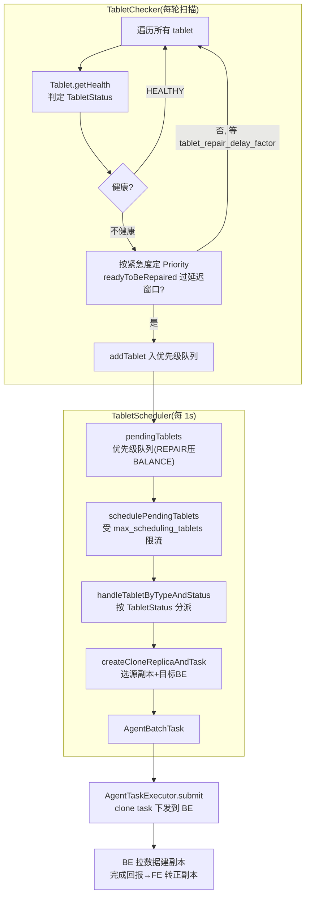
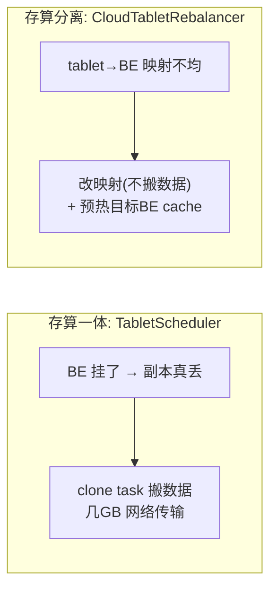

# 第 5 章：调度体系 —— Tablet 均衡、副本修复与计算组管理

前四章把 FE 的元数据从内存对象树（[第 1 章](./01-catalog-and-memory.md)）、editlog/checkpoint（[第 2 章](./02-editlog-and-checkpoint.md)）、选主高可用（[第 3 章](./03-fe-ha.md)）一路讲到分离模式的 MetaService/FDB（[第 4 章](./04-metaservice-fdb.md)）。这些都是"元数据本身怎么存怎么恢复"。本章转向一个动态问题：**元数据里记着几十万个 tablet、每个 tablet 三副本散在一堆 BE 上，这些副本会坏、会掉队、会分布不均——谁来盯着、谁来修、谁来搬平？** [第 1 章](./01-catalog-and-memory.md) 1.2 节建立的 `TabletInvertedIndex`（tabletId → 副本都在哪些 BE 的倒排）正是本章的输入源；[part3 第 4 章](../part3-load-lifecycle/04-commit-and-visibility.md) 4.1 节埋的伏笔——"quorum 提交成功但有副本掉队，落后副本交给修复线"——落点也在本章。

这是 part4 里双模式并重的一章：存算一体靠 `TabletScheduler` 做**副本修复 + 数据搬迁式均衡**；存算分离没有本地副本、对象存储兜底持久性，对应物是 `CloudTabletRebalancer` 的 **tablet→BE 映射再均衡 + cache 预热**。同一个"让数据/算力摊平"的问题，在两种架构下是两副面孔。

本章的行号引用基于写作时核实所用的 HEAD（`02b3127b15`，源码树与系列基线 `7bc98f696f` 一致）。代码演进会让行号漂移，但 `TabletStatus` 枚举、调度队列结构、三种均衡器分工、云侧预热机制的对象名与语义不变；每一处 `路径:行号` 都在当前代码里核实过。

## 5.1 问题：几十万 tablet 谁来看护

**遇到了什么问题？** 一个中等规模的存算一体集群，轻松就有几十万个 tablet，每个 tablet 默认三副本，散落在几十上百台 BE 的若干块盘上。BE 会宕机、磁盘会坏、[part3 第 4 章](../part3-load-lifecycle/04-commit-and-visibility.md) 讲的 quorum 提交还会主动放过掉队副本。于是任何时刻，集群里都可能有一批副本"缺了""版本落后了""多了""该挪窝了"。同时，导入、扩缩容会让数据在 BE 之间越堆越不均。**必须有一个后台机制，持续发现这些不健康/不均衡的 tablet，并把它们修回健康、搬到均匀。** 难点在规模：几十万 tablet 乘以后台巡检，稍不留神就把 FE 主节点自己拖垮，或者把集群网络/磁盘打爆。

**有哪些候选方案，各有什么优劣？**

- **候选一：不管，坏一个少一个。** 靠 quorum 和多副本硬扛，副本坏了就少一个，等它自然掉到读不出来才报错。实现最省事，但副本数只减不增——一次滚动重启、几块坏盘之后，热点 tablet 可能只剩单副本甚至零副本，可用性随时间**单调衰减**。生产不可接受。
- **候选二：全量周期巡检。** 起一个定时任务，每隔 N 分钟把所有库、所有表、所有分区、所有 tablet 从头扫一遍，逐个判断健康、逐个下发修复。逻辑直白，但**扫不过来**：几十万 tablet 全量扫一轮本身就要占用大量 CPU 和锁，扫完一轮的间隔可能长达几十分钟，一个副本从坏到被发现的延迟不可控；而且它不分轻重——一个只剩单副本、命悬一线的 tablet，和一个三副本齐全只是稍微不均的 tablet，在全量扫描里被一视同仁地排队处理。
- **候选三：事件驱动 + 分级队列巡检。** 把"发现"和"处置"拆成两个角色：一个巡检器（`TabletChecker`）持续扫描但只做**健康判定**，把不健康的 tablet 按紧急程度打上优先级、塞进一个**优先级队列**；一个调度器（`TabletScheduler`）从队列头部取任务，**限流地**下发修复/均衡。发现与处置解耦，让处置端可以按优先级抢占、按配额限流。

**Doris 怎么考量和解决的？** Doris 选了候选三，而且刻意让**修复与均衡共用同一条调度管道**。这个设计有两层取舍值得说清：

其一，**发现 / 处置分离 + 优先级队列**。`TabletChecker` 只管"看"，不管"修"——它一轮扫描把所有不健康 tablet 找出来，给命悬一线的（比如只剩单副本）打上 `VERY_HIGH`，给只是稍微掉队的打 `LOW`，一起塞进 `TabletScheduler` 的 pending 优先级队列。调度器永远从**队头（最紧急）**取任务，于是"最危险的 tablet 最先被修"这件事是队列结构天然保证的，不依赖巡检顺序。这解决了候选二"不分轻重"的毛病。

其二，**修复与均衡共用一条管道，但修复优先。** 副本修复（REPAIR）和负载均衡（BALANCE）本质都是"给某个 tablet 在某台 BE 上克隆一份新副本，再删掉旧的"，克隆动作、限流配额、工作槽位完全一样，没必要各造一套。所以 Doris 把它们塞进同一个 `TabletScheduler`，用同一套 `max_scheduling_tablets` 配额、同一批 BE 工作槽。但两者优先级天差地别：**修复是救命，均衡是锦上添花**。因此管道内建了一条铁律——REPAIR 永远压过 BALANCE（5.2 会看到 `addTablet` 里的具体代码），且均衡只在修复没占满配额时才有资格跑。这样"一条管道"既省了重复实现，又不会让均衡任务饿死了救命的修复任务。代价是：均衡和修复抢同一份配额，繁忙修复期间均衡几乎停摆——但这恰恰是想要的行为。

注意：以上全是**存算一体**的故事。[part1 第 2 章](../part1-architecture/02-three-components.md) 2.3 节已点明 `tabletScheduler`「仅存算一体——存算分离下数据在对象存储里，无需副本调度」。分离模式的对应物是完全不同的另一套（5.4 详述）。

## 5.2 源码走读：发现与调度

存算一体的这套调度，主体是 `clone` 包下三个类：巡检器 `TabletChecker`、调度器 `TabletScheduler`、以及被调度的任务单元 `TabletSchedCtx`。三者都由 [第 1 章](./01-catalog-and-memory.md) 讲的 `Env` 在启动时创建并托管为后台守护线程。

### 巡检器：只做健康判定，按优先级入队

`TabletChecker`（`fe/fe-core/src/main/java/org/apache/doris/clone/TabletChecker.java:66`，继承 `MasterDaemon`）是那个"看"的角色。每一轮 `runAfterCatalogReady`（`:202`）调 `checkTablets`（`:236`），遍历所有库表分区的 tablet。这里显而易见、不必逐行的部分是双层循环遍历对象树；真正的关键在**它对每个 tablet 只做两件事**：判健康、够条件就入队。

判健康的权威不在 checker 自己，而在 `Tablet` 对象。checker 拿到 tablet 的健康结果后（`tabletHealth.status` + `priority`），对属于"优先修复表"（用户 `ADMIN REPAIR TABLE` 指定的）的分区直接把优先级抬到 `VERY_HIGH`（`fe/fe-core/src/main/java/org/apache/doris/clone/TabletChecker.java:391`），然后一个关键判断：`tablet.readyToBeRepaired(infoService, priority)`（`:396`）——**不健康不等于立刻修**。这里引出本章第一个 tricky 配置：修复延迟。

**tricky 点：`tablet_repair_delay_factor_second` —— 为什么发现了坏副本还要等。** 参数在 `fe/fe-common/src/main/java/org/apache/doris/common/Config.java:972`，默认 60 秒（`@ConfField(mutable = true, masterOnly = true)`，可热更）。语义是按优先级分级延迟修复（`:967`-`969` 的注释）：`VERY_HIGH` 立即修，`HIGH` 延迟 `factor × 1`，`NORMAL` 延迟 `factor × 2`，`LOW` 延迟 `factor × 3`。**为什么要故意延迟？** 因为一台 BE 短暂重启、网络抖一下，副本会瞬间"消失"又很快回来。如果发现即修，一次 BE 滚动重启就会触发全集群 tablet 的疯狂克隆——把好端端的数据在网络上搬来搬去，纯属浪费还打爆集群。延迟修复给了"副本自己恢复"一个窗口，只有真的过了这个窗口还没回来，才判定它需要克隆。**错写会怎样**：把这个值调成 0 或很小，等于取消保护窗口，一次寻常的 BE 重启就能引发修复风暴；调得过大，则真坏的副本迟迟不修，可用性下降。够条件的 tablet 最终通过 `tabletScheduler.addTablet`（`:410`）入队。

### 健康判定：`TabletStatus` 枚举，看错状态就修错方向

副本健康的真正判定逻辑在 `Tablet.getHealth`（`fe/fe-core/src/main/java/org/apache/doris/catalog/Tablet.java`），返回一个 `TabletStatus`。这个枚举必须逐一认清，因为**不同状态对应完全不同的处置动作，看错状态就修错方向**。真实枚举定义在 `fe/fe-core/src/main/java/org/apache/doris/catalog/Tablet.java:59`，共 12 个值：

| 状态 | 含义 | 处置方向 |
| --- | --- | --- |
| `HEALTHY` | 副本数够、版本齐 | 不处理 |
| `REPLICA_MISSING` | 存活副本数不够 | 克隆一个新副本补齐 |
| `VERSION_INCOMPLETE` | 副本数够但版本落后 | 从高版本副本增量克隆补版本 |
| `REPLICA_RELOCATING` | 副本健康但正在迁走（BE decommission） | 迁移 |
| `REDUNDANT` | 副本太多 | 删冗余副本 |
| `REPLICA_MISSING_FOR_TAG` | 指定 tag 的 BE 上健康副本不够 | 在对应 tag 上补 |
| `FORCE_REDUNDANT` | 有副本坏/缺但无处修，只能先删一个腾位 | 强制删冗余 |
| `COLOCATE_MISMATCH` | 副本没落在 colocate 规定的 BE 集合上 | 按 colocate 约束搬 |
| `COLOCATE_REDUNDANT` | 落在 colocate 集合上但有多余 | 删多余 |
| `NEED_FURTHER_REPAIR` | 某个副本需要一次确定性的修复 | 定向修 |
| `UNRECOVERABLE` | 没有一个副本是健康的 | 无法自愈，放弃 |
| `REPLICA_COMPACTION_TOO_SLOW` | 某副本版本计数远超其他副本 | 特殊处理慢副本 |

**易错点：`REPLICA_MISSING` vs `VERSION_INCOMPLETE`，处置差之毫厘。** 这两个最容易混。`REPLICA_MISSING` 是"副本个数不够"（一台 BE 死了，三副本变两副本），处置是**全量克隆**一个新副本到另一台 BE；`VERSION_INCOMPLETE` 是"个数够但有副本版本落后"（正是 [part3 第 4 章](../part3-load-lifecycle/04-commit-and-visibility.md) 4.1 节 quorum 提交放过的那个掉队副本），处置是**增量克隆**——只把缺的那几个版本从高版本副本补过来，不必整份搬。判定逻辑在 `fe/fe-core/src/main/java/org/apache/doris/catalog/Tablet.java:431`-`546`（普通表）和 `:631`-`671`（colocate 表）能逐条看到状态是怎么算出来的。如果健康判定把二者弄反，要么对一个只差几个版本的副本做全量克隆（浪费巨大带宽），要么对一个真缺的副本只做增量克隆（永远补不齐）。这就是为什么这套状态机要分这么细——**每种"不健康"的成因不同，最省力的修法也不同**。

### 调度器：从优先级队列到 clone 任务下发

`TabletScheduler`（`fe/fe-core/src/main/java/org/apache/doris/clone/TabletScheduler.java:103`，继承 `MasterDaemon`）是"修"的角色，循环周期是 `tablet_schedule_interval_ms`（`:155`；`fe/fe-common/src/main/java/org/apache/doris/common/Config.java:1038` 默认 1000ms，注意这个是 `@ConfField(mutable = false)`——**不可热更**，注释直言"生产环境别改")。每一轮 `runAfterCatalogReady`（`:353`）干两件事：先 `selectTabletsForBalance`（`:361`）挑均衡任务入队，再 `schedulePendingTablets`（`:362`/`:423`）从队头取任务处置。

被调度的任务单元是 `TabletSchedCtx`（`fe/fe-core/src/main/java/org/apache/doris/clone/TabletSchedCtx.java:73`），它 `implements Comparable`——**队列的优先级排序就是靠它的 `compareTo`**。它有三个关键枚举（`:95`-`115`）：`Type {BALANCE, REPAIR}` 区分是修复还是均衡；`BalanceType {BE_BALANCE, DISK_BALANCE}`；`Priority {LOW, NORMAL, HIGH, VERY_HIGH}`。此外它记着 `failedSchedCounter`（调度失败次数），用于**动态优先级**——一个反复调度失败的 tablet 会被逐步降权，避免它一直卡在队头把别人饿死。

**tricky 点：`max_scheduling_tablets` —— 调太小修复慢、调太大打爆集群。** 入队的把关全在 `addTablet`（`fe/fe-core/src/main/java/org/apache/doris/clone/TabletScheduler.java:256`）。这段代码把 5.1 说的两条设计铁律都落到了实处，值得逐段看：

```java
// REPAIR has higher priority than BALANCE.
if (contains && !force) {
    if (tablet.getType() == TabletSchedCtx.Type.REPAIR) {
        allTabletTypes.put(tabletId, TabletSchedCtx.Type.REPAIR);  // 已在队里的升级为 REPAIR
    }
    return AddResult.ALREADY_IN;
}
...
if (!force && (pendingTablets.size() >= Config.max_scheduling_tablets
        || runningTablets.size() >= Config.max_scheduling_tablets)) {
    TabletSchedCtx lowestPriorityTablet = pendingTablets.peekLast();  // 队尾=最低优先级
    if (lowestPriorityTablet == null || lowestPriorityTablet.compareTo(tablet) <= 0) {
        return AddResult.LIMIT_EXCEED;   // 新来的还不如队尾，拒收
    }
    // 新来的比队尾紧急，踢掉队尾、挤进来
    addResult = AddResult.REPLACE_ADDED;
    pendingTablets.pollLast();
    ...
}
```

`max_scheduling_tablets`（`fe/fe-common/src/main/java/org/apache/doris/common/Config.java:1104`，默认 **2000**，可热更）是**同时在途调度的 tablet 数上限**。这是那个两难的旋钮：调**太小**，pending/running 队列早早满员，新来的坏副本要么被拒（`LIMIT_EXCEED`）要么得挤掉别人，修复吞吐上不去，一批坏副本要排很久才轮到；调**太大**，同时在途的克隆任务太多，几千个 tablet 同时在 BE 之间搬数据，网络和磁盘 IO 被打爆，正常查询导入都受影响。默认 2000 是个折中。注意上面代码里"队满时新任务若比队尾紧急就踢掉队尾"的逻辑——这保证了**即使队列满了，一个 `VERY_HIGH` 的救命修复也总能挤进来**，不会因为队列被一堆低优先级均衡任务占满而进不来。

处置的分发在 `handleTabletByTypeAndStatus`（`:686`）：REPAIR 类型按 `TabletStatus` 分派到不同 handler（`REPLICA_MISSING → handleReplicaMissing`、`VERSION_INCOMPLETE → handleReplicaVersionIncomplete`……与上面那张状态表一一对应），BALANCE 类型走 `doBalance`（`:726`）。修复类最终都汇到 `createCloneReplicaAndTask`（`fe/fe-core/src/main/java/org/apache/doris/clone/TabletSchedCtx.java:993`）：它先 `chooseSrcReplica`（`fe/fe-core/src/main/java/org/apache/doris/clone/TabletSchedCtx.java:592`，从健康副本里挑克隆源）、选好目标 BE，建一个 `CLONE` 状态的空副本，造出 `CloneTask`（`fe/fe-core/src/main/java/org/apache/doris/clone/TabletSchedCtx.java:1056`）。这些 task 攒进一个 `AgentBatchTask`，一轮调度结束由 `AgentTaskExecutor.submit` 批量下发到各 BE。BE 收到 clone task 后真正去拉数据、建副本，完成后回报，FE 再把 `CLONE` 副本转正、更新版本。

把整条链路串起来：



## 5.3 源码走读：三种均衡器

修复解决"副本坏了怎么补"，均衡解决"副本分布不均怎么摊平"。均衡任务的产生入口是调度器每轮开头的 `selectTabletsForBalance`（`fe/fe-core/src/main/java/org/apache/doris/clone/TabletScheduler.java:361`/`:1345`），它把要搬的 tablet 包装成 `Type.BALANCE` 的 `TabletSchedCtx` 塞进同一个 pending 队列。真正决定"哪些 tablet 该搬、搬到哪"的策略，抽象在 `Rebalancer`（`fe/fe-core/src/main/java/org/apache/doris/clone/Rebalancer.java:59`）基类，有三个实现，**分工不同、触发条件不同**：

- **`BeLoadRebalancer`（BE 间负载均衡）**（`fe/fe-core/src/main/java/org/apache/doris/clone/BeLoadRebalancer.java:54`）。类头注释写得很清楚：从**高负载 BE** 上挑出候选 tablet，为它们找一台低负载 BE 迁过去；顺带在高负载 BE 上删冗余副本。这是最常规的均衡——把 tablet 从满的 BE 搬到空的 BE，抹平 BE 之间的负载差。
- **`DiskRebalancer`（盘间均衡）**（`fe/fe-core/src/main/java/org/apache/doris/clone/DiskRebalancer.java:55`）。它和上面那个不同层次：**不跨 BE，只在一台 BE 内部把 tablet 从满的盘挪到空的盘**。它的触发条件很讲究（类注释）：**只在集群已经均衡时才工作**（没有高/中负载 BE 了），因为如果 BE 之间都还没摊平，先操心单机盘间不均是本末倒置；例外是用户手动指定了优先盘时无视这个前提。
- **`PartitionRebalancer`（分区打散）**（`fe/fe-core/src/main/java/org/apache/doris/clone/PartitionRebalancer.java:61`）。前两个看的是"BE 的总负载/总大小"，这个只看**单个分区的副本在各 BE 上的分布是否倾斜**（skew = 某分区在所有 BE 上的最大副本数减最小副本数）。它用 `TwoDimensionalGreedyRebalanceAlgo` 贪心地减小 skew。为什么单独要它？因为可能整体负载很均、但某个热点分区的副本全挤在少数 BE 上，查这个分区时热点打满那几台机——按分区打散能治这种"局部倾斜"。

**用哪个是配置决定的**：`tablet_rebalancer_type`（`fe/fe-common/src/main/java/org/apache/doris/common/Config.java:1113`，默认 `"BeLoad"`）在 `TabletScheduler` 构造时选 `BeLoadRebalancer` 或 `PartitionRebalancer`（`:162`/`:164`）；而 `DiskRebalancer` 是**总在旁边的兜底**——主均衡器没挑出任务时，再用盘间均衡找活干（`:167`、`:1395`）。

**均衡与修复抢配额，怎么协调？** 前面说了共用一条管道、修复优先，均衡受额外一层配额约束。均衡任务的入队额度由 `getBalanceTabletsNumber`（`:1412`）算：`min(schedule_batch_size - 当前pending数, max_balancing_tablets - 当前balancing数)`。也就是说，均衡能塞多少，取决于（a）本轮批次还剩多少空位、（b）在途均衡任务离上限 `max_balancing_tablets`（`fe/fe-common/src/main/java/org/apache/doris/common/Config.java:1109`，默认 **100**）还差多少。**修复不占这个 100 的额度，均衡占**——于是修复繁忙、pending 队列被修复任务占满时，`schedule_batch_size - pending` 逼近 0，均衡自然挤不进来，天然让路给修复。这就是"一条管道、修复优先"在配额层面的具体实现。

**tricky 点：均衡的"移动代价"与 `disable_balance`。** 均衡不是免费的——搬一个大 tablet 意味着在网络上完整传输它的全部数据，几个 GB 的 tablet 迁移会实打实占用源 BE、目标 BE 的磁盘 IO 和集群带宽。均衡追求的"分布更均"是长期收益，但迁移过程本身对**当下**的查询导入是干扰。所以 Doris 给了 `disable_balance`（`fe/fe-common/src/main/java/org/apache/doris/common/Config.java:1076`，默认 false，**可热更** `@ConfField(mutable = true, masterOnly = true)`）这个总开关：大促、大批量导入等关键时段，运维可以临时 `ADMIN SET FRONTEND CONFIG("disable_balance"="true")` 把均衡整个停掉，只保留救命的修复，避免均衡搬迁和业务抢 IO。代码里 `scheduleTablet` 一开头就查这个开关，是 BALANCE 类型就直接跳过（`:511`）。相关地，`balance_load_score_threshold`（`fe/fe-common/src/main/java/org/apache/doris/common/Config.java:1046`，默认 0.1 即 10%，可热更）控制"负载差多大才算不均、才值得搬"——阈值太小会为了鸡毛蒜皮的不均频繁搬迁，得不偿失。

**易错点：colocate 表的副本不能自由搬。** 上面三种均衡器面对普通表可以自由地把副本从任意 BE 挪到任意 BE。但 **colocate（联合分布）表**有个硬约束：为了让 join 能在本地完成（同一个 bucket 的多张表的副本必须落在同一批 BE 上），colocate 组内所有表的副本分布必须严格一致。如果普通均衡器随手把某个 colocate 表的副本搬走，就破坏了这个"共置"前提，join 会退化成跨节点 shuffle。所以 colocate 表的均衡**不归 `TabletScheduler` 的常规均衡管**，而是由专门的 `ColocateTableCheckerAndBalancer`（`fe/fe-core/src/main/java/org/apache/doris/clone/ColocateTableCheckerAndBalancer.java:64`，独立的 `MasterDaemon`）负责。它每轮 `runAfterCatalogReady`（`:338`）先 `relocateAndBalanceGroups`（`:339`/`:381`）**以整个 colocate 组为单位**重新计算一套满足共置约束的 BE 分布，再 `matchGroups`（`:340`/`:476`）把实际副本往这套目标分布上对齐。这也是为什么 colocate 表的 tablet 健康状态里有专门的 `COLOCATE_MISMATCH`/`COLOCATE_REDUNDANT`（5.2 那张表）——普通表根本没有这两个状态。**理解这点才能解释一个常见现象**：colocate 组在扩缩容后会短暂进入 unstable，此时该组的均衡被锁住、join 可能临时降级，等 `ColocateTableCheckerAndBalancer` 把整组重新对齐、恢复 stable 才好——这不是 bug，是共置约束的必然代价。

## 5.4 双模式对比（本章重点段）

前三节全是**存算一体**：数据是 BE 本地盘上的三份实体，副本会真的丢，所以要修；副本分布会真的不均，所以要搬——搬的是**几个 GB 的实体数据**。**存算分离把这套逻辑的地基抽掉了。**

**为什么分离模式没有副本修复、也没有数据搬迁式均衡？** 因为 [part2 第 5 章](../part2-query-lifecycle/05-plan-distribution.md) 5.4 节讲透的那件事：分离模式下**数据只有一份，躺在对象存储上，BE 是无状态计算节点，本地盘只是 File Cache**。对象存储自身有多副本/纠删码保证持久性——**BE 挂了，数据一个字节都不会丢**，因此根本没有"副本缺失"要修，`TabletStatus` 那套 `REPLICA_MISSING`/`VERSION_INCOMPLETE` 在这里无从谈起。同理，"均衡"也不再是搬数据——数据本来就不在 BE 上，搬什么？分离模式的均衡对象变成了**计算：哪个 tablet 该由计算组里的哪台 BE 来算**。

**分离模式的对应物：`CloudTabletRebalancer`。** 类在 `fe/fe-core/src/main/java/org/apache/doris/cloud/catalog/CloudTabletRebalancer.java:82`（继承 `MasterDaemon`，由 `CloudEnv` 在 `fe/fe-core/src/main/java/org/apache/doris/cloud/catalog/CloudEnv.java:102` 创建、`:173` 启动，与存算一体的 `TabletScheduler` 互斥——只起其中一个）。它维护的核心状态是 `beToTabletsGlobal`（`:85`，一张 `beId → 该 BE 负责的 tablet 集合`）和 `clusterToBes`（`:97`，计算组 → BE 列表）。它每轮（`cloud_tablet_rebalancer_interval_second`，`fe/fe-common/src/main/java/org/apache/doris/common/Config.java:3144` 默认 **1 秒**，可热更）`runAfterCatalogReady`（`:498`）做的事，本质是**重新计算 tablet→BE 的映射，让每台 BE 负责的 tablet 数尽量均匀**——[part2 第 5 章](../part2-query-lifecycle/05-plan-distribution.md) 5.4 节讲的 `CloudReplica` 的 `hashReplicaToBe()` 那个"朴素取模 `hash % N`"决定了初始落点，这个 rebalancer 则在此基础上做二次微调、抹平取模带来的不均。

**关键：它改的是映射，不是数据。** 当 rebalancer 决定把某个 tablet 从 BE-A 挪到 BE-B，它**不搬任何数据**（数据在对象存储上，两台 BE 都能直接读），只是把"这个 tablet 归 BE-B 算"这个映射关系改掉。唯一的成本是 **cache 亲和性**：BE-A 本地 File Cache 里缓存的该 tablet 数据块，换到 BE-B 后就失效了，BE-B 第一次算这个 tablet 要重新从对象存储拉一遍（冷 cache）。为了不让这次"换 BE"变成一次性能塌陷，rebalancer 做了 5.4 的点睛之笔——**预热（warmup）**：迁移前先给目标 BE 发一个异步预热 RPC，让它提前把该 tablet 的数据从对象存储拉进本地 cache，等预热完成再切映射。这段在 `sendPreHeatingRpc`（`:1488`，发 `TWarmUpCacheAsyncRequest`）、`sendCheckWarmUpCacheAsyncRpc`（`:1519`，查预热是否完成）、`checkInflightWarmUpCacheAsync`（`:286`，跟踪在途预热任务）里。于是"换 BE"从"立刻冷 cache 塌陷"变成"预热好了再无缝切"。迁移比例受 `cloud_balance_tablet_percent_per_run`（`fe/fe-common/src/main/java/org/apache/doris/common/Config.java:3165`，默认 5%/轮）限流、预热超时受 `cloud_pre_heating_time_limit_sec`（`fe/fe-common/src/main/java/org/apache/doris/common/Config.java:3156`，默认 300s）约束。



**计算组加减节点的 warmup。** 除了 rebalancer 内部的迁移预热，Doris 还有一个用户可显式触发的预热作业 `CloudWarmUpJob`（`fe/fe-core/src/main/java/org/apache/doris/cloud/CloudWarmUpJob.java:69`，`implements Writable` 即会持久化）。它有 `JobState {PENDING, RUNNING, FINISHED, CANCELLED, DELETED}` 状态机和 `JobType {CLUSTER, TABLE, TABLES}`——即可以按整个计算组、按表、按多表来预热。**典型场景**：新加一个计算组、或给计算组扩了 BE，这批新 BE 的本地 cache 是空的，直接接查询会全 cache miss、慢得吓人。用 `WARM UP` 作业主动把指定表的数据提前灌进新 BE 的 cache，等预热完再切流量过去，就避免了扩容瞬间的性能塌陷——这与 [第 4 章](./04-metaservice-fdb.md) 4.4 节讲的"计算组加减 BE 从 MS 权威同步到 FE 缓存"是一套事的两面：4.4 讲拓扑怎么同步，这里讲同步后新节点的数据 cache 怎么暖起来。

一张表对照两种模式：

| 维度 | 存算一体 | 存算分离 |
| --- | --- | --- |
| **故障形态** | BE 挂→副本真丢，需修复 | BE 挂→数据不丢（对象存储兜底），无副本可修 |
| **均衡对象** | 副本在 BE/盘上的物理分布 | tablet→BE 的计算映射 |
| **搬的是什么** | 几个 GB 的实体数据（clone task） | 只改映射，不搬数据 |
| **代价** | 网络/磁盘 IO，占带宽 | 目标 BE cache 冷启动（靠预热缓解） |
| **负责类** | `TabletScheduler` + 三种 Rebalancer | `CloudTabletRebalancer` + `CloudWarmUpJob` |

## 5.5 动手实验

通用环境搭建（3 BE 存算一体集群怎么起、`SHOW BACKENDS` 怎么看）沿用 [part1 第 5 章](../part1-architecture/05-source-map-and-dev-env.md)，不重复。本节两个实验分别验证核心点（副本修复真的会自动发生）和主动踩易错点（把配额调小制造修复排队）。两个实验都需要一个 3 BE、建三副本表的存算一体环境。

### 核心点：kill 一个 BE，观察副本修复任务产生

**目标**：亲手看到"BE 挂 → 副本缺失被发现 → 延迟窗口后触发 clone 修复 → 副本补齐"的全过程。

1. 建一张三副本表，导入一些数据，`SHOW TABLETS FROM tbl` 记下几个 tablet 的副本分布（每个 tablet 三个副本在三台 BE 上）。
2. **kill 掉一台 BE 的进程**，`SHOW PROC '/backends'` 确认它变为非 alive。此刻每个 tablet 只剩两个存活副本——`Tablet.getHealth` 会把它们判成 `REPLICA_MISSING`。
3. **观察延迟窗口**：kill 之后**不会立刻**看到修复。因为 5.2 讲的 `tablet_repair_delay_factor_second`（默认 60s）延迟窗口——checker 发现了缺副本，但要等过了窗口（对 `NORMAL` 优先级是 `60 × 2 = 120s`）才判定"真该修"。这就是设计上给"BE 自己回来"留的机会。
4. **观察修复任务**：过了延迟窗口，用 `SHOW PROC '/cluster_balance'`（注册在 `fe/fe-core/src/main/java/org/apache/doris/common/proc/ProcService.java:54`）看调度队列——`SHOW PROC '/cluster_balance/pending_tablets'` 和 `/running_tablets`（`fe/fe-core/src/main/java/org/apache/doris/common/proc/ClusterBalanceProcDir.java:41`-`43`）会出现正在修复的 tablet，`SHOW PROC '/cluster_balance/sched_stat'` 看调度统计。同时 `SHOW PROC '/cluster_health/tablet_health'`（`fe/fe-core/src/main/java/org/apache/doris/common/proc/ProcService.java:55` → `ClusterHealthProcDir` → `TabletHealthProcDir`）会列出各库的 `ReplicaMissingNum` 等计数（列名见 `fe/fe-core/src/main/java/org/apache/doris/common/proc/TabletHealthProcDir.java:59`-`65`），你能看到 `ReplicaMissingNum` 先涨后落。
5. **确认修复完成**：等 clone 任务跑完，`SHOW TABLETS FROM tbl` 会看到缺的副本在**另一台存活 BE** 上被重建，副本数回到 3。`ReplicaMissingNum` 归零。这就验证了整条 checker→scheduler→clone 链路。

### 易错点：把调度配额调小，制造修复排队

这是要主动踩的点，把 5.2 的"限流配额"和"优先级队列"亲手压出来。

1. **先确认参数可热更再动手**（批 3 教训：声称可热更前必须核实注解）。`max_scheduling_tablets` 在 `fe/fe-common/src/main/java/org/apache/doris/common/Config.java:1104` 是 `@ConfField(mutable = true, masterOnly = true)`——**可热更**，能直接 `ADMIN SET FRONTEND CONFIG`。放心把它调小：`ADMIN SET FRONTEND CONFIG ("max_scheduling_tablets" = "10");`（正常默认 2000，这里故意压到 10，制造"配额远小于坏副本数"的局面）。
2. **制造批量副本缺失**：在一个副本数远多于 10 的表上，kill 一台 BE，一次性产生几百上千个 `REPLICA_MISSING` tablet。
3. **观察排队与优先级**：`SHOW PROC '/cluster_balance/pending_tablets'` 会看到大量 tablet 卡在 pending 队列里——因为在途上限只有 10，绝大多数只能排队等前面的修完才轮到。`SHOW PROC '/cluster_balance/priority_repair'`（`fe/fe-core/src/main/java/org/apache/doris/common/proc/ClusterBalanceProcDir.java:59` 的 `PriorityRepairProcNode`）能看到优先级抢占：如果你此时对某张表 `ADMIN REPAIR TABLE` 把它抬成 `VERY_HIGH`，它会插到队头优先被修，验证 5.2 讲的"队满时高优先级也能挤进来"。
4. **恢复**：`ADMIN SET FRONTEND CONFIG ("max_scheduling_tablets" = "2000");` 改回默认，观察积压的 pending 队列迅速被消化、副本陆续补齐。把重启的 BE 拉起来，多余的 `CLONE`/`REDUNDANT` 副本会被清理，集群回到健康。**踩这一脚的收获**：亲眼看到配额就是修复吞吐的阀门——调太小时修复被人为限速、坏副本排长队，这正是生产上"副本迟迟不修"的一类根因（见 5.6）。

## 5.6 排查清单

- **症状 A：副本长期不修复（`ReplicaMissingNum` 居高不下）。** 按 5.2 的链路逐段排除。(1) **调度器被关了**：查 `disable_tablet_scheduler`（`fe/fe-common/src/main/java/org/apache/doris/common/Config.java:1770`，可热更）是不是被人设成了 true——它一开就 REPAIR/BALANCE 全停。(2) **配额被占满或调太小**：`SHOW PROC '/cluster_balance'` 看 pending/running 数是否顶到 `max_scheduling_tablets`（5.5 易错点那种局面），若是则调大配额或先处理积压。(3) **无处可修**：三副本表若同时挂了两台 BE、或剩下的 BE 磁盘都满了（没有合法的克隆目标），tablet 会卡在 `FORCE_REDUNDANT` 甚至 `UNRECOVERABLE`——`UNRECOVERABLE` 意味着没有一个健康副本，调度器直接放弃（`fe/fe-core/src/main/java/org/apache/doris/clone/TabletScheduler.java` 里 `throw SchedException(UNRECOVERABLE)`），这已不是调度能救的，得先补 BE / 清磁盘。(4) **克隆源 BE 被拉黑或磁盘满**：clone 需要一个健康的源副本和一个有空间的目标盘，两头任一不满足都会反复失败、`failedSchedCounter` 累加、优先级被降，表现为"一直在调度但一直不成功"。
- **症状 B：均衡风暴打满网络/磁盘。** 表现是没有故障、但集群网络和磁盘 IO 被大量 clone 占满，查询导入变慢。多半是均衡搬迁太凶。**应急**：`ADMIN SET FRONTEND CONFIG ("disable_balance" = "true")`（5.3，可热更）先把均衡整个停掉，只保留修复，观察 IO 是否回落。**根因**通常是 `balance_load_score_threshold` 太小（一点点不均就触发搬迁）或刚做完大规模扩缩容（大量 tablet 需要重新摊平）。缓解方向：适当调大阈值、或在业务低峰再开均衡。注意区分——如果是真扩容后的一次性摊平，让它在低峰跑完即可，不是 bug。
- **症状 C：colocate 表长期 unstable。** `SHOW PROC '/colocation_group'` 看到某个 colocate 组一直 `isStable = false`，且该组的 join 退化成 shuffle。根因是 `ColocateTableCheckerAndBalancer`（5.3）没能把整组副本对齐到一套满足共置约束的 BE 分布上——常见于 BE 数不够（凑不齐每个 bucket 需要的、互不重叠的 BE 集合）、或有 BE 长期不 alive 导致目标分布算不出来。排查：确认组内 BE 是否足够且都健康；`COLOCATE_MISMATCH` 的 tablet 是否卡在调度队列里修不动（回到症状 A 的配额/黑名单排查）。记住 colocate 均衡走的是**独立于常规 `TabletScheduler` 的专用通道**，别在常规均衡里找它的问题。

至此，存算一体"几十万 tablet 谁看护"这条主线就完整了：`TabletChecker` 发现并按优先级入队（5.2）、`TabletScheduler` 限流地把修复与均衡塞进同一条管道且修复优先（5.2/5.3）、三种 Rebalancer 分层摊平负载（5.3）；而分离模式因对象存储兜底，把"修数据"降维成了"改映射 + 预热 cache"（5.4）。这份"副本调度"能力正是 part6 副本故障篇的基础——那里会从故障注入的角度，再把本章的修复链路压到极限去看它的边界。到此 part4「FE 内部机制」六章（元数据内存/持久化/高可用/分离元数据/调度/……）在存算一体与存算分离两条线上都已铺齐。
