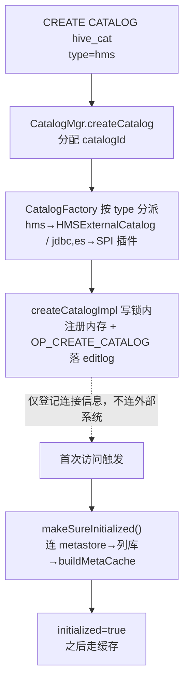
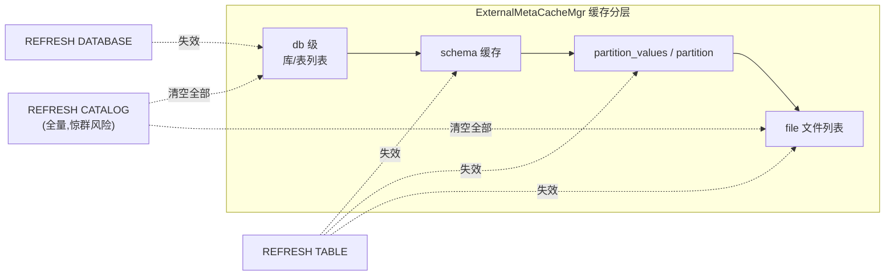

# 第 6 章：外部数据源 —— Catalog 联邦查询架构概览

前五章把 FE 的"自家元数据"讲透了：内存里怎么组织（第 1 章）、怎么持久化到 editlog 与 image（第 2 章）、怎么靠 bdbje 做高可用选主（第 3 章）、分离模式下怎么把权威搬到 MetaService（第 4 章）、几十万 tablet 谁看护（第 5 章）。但生产里的 Doris 极少是一座孤岛——它左边是 Hive/Iceberg 数据湖，右边是 MySQL/PostgreSQL 业务库，用户想的是"在一条 SQL 里把湖仓和业务库 join 起来"，而不想为此把别人的数据先 ETL 搬一份进来。这就是**联邦查询**：让 Doris 直接读别人的元数据和数据，把"别人的表"当"自己的表"来查。

本章是 part4 的收尾，也是**概览定位**——目标是把"外部 Catalog 这套抽象为什么长这样、元数据从哪来、缓存怎么失效"这条主干讲清楚，让你在排查"外表查不到新数据""连不上 Hive"这类问题时知道该往哪一层看；而外表查询在 BE 侧的执行细节（split 怎么切、文件怎么读、谓词怎么下推）不在本章展开，那属于查询执行的范畴。读完本章你应当能回答三件事：为什么 Doris 选"统一 Catalog 抽象 + 按源实现"而不是把数据搬进来、也不是给每种源写一套专用入口；外部元数据为什么必须缓存、缓存分成哪几层、每一层的失效由谁触发；以及缓存一致性坑（外部新增分区查不到、schema 变了报错）到底对应哪一层缓存没刷。

> 基线：本章源码引用基于写作时核实所用的 HEAD（`cfd44d492c`，源码树与系列基线 `7bc98f696f` 一致）。

## 6.1 问题：别人的元数据怎么为我所用

### 第一个问题：怎么让 Doris 能查到别人的表

**问题。** 用户有一张躺在 Hive Metastore 里、数据文件在 HDFS/S3 上的表，想在 Doris 里直接查它，还要和 Doris 内部表 join。Doris 怎么才能"认识"这张它没建过、也没导入过的表？

**候选一：ETL 搬进来。** 用一条导入作业把 Hive 表的数据抽进 Doris 内部表，之后就当普通内部表查。优点是查询走的是 Doris 最熟悉的本地路径，最快。缺点是致命的两条：其一**延迟**——外部表一变，Doris 里的副本就旧了，得靠定时任务反复重抽，永远慢一拍；其二**存储翻倍**——同一份数据在数据湖存一份、又在 Doris 存一份（还是三副本），量大了成本无法接受。对"偶尔查一次别人的表"这种需求，为它长期养一份副本是巨大的浪费。

**候选二：为每种外部源写一套专用入口。** Hive 走一套连接与查询代码、Iceberg 走另一套、MySQL 再一套……每种源都从 SQL 解析、元数据获取到数据读取端到端实现一遍。优点是每套都能针对该源做极致优化。缺点是**组合爆炸**：Doris 内部有 N 个需要"表"这个概念的入口（元数据展示 `SHOW`、权限、规划器的统计信息、scan 算子……），外部源有 M 种，专用入口意味着要维护 N×M 套适配，每加一种新源就要把所有入口改一遍，根本无法扩展。

**Doris 的选择：统一 Catalog 抽象 + 按源实现。** Doris 把"目录"抽象成一个统一接口 `CatalogIf`（`fe/fe-core/src/main/java/org/apache/doris/datasource/CatalogIf.java:50`），内部目录 `InternalCatalog` 和一切外部目录都实现它；外部目录再统一继承抽象基类 `ExternalCatalog`（`fe/fe-core/src/main/java/org/apache/doris/datasource/ExternalCatalog.java:100`），把"连接第三方、列库、列表、取 schema"这些**共性**收敛到基类，每种源只需实现自己**特有**的那几个方法（怎么连 metastore、怎么列表）。于是规划器、权限、`SHOW` 这些上层入口只面向 `CatalogIf` / `ExternalCatalog` 编程，根本不关心背后是 Hive 还是 Iceberg——N×M 塌缩成 N+M。这正是 [part4 第 1 章](./01-catalog-and-memory.md) 1.2 节里 `Env` → `CatalogMgr` → 各 Catalog 那条路径的另一半：第 1 章只盯 `InternalCatalog`，本章讲的是同一个 `CatalogMgr` 管的外部半边。数据不搬（查询时现读外部文件），元数据靠抽象统一——这就同时避开了候选一的存储翻倍和候选二的组合爆炸。

### 第二个问题：外部元数据每次现拉太慢

统一抽象解决了"能查"，但紧接着冒出性能问题：规划一条查外部表的 SQL，需要它的 schema、分区列表、文件列表——这些都在远端 metastore 和对象存储上。

**候选一：每次查询都现拉。** 每来一条 SQL 就去 Hive Metastore 问一遍 schema、列一遍分区、`list` 一遍文件目录。优点是永远拿到最新元数据、绝不会旧。缺点是**慢且脆**：metastore 的一次 RPC 就是几十毫秒，列一个几万分区的大表要秒级，对象存储 `list` 目录更慢；把这些放进查询关键路径，规划阶段就被拖垮，还把 metastore 打成瓶颈。

**候选二：缓存。** 把 schema、分区、文件列表缓存在 FE 内存里，查询直接读缓存。优点是快。缺点是**一致性**：外部系统在 Doris 背后偷偷加了分区、改了 schema，Doris 的缓存还是旧的，就会"查不到新分区""按旧 schema 读新文件而报错"。

**Doris 的选择：缓存 + 分层失效。** Doris 选缓存换性能，然后用一套**分层的失效机制**来对冲一致性风险——缓存按 db / schema / 分区 / 文件分成多级（6.3 详述），每一级都能被单独失效；失效有三条来路：用户手动 `REFRESH`、后台定时刷新、以及（Hive 场景）订阅 metastore 事件自动失效。这本质是把"一致性"从"每次强一致"降级成"可控的最终一致"，把一致性窗口的大小交给运维通过刷新策略去权衡。**理解这个权衡是本章排查的总纲**：外表相关的怪问题，绝大多数不是 bug，而是"缓存还没到那一层的失效点"。

## 6.2 源码走读：Catalog 抽象与懒加载

### 类型注册：从 CREATE CATALOG 到一个 Catalog 对象

一条 `CREATE CATALOG hive_cat PROPERTIES("type"="hms", ...)` 进来，`CatalogMgr`（`fe/fe-core/src/main/java/org/apache/doris/datasource/CatalogMgr.java:81`）的 `createCatalog()`（`:277`）先分配一个全局唯一的 catalog id，再把"按 `type` 造出对应 Catalog 对象"这件事委托给工厂 `CatalogFactory`（`fe/fe-core/src/main/java/org/apache/doris/datasource/CatalogFactory.java:47`）。工厂的核心是 `createCatalog()`（`:72`）里那段按类型分派的逻辑：内建类型走一个 `switch`（`:135`），`hms` 造 `HMSExternalCatalog`、`iceberg` 走 `IcebergExternalCatalogFactory` 的 `createCatalog()`、`paimon`/`max_compute`/`doris` 各有对应实现。**这里有一个写作时核实到、值得记住的演进**：`jdbc` 和 `es` 这两种类型**不在** `switch` 里，而是走 SPI 连接器插件路径——`CatalogFactory` 顶部的 `SPI_READY_TYPES`（`:53`）只含 `"jdbc"` 和 `"es"`，命中它们时会尝试用连接器插件造一个 `PluginDrivenExternalCatalog`（`fe/fe-core/src/main/java/org/apache/doris/datasource/PluginDrivenExternalCatalog.java`），插件从 `connector_plugin_root`（`fe/fe-common/src/main/java/org/apache/doris/common/Config.java:3564`，默认 `${DORIS_HOME}/plugins/connector`）加载。**误配会怎样**：如果建 JDBC catalog 但插件没装到该目录，非回放路径会直接抛"No connector plugin loaded"报错，回放路径则登记一个降级 catalog、留到首次访问再报错——这也是 6.5 实验为什么选 HMS 而非 JDBC 的原因（HMS 是内建的，不依赖插件）。

**落库靠 editlog，与第 2 章一套机制。** Catalog 对象造好后，`createCatalog()` 转 `createCatalogImpl()`（`:254`）在写锁内先注册进内存、再记一条日志：`logCatalogLog(OperationType.OP_CREATE_CATALOG, ...)`（`:268`）。这正是 [part4 第 2 章](./02-editlog-and-checkpoint.md) 2.2 节讲的那套通用持久化机制——每条元数据变更包装成带 opCode 的 `JournalEntity` 写进 bdbje、多数派确认才算提交、Follower 回放时按 opCode 走 `switch` 分发。第 2 章以建表 `OP_CREATE_TABLE` 为例，建 catalog 只是换了个 opCode `OP_CREATE_CATALOG` 骑在同一条轨道上：Master 记日志、Follower 通过 `CatalogFactory` 的 `createFromLog()`（`:58`）回放重建同一个 catalog 对象。所以"建了个 catalog，重启/切主后还在"这件事，靠的就是第 2 章那套 editlog+image，本章不重复。

### 懒加载与占位：第一次访问的抖动

**tricky 点：`CREATE CATALOG` 不连接外部系统。** 这是最容易踩的直觉陷阱。执行 `CREATE CATALOG` 时，Doris **只是把连接信息（properties）登记下来，并不真的去连 Hive Metastore、也不拉任何库表**。真正的连接、列库、拉 schema 全部推迟到**第一次访问**才发生——这套懒加载收在 `ExternalCatalog` 的 `makeSureInitialized()`（`fe/fe-core/src/main/java/org/apache/doris/datasource/ExternalCatalog.java:398`）里：它是 `final synchronized` 的，第一次被调时走 `initLocalObjects()`（`:425`）→ 子类的 `initLocalObjectsImpl()`（抽象方法 `:380`，HMS 的实现在 `fe/fe-core/src/main/java/org/apache/doris/datasource/hive/HMSExternalCatalog.java:137`）真正建 metastore 客户端，再 `buildMetaCache()`（`:439`）建元数据缓存，最后把 `initialized` 置 true；之后再调直接返回。几乎每个对外方法（`getDb`、`getSchema`……）入口第一行都是 `makeSureInitialized()`，保证"用之前一定初始化过"。

**为什么这么写。** 一个 FE 可能挂几十个外部 catalog，若 `CREATE CATALOG` 或 FE 启动时就全部连接、全部拉元数据，启动会被拖到分钟级，还会因为某个 metastore 暂时不可达而卡住整个 FE 启动。懒加载把这笔开销摊到"真正用到某个 catalog 时"才付，且只付一次。

**错写/误用会怎样——首次访问抖动。** 代价是**第一次访问那个 catalog 的查询会明显变慢**：它要同步地连 metastore、列库、拉 schema，把懒加载省下的启动开销一次性还回来。表现是"catalog 刚建好或 FE 刚重启后，第一条查外表的 SQL 卡几秒甚至更久，之后就快了"。这不是 bug，是懒加载的必然抖动。真正的坑是**误判**：有人看到"第一条查询超时"就以为是网络或权限问题去排查半天，其实只要 metastore 本身可达、稍等初始化完成即恢复。反过来，如果 `initLocalObjectsImpl()` 里连 metastore 真的失败（凭证错、网络不通），`makeSureInitialized()` 会捕获异常、记下 `errorMsg` 并抛出——**且不会把 `initialized` 置 true**，于是下一条查询会再试一遍，而不是永久拿着半初始化的坏状态。这就是 6.6 里"连接失败"和"首次抖动"要分开看的源码依据。

## 6.3 源码走读：元数据缓存与失效

### 缓存分层：真实的类与真实的层级

外部元数据缓存的总管家是 `ExternalMetaCacheMgr`（`fe/fe-core/src/main/java/org/apache/doris/datasource/ExternalMetaCacheMgr.java:60`，由 `Env` 持有，`getExtMetaCacheMgr()` 取用）。写作时核实的缓存层级如下（不是笼统的"一个缓存"，而是职责分明的几级）：

- **db 级（库对象缓存）**：挂在每个 `ExternalCatalog` 自己身上的 `metaCache`，由 `buildMetaCache()`（`fe/fe-core/src/main/java/org/apache/doris/datasource/ExternalCatalog.java:439`）构建，缓存"这个 catalog 有哪些库、每个库对象"。它的过期/刷新参数就是下面要讲的两个 Config。
- **schema 缓存**：表的列定义。所有引擎都有这一级（通用引擎只有这一级）。
- **分区缓存**：Hive 场景细分为两级——`partition_values`（一张表的分区值/索引结构）和 `partition`（按分区值取的单分区元数据）。见 `HiveExternalMetaCache`（`fe/fe-core/src/main/java/org/apache/doris/datasource/hive/HiveExternalMetaCache.java:105`）注册的条目 `ENTRY_PARTITION_VALUES`（`:110`）、`ENTRY_PARTITION`（`:111`）。
- **文件缓存**：分区/表目录下的文件列表（`ENTRY_FILE`，`fe/fe-core/src/main/java/org/apache/doris/datasource/hive/HiveExternalMetaCache.java:112`）——避免每次查询都去对象存储 `list` 目录。
- **跨 catalog 共享的两级**：文件系统/客户端缓存 `FileSystemCache`（`fe/fe-core/src/main/java/org/apache/doris/fs/FileSystemCache.java:37`）和行数统计缓存 `ExternalRowCountCache`（`fe/fe-core/src/main/java/org/apache/doris/datasource/ExternalRowCountCache.java:37`）。

各引擎的缓存实现按引擎注册进 `ExternalMetaCacheMgr` 的注册表（`registerBuiltinEngineCaches`，`:304`）——Hive 用 `HiveExternalMetaCache`，其余用只带 schema 的默认实现。注意：这一块在版本演进中被重构过，老资料里的单一"HiveMetaStoreCache"已不存在，写作时核实的是上述按引擎注册、分条目管理的结构；引用时务必以当前代码为准。

**为什么切成这么多层、而不是一个大缓存？** 因为不同元数据的变化频率和加载代价差别巨大：schema 极少变但每次规划都要读，分区列表随导入频繁增长，文件列表最易膨胀（一个大分区下成千上万个文件）且 `list` 最慢。分层的好处是**失效可以精准**——外部只加了个分区，就只失效分区/文件那两层，不必把好不容易缓存下来的 schema 也一起丢掉重拉。行数统计 `ExternalRowCountCache` 单独一层则是给 CBO 用的：外表没有 Doris 内部表那样实时维护的统计，规划器靠这层缓存的行数估算来选 join 顺序，**它陈旧的后果不是查错、而是选出糟糕的执行计划**——这也是"外表查询突然变慢但结果没错"时该想到的一层。

### 失效粒度：REFRESH 打在哪一层

三条 `REFRESH` 语句在语法层就区分了粒度（`fe/fe-sql-parser/src/main/antlr4/org/apache/doris/nereids/DorisParser.g4:621`-`623`：`refreshCatalog`/`refreshDatabase`/`refreshTable`），落到 `RefreshManager`（`fe/fe-core/src/main/java/org/apache/doris/catalog/RefreshManager.java`）的不同方法，失效范围逐级收窄：

- **`REFRESH CATALOG`**（`handleRefreshCatalog`，`:59`）→ `ExternalCatalog` 的 `onRefreshCache()`（`fe/fe-core/src/main/java/org/apache/doris/datasource/ExternalCatalog.java:643`）：先失效 db 级缓存（`refreshMetaCacheOnly`，`:655`），当带 invalid cache 时再 `invalidateCatalog(id)`（`fe/fe-core/src/main/java/org/apache/doris/datasource/ExternalMetaCacheMgr.java:218`）**把整个 catalog 各引擎的所有缓存全清**。这是最重的锤子。
- **`REFRESH DATABASE`**（`handleRefreshDb`，`:84`）→ `db.resetMetaToUninitialized()`（`refreshDbInternal`，`:119`）：只把某个库标记为未初始化，强制它下次重新列表。
- **`REFRESH TABLE`**（`handleRefreshTable`，`:125`）→ 失效单张表的 schema/分区/文件缓存（事件驱动路径走 `invalidateTableCache`→`invalidateTable`，`fe/fe-core/src/main/java/org/apache/doris/datasource/ExternalMetaCacheMgr.java:247`）。
- 更细还有**分区级**失效（`invalidatePartitions`，`:259`），主要供 Hive metastore 事件订阅自动调用。

这些 `REFRESH` 操作自身也会记 editlog（如 `OP_REFRESH_CATALOG`，`fe/fe-core/src/main/java/org/apache/doris/catalog/RefreshManager.java:63`）广播给其他 FE，保证一个 FE 上刷新后集群内一致。

**tricky 点：缓存不一致的表象，一一对应到某一层没刷。** 这是排查外表问题的核心映射表：

- **外部新增了分区，Doris 查不到** → **分区缓存**（`partition_values`/`partition`）是旧的。对症下药是 `REFRESH TABLE`（含分区级），不必动整个 catalog。
- **外部改了 schema（加列/改类型），查询按旧 schema 读新文件而报错** → **schema 缓存**旧了。同样 `REFRESH TABLE` 即可。
- **外部新建了一张表，Doris `SHOW TABLES` 看不到** → **db 级缓存**（库的表列表）旧了。要 `REFRESH DATABASE`（或 catalog）。

搞错映射就会用错刀：分区没刷新却去 `REFRESH CATALOG`，虽然也能好，但把整个大 catalog 的所有缓存全清了（见下方易错点）；反过来，新建表却只 `REFRESH TABLE` 那张还不存在的表，压根刷不到 db 级、问题依旧。

### 自动刷新与"大库全量 REFRESH"的代价

不想手动刷，Doris 有两个后台刷新旋钮：`external_cache_refresh_time_minutes`（`fe/fe-common/src/main/java/org/apache/doris/common/Config.java:2194`，默认 10 分钟，缓存条目的自动刷新间隔）和 `external_cache_expire_time_seconds_after_access`（`fe/fe-common/src/main/java/org/apache/doris/common/Config.java:2191`，默认 86400 秒即 24 小时，访问后过期时间）。**配置可变性核实（批 3 教训）**：这两个 `@ConfField` 都**没有** `mutable = true`，即**不可热更**，改了要重启 FE 才生效——线上想调刷新频率别指望 `ADMIN SET FRONTEND CONFIG`。此外还有 catalog 级属性 `metadata_refresh_interval_sec`（`fe/fe-core/src/main/java/org/apache/doris/datasource/ExternalCatalog.java:461` 校验）可按单个 catalog 设自动刷新间隔，Hive 场景还能订阅 metastore 通知事件做到近实时自动失效（`MetastoreEventsProcessor`）。

**易错点：对大 catalog 做全量 `REFRESH CATALOG` 的代价。** 一个 catalog 挂着上千张表、每张几万分区时，`REFRESH CATALOG`（带 invalid cache）会把 db/schema/分区/文件**所有层级的缓存一次性清空**。清空本身很快，真正的代价在**之后**：紧接着的查询会撞上大面积 cache miss，一起涌向 metastore 和对象存储重新拉 schema、列分区、`list` 文件——这是一次**惊群（thundering herd）**，可能把 metastore 打到过载、让一批查询集体卡在元数据加载上。**正确做法**是按最小粒度刷：只有某张表变了就 `REFRESH TABLE`，只有某库加了表才 `REFRESH DATABASE`，把全量 `REFRESH CATALOG` 留给"connection 属性变了、整个 catalog 都得重来"这种少数场景。**记住：失效粒度选得越大，惊群风险越高。**

## 6.4 双模式对比

本部分前几章都强调存算一体 vs 存算分离的分叉，但**联邦元数据这一层两模式是一致的**：无论存算一体还是分离，外部 Catalog 的抽象、注册、懒加载、元数据缓存与失效**都在 FE 内**（`CatalogMgr` / `ExternalCatalog` / `ExternalMetaCacheMgr`），MetaService 只管 Doris 自家内部表的元数据，不掺和外部 catalog。所以本章的排查思路两模式通用。

差异只落在**外表数据文件怎么读**这一步（属 BE 执行、不在本章展开）：外表数据在远端对象存储上，BE 读它同样需要一层本地缓存来避免每次都走网络——这套 File Cache 机制本身，[part2 第 7 章](../part2-query-lifecycle/07-scan-path.md) 已经讲透（那里讲的是**存算分离下 Doris 自身 tablet 的远端读**如何走 `CachedRemoteFileReader` + block 级 File Cache）。外表远端读复用的是同一套"block 缓存 + 冷 miss 回填"的思路，其命中率同样决定冷查询延迟。这里只做机制指路，不重复其内部实现；需要注意的是 part2 第 7 章的语境是 Doris tablet 而非 Hive/Iceberg 外表，两者共享的是**机制**，读者不要把那一章的结论直接套成"外表读的实测行为"。

## 6.5 动手实验

通用环境（编译、单机部署、`SHOW` 怎么看、日志怎么调）沿用 [part1 第 5 章](../part1-architecture/05-source-map-and-dev-env.md)，不重复。本节实验一个验证核心点（懒加载 + 缓存命中），一个主动踩易错点（缓存一致性坑）。

**关于外部依赖的诚实交代（批 3 教训）。** 联邦查询天生依赖一个外部系统，实验无法像前几章那样纯本地自洽。写作时核实到：`jdbc`/`es` 类型已改走 SPI 连接器插件路径（需在 `connector_plugin_root` 装插件，见 6.2），依赖反而更重；相比之下 **HMS 是内建类型、不依赖插件**，且它的"新增分区"正是最经典的缓存坑，因此本实验选 HMS，需要你有一个**可达的 Hive Metastore**（本地用 docker 起一个 hive-metastore + 一个对象存储/HDFS 即可，或复用手头已有的测试 Hive）。若暂时没有 Hive 环境，先读懂实验设计，待环境就绪再回来做。

### 核心点：建 HMS catalog，观察懒加载与缓存命中

1. 建目录：`CREATE CATALOG hms_test PROPERTIES("type"="hms", "hive.metastore.uris"="thrift://<host>:9083", ...)`。**立刻观察**：此时 FE 日志里**不会**有连 metastore 的动作——`CREATE CATALOG` 只落 editlog（6.2），验证了"建目录不连外部系统"。
2. 触发懒加载：执行第一条访问语句（如 `SWITCH hms_test; SHOW DATABASES;` 或查一张表）。**观察**：把 FE 日志级别调到 debug（沿用 part1 第 5 章方法），能看到 `makeSureInitialized` / `buildMetaCache` 的初始化日志（`fe/fe-core/src/main/java/org/apache/doris/datasource/ExternalCatalog.java:398`/`:439`），以及这一条明显比后续慢——这就是首次访问抖动。
3. 观察缓存命中：对同一张表连续查两次。第二次不再打 metastore（schema/分区/文件都命中缓存），延迟明显低于第一次。这验证了缓存确实生效。

### 易错点：新增分区不 REFRESH，亲手踩缓存一致性坑

这是本章最该亲手踩的坑，把 6.3 的"分区缓存旧 → 查不到新分区"压出来：

1. 在 Doris 里查一张分区表，确认能查到现有分区的数据（此时分区缓存已建好）。
2. **绕过 Doris，直接在 Hive 侧给这张表加一个新分区并写入数据**（`ALTER TABLE ... ADD PARTITION` + 灌数）。
3. **不做任何 REFRESH，回到 Doris 直接查新分区**。观察：查不到新分区的数据——因为 Doris 的**分区缓存**还是旧的（6.3 的第一条映射）。这就是生产上"数据明明写进湖里了，Doris 却查不到"的最常见根因。
4. 执行 `REFRESH TABLE hms_test.<db>.<tbl>;`（失效该表的分区/文件/schema 缓存，`fe/fe-core/src/main/java/org/apache/doris/catalog/RefreshManager.java:125`），再查——新分区数据出现。**对比**前后差异，你就亲手确认了：不是数据没进来，是缓存没到失效点。
5. 进阶再踩一次 schema 坑：在 Hive 侧给表**加一列**，不 REFRESH 直接查，观察按旧 schema 读可能报错或看不到新列；`REFRESH TABLE` 后恢复。体会"schema 缓存"和"分区缓存"是**不同层**、但都被 `REFRESH TABLE` 一并刷到。
6. **反面对照**（体会易错）：把第 4 步换成对一个挂了很多表的 catalog 做 `REFRESH CATALOG`，你会发现它也能解决问题，但把整个 catalog 的缓存全清了——如果这是生产大库，紧接着的一批查询会一起 miss、涌向 metastore（6.3 的惊群易错点）。这一脚踩下去就懂了：**能用小粒度就别用大粒度**。

## 6.6 排查清单

- **症状 A：外部表查不到新数据 / 新分区 / 新列（缓存陈旧）。** 这是外表问题里最高频的一类，且**几乎都不是 bug**。按失效粒度对症（6.3）：查不到新分区 → `REFRESH TABLE`；`SHOW TABLES` 看不到新建的表 → `REFRESH DATABASE`；改了 schema 报类型错 → `REFRESH TABLE`。**先分清是哪一层旧了再选刀**，别一上来就 `REFRESH CATALOG` 全量刷（大库会惊群，6.3 易错点）。若希望少手动刷，评估调低 `external_cache_refresh_time_minutes`（注意**不可热更、要重启 FE**）或按 catalog 设 `metadata_refresh_interval_sec`，Hive 还可开 metastore 事件订阅做近实时失效。
- **症状 B：连接外部源失败（凭证/网络分层排查）。** 先分清是"首次访问抖动"还是"真连不上"（6.2）：若只有第一条慢、稍等就好，是懒加载初始化，不是故障。若持续失败，`makeSureInitialized()` 会把根因记进 `errorMsg` 并抛出——**看 FE 日志里 `failed to init catalog` 那条**（`fe/fe-core/src/main/java/org/apache/doris/datasource/ExternalCatalog.java:417` 的 warn），据此分层排：(1) 网络——FE 到 metastore/对象存储的地址、端口、防火墙是否通；(2) 凭证——metastore/存储的 principal、keytab、AK/SK 是否正确；(3) 若是 `jdbc`/`es` catalog，还要查连接器插件是否已装到 `connector_plugin_root`（6.2，否则报 "No connector plugin loaded"）。注意初始化失败**不会**把 catalog 置为 initialized，所以修好配置后下次查询会自动重试，一般无需重建 catalog。
- **症状 C：外部权限变更后不生效。** 外部系统（如 Hive/Ranger）侧改了某用户对某表的权限，Doris 侧仍按旧权限放行或拒绝。根因是相关元数据/权限信息仍在 FE 缓存里。处理：对应对象做 `REFRESH`（表级权限变化刷表、库级刷库），必要时 `REFRESH CATALOG`（可达时）让整套重新从外部拉取；若接了外部权限系统，确认其缓存/同步周期，Doris 的失效要和外部权限系统的生效窗口对齐。

至此，part4「元数据与 FE 内核」的最后一块拼图补齐：从自家元数据的内存组织、持久化、高可用、分离元数据、tablet 调度，到本章"把别人的元数据为我所用"的联邦抽象——`CatalogIf`/`ExternalCatalog` 统一抽象避开了 ETL 搬迁与 N×M 组合爆炸，懒加载把连接开销摊到首次访问，分层缓存 + 分级失效在性能与一致性之间取了可运维的平衡。外表在 BE 侧究竟怎么切 split、怎么读文件、谓词怎么下推，属于查询执行的范畴，本章作为概览只到 FE 元数据这一层为止。
