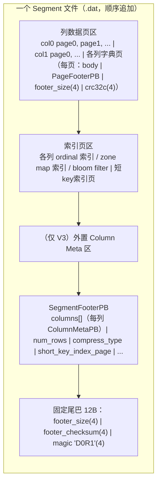
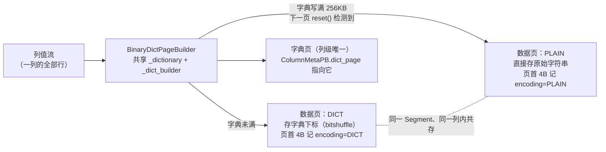

# 第 1 章：Rowset 与 Segment 文件格式 —— 一个字节的物理归宿

第五部分的主线是**跟着一次读取走完它的全程**：从磁盘上一个字节的物理布局，到一次查询把它捞进内存、解压、解码、过滤、物化。这条路要走通，第一步必须先把"字节到底怎么摆在盘上"讲透——不了解文件格式，后面的索引裁剪（ch2）、谓词下推与延迟物化（ch3）都是空中楼阁。本章就是这块地基：一个 Segment 文件从头到尾由哪些部分组成、每一段为什么放在那个位置、列数据经过了哪几层编码与压缩才落到盘上。

Rowset / Segment 的**逻辑层级**（Tablet → Rowset → Segment、版本区间、`.dat` 命名与磁盘路径）已经在 [part1 第 3 章](../part1-architecture/03-data-model.md) 3.3 讲透，本章不重复；这些 Segment 是**何时**被 flush 出来的（MemTable 攒批 → flush）也已在 [part3 第 3 章](../part3-load-lifecycle/03-tablet-write-path.md) 讲过。本章要回答的是另一组问题：**一个 Segment 文件内部长什么样**——Footer 为什么在文件尾、页怎么寻址、字符串列凭什么能压到原大小的几分之一、编码和压缩为什么要分成两层。

本章的行号引用基于写作时核实所用的 HEAD（`034a00d0d0`，源码树与系列基线 `7bc98f696f` 一致）。代码演进会让行号漂移，但 Footer 布局、寻址结构与编码语义不变；写作时每一处 `路径:行号` 都在当前代码里核实过。

## 1.1 问题：列存文件怎么摆才能又小又快

**遇到了什么问题？** 一个 Segment 就是一张表某个版本、某个分片的一段行的物理落盘。它要同时服务两类截然不同的访问：分析型的**大范围列扫描**（只读几列、扫几百万行做聚合）和点查/局部读（按 key 取几行的全部列）。落盘格式一旦定死，就同时决定了这两类访问各自要付出多少 IO 和 CPU。那么这批行的这些列，字节到底该怎么排布，才能让扫描时读得少、跳得快，又不至于让每次读都要把无关数据一起拖进内存？

**有哪些候选、各有什么优劣？**

- **候选一：行存直写。** 一行的所有列字段连续摆放，一行接一行。点查友好——取一行就是一次连续读。但分析扫描是灾难：哪怕只 `SELECT SUM(price)`，也得把每一行的所有列都读进来再丢弃，**读放大**等于"选中列占比"的倒数。宽表只算一列，可能要白读几十倍的数据。
- **候选二：纯列拼接。** 把每列的全部值首尾相接存成一大段（column i 的所有值、column j 的所有值……）。扫描单列极爽——一段连续字节读完即可。但它有两个硬伤：其一，**没有分块就没有跳读**，即便查询带 `WHERE id = 5`，也得把整列从头扫到尾，谓词下推无从落地；其二，一整列作为一个压缩/编码单元，粒度太粗，无法按局部数据特征灵活选择编码，也无法只解压需要的那一小段。
- **候选三：分页列存 + 页级索引。** 每列切成固定大小的 **page**（数据页），每个页独立编码、独立压缩、独立带校验；页之上再挂一层索引（ordinal 索引记录"第 N 行在哪个页"，zone map 记录"这个页的 min/max"）。这就是 Parquet / ORC 一脉的思路。扫描时按页为单位跳读：zone map 说这个页不含目标值，整页跳过，连解压都省了。代价是引入了页粒度的元数据，页越小元数据越多。

**Doris 怎么考量和解决的？** Doris 的 Segment 走的是候选三，而且把"页"作为整个存储引擎的原子单位贯彻到底：数据是页、索引是页、字典是页、短key索引也是页。核心权衡落在**页大小**上。数据页默认 64KB（`STORAGE_PAGE_SIZE_DEFAULT_VALUE`，`be/src/storage/segment/options.h:28`），这是一个刻意选的中间值：页太小，则每页的 Footer、CRC、页指针、zone map 条目等固定开销占比飙升，元数据爆炸、随机 IO 变多；页太大，则 zone map 跳读的粒度变粗、一次读放大变严重（跳不掉的那一页要整页读整页解压）。64KB 让"一次顺序读的收益"和"跳读粒度"取得平衡。这个值可以按表调——建表属性 `storage_page_size`（`fe/fe-core/src/main/java/org/apache/doris/common/util/PropertyAnalyzer.java:111`，默认同样 65536），落到 BE 侧被夹在 4KB～10MB 之间生效（`be/src/storage/segment/segment_writer.cpp:266`-`269`）。

还有一个关键设计决策：**编码（encoding）和压缩（compression）分成两层做**。很多人以为压缩一层就够了，其实两层各司其职、不可互相替代。**编码**利用的是"类型局部性"——它知道这一列是 INT、是低基数字符串、是有序时间戳，于是能做通用压缩器看不懂的事：把字符串换成字典下标（几字节的整数）、把递增整数存成差值（Frame-Of-Reference）、把数值做 bit 转置让高位字节聚在一起（bitshuffle）。**压缩**则是类型无关的兜底，在编码之后的字节流上再抓一遍通用冗余（LZ4/ZSTD 的字典匹配）。顺序是先编码后压缩：编码把数据变得"更规整、熵更低"，压缩器在规整的字节上能咬到更长的重复串。反过来先压缩就毁掉了类型结构，编码再无用武之地。这就是为什么 `ColumnMetaPB` 里 `encoding` 和 `compression` 是两个独立字段（`gensrc/proto/segment_v2.proto:198`、`:200`）。

## 1.2 源码走读：Segment 文件解剖

一个 Segment 文件是**一次性顺序追加写完、之后只读不改**的（immutable）。这个"write-once"性质是理解整个文件格式的钥匙——它直接决定了 Footer 为什么在尾部。

以 `SegmentFooterPB`（`gensrc/proto/segment_v2.proto:265`）为纲，整个文件自头至尾大致是：所有列的**数据页**顺序追加在前，接着是各列的 **ordinal 索引页 / zone map 索引页**、**短key索引页**（V3 格式还有一段外置的 Column Meta 区），最后才是 `SegmentFooterPB` 本身，再跟一个 12 字节的固定尾巴。



**Footer 为什么在尾部？** 写 Segment 是一次前向追加：`SegmentWriter`（`be/src/storage/segment/segment_writer.h`）一边接收行、一边把各列数据攒成页往文件尾追加，每写完一个页就拿到它的 `(offset, size)`。而 Footer 要记录的恰恰是"每个页在哪、每列的元数据是什么、总共多少行"——这些信息**只有在所有页都写完之后才齐全**。如果把 Footer 放文件头，就得先占位、写完再回头填（backfill），而对象存储这类只支持顺序追加、不支持随机改写的介质根本做不到回填。放尾部则一路顺序追加到底，`finalize_footer()`（`be/src/storage/segment/segment_writer.cpp:987`）最后一把 `_write_footer()`（`:1116`）序列化 Footer 追加上去即可。注意 magic number 也写在**尾部**而非头部，源码注释说得很直白："we don't write magic number in the header because that will need an extra seek when reading"（`be/src/storage/segment/segment_writer.cpp:1141`-`1142`）——读文件时先 seek 到尾部读 Footer，magic 顺手就在那 12 字节里，避免一次额外 seek 回文件头。

读取时的解析是反过来的（`Segment` 的 `_parse_footer()`，`be/src/storage/segment/segment.cpp:438`）：先读**最后 12 字节**，其中 `+8` 处是 4 字节 magic `D0R1`（`k_segment_magic`，`be/src/storage/segment/segment_writer.cpp:86`），`+0` 处是 Footer 的字节长度，`+4` 处是 Footer 的 crc32c 校验和；magic 对上后，往前 seek `footer_length` 字节读出 `SegmentFooterPB` 并校验 checksum（`be/src/storage/segment/segment.cpp:458`、`:490`-`491`）。

**寻址：`PagePointerPB` 的 offset + size。** Footer 和各种元数据里，凡是要指向一个页的地方，用的都是 `PagePointerPB`（`gensrc/proto/segment_v2.proto:24`）——就两个字段：`offset`（uint64，页在文件内的绝对偏移）和 `size`（uint32，页的字节数）。整个文件的可寻址性就建立在这一对数字上：Footer 里 `short_key_index_page` 是一个 `PagePointerPB`，每列 `ColumnMetaPB` 里的 `dict_page`（`:206`）是一个 `PagePointerPB`，ordinal 索引的 B-tree 根也是。读任何一个页，都是"从 Footer 拿到 `PagePointerPB` → `read_at(offset, size)`"这一个动作。正因为寻址只需一对整数，Footer 本身就很小、加载极快——这也是它能常驻缓存、每次读都先过一遍的前提。至于"给定第 N 行落在哪个页"这类由行号反查页指针的能力，则由每列的 ordinal 索引提供，那是下一章的主题。

**每列的元数据：`ColumnMetaPB`。** Footer 的 `columns` 是一个 `ColumnMetaPB`（`gensrc/proto/segment_v2.proto:189`）数组，每列一条，记录 `type`、`encoding`、`compression`、该列挂了哪些索引（`indexes`）、以及——**仅当这列用字典编码时**——一个指向字典页的 `dict_page` 指针。这里藏着一个后面实验要用到的细节：`ColumnMetaPB` 的 `encoding` 字段记的是该列**声明的默认编码**，而不是每个数据页实际用的编码（1.3 会看到二者可能不一致）。

**为什么会有 V2 / V3 两种 Footer 版本。** `SegmentFooterPB` 带一个 `version` 字段（`gensrc/proto/segment_v2.proto:267`），语义由 `SegmentFooterVersionPB`（`:257`）定义：1 是 V2 baseline，2 是 V3。二者的关键差别在**ColumnMetaPB 放哪**：V2 把所有列的 `ColumnMetaPB` 内联在 Footer 的 `columns` 数组里，读 Footer 就把全部列的元数据一次性反序列化出来；V3 则把每列的 `ColumnMetaPB` **外置**到 Footer 之前一段独立的 "Column Meta 区"，Footer 里只留一张轻量的目录（`column_meta_entries`，记每列 meta 的偏移与长度，`:289`）。这么做的动机是宽表和 variant——一张几千列、或一个 variant 展开成成百上千个子列的表，把每列 meta 全塞进 Footer 会让 Footer 本身膨胀到很大，而很多查询只碰其中几列，却被迫反序列化整个 Footer。V3 把"读 Footer 目录"和"按需读某几列的 meta"拆开，避免了这份浪费。写路径按 tablet 的 `storage_format` 决定用哪版（`be/src/storage/segment/segment_writer.cpp:1119`）。本章后续以 V2 心智模型为主线叙述，V3 只是把 meta 从内联挪到外置，寻址与编码语义不变。

**tricky 点：Footer 损坏 = 整文件不可读，为什么可接受。** 既然所有页的寻址入口都在 Footer，那 Footer 一旦损坏（magic 对不上、或 checksum 不匹配），整个文件就彻底无法解析——`_parse_footer()` 直接返回 `Status::Corruption`（`be/src/storage/segment/segment.cpp:464`），没有任何"部分恢复"的余地。这个设计看起来脆弱，但在 Doris 的可靠性模型里完全可接受，原因是**副本冗余把单文件损坏兜住了**：存算一体下一个 Tablet 有多个副本散在不同 BE，某副本的 Segment 坏了，直接从健康副本 clone 一份重建即可；存算分离下数据在对象存储，本身有多副本/纠删码保证。也就是说 Doris 不指望单个文件自愈，而是把"损坏"上升到副本层面解决——这换来的是文件格式的极简：不用在文件里穿插冗余的恢复元数据。为便于事后定位，读到损坏文件时 BE 还会把出错的字节段落盘成一个 error file（`be/src/storage/segment/segment.cpp` 的 `_write_error_file`）供排查。

**易错点：`.dat` 文件与 rowset 元数据的一致性，谁是孤儿。** 一个 Segment 文件（`{rowset_id}_{seg_id}.dat`，命名规则见 part1 第 3 章 3.3）在盘上存在，**不等于**它是有效数据。判定它有效的权威是 **rowset 元数据**：只有当某个 rowset meta 引用了这个 rowset_id、且该 rowset 属于 tablet 当前可见的版本链，这个 `.dat` 才算数。反过来，盘上存在一个 `.dat`、但没有任何 rowset meta 指向它——比如导入写了一半失败、或 compaction 生成新 rowset 后旧文件还没清理——它就是**孤儿文件**，占着磁盘却永不会被读到。这类"元数据与数据文件是否一一对应"的对账，在分离模式下由 cloud 侧的 Checker 双向兜底：正向（元数据→数据）查文件丢失、逆向（数据→元数据）查文件泄漏，机制见 [part4 第 4 章](../part4-fe-internals/04-metaservice-fdb.md) 4.3。存算一体下则由 BE 本地的垃圾回收扫描盘上文件、比对 tablet meta 里的 rowset 集合来清理孤儿。把这层关系记反了——以为"盘上有文件就是有数据"——就会在排查数据丢失/空间膨胀时找错方向。

## 1.3 源码走读：页、编码与压缩

**页的构建链。** 写一个 Segment，责任沿三层往下传：`SegmentWriter` 负责整个文件（Footer、短key索引、把各列交给下层）；每一列由一个 `ColumnWriter` / `ScalarColumnWriter`（`be/src/storage/segment/column_writer.h`）负责，它决定这列用什么编码、把列值喂给页构建器、攒满一页就 flush；最底层是各种 `PageBuilder`（`PlainPageBuilder`、`BitshufflePageBuilder`、`BinaryDictPageBuilder`、`BinaryPrefixPageBuilder` 等），负责把一批列值编成一个页的字节。一个列值进来后的路径是：`ScalarColumnWriter` 初始化时按已定的 encoding 建好页构建器（`be/src/storage/segment/column_writer.h` 对应实现里 `EncodingInfo::get` → `create_page_builder`），列值持续追加进当前页构建器，直到构建器报告 `is_page_full()`——达到 `data_page_size` 上限——就把这一页 finish、压缩、经 `PageIO` 落盘，同时往该列的 ordinal 索引里登记"这一页的起始行号 + 页指针"，然后开一张新页继续。整列写完后，各列的索引页、短key索引页依次追加，最后才是 Footer。这个"数据页→索引页→Footer"的固定追加顺序，正是 1.2 里 Footer 必须在尾部的写路径由来。

**一个页的物理布局。** 无论哪种页，落盘格式统一由 `PageIO` 的 `write_page()`（`be/src/storage/segment/page_io.cpp:74`）拼出：`[body | PageFooterPB | footer_size(4) | crc32c(4)]`。body 是编码后（可能再压缩过）的列数据；`PageFooterPB`（`gensrc/proto/segment_v2.proto:113`）记录页类型、未压缩前大小、以及数据页专属的 first_ordinal / num_values / nullmap_size；末尾 4 字节 CRC 覆盖整页做完整性校验。

**压缩这一层怎么做。** 压缩发生在页 body 上，由 `PageIO` 的 `compress_page_body()`（`be/src/storage/segment/page_io.cpp:52`）执行，而且它有个**投机性**的关键判断：压完之后算一下节省率 space_saving，只有当节省率 ≥ 阈值（`compression_min_space_saving`，默认 0.1，即至少省 10%，`be/src/storage/segment/column_writer.h:70`）才保留压缩结果，否则**直接存未压缩的原样**（`be/src/storage/segment/page_io.cpp:61`-`71`）。这避免了对已经很紧凑的数据（比如高熵的编码后字节）做无用压缩、白费解压 CPU。读取端怎么知道某页到底压没压？`read_and_decompress_page_()`（`be/src/storage/segment/page_io.cpp:130`）比较 body 的实际字节数与 `PageFooterPB` 的 `uncompressed_size` 字段：不相等才走解压（`be/src/storage/segment/page_io.cpp:203`）。压缩类型是列级的（记在 `ColumnMetaPB` 的 `compression` 字段），来自建表属性 `compression`（`fe/fe-core/src/main/java/org/apache/doris/common/util/PropertyAnalyzer.java:105`），默认取 FE 配置 `default_compression_type`（`fe/fe-common/src/main/java/org/apache/doris/common/Config.java:1746`，值为 `ZSTD`）；`CompressionTypePB`（`gensrc/proto/segment_v2.proto:47`）支持 LZ4/LZ4F/ZSTD/ZLIB/SNAPPY 等，Footer 级的兜底默认是 LZ4F（`:274`）。

**编码怎么选：类型 → 默认编码的注册表。** 每列用哪种编码不是拍脑袋，而是查一张注册表。这张表在 `EncodingInfoResolver` 的构造函数里一次性建好（`be/src/storage/segment/encoding_info.cpp:235`）：先把所有"合法的 (类型, 编码) 组合"逐一注册（Phase 1），再分别设定 V2 段格式和 V3 段格式各自的**默认编码**（Phase 2a/2b）。真正决策的入口是 `EncodingInfo` 的 `resolve_default_encoding()`（`be/src/storage/segment/encoding_info.cpp:563`）：按 tablet 的存储格式选 V2 或 V3 的默认表，row store 隐藏列特判走 plain。挑几个有代表性的默认值（`be/src/storage/segment/encoding_info.cpp:349`-`412`）：

| 列类型 | V2 默认编码 | V3 默认编码 |
|---|---|---|
| INT / BIGINT 等整数 | `BIT_SHUFFLE` | `PLAIN_ENCODING` |
| FLOAT / DOUBLE / DECIMAL / 日期时间 / IP | `BIT_SHUFFLE` | `BIT_SHUFFLE` |
| CHAR / VARCHAR / STRING / JSONB / VARIANT | `DICT_ENCODING` | `DICT_ENCODING` |
| BOOL | `RLE` | `RLE` |
| HLL / BITMAP / QUANTILE_STATE | `PLAIN_ENCODING` | `PLAIN_ENCODING_V3` |

三种主力编码各自吃的是不同的类型局部性，值得逐个看清它们到底利用了什么规律：

- **bitshuffle**（数值列默认，`be/src/storage/segment/bitshuffle_page.h`）把一批定长数值按 bit 位转置：原本"值1的全部 bit、值2的全部 bit……"被重排成"所有值的第0位、所有值的第1位……"。分析型数据里相邻数值往往数量级接近，高位字节大片为 0 或相同，转置后这些相同 bit 聚成连续长串，交给后续 LZ4/ZSTD 就能咬出很长的重复——这是通用压缩器在原始行主序上绝对看不到的结构。
- **Frame-Of-Reference**（`FOR_ENCODING`，日期/整数可选）存"基准值 + 每个值相对基准的差值"，差值用更少的 bit 表示，专治取值范围窄或递增的列（如自增 id、连续日期）。
- **prefix**（有序字符串，`be/src/storage/segment/binary_prefix_page.h`）存相邻串的公共前缀长度 + 剩余后缀，专治排序后前缀高度重复的 key——所以它是主键索引列的默认编码（`be/src/storage/segment/encoding_info.cpp:419` 把 IndexedColumn 的 VARCHAR 定成 `PREFIX_ENCODING`）。
- **dict**（字符串默认）把每个不同的字符串收进一份字典、数据页里只存定长的字典下标，下标再用 bitshuffle 压一遍。它赌的是"不同取值的数量远小于行数"。

顺带提一句 null 的存储：可空列的每个数据页在 body 前带一段 nullmap 位图（`PageFooterPB` 的 `nullmap_size` 记其长度，`gensrc/proto/segment_v2.proto:73`），标记该页哪些行是 NULL，与编码正交——编码只作用于非 NULL 的实际值。

字典编码这条链和它的退化，画成图更直观：



**一个必须写对的关键点：编码不是 DDL 能逐列指定的。** 注意上面全程没有出现"用户在建表时给某列指定编码"这回事——因为 Doris **不提供**列级的编码属性。编码完全由 `resolve_default_encoding()` 根据 (列类型, 存储格式) 推导（`be/src/storage/segment/segment_writer.cpp:154` 的 `init_column_meta` 里 `meta->set_encoding(...)`），`ScalarColumnWriter` 初始化时只是拿这个已定的 encoding 去 `EncodingInfo::get` 建对应的页构建器（`be/src/storage/segment/column_writer.cpp:493`-`512`）。这一点直接决定了 1.5 实验的设计——想对比 dict 和 plain，不能靠"给同一列换编码属性"，只能靠改变数据本身（低基数 vs 高基数）去触发下面这个退化。

**tricky 点：字典是 page 内的还是跨 page 共享的？退化怎么发生？** 这是最容易想当然、也最影响内存/压缩率判断的一点，必须照着 `be/src/storage/segment/binary_dict_page.cpp` 的真实逻辑说。结论：**字典是"列级共享"的，不是每个数据页各建一份**。`BinaryDictPageBuilder` 内部维护一个 `_dictionary`（字符串→码值的 map）和一个专门的字典页构建器 `_dict_builder`，它们在整列的多个数据页之间**持续累积、共享**——每个数据页 finish 后调 `reset()`（`be/src/storage/segment/binary_dict_page.cpp:171`），但 `_dictionary` 和 `_dict_builder` 并不清空。每个数据页里存的只是定长的字典下标，用 `BitshufflePageBuilder<INT>` 编码（`be/src/storage/segment/binary_dict_page.cpp:57`）。

退化（fallback 到 plain）的触发点很具体：字典页有大小上限（`dict_page_size`，默认 256KB，`be/src/storage/segment/options.h:29`）。当共享字典越攒越大、`_dict_builder` 写满时（`is_page_full()`），**下一个数据页**的 `reset()` 会检测到这一点（`be/src/storage/segment/binary_dict_page.cpp:178`），于是把数据页构建器换成 plain 编码、并把 `_encoding_type` 改成 plain（`:183`）。也就是说：**同一列内，字典没满之前的数据页是 DICT 编码、字典撑满之后的数据页退化成 PLAIN 编码，两种页混在同一个 Segment 里共存。** 每个数据页各自在页首 4 字节记下自己到底是哪种编码（`be/src/storage/segment/binary_dict_page.cpp:166` 写入、`:225` 读回），读取端据此逐页选解码器。

这里有两个"错写会怎样"值得记牢：其一，如果误以为"每页一个独立小字典"，就会严重低估低基数列的收益——实际上因为字典跨页共享，一个只有几十种取值的列，整列几百万行可能只维护一份几 KB 的字典，压缩率极高；其二，`ColumnMetaPB` 的 `encoding` 字段始终是列声明的 `DICT_ENCODING`（`init_column_meta` 写死的默认），**它不会因为部分页退化而变**——退化只体现在各数据页的页首编码字节和最终文件大小上。所以拿 Footer 里的 `encoding` 字段去判断"这列有没有退化"是错的，会得出错误结论。

**易错点：低基数忘不了字典、高基数误吃字典的后果。** 由于字符串列默认就是 dict，低基数字符串（枚举、状态码、国家名）天然享受字典红利，无需干预。真正的坑在**高基数字符串**（如 UUID、URL、随机 token）：这类列几乎每个值都不同，字典会迅速膨胀到 256KB 上限触发退化，退化前那部分页还白白付出了"建字典 + 查字典"的写入开销，退化后又变回 plain——两头不讨好，文件不会更小，写入反而更慢。识别这种列、并在建模时避免把超高基数字段当普通 VARCHAR 硬塞，是存储调优的基本功。1.5 的实验就把这个后果量化出来。

## 1.4 双模式说明

Segment 的文件格式在**存算一体与存算分离两种模式下完全一致**——同一套 `SegmentFooterPB`、同样的页布局、同样的编码与压缩逻辑，产出的是字节级相同的 `.dat` 文件。两模式的差异只在**文件放在哪、怎么读**：一体模式下 Segment 落在 BE 本地盘，分离模式下落在对象存储、BE 通过 File Cache 就近缓存。值得一提的是，本章讲的"页"粒度也正是分离模式下读放大的关键——`PageIO` 按 `PagePointerPB` 的 `(offset, size)` 只读需要的那一段页，而不是拉整个文件，这让"从对象存储按页 range-get + 缓存到本地"成为可能；`read_and_decompress_page()` 里那段读到 Corruption 就清缓存、退回直连远端重读的逻辑（`be/src/storage/segment/page_io.cpp:275`-`323`），也只有分离模式才会走到。这层"文件位置与缓存"的机制是第 6 章的专题，本章及 ch2～ch5 讨论的格式与读逻辑对两模式无差别。

## 1.5 动手实验：把编码退化量化出来

实验环境（单机编译部署、建表灌数）沿用 [part1 第 5 章](../part1-architecture/05-source-map-and-dev-env.md)。本实验有两个目的：一是用真实工具解剖一个 Segment、对照 1.2 的布局图逐段验证；二是主动踩一遍 1.3 的字典退化坑，把"低基数 vs 高基数"的代价用文件大小量化。

**核心点：用 `meta_tool` 解剖 Segment。** BE 自带的 `meta_tool`（`be/src/tools/meta_tool.cpp`）就是官方的 Segment 解剖工具，`show_segment_footer` 操作把 `SegmentFooterPB` 以美化 JSON 打印出来（`be/src/tools/meta_tool.cpp:325`-`347`）：

```bash
# 定位 Segment 文件（路径规则见 part1 第 3 章 3.3）
find <storage_root>/data -name "*.dat" | head

# dump Footer：逐段对照 1.2 的布局图看 columns[]、num_rows、
# 每列的 encoding / compression、short_key_index_page、dict_page 指针
./meta_tool --operation=show_segment_footer --file=/path/to/xxx_0.dat

# 还可以进一步看页级数据
./meta_tool --operation=show_segment_data --file=/path/to/xxx_0.dat
```

对着输出确认几件事：`columns` 里字符串列的 `encoding` 是不是 `DICT_ENCODING`、整数列是不是 `BIT_SHUFFLE`（V2）；`short_key_index_page` 是不是一个 `{offset, size}`；有字典的列有没有 `dict_page` 指针。这就把抽象的 proto 定义和盘上真实字节对上了。若手头没有编好的 `meta_tool`，退化方案是：用 `xxd` 看文件**最后 12 字节**，末尾必是 ASCII `D0R1`（magic），前 8 字节是 footer 长度 + checksum——这是最低成本验证"Footer 在尾部"的方式。

**易错点实测：低基数 vs 高基数同表对比。** 因为编码不可按列指定（1.3），我们不能"同一列换编码"，而是**用两批数据触发不同编码路径**。建一张最简单的表，只有一个 VARCHAR 列，分别灌入：

- 表 A（低基数）：几百万行，但取值只在少数几十个枚举里循环（如反复的国家名）。
- 表 B（高基数）：同样几百万行，但每行是唯一的随机长字符串（如 UUID）。

```sql
CREATE TABLE t_low (s VARCHAR(64)) DISTRIBUTED BY HASH(s) BUCKETS 1
  PROPERTIES ("replication_num"="1");
CREATE TABLE t_high (s VARCHAR(64)) DISTRIBUTED BY HASH(s) BUCKETS 1
  PROPERTIES ("replication_num"="1");
-- 分别灌入等量数据：t_low 用几十种取值循环，t_high 用唯一随机串
```

灌完、触发 flush 后，用 `du` 比两张表的 Segment 文件大小，再对各自的 Footer/页数据 dump：

```bash
du -sh <t_low 的 tablet 目录>  <t_high 的 tablet 目录>
```

预期观察：表 A 的文件显著小于表 B——低基数列字典始终没撑满 256KB，全列数据页都是 DICT 编码、只存几十种下标，压缩率极高；表 B 的字典迅速涨满触发退化，靠前的页是 DICT、靠后的页 fallback 成 PLAIN，整列几乎存了原始字符串，文件大得多。注意验证退化时**别只看 Footer 的 `encoding` 字段**——它两张表都显示 `DICT_ENCODING`（列声明值不随退化改变，1.3），真正的差异在文件大小和 `show_segment_data` 的页级编码上。

想把压缩率算得更精确，不必只靠 `du`。`ColumnMetaPB` 本身就带三个字节计数字段：`raw_data_bytes`（原始未编码的数据字节，`gensrc/proto/segment_v2.proto:233`）、`uncompressed_data_bytes`（编码后、压缩前，`:232`）、`compressed_data_bytes`（编码压缩后最终落盘，`:231`）。`show_segment_footer` 的 JSON 输出里这三个数一目了然：`raw / uncompressed` 之比反映**编码**省了多少（字典/bitshuffle 的功劳）、`uncompressed / compressed` 之比反映**压缩**又省了多少（LZ4/ZSTD 的功劳）——正好对应 1.1 讲的两层各自的贡献。对比表 A 与表 B 这几个数，就能清楚看到高基数列的 `raw / uncompressed` 比接近 1（编码几乎没省）、而低基数列这个比可能高达几十倍。这就把"高基数误吃字典"的代价从概念变成了盘上可量的数字。

## 1.6 排查清单

| 症状 | 定位路径 |
|---|---|
| **读 Segment 报 Corruption（magic/checksum）** | 先分清坏在哪一层：magic 不匹配（`be/src/storage/segment/segment.cpp:458`）或 Footer checksum 不符（`:490`）说明**Footer 坏了、整文件不可读**；报 "checksum mismatch" 且带 page offset（`be/src/storage/segment/page_io.cpp:186`）说明是**某个页的 CRC 坏了**。BE 会把出错字节落成 error file 供事后分析。修复走**副本层面**：一体模式从健康副本 clone 重建该 Tablet；分离模式下若怀疑是 File Cache 里的缓存块坏了，`read_and_decompress_page()` 会自动清缓存重试、再直连远端重读（`be/src/storage/segment/page_io.cpp:275`-`323`），仍失败才是对象存储上的源文件真损坏。 |
| **文件大小异常膨胀** | 优先怀疑**编码退化**：某高基数字符串列字典撑满 256KB 后 fallback 到 plain（1.3）。用 `meta_tool --operation=show_segment_data` 看该列各页是否大面积 PLAIN；确认后从建模上收敛该列基数，或评估是否该换列类型。其次核对 `compression` 属性是否被误设成 `no_compression`。也留意是否只是 compaction 没跟上、碎片 rowset 堆积（见 [part3 第 6 章](../part3-load-lifecycle/06-compaction.md)）。 |
| **版本升级后旧格式兼容问题** | Segment 格式带版本号：`SegmentFooterPB` 的 `version` 字段（`gensrc/proto/segment_v2.proto:267`），取值语义见 `SegmentFooterVersionPB`（`:257`）——1 是 V2 baseline、2 是 V3（外置 Column Meta 区）。怀疑读旧文件出错时，先 `show_segment_footer` 看 `version` 字段，再对照读路径对该版本的分支处理（`_parse_footer` 之后按 version 决定是否读外置 col meta 区，`be/src/storage/segment/segment_writer.cpp:1119`）。字段级演进遵循 protobuf 兼容规则，新加字段用 optional、老 BE 忽略未知字段。 |

至此，一个 Segment 文件从尾部的 Footer 入口、到 `PagePointerPB` 寻址、到每列 `ColumnMetaPB`、再到数据页里编码与压缩两层如何把字节压小，就都摊开了。下一章接着讲**索引**——Footer 里那些 `short_key_index_page`、ordinal 索引、zone map、bloom filter 到底怎么组织、怎么在扫描时把大块页跳掉；有了本章的文件解剖和 ch2 的索引，ch3 才能把一次读取的完整旅程讲通。
