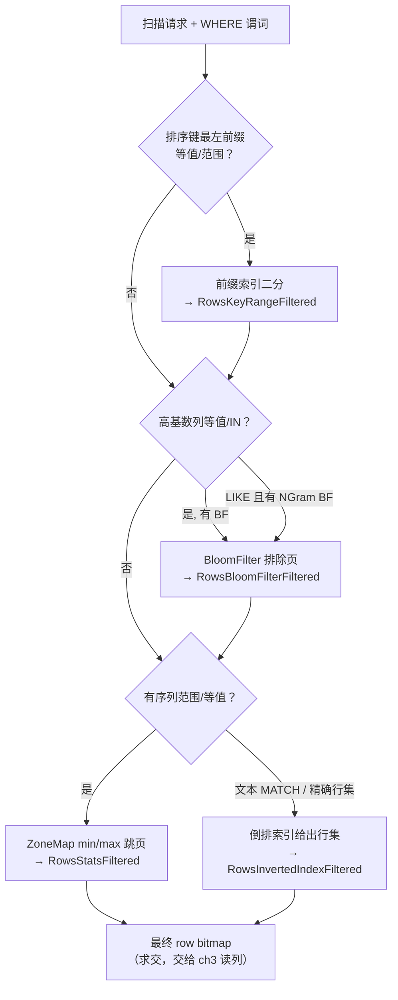

# 第 2 章：索引体系 —— 四把裁剪的刀

[上一章](01-segment-format.md) 把一个 Segment 文件从尾部的 `SegmentFooterPB` 入口、到 `PagePointerPB` 寻址、到每列 `ColumnMetaPB`、再到数据页里编码与压缩两层，整个物理布局摊开了。但文件格式只解决了"字节怎么摆"，还没回答一个更要命的问题：一次查询带着 `WHERE` 条件进来，怎么**不把无关的页读进内存**就把它们排除掉。列存分页给了跳读的物理前提（按页寻址），但"该跳哪些页"要靠**索引**来判断。Footer 里那几个索引指针——`short_key_index_page`、每列的 zone map、bloom filter——就是干这件事的。

本章讲 Doris 的四类索引：**前缀索引（short key）**、**ZoneMap**、**BloomFilter**（含 NGram BF）、**倒排索引**。它们各自回答一个不同的问题，组合起来构成 Doris 的裁剪能力。本章聚焦**结构与适用边界**——每类索引长什么样、能裁什么、不能裁什么、错用会怎样；至于读路径在扫描时**怎么逐一消费**这些索引（谓词下推、延迟物化、行范围求交），留给 ch3。

本章行号引用基于写作时核实所用的 HEAD（`4a923a2ee2`，源码树与系列基线 `7bc98f696f` 一致）。代码演进会让行号漂移，但索引的结构、语义与适用边界不变；每一处 `路径:行号` 都在当前代码里核实过。

## 2.1 问题：不读数据就排除数据

**遇到了什么问题？** 一张表几十亿行，一条查询往往只关心其中极小一撮——`WHERE user_id = 12345`、`WHERE dt BETWEEN ... AND ...`、`WHERE msg LIKE '%timeout%'`。列存已经让"只读涉及的列"成为可能，但**行方向**上仍有海量无关数据。若每次查询都把这些列的全部页读进来、解压、逐行比对谓词，即便向量化执行再快，`IO + 解压` 这两步的成本也无法回避——它正比于扫过的数据量，而不是正比于命中的行数。核心矛盾是：**怎么在不读一个页的前提下，就断定这个页里没有我要的数据？**

**有哪些候选、各有什么优劣？**

- **候选一：全扫 + 快速过滤。** 不建任何行级索引，靠列存 + 向量化把每一页读进来快速比对。实现最简单、写入零额外成本，但读放大是硬伤：查一行也要扫全段。分析场景下大范围聚合尚可接受，点查和高选择性过滤则代价高得离谱。
- **候选二：全局二级索引。** 像 OLTP 数据库那样，为非主键列建一棵全局有序的二级索引（B+ 树 / 倒排），`WHERE k2 = ?` 直接查索引拿到行位置。查询极快，但两个代价在分布式列存里几乎致命：其一是**写放大**——每写一行都要同步维护 N 棵索引树，导入吞吐塌方，而 Doris 的定位就是高吞吐导入；其二是**分布式一致性**——数据按 tablet 散在多个 BE 上，一个"全局"索引要么集中存储成为瓶颈、要么跨 tablet 维护带来分布式事务，与 Doris "tablet 自治、Segment immutable" 的模型格格不入。
- **候选三：轻量的局部索引组合拳。** 不追求"精确定位到行"，而是每个 Segment 内建一组**轻量、局部、可跳过**的索引：排序键上天然有序（前缀索引直接二分定位）、每个页带一份 min/max 统计摘要（ZoneMap 排除不可能命中的页）、可选地为高基数列建概率过滤器（BloomFilter 排除"几乎肯定没有"的页）、为文本列建倒排（直接给出含某词的行）。每一种都只在 Segment 内部生效、随 Segment immutable 一起写一次，天然规避了全局索引的写放大与一致性难题。

**Doris 怎么考量和解决的？** Doris 走的是候选三，而且把四类索引设计成**各答一问、互补而非替代**：

| 索引 | 回答的问题 | 判定性质 |
|---|---|---|
| 前缀索引（short key） | "排序键前缀等于/落在某区间的行，从第几行开始" | 精确定位（有序二分） |
| ZoneMap | "这个页/这个段，**有没有可能**含目标值" | 保守排除（可能有→读，肯定没有→跳） |
| BloomFilter | "这个页，**几乎肯定没有**这个值" | 概率排除（说没有就真没有，说有可能是假阳） |
| 倒排索引 | "**哪些行**含这个词/这个值" | 精确给出行集 |

这四者的判定性质决定了它们的适用形态：前缀索引只对**排序键前缀**的等值/范围有效；ZoneMap 对任何**有序可比**列的范围/等值都能保守裁剪；BloomFilter 只对**等值/IN** 有效、且要列基数够高才划算；倒排索引对**文本分词匹配和任意列的等值**都能精确命中，代价是写放大最大。理解这张表，就理解了本章后面每一节"该建哪个、错建了会怎样"的全部判断依据。所有这些索引都内嵌在 Segment 或其伴生文件里，随 Segment 一次写定、只读不改——这正是它们能做到"零一致性负担"的根本。

一次带谓词的扫描进来，这四把刀按"从便宜到贵、从保守到精确"的顺序把行范围逐步收窄：



（注：图中裁剪先后是逻辑示意；读路径实际的调用顺序与行范围求交细节见 ch3。）

## 2.2 源码走读：前缀索引与 ZoneMap

### 前缀索引：排序键上的稀疏路标

**结构（高度概括）。** 前缀索引就是在**排序键**上每隔固定行数打一个路标。`ShortKeyIndexBuilder`（`be/src/storage/index/short_key_index.h:52`）在写 Segment 时，每积累 `num_rows_per_block` 行，就把该行的短key（short key，即排序键前若干列拼成的二进制串）作为一个条目记下来，连同其行号。读取时 `ShortKeyIndexDecoder`（`be/src/storage/index/short_key_index.h:135`）把这些条目当成一个有序数组，对目标 key 做二分，定位到"目标行落在哪个 block 的起点"。

**核实：稀疏粒度是每 1024 行一项。** 这个"固定行数"是 `num_rows_per_block`，默认值 **1024**（`be/src/storage/segment/segment_writer.h:68`、`be/src/storage/segment/vertical_segment_writer.h:62`）。构建逻辑在 `SegmentWriter` 的 `build_key_index()`（`be/src/storage/segment/segment_writer.cpp:756`）：每写满 1024 行就把 `_short_key_row_pos` 前推一格、记一个 short key 位置（`:767`-`:770`）。所以前缀索引是**稀疏索引**——它不给每一行建条目，只给每 1024 行的第一行建，索引本身极小、可常驻内存；二分定位到 block 后，块内那 1024 行还需顺序扫过滤。

读路径怎么用它：`SegmentIterator` 的 `_get_row_ranges_by_keys` 对每个 key range 调 `_lookup_ordinal()` 在 short key 索引上二分出 `[lower_rowid, upper_rowid)`（`be/src/storage/segment/segment_iterator.cpp:807`-`:823`），把这个行区间和当前 row bitmap 求交，被排除的行数记入 `rows_key_range_filtered`（`:827`）——对应 profile 里的 `RowsKeyRangeFiltered` 计数器。

**核实：short key 由哪几列构成——36 字节 / 前 3 列规则。** 这是最容易被"民间口口相传"记错的地方，必须照 FE 真实逻辑说。short key 的列数由 `Env` 的 `calcShortKeyColumnCount()`（`fe/fe-core/src/main/java/org/apache/doris/catalog/Env.java:5541`）在建表时算定，当用户没有显式指定 `short_key_column_count` 属性时，走自动推算（`:5600`-`:5620`）：

1. 候选列是**排序键列**（sort key columns，MoW 有 cluster key 时用 cluster key，否则用 key 列）；
2. 最多取 `Math.min(排序键列数, FeConstants.shortkey_max_column_count)` 列——`shortkey_max_column_count = 3`（`fe/fe-core/src/main/java/org/apache/doris/common/FeConstants.java:34`）；
3. 逐列累加 `getOlapColumnIndexSize()`，一旦累计字节数 `> shortkey_maxsize_bytes`——即 **36 字节**（`fe/fe-core/src/main/java/org/apache/doris/common/FeConstants.java:35`）——就停（`:5606`）；
4. 特殊约束：VARCHAR 只能作为 short key 的**最后一列**（`:5615`-`:5617`，命中即 `++` 后 break），因为变长列会截断，放中间会让后续列无法参与前缀比较；不能作为 short key 的类型（如 float/double，`couldBeShortKey()` 判定，`:5612`）直接终止。

所以"前 3 列 / 36 字节"是一个**取小**的组合规则：最多 3 列，且累计不超过 36 字节，且遇 VARCHAR 收尾、遇不可比类型截止。**错记成"固定就是前 3 列"会怎样？** 如果第一列就是个 `VARCHAR(100)`，它一列就超 36 字节且是变长列，short key 实际只覆盖它（截断到边界），后面的 key 列根本进不了前缀索引——你以为按前 3 个 key 列点查会走索引，实际只有第一列的前缀在起作用。建模时把宽 VARCHAR 放在排序键最前面，等于亲手废掉了前缀索引对后续列的定位能力。

**tricky 点：前缀索引只对排序键前缀有效——`WHERE k2 = ?`（k1 未定）为什么用不上。** 前缀索引的本质是"排序键有序 → 二分"。数据在 Segment 内严格按 `(k1, k2, k3, ...)` 字典序排列，short key 存的是这个复合 key 的前缀。给定 `WHERE k1 = 10 AND k2 = 5`，可以拼出前缀 `(10, 5)` 去二分——因为在"k1=10"这一段内部数据仍按 k2 有序。但给定 `WHERE k2 = 5`（k1 完全不限定），k2=5 的行**散布在每一个 k1 值的分区里**，全局根本不是按 k2 有序的，二分无从下手——这就是经典的"最左前缀"约束，和 MySQL 联合索引失效的原理一模一样。**错写会怎样：** 把最常用的过滤列排在排序键靠后（甚至不在排序键里），前缀索引对它就是零收益，查询退化成全段扫 + 逐行过滤。这直接决定了建表时**排序键列序**的实战意义：把选择性最高、最常用于点查/范围的列往前放。2.6 的实验会亲手把列序调坏、再调好，用计数器看它归零和恢复。

一个常被忽略的边界：**MoW（Merge-on-Write）表不用 short key 索引，而是用主键索引**。`build_key_index()` 里 `_is_mow()` 为真时走 `_generate_primary_key_index()`（`be/src/storage/segment/segment_writer.cpp:805`-`:806`），生成的是覆盖全 key 的稠密主键索引（primary key index），因为 MoW 需要按主键精确定位来做 delete bitmap 标记。short key 只用于非 MoW 表，以及 MoW 表的 cluster key（`:772`-`:803`）。这一层区别在 ch4 讲 MoW 时会展开，这里只需记住：谈"前缀/short key 索引"默认语境是 Duplicate/Aggregate 表和普通 Unique(MoR) 表。

### ZoneMap：每页一份 min/max 摘要

**结构（高度概括）。** ZoneMap 是每个数据页的统计摘要。`struct ZoneMap`（`be/src/storage/index/zone_map/zone_map_index.h:45`）记录一个 zone（一个页，或整个段）的 `min_value` / `max_value`，外加几个布尔标志：`has_null`、`has_not_null`、`pass_all`（`:56`-`:60`）。查询带 `WHERE c > 100`，某页的 zone map 若 `max_value <= 100`，整页不可能有命中行，连读带解压全省。

**两层结构。** ZoneMap 是**段级 + 页级**两层（`be/src/storage/index/zone_map/zone_map_index.h:113`-`:116` 的注释说得很清楚）：`TypedZoneMapIndexWriter`（`:118`）一边写数据，一边维护当前页的 `_page_zone_map` 和整段的 `_segment_zone_map`（`:159`-`:160`）；每个数据页 flush 时把页级 zone map 序列化成 `ZoneMapPB` 存进一个 IndexedColumn，同时把页级 min/max 合并进段级（`be/src/storage/index/zone_map/zone_map_index.cpp:229`-`:244`）。读取时先用**段级** zone map 判断"整个 Segment 要不要碰"，要碰再用**页级** zone map 逐页裁剪（`ColumnReader` 的 `_get_filtered_pages()`，`be/src/storage/segment/column_reader.cpp:514`）。两层是粗到细的漏斗，段级一票否决省下加载页级索引的成本。

ZoneMap 裁掉的行数记入 `rows_stats_filtered`（`be/src/storage/segment/segment_iterator.cpp:1244`）。**注意一个反直觉的命名：profile 里 ZoneMap 裁剪对应的计数器是 `RowsStatsFiltered`（`be/src/exec/operator/olap_scan_operator.cpp:229`），不是望文生义的"RowsZoneMapFiltered"**——后者在代码里并不存在。这个命名坑在 2.6 实验里必须记牢，否则会对着不存在的计数器找半天。

**易错点一：ZoneMap 与已删除行的语义。** 一个高频误解是"删了的行，zone map 会自动把它从 min/max 里剔掉"。**不会。** ZoneMap 是写 Segment 时按**实际落盘的值**算的 min/max，Segment immutable，之后无论这行被 delete bitmap 标记删除、还是被 DELETE 谓词逻辑删除，min/max 都不变——它仍然反映"这个页物理上存过的值域"。那删除到底怎么和 zone map 交互？看 `_get_filtered_pages()` 的真实逻辑（`be/src/storage/segment/column_reader.cpp:530`-`:539`）：它额外接一组 `delete_predicates`，对每个通过了查询谓词的页，再用 `del_pred->evaluate_del(zone_map)`（`:534`）判断——**如果某个 DELETE 谓词的条件范围完整覆盖了这个页的 zone（即整页都落在删除条件内），这个页就被整体跳过**（`should_read = false`）。也就是说：DELETE 谓词能借 zone map 做"整页已删"的快速跳过，但这**只对 DELETE 语句产生的 delete predicate 生效**（如 `DELETE WHERE dt < '2020-01-01'`）；MoW 的 delete bitmap 走的是另一条路（按 rowid 位图在 `SegmentIterator` 里直接从 row bitmap 里扣除，`be/src/storage/segment/segment_iterator.cpp:625`），与 zone map 无关。**错写会怎样：** 若以为 zone map 的 min/max 会随删除收缩，就会误判"这页数据早删光了 zone map 应该跳过它"——实际不会，被逻辑删除但物理还在的值仍撑着 min/max，该页照读不误，删除的行由后续的 delete bitmap / delete predicate 兜底过滤。

**易错点二：字符串截断语义。** 变长字符串的 min/max 如果原样存，一个超长字符串会让 zone map 索引膨胀。Doris 的做法是**截断到 512 字节**（`MAX_ZONE_MAP_INDEX_SIZE = 512`，`be/src/storage/olap_define.h:80`）：超过 512 字节的字符串，min/max 只存前 512 字节（`be/src/storage/index/zone_map/zone_map_index.cpp:130`-`:136`）。这里藏着一个必须写对的**正确性陷阱**：截断 max 值会让它**变小**——截断后的 max 比真实 max 短，字典序上更小，于是 zone map 可能错误地跳过"实际含匹配行"的页（假阴性，导致查询漏数据）。Doris 的修补在 `modify_index_before_flush()`（`be/src/storage/index/zone_map/zone_map_index.cpp:196`-`:215`）：当 max 恰好被截断到 512 字节时，把最后一个字节 `+1`（`:213`），让截断后的 max 略大于任何共享同样 512 字节前缀的真实字符串，从而只会**多读**页（假阳，性能损失）、绝不**漏读**页（假阴，正确性问题）。**错写会怎样：** 如果只截断不 `+1`，长字符串列上的范围/等值查询会静默丢结果——这是最危险的一类 bug，因为它不报错、只是少返回几行。理解这个 `+1` 就理解了 Doris 索引设计的一条铁律：**裁剪必须宁可保守（多读）也绝不激进（漏读）**。

## 2.3 源码走读：BloomFilter 与 NGram

### 块级 BloomFilter：概率排除"几乎肯定没有"

**结构。** BloomFilter 回答"这个页有没有这个值"，且判定是单向可信的：说"没有"就一定没有，说"有"则有一定概率是假阳（false positive）。Doris 的实现是**块级分裂 BloomFilter**（`BlockSplitBloomFilter`，`be/src/storage/index/bloom_filter/block_split_bloom_filter.h:32`），思路来自 Putze 等人的 "Cache-, Hash- and Space-Efficient Bloom filters"：把整个 BF 切成许多 32 字节的"小 BF"（`BYTES_PER_BLOCK = 32`，`:40`），每个值只落在一个小块内、在块内置 8 个 bit（`BITS_SET_PER_BLOCK = 8`，`:42`）。为什么这么设计——32 字节正好是一条 cache line 的量级、也对齐 SIMD 指令宽度（`:29`-`:31` 的注释），一次查询只触碰一个 cache line，把大 BF 随机散列到全域造成的 cache miss 砍掉。这是"空间/速度/命中率"三者权衡后的工程选择。

**fpp 属性与空间权衡。** BF 的核心参数是 false positive probability（fpp），默认 **0.05**（`be/src/storage/index/bloom_filter/bloom_filter.h:58`）。空间大小由 `optimal_bit_num()` 按公式 `m = -n * ln(fpp) / (ln2)^2` 算出（`be/src/storage/index/bloom_filter/bloom_filter.h:220`-`:224`）：n 是元素个数，fpp 越小、m 越大。fpp 是可调的建表属性 `bloom_filter_fpp`（`fe/fe-core/src/main/java/org/apache/doris/common/util/PropertyAnalyzer.java:97`），由 `analyzeBloomFilterFpp()`（`:751`）校验，取值被限制在 `[MIN_FPP, MAX_FPP]`，其中 `MAX_FPP = 0.05`（`:240`、`:763`）——即 fpp 不能比默认值更宽松，只能调得更严（更小 fpp、更大空间、更少假阳）。要给哪些列建 BF 由 `bloom_filter_columns` 属性指定（`fe/fe-core/src/main/java/org/apache/doris/common/util/PropertyAnalyzer.java:96`，`analyzeBloomFilterColumns()` 在 `:697`）。

**易错点一：BF 对范围查询零收益。** BF 只能回答"等值是否存在"，无法回答"是否落在某区间"——因为哈希把值打散了，相邻的值在 BF 里毫无关联。源码里这条约束写得很硬：`ComparisonPredicateBase` 的 `can_do_bloom_filter()`（`be/src/storage/predicate/comparison_predicate.h:331`）只在 `PT == PredicateType::EQ && !ngram` 时返回 true（`:332`），而 `ColumnPredicate` 基类默认返回 false（`be/src/storage/predicate/column_predicate.h:284`）；范围谓词（`LT/LE/GT/GE`）不重写它，一律走默认的 false。所以 `WHERE c > 100` 这类查询**根本不会去查 BF**。**错写会怎样：** 给一个只用于范围过滤的列建 BF——比如时间戳列——纯属浪费：BF 占了空间、拖慢了写入，查询时 profile 里 `RowsBloomFilterFiltered` 恒为 0，一行都没帮你裁掉。范围过滤该靠 ZoneMap，不是 BF。

**易错点二：高基数才值得建 BF。** BF 的价值在于"以极小空间换取排除大量页"。若一个列是**低基数**（如性别、状态码只有几个值），几乎每个页都含全部取值，BF 对每个页都回答"可能有"，一个页都排除不掉——BF 完全失效还白占空间。反过来，**高基数**列（如 user_id、订单号、UUID）每个页只含全体取值的一小撮，某个具体值大概率不在某页里，BF 才能大量回答"没有"、大幅跳页。这也和字典编码的取向正好相反（低基数列适合字典、高基数列适合 BF），两者服务的是不同的列特征。判断标准：**列基数越接近行数、且查询以等值/IN 为主，越值得建 BF**；低基数列建 BF 是典型的无效索引。

BF 裁掉的行数记入 `rows_bf_filtered`（`be/src/storage/segment/segment_iterator.cpp:1199`），对应 profile 的 `RowsBloomFilterFiltered`（`be/src/exec/operator/olap_scan_operator.cpp:232`）。

### NGram BloomFilter：给 LIKE 加速

**结构与原理。** 普通 BF 只能等值匹配，对 `LIKE '%keyword%'` 这类子串查询无能为力。NGram BF（`NGramBloomFilter`，`be/src/storage/index/bloom_filter/ngram_bloom_filter.h:34`）的思路：把字符串切成固定长度的 n-gram（连续 n 个字符的滑动窗口），把每个 n-gram 塞进 BF。查询 `LIKE '%abc%'` 时，把模式串 `abc` 也切成 n-gram，逐个查这个页的 NGram BF——只要有一个 n-gram 不在 BF 里，这个页就肯定不含 `abc`，整页跳过。它把"子串包含"问题转化成了"n-gram 集合包含"问题，用 BF 的等值能力去逼近子串匹配。

**核实：gram 大小怎么配。** NGram BF 通过 `CREATE INDEX ... USING NGRAM_BF` 建立，两个关键属性：`gram_size`（每个 gram 的字符数，默认 **2**）和 `bf_size`（BF 字节大小，默认 **256**），定义在 `IndexDefinition`（`fe/fe-core/src/main/java/org/apache/doris/nereids/trees/plans/commands/info/IndexDefinition.java:54`-`:57`），gram_size 合法范围 `[1, 255]`（`:49`-`:50`）。BE 侧 `NGramBloomFilterIndexWriterImpl`（`be/src/storage/index/bloom_filter/bloom_filter_index_writer.h:107`）拿到 gram_size 和 bf_size 构造，用一个 token 提取器按 gram_size 切词（`be/src/storage/index/bloom_filter/bloom_filter_index_writer.cpp:243`-`:249`），对短于 gram_size 的串跳过（`:255`）。

**易错点：NGram BF 只帮 LIKE，不帮等值；gram_size 要匹配查询模式长度。** NGram BF 走的是 LIKE 谓词专用路径：`LikeColumnPredicate` 的 `can_do_bloom_filter()` 只在 `ngram` 为真时返回 true（`be/src/storage/predicate/like_column_predicate.h:91`），且它只认 ngram BF（`:85` 的 `if (!bf->is_ngram_bf()) return true`，非 ngram 直接放过不裁）。反过来，普通等值谓词的 `can_do_bloom_filter(ngram)` 在 ngram 为真时是 false（`be/src/storage/predicate/comparison_predicate.h:332` 的 `!ngram`）——**等值查询不会去用 NGram BF**。这划出一条清晰的分工线：等值/IN 用普通 BF（`bloom_filter_columns`），子串 LIKE 用 NGram BF（`USING NGRAM_BF`），两者不能互相顶替。还有一个隐蔽的坑：如果 `LIKE` 的模式串比 `gram_size` 还短（如 gram_size=2 却查 `LIKE '%a%'`，单字符切不出 2-gram），NGram BF 无法过滤、退化成全扫。**错写会怎样：** 给一个用于等值过滤的列建 NGram BF，指望它加速 `col = 'x'`——它一行都裁不掉（2.6 会实测这个零效果）；或 gram_size 设得和实际查询关键词长度不匹配，加速效果大打折扣。

## 2.4 源码走读：倒排索引（概览 + 边界）

倒排索引是四类里最重、能力也最强的一类：它不只回答"有没有"，而是直接给出"**哪些行**含这个词/值"。本节讲**结构与适用边界**——目录组织、分词管线、缓存、以及它和 BF/ZoneMap 的选择边界；全文检索的语法细节（`MATCH_ANY` / `MATCH_PHRASE` 等）不在本章展开。

**文件组织：与 Segment 并存的 `.idx` 文件。** 和前三类索引内嵌在 `.dat` 里不同，倒排索引落在**独立的 `.idx` 文件**中。文件组织有两种格式（`InvertedIndexStorageFormatPB`，`gensrc/proto/olap_file.proto:445`，取值 `V1=0 / V2=1 / V3=2`）：

- **V1（每索引一文件）**：每个倒排索引单独一个文件，命名 `{prefix}_{index_id}@{suffix}.idx`（`be/src/storage/index/inverted/inverted_index_desc.cpp:43`-`:50`）。一个 Segment 上有 N 个倒排索引就有 N 个 `.idx` 文件，小文件多。
- **V2/V3（合并单文件）**：一个 Segment 的所有倒排索引合并进**一个** `.idx` 文件（`{prefix}.idx`，`:53`-`:56`），内部是一个 compound file，文件头记录各子索引的偏移与长度（`IndexStorageFormatV2`，`be/src/storage/index/index_storage_format_v2.h:36`）。这对对象存储尤其友好——避免海量小文件、一次打开一个文件。

FE 侧默认已切到 V3（`Config.inverted_index_storage_format = "V3"`，`fe/fe-common/src/main/java/org/apache/doris/common/Config.java:2869`；proto 字段默认值仍是 V1 是历史兼容）。倒排索引底层用的是 Lucene 引擎（CLucene C++ 移植），`.idx` 里是 Lucene 的 term dictionary + posting list 那一套结构。

**分词管线：analyzer / char_filter。** 文本要先分词才能建倒排。管线在 `be/src/storage/index/inverted/` 下：`char_filter/`（字符级预处理，如 `char_replace`、`icu_normalizer`）先对原文做字符替换/归一化，再交给 analyzer（分词器）切词。分词器类型由建索引时的 `parser` 属性（别名 `built_in_analyzer`）指定（`be/src/storage/index/inverted/inverted_index_parser.h:69`-`:70`），可选 `none`（不分词，整串作为一个 term，退化成精确匹配）、`standard` / `unicode` / `english` / `chinese` / `icu` / `ik` 等（`:72`-`:79`），中文还有 `fine_grained` / `coarse_grained` 粒度和 `ik_max_word` / `ik_smart` 模式（`:63`-`:67`）。**边界提醒：** `parser = none` 时倒排退化为"整个字段值的精确/前缀匹配索引"，适合给高基数的等值列建倒排替代 BF（倒排是精确的、无假阳）；带分词器时才是全文检索。选错 parser——比如给需要子串检索的中文列用了 english 分词——会切错词、检索不到。

**inverted_index_cache：两级缓存。** 倒排查询要反复读 `.idx` 里的结构，Doris 为此建了两级 LRU 缓存（`be/src/storage/index/inverted/inverted_index_cache.h`）：`InvertedIndexSearcherCache`（`:46`）缓存打开的 Lucene searcher（避免每次查询重新打开索引文件、重建内存结构），`InvertedIndexQueryCache`（`:183`）缓存查询结果（同样的 term 查询直接返回上次的行集）。这两级缓存是倒排查询性能的关键，命中率低时倒排查询会退化到频繁开文件、读 posting list。

**tricky 点：倒排与 BF/ZoneMap 的选择边界。** 三者都能"排除数据"，但形态和成本天差地别，选错就是南辕北辙：

| 查询形态 | 该建什么 | 为什么 |
|---|---|---|
| 排序键前缀等值/范围 | 前缀索引（免费，天然有） | 有序二分，零额外存储 |
| 任意有序列的范围（`c > x`、`BETWEEN`） | ZoneMap（免费，天然有） | min/max 保守裁页；BF 对范围无效 |
| 高基数列等值/IN（`id = x`、`id IN (...)`） | BloomFilter | 概率排除页，空间小；低基数无效 |
| 高基数列等值但要求零假阳 / 需要精确行集 | 倒排（`parser=none`） | 精确、无假阳，代价是写放大 |
| 文本子串 `LIKE '%kw%'` | NGram BF 或 倒排 | 短关键词偶尔查用 NGram BF（轻）；高频全文检索用倒排（重但强） |
| 全文分词检索（`MATCH`） | 倒排（带分词器） | 唯一能做分词匹配的 |

一句话决策：**能靠免费的前缀/ZoneMap 解决就别建索引；等值高基数用 BF；子串偶查用 NGram BF；全文/高频精确检索才上倒排。**

**易错点：倒排索引的写放大与 compaction 联动成本。** 倒排是四类索引里写入代价最高的。每次导入，除了写 `.dat`，还要对文本列分词、建 term dictionary、写 posting list 到 `.idx`——分词是 CPU 密集操作，高吞吐导入下这部分开销可观。更隐蔽的是 **compaction 联动**：Segment 合并时，倒排索引也要跟着合并（`be/src/storage/index/inverted/inverted_index_compaction.cpp`、`be/src/storage/index/inverted/inverted_index_compound_reader.cpp`），把多个小 Segment 的倒排 merge 成大的——这是一笔额外的 compaction 成本，且倒排 merge 比数据页 merge 更重。**错写会怎样：** 在一张高频导入、但很少做全文检索的表上，给多个大文本列都建了带分词的倒排——导入吞吐掉一大截、compaction 长期高负载，而索引的收益（偶尔一次全文查）远不抵成本。倒排要建在"读多写少、检索是核心场景"的列上，不是见文本列就建。倒排索引在 compaction 中的具体合并逻辑与 [part3 第 6 章](../part3-load-lifecycle/06-compaction.md) 的 compaction 调度相关，此处只强调成本存在，不重复展开。

## 2.5 双模式对比

四类索引的**结构与语义在存算一体、存算分离两种模式下完全一致**：前缀索引、ZoneMap、BF 同样内嵌在 Segment 的 `.dat` 文件里（随 Footer 的 `short_key_index_page`、各列 `ColumnMetaPB` 的 index 元数据寻址），倒排索引同样是并存的 `.idx` 伴生文件——两模式产出的索引字节完全相同。差异只在**索引文件放在哪、怎么读**：一体模式下 `.dat` / `.idx` 落在 BE 本地盘直接读；分离模式下它们落在对象存储，同样经 File Cache 就近缓存后读取，倒排的 `.idx` 也不例外（这也是 V2/V3 合并单文件格式对对象存储更友好的原因——少开文件）。这层"文件位置与缓存"的机制集中在第 6 章讲，本章讨论的索引结构与适用性对两模式无差别。

## 2.6 动手实验：让每把刀各显其能，也各现其短

实验环境（单机编译部署、建表灌数、开 profile）沿用 [part1 第 5 章](../part1-architecture/05-source-map-and-dev-env.md)。本实验两个目的：一是用**同一张表 + 四种查询形态**，在 profile 里看四类索引各自的裁剪计数器生效；二是主动踩三个易错点——把等值列建成 NGram BF、把范围查询寄望于 BF、破坏排序键前缀局部性——观察计数器归零的"无效索引"现象，再修复。

**核心点：四种查询形态 → 四个计数器。** 建一张宽表，排序键前置一个高基数列，另给若干列分别建不同索引：

```sql
CREATE TABLE t_idx (
    k1 BIGINT,                 -- 排序键第一列（高基数，用于前缀点查）
    k2 INT,                    -- 排序键第二列
    dt DATE,                   -- 用于范围查询，靠 ZoneMap
    uid BIGINT,                -- 高基数，建 BloomFilter，用于等值/IN
    msg VARCHAR(200),          -- 文本，建 NGram BF，用于 LIKE
    INDEX idx_msg (msg) USING NGRAM_BF PROPERTIES("gram_size"="2","bf_size"="256")
) DUPLICATE KEY(k1, k2)
DISTRIBUTED BY HASH(k1) BUCKETS 1
PROPERTIES (
    "replication_num"="1",
    "bloom_filter_columns"="uid"
);
-- 灌入几百万行：k1 高基数递增、dt 跨多天、uid 高基数随机、msg 含随机词
```

灌完触发 flush 后，开 profile（`SET enable_profile = true;`），分别跑四条查询，各自到 profile 里看对应计数器（读 profile 的方法见 [part2 第 9 章](../part2-query-lifecycle/09-result-and-profile.md) 9.4 的四步漏斗）：

```sql
-- (1) 前缀点查：排序键最左前缀 → 看 RowsKeyRangeFiltered
SELECT * FROM t_idx WHERE k1 = 12345;
-- (2) 范围查询：有序列区间 → 看 RowsStatsFiltered（ZoneMap，注意不叫 RowsZoneMapFiltered）
SELECT * FROM t_idx WHERE dt BETWEEN '2024-01-01' AND '2024-01-03';
-- (3) 等值/IN：高基数 BF 列 → 看 RowsBloomFilterFiltered
SELECT * FROM t_idx WHERE uid = 99887766;
-- (4) 子串 LIKE：NGram BF 列 → 看 RowsBloomFilterFiltered（NGram 也走 bf 计数器）
SELECT * FROM t_idx WHERE msg LIKE '%timeout%';
```

预期：(1) `RowsKeyRangeFiltered` 显著（前缀索引二分掉大量 block）；(2) `RowsStatsFiltered` 显著（ZoneMap 按 dt 的 min/max 跳页）；(3)(4) `RowsBloomFilterFiltered` 显著。把这四个数和 `ScanRows` 对比，就看清了每把刀的裁剪贡献。**特别记住计数器命名坑**：ZoneMap 是 `RowsStatsFiltered`（`be/src/exec/operator/olap_scan_operator.cpp:229`），不是 `RowsZoneMapFiltered`——对着后者找会一无所获。

**易错点实测一：把等值列建成 NGram BF。** 给 `uid` 额外建一个 NGram BF、然后跑 `WHERE uid = 99887766`，观察 `RowsBloomFilterFiltered`——它会是 **0**。因为等值谓词的 `can_do_bloom_filter(ngram=true)` 返回 false（2.3，`be/src/storage/predicate/comparison_predicate.h:332`），NGram BF 根本不参与等值裁剪。这就是"建错类型的索引"：索引建了、占了空间、拖了写入，查询却一行没裁。

**易错点实测二：把范围查询寄望于 BF。** 给 `dt` 建 `bloom_filter_columns`，跑 `WHERE dt > '2024-06-01'`，看 `RowsBloomFilterFiltered`——同样是 **0**（范围谓词不走 BF，2.3）。真正裁掉这条范围查询的是 ZoneMap（`RowsStatsFiltered`）。对比两个计数器就明白：范围过滤该靠 ZoneMap，给它建 BF 是纯浪费。

**易错点实测三：破坏前缀局部性再恢复。** 建两张结构相同、只有排序键列序不同的表：`t_good DUPLICATE KEY(k1, k2)` 和 `t_bad DUPLICATE KEY(k2, k1)`（把高基数点查列 k1 从排序键最前挪到第二位）。都跑 `WHERE k1 = 12345`：`t_good` 的 `RowsKeyRangeFiltered` 显著（k1 是最左前缀，二分生效），`t_bad` 的 `RowsKeyRangeFiltered` 接近 **0**（k1 不是最左前缀，前缀索引用不上，退化成扫全段过滤，2.2 的最左前缀约束）。把列序改回 `KEY(k1, k2)` 再测，计数器恢复。这个对比把"排序键列序决定前缀索引是否生效"从理论变成了盘上可量的数字——它是所有建模决策里最容易被忽视、代价却最大的一个。

## 2.7 排查清单

| 症状 | 定位路径 |
|---|---|
| **索引没生效（对应裁剪计数器为 0）** | 三查：**列序**——过滤列是不是排序键最左前缀？不是则前缀索引失效（`RowsKeyRangeFiltered=0`），看 `Env.calcShortKeyColumnCount`（`fe/fe-core/src/main/java/org/apache/doris/catalog/Env.java:5541`）确认 short key 实际覆盖哪几列（受 3 列 / 36 字节 / VARCHAR 收尾限制）。**类型**——BF/NGram 建错了？等值列建成 NGram BF、或范围列建成 BF，计数器恒为 0（`can_do_bloom_filter`，`be/src/storage/predicate/comparison_predicate.h:331`）。**谓词形态**——范围查询别指望 BF（只 EQ/IN 有效），子串 LIKE 别指望普通 BF（要 NGram），确认查询谓词类型和索引类型匹配。别忘了 ZoneMap 的计数器叫 `RowsStatsFiltered` 不叫 RowsZoneMapFiltered。 |
| **建倒排后写入变慢 / compaction 高负载** | 倒排的写放大：每次导入要分词 + 写 `.idx`，是 CPU 密集操作；compaction 时倒排索引要跟着 merge（`be/src/storage/index/inverted/inverted_index_compaction.cpp`），比数据页 merge 更重。核实是否给高频导入、低频检索的列建了带分词倒排——若是，评估改用更轻的 NGram BF，或只在真正需要全文检索的列上建。分词器选择（`parser` 属性，`be/src/storage/index/inverted/inverted_index_parser.h:69`）也影响开销，`parser=none` 最轻。 |
| **BF 占空间但命中率低** | 评估列基数：低基数列（每页几乎含全部取值）的 BF 排除不了任何页——用 profile 看 `RowsBloomFilterFiltered` 占 `ScanRows` 的比例，接近 0 说明 BF 无效。判据是"基数越接近行数越值得建 BF"（2.3）。低基数列应删掉 BF；若确需为高选择性等值查询提速且要求零假阳，考虑 `parser=none` 的倒排替代。也可调 `bloom_filter_fpp`（`fe/fe-core/src/main/java/org/apache/doris/common/util/PropertyAnalyzer.java:97`，范围 `[MIN_FPP, 0.05]`）——但 fpp 只影响假阳率，救不了"列基数太低"这个根本问题。 |

至此，四类索引的结构、适用边界与错用后果都摊开了：前缀索引在排序键上二分定位、ZoneMap 靠 min/max 保守跳页、BloomFilter 概率排除高基数等值、倒排精确给出含词行集，四者各答一问、互补组合。它们**能裁什么、不能裁什么**已经清楚；但索引只是给出了"哪些行范围可以不读"的判断，真正把这些判断**串起来执行**——多列谓词下推、行范围求交、延迟物化只读命中列——是读路径的活。下一章就跟着 `SegmentIterator` 走一遍：一次扫描如何依次调用本章的每类索引、把它们的裁剪结果求交成最终 row bitmap，再决定哪些列什么时候读进内存。
