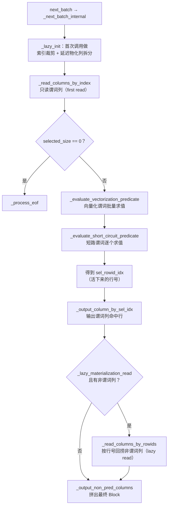

# 第 3 章：读路径内核 —— 谓词下推、延迟物化与合并读

[上一章](02-indexes.md) 把四把裁剪的刀讲透了：前缀索引、ZoneMap、BloomFilter、倒排各答一问，一次带谓词的扫描进来，它们把要读的行范围逐步收窄成一个 row bitmap。但索引只回答了"哪些行范围可以不读"，真正把这些判断串起来、把命中的行从磁盘上的列数据变成内存里的 `Block`，是**读路径**的活。本章跟着 `SegmentIterator` 走一遍段内的一次 `next_batch`：从 ch2 交出的 rowid 范围出发，谓词列先读、向量化/短路求值、生成选中行号、延迟物化回捞其余列；然后再上升一层，看多个 rowset 怎么在读时合并成一份逻辑正确的结果——DUP 直通、AGG 读时聚合、UNIQUE-MoR 读时去重。

本章行号引用基于写作时核实所用的 HEAD（`b9dd4488c3`，源码树与系列基线 `7bc98f696f` 一致）。代码演进会让行号漂移，但读路径的结构、谓词分类规则与合并读语义不变；每一处 `路径:行号` 都在当前代码里核实过。

## 3.1 问题：读 100 列中的 3 列、命中 1% 的行

**遇到了什么问题？** 一张 100 列的宽表，一条典型查询长这样：`SELECT c_a, c_b, ..., c_z FROM t WHERE c_x = ? AND c_y BETWEEN ? AND ?`——谓词只压在 2 个列上，最终命中 1% 的行，但要输出几十个列。ch2 的索引已经把要扫的行范围裁到很小，可即便如此，段内仍有两个成本没被回答：其一是**列的成本**——要输出的几十个列，每一列都要读、解压、解码；其二是**行的成本**——谓词裁剪是页级/块级的保守裁剪，页内还有大量不满足谓词的行混在里面。核心矛盾变成：**在页级裁剪之后，怎么让"读列数据"和"逐行过滤"这两件事互相省对方的功？**

**有哪些候选、各有什么优劣？**

- **候选一：全列读回内存，再逐行过滤。** 把要输出的所有列、把 ch2 裁剩的所有行,全部读进内存组成 `Block`，然后用谓词逐行打标记、把不命中的行删掉。实现最直白，但浪费是双重的：那 99% 会被谓词过滤掉的行，它们**所有输出列**的字节都被白读、白解压了。命中率越低、输出列越宽，浪费越大——这恰恰是分析型点查最常见的形态。
- **候选二：谓词列先读，行号回捞其余列（延迟物化，late/lazy materialization）。** 只先读谓词涉及的那几列，在这几列上把谓词跑完、得到一组"活下来"的行号（selected rowids），然后**只为这组行号**去回捞其余的输出列。代价是回捞时行号往往不连续，会多付一次"按行号定位的随机读"；收益是被过滤掉的 99% 的行，其非谓词列**一个字节都不读**。当命中率低、输出列宽时，省下的顺序读远大于多付的随机读。
- **候选三：索引先裁剪、再物化的组合拳。** 把 ch2 的页级裁剪和候选二的行级延迟物化叠起来——先用索引把行范围收窄（少读一批页），再在收窄后的范围里做谓词列先读 + 延迟回捞（少读一批行的非谓词列）。两级裁剪各减一维：索引减"行范围"，延迟物化减"这段范围里非命中行的列"。

**Doris 怎么考量和解决的？** Doris 走的是候选三，而候选二（延迟物化）是它段内读取的默认形态。`SegmentIterator` 在初始化时把要读的列分成两拨：**谓词列**（predicate columns，包括向量化谓词列、短路谓词列、delete 条件列）先读；**非谓词列**（non-predicate columns）延后到谓词跑完、拿到选中行号后再按行号回捞。是否启用这个延迟，不是拍脑袋的开关，而是由列的结构自动决定——下节从源码看它怎么分。这里先记住一个反直觉的边界：**延迟物化不是永远划算的**，当命中率很高（谓词几乎不过滤行）时，"多付的随机读"这一项会反超"省下的顺序读"，延迟物化反而更慢。这个边界和 Doris 有没有对应的自适应机制，是 3.2 的重点。

**第二个问题：多版本 rowset 的合并语义在读时怎么补？** 段内读只解决了"一个 Segment 怎么读"，但一个 Tablet 上是一串 rowset（[part1 第 3 章](../part1-architecture/03-data-model.md) 3.3 讲的版本区间），同一个 key 可能散落在多个 rowset 里。读一个逻辑上正确的结果，就要在读时把这些 rowset **合并**：

- **DUP（Duplicate）**：不去重、不聚合，所有行原样保留——合并只是把多个 rowset 的行拼在一起（直通）。
- **AGG（Aggregate）**：相同维度 key 的行要按每列的聚合函数（SUM/MAX/REPLACE…）合成一行——合并时要做**读时聚合**。
- **UNIQUE-MoR（Merge-on-Read）**：相同 key 只保留最高版本的那一行——合并时要做**读时去重**。

这三种语义都在读时"补账"，代价各不相同。为什么同一张 AGG 表 `count(*)` 两次结果会不一样？为什么 MoR 表点查随版本堆积越来越慢？答案都在合并读这一层，3.3 给机制级的解释。

## 3.2 源码走读：SegmentIterator 的一次 next_batch

一次 `next_batch` 是段内读取的最小工作单元。入口是 `SegmentIterator` 的 `next_batch()`（`be/src/storage/segment/segment_iterator.cpp:2802`），真正的主干在它调用的 `_next_batch_internal()`（`:2932`）。整体流程如下（这是本章必读的一张图）：



**高度概括的部分。** `_lazy_init`（`:606`，在 `_next_batch_internal` 的 `:2938` 处调用）只在第一次 `next_batch` 时执行一次，它把 ch2 的索引裁剪（生成 `_row_bitmap`）和延迟物化的列拆分（`_vec_init_lazy_materialization`，`:620`）都做完。之后每次 `next_batch` 都走同一套已经定好的列划分。`_read_columns_by_index`（`:2367`，`:2971` 处调用）负责把当前批次的行读进来——注意此时读的列由 `_predicate_column_ids` 决定，若延迟物化生效，这里**只读谓词列**。最后 `_output_non_pred_columns`（`:2298`）把非谓词列拼回 `Block`。中间三步——向量化求值、短路求值、延迟回捞——是本节要逐段看的重点。

### 谓词分类：为什么分向量化和短路两拨

延迟物化的第一步，是把所有列谓词分成两类：**能向量化批量求值的（vectorized）**和**只能短路逐个求值的（short circuit）**。分类逻辑在 `_can_evaluated_by_vectorized()`（`:2180`），它是整个读路径最该抠清楚的一段判断：

```cpp
switch (predicate->type()) {
case PredicateType::EQ: case PredicateType::NE:
case PredicateType::LE: case PredicateType::LT:
case PredicateType::GE: case PredicateType::GT: {
    if (field_type == OLAP_FIELD_TYPE_VARCHAR || CHAR || STRING) {
        return config::enable_low_cardinality_optimize &&
               _opts.io_ctx.reader_type == ReaderType::READER_QUERY &&
               _column_iterators[cid]->is_all_dict_encoding();
    } else if (field_type == OLAP_FIELD_TYPE_DECIMAL) {
        return false;
    }
    return true;
}
default:
    return false;
}
```

拆开看这套规则（`:2188`-`:2208`）：**只有六种比较谓词**（EQ/NE/LE/LT/GE/GT）**才有资格走向量化**，且要满足列类型条件——数值/日期等定长类型直接走向量化（`return true`）；**DECIMAL 明确排除**（`:2202` 返回 false）；**字符串类型**（VARCHAR/CHAR/STRING）只有在低基数优化开着（`config::enable_low_cardinality_optimize`，默认 `true`，`be/src/common/config.cpp:435`，是 `DEFINE_mBool` 可热改）、是查询读取（READER_QUERY）、且该列**整段字典编码**（`is_all_dict_encoding()`）时才走向量化——因为此时能在字典 code 上直接比较，不用解出真实字符串。其余一切谓词——`IN`/`NOT IN`、`IS NULL`、BloomFilter、`MATCH`（倒排）、以及不满足上述条件的字符串比较——统统落到 `default`（`:2206`）返回 false，走短路求值。

这个分类在 `_vec_init_lazy_materialization` 里执行（`:2034` 调用 `_can_evaluated_by_vectorized`）：能向量化的进 `_pre_eval_block_predicate` 和 `_vec_pred_column_ids`（`:2035`-`:2036`），否则进 `_short_cir_eval_predicate` 和 `_short_cir_pred_column_ids`（`:2038`-`:2039`）。运行时先跑向量化 `_evaluate_vectorization_predicate()`（`:2599`，`:2990` 处调用），把一批行整批过一遍比较、生成初步的选中行号；再跑短路 `_evaluate_short_circuit_predicate()`（`:2675`，`:2998` 处调用），在向量化选剩的行上逐个过复杂谓词。**为什么这么分？** 向量化谓词是列上的批量 SIMD 比较，一次处理一批行、吞吐极高；短路谓词形态复杂（如 `IN` 要查哈希集合、`MATCH` 要查倒排），无法整批 SIMD，只能逐行判断。先向量化把大头行数砍掉、再让短路谓词只面对少量幸存行，是把便宜的过滤放前面。

两步求值的产物是一个**选中行号索引数组** `_sel_rowid_idx`（`:2984` 处按当前批行数 resize）：向量化那步返回幸存的 `_selected_size`、把幸存行在本批内的下标写进 `_sel_rowid_idx`；短路那步在这个已经缩小的集合上继续过滤、再次收窄 `_selected_size`。两步跑完，`_sel_rowid_idx[0.._selected_size)` 就是"这一批里真正命中所有段内谓词的行"的批内下标。谓词列先按这个索引 `_output_column_by_sel_idx`（`:3006`）挑出命中行输出，非谓词列则拿 `_sel_rowid_idx` 换算成真实 rowid（`_block_rowids`）去 `_read_columns_by_rowids` 回捞——**延迟物化的"随机读"正来自这里：`_sel_rowid_idx` 对应的 rowid 越分散，回捞的 seek 越多**，这也是 3.2 末尾"高选择率下延迟物化倒亏"在代码里的落点。

**错写会怎样：** 若把 DECIMAL 比较误当成可向量化（去掉 `:2201`-`:2202` 那个分支），向量化路径会按定长比较去解读 DECIMAL 的内部表示——DECIMAL 的存储不是简单定长整数语义，比较结果会错，谓词过滤掉本该保留的行，查询结果直接错误且难察觉。同理，字符串谓词若不检查 `is_all_dict_encoding()` 就走向量化，会在"这一段不是字典编码"时拿 code 当值比，也会出错——所以这三个条件是**且**的关系，缺一不可。

### 延迟物化的列拆分：谁先读、谁后捞

分完谓词，`_vec_init_lazy_materialization` 就决定延迟物化是否启用。核心判断在 Step3（`:2110`）：

```cpp
if (_schema->column_ids().size() > pred_column_ids.size()) {
    for (auto cid : _schema->column_ids()) {
        if (!_is_pred_column[cid]) {
            if (_is_need_vec_eval || _is_need_short_eval) {
                _lazy_materialization_read = true;      // :2116
            }
            ... _non_predicate_columns.push_back(cid);  // :2121
        }
    }
}
```

条件是两个**且**：要读的列数**大于**谓词列数（即存在非谓词列，`:2110`），**且**确实有谓词要在段内求值（`_is_need_vec_eval || _is_need_short_eval`，`:2115`）。两者都满足，`_lazy_materialization_read = true`，非谓词列进 `_non_predicate_columns`。随后 Step4（`:2128`）里，若延迟物化生效，`_predicate_column_ids`（第一次读的列）**只装谓词列**（`:2130`-`:2131`）；非谓词列留给 `_next_batch_internal` 里谓词跑完后的 `_read_columns_by_rowids()`（`:3048`）按选中行号回捞。这次回捞被 `SCOPED_RAW_TIMER(&_opts.stats->lazy_read_ns)` 计时（`:2752`），对应 profile 的 `LazyReadTime`。

反过来，若没有非谓词列（要读的列全是谓词列），或压根没有段内谓词（`:2133` 分支），就一次把所有列都读进来、不延迟——因为没有"可以省着不读"的列，延迟只会平白多一次列切分。

**tricky 点：延迟物化的收益边界——高选择率反而更慢，而且没有自适应开关。** 延迟物化省的是"被过滤行的非谓词列的顺序读"，付的是"幸存行的非谓词列的随机定位读"。当命中率低（比如 1%），幸存行少、随机读少，省下的远大于付出的；但当命中率高（比如 90%），几乎所有行都幸存，回捞时要为海量分散的行号做定位读——这些行号往往不连续，`_read_columns_by_rowids` 退化成大量随机 seek，`LazyReadSeekCount`（`be/src/exec/operator/olap_scan_operator.cpp:225`）飙高，`LazyReadTime` 反超一次性顺序读全列的成本。**现场核实一个关键事实：Doris 的段内延迟物化没有基于选择率的自适应关闭机制，也没有 session 变量能关掉它。** 源码在 `:2140` 留了明确的 TODO：`// TODO To refactor, because we suppose lazy materialization is better performance. // pred exits, but we can eliminate lazy materialization`——即代码**假设**延迟物化总是更快，只按"是否存在非谓词列 + 是否有段内谓词"这个纯结构条件决定开关，不看选择率。搜索 session 变量也印证了这点：`enable_parquet_lazy_materialization`、`enable_orc_lazy_materialization`（`fe/fe-core/src/main/java/org/apache/doris/qe/SessionVariable.java:569`、`:571`）是给外表 Parquet/ORC 用的，`topn_lazy_materialization_threshold`（`:1759`）是 TopN 两阶段读的另一套优化，**都不控制内表 Segment 的这套延迟物化**。所以对于高选择率宽表查询，延迟物化是一个你无法在会话里关掉、只能靠建模（减少输出列、或让谓词更早收敛）去规避的固定行为——这正是 3.5 实验要亲手量出来的东西。

**易错点：把延迟物化的列拆分逻辑读错。** 最容易读错的是 delete 条件列的归属。`_vec_init_lazy_materialization` 在 `:2047`-`:2054` 把 delete 条件涉及的列**塞进短路谓词列集合、并标记为谓词列**（`_is_pred_column[cid] = true`）——也就是说 delete 条件列会跟着谓词列一起"先读"，而不是被延迟。若误以为"只有 WHERE 里的列才是谓词列、delete 列走非谓词回捞"，就会算错第一次读的列集，进而误判 `LazyReadTime` 该由哪些列贡献；更严重的是若真按错误理解改代码，delete 条件在谓词列还没读进来时就无法求值，删除的行会漏过过滤而错误返回。记住：**谓词列 = 向量化谓词列 ∪ 短路谓词列 ∪ delete 条件列**，这三者都先读，其余才延迟。

顺带一提，段的初始化本身也有一层延迟：`LazyInitSegmentIterator`（`be/src/storage/segment/lazy_init_segment_iterator.h:31`）把真正的 `SegmentIterator` 构造推迟到第一次 `next_batch`（`:40`-`:44`），这样一次查询涉及很多 segment、但实际只读到前几个（比如带 LIMIT）时，后面那些 segment 的初始化成本压根不付。这和列级延迟物化是两个不同层面的"lazy"，别混为一谈。

## 3.3 源码走读：多 rowset 合并读

段内读只是一个 Segment 的事。上升到 Tablet，读一份逻辑正确的结果要把一串 rowset 合并——这层的入口是 reader 类族。

**真实的 reader 类族（grep 核实）。** 基类是 `TabletReader`（`be/src/storage/tablet/tablet_reader.h:90`），它下面有两个 final 子类：`BlockReader`（`be/src/storage/iterator/block_reader.h:43`，`final : public TabletReader`）走**行式合并**，是查询走的路；`VerticalBlockReader`（`be/src/storage/iterator/vertical_block_reader.h:48`，同为 `final : public TabletReader`）走**列式合并**，是 compaction 走的路（`be/src/storage/merger.cpp:258` 处构造它）。查询读路径的合并逻辑，看 `BlockReader`。

**按 keys type 分流（这是合并读的心脏）。** `BlockReader` 在初始化时根据表的 keys type，把 `_next_block_func` 这个函数指针指向不同的实现（`be/src/storage/iterator/block_reader.cpp:627`-`:651`）：

```cpp
switch (_tablet_schema->keys_type()) {
case KeysType::DUP_KEYS:
    _next_block_func = &BlockReader::_direct_next_block;        // :629 直通
    break;
case KeysType::UNIQUE_KEYS:
    if (reader_type == READER_QUERY &&
        _reader_context.enable_unique_key_merge_on_write) {
        _next_block_func = &BlockReader::_direct_next_block;    // :634 MoW：直通
    } else if (_has_seq_map) {
        _next_block_func = &BlockReader::_replace_key_next_block;
    } else {
        _next_block_func = &BlockReader::_unique_key_next_block; // :638 MoR：读时去重
    }
    break;
case KeysType::AGG_KEYS:
    _next_block_func = &BlockReader::_agg_key_next_block;        // :645 读时聚合
    break;
}
```

**归并堆是这一切的底座。** AGG 的"同 key 相邻"和 MoR 的"版本从高到低"不是天上掉下来的，是底层 `VCollectIterator`（`be/src/storage/iterator/vcollect_iterator.cpp:56`）用一个**归并堆**排出来的。它把每个 rowset 的读取器包成一个 `LevelIterator`（`be/src/storage/iterator/vcollect_iterator.h:122`）——只读单个 rowset 的叫 `Level0Iterator`、能把多个 LevelIterator 合并输出的叫 `Level1Iterator`（`:117`-`:119`）——`build_heap()`（`:65`）把它们组织成一个多路归并堆，按**排序键列**做比较（`_compare_columns` 取自 `read_orderby_key_columns`，`:126`），键相同的再按 rowset 版本排序。于是从堆里 `next()` 出来的行天然满足"同 key 连续、且版本有序"，`_agg_key_next_block` / `_unique_key_next_block` 才能靠 `_next_row.is_same` 这个布尔量线性地判断组边界，而不必自己回头比较。一个关键优化：初始化时先算 `_rowsets_not_mono_asc_disjoint()`（`be/src/storage/iterator/block_reader.cpp:442`）判断 rowset 版本区间是否**互不重叠**，若不重叠则 `_merge = false`（`be/src/storage/iterator/vcollect_iterator.cpp:76`）——不重叠意味着同 key 不会跨 rowset 出现，无需真正建堆逐个比较，直接顺序拼接。这是 compaction 把窄区间合成宽区间后查询变快的另一半原因：除了少读被合掉的重复行，还省掉了归并比较本身的开销。

逐条对应 3.1 的三种语义：

- **DUP → `_direct_next_block`（`:656`）：直通。** 只调 `_vcollect_iter.next(block)`（`:657`）把底层归并迭代器（`VCollectIterator`）产出的块原样交出去，不去重、不聚合。DUP 表的合并只是"把多个 rowset 的行按序拼起来"，最便宜。
- **AGG → `_agg_key_next_block`（`:809`）：读时聚合。** 底层归并迭代器把相同 key 的行**相邻排在一起**产出，`_agg_key_next_block` 用一个 while 循环（`:823`）不断取下一行：若 `_next_row.is_same`（与当前组同 key），就 `_append_agg_data` 累积到聚合状态（`:856`）；遇到新 key 就把上一组的聚合结果 flush（`_update_agg_data`，`:861`）、开新组。**代价**：每个 key 组的所有版本行都要读进来、逐列跑聚合函数，读放大正比于"同 key 的重复行数"。
- **UNIQUE-MoR → `_unique_key_next_block`（`:867`）：读时去重。** 归并迭代器**按版本从高到低**产出（`:706`-`:707` 注释：`the version is in reverse order, the first row is the highest version, in UNIQUE_KEY highest version is the final result`），所以同 key 的第一行就是最高版本、即最终结果，后续同 key 行直接丢弃。**代价**：所有版本的行都要读进来参与归并、只为选出每个 key 的最新一行，版本堆积越多、被丢弃的行越多、读放大越大。
- **UNIQUE-MoW（Merge-on-Write）→ `_direct_next_block`（`:634`）：直通。** 这是留给下一章（ch4，Merge-on-Write）的钩子——MoW 表在**写时**就已经通过 delete bitmap 标记了被覆盖的旧行，读时无需再做去重合并，退化成和 DUP 一样的直通（配合 delete bitmap 在段内把被标记的行减掉）。所以 MoW 用写时代价换来了读时"零合并"，MoR 则相反。两者的读侧对照，ch4 展开。

**DeleteHandler 在合并里的位置。** delete 谓词（`DELETE FROM ... WHERE`）由 `DeleteHandler`（`be/src/storage/delete/delete_handler.h:57`）管理。`TabletReader` 在 `_init_delete_condition()`（`be/src/storage/tablet/tablet_reader.cpp:538`）里初始化它，`_delete_handler.init(..., read_params.version.second)`（`:561`）——注意传入了当前读取版本。取 delete 条件时走 `get_delete_conditions_after_version(0, ...)`（`:90`，函数声明在 `be/src/storage/delete/delete_handler.h:119`），**按版本过滤**：一条 delete 语句有它自己的版本号，它只对**版本不高于它**的数据生效（后来导入的新数据不该被旧的 delete 删掉）。这些 delete 条件最终作为**谓词下推进 SegmentIterator**——回看 3.2，delete 条件列在 `:2047`-`:2054` 被并入短路谓词列。所以 delete 的过滤**不在 `BlockReader` 的合并这一层做，而是下沉到每个 Segment 内、和 WHERE 谓词一起在段内求值**，被过滤的行数记入 `RowsDelFiltered`（`be/src/exec/operator/olap_scan_operator.cpp:234`）。合并层只负责保证"delete 条件按版本正确地关联到该删的那批 rowset"。

**tricky 点：读时聚合/去重的代价——count(\*) 为什么随 compaction 变化，机制级答案。** [part1 第 3 章](../part1-architecture/03-data-model.md) 3.4 说过一个现象（原文核实）："聚合是'最终'的，但不是'实时全量'的……跨 rowset 的相同 key 要等 compaction 或查询时才真正合并。所以在 compaction 尚未完成时，`count(*)` 的结果会随后台 compaction 的进度而变化"。这里给出机制级的落点：`count(*)` 数的是**合并读之后**的行数。同一个 key 若散落在 3 个还没合并的 rowset 里，`_agg_key_next_block`（AGG）或 `_unique_key_next_block`（MoR）在**读时**才把它们归并成一行——但归并只发生在**一次查询实际扫到的 rowset 集合**内。compaction 把多个小 rowset 合并成大 rowset 时，会**提前**把跨 rowset 的同 key 行合掉、物化进新 rowset；于是 compaction 前后，同一个逻辑 key 对应的物理行数在变，读时归并的输入在变，`count(*)` 的结果也就随之收敛。**这不是 bug，是"读时补账 + 后台提前补账"两条路径共同决定最终值的必然现象**：compaction 做得越多，读时要补的账越少、`count(*)` 越接近稳态，同时查询也越快（少读被 compaction 合掉的重复行）。反过来看代价：一张 AGG/MoR 表若高频导入、compaction 跟不上，读时聚合/去重的输入行数持续膨胀，每次查询都要在内存里把大量重复行归并掉——这就是"版本堆积拖慢查询"的根因。

**易错点：漏算 stale rowset / 版本路径选择。** 一次查询要读版本 `V`，本质是从 Tablet 的所有 rowset 里挑一组区间**首尾相接、无缝覆盖 `[0, V]`** 的集合（version path），这层选择在 `TabletReader::_capture_rs_readers()`（`be/src/storage/tablet/tablet_reader.cpp:99`）之前就由上游按 `read_params.rs_splits`（`:101`）定好。[part1 第 3 章](../part1-architecture/03-data-model.md) 3.3 讲过：同一个版本 `V` 可能有多条覆盖路径（`[0-1]+[2-2]+[3-3]` 或 `[0-1]+[2-3]`），compaction 生成宽区间 rowset 后旧的窄区间 rowset 进入 `stale_rs_metas` 不立即删——因为可能还有查询选定了旧路径在读。易错的是把"合并读的代价"只归到 keys type，忽略了**版本路径长度**这个乘数：路径越长（rowset 越多），归并的输入流越多、归并堆越大，合并读越慢。排查合并读慢，第一步永远是看版本数（`SHOW TABLETS` / compaction show），而不是先怀疑聚合函数。

## 3.4 双模式对比

本章讲的**段内读取逻辑（谓词下推、延迟物化、合并读）在存算一体、存算分离两种模式下完全一致**：`SegmentIterator` 的 `next_batch`、`_can_evaluated_by_vectorized` 的谓词分类、`BlockReader` 按 keys type 分流的合并读，都不区分模式——因为两模式的数据文件字节完全相同，读逻辑面对的是同一份 Segment 格式。差异只集中在一个点：**列数据的页从哪来**。一体模式下，`_read_columns_by_index` / `_read_columns_by_rowids` 最终落到本地盘的 `read()`；分离模式下，数据文件在对象存储上，读页时先过 File Cache（命中则读本地缓存、未命中则从对象存储回填），上层的 segment 读取代码对此无感。这层"页从 cache 还是对象存储来"的机制集中在第 6 章（分离模式专章）讲，本章不重复。

另外，本章是从"scanner 已经调到 `TabletReader` 读一个 block"这个点接力的——scanner 的调度、背压、`OlapScanner` 到 `TabletReader` 的交棒，在 [part2 第 7 章](../part2-query-lifecycle/07-scan-path.md) 讲过：`OlapScanner` 的 `_get_block_impl()` 往下就进 `TabletReader`，段内的列读取、谓词下推、索引"留给第 5 部分"——正是本章。两章在 `TabletReader` 这个边界严丝合缝地接上。

## 3.5 动手实验

实验环境（单机编译部署、建表灌数、开 profile）沿用 [part1 第 5 章](../part1-architecture/05-source-map-and-dev-env.md)。读 profile 的方法见 [part2 第 9 章](../part2-query-lifecycle/09-result-and-profile.md) 9.4 的四步漏斗。本实验两个目的：一是把**延迟物化的收益与边界**在 profile 里量出来；二是主动踩 AGG 表"读时补账"这个易错点，把合并读的代价亲手测出来。

**核心点一：延迟物化的收益边界——低选择率省、高选择率亏。** 前面（3.2）已核实：内表段内延迟物化**没有 session 开关**，不能像"开/关对比"那样测。但它对选择率高度敏感，所以正确的实验设计是**固定表和输出列、只变谓词选择率**，看延迟物化相关计数器怎么随选择率反转。建一张宽表：

```sql
CREATE TABLE t_wide (
    k BIGINT,                    -- 排序键/谓词列（高基数）
    c01 BIGINT, c02 BIGINT, ..., c50 BIGINT   -- 50 个非谓词输出列
) DUPLICATE KEY(k)
DISTRIBUTED BY HASH(k) BUCKETS 1
PROPERTIES ("replication_num"="1");
-- 灌入几千万行，k 高基数
```

开 `SET enable_profile = true;`，跑两条**输出列相同、只有谓词选择率不同**的查询：

```sql
-- (A) 低选择率：命中约 0.1%，延迟物化大赚
SELECT k, c01, c02, ..., c50 FROM t_wide WHERE k BETWEEN 1 AND 30000;
-- (B) 高选择率：命中约 90%，延迟物化倒亏
SELECT k, c01, c02, ..., c50 FROM t_wide WHERE k > 3000000;
```

到 profile 的 segment 层看这几个计数器（都在 `be/src/exec/operator/olap_scan_operator.cpp` 注册）：`PredicateColumnReadTime`（`:217`，谓词列先读耗时）、`NonPredicateColumnReadTime`（`:218`）、`LazyReadTime`（`:223`，回捞非谓词列耗时）、`LazyReadSeekTime`（`:224`）、`LazyReadSeekCount`（`:225`，回捞的随机 seek 次数）。预期：查询 (A) 里 `LazyReadSeekCount` 相对 `ScanRows` 很小、`LazyReadTime` 占比低——大部分行的 50 个非谓词列根本没读；查询 (B) 里 `LazyReadSeekCount` 逼近命中行数、`LazyReadTime` 成为大头——因为 90% 的行都要回捞、行号分散、随机 seek 爆炸。把两条查询的 `LazyReadTime / (PredicateColumnReadTime + LazyReadTime)` 比值一对比，就看清了"延迟物化在高选择率下反而更贵"这个边界，也印证了源码 `:2140` 那句"代码假设延迟物化总更快"的乐观假设在高选择率场景是不成立的——而你**关不掉它**，只能靠减少输出列或让谓词更早收敛来规避。

**核心点二（易错点）：AGG 表读时聚合的代价——高频导入后立刻 count(\*)，再 compaction 后重测。** 建一张 AGG 表，制造"同 key 散落多 rowset"的状态：

```sql
CREATE TABLE t_agg (
    dim1 INT, dim2 INT,          -- 维度 key
    v BIGINT SUM                 -- 聚合列
) AGGREGATE KEY(dim1, dim2)
DISTRIBUTED BY HASH(dim1) BUCKETS 1
PROPERTIES ("replication_num"="1", "disable_auto_compaction"="true");
```

关掉自动 compaction，然后**分很多批**导入（每批一个小事务、产生一个 `[n-n]` 单版本 rowset），且各批之间维度 key 大量重复。灌完立刻：

```sql
SET enable_profile = true;
SELECT count(*) FROM t_agg;
```

此时 `count(*)` 数的是**读时聚合后**的行数，profile 的 `RawRowsRead`（读进来参与归并的原始行）会远大于 `ReturnedRows`——差值就是 `_agg_key_next_block`（`be/src/storage/iterator/block_reader.cpp:809`）在读时合掉的重复行。记下这个 `count(*)` 值和查询耗时。然后手动触发 compaction（命令与 [part3 第 6 章](../part3-load-lifecycle/06-compaction.md) 一致）：

```bash
curl -X POST 'http://<be_host>:<webserver_port>/api/compaction/run?tablet_id=<TID>&compact_type=cumulative'
# 用 /api/compaction/show?tablet_id=<TID> 确认一串 [n-n] 被合成宽区间、rowset 数骤降
```

compaction 把跨 rowset 的同 key 行提前合掉后，重跑 `SELECT count(*) FROM t_agg;`：会观察到两点——其一，若之前多批导入里同 key 尚未跨 rowset 合并，compaction 前的 `count(*)` 可能偏大、compaction 后收敛（对应 part1 3.4 "count(*) 随 compaction 变化"）；其二，查询耗时下降、`RawRowsRead` 显著变小——因为读时不再需要归并那一大堆重复行。这就把"读时补账"的代价从抽象概念变成了盘上可量的数字：**同一条 count，compaction 前后读的原始行数与耗时都不同**。这也是排查"AGG/MoR 表查询忽快忽慢"的标准手法。

## 3.6 排查清单

| 症状 | 定位路径 |
|---|---|
| **同一条 SQL 忽快忽慢** | 优先看**版本数与合并读代价**，不是先怀疑执行计划。`SHOW TABLETS` / `curl '/api/compaction/show?tablet_id=<TID>'` 看是否挤了一长串 `[n-n]` 单版本 rowset——版本路径越长，`BlockReader` 归并的输入流越多、合并读越慢（3.3）。profile 里 `RawRowsRead` 远大于 `ReturnedRows` 说明读时聚合/去重在大量合行。手动 compaction 后重测；若稳定变快，即确认是版本堆积。根因常是导入频率超过 compaction 消化速度。 |
| **宽表点查慢（命中少却很慢）** | 看**物化策略**。profile 的 `LazyReadTime` / `LazyReadSeekCount`（`be/src/exec/operator/olap_scan_operator.cpp:223`、`:225`）：若 `LazyReadSeekCount` 逼近命中行数、`LazyReadTime` 占大头，说明选择率其实不低、延迟物化的随机回捞成了瓶颈（3.2 边界）。内表延迟物化无 session 开关可关，缓解手段是**减少 SELECT 的输出列**（少回捞几个列）或**让谓词更早收敛**（把高选择性条件前置/建对索引，减少幸存行）。另确认谓词是否走了向量化：`RowsVectorPredFiltered` vs `RowsShortCircuitPredFiltered`（`:204`、`:206`），若本该向量化的比较谓词落到短路（如 DECIMAL、非字典字符串），求值会慢——见 `_can_evaluated_by_vectorized`（`be/src/storage/segment/segment_iterator.cpp:2180`）。 |
| **AGG 表查询结果"变化"** | 先确认这是**模型语义不是 bug**（part1 3.4）：`count(*)` 数的是读时聚合/去重后的行数，compaction 前后同 key 的物理行数在变，结果随之收敛。验证方法：记下当前 `count(*)`，手动 `curl -X POST '/api/compaction/run?tablet_id=<TID>&compact_type=cumulative'` 触发合并，再查——若结果收敛并稳定，即证明是"读时补账"的正常收敛过程（3.3）。若结果在 compaction 完成后仍持续变化，才需进一步查是否有新数据在导入。MoR 表同理，只是语义从"聚合"换成"取最高版本"。 |

至此，一次查询从 ch2 的索引裁剪拿到 rowid 范围，到本章 `SegmentIterator` 的谓词列先读、向量化/短路求值、延迟物化回捞，再到 `BlockReader` 按 keys type 把多 rowset 合并成逻辑正确的结果——整条段内读路径就串通了。其中 UNIQUE-MoW 表在读侧退化成直通、把去重代价挪到了写时的 delete bitmap，这条"写时补账"的路是本章刻意留下的钩子。下一章（ch4）就深入 Merge-on-Write：delete bitmap 怎么在写入时算出被覆盖的旧行、怎么在读时把它们从 `_row_bitmap` 里减掉，把 MoR 的读放大彻底换成 MoW 的写放大。
