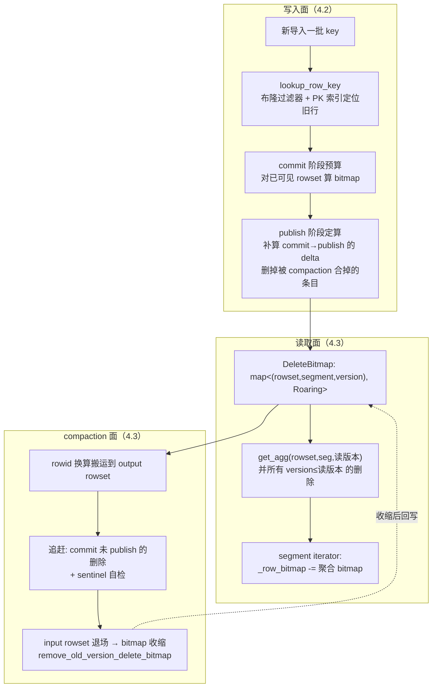

# 第 4 章：主键模型内核 —— Delete Bitmap 的全生命周期

[上一章](03-read-path.md) 结尾埋了一个钩子：UNIQUE-MoW 表在读侧退化成 DUP 直通，靠的是在段内把 delete bitmap 标记的行从 `_row_bitmap` 里减掉——去重的代价被挪到了写时。本章就沿着这条线，把 Merge-on-Write 拆到底：一批新数据进来，怎么通过主键索引找到被顶替的旧行、怎么把这些行记进 delete bitmap、这份 bitmap 又怎么在读时被消费、在 compaction 时被搬运、在高频 upsert 下增长又靠什么收口。[part3 第 3 章](../part3-load-lifecycle/03-tablet-write-path.md) 3.3 讲过写入面的 delete bitmap 两阶段预算，本章不重复那条主干，而是深入它的**全生命周期**与每个环节的易错点。

本章行号引用基于写作时核实所用的 HEAD（`4e846e8f7e`，源码树与系列基线 `7bc98f696f` 一致）。代码演进会让行号漂移，但主键索引结构、DeleteBitmap 的聚合语义、两阶段计算与 compaction 搬运的机制不变；每一处 `路径:行号` 都在当前代码里核实过。

## 4.1 问题：在列存上做主键更新的三条路

**遇到了什么问题？** 列存文件（Segment）一旦写完就不可变（ch1 已论证），列被压缩、编码、按行号定位。可主键表要的是"同一个 key 的新值覆盖旧值"——这是个天生带"原地更新"意味的语义，跟"文件不可变"直接冲突。一批 upsert 进来，历史里散落在各个 rowset、各个 segment 里的同 key 旧行必须"失效"，但我们又不能去改那些已经封存的列文件。矛盾摆在这：**怎么在只追加、不可变的列存上，表达"这些旧行以后不算数了"？**

**有哪些候选、各有什么优劣？**

- **候选一：copy-on-write（重写文件）。** 每次更新把受影响的整个数据文件读出来、把旧行替换成新值、重写一个新文件。语义最干净、读时零成本，但写放大灾难性——改一行要重写一整个文件（可能上百 MB），高频导入下完全不可接受。分析型库里几乎没人这么干。
- **候选二：merge-on-read（读时合并，MoR）。** 导入时只管追加新 rowset，和 DUP 一样快；查询时把同 key 的多个版本读进来、按版本取最新。写快，但把成本全压到读端：每次查询都要做读时去重归并，版本堆积越多读放大越大，而且**谓词下推会失效**——一个 key 是否该被过滤，要等归并出最终行才知道，无法在段内提前裁掉。
- **候选三：delete-and-insert（写时标删，MoW）。** 新行照常追加进新 rowset，同时在写入时**回头找到旧行、把它标记为已删除**。读时直接跳过被标记的行，无需再归并——读侧退化成近似 DUP 的直通。代价是写入时多了两件重活：一是"找到旧行"（要有主键索引能定位历史数据），二是维护这份"删除标记"。

**Doris 怎么考量和解决的？** [part1 第 3 章](../part1-architecture/03-data-model.md) 3.4 已把结论定了性：**选 MoR 还是 MoW，本质是把去重的成本放在读端还是写端**。MoW 是新版本 Unique 表的默认形态，因为分析型负载读远多于写、且要求谓词下推与向量化在主键表上照常生效。它用的正是候选三——那份"删除标记"就是本章的主角 **delete bitmap**。但 MoW 因此背上了 MoR 没有的两笔新代价：**写入时要"找到旧行"**（主键索引 + lookup），以及**bitmap 本身的计算、存储与搬运**。这两笔代价怎么摊、错在哪，就是 4.2/4.3 的内容。

**为什么 bitmap 要按 `(rowset, segment, version)` 三元组组织，而不是全局一张？** 这是理解 MoW 一致性的钥匙。delete bitmap 的定义在 `class DeleteBitmap`（`be/src/storage/tablet/tablet_meta.h:460`），它的 key 类型是 `using BitmapKey = std::tuple<RowsetId, SegmentId, Version>`（`:465`），value 是一个 Roaring bitmap（存被删行的行号集合），整体是一个有序 `std::map`（`:466`）。前两维 `RowsetId`/`SegmentId` 是为了**定位**——删除标记必须精确到"哪个 rowset 的哪个 segment 的哪几行"；关键是第三维 `Version`（一个 `uint64_t`），源码注释（`:447`-`:457`）写得很直白：它记的是"**哪次导入的版本，导致了这次删除或覆盖**"。举例：key `key1` 原在 rowset 1、version [1,1]、segment 1、row 1；version 2 的新导入也带了 `key1`，于是 bitmap 记 `{rowset1, seg1, 2} -> {1}`，意思是"rowset1/seg1 的 row 1，从 version 2 起被覆盖"。

为什么非要带上版本？因为**不同版本的快照读，需要看到各自时点该跳过的删除集合**。一个在 version 5 发起的查询，只能看到 version ≤ 5 的导入造成的删除；一个读 version 3 的历史快照，必须**看不到** version 4、5 才标上的删除——否则历史快照就被未来的删除污染了。把版本编进 key，读时才能精确回答"截至我这个读版本，这一行到底删没删"。这正是 4.2 要讲的 `get_agg` 聚合语义的由来。一张全局大 bitmap 无法表达这种版本相关性，也无法在 compaction 时按 rowset 粒度搬运和回收。

## 4.2 源码走读：写入面 —— 从 lookup 到两阶段 bitmap

写入面要回答两个问题：**怎么找到旧行**（主键索引 + lookup），以及**什么时候、算成什么样**（两阶段 bitmap + 聚合语义）。

### 主键索引：segment 内的一棵"分区索引 + 布隆过滤器"

MoW 要在写时定位旧行，就必须有一个"给定 key，快速找到它在哪个 rowset/segment/row"的索引。这个索引建在**每个 Segment 内部**，实现是 `PrimaryKeyIndexBuilder` / `PrimaryKeyIndexReader`（`be/src/storage/index/primary_key_index.h`）。它的注释（`:44`-`:49`）点明了设计：**仿照 RocksDB 的 Partitioned Index**，在 MemTable flush 成 Segment 时构建，索引数据借 `IndexedColumnWriter` 分成多个 page 存放。除了有序的 key 索引，它还额外挂一个**布隆过滤器**（`BloomFilterIndexWriter`，`:96`）——这是 MoW 点查性能的关键：绝大多数"这个 key 在不在这个 segment"的问题，一次布隆过滤器测试就能否定掉，根本不用去读索引 page。

Segment 侧持有一个 `_pk_index_reader`（`be/src/storage/segment/segment.h:318`），对外暴露 `lookup_row_key`（`:141`，实现在 `be/src/storage/segment/segment.cpp:903`）。段内查找的顺序值得逐段看：

1. `load_pk_index_and_bf(stats)` 先把主键索引和布隆过滤器加载好；
2. **布隆过滤器先挡一道**：`_pk_index_reader->check_present(key_without_seq)`（`be/src/storage/segment/segment.cpp:920`），不存在直接返回 `KEY_NOT_FOUND`——这一步把绝大多数无关 segment 挡在外面，是点查快的根本；
3. 布隆过滤器说"可能有"，才 `seek_at_or_after`（`:926`）在有序索引里定位到第一个 ≥ 目标 key 的位置，拿到候选行号；
4. 取出候选 key 与目标逐字节比较，确认是否精确命中。

**tricky 点：sequence 列的处理——为什么 lookup 的 key 要"去掉 seq 再比"。** MoW 表可以带一个 sequence 列，用来定义"谁更新"（同 key 高 seq 覆盖低 seq，用于乱序导入去重）。代码里反复出现 `key_without_seq`（`be/src/storage/segment/segment.cpp:915`）——先把编码 key 尾部的 seq 值切掉，用"纯 key"部分去布隆过滤器和索引里找；找到候选后，如果 `has_seq_col`，再单独比较 sequence id（`:960`-`:969`）：若**新行的 seq 小于已存在行的 seq**，返回的是 `KEY_ALREADY_EXISTS`（错误信息 `"key with higher sequence id exists"`），意味着"这条新数据反而该被现存数据覆盖"。**错写会怎样**：如果拿带 seq 的整串 key 去索引里做精确匹配，那么同一个逻辑 key 的不同 seq 会被当成不同 key，覆盖语义完全失效——历史行永远匹配不上，去重形同虚设。这就是"纯 key 定位、seq 单独比较"这个两段式写法的原因。

段内 lookup 之上是 tablet 级的 `BaseTablet` 的 `lookup_row_key()`（`be/src/storage/tablet/base_tablet.cpp:462`）。它遍历传入的 `specified_rowsets`，对每个 rowset 先用 `segments_key_bounds`（每个 segment 的 min/max key）做一次段级裁剪（`_key_is_not_in_segment`，`:507`），把 key 明显不在范围的 segment 跳过；命中的 segment 才真正调段内 lookup。最关键的一步在 `:534`：当段内找到了行，它还要问一句——

```cpp
if (s.ok() && tablet_delete_bitmap->contains_agg_with_cache_if_eligible(
                      {loc.rowset_id, loc.segment_id, version}, loc.row_id)) {
```

也就是说，**找到的这一行本身是否已经被删除了**。如果这行在当前版本下已被标删，那它不是"活着的旧行"，要继续往更老的 rowset 找（有 seq 列则 `continue`，否则 `break`）。这里第一次出现了 `contains_agg`——它是 delete bitmap 聚合语义的核心，下面专门讲。这条 lookup 路径本身还挂了 bvar 指标 `g_tablet_lookup_rowkey_latency`（`be/src/storage/tablet/base_tablet.cpp:72`，名字 `doris_pk/tablet_lookup_rowkey`）和 `g_tablet_pk_not_found`（`:73`），4.5 会用到。

### 两阶段计算：为什么必须分两次

[part3 第 3 章](../part3-load-lifecycle/03-tablet-write-path.md) 3.3 讲过 delete bitmap 是"**写入阶段预算 + publish 阶段定算**"两步，并给了数据结构。本章深化一个它没展开的问题：**为什么必须两阶段，不能一次算完？**

答案在"可见版本集合何时确定"。看两个入口：

- **commit 阶段**：`BaseTablet` 的 `commit_phase_update_delete_bitmap()`（`be/src/storage/tablet/base_tablet.cpp:1300`，由 `be/src/storage/rowset_builder.cpp:360` 调用）。它取当前所有 rowset 的 id 集合 `cur_rowset_ids`，与上次记录的 `pre_rowset_ids` 求差（`_rowset_ids_difference`），只对**新增的那批 rowset** 算 bitmap（`:1343`-`:1352`）。这一步在导入还没提交时就预跑，目的是把计算量提前摊掉。
- **publish 阶段**：`BaseTablet` 的 `update_delete_bitmap()`（`be/src/storage/tablet/base_tablet.cpp:1461`，由 `be/src/storage/txn/txn_manager.cpp:596` 调用）。它此时才拿到 `next_visible_version`，重新取 `next_visible_version - 1` 时刻的 `cur_rowset_ids`（`:1528`），再做一次 `_rowset_ids_difference`（`:1532`）：`rowset_ids_to_add` 是 commit 之后又新出现、需要补算的 rowset；`rowset_ids_to_del` 则是被 compaction 合掉、要把其 bitmap 条目删掉的 rowset（`:1534`-`:1536`）。

**为什么不能只在 commit 时算完？** 因为一次导入最终占哪个版本、以及在它可见的那一刻**还有哪些别的 rowset 也变可见了**，在 commit 时是不确定的——版本号在 commit 时定下，但并发的其他导入可能在你 commit 之后、publish 之前也提交了新 rowset，这些新 rowset 里可能有和你同 key 的行需要相互标删。可见版本集合**只有到 publish 才真正冻结**。所以 Doris 的策略是：commit 阶段对"已知的、当下可见的"rowset 尽量把 bitmap 算好（这部分量最大，提前摊掉降低 publish 延迟），publish 阶段只补算 commit 之后新增的那一小截 delta。**错把全部计算放到 publish**，会让 publish（这个需要串行/持锁推进版本的关键路径，见 4.4）背上全部 bitmap 计算的耗时，导入吞吐直接塌方；**错把全部计算放到 commit**，则会漏掉并发窗口里的新 rowset，导致 bitmap 缺失、查出重复行。两阶段是延迟与正确性之间的必然折中。

多 segment 的 rowset 还有一个内部去重问题：一批数据可能自己内部就有重复 key，落在同一 rowset 的不同 segment 里。这由 `calc_delete_bitmap_between_segments`（`be/src/storage/tablet/base_tablet.h:207`）处理，底层用 `MergeIndexDeleteBitmapCalculator`（`be/src/storage/delete/delete_bitmap_calculator.h:83`）——它把每个 segment 的主键索引迭代器包成一个 `MergeIndexDeleteBitmapCalculatorContext`（`:44`），塞进一个**最小堆多路归并**（`Heap`，`:95`，比较器 `Comparator` 按 key + seq + rowid 定序，`:46`），`calculate_all`（`:92`）一路归并出重复 key 并标删。这是"新 rowset 内部自去重"的实现，和"新 rowset 覆盖历史 rowset"是两条并行的计算。

### tricky 点：`get_agg` / `contains_agg` 的聚合语义

delete bitmap 是按 `(rowset, segment, version)` 一条条追加的——同一个 `(rowset, segment)` 会因为多次导入的覆盖而积累出**多个版本**的删除条目。读一行"截至版本 V 是否被删"，就不能只看某一条，而要把**所有版本 ≤ V 的删除条目并起来**。这就是 `get_agg`（`be/src/storage/tablet/tablet_meta.h:639`）：

```
select sum(roaring::Roaring) where RowsetId=rowset_id and SegmentId=seg_id and Version <= version
```

它的实现（`be/src/storage/tablet/tablet_meta.cpp` 的 `DeleteBitmap::get_agg_without_cache`）利用了 `delete_bitmap` 是**有序 map** 这个性质：从 `{rowset, segment, start_version}` 做 `lower_bound`，顺序往后遍历，只要 rowset/segment 相同且版本 ≤ 目标版本，就把 Roaring bitmap 逐个 `|=`（按位或）合并；一旦越过版本上界或换了 rowset/segment 就 `break`。`contains_agg`（`be/src/storage/tablet/tablet_meta.cpp:1581`）就是 `get_agg(bmk)->contains(row_id)` 的薄封装。

**错读这个语义会怎样，是本节最该记的点。** 如果误以为"查一行删没删只要看它 exact 版本那条 bitmap"，就会漏掉更早版本累积的删除，把已删的行当成活的读出来——主键唯一性直接破功、查出重复行。反过来，如果不带版本上界、把所有版本的删除都并进来，那历史快照读就会看到"未来"才发生的删除，历史查询结果被污染。正是 `Version <= version` 这个上界，既保证了"截至读版本的所有删除都生效"，又保证了"读版本之后的删除不越界"——这是 4.1 里"为什么按版本组织"那个设计的兑现处。

因为每次读都要跑一遍这个多版本归并，Doris 给它加了一层缓存 `DeleteBitmapAggCache`（`be/src/storage/tablet/tablet_meta.h:426`，一个基于 `LRUCachePolicy` 的 LRU 缓存）：`get_agg`（带缓存版，`be/src/storage/tablet/tablet_meta.cpp`）先查缓存的聚合结果，命中就直接用，未命中才现算并回填。`contains_agg_with_cache_if_eligible`（`be/src/storage/tablet/tablet_meta.h:632`，前面 lookup 用的就是它）是"符合条件才走缓存"的变体。注意这层缓存缓存的是**计算结果**，不是 bitmap 存储本身——它省的是重复归并的 CPU，不省内存里 bitmap 的体积。这个区别在 4.3 讲增长时很关键。

### 易错点：并发导入相同 key 的 bitmap 竞争——为什么要锁

两个导入并发写同一个 key，如果各自独立算 bitmap，可能都没看到对方、都把对方当"旧行"标删，或都没标删，结果就是重复行或丢更新。所以 bitmap 计算必须串行化。串行化的手段在两种模式下完全不同（4.4 展开）：**存算一体**靠 tablet 级的本地锁 + publish 天然串行；**存算分离**因为 publish 是分布式的，必须靠 MetaService 的分布式锁 `delete_bitmap_update_lock`，冲突时抛 `DELETE_BITMAP_LOCK_ERR` 并在 BE 侧重试（[part3 第 2 章](../part3-load-lifecycle/02-stream-load-path.md) 讲过这条重试路径）。

## 4.3 源码走读：读取面与 compaction 面

写入面把 bitmap 算出来存好了，接下来看它怎么被消费、怎么在后台搬运、以及它自己怎么增长和回收。

### 读取面：bitmap 怎么到达 segment iterator

ch3 结尾说 MoW 读侧退化成直通，靠的是"配合 delete bitmap 在段内把被标记的行减掉"。这条路的完整轨迹是：

1. **rowset reader 取聚合快照**：`BetaRowsetReader`（`be/src/storage/rowset/beta_rowset_reader.cpp:175`-`:189`）在初始化时，若 read context 带了 delete bitmap，就对本 rowset 的每个 segment 调 `get_agg({rowset_id, seg_id, version.second})`——注意版本用的正是**本次查询的读版本** `version.second`（`:180`），这就把 4.2 的版本聚合语义落到了读路径。拿到的聚合 bitmap 存进 `_read_options.delete_bitmap`（`:187`），按 segment id 索引。
2. **segment iterator 做减法**：`SegmentIterator`（`be/src/storage/segment/segment_iterator.cpp:622`-`:626`）在初始化 `_row_bitmap` 后，若本 segment 有对应的 delete bitmap，就直接 `_row_bitmap -= *(_opts.delete_bitmap.at(segment_id()))`——把被标删的行从"要读的行集合"里减掉，减掉的行数记进 `stats->rows_del_by_bitmap`（`:626`）。

这就是 ch3 那个钩子的落点：MoW 读时不做归并，只做一次 Roaring bitmap 的差集运算，被标删的行连读都不读。相比 MoR 每次查询把所有版本读进来归并，这是"写时补账"换来的读侧红利。值得注意的是聚合发生在**每个 segment 粒度**，而不是整 rowset 一把——因为不同 segment 的删除行号相互独立，段级聚合既让差集能就近下推到各 `SegmentIterator`，也让 `DeleteBitmapAggCache` 的缓存条目按 segment 复用、命中率更高。这一步的耗时单独计入 `stats->delete_bitmap_get_agg_ns`（`be/src/storage/rowset/beta_rowset_reader.cpp:177`），查询侧若发现读放大异常，可用它区分"慢在读列数据"还是"慢在 bitmap 聚合"。

### compaction 面：bitmap 的搬运与追赶

compaction 把多个小 rowset 合成大 rowset，行号坐标系会因去重而重排，挂在旧 rowset 上的 delete bitmap 必须跟着**换算到新 rowset 的行号上**。[part3 第 6 章](../part3-load-lifecycle/06-compaction.md) 把这个"搬运"作为伏笔埋下了（§6.3"delete bitmap 的搬运"），本章深化其中最微妙的一环：**compaction 期间新导入落在旧 rowset 上的追赶处理**。

核心搬运函数是 `calc_compaction_output_rowset_delete_bitmap`（`be/src/storage/tablet/base_tablet.h:271`），它借 `RowIdConversion`（合并时建立的"旧行号→新行号"映射）把 input rowset 的 bitmap 换算到 output rowset。真正的难点在 `CompactionMixin` 的 `modify_rowsets`（`be/src/storage/compaction/compaction.cpp`）收尾时的一段（`:1505`-`:1560`）：compaction 读的是开始那一刻的快照，但合并过程可能持续数秒到数分钟，**这期间新导入可能又在 input rowset 上标删了一些行**。如果只搬运快照时刻的 bitmap，这些"迟到的删除"就会丢，已删的行在新 rowset 里复活。

Doris 的追赶逻辑是这样的（`:1511`-`:1544`）：收尾时在 `get_rowset_update_lock` + `get_header_lock` 保护下，先收集本 tablet **所有已 commit 但未 publish** 的事务的 delete bitmap（`get_all_commit_tablet_txn_info_by_tablet`）；对每个这样的事务，判断 `_check_if_includes_input_rowsets`（`:1517`）——它的 bitmap 是否已经覆盖了所有 compaction input rowset。**只有覆盖了才追赶**：因为若这个 commit 事务比被合并的 rowset 还新，rowid 换算无从做起（`:1518`-`:1522` 的注释点破了这一点，硬做会丢数据）。满足条件的，把它的 delete bitmap 也换算到 output rowset 上、merge 回该事务（`:1539`）、并把 output rowset id 补进它的 `rowset_ids`（`:1540`）。这样，等这些 commit 事务将来 publish 时，它们的 bitmap 已经包含了对新 output rowset 的删除，不会漏。最后再对增量部分（`version.second` 之后）做一次换算并 `merge_delete_bitmap`（`:1547`-`:1558`）。

**sentinel 标记的作用（part3 第 6 章伏笔的深化）。** 追赶换算完，代码会调 `add_sentinel_mark_to_delete_bitmap`（`be/src/storage/tablet/base_tablet.cpp:1366`）给每个处理过的 rowset 打一个哨兵条目：key 是 `{rowsetid, INVALID_SEGMENT_ID, TEMP_VERSION_COMMON}`、值是 `ROWSET_SENTINEL_MARK`（`:1371`）。这个哨兵不是真的删除标记（segment id 是特殊的 `INVALID_SEGMENT_ID`，在统计 cardinality/count 时都会被跳过），它是**正确性自检的凭据**：`check_delete_bitmap_correctness`（`be/src/storage/tablet/base_tablet.cpp:1391`）会检查"每个本该被处理的 rowset 是否都留下了哨兵"，缺哨兵（`missing_ids` 非空）就打出 `"check delete bitmap correctness failed!"` 告警——意味着某个 rowset 的删除计算被漏掉了，这正是"查出重复行"这类严重故障的早期探针。这套自检由 `enable_merge_on_write_correctness_check`（`be/src/common/config.cpp:1372`，`DEFINE_mBool` 可动态调整，默认 `true`）控制。

### 易错点：bitmap 的增长与"GC"——诚实地说清楚

高频 upsert 同一批 key，delete bitmap 会怎么涨？**要诚实**：`DeleteBitmap` 是一个 `std::map<BitmapKey, Roaring>`，每一次导入对某个 `(rowset, segment)` 的覆盖，都会往这个 map 里追加一条新版本的条目。**在 compaction 介入之前，条目数只增不减**——同一个 key 被 upsert 100 次，就可能在历史 rowset 上累积出 100 条不同版本的删除条目。条目多了，`get_agg` 的多版本归并越来越长，`TabletMeta` 越来越大、`save_meta` 越来越慢（[part3 第 6 章](../part3-load-lifecycle/06-compaction.md) 6.1"主键表放大"正是这笔账）。

那什么在**真正**收口它？答案是 **compaction，而不是某种独立的"bitmap compaction"**：

- **input rowset 的 bitmap 随 rowset 被替换而整体消失**——compaction 合掉一批 input rowset 后，这些 rowset 连同它们的所有 bitmap 条目一起退场，删除信息被浓缩进 output rowset 的少量条目里。这是 bitmap 收缩的主力。
- compaction 收尾还会调 `TabletMetaManager::remove_old_version_delete_bitmap`（`be/src/storage/compaction/compaction.cpp:1580` 附近，仅 MoW 表）清理旧版本的 bitmap 条目。
- 对进入 stale 状态的 rowset，`agg_delete_bitmap_for_stale_rowsets`（`be/src/storage/tablet/base_tablet.h:295`，`be/src/storage/tablet/tablet.cpp:1054` 调用）会把其 bitmap 聚合并标记待删。

所以真正**约束 bitmap 增长的不是任何缓存，而是 compaction 能否跟上导入频率**。这也是为什么 MoW 表有个特殊规则：即便体量没攒够，只要输出 rowset 的版本跨度超过阈值就强制推进 cumulative point（[part3 第 6 章](../part3-load-lifecycle/06-compaction.md) §6.2 核实过 `_promotion_version_count`）——就是为了不让 bitmap 版本条目无限堆积。至于 `DeleteBitmapAggCache`（容量 `delete_bitmap_agg_cache_capacity`，`be/src/common/config.cpp:1002`，`DEFINE_Int64` 不可动态改，默认 100MB；过期清理 `delete_bitmap_agg_cache_stale_sweep_time_sec`，`:1008`，`DEFINE_mInt32` 可动态改，默认 1800 秒），它只缓存**聚合计算结果**、省 CPU，**完全不减小 bitmap 本身的存储**。把它当成"bitmap 会自动瘦身"的机制，是常见误解。

下面用一张图把全生命周期串起来：



## 4.4 双模式对比

**bitmap 的计算逻辑两模式完全一致**：同一个 `DeleteBitmap` 数据结构、同一套 `lookup_row_key` + 两阶段计算 + `get_agg` 聚合、同一个 `MergeIndexDeleteBitmapCalculator`。数据文件字节相同，读逻辑（段内做差集）也相同。差异只集中在两处：**bitmap 存在哪**，以及**靠什么锁串行化并发计算**。

**存储位置。** 存算一体下，bitmap 挂在 `TabletMeta` 上（`_delete_bitmap`），随 tablet 元数据由 `TabletMetaManager::save_delete_bitmap`（`be/src/storage/tablet/tablet.cpp:2871` 的 `Tablet` 的 `save_delete_bitmap()` 调用）持久化到本地 RocksDB。存算分离下，bitmap 的权威副本在 MetaService/FDB 上——commit 时随事务一起写入，pending 态用 `meta_pending_delete_bitmap_key`（`cloud/src/meta-service/meta_service_txn.cpp:1398`）暂存，BE 读时按需从 MetaService 拉取聚合。

**锁。** 这是两模式最实质的差异，根子在"publish 是否天然串行"：

- **存算一体：无分布式锁，靠 publish 串行 + 本地互斥。** `Tablet` 的 `save_delete_bitmap()` 里那句注释说得直白（`be/src/storage/tablet/tablet.cpp:2893` 附近）："publish_txn runs sequential so no need to lock here"——同一 tablet 的 publish 由本地执行器串行推进，publish 之间不会并发写 bitmap。唯一要防的是 **compaction 与 publish 之间**的竞争，靠 tablet 级的 `_rowset_update_lock`（`be/src/storage/tablet/tablet.h:218`/`:633`，一个 `std::mutex`）+ `_meta_lock` 串行化——compaction 收尾搬运 bitmap 时就持着这把锁（`be/src/storage/compaction/compaction.cpp:1506`）。
- **存算分离：MetaService 的分布式锁 `delete_bitmap_update_lock`。** publish 被搬进 MetaService、不再有 per-BE 串行保证，因此并发导入必须抢一把分布式锁。锁 key 是 `meta_delete_bitmap_update_lock_key({instance_id, table_id, -1})`（`cloud/src/meta-service/meta_service_txn.cpp:1296`）——注意 partition 维是 `-1`，即**表级锁**。FE 侧通过 `getDeleteBitmapUpdateLock`（`fe/fe-core/src/main/java/org/apache/doris/cloud/transaction/CloudGlobalTransactionMgr.java:1147`）申请，`lockId` 用事务 id，过期时间由 FE 配置 `delete_bitmap_lock_expiration_seconds`（`fe/fe-common/src/main/java/org/apache/doris/common/Config.java:3368`，`@ConfField(mutable = true)`，默认 60 秒）决定。抢不到锁抛 `DELETE_BITMAP_LOCK_ERR`（`fe/fe-core/src/main/java/org/apache/doris/cloud/transaction/CloudGlobalTransactionMgr.java:783`、`:861`）并在 BE 侧重试（[part3 第 2 章](../part3-load-lifecycle/02-stream-load-path.md)）；`enable_mow_load_force_take_ms_lock`（`fe/fe-common/src/main/java/org/apache/doris/common/Config.java:3469`，`@ConfField(mutable = true)`，默认 `true`）控制是否走强制抢锁路径。

这条提交路径本身在 [part3 第 4 章](../part3-load-lifecycle/04-commit-and-visibility.md) 讲过——存算分离的 commit 是一次到 MetaService 的 RPC、版本推进在一次 FDB 事务里完成，delete bitmap 的锁与写入正是嵌在这次提交里的关键步骤。本章补上的是这一步的 MoW 细节。

## 4.5 动手实验

实验环境（单机编译部署、建表灌数）沿用 [part1 第 5 章](../part1-architecture/05-source-map-and-dev-env.md)。本实验两个目的：一是把**delete bitmap 随高频 upsert 的增长、以及 compaction 对它的收缩**用真实观测接口量出来；二是主动踩"热点主键"这个易错点，把同 key 并发与不同 key 并发的代价差量出来。

**先认识观测接口。** Doris 确实提供了直接看 bitmap 的 BE HTTP 接口（`be/src/service/http_service.cpp:424`-`:495` 注册）：

- `GET /api/delete_bitmap/count_local?tablet_id=<TID>&verbose=true`（一体/分离本地视角）
- `GET /api/delete_bitmap/count_ms?tablet_id=<TID>`（分离，从 MetaService 取）
- `GET /api/delete_bitmap/count_agg_cache?tablet_id=<TID>`（看聚合缓存）

返回 JSON 里有两个关键字段（`be/src/service/http/action/delete_bitmap_action.cpp:85`-`:92`）：`delete_bitmap_count`（map 里的条目数，即"多少个 `(rowset,segment,version)` 删除条目"，由 `get_delete_bitmap_count` 统计、跳过哨兵）和 `cardinality`（所有 bitmap 里被删行的总数）。`verbose=true` 还会逐条列出每个 rowset/segment/version 的 cardinality。注意 `SHOW TABLETS` **并不直接暴露 bitmap 明细**，它给的是版本数/行数等；bitmap 的直接观测就靠上面这个专用接口。另外 BE 的 bvar（`/vars` 或 `/metrics`）下有 `doris_pk` 前缀的指标：`tablet_lookup_rowkey`（lookup 延迟）、`update_delete_bitmap`、`commit_phase_update_delete_bitmap`（`be/src/storage/tablet/base_tablet.cpp:72`-`:76`）、`lookup_not_found`（`:73`），可以看 MoW 写入面的耗时分布。

**核心点：高频 upsert 同一批 key，观测 bitmap 增长与 compaction 收缩。** 建一张 MoW 表并关掉自动 compaction，制造"版本堆积"：

```sql
CREATE TABLE t_mow (
    k BIGINT,
    v BIGINT
) UNIQUE KEY(k)
DISTRIBUTED BY HASH(k) BUCKETS 1
PROPERTIES (
    "replication_num"="1",
    "enable_unique_key_merge_on_write"="true",
    "disable_auto_compaction"="true"
);
```

先灌入一批基础数据（比如 k 从 1 到 100000）。然后**对同一批 key 反复 upsert**，每次一个独立事务（产生一个新版本 rowset）：

```sql
-- 重复执行很多次，每次都覆盖同一批 key
INSERT INTO t_mow SELECT k, v+1 FROM t_mow WHERE k <= 100000;
```

每执行若干次，就 curl 一次 count 接口，观察 `delete_bitmap_count` 和 `cardinality` 单调上涨——每轮 upsert 都在历史 rowset 上标删旧行，条目数随版本累积。记下曲线。然后手动触发 compaction（命令与 [part3 第 6 章](../part3-load-lifecycle/06-compaction.md) 一致）：

```bash
curl -X POST 'http://<be_host>:<webserver_port>/api/compaction/run?tablet_id=<TID>&compact_type=cumulative'
curl 'http://<be_host>:<webserver_port>/api/delete_bitmap/count_local?tablet_id=<TID>&verbose=true'
```

compaction 后重新 curl count 接口：会看到 `delete_bitmap_count` **骤降**——被合并的 input rowset 连同其大量版本条目一起退场，删除信息被浓缩进 output rowset 的少量条目。这把 4.3"真正收口 bitmap 的是 compaction、不是缓存"这个结论变成了盘上可量的数字。对比 compaction 前后的 count，就是"版本堆积→bitmap 膨胀→compaction 收缩"的完整闭环。

**易错点：热点主键的并发代价——同 key 并发 vs 不同 key 并发。** 起两个并发导入循环：一组反复 upsert **完全相同的一批 key**，另一组各自 upsert **互不相交的 key 段**。观测两点差异：

- **一体模式**：同 key 的并发导入会落到同一个 tablet/bucket，publish 被本地串行化排队，且 bitmap 计算量更大（每次都要在历史里找到并标删对方的行）；不同 key 分散到不同 bucket，publish 可并行。对比两组导入的端到端耗时和 `doris_pk/commit_phase_update_delete_bitmap`、`update_delete_bitmap` 的延迟分布，热点 key 组会明显更慢。
- **分离模式**：`delete_bitmap_update_lock` 是**表级**锁，所以并发导入抢的是同一把锁——这时同 key 与不同 key 的**锁竞争本身差别不大**（都在抢表锁），真正拉开差距的是抢锁失败后的重试。热点 key 组更容易触发 `DELETE_BITMAP_LOCK_ERR` 重试风暴，可在 FE 日志里 grep 该错误码、在 MetaService 日志里看抢锁冲突，用重试次数和端到端延迟量化。这也顺带印证了 4.4 的判断：分离模式的锁粒度是表级，不是 key 级——**把"不同 key 就不会互相锁"这个一体模式的直觉搬到分离模式，是会踩坑的**。

把这两组数字放一起，"热点主键"的代价——无论是一体的串行排队还是分离的抢锁重试——就被量化出来了。

## 4.6 排查清单

| 症状 | 定位路径 |
|---|---|
| **MoW 表导入越来越慢** | 三查：bitmap / 锁 / compaction。① 看 `doris_pk/commit_phase_update_delete_bitmap`、`update_delete_bitmap`、`tablet_lookup_rowkey` bvar（`be/src/storage/tablet/base_tablet.cpp:72`-`:76`）——若 lookup 延迟高，多半是版本堆积让 `specified_rowsets` 变多、旧行难找。② curl `/api/delete_bitmap/count_local?tablet_id=<TID>`（`be/src/service/http_service.cpp:424`）看 `delete_bitmap_count`，条目数异常大说明 compaction 跟不上、bitmap 膨胀（4.3）。③ 分离模式再查 FE 日志有无 `DELETE_BITMAP_LOCK_ERR` 重试（4.4、part3 第 2 章）。根因通常是导入频率超过 compaction 消化速度，手动 compaction 后 count 骤降即确认（4.5）。 |
| **主键表查出重复行（严重故障）** | 这是 delete bitmap **缺失**——某些该标删的旧行没被标删，读时未被减掉。先看 BE 日志有无 `"check delete bitmap correctness failed!"`（`be/src/storage/tablet/base_tablet.cpp:1391` 的自检，由 `enable_merge_on_write_correctness_check` 控制，`be/src/common/config.cpp:1372`，默认开）——它按 sentinel 哨兵（`be/src/storage/tablet/base_tablet.cpp:1366`）检查每个该处理的 rowset 是否都算过 bitmap，缺哨兵即定位到漏算的 rowset。常见诱因：compaction 期间的追赶换算漏了 commit 未 publish 的删除（4.3 的 catch-up 逻辑），或两阶段计算在并发窗口漏了 delta（4.2）。用 `verbose=true` 看具体哪个 rowset/segment 的 bitmap 为空但本应有删除。 |
| **分离模式 `DELETE_BITMAP_LOCK_ERROR` 重试风暴** | 表级锁 `delete_bitmap_update_lock`（`cloud/src/meta-service/meta_service_txn.cpp:1296`）争抢激烈。看是否有**热点表**被多个高频导入并发写（4.5 易错点）：锁是表级不是 key 级，同表并发导入都抢同一把锁。缓解：降低并发导入的批次频率、合并小批为大批减少抢锁次数；确认 `delete_bitmap_lock_expiration_seconds`（`fe/fe-common/src/main/java/org/apache/doris/common/Config.java:3368`，可动态改，默认 60s）与业务导入时长匹配——锁过期太短会误判持锁者死亡、加剧抖动。重试机制本身见 [part3 第 2 章](../part3-load-lifecycle/02-stream-load-path.md)，提交路径见 [part3 第 4 章](../part3-load-lifecycle/04-commit-and-visibility.md)。 |

至此，delete bitmap 的一生就完整了：写入面用 segment 内的主键索引（布隆过滤器 + 分区索引）定位旧行，两阶段计算在"降低 publish 延迟"与"冻结可见版本"之间取平衡，把删除按 `(rowset, segment, version)` 记进 Roaring bitmap；读取面用 `get_agg` 按读版本聚合出该跳过的行、在段内做一次差集，把 MoR 的读放大彻底换成了 MoW 的写放大；compaction 面负责把 bitmap 跟着 rowid 换算搬运、追赶合并期间的迟到删除、并靠 input rowset 退场真正收缩 bitmap；两种模式共用这套计算，只在存储位置与并发锁上分道。下一章转向 schema change，看主键表与其他模型在表结构变更时，这套读写路径又要额外扛住什么。
