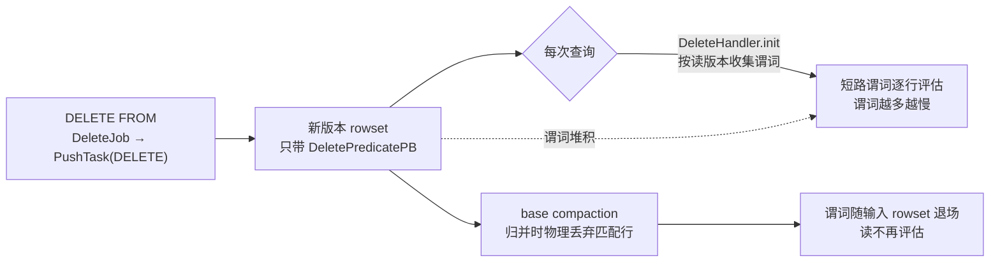
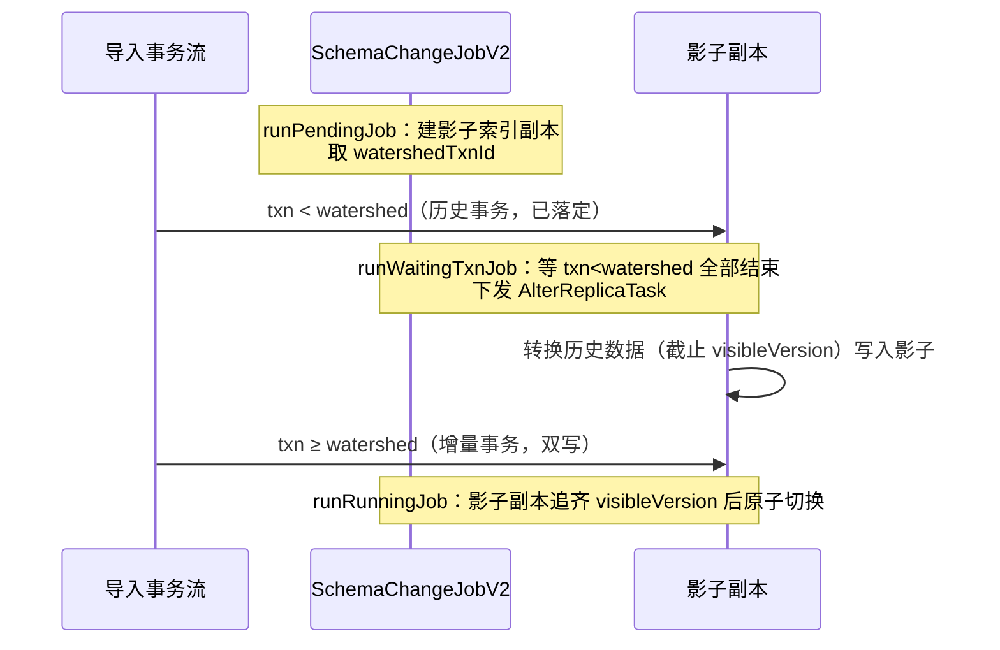

# 第 5 章：数据管理 —— Delete、Schema Change 与分区生命周期

> 基于写作时核实所用的 HEAD（`71bead772e`，源码树与系列基线 `7bc98f696f` 一致）。文中所有 `路径:行号` 均在该版本核实；跨部分回引均已 grep 目标文件确认内容真实存在。

[上一章](04-mow-internals.md) 收完了 delete bitmap 的一生：主键表把"删除/覆盖"这件事变成了写侧的 bitmap 标记，读侧在段内做一次差集。但 delete bitmap 只是"删"的一种。本章把视角抬高一层，回答一个更本质的问题：**Doris 的数据文件（Segment）一旦落盘就不可变（immutable），可业务偏偏要在上面做删除、改表结构、增删分区这些"可变"操作——它是怎么在不改动已有文件的前提下做到的？**

三件事——DELETE、Schema Change、分区生命周期——表面上八竿子打不着，底层却共用同一套地基：**版本机制**（[part1 第 3 章](../part1-architecture/03-data-model.md) §3.3）。看懂它们如何各自"绕开不可变"，你就拿到了排查"DELETE 后越查越慢""改列类型的 job 卡住""动态分区没按预期滚动/误删"这三类线上问题的钥匙。

## 5.1 问题：不可变文件上做可变操作

**遇到了什么问题？** Segment 是列存的不可变文件——一旦写完就只读，靠这一点才能无锁并发读、才能安全地被多个版本区间共享、才能被硬链接零拷贝复用。可业务的需求全是"可变"的：删掉符合条件的一批行、给表加一列或改列类型、把两年前的冷分区清掉。**如果允许就地改文件**，不可变的所有好处（并发读安全、版本共享、硬链接复用）立刻崩塌；**如果每次改动都重写整表**，代价又高到不可接受。三件事各自要在这两个极端之间找落点。

**候选方案与权衡——逐件看：**

- **删除。** 候选一，就地删——违背不可变，直接否掉。候选二，标记删——不动老文件，另记一份"哪些行已删"的信息，读时把它减掉。Doris 走候选二，而且**分成两种标记**，分工清晰：普通模型（Duplicate/Aggregate/非 MoW Unique）的 `DELETE FROM` 写一条**delete 谓词**（delete predicate）进一个新版本的 rowset 元数据，读时把谓词当过滤条件评估；主键 MoW 表则走 [第 4 章](04-mow-internals.md) 的 **delete bitmap** 路径，直接标记被删/被覆盖的物理行号。前者是"条件式标记"（省写、费读），后者是"行级标记"（费写、省读）——正是 MoR 与 MoW 那笔账在删除上的翻版。

- **改表结构。** 候选一，停写重建——改期间不能导入，可用性归零。候选二，影子表双写转换——建一份新 schema 的"影子"副本，历史数据后台转换，改期间的新导入同时写新老两份，转完切换。候选三，元数据级轻量变更——如果改动**根本不需要动数据文件**（比如加一个带默认值的列、删一列），那连转换都省了，只改元数据。Doris 三档都有：能轻量就 **light schema change**（秒级），非动数据不可就上 **SchemaChangeJobV2** 的影子双写。

- **分区生命周期。** 候选一，手动 `ADD/DROP PARTITION`——精确但要人盯着。候选二，自动滚动——按时间规则自动建新分区、回收旧分区（**动态分区**）；再叠一层**冷热分层**（cooldown），把不再热的分区数据下沉到对象存储省钱。Doris 两者都提供。

**Doris 最终怎么解决的？** 三件事共用同一个底色——**版本机制**。删除是"加一个带 delete 标记的新版本"；schema change 是"影子副本追齐到某个版本后原子切换";分区滚动是"在分区维度增删 Tablet 集合，每个 Tablet 内部仍按版本演进"。不可变文件从不被改写，所有"可变"都被翻译成"在版本轴上追加或切换"。这就是本章要逐一走读的三条路径。

## 5.2 源码走读：两种删除

### DELETE FROM：谓词删除的一生

普通模型的 `DELETE FROM t WHERE ...` 不真的去删任何一行。FE 侧 `DeleteJob`（`fe/fe-core/src/main/java/org/apache/doris/load/DeleteJob.java:93`）把 `WHERE` 条件解析成一组 `deleteConditions`（`fe/fe-core/src/main/java/org/apache/doris/load/DeleteJob.java:126`），然后对每个目标 Tablet 下发一个 `PushTask`，类型是 `TPushType.DELETE`（`fe/fe-core/src/main/java/org/apache/doris/load/DeleteJob.java:354`），并像普通导入一样走事务提交（`fe/fe-core/src/main/java/org/apache/doris/load/DeleteJob.java:446` 的 `DeleteJob` 的 `commit()` → `commitAndPublishTransaction`）。

BE 收到 DELETE 类型的 push，产出的是一个**几乎不含数据、只带 delete 谓词的新版本 rowset**——谓词序列化成 `DeletePredicatePB` 存进该 rowset 的元数据（`be/src/storage/rowset/rowset_meta.h:211` 的 `has_delete_predicate()`、`:213` 的 `delete_predicate()`）。转换 `TCondition` → `DeletePredicatePB` 的逻辑在 `DeleteHandler` 的 `generate_delete_predicate()`（`be/src/storage/delete/delete_handler.h:68`）。到此，一次 DELETE 就是**版本轴上多了一个"从这个版本起，满足条件的行视为已删"的标记**——老 Segment 一个字节没动。

**读时怎么把删掉的行减掉？** 这一步接的是 [第 3 章](03-read-path.md) 的读路径。`TabletReader` 初始化时调 `_init_delete_condition`（`be/src/storage/tablet/tablet_reader.cpp:538`），把读版本以内所有带 delete 谓词的 rowset 元数据喂给 `DeleteHandler` 的 `init()`（`be/src/storage/delete/delete_handler.cpp:556`）——注意 `init()` 里会**跳过版本比当前读版本大的谓词**（`be/src/storage/delete/delete_handler.cpp:562`-`:563`），这就是"删除按版本顺序生效"的落点。随后 `get_delete_conditions_after_version()`（`be/src/storage/delete/delete_handler.cpp:628`）把这些谓词转成 `AndBlockColumnPredicate`，注入 reader context（`be/src/storage/tablet/tablet_reader.cpp:90`、`:192`）。

再往下，就是第 3 章那段"最容易读错"的归属：delete 条件涉及的列会被塞进**短路谓词列集合**并标记为谓词列（[part5 第 3 章](03-read-path.md) §3.3 已详解），跟着谓词列一起"先读"、逐行求值。**关键结论就藏在这里：delete 谓词是在每一次扫描里被重新评估的**——它不是一次性物化成某种索引，而是作为一组列谓词，每次读都要在幸存行上跑一遍。

**tricky 点：为什么大范围 / 高频 DELETE 会拖慢读，以及谓词何时被"物化掉"。** 把上面两点连起来：每发一条 `DELETE FROM`，版本轴上就多一个 delete 谓词；而每一次查询都要把**读版本以内所有 delete 谓词**收集起来、逐个评估。谓词越多、条件越复杂，短路求值这一步的逐行开销就越大——这就是"连发几十条 DELETE 后查询明显变慢"的机理（5.6 会实测它）。

那这些谓词什么时候不再拖累读？答案是 **compaction 把它们物化掉**——但要分清是哪一层 compaction。回到 [part3 第 6 章](../part3-load-lifecycle/06-compaction.md) §6.2 讲过的"delete 版本是硬边界"：cumulative compaction 遇到带 delete predicate 的 rowset 会在它之前截断、不跨 delete 乱合，把真正应用删除的活留给 base compaction。核实执行侧代码印证了这条边界——`CompactionMixin` 的 `handle_ordered_data_compaction()`（`be/src/storage/compaction/compaction.cpp:539`，判定见 `:592`-`:602`）里，只要是 base compaction、或开了 `enable_delete_when_cumu_compaction` 的 cumu compaction，一旦输入 rowset 带 delete predicate 就**返回 false、不走"有序数据快速合并"（link files）的捷径**，而是老老实实归并——归并时满足谓词的行被**物理丢弃**，之后再读就不必评估这条谓词了。这里有个 tricky 的默认值：`enable_delete_when_cumu_compaction` 默认是 **`false`**（`be/src/common/config.cpp:1342`，`DEFINE_mBool` 可热改），也就是说**默认情况下 cumu compaction 不应用 delete、谓词要一路等到 base compaction 才被物化**。

还有一处容易忽略的收尾逻辑：`Compaction::set_delete_predicate_for_output_rowset`（`be/src/storage/compaction/compaction.cpp:367`）。当输出版本起点 > 2 且允许 cumu 删除（或索引变更 compaction）时，它会把输入 rowset 的 delete 谓词 **MergeFrom 累加进输出 rowset**（`:375`-`:386`）——这是为了"让版本低于输出版本的数据在将来的 base compaction 里仍能被删除"，保证谓词不因中途合并而丢失。**错写会怎样？** 如果这里漏了累加，某次 cumu 合并会把一条 delete 谓词"吃掉"却没实际删数据，被删的行在后续 base compaction 时因为找不到谓词而"复活"——数据正确性直接破功。

一图收束普通模型 delete 谓词的一生——写侧只加标记、读侧反复评估、base compaction 才真正物化：



### 主键表的 DELETE：写 delete 行

主键 MoW 表的删除不走 delete 谓词，而是走 [第 4 章](04-mow-internals.md) 的 delete bitmap 路径：删除等价于写一批"删除标记行"，在对应物理行号上置位 bitmap，读时段内做差集。机理第 4 章已讲透，这里只需记住分工：**普通模型删除 = 版本轴上的条件式谓词（省写费读）；MoW 删除 = 行级 bitmap 标记（费写省读）**。

**易错点：把 DELETE 当高频操作用。** 无论哪种模型，`DELETE FROM` 都不是为高频设计的。普通模型下它堆积 delete 谓词、拖慢每一次读，直到 compaction 才缓解；MoW 下它膨胀 delete bitmap、加重写放大。**正确姿势**：需要"按条件频繁删旧数据"时，优先用**分区裁剪**（`DROP PARTITION` 或动态分区自动回收，见 5.4）——直接丢掉整个分区的 Tablet，代价是 O(1) 的元数据操作，远比谓词删除便宜；需要"行级 upsert/删除"时用主键表的批量导入而非频繁 `DELETE FROM`。把 `DELETE FROM` 留给低频、一次性的数据订正。

## 5.3 源码走读：Schema Change 三档

Schema Change 的判定横跨 FE 和 BE，且**先在 FE 判能不能轻量、不能才落到 BE 判用哪种转换**。分两层看。

### light schema change：纯元数据变更，跳过 BE

FE 侧 `SchemaChangeHandler`（`fe/fe-core/src/main/java/org/apache/doris/alter/SchemaChangeHandler.java`）在处理每个 alter 子句时，先问一句"这张表开了 light schema change 吗"——`olapTable` 的 `getEnableLightSchemaChange()`（如 `fe/fe-core/src/main/java/org/apache/doris/alter/SchemaChangeHandler.java:621`、`:1337`）。加列/删列这类**不需要改动已有数据文件**的变更，若表支持轻量变更，就走 `modifyTableLightSchemaChange`（`fe/fe-core/src/main/java/org/apache/doris/alter/SchemaChangeHandler.java:3454`）：它**不建影子副本、不下发任何 BE 转换任务**，只做元数据层面的事——`updateBaseIndexSchema`（`fe/fe-core/src/main/java/org/apache/doris/alter/SchemaChangeHandler.java:3697`）把新列并进 index 的 schema、维护每列的 **unique id**（`:3717`-`:3723` 的 `maxColUniqueId` 递增）、把 schema version +1（`:3494`-`:3495`），写一条 edit log 就完事。为了兼容展示，它还是会造一个"已完成态"的 `SchemaChangeJobV2`（`:3485`），但这个 job 没有任何数据转换阶段。

**为什么能跳过 BE？关键在列的 unique id。** 每列有一个全表唯一、永不复用的 unique id，Segment 里的列数据是按 unique id 定位的（不是按列在 schema 里的序号）。加一列，只是在元数据里登记"未来有个新 unique id 的列，老数据里没有它、读时用默认值补"；删一列，只是把某个 unique id 从 schema 摘掉、老 Segment 里那段列数据变成无人引用的死数据（等 compaction 自然淘汰）。**老 Segment 一个字节不用改**，所以秒级完成。更深一层，这也解释了为什么加/删列后新老 Segment 能被同一次查询正确读取：读路径按 unique id 而非序号取列，某个 Segment 没有新列的数据时就用 schema 里登记的默认值补齐，老列即便被逻辑删除、其字节仍安静躺在老 Segment 里直到 compaction 淘汰——schema version 只用来标记"这份数据是哪一代 schema 写的"，并不强制立即重写。这条快路的门槛（表要开 `enableLightSchemaChange`）在 [part3 第 2 章](../part3-load-lifecycle/02-stream-load-path.md) §2.3 出现过——那里讲的是 `useSchemaLightChange` 同时门控着 Stream Load 走不走 memtable-on-sink 的 v2 路径，可见"表是否开轻量变更"这个属性的影响面远不止 DDL。

### 需要动数据时：SchemaChangeJobV2 的影子双写

改列类型、改 key、加 bitmap 索引这类**必须重写数据**的变更，落到 `SchemaChangeJobV2`（`fe/fe-core/src/main/java/org/apache/doris/alter/SchemaChangeJobV2.java`）。它的核心是一套"影子索引 + 双写 + 水位线（watershed）"的编排，分三个状态推进：

1. **`runPendingJob`（`:426`）**：为每个分区创建**影子索引**的全部副本（`createShadowIndexReplica`），影子索引对用户不可见、但导入流程会往它写数据。副本建好后取一个**水位事务 id**——`this.watershedTxnId = ...getNextTransactionId()`（`:438`），状态转入 `WAITING_TXN`。

2. **`runWaitingTxnJob`（`:484`）**：等所有**事务 id 小于 watershedTxnId 的导入**全部结束（`checkFailedPreviousLoadAndAbort`，`:487`）。等齐后，向 BE 下发 `AlterReplicaTask`（`:580`），让 BE 把历史数据（截止到分区的 `visibleVersion`，`:526`）转换成新 schema 写进影子副本。状态转入 `RUNNING`。

3. **`runRunningJob`（`:616`）**：轮询影子副本是否已追齐 `visibleVersion`——`replica` 的 `checkVersionCatchUp()`（`:706`）。追齐后原子地把影子索引切换成正式索引，job 完成。

用一张时间轴看清 watershed 怎么把"历史"和"增量"缝在一起：



**tricky 点：SC 期间导入的双写与版本对齐——watershed 到底保证了什么。** 这是最容易产生"数据丢失窗口"焦虑（或误报）的地方，务必想清楚。水位线把所有导入事务切成两半：

- **watershedTxnId 之前的事务**：由第 2 步的 `AlterReplicaTask` 负责——BE 把这些事务已经落定的历史数据一次性转换进影子副本。
- **watershedTxnId 及之后的事务**：因为影子索引在 `runPendingJob` 里已经被加进 catalog（`addShadowIndexToCatalog`，`:447`），导入流程会**自动同时往影子索引写一份**（双写）。

两段严丝合缝地拼接：历史靠转换、增量靠双写，**既不重不漏**。所以"SC 期间导入会不会丢""切换瞬间新数据会不会没转过去"这类担忧是**误报**——只要 watershed 前的事务等齐、影子副本追齐了 visibleVersion，切换时新老索引在版本轴上是对齐的。真正的风险不在正确性，而在**资源与时长**：转换是逐行重写，历史数据越多越慢；双写让 SC 期间的导入额外写一份、吃更多 IO。理解这一点，才能正确判断"SC 卡在 RUNNING"到底是死了还是在正常追版本（5.7 会给判据）。

### BE 侧的三档转换：LINKED / DIRECT / SORTED

BE 收到 `AlterReplicaTask` 后，`SchemaChangeJob`（`be/src/storage/schema_change/schema_change.h:284`）要决定**用哪种方式转换**。判定逻辑全在 `SchemaChangeJob` 的 `parse_request()`（`be/src/storage/schema_change/schema_change.cpp:1381`），它算出两个布尔量 `sc_sorting` 和 `sc_directly`，再由 `_get_sc_procedure()`（`be/src/storage/schema_change/schema_change.h:297`）三选一：

```cpp
// be/src/storage/schema_change/schema_change.h:297-308（摘要）
if (sc_sorting) {
    return std::make_unique<VLocalSchemaChangeWithSorting>(...);  // SORTED：重排序
}
if (sc_directly) {
    return std::make_unique<VSchemaChangeDirectly>(...);          // DIRECT：逐行转换
}
return std::make_unique<LinkedSchemaChange>();                    // LINKED：硬链接零拷贝
```

三档从快到慢，判定是"能省则省"的短路序列（`be/src/storage/schema_change/schema_change.cpp:1450`-`:1553`）：

- **LINKED（`LinkedSchemaChange`，`be/src/storage/schema_change/schema_change.h:177`）** —— 最省。当既不需要重排序也不需要逐行转换时走这档。它的 `process()`（`be/src/storage/schema_change/schema_change.cpp:530`）调 `add_rowset_for_linked_schema_change`（`be/src/storage/rowset/beta_rowset_writer.cpp:872`），底层是 `link_files_to`（`be/src/storage/rowset/beta_rowset_writer.cpp:829`）——**对老 Segment 文件做硬链接、零数据拷贝**（MoW 表还会把 delete bitmap 一并 subset 复制到新 tablet，`:542`-`:555`）。适用于"数据布局完全不变、只是 schema 元数据换代"的场景。

- **DIRECT（`VSchemaChangeDirectly`，`be/src/storage/schema_change/schema_change.h:191`）** —— 逐行读出、按列映射转换、逐行写入，行的相对顺序不变。触发它的典型条件（`parse_request` 里逐个 `*sc_directly = true`）：short key 列数变了（`:1502`）、存在 delete 条件（`:1508`，谓词删除会挡住 LINKED）、有列表达式/物化转换（`:1526`）、索引发生变化（`:1531`）、或输入 rowset 在远端存储（`:1546`，冷数据不能硬链接）。**改列类型**就落在这一档——类型变了必须逐行重新编码。

- **SORTED（`VLocalSchemaChangeWithSorting`，`be/src/storage/schema_change/schema_change.h:242`）** —— 最重。当 key 的顺序/组成变了、数据必须**重新全局排序**时走这档：key 列引用顺序错位（`:1462`-`:1463`）、keys type 改变（`:1468`）、聚合表 key 列数减少需要重新聚合（`:1482`-`:1487`）。它要 internal sorting + external sorting，代价最高。

**易错点：以为所有 SC 都轻量——代价预估。** 很多人以为"改个表结构而已"，一发 `ALTER TABLE ... MODIFY COLUMN` 却发现 job 跑了几小时。判据就在上面：**只有能走 light schema change（加/删列且表开了轻量变更）才是秒级的元数据操作**；一旦落到 `SchemaChangeJobV2`，就至少是 DIRECT 的逐行重写，改 key/keys type 更是 SORTED 的全量重排序。发这类 DDL 前，按上面的判定条件预估会命中哪一档、数据量多大，再决定是否在业务低峰执行。

## 5.4 源码走读：分区生命周期与冷热分层

### 动态分区：自动滚动创建与回收

按天/周/月分区的表，如果靠人手动 `ADD PARTITION`，迟早会漏。**动态分区**（dynamic partition）由 FE 的 `DynamicPartitionScheduler`（`fe/fe-core/src/main/java/org/apache/doris/clone/DynamicPartitionScheduler.java:91`，一个 `MasterDaemon`）周期性驱动，核心是 `executeDynamicPartition`。参数定义在 `DynamicPartitionProperty`（`fe/fe-core/src/main/java/org/apache/doris/catalog/DynamicPartitionProperty.java`），核实真实语义与默认值如下：

键名均以 `dynamic_partition.` 为前缀，常量定义在 `fe/fe-core/src/main/java/org/apache/doris/catalog/DynamicPartitionProperty.java`：

| 参数（键名去前缀） | 常量（同文件行号） | 语义 | 默认 |
|---|---|---|---|
| `start` | `START`（`:41`） | 保留区间的起点偏移（负数=过去 N 个周期），**同时是回收边界** | `MIN_START_OFFSET` = `Integer.MIN_VALUE`（`:63`），即**不设=不删** |
| `end` | `END`（`:42`） | 向未来预建到第几个周期 | 无默认，必填 |
| `buckets` | `BUCKETS`（`:44`） | 新建分区的分桶数 | 缺省回落到表的分桶数（`fe/fe-core/src/main/java/org/apache/doris/common/util/DynamicPartitionUtil.java:498`-`:500`） |
| `create_history_partition` | `CREATE_HISTORY_PARTITION`（`:51`） | 首次是否补建历史分区 | `false`（`DynamicPartitionUtil` 的 `analyzeDynamicPartition()`，同文件 `:507`） |
| `history_partition_num` | `HISTORY_PARTITION_NUM`（`:52`） | 补建历史分区的数量上限 | 见 `getRealStart` 逻辑 |

**创建**：`executeDynamicPartition`（`fe/fe-core/src/main/java/org/apache/doris/clone/DynamicPartitionScheduler.java:280` 起）从 `idx`（受 `create_history_partition` / `history_partition_num` 影响，`:285`-`:290`）循环到 `end`（`:300`），为每个还不存在的区间构造 `AddPartitionClause`；区间已存在就跳过（`:348`-`:350`）。

**回收**：`getDropPartitionOpForDynamic`（`fe/fe-core/src/main/java/org/apache/doris/clone/DynamicPartitionScheduler.java:510`）按 `start` 算出保留下界，把**早于该下界的分区**生成 `DropPartitionOp`。这里有一处至关重要的安全设计：**若 `start` 没设（等于 `MIN_START_OFFSET`），直接 return、一个分区都不删**（`:515`-`:518`）。

**易错点：动态分区参数配错导致分区风暴或误删——真实语义。** 两个方向都能踩：

- **分区风暴（建太多）**：`end` 设得过大、或 `create_history_partition=true` 配上过大的 `history_partition_num`，一次就要建成百上千个分区。FE 有护栏——`max_dynamic_partition_num`（`fe/fe-common/src/main/java/org/apache/doris/common/Config.java:1612`，默认 **20000**，`@ConfField(mutable = true, masterOnly = true)`）在 `DynamicPartitionUtil`（`:648`）处校验，超限报错并提示"Consider increasing max_dynamic_partition_num"。看到这个错，是参数配得太激进，不是护栏太小——先想清楚真需要这么多分区吗。

- **误删（删太狠）**：`start` 是把双刃剑。它既是保留下界也是**回收边界**——设 `start=-3`（保留最近 3 天）意味着调度器每天会自动 `DROP` 掉第 4 天前的分区。若误把一张存着历史数据的表设了个不该有的 `start`，下一个调度周期就会静默删掉老分区。**记住默认语义：不设 `start` 就永不删**（`:515`）；只有你明确想让旧分区自动回收时才设它，且设之前确认没有查询还依赖那些分区。相关开关 `dynamic_partition_enable`（`fe/fe-common/src/main/java/org/apache/doris/common/Config.java:1307`，默认 `true`，`mutable`）是全局总闸，`dynamic_partition_check_interval_seconds`（`:1293`，默认 600s，`mutable`）控制调度频率。

### 冷热分层（cooldown）：本地盘 → 对象存储

分区老了但还偶尔要查，删掉太可惜、留在贵盘上又浪费——**cooldown** 把这类冷数据下沉到对象存储。它是**存算一体的一个补丁**（[part1 第 4 章](../part1-architecture/04-two-architectures.md) §4.2 把它和存算分离的取舍讲得很透：cooldown 只砍"冷数据占贵盘"这一维、改造面小、存算一体打开关就能用；而存算分离是另起炉灶的重构，两者同时存在、互不替代）。

诚实交代边界：cooldown 相关代码**当前确实存在**，分布在几处（都在本 HEAD 核实）：

- **配置载体 `StoragePolicy`（`be/src/storage/storage_policy.h:40`）**：一个存储策略结构，字段有 `cooldown_datetime`（到期时间点下沉）、`cooldown_ttl`（相对存活时长后下沉）、`resource_id`（下沉到哪个远端资源）。`get_storage_policy`（`:57`）/`put_storage_policy`（`:60`）维护策略缓存。
- **下沉动作在 `Tablet`（`be/src/storage/tablet/tablet.cpp`）**：`Tablet` 的 `cooldown()`（`:2333`）是入口，真正搬数据的是 `_cooldown_data()`（`:2377`）——它按 `get_resource_by_storage_policy_id` 拿到远端存储资源（`:2380`）、把 rowset 写到对象存储；搬完由 `write_cooldown_meta()`（`:2521`）落一份"冷却元数据"到远端。哪个副本负责 cooldown 由 FE 下推的 `_cooldown_conf`（`cooldown_replica_id` / `term`）决定（`:2352`、`:2503` 的 `update_cooldown_conf`），保证同一 Tablet 只有一个副本执行下沉、不重复搬。
- **冷数据自己的 compaction 在 `ColdDataCompaction`（`be/src/storage/compaction/cold_data_compaction.h:28`）**：冷数据下沉到对象存储后仍需合并，但不能让它抢本地 compaction 的资源，于是单独一档。`prepare_compact`（`.cpp:54`）/`execute_compact`（`.cpp:61`）执行前先确认本副本是 cooldown 副本（`.cpp:68`-`:70`），线程数与频率由 `cold_data_compaction_thread_num`（`be/src/common/config.cpp:1083`，默认 2）和 `cold_data_compaction_interval_sec`（`:1084`，默认 1800s，`DEFINE_mInt32` 可热改）控制；生成 cooldown 任务的节奏另由 `generate_cooldown_task_interval_sec`（`:1080`，默认 20s，`DEFINE_mInt64` 可热改）控制。

**与存算分离的关系**：cooldown 是"存算一体下把冷分区搬去对象存储"，数据仍归 BE 管、热数据仍是本地 3 副本；存算分离则是数据**全部**在对象存储、BE 近乎无状态——后者天然就是"全冷全分层"，不需要 cooldown 这个补丁。这正是 §5.5 要点明的双模式分野。

## 5.5 双模式对比

**delete 与 schema change 的逻辑两模式一致。** delete 谓词入 rowset meta、读时评估、compaction 物化；light schema change 改元数据、`SchemaChangeJobV2` 影子双写、BE 三档转换——这些机制在存算一体和存算分离下**代码路径相同、数据文件字节相同**。差异集中在与前面各章一致的两处：元数据存哪（存算分离下 Tablet 元数据在 MetaService），以及并发协调靠什么（导入/compaction/SC 在存算分离下都要向 MetaService 申请租约或锁，见 [第 4 章](04-mow-internals.md) §4.4 与 [part3 第 6 章](../part3-load-lifecycle/06-compaction.md) §6.4）。SC 的影子索引在存算分离下同样成立，只是影子副本的元数据登记在 MetaService、数据落对象存储；watershed 双写的**逻辑不变**。

**冷热分层是存算一体专属。** cooldown（§5.4）是给"数据归 BE 管、热数据本地 3 副本"的存算一体打的补丁；存算分离下数据本就全在对象存储、BE 近乎无状态，**天然分层、不需要 cooldown**。这条差异的取舍分析见 [part1 第 4 章](../part1-architecture/04-two-architectures.md) §4.2（候选 a vs 候选 b：两者同时存在、定位不同）。

## 5.6 动手实验

实验环境（单机编译部署、建表灌数）沿用 [part1 第 5 章](../part1-architecture/05-source-map-and-dev-env.md)。本实验两个目的：一是验证核心点——**加列（light SC，秒级）与改列类型（全量转换 job）的 job 形态与耗时差异**；二是主动踩易错点——**连发几十条 DELETE 谓词删除后查询变慢，再手动 compaction 观察恢复**，把"谓词堆积"亲手踩一遍。

### 核心点：light SC vs 全量转换

建一张普通模型表灌入足量数据（比如几百万行），然后对比两类 DDL。

**加列——观察 light SC 秒级完成：**

```sql
ALTER TABLE t_sc ADD COLUMN new_col INT DEFAULT "0";
SHOW ALTER TABLE COLUMN;   -- 立刻能看到一条 FINISHED 状态的 job
```

加带默认值的列若表支持轻量变更，会走 `modifyTableLightSchemaChange`（§5.3），几乎瞬间返回、`SHOW ALTER TABLE COLUMN`（由 `ShowAlterTableCommand` 支持）里直接是 FINISHED——因为它只改了元数据、没动任何 Segment。

**改列类型——观察全量转换 job 的进度：**

```sql
ALTER TABLE t_sc MODIFY COLUMN some_int_col BIGINT;
SHOW ALTER TABLE COLUMN;   -- 反复执行，看 State 从 PENDING → WAITING_TXN → RUNNING → FINISHED
```

改类型必然落到 `SchemaChangeJobV2` 的 DIRECT 逐行转换（§5.3）。反复 `SHOW ALTER TABLE COLUMN` 能看到 State 逐步推进，数据量大时 RUNNING 阶段会明显停留——这正是"影子副本追齐 visibleVersion"的过程。**把两条 DDL 的耗时和 job 形态放一起**：一条秒级 FINISHED、无数据转换；一条历经多状态、逐行重写。这就把 §5.3"能轻量则秒级、否则全量"的判定量成了盘上的数字。

### 易错点：谓词堆积拖慢读，compaction 恢复

建一张普通模型表（非 MoW）灌入基础数据，关掉自动 compaction 制造谓词堆积：

```sql
CREATE TABLE t_del (
    k BIGINT, v BIGINT
) DUPLICATE KEY(k)
DISTRIBUTED BY HASH(k) BUCKETS 1
PROPERTIES ("replication_num"="1", "disable_auto_compaction"="true");
-- 灌入基础数据后，连发几十条谓词删除，每条一个新版本
DELETE FROM t_del WHERE v = 1;
DELETE FROM t_del WHERE v = 2;
-- ... 重复几十次不同条件 ...
```

每发若干条 DELETE，就跑一次基准查询（如 `SELECT count(*), sum(v) FROM t_del`）并记下耗时。会看到**查询逐渐变慢**——每次扫描都要把这几十条 delete 谓词逐个评估（§5.2 的机理）。然后手动触发 compaction（命令与 [part3 第 6 章](../part3-load-lifecycle/06-compaction.md) §6.5 一致）：

```bash
curl -X POST 'http://<be_host>:<webserver_port>/api/compaction/run?tablet_id=<TID>&compact_type=base'
```

用 base compaction（谓词要到 base 才被物化，§5.2）。合并完再跑同一条基准查询：耗时**回落**——满足谓词的行已被物理丢弃、多余的 delete 谓词随输入 rowset 退场，扫描不必再逐条评估。对比 compaction 前后的查询延迟，"谓词堆积 → 读变慢 → compaction 物化 → 恢复"的闭环就被亲手量出来了。这也反向印证了 §5.2 的正确姿势：需要频繁按条件删数据时，该用分区回收而非谓词删除。

## 5.7 排查清单

| 症状 | 定位路径 |
|---|---|
| **Schema Change job 长时间卡在 RUNNING** | 先分清"卡死"还是"在正常追版本"（§5.3）。`SHOW ALTER TABLE COLUMN` 看 State 与进度；RUNNING 阶段是影子副本在追 `visibleVersion`（`fe/fe-core/src/main/java/org/apache/doris/alter/SchemaChangeJobV2.java:706` 的 `checkVersionCatchUp`），数据量大时慢是正常的。若长时间不动：① 看是不是卡在 WAITING_TXN——watershedTxnId 之前有导入事务迟迟不结束（同文件 `:487` 的 `checkFailedPreviousLoadAndAbort`），去查那批未决事务；② 看 BE 转换资源——DIRECT/SORTED 逐行重写吃 CPU/IO，SORTED（改 key/keys type，§5.3）尤其重，确认是否命中了比预期更重的档；③ 双写让 SC 期间导入额外写影子副本、加重 IO。判据是 State 是否在推进、visibleVersion 是否在被追上——在推进就是慢不是死。 |
| **DELETE FROM 后查询越来越慢** | 谓词堆积（§5.2）。普通模型每条 `DELETE FROM` 加一个 delete 谓词，每次扫描都要在短路谓词阶段逐条评估（[part5 第 3 章](03-read-path.md) §3.3）。确认：`SHOW TABLETS` 看版本数是否随 DELETE 猛涨；手动 `base` compaction 后查询恢复即坐实（§5.6）。注意默认 `enable_delete_when_cumu_compaction=false`（`be/src/common/config.cpp:1342`），谓词要等到 base compaction 才物化——cumu 跟得上也不会消除谓词。根治：改用分区回收替代高频谓词删除。 |
| **动态分区没按预期创建** | ① 全局总闸 `dynamic_partition_enable`（`fe/fe-common/src/main/java/org/apache/doris/common/Config.java:1307`）是否开；② `end` 是否设够（向未来预建到第几个周期，`fe/fe-core/src/main/java/org/apache/doris/clone/DynamicPartitionScheduler.java:300`）；③ 是否撞 `max_dynamic_partition_num`（`fe/fe-common/src/main/java/org/apache/doris/common/Config.java:1612`，默认 20000）护栏报错（§5.4，校验在 `fe/fe-core/src/main/java/org/apache/doris/common/util/DynamicPartitionUtil.java:648`）——超限是参数太激进；④ `dynamic_partition_check_interval_seconds`（`fe/fe-common/src/main/java/org/apache/doris/common/Config.java:1293`，默认 600s）决定调度周期，刚改完参数要等一个周期。FE 日志搜该表的 create/drop 失败记录（`recordCreatePartitionFailedMsg`）。 |
| **分区被动态分区误删** | 病根几乎总是 `start` 配错（§5.4）。`start` 既是保留下界也是回收边界——设了 `start` 就会自动 `DROP` 早于该下界的分区（`fe/fe-core/src/main/java/org/apache/doris/clone/DynamicPartitionScheduler.java:510` 的 `getDropPartitionOpForDynamic`）。**关键恢复窗口认知**：DROP PARTITION 有回收站保护（`RECOVER PARTITION`），发现误删应立即停止调度（`dynamic_partition_enable=false` 或改表属性）并尝试 RECOVER。预防：非必要不设 `start`——不设即永不删（同文件 `:515`-`:518`）；设之前确认无查询依赖旧分区。 |

---

至此，"不可变文件上的可变操作"这条主线走完了三条支路：**删除**被翻译成版本轴上的 delete 谓词（普通模型，读时评估、base compaction 物化）或 delete bitmap（主键表，第 4 章），谓词堆积是"DELETE 后变慢"的病灶；**schema change** 分三档落地——能只改元数据就走 light SC 秒级完成（靠列 unique id），非动数据不可就上 `SchemaChangeJobV2` 的影子双写（watershed 保证既不重不漏），BE 再按 LINKED/DIRECT/SORTED 择重转换；**分区生命周期**由动态分区自动滚动（`start` 是回收的双刃剑）叠加 cooldown 冷热分层（存算一体专属补丁）。三者共用版本机制这一底色，也各自把双模式差异收束到"元数据存哪、并发靠什么协调"这两点上。第五部分的存算一体侧到此完整；下一章转入分离模式专章，看这套存储引擎在对象存储 + File Cache 之上如何重新落地。
