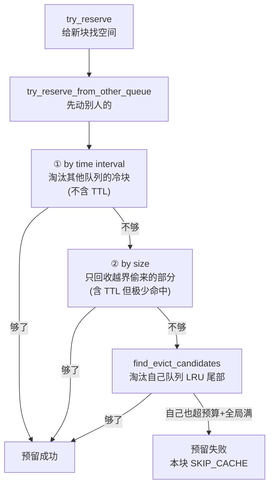
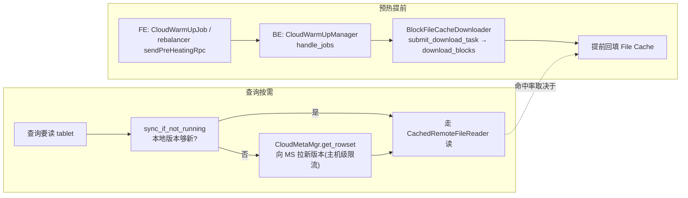

# 第 6 章：存算分离存储 —— File Cache 内核与对象存储交互

> 基于写作时核实所用的 HEAD（`3b339d6eb7`，源码树与系列基线 `7bc98f696f` 一致）。文中所有 `路径:行号` 均在该版本核实；跨部分回引均已 grep 目标文件确认内容真实存在。

[上一章](05-data-management.md) 收尾了存算一体侧："不可变文件上的可变操作"——删除、schema change、分区生命周期，全被翻译成版本轴上的追加或切换。本章转入**分离模式专章**，也是整个第五部分的收官。

前五章讲的存储格式与读逻辑（Segment 布局、索引、读路径、MoW、数据管理）在两种模式下**基本一致**——数据文件的字节排布相同，谓词下推、延迟物化、delete bitmap 的段内差集也相同。**双模式的差异集中收束在两处**：一是数据文件"落在哪、怎么读上来"（本章），二是元数据"存在哪、并发靠什么协调"（[part4 第 4 章](../part4-fe-internals/04-metaservice-fdb.md)）。本章只管前者：当数据文件躺在对象存储、本地只有一层 File Cache 时，这套存储引擎如何重新落地。

[part2 第 7 章](../part2-query-lifecycle/07-scan-path.md) §7.3 已经把 File Cache 的**使用面**讲透了：block 粒度（1MB 对齐）、四条 LRU 队列、四种块状态、一次 miss 读的回填路径、两道水位、以及"冷查询延迟周期性抖动"这个现象。本章不重复这些，而是从**内核实现层**回答那里悬而未决的"为什么"：队列容量到底能不能互相挪用、下载去重的并发原语究竟是什么、TTL 队列的语义边界在哪、对象存储写入的分片上传怎么组织、半途失败的孤儿分片谁来收。读懂这些，你才能在"命中率突降""对象存储费用异常""429 限流雪崩"这三类分离模式特有的线上问题面前找得到根。

## 6.1 问题：对象存储的物理现实

**遇到了什么问题？** 分离模式把 tablet 的数据文件从本地磁盘搬到了对象存储（S3/OSS/COS/Azure Blob）。对象存储带来近乎无限的容量、按量计费的成本、以及天然的持久性——但它有三条与本地盘截然不同的物理现实：

- **延迟高一到两个数量级。** 本地 NVMe 一次读几十微秒到几毫秒；对象存储一次 GET 是几十到几百毫秒（要走 HTTP、经过网关、跨可用区），而且尾延迟抖动大。
- **按请求计费。** 每一次 GET/PUT/LIST 都单独收费。一次查询若把大文件拆成成千上万个小请求，费用和延迟会同时爆炸。
- **对象不可变、接口是"整对象"语义。** 对象存储没有"改文件某几个字节"这回事，只有整对象 PUT / 分片上传 / 整对象 GET（带 Range 的 GET 也只是读取，不能原地改）。

**候选方案与权衡。** 要在这样的介质上撑起交互式分析，有三条路：

- **候选一，直读对象存储。** 每次扫描都实时去 S3 拉数据。实现最简单、本地零状态，但每个 page、每段索引都变成一次几十毫秒的远端请求——交互式查询的延迟直接不可接受，费用也失控。
- **候选二，全量本地副本。** 把对象存储上的数据完整拉一份到本地盘再查。延迟回到本地水平，但这等于退回了存算一体——本地盘要装下全量数据，"存算分离"省下的存储成本荡然无存，扩缩容还要搬全量数据。
- **候选三，块级缓存 + 异步预热 + 请求合并。** 本地只留一层**按需填充的块缓存**：查询读到的 1MB 块留在本地，没读到的不占地方；跨块的 miss 合并成一次连续远端读摊薄请求数；再叠一个异步预热，在查询到来前把热数据提前灌进缓存。

**Doris 怎么解决的？** 走候选三——这正是 File Cache 的全部设计动机。它用**块粒度**回避了全量副本的浪费（只缓存真正读过的片段），用**请求合并**回避了直读的费用爆炸（把相邻 miss 块拼成一次 GET），用**异步预热**回避了冷启动塌陷（迁移/扩容前先暖 cache）。

而 File Cache 内部的三个子问题，part2 第 7 章给过**使用面**的答案，本章要从**实现层**回答"为什么这么设计"：

- **粒度——为什么按块不按文件？** part2 §7.3 讲了 1MB block 对齐；本章要看这个粒度如何决定了缓存的最小管理单元和淘汰单元。
- **分类——为什么分四条队列而不是一条 LRU？** part2 §7.3 讲了 DISPOSABLE/NORMAL/INDEX/TTL 各管一摊；本章要看队列之间**容量能不能互相挪用**、挪用的机制是什么。
- **淘汰——满了谁先走？** part2 §7.3 讲了两道水位；本章要看淘汰时**先淘汰谁的、按什么顺序**，以及那个"周期性抖动"在代码里的确切触发点。

## 6.2 源码走读：BlockFileCache 内核

`BlockFileCache`（`be/src/io/cache/block_file_cache.h:166`）是每个 cache 目录一个实例的核心类。四条队列是它的成员——`_disposable_queue`、`_normal_queue`、`_index_queue`、`_ttl_queue`（`be/src/io/cache/block_file_cache.h:553`~`:556`）。part2 §7.3 已经交代了这四条队列的分工和默认容量比例（`NORMAL` 40%、`TTL` 50%、`INDEX` 5%、`DISPOSABLE` 5%，见 `be/src/io/cache/file_cache_common.h:32`~`:35`）。这里从"给一个块找地方放"这件事切进去，看内核真正干了什么。

### tricky 点一：队列容量是"软预算"，队列之间会互相借还

第一个容易想当然的地方：那四个百分比是**硬隔离**吗——NORMAL 只能用 40%、用满就淘汰自己的？**不是。** 那四个百分比是每条队列的 `max_size`（软预算），但一条队列**可以超出自己的预算去占用别的队列没用满的空间**，全局总量只受 `_capacity` 约束。这套"借还"逻辑是 part2 §7.3 完全没展开、而对理解淘汰行为至关重要的一段。

入口是 `try_reserve()`（`be/src/io/cache/block_file_cache.cpp:1144`）——给一个待缓存的块预留空间。它最终落到 `try_reserve_for_lru()`（`:1472`），而后者的第一步**不是**淘汰自己队列的，而是先调 `try_reserve_from_other_queue()`（`:1448`）去别的队列腾。这个顺序本身就是设计意图：**优先牺牲别人的冷数据，而不是先淘汰自己**。

`try_reserve_from_other_queue()` 分两级策略：

1. **按冷热借（by time interval）**：`try_reserve_from_other_queue_by_time_interval()`（`:1361`）遍历其他队列，只淘汰那些 `atime + hot_data_interval < cur_time` 的块——即**已经过了热数据窗口的冷块**。热块一律不碰。这一级的候选队列由 `get_other_cache_type_without_ttl()`（`:1298`）给出，**刻意不含 TTL**——也就是说，从别的队列借空间时，默认永远不会去动 TTL 的数据（TTL 的语义见下）。
2. **按越界量借（by size）**：如果第一级还不够、且 `file_cache_enable_evict_from_other_queue_by_size`（`be/src/common/config.cpp:1216`，默认 `true`，可热改）开着，就走 `try_reserve_from_other_queue_by_size()`（`:1419`）。它的关键约束写在注释里——"we will not drain each of them to the bottom -- i.e., we only evict what they have stolen"：只对那些**当前占用已经超过自己 max_size 的队列**下手（`:1428`~`:1430` 判 `cur_queue_size <= cur_queue_max_size` 就跳过），而且**只回收它们越界偷来的那部分**，不会把一条守规矩的队列抽干。这一级的候选队列由 `get_other_cache_type()`（`:1315`）给出，**这次包含 TTL**——但因为只回收越界部分，而 TTL 默认预算高达 50%、极少越界，所以 TTL 实际上依然被强保护。

两级都不够，才回到 `try_reserve_for_lru()` 里淘汰**自己队列**的 LRU 尾部（`find_evict_candidates`）。还有一道自我软限：`try_reserve_from_other_queue()` 里若 `_cur_cache_size + size > _capacity && cur_queue_size + size > cur_queue_max_size`（`:1465`）——即全局满了、而且自己也已经用超预算——就直接放弃向别人借，返回失败。

**每种类型借空间的优先级还是有讲究的。** `get_other_cache_type_without_ttl()`（`:1298`）为每种类型定制了牺牲顺序：DISPOSABLE 需要空间时找 `{NORMAL, INDEX}`；INDEX 需要空间时找 `{DISPOSABLE, NORMAL}`；NORMAL 找 `{DISPOSABLE, INDEX}`。规律是——**DISPOSABLE（一次性数据）几乎总是第一个被牺牲，INDEX（高复用索引）总被排到最后**。这就把"分四条队列"的意图落到了实处：不是四块地盘各扫门前雪，而是**有优先级的弹性共享**——空闲时互相借用把容量用满，紧张时按"复用价值"决定谁先退场。

**错写会怎样？** 若把这套借还改成硬隔离（用满自己预算就淘汰自己），后果是双向的浪费：一个只跑大扫描、几乎不产生 INDEX/DISPOSABLE 的负载，会让那 10% 的 INDEX+DISPOSABLE 预算长期闲置、NORMAL 却在 40% 上频繁淘汰抖动——明明有空位却用不上。反过来，若借还不设"只回收越界部分"的约束、允许抽干别的队列，一次大扫描就能把 INDEX 队列彻底榨干，回到 part2 §7.3 警告的"索引缓存被冲光、之后所有查询重读索引"的灾难。当前实现是在两者之间取的平衡：**能借则借、但不抽干、且按复用价值定序**。

用一张图收束一次预留空间的决策链：

### tricky 点二：下载去重不是无锁 CAS，而是 mutex 下的 downloader 认领

part2 §7.3 提过 `get_or_set_downloader()` 用来防止多个 scanner 重复下载同一个 EMPTY 块，并笼统称之为"CAS"。核实实现（`be/src/io/cache/file_block.cpp:78`）可以把这句话说得更准确：它**不是一条无锁 CAS 指令，而是在每个块自己的 mutex 保护下做的一次"认领"**。函数一进来就 `std::lock_guard block_lock(_mutex)`，然后判断——若 `_downloader_id == 0 && _download_state != DOWNLOADED`，就把当前 caller id 记为 `_downloader_id`、状态置 `DOWNLOADING`；否则（已有 downloader 或已下载）就返回现有的 `_downloader_id`。抢到的线程去远端下载并回填，没抢到的线程看到返回的 downloader id 不是自己，就去等（part2 §7.3 讲的 `WaitOtherDownloaderTimer` 记这段等待）。

这个"认领"必须和失败回滚配套，否则一次下载失败就会永久锁死这个块。回滚在 `reset_downloader_impl()`（`be/src/io/cache/file_block.cpp:101`）：若已下载字节数正好等于块大小，就转成 `DOWNLOADED`；否则把 `_downloaded_size` 清零、状态退回 `EMPTY`、`_downloader_id` 归零——**块重新变回"无主可认领"**，下一个读到它的线程可以再抢一次。

**错写会怎样？** 若认领和状态判断不在同一把锁下（比如先读状态、再单独加锁改），两个线程可能都读到 EMPTY、都认为自己抢到了 downloader，于是**同一个块被下两遍、同时往同一个 cache 文件写**——轻则重复 S3 流量和费用，重则写冲突损坏缓存文件。若下载失败后忘了 `reset_downloader_impl` 把状态退回 EMPTY，这个块就永远停在 DOWNLOADING、所有后续读都在 `WaitOtherDownloaderTimer` 上白等一个永不完成的下载——表现为"某些块永久 miss、等待超时"。把"认领 + 失败回滚"看成一个整体，才能读懂 profile 里"明明 miss 却没产生对应 S3 流量"（别人在下、我在等）和"某块反复超时"（认领泄漏）这两种截然不同的现象。

### 深化：两道水位与后台提前淘汰的确切触发点

part2 §7.3 给了两道水位的配置值，这里补上代码里的触发结构。淘汰不只发生在"预留空间时被动腾"，还有一个**后台线程主动提前腾**：构造时起的 `run_background_evict_in_advance` 线程（`be/src/io/cache/block_file_cache.cpp:548`~`:549`）周期性检查 `check_need_evict_cache_in_advance()`（`:2003`）——当使用率超过 `file_cache_enter_need_evict_cache_in_advance_percent`（`be/src/common/config.cpp:1209`，默认 88，`DEFINE_mInt32` 可热改）就进入提前淘汰模式，降到 exit 水位（`:1210`，默认 85）才退出。

提前淘汰调 `try_evict_in_advance()`（`:1240`），它的选择很有意思——**只挑 NORMAL 和 TTL 两类来提前收缩**，注释解释了原因："all cache types will shrink somewhat, and NORMAL and TTL shrink the most"：因为为 NORMAL/TTL 预留空间的过程会顺带把其他类型越界偷占的部分先吐出来（借还机制的逆操作），所以让占比最大的这两类主动收缩，能最高效地把整体使用率压下去、避免真正撑满。另一道更高的水位是磁盘资源限制模式（`file_cache_enter/exit_disk_resource_limit_mode_percent`，`:1206`/`:1207`，默认 90/88），看的是**整块盘**的物理使用率（不只是 cache 自己用的），触发后进入 `_disk_resource_limit_mode`、`try_reserve` 里会把待腾空间放大 5 倍（`:1152`~`:1154`）激进淘汰。

**这就把 part2 §7.3 那个"冷查询延迟周期性抖动"的现象钉到了确切的代码点**：当工作集比 cache 大、使用率长期贴着 88% 上下，`run_background_evict_in_advance` 线程就每隔一个周期把 NORMAL/TTL 的 LRU 尾部踢一批；被踢掉的块在下一轮查询到来时又变成 miss、要重新 GET + 回填——于是"同一条查询周期性慢一截"。它不是查询的问题，是 cache 容量兜不住工作集、后台淘汰线程在周期性刷新的必然结果。

### tricky 点三：TTL 队列的语义与谁该用它

一个块进入哪条队列，由 `CacheContext` 从 `IOContext` 推导（`be/src/io/cache/file_cache_common.h:154`~`:156`）：**只要 `io_context->expiration_time != 0`，cache_type 就被强制设为 `TTL`**，与它本来是数据还是索引无关。而 `expiration_time` 的来源是表属性 `file_cache_ttl_seconds`（FE 侧 `fe/fe-core/src/main/java/org/apache/doris/common/util/PropertyAnalyzer.java:132` 的 `PROPERTIES_FILE_CACHE_TTL_SECONDS`，默认 `"0"` 即关闭，见 `:359`）。

TTL 队列的语义是**"在过期时间内尽量常驻、不被普通 LRU 挤走"**——正如上面借还逻辑所示，其他类型从别的队列腾空间时（by time 一级）根本不把 TTL 当候选，只有 TTL 自己越界偷占（by size 一级）才可能被回收一点。换句话说，**给一张表设了 `file_cache_ttl_seconds`，就等于把它的数据钉进那块受强保护的 TTL 预算（默认占整个 cache 的 50%）里**，在过期前几乎不会被别的负载挤出去，到期后由 `block_file_cache_ttl_mgr`（`be/src/io/cache/block_file_cache_ttl_mgr.h`）负责淘汰。

**谁该用 TTL？** 它是为"一段时间内必然反复热查、过了就基本不查"的数据设计的——典型是**按时间分区、只查最近 N 小时/天的实时看板表**。给这类表设一个略大于查询窗口的 TTL，能让最近数据稳定常驻、不被偶发的大扫描冲掉。

**误用会怎样（错写）？** 若把 TTL 当"提高命中率的万能开关"、给一堆表都设上长 TTL，就会把默认 50% 的 TTL 预算迅速填满并钉死——这些块受强保护、不响应其他负载的借空间请求，等于**把半个 cache 变成了对普通查询不可回收的死区**。结果是普通 NORMAL 数据被挤进剩下的空间里剧烈抖动、整体命中率不升反降。判断一张表该不该用 TTL 的准绳只有一条：**它的访问是否有明确的、短于 TTL 的时间局部性**；没有这个局部性的表，设 TTL 只会占着茅坑。

### 易错点：cache 目录放错盘

`file_cache_path`（`be/src/common/config.cpp:1201`，`DEFINE_String` 不可热改）是一个 JSON 数组，声明用哪些路径、各多大做 cache。part2 §7.3 已经讲过"声明容量 vs 磁盘物理容量"这一层坑（配得比盘大、被磁盘水位打回来）。这里补一个更隐蔽、也更常见的运维错误：**把 cache 目录和数据目录/日志目录放在同一块物理盘上**。

分离模式下 BE 本地盘本该很轻——没有 tablet 全量数据了。于是容易图省事，把 `file_cache_path` 指到和 `storage_root_path`（残留的本地存储）、或和 BE 日志目录同一块盘。问题在于 **File Cache 的访问模式是高频随机小 IO**（1MB 块的读命中、回填、淘汰删除），而这块盘同时还在扛日志顺序写、或残留数据的读写。三者抢同一套磁盘 IO 带宽和 IOPS，结果是：cache 命中本该是"本地几毫秒"，却因为盘被日志刷写占着而排队，**命中的读也变慢**——你会看到命中率指标很好看、查询却依然慢，因为瓶颈从"要不要去 S3"变成了"本地盘转不过来"。更糟的是磁盘资源限制模式看的是整盘使用率（前述 `:1206`），日志/数据把盘占满会**误触发 cache 的激进淘汰**，凭空把好好的缓存冲掉。**正确姿势**：给 File Cache 独占一块（或一组）盘，与日志、残留数据物理隔离；`file_cache_path` 的声明容量留出余量、不要顶着物理容量配。

## 6.3 源码走读：对象存储交互

数据块最终要写到、读自对象存储。写侧的核心是 `S3FileWriter`（`be/src/io/fs/s3_file_writer.cpp`），读侧 part2 §7.3 已经把 `CachedRemoteFileReader`（`be/src/io/cache/cached_remote_file_reader.h:40`）包裹 `S3FileReader` 的链路讲清楚了，这里只补写侧和几个 tricky 点。

### S3FileWriter 的分片上传：阈值、并发、单请求捷径

对象存储写大对象要用**分片上传（multipart upload）**：先 CreateMultipartUpload 拿一个 upload id，然后并发 UploadPart 上传各分片，最后 CompleteMultipartUpload 把分片拼成完整对象。`S3FileWriter` 的组织方式是：

- **分片大小 = `s3_write_buffer_size`**（`be/src/common/config.cpp:1315`，默认 `5242880` 即 **5MB**，`DEFINE_mInt64` 可热改）。`appendv()`（`be/src/io/fs/s3_file_writer.cpp:299` 起）把写入的数据攒进 pending buffer，每攒满一个 5MB buffer 就作为一个 part 提交异步上传（`:328`~`:331`），并用 `_countdown_event` 的 `add_count()` 记一个在途任务。
- **阈值 = 是否够一个分片。** 关键的捷径在 `_close_impl()`（`:252`）：如果全部数据只有一个 part（`_cur_part_num == 1 && _pending_buf`，即总量 < 5MB，`:261`），根本不发起 multipart，而是走 `_set_upload_to_remote_less_than_buffer_size()` 用**单次 PutObject** 传完（`:262`，实现 `:485`）。只有数据攒满第一个 5MB buffer 时才 `_create_multi_upload_request()` 真正开 multipart（`:328`）。这就把小文件的写从"三次 API 往返（Create+Upload+Complete）"压到"一次 PutObject"，直接省两次请求的费用和延迟。
- **并发。** 各 part 通过 `FileBuffer::submit()` 提交到后台缓冲池并发上传，`_upload_one_part()`（`:342`，内部调 `client->upload_part`，`:357`）执行单个分片；`_countdown_event` 是所有在途分片的计数器，`_complete()`（`:471` 调 `complete_multipart_upload`）前 `_wait_until_finish()` 等所有分片落定。

### tricky 点：multipart 半途失败的孤儿分片，谁来清理

这是分离模式一个真实存在、又常被忽略的边界问题。multipart 上传如果传到一半失败（BE 崩溃、网络断、`_close_impl` 出错），已经 UploadPart 成功的那些分片会**滞留在对象存储上、不属于任何完整对象**——这就是孤儿分片（orphaned parts）。它们不可见（没 Complete 就没有对象），但**照样占存储、照样计费**。

谁清理？核实代码给出一个明确而可能反直觉的答案：**BE 不主动 abort。** `S3FileWriter` 的析构函数（`be/src/io/fs/s3_file_writer.cpp:76`）里写着一行注释——"We won't do S3 abort operation in BE, we let s3 service do it own."（`:88`）。头文件里虽有一个 `_abort()` 声明（`be/src/io/fs/s3_file_writer.h:78`），但在 `.cpp` 里**并无实现、也无任何调用**（grep `S3FileWriter::_abort` 无果）。也就是说，BE 侧写失败时不会去发 AbortMultipartUpload 把已传分片删掉。

那孤儿分片靠什么收？靠**对象存储桶自己的生命周期规则（bucket lifecycle policy 的 AbortIncompleteMultipartUpload）**——由用户/平台在桶上配置"未完成的分片上传保留 N 天后自动清理"。**这不是 Doris Recycler 的职责**：[part4 第 4 章](../part4-fe-internals/04-metaservice-fdb.md) 讲的 Recycler 回收的是**已进入 FDB 回收队列的、可见过的对象**（`RecycleRowsetPB` 等，按 key 前缀扫描删除已删 rowset 对应的对象），它处理的是"曾经 Complete 过、后来被删"的完整对象；而孤儿分片从未 Complete、在 FDB 里没有任何元数据记录，Recycler 根本看不到它们。**这是一条必须认清的责任边界**：Recycler 兜不了 multipart 半途失败的分片，那部分成本泄漏只能靠桶生命周期规则堵。运维分离模式集群时，给对象存储桶配上 AbortIncompleteMultipartUpload 规则是必做项，否则频繁的写失败会让孤儿分片悄悄累积成一笔看不见的存储账单。

### 读侧的重试、限流与"请求合并/预取"的诚实边界

读侧的 429/503 退避 part2 §7.3 已经核实过并会在 6.7 复用：`S3FileReader::read_at_impl`（`be/src/io/fs/s3_file_reader.cpp:162`）对 HTTP 429（TOO_MANY_REQUESTS）做指数退避重试，最多 `max_s3_client_retry` 次（`be/src/common/config.cpp:1494`，默认 10），每次等待 `min(s3_read_base_wait_time_ms * 2^retry, s3_read_max_wait_time_ms)`（`be/src/io/fs/s3_file_reader.cpp:175`；base `be/src/common/config.cpp:1495` 默认 100ms、上限 `:1496` 默认 800ms）——即 100/200/400/800/800… 毫秒，累加 `s3_file_reader_too_many_request_counter` bvar。

**关于"请求合并"和"预取"，需要一个诚实的边界说明。** 分离模式内部 segment 读走的这条路上，"合并"是真实存在的、但形态和外部表读不同：

- **合并**发生在 File Cache 层。`CachedRemoteFileReader` 的 `s_align_size()`（`be/src/io/cache/cached_remote_file_reader.cpp:143`）把每次读对齐到 1MB block 边界，一次跨多个 block 的读里、连续的 miss 块会被拼成一段连续 range 一次性 GET（part2 §7.3 的 `_execute_remote_read`）。这本身就是一种请求摊薄：读文件第 100 字节 200 字节，实际是一次对齐后的 1MB GET，同 block 内的后续读全部命中本地。
- **预取**（`PrefetchBufferedReader`、`MergeRangeFileReader`，都在 `be/src/io/fs/buffered_reader.h`）确实存在，但它主要服务于**外部表/文件格式读**（Parquet/ORC 的 IO 合并与预读），**不是内部 segment 经 File Cache 读的主路径**。内部 segment 的"预读"更多体现在 page 级、以及 6.4 要讲的主动 warmup，而不是这个 buffered reader。把这条边界说清楚，是为了让你在 profile 里找对指标——分离模式冷读慢，该看 File Cache 的命中/回填指标和 S3 计数器，而不是去找 buffered reader 的预取计数。

### 易错点：429/503 限流下的雪崩形态

对象存储对单前缀（prefix）的 QPS 有上限。分离模式下若**cache 命中率过低**，大量读回退到 S3，QPS 打满后对象存储开始返 429/503。此时上面的指数退避看似在"保护"，实则可能**加剧雪崩**：每个被限流的请求都在退避重试、占着 scanner 线程和连接，后续查询继续堆上来、把 S3 QPS 顶得更死，退避越来越长、查询延迟雪崩式抬高且抖动巨大。BE 日志里会刷 "read s3 file … succeed after N times" 的重试记录。**根因几乎总是命中率太低导致 S3 QPS 打满**（而不是对象存储本身出故障）——治标是降扫描并发、拉长退避，治本必须回到 6.2/6.7 把命中率提上去，让绝大多数读根本不去打对象存储。退避参数（`max_s3_client_retry`、`s3_read_base/max_wait_time_ms`）都是 `DEFINE_m*` 可热改，止血时能临时调，但别把它当解药。

## 6.4 源码走读：版本同步与预热

分离模式下，BE 本地不持久保存 tablet 的版本链（元数据在 MetaService/FDB），所以 BE 读一个 tablet 前要先**从 MS 同步版本**；而要让读快，又要在合适的时机把数据**预热**进 File Cache。这两件事是分离模式读路径的最后两块拼图。

### CloudTablet 的版本同步：sync_rowsets

存算一体的可见性靠 FE 逐 BE 下发 publish（[part3 第 4 章](../part3-load-lifecycle/04-commit-and-visibility.md) 讲过 `COMMITTED ≠ VISIBLE`、publish 把 rowset 接进各副本版本链）；分离模式没有 per-BE publish 这一步，版本推进在 MS 的一次 FDB 事务里完成，**BE 读时再去拉**。这个"拉"就是 `CloudTablet::sync_rowsets()`（`be/src/cloud/cloud_tablet.cpp:294`）。查询走的入口是 `sync_if_not_running()`（`:354`）：先看本地 `_max_version` 是否已 ≥ 要读的 `query_version`，够新就直接用、省一次 RPC；不够新才调 `meta_mgr().sync_tablet_rowsets_unlocked()`（`:343` 附近）去 MS 拉。

底层是 `CloudMetaMgr::sync_tablet_rowsets()`（`be/src/cloud/cloud_meta_mgr.cpp:583` → `sync_tablet_rowsets_unlocked` `:665`），通过 brpc 向 MS 发 `get_rowset`（`:732`），把该 tablet 从某个已知版本之后新增的 rowset meta 拉回来、接进本地内存的版本链。这里还有**主机级限流**（`:726` 附近的 "Host-level rate limiting for get_rowset"）——防止大量 BE 同时向 MS 拉版本把 MS 打垮。这条链路把 part3 第 4 章"分离模式版本推进在 MS 一处完成、BE 读时再拉"的说法落到了代码：读到一个可能过期的本地版本 → 按需向 MS 同步 → 拿到新 rowset meta → 再走 §6.3 的 File Cache 读。

### 预热：从 FE 作业到 BE 下载链路

[part4 第 5 章](../part4-fe-internals/05-scheduling.md) §5.4 讲了预热的 **FE 侧**：`CloudTabletRebalancer` 迁移 tablet 前发 `sendPreHeatingRpc`（`TWarmUpCacheAsyncRequest`）先暖目标 BE 的 cache，以及用户可显式触发的 `CloudWarmUpJob`（按计算组/表/多表预热，用于新增计算组或扩 BE 时避免冷 cache 塌陷）。这里从 **BE 侧**接力，看这个预热请求落到 BE 后是怎么执行的。

BE 侧的执行者是 `CloudWarmUpManager`（`be/src/cloud/cloud_warm_up_manager.h:67`）。它构造时起一个 `handle_jobs` 线程（`be/src/cloud/cloud_warm_up_manager.cpp:117`）消费 FE 下发的预热作业（`handle_jobs` `:219`）；对每个要预热的文件，调 `submit_download_tasks()`（`:151`），后者把下载请求交给 `file_cache_block_downloader().submit_download_task()`（`:184`）——即 `BlockFileCacheDownloader`（`be/src/io/cache/block_file_cache_downloader.h:72` 的 `submit_download_task`，实际下载在 `:69` 的 `download_blocks`）。下载本质上就是**替查询提前走一遍 §6.3 的 miss 路径**：把对象存储上的块拉下来、`get_or_set` 回填进 File Cache，等真正的查询到来时全部命中。除了作业式预热，还有事件驱动的 `warm_up_rowset()`/`_do_warm_up_rowset()`（`be/src/cloud/cloud_warm_up_manager.cpp:642`/`:735`）——在导入/compaction 产出新 rowset 时主动预热其 segment 和索引（对应一批 `g_file_cache_event_driven_warm_up_*` bvar），让新数据一落地就进 cache、避免第一次查询必冷。

用一张图把"版本同步 + 预热"两条线并起来看：

### tricky 点：全量预热的带宽冲击

预热不是免费的。**全量预热与按需加载是一道取舍题。** 按需加载（不预热）的代价是首次查询冷、miss 慢；全量预热的代价是**瞬时带宽冲击**——把一张大表的全部数据从对象存储拉进本地 cache，等于在短时间内对对象存储发起海量 GET，既可能把对象存储的读 QPS 打到限流（§6.3 的 429 雪崩），又会和正常查询争 File Cache 的写回填带宽和本地盘 IO，反而拖慢在跑的查询。所以 part4 §5.4 里迁移预热要受 `cloud_balance_tablet_percent_per_run`（默认 5%/轮）限流、预热超时受 `cloud_pre_heating_time_limit_sec`（默认 300s）约束——本质都是给"预热强度"设闸。**正确姿势**：预热的粒度要和"确实会被查的热工作集"对齐，而不是无脑全量灌——给一张永远只查最近一天的表全量预热两年历史，拉下来的绝大部分块会在被查到之前就被淘汰掉，白白付出带宽和请求费用。这与 §6.2 TTL 误用是同一个道理的两面：**缓存资源是有限且有成本的，凡是"填了却不会被复用"的填充都是纯浪费**。

## 6.5 双模式对比：数据文件的一生

本章是分离模式专章，这里用一张"数据文件的一生"对照表收束**整个第五部分**——把写入落地、读取来源、合并产物、删除回收四条路径在两种模式下的完整走向摊开对比。每一行都综合了 part3（写入/提交/compaction）、part4（元数据/回收/调度）与本部分 ch1-5（存储格式与读逻辑）所建立的结论。

| 阶段 | 存算一体 | 存算分离 |
|---|---|---|
| **写入落地** | `DeltaWriter`→memtable→flush 成 Segment，直接落**本地磁盘**（[part3 第 3 章](../part3-load-lifecycle/03-tablet-write-path.md)）；Segment 字节格式两模式相同（[本部分第 1 章](01-segment-format.md)） | 同样的 Segment 格式，但通过 `S3FileWriter` 分片上传落**对象存储**（§6.3，≥5MB 走 multipart、<5MB 走 PutObject）；写的同时可回填 File Cache |
| **可见（commit/publish）** | commit 定版本、FE `PublishVersionDaemon` 逐 BE publish 接进各副本版本链（[part3 第 4 章](../part3-load-lifecycle/04-commit-and-visibility.md)） | 无 per-BE publish；版本推进在 MS 的一次 FDB 事务完成（[part4 第 4 章](../part4-fe-internals/04-metaservice-fdb.md)），BE 读时 `sync_rowsets` 按需拉（§6.4） |
| **读取来源** | 本地磁盘直读，几毫秒、延迟稳定；读逻辑（谓词下推/延迟物化/delete bitmap 差集）见 [本部分第 3 章](03-read-path.md)/[第 4 章](04-mow-internals.md) | **完全相同的读逻辑**，但最底层 `read()` 换成 `CachedRemoteFileReader`：命中本地几毫秒、miss 走 S3 几十~几百毫秒 + 回填（§6.2/§6.3、part2 §7.3） |
| **合并产物（compaction）** | 本地读入多个 rowset、归并、写出新 Segment 到本地；旧 rowset 转 stale（[part3 第 6 章](../part3-load-lifecycle/06-compaction.md)） | 相同的归并逻辑（云侧 `cloud_base/cumulative_compaction`），输入/输出都在对象存储；产物可事件驱动预热进 cache（§6.4）；delete 谓词物化规则与一体相同（[本部分第 5 章](05-data-management.md) §5.2） |
| **删除标记** | 普通模型写 delete 谓词进新版本、MoW 写 delete bitmap（[本部分第 5 章](05-data-management.md) §5.2 / [第 4 章](04-mow-internals.md)）——**两模式机制相同** | 同上，机制完全一致（数据文件与标记格式两模式相同） |
| **回收（recycle）** | FE 管理 stale rowset、到期删本地文件 | 完整对象的回收由 **cloud 侧 Recycler** 按 FDB 回收队列（`RecycleRowsetPB` 等）删对象存储对象（[part4 第 4 章](../part4-fe-internals/04-metaservice-fdb.md)）；**multipart 半途失败的孤儿分片不归 Recycler 管**，靠对象存储桶 lifecycle 规则清理（§6.3） |
| **扩缩容/均衡** | 搬数据（`TabletScheduler` + Rebalancer 克隆副本，占带宽） | 只改 tablet→BE 映射、不搬数据（数据在对象存储上），代价是目标 BE cache 冷启动，靠预热缓解（[part4 第 5 章](../part4-fe-internals/05-scheduling.md) §5.4 + §6.4 BE 侧下载链路） |

一句话收束整个第五部分：**存储格式、索引、读逻辑、删除/schema change/分区这些"数据本身"的东西，两模式完全共享（ch1-5）；分离模式改变的只有数据文件的"栖身之所"和"取用方式"——从本地盘变成对象存储 + File Cache（ch6）。** 想清楚这条分界，"分离模式为什么慢/贵/抖"这类问题就都能归到"要不要去对象存储、命中率够不够"这一个根上。

## 6.6 动手实验

实验环境（编译、单机部署、profile、日志）沿用 [part1 第 5 章](../part1-architecture/05-source-map-and-dev-env.md)。本章的核心实验依赖一套**存算分离（cloud 模式）环境**——它涉及 MetaService、对象存储、File Cache 的完整搭建；若你手头暂无分离环境，先做纸上推演部分，环境就绪后再回来做实测。本节两个目的：一是验证核心点——**清 cache 后冷读同一查询三次、看 cache 指标逐次爬升与队列分布**；二是主动踩易错点——**把 `file_cache_path` 容量或 TTL 配错、观察淘汰抖动**。

### 核心点：冷读三次，看命中率爬升与队列分布（需分离环境）

选一条只扫单表、数据量适中（比如几百 MB~1GB）的查询。

1. **清空 cache。** 用本章核实的 HTTP 接口——File Cache 的运维端点是 `/api/file_cache`（`be/src/service/http_service.cpp:363` 注册 POST、`:512` 注册 GET，实现 `be/src/service/http/action/file_cache_action.cpp`）。`POST /api/file_cache?op=clear&sync=true` 触发同步清空（`be/src/service/http/action/file_cache_action.cpp:49` 的 `clear` 操作）。
2. **冷读第一次。** 跑查询，看 profile 的 `FileCache` 组：`BytesScannedFromRemote` 高、`NumRemoteIOTotal` 大、`BytesWriteIntoCache` 非零（正在回填）——这是全 miss + 回填。
3. **再读第二、三次（不清 cache）。** `BytesScannedFromCache` 逐次占比上升、`BytesScannedFromRemote` 趋近 0，查询耗时明显下降。这就把 §6.2/§6.3 的"miss 回填 → 命中"闭环量在了盘上（计数器口径与 part2 §7.3 实验二一致）。
4. **看队列分布。** `GET /api/file_cache?op=list_cache&...` 或 `op=list_base_paths`（`be/src/service/http/action/file_cache_action.cpp:52`/`:53`）能看到各 base path、各队列的占用；配合 bvar（`file_cache_normal_queue_cache_size`、`file_cache_index_queue_cache_size` 等，`be/src/io/cache/block_file_cache.cpp:198` 起注册）确认数据主要落在 NORMAL、索引落在 INDEX——印证 §6.2 的分类。

### 易错点：容量/TTL 配错，观察淘汰抖动（需分离环境）

- **把 cache 配得比工作集小。** 故意缩小 `file_cache_path` 声明容量，让它装不下查询工作集，然后反复跑同一批查询。看 bvar `file_cache_total_evict_size`（`be/src/io/cache/block_file_cache.cpp:217` 注册）**持续非零增长**、`BytesScannedFromRemote` 周期性回升——这就是 part2 §7.3 "冷查询周期性抖动"的现场，其内核成因正是 §6.2 讲的后台 `run_background_evict_in_advance` 在贴着 88% 水位周期性刷块。
- **误用 TTL。** 给一张没有时间局部性的表设一个长 `file_cache_ttl_seconds`，再跑混合负载。观察 TTL 队列占用（`op=list_cache`）被钉满、而普通查询命中率不升反降——印证 §6.2 tricky 点三：TTL 是受强保护的预算，填了不复用就是把半个 cache 变死区。恢复：把该表 `file_cache_ttl_seconds` 改回 0。

### 无环境时的纸上推演：一个 1GB segment 冷读的请求数与费用

不依赖环境也能把 §6.1 的"按请求计费"算清楚。设 block 大小为默认 `file_cache_each_block_size` = 1MB（`be/src/common/config.cpp:1202`）。

- **全冷读一个 1GB segment**：1GB / 1MB = **1024 个 block**。若查询要顺序扫完整个 segment、且这些 miss 块被 §6.3 的对齐/合并拼成连续 range，实际 GET 数远小于 1024（连续 range 合并后可能只有几十次大 GET）；但若查询是**大量分散的点查/小范围读**、每次只碰一两个不相邻的 block，则最坏接近 1024 次 GET——**同样 1GB 数据，访问模式决定了请求数能差一到两个数量级**。
- **费用直觉**：对象存储的 GET 单价虽小，但乘以"分散小读 × 低命中率 × 高并发"就很可观。这正反推出 §6.2/§6.4 的价值：块粒度 + 请求合并把分散读摊薄，命中率 + 预热让绝大多数读根本不产生 GET。把这笔账算一遍，你就理解了为什么分离模式的容量规划本质是"用本地 cache 盘的钱，省对象存储的请求费 + 延迟"。

## 6.7 排查清单

| 症状 | 定位路径 |
|---|---|
| **命中率突降** | 三查：① **容量**——`file_cache_total_evict_size`（`be/src/io/cache/block_file_cache.cpp:217`）是否持续增长（工作集比 cache 大在颠簸）？`file_cache_path` 声明容量是否顶着物理盘、或被日志/残留数据占了盘触发磁盘限制模式（§6.2 易错点、`file_cache_enter_disk_resource_limit_mode_percent` `be/src/common/config.cpp:1206` 默认 90）？② **TTL**——是否有表误设 `file_cache_ttl_seconds` 把 TTL 预算（默认 50%）钉满、挤垮 NORMAL（§6.2 tricky 三，`op=list_cache` 看队列分布）？③ **淘汰风暴**——后台提前淘汰是否长期在跑（使用率贴着 `file_cache_enter_need_evict_cache_in_advance_percent` `:1209` 默认 88）？根治都指向"扩 cache 或让工作集/预热对齐 cache 容量"。 |
| **对象存储费用异常** | 按请求来源分解：**读**——命中率过低导致大量 GET（看 `BytesScannedFromRemote`/`NumRemoteIOTotal`、bvar `cached_remote_reader_s3_read` `be/src/io/cache/cached_remote_file_reader.cpp:65`），治本是提命中率（§6.2）；**写**——小文件是否走了不必要的 multipart（§6.3，<5MB 应走 PutObject）；**合并**——compaction 读写放大；**回收**——孤儿 multipart 分片是否在泄漏存储费（§6.3：BE 不 abort、Recycler 不管，必须靠桶 lifecycle 的 AbortIncompleteMultipartUpload 规则，去对象存储控制台查未完成的分片上传）。 |
| **429 限流雪崩** | 止血顺序：① **确认是限流不是故障**——BE 日志刷 "read s3 file … succeed after N times"、bvar `s3_file_reader_too_many_request_counter` 增长（`be/src/io/fs/s3_file_reader.cpp`）；② **临时止血**——降扫描并发、拉长退避（`max_s3_client_retry` `be/src/common/config.cpp:1494`、`s3_read_base/max_wait_time_ms` `:1495`/`:1496`，均可热改），或暂停正在跑的全量预热（§6.4：预热本身会打满 S3 QPS）；③ **治本**——根因几乎总是命中率过低把 S3 QPS 打满（§6.3），回到第一行的三查把命中率提上去，让读不落到对象存储。 |

---

至此，第五部分"存储引擎深潜"走完了完整的六章。前五章把"数据本身"讲透——Segment 的字节布局（第 1 章）、索引体系（第 2 章）、读路径的谓词下推与延迟物化（第 3 章）、MoW 的 delete bitmap 全生命周期（第 4 章）、不可变文件上的删除/schema change/分区演进（第 5 章）；这一切在两种模式下**共享同一套实现**。本章则收束了两模式唯一的分野——数据文件从本地盘搬到对象存储之后，File Cache 如何以块粒度、四队列弹性借还、下载去重与两道水位把远端数据"伪装"成本地读，`S3FileWriter` 如何分片上传、孤儿分片的责任边界落在桶 lifecycle 而非 Recycler，以及版本同步（`sync_rowsets`）与预热（FE 作业 → BE 下载链路）如何让分离模式的读既正确又不冷。§6.5 那张"数据文件的一生"把这一切缝成了一张图：**分离模式改变的从来不是数据，而是数据的栖身之所与取用方式。** 这套 File Cache 的内核，也正是 part6 缓存故障篇的地基——那里会从故障注入的角度，把命中率崩塌、限流雪崩、预热失效这些边界压到极限去看它怎么撑住。
