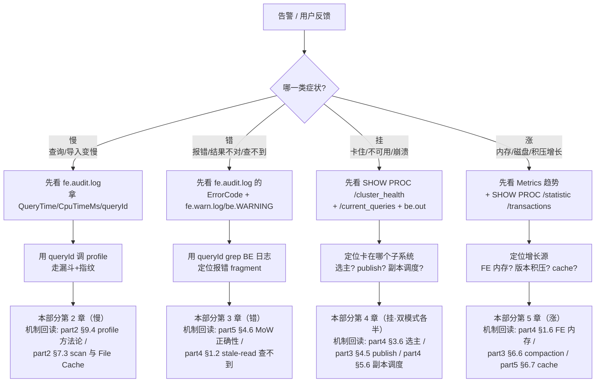

# 第 1 章：排查方法论与工具箱

> 本章行号引用基于写作时核实所用的 HEAD（`d77ed6d7b7`，源码树与系列基线一致）。文中所有 `路径:行号` 均在该版本核实；代码演进会让行号漂移，但工具的产生点、字段语义、开关端点不变。跨部分回引均已 grep 目标文件确认内容真实存在。

前五部分把 Doris 的内核拆开讲了三十二章：查询怎么从连接走到算子（part2）、导入怎么从 commit 走到 visible（part3）、FE 的元数据怎么存怎么选主（part4）、存储引擎怎么在字节层面组织数据（part5）。**每一章末尾都留了一张"排查清单"**——某个症状对应查哪个计数器、哪条日志、哪个源码点。这些清单是三十二个孤立的"点"。

第六部分要做的是**把点连成线**：真实故障降临时，你面对的不是"我知道这是 publish 积压问题、去查 part3 第 4 章"，而是"某个业务反馈变慢了/报错了/查不到数了"——一个**症状**，而不是一个已归类的机制问题。从症状到子系统的这一跳，才是排查的真正难点，也是前部清单没覆盖的。本章是这条路的起点：先立方法论（1.1、1.5），再把 Doris 的**五件可观测工具**盘点到"数据在哪产生"的粒度（1.2~1.4），最后用一次工具热身（1.6）把它们串成一条链。

本章的五段式做了裁剪：不做"源码走读机制细节"（机制都在前部，本章只讲工具的产生点），"动手实验"换成**工具热身 + 无害 debug point 演练**（1.6），"排查清单"升级为**元清单**——排查工具本身怎么用错（1.7）。

## 1.1 问题：故障时你有 60 秒决定往哪查

**遇到了什么问题？** 生产告警响了。你手上有一堆工具：FE/BE 日志、审计日志、`SHOW PROC`、几十张内省表、Prometheus 面板、profile、debug point。问题不是"工具不够"，而是**在压力下，第一分钟该动哪个工具**。选错第一步，代价是几十分钟的弯路——甚至误操作毁掉现场。

**候选方案与权衡（排查体系的三种组织方式）。**

- **候选一：工具堆砌（按工具罗列）。** 把所有工具列一张清单："日志能看什么、内省表有哪些、metrics 有哪些指标"。这是大多数官方文档的组织方式。问题是它回答不了"**先用哪个**"——你会用每一件工具，却在故障现场把七件工具挨个试一遍，把 60 秒变成 60 分钟。
- **候选二：按组件划分（FE 的问题还是 BE 的问题）。** 先猜是谁的锅，再去翻那个组件的工具。问题是**"是谁的问题"本身就是排查的结论，而不是起点**——一个慢查询可能慢在 FE 优化器、也可能慢在 BE 扫描、还可能慢在两者之间的 RPC。开局就赌组件，赌错了整条路都错。
- **候选三：按可观测层次分层（现象 → 指标 → 日志 → 内核态）。** 不按工具、不按组件，而按**信息的抽象层次**组织：最外层是用户可见的**现象**（慢/错/挂/涨），往里一层是聚合的**指标**（metrics 告诉你"哪个子系统的哪个计数在异常"），再往里是**日志与内省表**（定位到具体 query/txn/tablet），最内层是**内核态**（profile 拆算子、debug point 复现、调试器看现场变量）。每深入一层，范围收窄一个数量级。

**Doris 怎么解决的？** 本部分选候选三。五件工具不是平级罗列，而是**分层落位**，各管一层：

| 层次 | 工具 | 回答的问题 |
|---|---|---|
| 现象 | 审计日志（`fe.audit.log`） | 哪条 SQL、慢多少、错在哪、`queryId` 是什么 |
| 指标 | Metrics（Prometheus） | 哪个子系统的哪个计数在异常增长 |
| 日志 + 内省 | FE/BE 日志、内省表、`SHOW PROC` | 定位到具体 query/txn/tablet 的状态 |
| 内核态 | Profile、debug point、调试器 | 拆到算子/函数级，看现场、复现边界 |

分层的价值在于**它天然给出了排查顺序**：从现象层拿到 `queryId`（几乎零成本），用它做主键贯穿指标、日志、profile——这条**贯穿键**就是本章反复出现的主角。分层还有一层好处是**成本递增、按需下潜**：越靠外的层成本越低、覆盖越广（看一眼审计日志、扫一眼面板，几秒钟就能排除掉一大片可能），越靠内的层成本越高、越精确（拉 profile、attach 调试器、开 debug point 复现，动辄几分钟起）。正确的排查节奏是**从外往里逐层收窄，能在外层定性就绝不下潜**——反过来一上来就 attach 调试器，等于用最贵的工具去解一个看日志就能解的问题。

这套分层和前五部分的关系可以一句话概括：**前部给"点"、本部分连"线"**。前部每章末尾的排查清单，本质是"某个已知机制出问题时，去看它的哪个计数器"——它假设你已经知道问题出在哪个机制。而真实故障不会这样自报家门，你拿到的只是一个现象。1.5 的决策树，正是把"现象 → 该进哪个子系统"这一跳固化成一张可执行的导航图，把三十二个孤立的点接成从症状出发的排查线。

## 1.2 工具一/二：日志体系与审计日志

### 日志分文件的产生点

FE 用 log4j2、BE 用 glog，两侧都把日志**按用途分文件**，这本身就是第一层过滤。FE 侧的三个 appender 在 `fe/fe-core/src/main/java/org/apache/doris/common/Log4jConfig.java` 定义得很直白：`fe.log`（全量运行日志，appender 名 `Sys`，`:106`）、`fe.warn.log`（只收 WARN 及以上，appender 名 `SysWF`，`:124`）、`fe.audit.log`（审计日志，appender 名 `AuditFile`，`:142`）。BE 侧 glog 按级别落 `be.INFO`/`be.WARNING`/`be.ERROR`，崩溃栈落 `be.out`。

**排查第一动作永远是 `fe.warn.log` 和 `be.WARNING`，不是全量日志**——分文件的设计就是为了让你先看被过滤过的高信号文件，而不是在几个 G 的 `fe.log` 里大海捞针。

日志级别的**运行时动态调整**（不重启改 `sys_log_level`）机制在 [part1 第 5 章](../part1-architecture/05-source-map-and-dev-env.md) §5.5 已完整讲过（BE 走 `POST /api/update_config`、FE 走 `GET /api/_set_config`），本章不重复。这里只补一个前部没讲、却在生产上真会咬人的点。

### 补充：模块级 verbose 与它的代价

全局调 DEBUG 会把所有模块的日志一起打爆。更精细的做法是**只对目标模块开 verbose**：`sys_log_verbose_modules`（FE `fe/fe-common/src/main/java/org/apache/doris/common/Config.java:91`，BE `be/src/common/config.cpp:292`）。FE 侧填 Java 包名（如 `org.apache.doris.catalog`，用 log4j 的 DEBUG 实现）；BE 侧填模块名，对应 glog 的 `VLOG` 详细日志。

**代价与易错点——这个开关不能热改。** 关键区别藏在配置的可变性里：

- BE 的 `sys_log_level` 是 `DEFINE_mString`（`be/src/common/config.cpp:286`，`m` 前缀表示 mutable），能热改；但 `sys_log_verbose_modules` 是 `DEFINE_Strings`（`:292`，**无 m 前缀，不可变**）——想开模块 verbose 必须改 `be.conf` 重启 BE。
- FE 两个都是裸 `@ConfField`（`sys_log_verbose_modules` 在 `:91`），而 `@ConfField` 的 `mutable` 默认就是 `false`（注解定义见 `fe/fe-common/src/main/java/org/apache/doris/common/ConfigBase.java:51`）——同样要改 `fe.conf` 重启 FE。

所以"临时开个 verbose 看看"在生产上不是零成本操作：它要重启进程、会打大量日志、VLOG 本身有序列化开销。**真开了记得回滚**——重启改回来，别让 verbose 长期挂着把磁盘打满、把热路径拖慢。

### tricky 点：审计日志是慢查询排查的第一入口，`queryId` 是贯穿键

`fe.audit.log` 是整个排查体系里**信息密度最高、成本最低**的一张表——每条 SQL 执行完落一行，字段从 `ConnectContext` 和执行统计里组装，产生点是 `fe/fe-core/src/main/java/org/apache/doris/qe/AuditLogHelper.java:68` 的审计逻辑，核心方法 `logAuditLog`（`:85`）。它写进 `AuditEventBuilder` 的字段直接决定了你能问它什么问题（`:243` 起的组装链）：

| 字段（builder setter） | 排查用途 |
|---|---|
| `QueryId`（`:245`） | **贯穿键**——同一 `queryId` 关联 FE 日志、BE 日志、profile |
| `QueryTime`（`:256`）/`CpuTimeMs`（`:258`） | 慢查询的墙钟耗时 / CPU 耗时，判断慢在等还是慢在算 |
| `State`/`ErrorCode`/`ErrorMessage`（`:252`~`:254`） | 成功还是失败、失败的错误码与消息 |
| `ScanBytes`/`ScanRows`/`ReturnRows`（`:260`~`262`） | 扫描量 vs 返回量，判断是否扫太多 |
| `PeakMemoryBytes`（`:259`） | 峰值内存，判断是否内存打爆 |
| `ScanBytesFromLocalStorage`/`FromRemoteStorage`（`:267`~`269`） | 分离模式下 cache 命中还是回落对象存储 |
| `WorkloadGroup`（`:280`）/`SqlHash`（`:275`）/`StmtId`（`:274`） | 资源组归属、SQL 指纹、语句 id |

审计日志由内建插件 `fe/fe-core/src/main/java/org/apache/doris/plugin/audit/AuditLogBuilder.java` 消费 `AuditEvent` 后落盘，采集范围由 `audit_log_modules`（`fe/fe-common/src/main/java/org/apache/doris/common/Config.java:108`，默认 `slow_query`/`query`/`load`/`stream_load`）控制。这里的 `slow_query` 是一个独立采集类别——超过慢查询阈值的 SQL 会被单独标记，这让"只捞慢的"变得极其廉价：不必对全量 `query` 做耗时排序，直接按 `slow_query` 归类就行。

`SqlHash` 这个字段值得单独点一句：它是**同一形态 SQL 的指纹**（参数不同、结构相同的 SQL 共享一个 hash）。排查"某类查询整体变慢"而非"某一条慢"时，按 `SqlHash` 聚合审计日志，就能把成百上千条同形态查询的耗时分布画出来——这是从"个案"上升到"模式"的关键，也是容量规划和慢查询治理的入口。

**为什么它是第一入口？** 因为 `queryId` 从这里拿到后，就能做主键去 BE 日志 grep、去调 profile、去 `active_queries` 表查在跑的实例——这条链就是 1.6 要走的。审计日志的时间戳还让**跨节点对齐**成为可能：一条查询在协调 FE、多个 BE 上留下的日志，靠 `queryId` + 时间窗口就能拼成一条完整时间线，而不必猜哪条 BE 日志属于哪次查询。**易错点**：排查慢查询不先看审计日志、直接冲进 BE 日志翻，等于放着一张现成的索引不用、去全表扫描。

## 1.3 工具三：内省表与命令

Doris 把大量运行时状态暴露成**可以用 SQL 查的表**和**可以用命令看的树**。这比翻日志结构化得多——日志是流水账、要正则去捞，而内省表能过滤、能 join、能排序、能接告警系统。它俩在排查里的分工是：**指标告诉你哪个子系统异常之后，用内省表把范围收到具体的 query/txn/tablet**，日志只在内省表也说不清时才下潜。

### 内省表：TVF 与 information_schema 两条来源

内省表分两族。一族是**表函数（TVF）**，在 `fe/fe-core/src/main/java/org/apache/doris/tablefunction/` 下，一个类一张表，用 `select * from backends()` 这样的函数式调用；另一族是 **information_schema 库**的系统表，schema 集中在 `fe/fe-core/src/main/java/org/apache/doris/catalog/SchemaTable.java` 的 `TABLE_MAP`，数据在被查询时由 `fe/fe-core/src/main/java/org/apache/doris/tablefunction/MetadataGenerator.java` 现算填充（`active_queries` 的现算逻辑在该文件 `:177`；`backend_active_tasks`/`processlist`/`rowsets` 的 schema 分别在 `fe/fe-core/src/main/java/org/apache/doris/catalog/SchemaTable.java` 的 `:478`/`:538`/`:415`）。两族的差别只是入口形态——TVF 是函数、information_schema 是库表——底层都是 FE 内存或向 BE/MetaService 现拉的运行时状态，不落盘、每次查询实时算。按排查场景归纳出真实清单：

| 内省表 | 产生点（类名） | 排查什么 |
|---|---|---|
| `backends()` | `BackendsTableValuedFunction` | BE 是否 alive、磁盘用量、心跳 |
| `frontends()` / `frontends_disks()` | `FrontendsTableValuedFunction` | FE 角色（Master/Follower/Observer）、是否 join、元数据盘 |
| `active_queries`（information_schema） | `MetadataGenerator` | 当前在跑的查询及其 BE 占用 |
| `backend_active_tasks`（information_schema） | `SchemaTable` | 每个 BE 上正在执行的任务/资源 |
| `processlist`（information_schema） | `SchemaTable` | 连接级会话列表 |
| `rowsets`（information_schema） | `SchemaTable` | tablet 的 rowset 版本链（compaction/版本积压） |
| `partitions()` | `PartitionsTableValuedFunction` | 分区的行数、版本、数据量 |
| `tasks()` / `jobs()` | `TasksTableValuedFunction` | 异步作业（导入、schema change 等）状态 |
| `mv_infos()` | `MvInfosTableValuedFunction` | 物化视图状态 |

TVF 支持的元数据类型枚举见 `fe/fe-core/src/main/java/org/apache/doris/tablefunction/MetadataTableValuedFunction.java`（`TMetadataType`，含 `BACKENDS`/`FRONTENDS`/`PARTITIONS`/`JOBS`/`TASKS` 等）。用好内省表的关键是**把它当普通表 join**：例如把 `active_queries` 按 `queryId` 关联到审计日志里那条慢查询、再看它此刻占了哪些 BE，一步就把"离线的历史记录"和"在线的实时状态"接上了——这正是内省表比日志强的地方。

### `SHOW PROC`：一棵按子系统分好的诊断树

`SHOW PROC '<path>'` 把 FE 内部状态组织成一棵目录树，根节点的所有子目录在 `fe/fe-core/src/main/java/org/apache/doris/common/proc/ProcService.java:37`~`:61` 一次性注册（下表"注册行"列是各子目录在该文件中的行号）。它和内省表的区别在于：内省表偏"当前在发生什么"（在跑的查询、活跃任务），PROC 树偏"系统的结构性状态"（集群健康度、副本分布、事务全景）。综合前五部分各章用到的子树，给一张"哪类问题查哪棵子树"的地图：

| PROC 路径 | 注册行 | 哪类问题 |
|---|---|---|
| `/cluster_health` | `:55` | **挂**——集群整体健康、副本是否齐全 |
| `/cluster_balance` | `:54` | **涨/不均**——tablet 分布均衡、迁移中的任务 |
| `/transactions` | `:48` | **导入卡住**——事务状态（COMMITTED 未 publish 等） |
| `/current_queries` `/current_query_stmts` | `:51`/`:52` | **慢/挂**——当前在跑的查询 |
| `/current_backend_instances` | `:53` | **慢**——查询在各 BE 上的 fragment 实例 |
| `/backends` `/frontends` | `:39`/`:45` | **挂**——节点存活与角色 |
| `/statistic` | `:43` | **涨**——库/表/tablet/副本计数总览 |
| `/jobs` `/tasks` | `:42`/`:44` | 异步作业与任务 |
| `/routine_loads` `/stream_loads` | `:56`/`:57` | 导入作业状态 |
| `/bdbje` | `:59` | **FE 选主/元数据**——bdbje 复制组状态 |
| `/diagnose` | `:60` | 内建的自诊断入口 |

这张地图直接服务于 1.5 的决策树：**挂**先看 `/cluster_health`、**涨**先看 `/statistic` 与 `/transactions`、**导入卡住**先看 `/transactions`。记不住全路径也没关系——`SHOW PROC '/'` 会列出所有子目录，逐层往下点即可。

### 易错点：内省表是 Master 视角还是本 FE 视角？

这是内省表最容易踩的坑。FE 集群里 **只有 Master 内存里的元数据是权威的**，Follower/Observer 靠回放 editlog 追平、存在 stale-read 窗口——这条语义 [part4 第 1 章](../part4-fe-internals/01-catalog-and-memory.md) §1.2 的 tricky 点已从源码证过（`meta_delay_toleration_second` 兜底、超窗则 `canRead=false` 停读）。它的直接推论是：**你连到哪个 FE、内省表就给你哪个 FE 的视角**。在 Observer 上查 `frontends()` 看角色没问题，但查刚建的表、刚提交的事务，可能因为回放没追上而"查不到"——这不是 bug，是没连 Master。排查元数据类问题，**先确认自己连的是不是 Master**（`frontends()` 里 `IsMaster` 列），否则你可能在对着一份滞后的快照排查。

## 1.4 工具四/五：Metrics 与 debug point

### Metrics：聚合层的产生点

Metrics 是分层里的"指标层"——它不告诉你具体哪条 SQL，而告诉你**哪个子系统在异常**，适合做告警和趋势。两侧各有产生点与端点：

- **BE**：全局指标注册在 `be/src/common/metrics/doris_metrics.h` 的 `DorisMetrics` 单例（如 `fragment_requests_total` `:50`、`query_scan_bytes` `:52`、各类 compaction/clone/schema_change 计数），通过 `/metrics` 端点暴露（注册在 `be/src/service/http_service.cpp:251`，默认 `webserver_port` 8040）。
- **FE**：指标在 `fe/fe-core/src/main/java/org/apache/doris/metric/MetricRepo.java`（如 `COUNTER_QUERY_ALL` `:118`、`COUNTER_QUERY_ERR` `:119`、`COUNTER_QUERY_SLOW` `:120`），通过 `fe/fe-core/src/main/java/org/apache/doris/httpv2/rest/MetricsAction.java:44` 的 `/metrics` 暴露（默认 `http_port` 8030），支持 `?type=core` 只取核心指标。

Metrics 的价值不在"看某一个绝对值"，而在**看趋势和拐点**——一条平稳的曲线突然抬头，往往比任何日志都更早暴露问题。按 1.5 的四类症状，最值得盯的核心指标是：

- **慢**：查询侧的 `query_scan_bytes`、`fragment_requests_total`（BE），以及 `COUNTER_QUERY_SLOW`（FE）的增速——扫描量陡增或慢查询计数抬头，是查询劣化的先行指标。
- **错**：FE 的 `COUNTER_QUERY_ERR`——失败率突升先在这里体现，再去审计日志按 `ErrorCode` 归类。
- **涨**：compaction 相关计数（`base_compaction_request_total` 等，`be/src/common/metrics/doris_metrics.h:87` 起）反映版本积压，内存与 File Cache 指标反映资源水位。
- **挂**：节点存活类、心跳类指标，配合 `/cluster_health` 判断可用性。

**易错点：指标名在版本间会漂移。** 指标名不是 API 契约，跨版本升级时会改名、拆分、合并。写告警规则时别把单个指标名写死，**用 label 过滤 + 对同类指标做容错**（多个候选名 or 起来），并在升级后核对面板，否则升级当天告警会静默失效——比没有告警更危险。这也是为什么告警要盯"趋势斜率"而非"固定阈值"：阈值随集群规模和版本变，斜率异常才是普适信号。

### Debug point：受控故障注入的完整机制

`debug point` 是**在代码里预埋的、可运行时开关的注入点**，用来复现"平时难触发"的边界。有一类线上问题最折磨人：它只在"BE A 的 publish 恰好比 BE B 慢 3 秒""某个 tablet 恰好在 compaction 时被查"这种**特定时序**下出现，你无法用普通 SQL 稳定复现，也就无从验证修复。debug point 就是为此而生——它让你**主动把那个罕见时序制造出来**（人为让某处 sleep、让某次 RPC 失败一次、让某个分支走进平时走不到的边），从而把"偶发"变成"必现"。前部各章的回归测试大量用它构造边界（如 part3 讲 publish、part5 讲 MoW 时提到的注入点），本章讲的是它作为**排查工具**的那一面。机制两侧对称：

- **注入宏**：BE 侧是 `DBUG_EXECUTE_IF(name, code)`（`be/src/util/debug_points.h:37`）。它先判 `config::enable_debug_points`（关时零开销直接短路），再查这个 point 是否被激活，激活了才执行 `code`。`DebugPoint` 结构（`:138` 的 `DebugPoints` 类管理）还支持 `execute_limit`（执行几次后自动失效）、`expire_ms`（到期自动失效）、以及 `param`/`value`（给注入代码传参）。
- **HTTP 开关**：运行时通过 REST 激活/关闭。BE 的路由注册在 `be/src/service/http_service.cpp:301` 的 `register_debug_point_handler`，处理逻辑在 `be/src/service/http/action/debug_point_action.cpp`——`AddDebugPointAction::_handle`（`:45`）解析 `execute`（`:47`）、`timeout`（`:48`）参数，还有 `RemoveDebugPointAction`（`:80`）和 `ClearDebugPointsAction`（`:91`）。URL 形如 `POST /api/debug_point/add/{name}?value=v&execute=N&timeout=S`（格式见 `be/src/util/debug_points.h` 头部注释）。
- **FE 侧对称存在**：注入用 `DebugPointUtil`（如 `fe/fe-core/src/main/java/org/apache/doris/datasource/InternalCatalog.java:1513` 的 `isEnable` 调用），HTTP 开关在 `fe/fe-core/src/main/java/org/apache/doris/httpv2/rest/DebugPointAction.java`（add 路由 `:41`）。
- **总开关**：两侧都有 `enable_debug_points`——FE `fe/fe-common/src/main/java/org/apache/doris/common/Config.java:1545`，BE `be/src/common/config.cpp:1162`。

**tricky 点：debug point 是全局生效的，生产误开是事故。** 注意两个总开关的可变性：FE 的 `enable_debug_points` 是 `@ConfField(mutable = false, masterOnly = true)`（`fe/fe-common/src/main/java/org/apache/doris/common/Config.java:1544`），BE 是裸 `DEFINE_Bool`（`be/src/common/config.cpp:1162`，不可变）——**两侧都必须改配置重启才能打开**。这道"必须重启"的门槛本身就是生产的护栏：正常生产实例根本不该带着 `enable_debug_points=true` 启动。因为一旦开着，任何拿到该实例 admin 权限的人都能 `POST` 激活一个注入点，而**注入是进程全局的**——一个 `sleep` 注入点会拖慢该 BE 上**所有**走到那行代码的操作，不是只影响你自己的会话。所以 debug point 只在测试/预发实例用；即便在那里用，也务必用 `timeout`/`execute` 让它自动失效，别依赖"手动记得关"。

## 1.5 方法论：从症状到子系统的决策树

这是全部分的导航页。真实故障给你的是**症状**，不是机制分类。把症状归到四大类——**慢、错、挂、涨**——每类先动一件成本最低的工具拿到定位主键，再分流到本部分后续对应章节（第 2~5 章尚未成文，此处以纯文本引用；每个分支同时标注对应前部机制章节，供你回读原理）。

每个分支的**第一件工具**都遵循 1.1 的分层原则——现象层（审计日志）或指标层（metrics）先行，成本几乎为零，却直接把范围收窄到某个子系统，并拿到贯穿键（`queryId`/`txnId`/`tabletId`）。链接到的前部机制章节均已核实：part2 [第 9 章](../part2-query-lifecycle/09-result-and-profile.md) §9.4（profile 漏斗+指纹）、[第 7 章](../part2-query-lifecycle/07-scan-path.md) §7.3（File Cache）；part5 [第 4 章](../part5-storage-engine/04-mow-internals.md)、[第 6 章](../part5-storage-engine/06-cloud-storage.md)；part4 [第 1 章](../part4-fe-internals/01-catalog-and-memory.md)、[第 3 章](../part4-fe-internals/03-fe-ha.md)、[第 5 章](../part4-fe-internals/05-scheduling.md)；part3 [第 4 章](../part3-load-lifecycle/04-commit-and-visibility.md)、[第 6 章](../part3-load-lifecycle/06-compaction.md)。

**怎么用这张树？** 决策树不是让你按图索骥地"照抄一遍"，而是强制你在动手前先回答"这属于哪一类症状"——这一步的价值在于**挡住冲动**。故障现场最常见的错误就是跳过归类、凭直觉扑向自己最熟的那个子系统。先落到四类之一、先动第一件工具拿到主键，你就不会在第一分钟走错方向。

**一个跨越多个分支的典型根因：`-235 TOO_MANY_VERSION`。** 它是理解"点连成线"的最好例子。这个错误码的定义与"tablet 版本数过多"的根源在 [part1 第 3 章](../part1-architecture/03-data-model.md) §3.7；它在导入侧表现为**报错**（part3 [第 2 章](../part3-load-lifecycle/02-stream-load-path.md) §2.6 的快速失败），在提交侧被误当成 **publish 卡点**（part3 [第 4 章](../part3-load-lifecycle/04-commit-and-visibility.md) §4.5 特意澄清"别把 -235 当 publish 卡点找"），而治本永远在 **compaction**（part3 [第 6 章](../part3-load-lifecycle/06-compaction.md) §6.6 的"进水太猛 vs 出水太堵"）。同一个根因散落在四章的清单里，正是本部分要把它们缝合的原因：从"错"或"涨"的症状入口进来，最终都要收敛到 compaction 这条治本线。

## 1.6 故障演练：工具热身 + 一次无害注入

本章不制造故障，而是先把五件工具串成一条链走一遍——**练的是"从症状到内核态"的贯穿动作本身**。

### 热身：对一条正常查询走完全链路

以慢查询排查的标准链路，对一条**正常**查询走一遍（各字段/日志格式已核实）：

1. **审计日志拿主键。** 跑一条 `SELECT`，去 `fe.audit.log` 找到对应行，记下 `QueryId`、`QueryTime`、`ScanRows`（字段产生点见 §1.2，`fe/fe-core/src/main/java/org/apache/doris/qe/AuditLogHelper.java:245` 起）。这一步回答"慢不慢、扫了多少"——`QueryTime` 是墙钟、`CpuTimeMs` 是 CPU，二者差得大说明时间花在了等（锁、IO、排队）而非算。
2. **`queryId` 关联 BE 日志。** 用这个 `queryId` 去 `be.INFO` grep，能看到该查询在这台 BE 上的 fragment 执行痕迹。这一步把 FE 视角接到 BE 视角。
3. **调 profile 走漏斗。** 用 `queryId` 取该查询的 profile，按 [part2 第 9 章](../part2-query-lifecycle/09-result-and-profile.md) §9.4 的"四步漏斗 + 指纹表"读：先看 Summary 三段（编译/执行/回传）定位大头，再进最长的 fragment、看主计数器定性。这一步下沉到算子级。
4. **内省表看在跑的实例。** 查询还在跑时，`active_queries`（§1.3）能看到它此刻占用了哪些 BE。

走完这条链，你就把审计日志（现象）→ 日志（定位）→ profile（内核态）→ 内省表（实时）四层贯穿了一遍。**这正是 1.5 决策树"慢"分支的完整展开**——真出问题时，只是把这条正常链路上的某一环换成异常读数：某一步的耗时读数突然变大、某个计数器的 `max` 远离 `min`、某条 BE 日志刷出 WARN。用正常查询先走一遍的意义就在这里：**只有先见过"正常长什么样"，你才认得出"异常长什么样"**。故障现场没有时间现学工具，链路必须提前在正常态下练熟成肌肉记忆。

### 无害注入：体会 debug point 与"忘了关"的风险

选一个**真实存在且无害**的注入点：`StorageEngine._submit_compaction_task.sleep`（`be/src/storage/olap_server.cpp:1143`），它只在提交 compaction 任务时 `sleep(5)`，不改数据、自恢复。

前提：该 BE 必须以 `enable_debug_points=true` 启动（§1.4，改 `be.conf` 重启——这道门槛正是护栏）。步骤：

1. **激活并限次**：`curl -X POST "http://<be>:8040/api/debug_point/add/StorageEngine._submit_compaction_task.sleep?execute=3&timeout=60"`——`execute=3` 让它只生效 3 次、`timeout=60` 让它 60 秒后自动失效（参数解析见 `be/src/service/http/action/debug_point_action.cpp:47`~`:48`）。这两个自失效参数是**演练与生产误用的分水岭**：带上它们，注入点用完自动消失；不带，它就一直挂着。
2. **观察**：触发/等待 compaction，对照 `be.INFO` 里 compaction 任务的时间戳，会看到提交环节被拉长了约 5 秒；对照未注入时的节奏，你会直观感到"一个注入点影响的是全进程所有走到这行的操作"，而不是只影响某一次调用。
3. **关闭**：`curl -X POST "http://<be>:8040/api/debug_point/remove/StorageEngine._submit_compaction_task.sleep"`（`RemoveDebugPointAction`，`:80`）。

**易错点（本演练的真正目的）**：如果第 1 步没带 `timeout`/`execute`、第 3 步又忘了 remove，这个 5 秒 sleep 会**永久挂在该 BE 上、拖慢它每一次 compaction**——积累下去就是版本积压（回到 1.5 的"涨"分支）。这就是 §1.4 tricky 点"全局生效"的切身体会：**注入必须自带失效、用完立刻关**。

## 1.7 排查清单（元清单）：工具用错的三种典型

前五部分每章的排查清单讲"症状 → 查什么"。本章的清单是**元清单**——排查动作本身怎么做错。这三条是资深工程师也会栽的坑。

| 错误动作 | 为什么错 | 正确姿势 |
|---|---|---|
| **上来就翻 BE 日志** | 放着 `fe.audit.log` 这张现成索引不用、去几个 G 的 BE 日志全表扫描。分层原则被跳过，第一步就选了最内层的工具。 | 先看审计日志拿 `queryId`（§1.2），再用它做主键定向 grep BE 日志（§1.6 第 2 步）。现象层 → 内核态，别跳级。 |
| **不留 `queryId` / 不存现场** | `queryId` 是贯穿审计日志、BE 日志、profile 的唯一键（§1.1）。丢了它，四层信息就串不起来，只能各查各的。profile 尤其是**过期即失**——查询结束后不主动留存就没了。 | 报障第一时间记下 `queryId`；对慢查询立刻拉 profile 存档，别等复现。 |
| **重启大法毁现场** | 卡住/内存高时直接重启，症状是消失了，但 `SHOW PROC`、profile、内存现场、debug point 状态全被清空——**这次故障再也无法归因，下次照样发生**。 | 重启前先取证：`SHOW PROC '/cluster_health'`、`active_queries`、`be.out` 栈、必要时 heap profile（part6 内存篇会详述）。留下现场再重启。 |
| **跳过症状归类、直扑熟悉的子系统** | 凭"我猜是 BE 的问题"或"上次也是 compaction"开局，等于拿候选二（按组件）的赌博替代了候选三（按层次）的方法。赌错方向，前十分钟全废。 | 先用 1.5 决策树把症状落到慢/错/挂/涨之一，动第一件工具拿到主键，再让**证据**（而非直觉）指向子系统（§1.5）。 |
| **verbose/debug point 开了忘了关** | `sys_log_verbose_modules` 长期挂着打爆磁盘、拖慢热路径；debug point 忘关全局拖慢一个 BE（§1.4、§1.6）。排查工具本身变成了新故障源。 | verbose 改配置排查完即回滚；debug point 一律带 `timeout`/`execute` 自失效，用完立即 `remove`。 |

一句话收束本章：**排查不是"我知道很多工具"，而是"我知道此刻先动哪个、用它拿到什么主键、再顺着主键往内核走"。** 五件工具按现象→指标→日志→内核态分层，1.5 的决策树把"症状 → 子系统"这一跳固定下来，后续四章则在每个分支里，把前部三十二张清单的"点"接成完整的排查"线"。下一章从最常见的症状——**慢**——开始。
