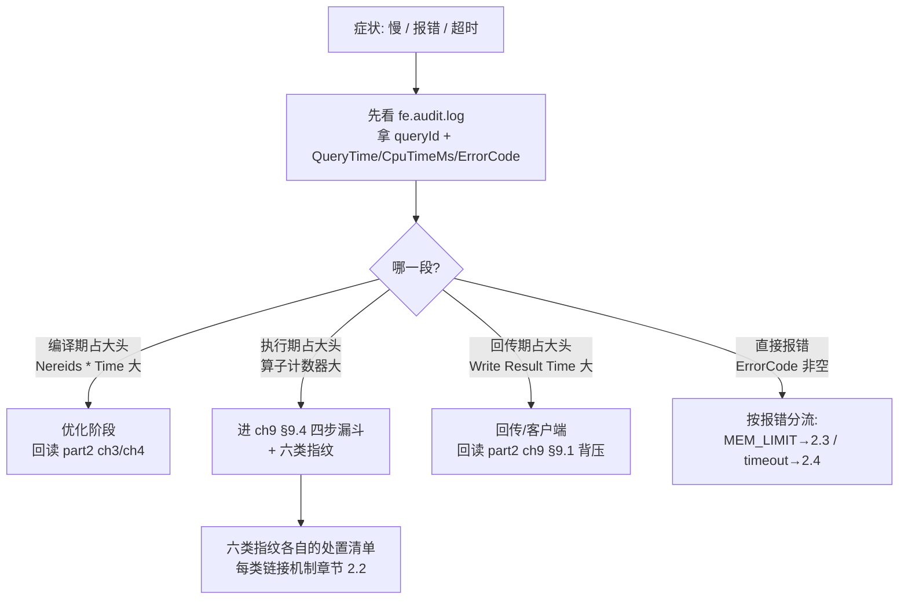
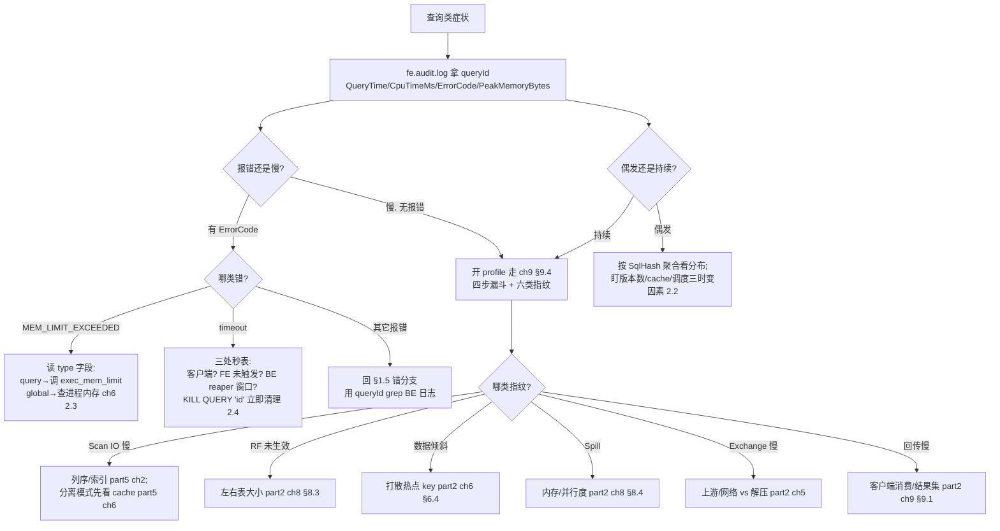

# 第 2 章：查询类故障 —— 慢、爆、超时

> 本章行号引用基于写作时核实所用的 HEAD（`a3a5a5b37b`，源码树与系列基线一致）。文中所有 `路径:行号` 均在该版本核实；代码演进会让行号漂移，但报错文本的拼装点、配置项语义、语法规则、字段来源不变。跨部分回引均已 grep 目标文件确认内容真实存在。

上一章（[第 1 章](./01-toolbox.md)）立了方法论、把五件工具按现象→指标→日志→内核态分层，并在 §1.5 给出"症状 → 子系统"的决策树。那棵树的**慢**分支、以及**错/挂**分支里凡是落到"某条查询"的，都在本章展开。第 2 部分（part2）用九章把一条 SELECT 从连接讲到 profile，每章末尾留了一张排查清单；本章的工作不是重讲那些机制，而是**把散在九章里的清单组织成一棵从症状出发的决策树，并为每一类根因配上可执行的处置动作**。机制细节一律链接回 part2/part5，本章的增量在于**组织方式 + 处置清单 + 命令与配置的现场核实**。

## 2.1 问题：查询故障的分诊逻辑

**遇到了什么问题？** 业务反馈"这条查询有问题"——可能是慢、可能是报错、可能是"客户端转圈半天没结果"。你拿到的是一个**症状**，不是一个已归类的机制问题。查询链路又特别长（连接、解析、优化、分发、执行、回传六大段，横跨 FE 与一群 BE），同一个症状能对应完全不同段落的根因。第一分钟的分诊方向决定了后面是十分钟还是一小时。

**候选方案与权衡（三种分诊组织方式）。**

- **候选一：按报错文本查。** 看到 `MEM_LIMIT_EXCEEDED` 就查内存、看到 `timeout` 就查超时。问题是**同一句报错文本背后是多种根因**：`MEM_LIMIT_EXCEEDED` 可能是这条查询自己写得烂（广播了大表），也可能是进程整体内存紧张、这条查询只是恰好撞上限额的"背锅侠"（2.3）；`-235 TOO_MANY_VERSION` 在导入侧是报错、在提交侧像 publish 卡点、治本却在 compaction（§1.5 已拆过这个例子）；`timeout` 更是 FE、BE、客户端三处都能数秒表（2.4）。报错文本是**必要线索**，但把它当**充分诊断**就会照着字面开错药方。
- **候选二：按组件猜。** 先赌是 FE 还是 BE 的锅，再翻那个组件。§1.1 已经否过这条路——"是谁的问题"是排查的**结论**而非**起点**。一条慢查询可能慢在 FE 优化器（CBO 广播大表）、慢在 BE scan（冷 cache）、也可能慢在两者之间的结果回传，开局赌组件等于赌运气。
- **候选三：按查询生命周期阶段分诊。** 不猜组件、不迷信报错文本，而是问"这条查询**卡在生命周期的哪一段**，对应的工具证据是什么"。part2 的九章路径本身就是一张**分诊图**：连接协议（ch1）→ 解析分析（ch2）→ RBO/CBO 优化（ch3/ch4）→ 计划分发（ch5）→ pipeline 执行（ch6）→ scan（ch7）→ join/agg/RF/spill（ch8）→ 结果回传与 profile（ch9）。每一段都有它自己的证据来源——编译期看 Summary 的 `Nereids * Time`、执行期看算子计数器、回传期看 `Write Result Time`。分诊的本质就是**用一件低成本工具把症状定位到某一段，再进那一段的清单**。

**本章怎么解决？** 选候选三。报错文本用来**收窄**、生命周期阶段用来**定位**、组件是分诊后自然浮现的**结论**。下面这张图把 part2 九章重排成"阶段 → 该看哪个证据 → 回哪一章"的分诊骨架，它是 2.2~2.5 的总纲：

> 记住一条：**报错文本决定"从哪条支流进来"，生命周期阶段决定"顺流走到哪里"。** 本章不改 §1.5 决策树的入口（慢/错/挂/涨），只是把落到"某条查询"之后的分流走细。

## 2.2 慢查询：四步漏斗的完整版

慢查询排查的核心是 part2 [第 9 章](../part2-query-lifecycle/09-result-and-profile.md) §9.4 的**四步漏斗 + 指纹表**：总耗时 → 最长 fragment → 最长算子 → 关键计数器，再用六种指纹定性。那一节讲透了"漏斗本身怎么走"，本章不重复，只补它的**前**（怎么发现慢、拿到 queryId 与 profile）与**后**（每类指纹的处置动作）。

### 漏斗前：发现慢查询、拿到贯穿键

慢查询有三个成本递增的发现入口：

1. **审计日志按慢阈值捞（最廉价）。** 超过慢查询阈值的 SQL 会被审计日志单独标成 `slow_query` 类别（§1.2 讲过这个采集类别）。阈值由 `qe_slow_log_ms` 控制——**默认 5000 毫秒**，且是 `@ConfField(mutable = true)`（`fe/fe-common/src/main/java/org/apache/doris/common/Config.java:109`~`:111`），**可以热改不重启**：临时想把慢阈值调到 1 秒抓更多样本，直接 `ADMIN SET FRONTEND CONFIG ("qe_slow_log_ms" = "1000")` 即可，排查完再调回。从审计日志拿到的 `QueryTime`（墙钟）、`CpuTimeMs`（CPU）、`queryId`（贯穿键）、`ScanRows`/`ScanBytes`（扫描量）就是漏斗的入口读数（字段产生点见 §1.2）。
2. **`active_queries` 看此刻在跑的慢查询。** 查询还没结束时，审计日志里还没有它——这时查 `information_schema.active_queries`（schema 在 `fe/fe-core/src/main/java/org/apache/doris/catalog/SchemaTable.java:498`，现算逻辑在 `fe/fe-core/src/main/java/org/apache/doris/tablefunction/MetadataGenerator.java`）。它的列直接支撑分诊：`QUERY_ID`、`QUERY_TIME_MS`（已跑多久）、`WORKLOAD_GROUP_ID`（资源组归属）、`DATABASE`、`FRONTEND_INSTANCE`、`QUEUE_START_TIME`/`QUEUE_END_TIME`（是否在排队等资源组）、`QUERY_STATUS`、`SQL`。按 `QUERY_TIME_MS` 排序就能挑出当前最慢的、拿到它的 `QUERY_ID`。
3. **`SHOW PROCESSLIST` 看连接级会话。** 语法 `SHOW FULL? PROCESSLIST`（`fe/fe-sql-parser/src/main/antlr4/org/apache/doris/nereids/DorisParser.g4:423`，对应 information_schema 的 `processlist` 表，schema 在 `fe/fe-core/src/main/java/org/apache/doris/catalog/SchemaTable.java:538`）。它偏"哪条连接在忙、忙了多久"，粒度比 `active_queries` 粗，但能一眼看出是不是某个客户端挂了一堆连接。

**在取 profile 之前，先用审计日志切一刀。** 审计日志里 `QueryTime`（墙钟）和 `CpuTimeMs`（CPU）两个数就能做**免开 profile 的第一次分诊**：二者接近，说明时间实打实花在算上，多半是扫描/计算量大或计划差（往执行期指纹钻）；`QueryTime` 远大于 `CpuTimeMs`，说明大量时间花在**等**——等锁、等 IO、等资源组排队、等结果回传，这时先别急着钻算子，回 §2.1 那张图先分清是哪一段在等。再配合 `ScanRows`/`ScanBytes` 看扫描量是否离谱、`ReturnRows` 看是不是结果集太大拖垮回传、`PeakMemoryBytes` 看是否贴近内存红线（字段来源见 §1.2）——这几个数是审计日志这一行里现成的、零成本的分诊线索，用好它们能在开 profile 前就排除掉一大半可能。

拿到 `queryId` 后，取 profile 走漏斗——前提是 `enable_profile` 在**查询运行前**就开着（§9.3 的 tricky 点：默认关、事后补不了）。这是漏斗前最容易踩空的一环：**发现慢的时候查询已经跑完、当时没开 profile，就只能改开关重跑**。取到 profile 后第一步不是钻算子，而是照 §2.1 的图把 `Total` 拆成编译/执行/回传三段先分诊——只有确认执行期占大头，才进 §9.4 的四步漏斗；若是编译期大头（如 `Nereids Optimize Time` 巨大），根因在优化器、去 part2 [第 4 章](../part2-query-lifecycle/04-nereids-cbo.md)，钻执行期算子纯属方向错误。

### 漏斗后：六类指纹的处置动作清单

漏斗 + 指纹（§9.4 指纹表）把病因定性到六类之一后，剩下的就是"开什么药"。这里要守住 §9.4 的那条心法——**先归因、再优化**：任何处置动作之前，都要能在 profile 上指出"时间花在这个 fragment 的这个算子的这个计数器上"，否则就是在猜。下表给每类指纹配处置动作，**每个动作链接它的机制章节，本章只给动作、不重讲机制**；机制怎么运作请点开链接回读，本章的增量是"定性之后该做的那个具体动作"：

| 指纹（§9.4 定性） | 处置动作 | 机制章节 |
|---|---|---|
| **Scan IO 慢** | 若过滤列不在排序键最左前缀 → 调整**排序键列序**让点查/范围列前置（前缀索引才生效）；若是全表扫 → 补 ZoneMap/BF 可裁的谓词、确认谓词能下推 | 前缀索引与列序 part5 [第 2 章](../part5-storage-engine/02-indexes.md) §2.2；谓词下推/延迟物化 part5 [第 3 章](../part5-storage-engine/03-read-path.md) §3.2 |
| **RF 未生效** | 检查 join 左右表大小是否颠倒（大表在 probe 侧才有意义）、RF 是否因类型/超时被禁；必要时提示优化器重排 | Runtime Filter 全链路 part2 [第 8 章](../part2-query-lifecycle/08-operators-rf-spill.md) §8.3 |
| **数据倾斜** | 打散热点 key（加盐/预聚合）、避免单 key 独占一个实例；确认不是统计缺失导致的坏计划 | 并行度与 local exchange part2 [第 6 章](../part2-query-lifecycle/06-pipeline-engine.md) §6.4；坏计划根因 part2 [第 4 章](../part2-query-lifecycle/04-nereids-cbo.md) §4.6 |
| **Spill 落盘** | 提高该查询的内存上限（`exec_mem_limit`）让它不落盘，或反过来确认 spill 是预期行为（大 join 本就该落盘）；调并行度摊薄单实例内存 | Spill 机制 part2 [第 8 章](../part2-query-lifecycle/08-operators-rf-spill.md) §8.4 |
| **Exchange 网络慢** | 区分"上游产出慢/网络慢"（顺 exchange 往上游 fragment 找）与"本地反序列化/解压慢"（调压缩或并行度）——§9.4 已强调两者治法不同 | 计划分发与副本选择 part2 [第 5 章](../part2-query-lifecycle/05-plan-distribution.md) §5.3 |
| **结果回传慢** | 执行不慢而 `Write Result Time` 大 → 瓶颈在客户端消费（BI 翻页、结果集过大），优化点在客户端或减小结果集，**不在执行计划** | 回传背压链 part2 [第 9 章](../part2-query-lifecycle/09-result-and-profile.md) §9.1 |

还有一类不在算子指纹里、却常表现为"scan 越来越慢"的根因：**tablet 版本积压**。版本数堆多了，多 rowset 合并读的成本线性上涨（part5 [第 3 章](../part5-storage-engine/03-read-path.md) §3.3），治本在 compaction（part3 [第 6 章](../part3-load-lifecycle/06-compaction.md) §6.6 的"进水太猛 vs 出水太堵"）。这条线把"慢"和 §1.5 的"涨"分支缝在了一起。

### tricky 点：偶发慢 vs 持续慢——三个时变因素

同一条 SQL "有时慢有时快"，和"一直慢"是完全不同的排查方向，**混为一谈会把偶发问题当成计划问题去死磕 SQL**。持续慢多半是稳定的结构性根因（列序、缺索引、坏计划），一条 profile 就能定性；偶发慢的根因**随时间变化**，你抓到的那一份 profile 可能恰好是"快"的那次，得盯三个时变因素：

- **版本数（写入节奏相关）。** 导入高峰期 tablet 版本堆积、compaction 没跟上，同一条查询的合并读成本就临时抬高；导入一停、compaction 追平又快了。版本概念见 part1 [第 3 章](../part1-architecture/03-data-model.md) §3.3。
- **缓存（分离模式）。** 冷查询打对象存储、热查询命中 File Cache，同一条 SQL 首次慢、之后快，纯粹是 cache 冷热差异，不是查询本身有问题。见 part5 [第 6 章](../part5-storage-engine/06-cloud-storage.md) §6.7。
- **调度（并发相关）。** 高并发时段查询在资源组里排队（看 `active_queries` 的 `QUEUE_START_TIME`/`QUEUE_END_TIME`）、副本选择落到了忙的 BE，都会让墙钟时间随集群负载起伏。副本选择见 part2 [第 5 章](../part2-query-lifecycle/05-plan-distribution.md) §5.3。

判据很简单：**偶发慢先按 `SqlHash` 聚合审计日志**（§1.2），把这条 SQL 的历史耗时分布画出来——看它是均匀慢还是尖刺状慢、尖刺是否和导入高峰/并发高峰对齐，再决定盯哪个时变因素，而不是抓一份 profile 就当定论。

## 2.3 内存超限：读懂报错与三层限额

### `MEM_LIMIT_EXCEEDED` 报错逐段解读

内存超限的报错文本信息量很大，但要**逐段读**才不会误诊。这条 `Status` 由 `MemTrackerLimiter` 的 `check_limit` 在"当前用量 + 本次申请 > 限额"时抛出（`be/src/runtime/memory/mem_tracker_limiter.h:308`~`:311`），主体文本由 `tracker_limit_exceeded_str` 拼装（`be/src/runtime/memory/mem_tracker_limiter.cpp:366`~`:384`）。拆开看：

| 报错片段 | 含义 | 排查指向 |
|---|---|---|
| `failed alloc size <N>` | 本次申请多少内存时被拒（`be/src/runtime/memory/mem_tracker_limiter.h:309`） | 单次申请异常大往往是坏计划（广播大表、超大 hash 表） |
| `tracker label:<...>, type:<query/load/global/...>` | 是哪个 tracker、哪一**类**限额被击穿（`:368`，type 取值见 `be/src/runtime/memory/mem_tracker_limiter.h:77`~`:84` 的 `Type` 枚举） | **这是分诊主键**：`type:query` 是查询自身、`type:global` 是进程级全局 |
| `limit <L>, peak used 
, current used <C>` | 该 tracker 的限额、历史峰值、当前用量（`:370`~`:372`） | `current` 贴着 `limit` 说明确实是这层限额太小 |
| `backend <ip>, <process memory used ...>` | 哪台 BE、**该 BE 此刻的进程总内存水位**（`:372`~`:373`，末段是 `process_memory_used_str`） | 进程水位已经很高时，即使 `type:query`，真凶也可能是进程紧张 |
| ` exec node:<...>, can \`set exec_mem_limit\` to change limit, details see be.INFO.` | 仅当 `type` 是 QUERY/LOAD 时追加（`:374`~`:377`）：最后触碰限额的算子、以及**报错自带的处置提示** | `exec node` 指出哪个算子最吃内存；`be.INFO` 里有 `print_log_usage`（`:356`）打的进程内存明细与各 tracker profile |

所以读这条报错的正确顺序是：先看 `type` 定层、再看 `current vs limit` 确认是不是这层太小、最后看 `backend` 的进程水位判断是不是"被进程紧张连累"。报错里 `` `set exec_mem_limit` `` 这句是**Doris 把处置提示写进了报错文本**——它在暗示你，若确属查询自身内存不够，调这个会话变量即可。

### 三层限额：看到哪层报错查哪里

Doris 的查询内存限额是三层嵌套的，`type` 字段告诉你击穿的是哪一层：

- **查询级：`exec_mem_limit`。** 会话变量（`fe/fe-core/src/main/java/org/apache/doris/qe/SessionVariable.java:1122`~`:1123`，默认约 100GB，下限 `MIN_EXEC_MEM_LIMIT` = 2MB 见 `:164`），对应 BE 侧 `type:query` 的 tracker。**看到 `type:query`、且这条查询本就该省内存**（不是广播大表这类坏计划），调大它是最直接的一招。
- **负载组级：workload group。** 资源组给一批查询设的内存上限，`active_queries` 的 `WORKLOAD_GROUP_ID` 和排队时间就是它的观测点。
- **进程级：global。** 整台 BE 的内存红线，由 global memory arbitrator 把关，对应 `type:global`。

这三层是**逐层收紧的嵌套关系**：一条查询先受自己的 `exec_mem_limit` 约束，这批查询整体又受所属 workload group 的配额约束，所有查询/导入/cache 加起来再受进程红线约束。任意一层被击穿都会抛 `MEM_LIMIT_EXCEEDED`，但**报错里的 `type` 字段精确告诉你是哪一层**——这就是为什么 §2.3 反复强调"先读 type"：三层共用同一句报错文本，`type` 是唯一区分它们的标记。

**三层的详细机制（各 tracker 怎么累计、arbitrator 怎么在进程紧张时挑查询 kill、workload group 怎么分配配额与软硬限）留到本部分第 6 章（内存篇）**，本章只给分诊结论：**看到哪层报错就查哪层**——`type:query` 调查询限额或改 SQL、`type:global` 查进程水位与 top 消费者、workload group 相关则查资源组配额与排队。

**易错点：把进程级内存紧张误当查询问题。** 最坑的一幕是——某条查询报了 `MEM_LIMIT_EXCEEDED`，你盯着它调 `exec_mem_limit`、改 SQL，怎么都不稳定。看一眼报错末段的进程内存水位（或 `be.INFO` 里 `print_log_usage` 的进程明细）才发现：**整台 BE 内存本就贴着红线，这条查询只是恰好第一个撞上限额的"背锅侠"**，真凶是别的大查询/导入/cache 占满了进程内存。这时该查的是进程级水位和 top 内存消费者，不是这一条查询。这个"背锅侠"陷阱的完整机制是本部分第 6 章的伏笔。

## 2.4 超时与取消：谁在数秒表

### query_timeout / execution_timeout 的真实语义与优先级

超时相关有三个会话变量，语义和优先级容易混：

- **`query_timeout`：普通查询的超时**，单位秒，默认 **900**（`fe/fe-core/src/main/java/org/apache/doris/qe/SessionVariable.java:1173`~`:1175`）。
- **`max_execution_time`：MySQL 兼容别名**，单位毫秒，默认 900000（`:1190`~`:1192`）。它的 setter 会**把值回写成 query_timeout**（`maxExecutionTimeMS / 1000` → `queryTimeoutS`，`:4280`~`:4282`）——注释明说"So that it is == query timeout in doris"。所以设 `max_execution_time` 等价于设 `query_timeout`，二者不是两个独立的秒表。
- **`insert_timeout`：insert/同步导入的超时**，默认 **14400**（4 小时，`:1194`~`:1195`）——导入本就该给更长的时间。

**谁生效？** FE 在 `ConnectContext` 的 `getExecTimeoutS`（`fe/fe-core/src/main/java/org/apache/doris/qe/ConnectContext.java:1257`~`:1265`）算出**唯一的有效超时**：insert 类语句取 `max(insert_timeout, query_timeout)`，普通查询就取 `query_timeout`。这个有效值随后被**同时写进 BE 侧两个 thrift 字段**——`Coordinator` 里 `queryOptions.setQueryTimeout` 和 `setExecutionTimeout` 都设成 `getExecTimeoutS()`（`fe/fe-core/src/main/java/org/apache/doris/qe/Coordinator.java:433`~`:434`）。BE 侧 `QueryContext` 用 `execution_timeout` 作为超时秒数（`be/src/runtime/query_context.cpp:112`），且 `execution_timeout` 未设时回落到 `query_timeout`（`be/src/runtime/query_context.h:164`~`:166`）。

一句话理清优先级：**你能调的旋钮就是 `query_timeout`（`max_execution_time` 是它的别名，insert 另有 `insert_timeout`）；FE 把它算成一个有效值下发，FE 和 BE 数的是同一个秒表**——不存在"FE 一个超时、BE 另一个超时打架"的情况，两个 thrift 字段是同源的。

### 超时后的取消链路与 KILL

超时只是**触发**取消的一种方式，取消本身是一条要走完的链：FE 侧 `ConnectContext` 的 `checkTimeout`（`fe/fe-core/src/main/java/org/apache/doris/qe/ConnectContext.java:1192`~`:1224`）发现 `delta > getExecTimeoutS()*1000` 就 kill，日志打 `kill query timeout`；随后走 `cancelQuery`（`:1185`）→ `Coordinator` 的 `cancel` → 逐 BE brpc → BE `FragmentMgr` 取消。这条链和它的兜底 reaper（`cancel_worker`）在 part2 [第 9 章](../part2-query-lifecycle/09-result-and-profile.md) §9.2 已完整走读，本章不重复。

**手动取消用 KILL。** 语法有两种（`fe/fe-sql-parser/src/main/antlr4/org/apache/doris/nereids/DorisParser.g4:529`~`:531`）：

- `KILL [CONNECTION] <connection_id>`（`#killConnection`）：按连接 id 杀整条连接。
- `KILL QUERY <connection_id | 'query_id'>`（`#killQuery`）：只杀查询、保留连接。注意它**既接连接 id（整数）、也接 query_id（字符串字面量）**——从审计日志或 `active_queries` 拿到的 `queryId` 可以直接 `KILL QUERY 'xxxx'`，不必先反查连接 id。

实战里优先用 `KILL QUERY 'queryId'`：`queryId` 是贯穿键（§1.1），审计日志、`active_queries`、profile 里都是它，直接拿来 kill 最省事；而连接 id 得先 `SHOW PROCESSLIST` 反查一次。`KILL CONNECTION` 只在"这条连接整个卡死、要连会话一起清"时才用——它会断掉客户端连接，副作用比只杀查询大。无论哪种，kill 都只是**触发**上面那条取消链，真正停下所有 BE fragment 仍要等链走完（§9.2），所以 kill 完别指望内存立刻回落，给它一个取消窗口。

### tricky 点："客户端超时但查询还在跑"的三种成因

运维现场最常见的困惑：客户端已经报超时/断开了，`active_queries` 里那条查询还在跑、BE 上还占着内存。这**不是一个 bug，而是三处秒表各数各的**：

1. **客户端侧超时。** JDBC/客户端有自己的 socket read timeout，它到点了只是**客户端不等了**，并不会通知 Doris 取消——查询在 FE/BE 上照跑。这是最常见的一种，客户端超时值远小于 `query_timeout` 时必然发生。
2. **FE 侧还没触发取消。** 若客户端**静默关掉 TCP**（拔网线、进程被杀），FE 要么等下一次往 channel 写包失败、要么等 `checkTimeout` 到 `query_timeout` 才会发觉去取消——在此之前 Coordinator 迟迟不发 cancel RPC。这正是 §9.2 讲的"取消还没被触发"。
3. **BE 侧兜底有窗口。** 即便 FE 挂了/网络分区，BE 的 `cancel_worker` reaper 也是**按周期扫、且保守**（找不到任何存活 FE 时宁可不取消），所以从"该取消"到"真取消"有一个扫描周期的延迟。机制见 §9.2。

对应处置：客户端超时导致的"僵尸查询"，要么把客户端 timeout 和 `query_timeout` 对齐、要么显式 `KILL QUERY 'queryId'` 立即清理；看到"客户端消失、BE 还挂着"先别怀疑内存泄漏，多半是这三条秒表还在各自的窗口期内。

## 2.5 双模式对比

查询故障的分诊逻辑在存算一体与存算分离下**基本一致**——审计日志、profile 漏斗、六类指纹、三层内存限额、超时语义，两模式共用同一套。决策树上只有两个**分叉点**需要标注：

- **scan 慢：分离模式多一个 cache 维度。** 一体模式的 scan 慢基本是本地盘 IO 或读的行数太多；分离模式要**先看 File Cache 命中率**（profile 里 `BytesScannedFromCache` vs `BytesScannedFromRemote`，§9.5），冷查询打对象存储的"慢"治法是预热/扩本地 cache 盘，而不是改 SQL。别在分离集群上把 cache miss 误当成"查询写得烂"。排查清单见 part5 [第 6 章](../part5-storage-engine/06-cloud-storage.md) §6.7。
- **结果异常/查询失败：一体模式多一个副本坏的可能。** 一体模式下数据有多副本，某个副本损坏/版本落后会让落到它上面的查询变慢或报错，需查副本调度与修复；分离模式数据在对象存储、计算节点无状态，没有这一类。副本调度见 part4 [第 5 章](../part4-fe-internals/05-scheduling.md) §5.6。

这两个分叉点的共同规律值得记一句：**分离模式把"数据在哪"这个变量抽走了（永远在对象存储），代价是多出一层 cache 冷热的不确定性；一体模式把数据钉在本地多副本，代价是多出一层副本健康度的不确定性。** 所以在分离集群诊断 scan 慢，第一反射是看 cache 命中率而非查询计划；在一体集群诊断"某些查询忽快忽慢或偶发报错"，要多想一层是不是某个副本坏了/落后了。其余分支两模式走同一条路，无需分叉。

## 2.6 故障演练

环境（编译、单机部署、开 profile）沿用 part1 [第 5 章](../part1-architecture/05-source-map-and-dev-env.md)，不再重复。两个演练：核心点把慢查询全链路（发现→指纹→处置→验证改善）走一遍，易错点亲手造一次 `MEM_LIMIT_EXCEEDED` 并读懂报错。

### 演练一（核心点）：慢查询全链路——排序键列序制造的 scan 慢

**目标**：主动造一条真慢的点查，从审计日志发现、到 profile 指纹、到定位根因、到用**真实处置**（调排序键列序让前缀索引生效）解决，最后用计数器验证改善——把 §2.2 的漏斗前+漏斗+漏斗后串一遍。

1. **造慢查询。** 建两张结构相同、只有排序键列序不同的表（借用 part5 [第 2 章](../part5-storage-engine/02-indexes.md) §2.6 的实测手法）：`t_good DUPLICATE KEY(k1, k2)` 和 `t_bad DUPLICATE KEY(k2, k1)`，各灌几千万行，`k1` 是高基数点查列。对两张表都跑 `SELECT * FROM t_xxx WHERE k1 = 12345`。
2. **发现。** 临时把慢阈值调低方便捞样本：`ADMIN SET FRONTEND CONFIG ("qe_slow_log_ms" = "1000")`（§2.2，`qe_slow_log_ms` 可热改）。跑完后在 `fe.audit.log` 里找到 `t_bad` 那条被标 `slow_query` 的行，记下它的 `QueryId`、`QueryTime`、`ScanRows`——你会看到 `t_bad` 的 `QueryTime` 和 `ScanRows` 都远大于 `t_good`。
3. **指纹。** 用 `queryId` 取 profile，按 §9.4 四步漏斗走：执行期占大头 → 最长 fragment 是 scan → 读 scan 的关键计数器。`t_bad` 的 `RowsKeyRangeFiltered` 接近 **0**（`k1` 不是最左前缀、前缀索引用不上，退化成扫全段过滤），而 `t_good` 的 `RowsKeyRangeFiltered` 显著。定性：**Scan IO 慢，根因是排序键列序导致前缀索引失效**。
4. **处置 + 验证。** 按 §2.2 指纹表的处置动作，把表的排序键列序改回 `KEY(k1, k2)`（把高基数点查列前置），重跑同一条查询。对比 profile：`RowsKeyRangeFiltered` 从≈0 恢复到显著、`ScanRows` 骤降、`QueryTime` 回落。**改善必须用计数器坐实**——不是"感觉快了"，而是 `RowsKeyRangeFiltered` 这个数字变了。收尾把 `qe_slow_log_ms` 调回 5000。

走完这条链，你就把"发现（审计日志）→ 定性（profile 指纹）→ 处置（真实改列序）→ 验证（计数器改善）"完整跑了一遍，而不是停在"看起来慢"。

### 演练二（易错点）：造 `MEM_LIMIT_EXCEEDED`，读懂报错每一段

**目标**：主动把 `exec_mem_limit` 调到极小逼出内存超限报错，然后**逐段读懂** §2.3 那张表里的每个字段，最后恢复。

1. **调小限额。** `SET exec_mem_limit = 2097152;`（2MB，正好是下限 `MIN_EXEC_MEM_LIMIT`，§2.3）。
2. **逼出报错。** 跑一条需要建较大 hash 表或聚合的查询（如对大表 `GROUP BY` 高基数列）。它会很快报 `MEM_LIMIT_EXCEEDED`。
3. **逐段读。** 对照 §2.3 的表，在报错文本里逐一找出并读懂：`failed alloc size`（这次申请多大被拒）、`type:query`（击穿的是查询级限额——因为是你把它调小的）、`limit / peak used / current used`（限额 2MB、当前用量已超）、`backend` 与进程内存水位（确认进程本身没紧张，纯粹是限额被你人为设小了）、末段 `exec node:<...>`（哪个算子最吃内存）和 `` `set exec_mem_limit` `` 提示。再去对应 BE 的 `be.INFO` 找 `print_log_usage` 打的进程内存明细，体会"报错文本 + be.INFO"这一对如何互补。
4. **恢复。** `SET exec_mem_limit = 100147483648;`（或重连会话重置），重跑确认不再报错。

**易错点的价值**：这次是你**人为**把 `type:query` 的限额设小，报错里进程水位是正常的——这正是"查询自身限额不够"的干净样本。把它和 §2.3 的"背锅侠"场景（`type:query` 但进程水位贴红线）对照，你就能一眼分清"该调 exec_mem_limit"还是"该查进程内存"，而不是每次都盲目调查询限额。

## 2.7 排查清单（决策树浓缩版）

把本章浓缩成一棵可执行的决策树，入口与 §1.5 的"慢/错/挂/涨"一致，落到查询后按下图分流：

配套的速查要点：

| 症状 | 第一件工具 | 分诊主键 | 处置入口 |
|---|---|---|---|
| 某条 SQL 慢 | `fe.audit.log`（`slow_query`）/ `active_queries` | `queryId` + profile 指纹 | 六类指纹处置表（§2.2） |
| 某类 SQL 整体慢 | 按 `SqlHash` 聚合审计日志 | 耗时分布形态 | 偶发 vs 持续三时变因素（§2.2） |
| `MEM_LIMIT_EXCEEDED` | 读报错 `type` 字段 | `type:query` / `global` | 调 `exec_mem_limit` 或查进程内存 ch6（§2.3） |
| 超时/取消不掉 | `checkTimeout` 语义 + `active_queries` | 三处秒表定位 | 对齐客户端 timeout / `KILL QUERY 'id'`（§2.4） |
| 分离模式 scan 慢 | profile cache 命中率 | `BytesScannedFromRemote` 高 | 预热/扩 cache 盘 part5 ch6 §6.7（§2.5） |

---

本章把 part2 九章散落的排查清单，缝成了一条从**症状**出发的查询故障处置线。它和上一章的关系是：§1.5 决策树把"慢/错/挂/涨"这一跳固定下来，本章则把落到"某条查询"之后的路走细——审计日志一行里的 `QueryTime`/`CpuTimeMs`/`ErrorCode`/`type` 先做低成本分诊，再决定要不要下潜到 profile 的四步漏斗和六类指纹，最后每类根因都收敛到一个可执行动作。三条纪律收束：**分诊靠生命周期阶段、不靠字面报错、更不靠猜组件**（报错文本只用来收窄，`type`/`QueryTime`/指纹才定层）；**每类根因都有它的处置动作和机制章节，处置是"改列序/调限额/KILL"这样的具体动作，不是"再看看"**；**偶发慢与持续慢分两条路走**，前者按 `SqlHash` 看分布盯三个时变因素，后者一份 profile 定性。下一章转向另一类症状——**错**：结果不对、查不到、报错码解读。
