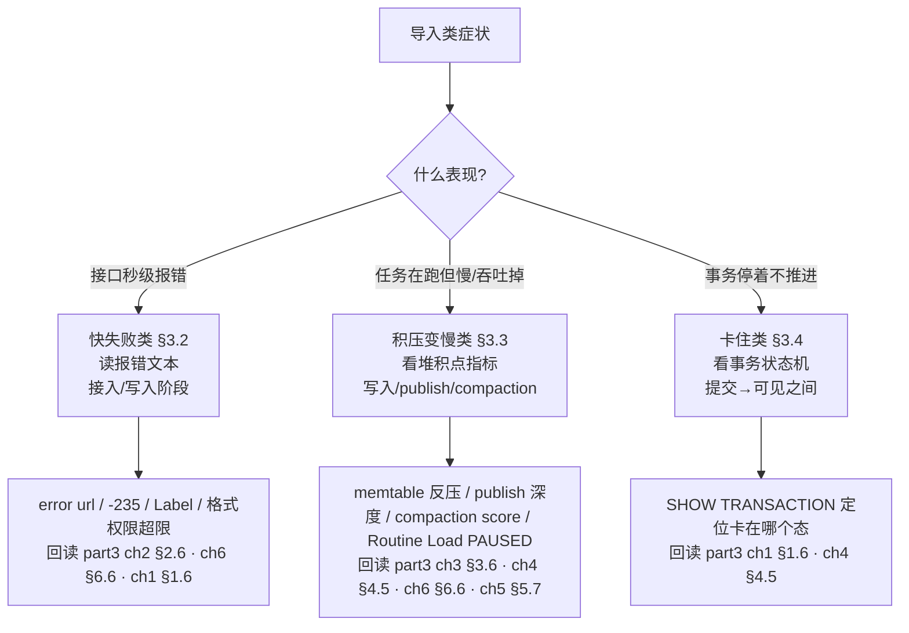
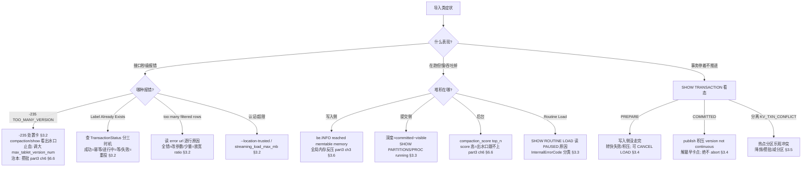

# 第 3 章：导入类故障 —— 失败、积压与事务卡住

> 本章行号引用基于写作时核实所用的 HEAD（`b793dc3109`，源码树与系列基线一致）。文中所有 `路径:行号` 均在该版本核实；代码演进会让行号漂移，但报错文本的拼装点、语法规则、配置可变性、字段来源不变。跨部分回引均已 grep 目标文件确认内容真实存在。

前两章立了方法论（[第 1 章](./01-toolbox.md) §1.5 的"慢/错/挂/涨"决策树）并走细了查询侧（[第 2 章](./02-query-issues.md)）。本章处理另一大类症状——**导入出问题**。第 3 部分（part3）用六章把一批数据从 `begin_txn` 讲到 `VISIBLE`，每章末尾都留了一张排查清单：ch1 事务状态与 Label（§1.6）、ch2 接入与数据质量（§2.6）、ch3 写入与 memtable 反压（§3.6）、ch4 提交与 publish 积压（§4.5）、ch5 其他导入方式与 Routine Load（§5.7）、ch6 compaction 与 -235（§6.6）。本章的工作不是重讲这些机制，而是**把六章的清单按"故障怎么表现给运维"重新组织成三类，并为跨章散落的根因（尤其 -235）缝成一页可执行的处置卡**。机制细节一律链接回 part3，本章的增量在于**组织方式 + 因果反直觉的判别方法 + 命令与语法的现场核实**。

## 3.1 问题：导入故障先分"哪一段"

**遇到了什么问题？** 业务反馈"数据导不进去"——可能是接口直接报错、可能是"任务一直没结束"、也可能是"提交了但查不到"。你拿到的又是一个**症状**。导入链路和查询一样长（接入→写入→提交→可见，横跨客户端、协调 BE、目标 BE、FE、MetaService），同一句"导入有问题"能落在完全不同的段落。

**候选方案与权衡（三种分诊组织方式）。**

- **候选一：按报错码查。** 看到 `-235` 就查版本、看到 `Label Already Exists` 就换 Label。问题和 §2.1 否掉的一样——**同一个信号背后是多种情形**：`Label Already Exists` 可能是幂等在正确挡重复（无需处理），也可能是上一次还在跑（等待即可），还可能是真需要重导却被残留事务挡住（§3.2）；`-235` 更是"报错"（写入侧）、"像 publish 卡点"（提交侧误判）、"治本在 compaction"三张面孔（§1.5 已拆过）。报错码是收窄线索，当充分诊断就会照字面开错药。
- **候选二：按导入方式查。** Stream Load 一套、Broker Load 一套、Routine Load 一套。问题是 part3 ch5（§5.7）已经论证过——四种导入方式**共用同一条内核**（起事务→起计划→sink→commit），只在最前端换取数方式。按方式分会把同一个内核根因（如 publish 积压、-235）在每种方式里重复讲一遍，且掩盖了"作业态是果、事务态是因"这条通用主线。
- **候选三：按故障的表现形态分三类。** 导入的三种表现对应链路上三种截然不同的处境：**快失败**（接口秒级返回错误，链路还没走完就被挡下）、**积压/变慢**（链路在走但堆积在某个瓶颈点、吞吐掉下来）、**卡住**（事务停在状态机某个态迟迟不推进）。这三类的第一件工具、定位主键、处置方向完全不同——快失败读报错文本、积压看堆积点指标、卡住看事务状态机。part3 的链路（接入→写入→提交→可见）天然就是这张分诊图：报错发生在接入/写入阶段的是快失败，堆积在写入/publish 的是积压，停在提交/可见之间的是卡住。

**本章怎么解决？** 选候选三。part3 的四段链路是坐标系，三类表现是入口：

> 记住一条：**报错决定"从哪条支流进来"，链路阶段决定"顺流走到哪里"，事务状态机决定"卡在哪里出不去"。** 三类共享 §1.5 决策树的入口——快失败落在"错"、积压落在"涨"、卡住落在"挂"，本章只把落到"导入"之后的路走细。

## 3.2 快失败类：报错的读法

快失败的共同特征是**接口秒级返回、链路没走完**。处置的第一动作永远是**读懂报错文本**，而不是猜。这一节把 part3 各章的快失败根因按"一句话分流"排开，把最重要的 -235 单独浓缩成一页处置卡。

### error url：数据质量失败的第一入口

Stream Load / Broker Load 报 `too many filtered rows` 时，返回体里的 `ErrorURL` 字段是逐行过滤原因的唯一入口——直接 `curl` 它就能看到每一行为什么被丢（`column count mismatch`、类型转换失败等）。这个 url 由 `to_load_error_http_path` 生成、指向**协调 BE 的 webserver 端口**（不是 FE），赋值点在 `be/src/load/stream_load/stream_load_executor.cpp:101`。机制与"个别脏行 vs 全行解析错"的区分在 part3 [第 2 章](../part3-load-lifecycle/02-stream-load-path.md) §2.6 已讲透，本章只给分流：**过滤率接近 100% = 形态设错**（`column_separator`/`columns`/`format` 不匹配），调 `max_filter_ratio` 无解、得改参数；**少量脏行**才是放宽 `max_filter_ratio`（默认 0，零容忍）的场景。

### -235 处置卡（跨 part3 四章的一页浓缩）

`-235` 在 part3 的 ch2/ch4/ch5/ch6 都出现过，散在四张清单里。它是本部分"点连成线"的样板根因，值得缝成一页——**这张卡的价值是浓缩，机制全在链接里，不在这里重讲**：

| 维度 | 内容 |
|---|---|
| **报错原文** | `[E-235] TOO_MANY_VERSION`（`TOO_MANY_VERSION` = -235，定义在 `be/src/common/status.h:120`）；BE 报错还会附 "reduce the frequency of loading data or adjust the `max_tablet_version_num`" |
| **抛出点** | 写入 **prepare 阶段**的 `RowsetBuilder::check_tablet_version_count`（`be/src/storage/rowset_builder.cpp:173`，返回在 `:182`），由 `RowsetBuilder::init`（`be/src/storage/rowset_builder.cpp:212`，`:222` 调用）触发——**发生在 commit 之前，不在 publish 日志里** |
| **根因链** | 导入太碎 → rowset/version 堆积 → compaction（唯一的版本出水口）追不上 → 版本数触达 `max_tablet_version_num` → 下一次写入在 prepare 阶段直接 fast-fail |
| **三查** | ①在**写入报错**里找、别翻 publish 日志（part3 [第 4 章](../part3-load-lifecycle/04-commit-and-visibility.md) §4.5 特意澄清）；②`curl '.../api/compaction/show?tablet_id=<id>'` 看 score 与 rowset 数、`.../api/compaction/run_status` 看 compaction 在不在跑（part3 [第 6 章](../part3-load-lifecycle/06-compaction.md) §6.5）；③分清**进水太猛还是出水太堵**（part3 §6.6） |
| **止血（治标）** | 临时调大 `max_tablet_version_num`（`DEFINE_mInt32`，`be/src/common/config.cpp:915`，运行时可 `update_config` 热改）续命；对高 score tablet 手动 `POST .../api/compaction/run` 催合并 |
| **治本** | 让 compaction 从源头少产 rowset——攒批：Insert 开 `group_commit`、Routine Load 调大 `max_batch_interval`（part3 [第 5 章](../part3-load-lifecycle/05-other-load-paths.md) §5.3）、限导入频率（part3 §6.6） |

**一句话记住这张卡**：看到 -235，别去 publish 日志、别急着换表，先 `compaction/show` 看出水口堵没堵，止血靠调大版本上限、治本靠攒批让 compaction 追上。

### Label 冲突：三时机决定三种处置

`Label Already Exists` 最容易被误当成"该换 Label 了"。part3 [第 1 章](../part3-load-lifecycle/01-load-overview-and-txn.md) §1.5/§1.6 用实验把三种时机钉在了代码上，处置各不相同：

| 时机 | 上次事务状态 | `ExistingJobStatus` | 处置 |
|---|---|---|---|
| 已成功 | `COMMITTED`/`VISIBLE` | `FINISHED` | **幂等在挡重复**，这批已入库、无需重导 |
| 进行中 | `PREPARE`/`PRECOMMITTED` | `RUNNING` 等 | 上一次还没结束，**等它完成或超时** |
| 已失败 | `ABORTED` | —— | 同 Label 重投会**正常放行开新事务**，直接重导 |

判据是 `SHOW TRANSACTION ... WHERE label='...'`（语法 `#showTransaction`，`fe/fe-sql-parser/src/main/antlr4/org/apache/doris/nereids/DorisParser.g4:489`）看 `TransactionStatus`。**反向隐患**：老 Label 补数时"意外放行导致重复导入"，多半是 Label 已过 `label_keep_max_second`（`fe/fe-common/src/main/java/org/apache/doris/common/Config.java:178`）窗口被清、幂等失效——需要长幂等窗口就调大它（part3 §1.6 症状 B）。

### 格式 / 权限 / 超限：一句话分流

- **认证失败但账号确有 LOAD 权限**：首查 `--location-trusted`——Stream Load 经 FE 307 重定向到 BE，curl 默认不把 `Authorization` 透传到另一 host（part3 §2.6 症状 A）。再查库表 LOAD 权限本身（FE 侧 `checkTblAuth` 在走到 BE 前就拦）。
- **超大 body 秒失败**：报 `body size ... exceed BE's conf` 是 header 阶段的体量检查，CSV 调 `streaming_load_max_mb`、JSON 调 `streaming_load_json_max_mb` 或开 `read_json_by_line`（part3 §2.6 症状 C）。
- **查作业级历史**：`SHOW [STREAM] LOAD`（`#showLoad`，`fe/fe-sql-parser/src/main/antlr4/org/apache/doris/nereids/DorisParser.g4:455`）看 `State` 与错误信息，`SHOW LOAD WARNINGS`（`#showLoadWarings`，`:457`）看告警明细。

## 3.3 积压与变慢类

积压的共同特征是**链路在走、但堆积在某个瓶颈点，吞吐掉下来**。它对应 §1.5 的"涨"分支。part3 有三个堆积点，各有指纹：

- **写入侧：memtable 全局内存反压。** 指纹是 BE `be.INFO` 里 `reached memtable memory`（`be/src/load/memtable/memtable_memory_limiter.cpp:157`）。看到它说明是**全局 memtable 内存水位**在反压——所有并发导入一起变慢、调单张表参数无效。三个下手方向（降总占用 / 加快 flush / 抬水位）与"水位百分比须重启才生效"的坑见 part3 [第 3 章](../part3-load-lifecycle/03-tablet-write-path.md) §3.6。
- **提交侧：publish 积压深度。** 观测法是 **`积压深度 = committedVersion − visibleVersion`**（`fe/fe-core/src/main/java/org/apache/doris/catalog/Partition.java:245`）：`SHOW PARTITIONS` 盯 `VisibleVersion` 涨不涨，`SHOW PROC '/transactions/<dbId>/running'` 里堆积的 `COMMITTED` 事务个数就是直观积压。卡点定位（`version not continuous` 队头阻塞）见 part3 §4.5，本章 §3.4 会把它当"卡住"再展开。
- **后台侧：compaction 追不上。** `curl '.../api/compaction_score?top_n=N'` 看 score 最高的 tablet，`.../api/compaction/show?tablet_id=<id>` 看某 tablet 的 rowset 数与 cumulative point。score 高企 = 版本出水口跟不上，是 -235 的前兆（part3 §6.6）。

### Routine Load：消费积压与 PAUSED 原因

Routine Load 常驻消费，积压表现为 offset lag 拉大、或作业进入 `PAUSED`。`SHOW [ALL] ROUTINE LOAD`（`#showRoutineLoad`，`fe/fe-sql-parser/src/main/antlr4/org/apache/doris/nereids/DorisParser.g4:519`）看 `State` 与 `ReasonOfStateChanged`/`ErrorLogUrls`。`PAUSED` 是**可恢复态**，关键是读暂停原因——真实的原因类别来自 `InternalErrorCode` 枚举（`fe/fe-common/src/main/java/org/apache/doris/common/InternalErrorCode.java:20` 起），各有明确的抛出点（下表行号均在 `fe/fe-core/src/main/java/org/apache/doris/load/routineload/RoutineLoadJob.java`）：

| 暂停原因（`InternalErrorCode`） | 值 | 抛出行 | 含义与处置 |
|---|---|---|---|
| `TOO_MANY_FAILURE_ROWS_ERR` | 102 | `:941`/`:976` | 错误行超 `max_error_number`——去 `ErrorLogUrls` 看是 schema 不匹配还是格式错 |
| `TASKS_ABORT_ERR` | 104 | `:1355` | 子任务在 BE 被 abort（含反复因 **-235** 提交失败）——查是否小事务风暴、调大攒批 |
| `INTERNAL_ERR` | 2 | `:1188` | commit 后处理失败等通用内部错（Kafka 连接类报错也常带 Kafka 原文走此路） |
| `CANNOT_RESUME_ERR` | 105 | `:1318`~`:1339` | 自动续跑放弃——需人工介入 |
| `DB_ERR` / `TABLE_ERR` | 5 / 6 | `:1555`/`:1583` | 库/表被删 |
| `MANUAL_PAUSE_ERR` | 100 | —— | 人工 `PAUSE ROUTINE LOAD`（非故障） |

读原因后：错误行类查 `ErrorLogUrls` 修数据，-235 类调大攒批（`max_batch_interval`，part3 §5.3），Kafka 类看 reason 里的 Kafka 原文，确认可恢复再 `RESUME ROUTINE LOAD`（`fe/fe-sql-parser/src/main/antlr4/org/apache/doris/nereids/DorisParser.g4:516`）。

### tricky 点：积压的因果链常反直觉——两种"锅"的判别

积压最坑的地方是**因果反直觉**：慢的表象和真正的瓶颈常常不在同一侧。两种典型误判，各给基于 ch1 工具的判别步骤：

**误判一：查询慢，其实是导入的锅（版本堆积拖慢合并读）。**
1. 用审计日志（§1.2）拿该 SQL 的 `QueryTime`，按 `SqlHash` 聚合看耗时是否**尖刺状**、尖刺是否与导入高峰对齐（part6 [第 2 章](./02-query-issues.md) §2.2 偶发慢的"版本数"时变因素）。
2. 取 profile 看 scan 段——若耗时花在**多 rowset 合并读**而非 IO 本身，指向版本堆积。
3. 坐实：`curl '.../api/compaction/show?tablet_id=<id>'` 看该 tablet 的 rowset 数/score 是否高企。三步都指向版本，则**治本在 compaction 不在改 SQL**。

**误判二：导入慢，其实是查询的锅（大查询争抢磁盘 IO）。**
1. 先看导入侧指纹：`be.INFO` 有没有 `reached memtable memory`。**有** = 全局内存反压、是导入自己的锅（转 §3.3 写入侧）；**没有**，继续。
2. 看磁盘 IO util 是否打满、flush 是否慢在磁盘而非线程（part3 §3.6 症状 A）。
3. 用 metrics（§1.4）看同时段 `query_scan_bytes` 是否飙升、是否有大查询在扫。IO 打满 + 大查询扫描并存、且无 memtable 反压 = **查询争抢 IO**，退路是给导入/查询分资源组或错峰。

判别的共同心法：**别用"谁慢"下结论，用指纹区分"谁在占资源"**——memtable 反压日志、compaction score、`query_scan_bytes` 各自指向不同的锅。积压之所以反直觉，根子在于**症状和成因之间隔着一层异步后台**：导入攒下的版本欠账，要等到后台 compaction 追不上、或查询侧合并读时才暴露成"慢"；而暴露的时刻和地点（一条慢查询、一个慢导入）往往离真正的成因（几分钟前的一波碎导入）很远。所以判别的关键不是"当下谁慢"，而是**顺着指纹回溯到资源占用的源头**——这也是为什么三步判别都以"看指纹是否指向版本堆积/内存反压/IO 争抢"收尾，而不是停在"某条慢"。

还有一类更隐蔽的反直觉：**导入把查询拖慢、查询又反过来拖慢导入，形成互噬**。高峰期碎导入堆版本 → 查询合并读变慢、扫描量变大 → 大查询占满磁盘 IO → 导入 flush 变慢、攒更多 memtable → 版本堆得更狠。这个环一旦转起来，单看任何一侧都像"对方的锅"。破环的抓手是**先看有没有 memtable 反压日志**：有反压先给导入让内存/加 flush，没反压且 IO 打满则先给查询/导入分资源组错峰——**先切断资源争抢，再回头治版本欠账**，而不是在环里反复横跳。

## 3.4 卡住类：事务状态机定位

卡住的共同特征是**事务停在状态机某个态迟迟不推进**，对应 §1.5 的"挂"分支。part3 ch1 的 `TransactionState` 状态机（`PREPARE →（PRECOMMITTED）→ COMMITTED → VISIBLE / ABORTED`）就是这里的坐标系。定位第一步永远是**看它停在哪个态**：`SHOW TRANSACTION ... WHERE label='...'` 看 `TransactionStatus` + `CommitTime`/`PublishTime`，或 `SHOW PROC '/transactions/<dbId>/running'`（PROC 树的 `/transactions` 子目录，见 §1.3 地图）看堆积。

| 卡在哪个态 | 判据 | 卡因清单 | 处置 |
|---|---|---|---|
| **PREPARE** | 在 `running` 且无 `CommitTime` | 写入侧没走完：flush 反压 / broker task 慢 / 秒级则是 -235 fast-fail | 转 §3.2/§3.3 查写入侧；作业若可取消用 `CANCEL LOAD` |
| **COMMITTED** | 在 `running`，有 `CommitTime` 无 `PublishTime` | publish 积压：副本不可达/版本不连续**队头阻塞**（`be.INFO` 搜 `version not continuous`，`be/src/storage/task/engine_publish_version_task.cpp:370`，该串为 MoW 表专有；非 MoW 表的版本空洞走异步 publish，观测以积压深度为准），或 `PublishVersionDaemon`（`fe/fe-core/src/main/java/org/apache/doris/transaction/PublishVersionDaemon.java:60`）积压 | 找**最早卡住**的 tablet/版本解除（修副本/等前序），后面自然疏通；**绝不 abort**（见下） |
| **分离模式 commit 冲突** | FE 日志 `KV_TXN_CONFLICT ... retryTime` 涨（`fe/fe-core/src/main/java/org/apache/doris/cloud/transaction/CloudGlobalTransactionMgr.java:840`） | 高频提交同一热点分区争 `partition_version_key`；或单批太大报 `TXN_BYTES_TOO_LARGE`（`cloud/src/meta-service/meta_service_txn.cpp:3336`） | 降单分区提交频率、攒批、减少单批涉及的分区/tablet 数（part3 §4.5 症状 C） |

### 易错点：手动 abort 事务的边界与风险

运维常想"这个事务卡住了，我手动 abort 掉重来"。**先核实能力边界**——在 g4 里 grep 确认：**不存在 `ABORT TRANSACTION` 或 `CLEAN TRANSACTION` 这样的 SQL**（`fe/fe-sql-parser/src/main/antlr4/org/apache/doris/nereids/DorisParser.g4` 里没有对应规则）。内部的 `abortTransaction` 是 FE API（`fe/fe-core/src/main/java/org/apache/doris/transaction/GlobalTransactionMgrIface.java:121`、`:126`），由导入失败路径**自动**调用，不对用户暴露成 SQL。用户手里真正能用的三件：

- **`CANCEL LOAD`**（`#cancelLoad`，`fe/fe-sql-parser/src/main/antlr4/org/apache/doris/nereids/DorisParser.g4:637`）：取消处于**可取消态**（如 `PREPARE`/`LOADING`）的导入作业，内部触发 abortTransaction。
- **`STOP ROUTINE LOAD`**（`:518`）：停掉常驻的 Routine Load 作业。
- **显式事务 insert 的 `ROLLBACK`**（`TransactionRollbackCommand`，`fe/fe-core/src/main/java/org/apache/doris/nereids/trees/plans/commands/TransactionRollbackCommand.java:64` 调 `abortTransaction`）：仅用于客户端显式开启的事务块。

**关键边界与风险：`COMMITTED` 事务不可 abort、不可回滚**——状态机只进不退（part3 §1.6 症状 A、§4.2 tricky 点一）。对卡在 `COMMITTED` 的正确做法是**让 publish 重试直到 `VISIBLE`**（解卡点：修副本、等队头前序），而不是想办法取消它。风险在于：卡在 `COMMITTED` 说明数据其实已经提交成功、只是还没点亮，此时若误以为"失败了"而反复重导，只会在同一批数据上叠更多版本、把 compaction 压得更狠——**把"等 publish"误当成"导入失败"，是这类故障最常见的二次伤害**。

反过来，`PREPARE` 态的事务是**可以**安全终止的：它还没 commit，abort 掉不会留下半可见的数据，`CANCEL LOAD` 走的正是这条路（内部 abortTransaction）。所以"能不能手动终止"的判据不是"卡了多久"，而是**看 `SHOW TRANSACTION` 里有没有 `CommitTime`**——没有（`PREPARE`）就能取消，有（`COMMITTED`）就只能等 publish。另一个常被忽略的兜底：即便你不动手，`PREPARE` 态的在途事务也会在超时后被 FE 自动 abort、Label 随之释放（part3 §1.6 症状 C 的事务配额也靠这条自愈回收），所以很多"卡在 PREPARE"的作业其实等一等就自己清了，动手 `CANCEL LOAD` 只是想立刻腾出事务配额时才需要。**记住这条边界，就不会在 `COMMITTED` 上做无用功、也不会对 `PREPARE` 过度紧张。**

## 3.5 双模式对比

导入故障的三类框架两模式共用，只有两个**分叉点**需要标注，分别是各模式专属的一类根因：

- **publish 类卡住——存算一体专属。** 一体模式有 per-BE 的 publish 阶段（`PublishVersionDaemon` 逐 BE 下发、副本各自接版本链），所以"卡在 `COMMITTED` 不 `VISIBLE`""`version not continuous` 队头阻塞""副本 `VERSION_ERROR` 待修复"这一整类都是一体专属（part3 §4.5 症状 A/B）。分离模式把 commit 与 publish 折叠进 MetaService 的一次 FDB 事务、没有 per-BE publish，这类问题不存在。
- **MS commit 冲突——存算分离专属。** 分离模式的 commit 走 FDB 乐观并发，高频提交同一热点分区会撞 `KV_TXN_CONFLICT` 反复重试（§3.4 表第三行），这是一体模式没有的性能特征。查不到刚导入的数据时，分离侧还要多查一层 BE 是否 pull 到新版本（`sync_rowsets`，part3 §4.5 症状 A）。

一句话：**一体模式把数据钉在多副本、代价是 publish/副本健康度这一类卡住；分离模式把提交收敛到 FDB、代价是热点分区的乐观并发冲突。** 决策树在"卡住"分支按这两点分叉，其余共走一条路。

值得点一句的是：这两个分叉点其实是**同一个设计权衡的两面**。一体模式为了让每个 BE 本地就能提供读，付出的是"版本要在多副本上逐个点亮"的 publish 成本；分离模式为了让计算无状态、数据只有一份在对象存储，付出的是"所有提交都要过 MetaService 这道单点串行化"的冲突成本。所以排查时的第一反射也应随模式切换：一体集群导入卡住，先怀疑副本与 publish；分离集群导入变慢/冲突，先怀疑热点分区与 FDB 重试。把模式当成排查的**前置分流开关**，能省掉一半试错。

## 3.6 故障演练

环境（编译、单机多 BE 部署）沿用 part1 [第 5 章](../part1-architecture/05-source-map-and-dev-env.md)，不重复。两个演练：核心点从**运维视角**反向定位 -235，易错点亲手造 publish 积压并观察深度。

### 演练一（核心点）：从"用户报导入失败"反向定位到 compaction 落后

**目标**：part3 §6.5 实验二是从"关小出水口"正向制造 -235；这次**换成运维入口**——只拿到"用户报导入失败"，用 ch1 工具反向定位到根因是 compaction 落后。

1. **制造现场**（复用 part3 §6.5 实验二手法）：`curl '.../api/update_config?cumulative_compaction_min_deltas=100000'`（`DEFINE_mInt64` 可热改）关死 cumulative compaction，`curl '.../api/update_config?max_tablet_version_num=50'` 降低堤坝，然后对一张表逐条 `INSERT` 灌水，直到某次报 `[E-235] TOO_MANY_VERSION`。
2. **运维视角接手**：只知道"导入失败"。按 §1.5 归类——有 `ErrorCode`、秒级返回，是"错 / 快失败"。先**读报错文本**确认是 -235（不是 publish 卡点，§3.2 处置卡第一查）。
3. **反向定位**：从报错里拿到 tablet id，`curl '.../api/compaction/show?tablet_id=<id>'` 看 rowset 数正卡在 `max_tablet_version_num`、score 高企、cumulative point 不动；`.../api/compaction/run_status` 确认 compaction 没在跑——**根因锁定为出水口堵死**。
4. **坐实抛点**：BE `be.INFO` 里报错来自写入 prepare 阶段的 `RowsetBuilder::check_tablet_version_count`（`be/src/storage/rowset_builder.cpp:173`），不在 publish 日志——复刻处置卡的"三查①"。
5. **处置并验证**：按处置卡治本——把两个配置调回默认、手动 `compaction/run` 催合并；`compaction/show` 里 rowset 数一路回落、新导入不再 -235。**改善用 rowset 数坐实，不是"感觉好了"**。

走完这条链，你就把处置卡从"报错原文"一路走到了"治本动作"，且入口是运维现场真正会拿到的那个（用户报失败），而非上帝视角。

### 演练二（易错点）：停 BE 制造 publish 积压，观察 SHOW PROC 深度并恢复

**目标**：亲手把一个 BE 停掉制造 publish 积压，用 §3.3 的深度指标观察堆积、再恢复，体会"卡在 COMMITTED ≠ 导入失败"。

1. **准备**：一张多副本表（或多 BE 单机集群），确认导入正常、`VisibleVersion` 正常推进。
2. **制造积压**：停掉一个持有副本的 BE 进程（用停机脚本或直接 kill）。持续对该表导入——因副本不可达/版本不连续，publish 卡住。
3. **观察深度**：`SHOW PARTITIONS` 看 `VisibleVersion` **不再上涨**；`SHOW PROC '/transactions/<dbId>/running'` 看堆积的 `COMMITTED` 事务个数持续增加——`积压深度 = committedVersion − visibleVersion`（§3.3）在肉眼可见地涨。
4. **找卡点**：若为 MoW 表，目标 BE 的 `be.INFO` 搜 `version not continuous`（`be/src/storage/task/engine_publish_version_task.cpp:370`，MoW 专有）；非 MoW 表以第 3 步的积压深度定位最早卡住的版本。
5. **恢复**：把停掉的 BE 拉起来。publish 重试疏通、副本被修复线补齐，`VisibleVersion` 追上、`running` 里的 `COMMITTED` 清空。
6. **易错点（本演练的真正目的）**：过程中那些卡在 `COMMITTED` 的事务**数据其实已经提交成功**——绝不能 abort（§3.4，只进不退）。恢复靠**补副本 + publish 重试**，不靠取消。如果这时误判成"导入失败"去重导，只会雪上加霜。

## 3.7 排查清单（决策树浓缩版）

入口与 §1.5 一致，落到导入后按三类表现分流：

配套速查要点：

| 表现 | 第一件工具 | 定位主键 | 处置入口 |
|---|---|---|---|
| 报 -235 | 读报错 → `compaction/show` | tablet 的 score/rowset 数 | -235 处置卡（§3.2） |
| `Label Already Exists` | `SHOW TRANSACTION` 看态 | `TransactionStatus` 三时机 | 成功=无需重导 / 失败=重投（§3.2） |
| 数据质量失败 | `curl` error url | 逐行过滤原因 | 全错改参数 / 少量放宽 ratio（§3.2） |
| 导入集体变慢 | `be.INFO` 搜反压日志 | `reached memtable memory` | 降占用/加 flush/抬水位（§3.3） |
| publish 积压 | `SHOW PARTITIONS` / PROC | `committed − visible` 深度 | 解最早卡点、别 abort（§3.4） |
| Routine Load PAUSED | `SHOW ROUTINE LOAD` | `InternalErrorCode` 类别 | 修数据 / 攒批 / 查 Kafka（§3.3） |
| 卡在 COMMITTED | `SHOW TRANSACTION` | 有 commit 无 publish | 修副本 + publish 重试（§3.4） |

---

本章把 part3 六章散落的导入排查清单，按运维真正看到的三种表现——**快失败、积压、卡住**——缝成了一条处置线。它和前两章的关系是：§1.5 决策树把"慢/错/挂/涨"这一跳固定下来，本章把落到"导入"之后的路走细。三条纪律收束：**分诊靠表现形态与链路阶段、不靠报错码字面、更不靠导入方式**（-235 三张面孔、Label 三时机都是反例）；**跨章根因缝成处置卡**——-235 从报错原文到治本动作一页可查，机制全在链接里；**卡在 COMMITTED 不是失败**——只进不退，靠 publish 重试而非 abort，误判会造成二次伤害。下一章转向存储层——一体模式的副本与均衡、分离模式的缓存与计算组。
