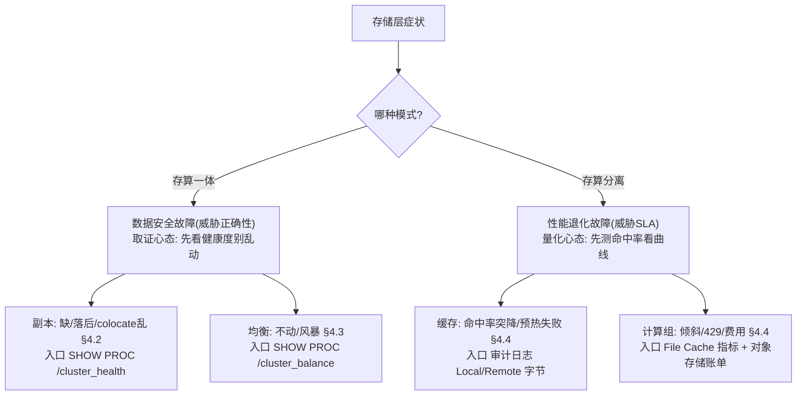
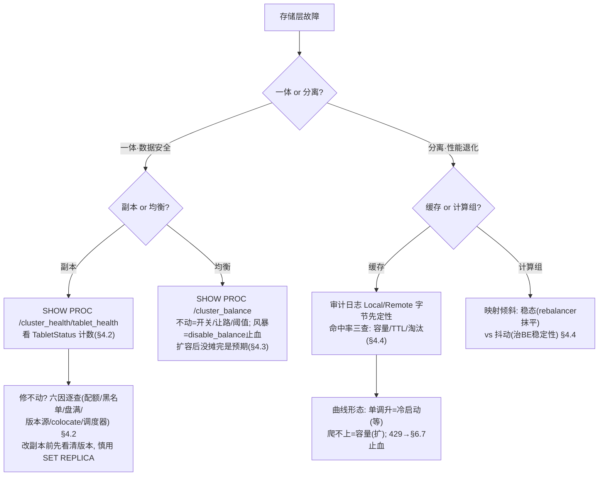

# 第 4 章：副本与均衡故障（一体）／缓存与计算组故障（分离）

> 本章行号引用基于写作时核实所用的 HEAD（`79e42edd95`，源码树与系列基线一致）。文中所有 `路径:行号` 均在该版本核实；代码演进会让行号漂移，但 `TabletStatus` 枚举、ADMIN 命令的语义、PROC 树路径、File Cache 端点不变。跨部分回引均已 grep 目标文件确认内容真实存在。

前三章沿着 [第 1 章](./01-toolbox.md) §1.5 的"慢/错/挂/涨"决策树，把查询侧（[第 2 章](./02-query-issues.md)）和导入侧（[第 3 章](./03-load-issues.md)）走细了。本章转向**存储层**——数据本身的看护与取用出问题时怎么办。这一层的机制在前部讲得最透：存算一体的副本修复与均衡在 [part4 第 5 章](../part4-fe-internals/05-scheduling.md)，存算分离的 File Cache 与对象存储交互在 [part5 第 6 章](../part5-storage-engine/06-cloud-storage.md)。本章不重讲这些机制（一律链接回前部），增量在于**把两部的排查清单展开成运维可执行的处置手册、把 ADMIN 危险命令的真实效果核到源码、并给出真故障与预期现象的判别方法**。

本章是全部分唯一**双模式各占半章**的一章：4.2/4.3 是一体的副本与均衡故障，4.4 是分离的缓存与计算组故障。之所以并置，是因为它们在 4.1 会看到——**是同一层的故障在两套物理现实下的两副面孔**。

## 4.1 问题：同一层故障、两套物理现实

**遇到了什么问题？** 存储层出问题的表现，在两种架构下看起来相似（都可能是"某张表查不动了""集群在搬数据"），但底下是两套完全不同的物理现实，**排查心态和第一件工具都不一样**。

**原理三连问。**

**其一，一体和分离的存储层故障，本质差别是什么？** 差在"数据有没有可能真的丢"。存算一体下，数据是 BE 本地盘上的三份实体副本，[part4 第 5 章](../part4-fe-internals/05-scheduling.md) §5.1 讲的——BE 会宕、盘会坏、quorum 提交会放过掉队副本，于是副本会**真的缺、真的落后**。这类故障威胁的是**正确性**：副本掉到零就是数据丢失，掉到一就是高危。而分离模式下，[part5 第 6 章](../part5-storage-engine/06-cloud-storage.md) §6.1 讲的——数据只有一份躺在对象存储上、由对象存储的多副本/纠删码兜底持久性，BE 只是无状态计算节点、本地盘只是 File Cache。[part4 第 5 章](../part4-fe-internals/05-scheduling.md) §5.4 一句话点破："BE 挂了，数据一个字节都不会丢"。所以分离模式**根本没有"副本缺失"要修**，它的故障威胁的是**性能与成本**：cache 没命中、计算组不均、对象存储被限流——是 SLA 退化，不是数据危险。

**其二，这个差别怎么改变排查心态？** 一体的副本故障要用**取证心态**：副本数在掉、时间窗口在缩，每一步操作（尤其 ADMIN 改副本状态）都可能造成不可逆的数据损失，所以第一动作是"先看清健康度、别乱动"，[第 1 章](./01-toolbox.md) §1.7 那条"重启大法毁现场"在这里升级成"误标副本毁数据"。分离的缓存故障要用**量化心态**：命中率、请求数、费用都是可以测的连续量，没有"不可逆"的悬崖，第一动作是"测命中率、看曲线形态"，判断是真退化还是预期内的冷启动。一个怕手抖，一个怕误判。

**其三，两套现实对应两套工具入口？** 是。一体副本故障的权威视图是 FE 的 `SHOW PROC '/cluster_health'` 与 `/cluster_balance`（副本健康计数、调度队列，[第 1 章](./01-toolbox.md) §1.3 的 PROC 地图），因为副本调度是 FE Master 的职责；分离缓存故障的权威视图是 BE 的 File Cache 指标与 `fe.audit.log` 里的 `ScanBytesFromLocalStorage`/`FromRemoteStorage` 两个字段（[第 1 章](./01-toolbox.md) §1.2）——命中还是回落对象存储，一条查询的审计行就能定性，成本几乎为零。

## 4.2 一体模式：副本故障手册

### tablet 不健康状态速查（回引 12 状态表）

一切副本故障的起点都是**读懂 tablet 处在哪个不健康状态**——[part4 第 5 章](../part4-fe-internals/05-scheduling.md) §5.2 的 `TabletStatus` 枚举（定义在 `fe/fe-core/src/main/java/org/apache/doris/catalog/Tablet.java:59`）共 12 个值，那里有完整的一一对照表，本章不复述。运维现场真正高频、且**处置方向截然不同**的是下面五个，认错就修错方向：

| 状态 | 运维看到什么 | 处置方向 | 危险度 |
| --- | --- | --- | --- |
| `REPLICA_MISSING` | 副本个数不够（一台 BE 死了） | 全量克隆补一份 | 中 |
| `VERSION_INCOMPLETE` | 个数够但有副本版本落后 | 增量克隆补版本（别整份搬） | 低 |
| `COLOCATE_MISMATCH` | colocate 副本没落在规定 BE 集合 | 走 colocate 专用通道（§4.3） | 中 |
| `FORCE_REDUNDANT` | 有副本坏/缺但无处修，只能先删一个腾位 | 已是"没处修"的信号，查为什么补不了 | 高 |
| `UNRECOVERABLE` | 没有一个副本健康，调度器放弃 | 调度救不了，人工补 BE/清盘/找备份 | 极高 |

看这张表的权威工具是 `SHOW PROC '/cluster_health/tablet_health'`（PROC 树注册见 `fe/fe-core/src/main/java/org/apache/doris/common/proc/ProcService.java:55`），它按库列出各状态的计数——列名 `ReplicaMissingNum`/`VersionIncompleteNum`/`ForceRedundantNum`/`UnrecoverableNum` 等一一对应上表（`fe/fe-core/src/main/java/org/apache/doris/common/proc/TabletHealthProcDir.java:59`-`64`）。要精确到某张表的哪些副本坏，用只读诊断命令 `ADMIN SHOW REPLICA STATUS FROM tbl WHERE STATUS = "VERSION_INCOMPLETE"`（语法 `#adminShowReplicaStatus`，`fe/fe-sql-parser/src/main/antlr4/org/apache/doris/nereids/DorisParser.g4:659`）。**`REPLICA_MISSING` 与 `VERSION_INCOMPLETE` 差之毫厘**（§5.2 已详解成因）：前者缺个数、要全量克隆；后者只差版本、要增量克隆。判反了要么白搬几个 GB，要么永远补不齐。

### 修复不动的六因（处置卡）

`ReplicaMissingNum` 居高不下、副本迟迟不补回来，是最常见的求助。[part4 第 5 章](../part4-fe-internals/05-scheduling.md) §5.6 已按调度链路给出成因，这里展开成"逐因 + 证据命令"的处置卡——每一条都用 [第 1 章](./01-toolbox.md) 的工具取证，别凭猜：

| 因 | 机制 | 证据命令（ch1 工具） |
| --- | --- | --- |
| **配额占满/调太小** | 在途调度受 `max_scheduling_tablets` 限流（§5.2） | `SHOW PROC '/cluster_balance/pending_tablets'` 是否顶到上限（路径常量 `fe/fe-core/src/main/java/org/apache/doris/common/proc/ClusterBalanceProcDir.java:41`） |
| **调度器被关** | `disable_tablet_scheduler` 一开 REPAIR/BALANCE 全停（§5.6） | `ADMIN SHOW FRONTEND CONFIG LIKE "disable_tablet_scheduler"` |
| **盘满/无合法目标** | clone 需要一块有空间的目标盘，全满则无处落（§5.6） | `backends()` 内省表看各 BE 磁盘用量（[第 1 章](./01-toolbox.md) §1.3） |
| **克隆源被拉黑/失联** | clone 需要一个健康的源副本，源 BE 心跳失联或被判不可用则反复失败、`failedSchedCounter` 累加（§5.6） | `SHOW PROC '/cluster_balance/sched_stat'` 看失败原因 + `backends()` 看 alive |
| **版本落后无好源** | `VERSION_INCOMPLETE` 要从高版本副本增量补，若剩下的副本也都落后则补不齐 | `SHOW PROC '/cluster_health/tablet_health'` 的 `VersionIncompleteNum` |
| **colocate 约束卡住** | `COLOCATE_MISMATCH` 走独立通道（§4.3），常规队列里找不到它 | `SHOW PROC '/colocation_group'` 看组 `isStable`（注册 `fe/fe-core/src/main/java/org/apache/doris/common/proc/ProcService.java:58`） |

排查顺序建议从上往下：先确认没被关（配额/开关），再确认有处可修（盘/源），最后才是 colocate 这类结构性约束。若走到 `UNRECOVERABLE`（同时挂两台 BE 又都没回来），已经不是调度能救的——先把 BE 拉起来或补新 BE，让 tablet 至少有一个健康副本可作克隆源。

### ADMIN 命令的使用边界与危险操作（源码核实）

副本救援有四条 ADMIN 命令，它们的破坏力天差地别。**语法核实**都在 `fe/fe-sql-parser/src/main/antlr4/org/apache/doris/nereids/DorisParser.g4`，**真实效果**必须落到命令处理器——因为"命令名"和"它到底改了什么"经常不是一回事：

| 命令 | g4 规则 | 实际做什么（源码核实） | 破坏力 |
| --- | --- | --- | --- |
| `ADMIN REPAIR TABLE` | `:671` `#adminRepairTable` | **只是催促，不强制克隆**：把分区加入"优先修复集"、抬到 `VERY_HIGH` 优先级、默认 4 小时窗口 | 安全 |
| `ADMIN CANCEL REPAIR TABLE` | `:672` `#adminCancelRepairTable` | 从优先修复集移除（`removePrios`） | 安全 |
| `ADMIN SET REPLICA STATUS` | `:670` `#adminSetReplicaStatus` | **改 FE 对副本"是否可信"的判断**（bad/ok/drop） | 危险 |
| `ADMIN SET REPLICA VERSION` | `:668` `#adminSetReplicaVersion` | **直接改写副本版本号元数据**，对 FE"撒谎" | 极危险 |

`ADMIN REPAIR TABLE` 名字像"立刻修好"，其实**只是把优先级抬高**：处理器 `AdminRepairTableCommand`（`fe/fe-core/src/main/java/org/apache/doris/nereids/trees/plans/commands/AdminRepairTableCommand.java:77`）调 `repairTable`，内部 `addPrios`（`fe/fe-core/src/main/java/org/apache/doris/clone/TabletChecker.java:156`）把分区标进优先集，默认超时 4 小时（`fe/fe-core/src/main/java/org/apache/doris/nereids/trees/plans/commands/AdminRepairTableCommand.java:99`）。checker 下一轮遇到优先集里的分区就把优先级抬到 `VERY_HIGH`（`fe/fe-core/src/main/java/org/apache/doris/clone/TabletChecker.java:391`），于是它插到调度队头优先被修。**它不新建副本、不改任何副本状态**——如果修不动的根因是"盘满""无好源"（上面六因），`ADMIN REPAIR` 抬了优先级也一样修不动，只是排在最前面反复失败。它治的是"排队太久"，不是"修不了"。

**tricky 点：`ADMIN SET REPLICA STATUS "bad"` 把好副本标坏，是数据事故。** 这条命令的处理器 `AdminSetReplicaStatusCommand` 调 `Env` 的 `setReplicaStatus`（`fe/fe-core/src/main/java/org/apache/doris/catalog/Env.java:7148`），核心逻辑在 `setReplicaStatusInternal`（`:7161`）——把它改了什么核清楚：

- `status = bad` → 调 `Replica` 的 `setBad(true)`（`fe/fe-core/src/main/java/org/apache/doris/catalog/Env.java:7180`）。`bad` 这个字段的语义在源码注释里写得很重：**"bad means this Replica is unrecoverable, and we will delete it"**（`fe/fe-core/src/main/java/org/apache/doris/catalog/LocalReplica.java:55`）。而一个 bad 副本会被判为**不 alive**（`isAlive` 的定义排除了 bad，`fe/fe-core/src/main/java/org/apache/doris/catalog/Replica.java:620`-`624`），于是 `Tablet.getHealth` 把它当成缺失，触发克隆、并最终删掉这份副本。
- `status = ok` → `setBad(false)`（`fe/fe-core/src/main/java/org/apache/doris/catalog/Env.java:7180`），清除 bad 标记，让 FE 重新信任它。
- `status = drop` → 设置 `userDropTime`（`fe/fe-core/src/main/java/org/apache/doris/catalog/Env.java:7186`），主动排期删除该副本。

**事故模式**：这条命令的正当用途是"某副本确实损坏、但 FE 还没察觉，手动告诉它别再信任、去别处重建"。危险在于——你把 `bad` 标到了**错的那一份**。设想一个 tablet 三副本里两份版本落后、只有一份是最新的，你误判"那份最新的有问题"、给它标 `bad`：FE 立刻认为唯一的好副本不 alive，按注释语义排期删除它，剩下两份落后副本又补不出丢失的版本——一个本可增量修复的 tablet 被你亲手推进了 `UNRECOVERABLE`，**数据真丢**。所以标 `bad` 前必须先用 `ADMIN SHOW REPLICA STATUS`/`SHOW TABLETS` 看清每个副本的版本，确认你标的确实是坏的那份。

`ADMIN SET REPLICA VERSION`（处理器 `AdminSetReplicaVersionCommand` → `Env` 的 `setReplicaVersion`，`fe/fe-core/src/main/java/org/apache/doris/catalog/Env.java:7205`）更危险：它**直接改写副本的版本号元数据**（version/lastSuccessVersion/lastFailedVersion）。这等于对 FE 撒谎——把一个落后副本谎报成已追平，FE 就不再给它补版本，而它实际缺的数据永远缺；反之也一样。它是最后的手动兜底工具，只在你完全清楚版本链、且其他手段都失效时用。注意这两条改状态/版本的命令在**存算分离下都被禁用**（`setReplicaVersionInternal` 开头 `if (Config.isCloudMode()) throw`，`fe/fe-core/src/main/java/org/apache/doris/catalog/Env.java:7225`；`AdminSetReplicaStatusCommand` 的 `checkSupportedInCloudMode` 直接抛 `denied`）——因为分离模式根本没有本地副本可标，呼应 4.1 的"两套物理现实"。

## 4.3 一体模式：均衡故障

均衡故障有两个相反的方向，都不是"数据危险"、而是"搬迁行为异常"，[part4 第 5 章](../part4-fe-internals/05-scheduling.md) §5.3 的机制是判别基础。

**方向一：均衡不动（该均衡却没搬）。** 表现是集群明显不均（某些 BE 盘快满、某些很空）但迟迟不摊平。查三点：(1) `disable_balance` 是不是被人开着——§5.3 讲它是大促时临时停均衡的总开关（`@ConfField(mutable = true)`，可热更，机制见 §5.3），关键时段停了忘开就会"不动"；(2) 均衡与修复共用一条管道且**修复优先**（§5.2），若集群正在大批修复副本、`pending` 队列被 REPAIR 占满，均衡自然让路、几乎停摆——这不是故障，是设计；(3) `balance_load_score_threshold`（§5.3）设太大，一点点不均达不到搬迁阈值。证据都在 `SHOW PROC '/cluster_balance'`（看 pending 里 REPAIR/BALANCE 占比）和 `ADMIN SHOW FRONTEND CONFIG`。

**方向二：均衡风暴（不该这么搬却在猛搬）。** 表现是没有故障，但集群网络和磁盘 IO 被大量 clone 打满、查询导入跟着变慢。§5.6 症状 B 给了应急：`ADMIN SET FRONTEND CONFIG ("disable_balance" = "true")` 先把均衡整个停掉、只留救命的修复，观察 IO 是否回落。根因通常是阈值太小（鸡毛蒜皮的不均也搬）或刚做完大规模扩缩容。

**易错点：扩容后期望"立刻均衡"。** 这是最常见的误解。新加一批 BE 后，老 BE 上的数据**不会瞬间摊到新 BE**——均衡是限流的后台过程：受 `max_balancing_tablets`（默认 100，§5.3）在途上限约束、又要给修复让路（修复优先），一个几十万 tablet 的集群把数据摊匀可能要跑几小时到几天。这段时间新 BE 看起来"很空"、老 BE"很满"，**属于预期，不是均衡坏了**。误以为坏了而去调大配额、催均衡，反而可能把它推向"均衡风暴"。正确做法是观察 `SHOW PROC '/cluster_balance'` 里 running/pending 的均衡任务在**稳定推进**即可——看的是"有没有在动、方向对不对"，不是"为什么还没摊完"。真扩容后的一次性摊平，让它在业务低峰跑完就行。另外要记住 §5.3 的 colocate 约束：colocate 组在扩缩容后会短暂 unstable、该组均衡被锁住、join 临时降级，等 `ColocateTableCheckerAndBalancer` 把整组重新对齐才恢复——这也是预期代价，不是 bug。

## 4.4 分离模式：缓存与计算组故障

分离模式的故障全部是**性能退化**，判别的核心是一句话：**先分清是真退化，还是预期内的冷启动窗口。**

### 命中率突降三查

命中率掉了、查询变慢、对象存储读放大，[part5 第 6 章](../part5-storage-engine/06-cloud-storage.md) §6.7 给了权威三查，这里点出每查的证据来源（File Cache 端点均沿用 §6.6 核实的 `/api/file_cache`，实现 `be/src/service/http/action/file_cache_action.cpp`）：

1. **查容量**：工作集比 cache 大就在颠簸淘汰。看 bvar `file_cache_total_evict_size`（`be/src/io/cache/block_file_cache.cpp:218`）是否持续增长；`file_cache_path` 声明容量是否顶着物理盘或触发磁盘限制模式（§6.2 易错点）。
2. **查 TTL**：是否有表误设 `file_cache_ttl_seconds` 把 TTL 预算（默认占 cache 一半）钉满、挤垮普通队列。用 `GET /api/file_cache?op=list_cache` 看队列分布（§6.6）。
3. **查淘汰风暴**：后台提前淘汰是否长期贴着水位在刷块（§6.2）。

三查的根治都指向"扩 cache 或让工作集/预热对齐容量"。而**最廉价的第一步定性**在审计日志：一条查询的 `ScanBytesFromLocalStorage` 对 `ScanBytesFromRemoteStorage`（[第 1 章](./01-toolbox.md) §1.2）——remote 占比突然变高，就是命中率掉了，不必上 BE 就能定性。

### 预热失败/慢

预热（warmup）是分离模式对抗冷启动的核心手段，链路是 [part4 第 5 章](../part4-fe-internals/05-scheduling.md) §5.4 讲的：FE 侧的 `CloudWarmUpJob`（可按整个计算组/表/多表预热，有 `PENDING/RUNNING/FINISHED/CANCELLED` 状态机）下发、BE 侧从对象存储下载灌进 cache（BE 下载链路见 [part5 第 6 章](../part5-storage-engine/06-cloud-storage.md) §6.4）。故障表现两种：**预热卡在 RUNNING 不完成**——多半是对象存储被打满（预热本身会猛拉 S3，见下一节的 429），或迁移预热超时 `cloud_pre_heating_time_limit_sec`（默认 300s，§5.4）；**预热完了命中率还是低**——预热的表/分区选错了，暖的不是查询真正读的热数据。定位先看作业状态（`SHOW` 预热作业），再回到"命中率三查"确认暖对了没有。

### 计算组倾斜与映射重算时机

分离模式的"均衡"不是搬数据、而是**改 tablet→BE 的计算映射**（§5.4 的 `CloudTabletRebalancer`）。映射的初始落点由 [part2 第 5 章](../part2-query-lifecycle/05-plan-distribution.md) §5.4 讲的 `CloudReplica` 的 `hashReplicaToBe()`——"分区哈希 + tablet 序号，对可用 BE 数取模"——决定，rebalancer 再做二次微调抹平。**倾斜**（某几台 BE 负载明显高）的成因往往在**映射重算的时机**：§5.4 讲了这个朴素取模对"可用 BE 数"敏感，[part2 第 5 章](../part2-query-lifecycle/05-plan-distribution.md) §5.4 进一步说明——一台 BE 短暂上下线会改变 `availableBes` 数量、触发 rehash，`rehash_tablet_after_be_dead_seconds`（默认 3600s）就是为了避免一次抖动把整组映射打乱而设的延迟窗口。所以判别倾斜要区分：**稳态倾斜**（取模天然的不均，靠 rebalancer 慢慢抹平）和**抖动倾斜**（BE 频繁上下线导致映射反复重洗）——后者要治的是 BE 稳定性，不是均衡器。这正是 [part2 第 5 章](../part2-query-lifecycle/05-plan-distribution.md) §5.6 症状 C"同一查询忽快忽慢"的根：若每次都慢，查映射稳不稳定。

### 对象存储 429/费用异常

对象存储按请求计费、且有 QPS 限流，两类故障相连：**429 限流雪崩**和**费用异常**，[part5 第 6 章](../part5-storage-engine/06-cloud-storage.md) §6.7 给了完整处置。429 的止血顺序：先确认是限流不是故障（BE 日志刷 "succeed after N times"、bvar `s3_file_reader_too_many_request_counter` 增长）；临时止血降扫描并发、拉长退避（`max_s3_client_retry` 等，均可热改，§6.7），或暂停正在跑的全量预热（预热会打满 S3 QPS）；治本几乎总是"命中率过低把 S3 QPS 打满"，回到命中率三查。费用异常按请求来源分解：读放大（命中率低）、写（小文件误走 multipart）、孤儿 multipart 分片泄漏（§6.3：BE 不 abort、Recycler 不管，必须靠对象存储桶 lifecycle 规则清理）。

### tricky 点：cache 冷启动窗口是预期，不是故障——用曲线形态区分

分离模式最容易被误报成"故障"的，是**加减 BE / 换计算组之后的一段慢**。§5.4 与 [part2 第 5 章](../part2-query-lifecycle/05-plan-distribution.md) §5.4 都点破了根：新 BE（或换到的新计算组）本地 cache 是空的，第一次读全 miss、要从对象存储重新拉一遍——**这是设计使然的冷启动窗口，不是故障**。判别真退化 vs 冷启动，看命中率随时间的**曲线形态**：

- **冷启动窗口**：命中率从低点**单调爬升**，`BytesScannedFromRemote` 逐次下降、趋近 0，几分钟到几十分钟后收敛到高位并稳住——§6.6 实验"冷读三次看命中率爬升"就是这条上升曲线。**会自愈，等它爬完即可**（要提速就主动 warmup）。
- **容量不足**：命中率爬到某个位置就**上不去、反复回落**，`file_cache_total_evict_size` 持续增长——工作集比 cache 大、刚暖的块又被淘汰，是 §6.6 "冷查询周期性抖动"的锯齿形。**不会自愈，得扩 cache 或缩工作集**。
- **映射抖动**：命中率**无规律地忽高忽低**，且与 BE 上下线时间对得上——是上一节的抖动倾斜，治 BE 稳定性。

一句话：**单调向上是冷启动（等）、爬不上去是容量（扩）、无规律抖是映射（稳 BE）**。把曲线画出来，三者一眼可分——这就是 4.1 说的分离模式"量化心态"。

## 4.5 故障演练

演练环境沿用 [part1 第 5 章](../part1-architecture/05-source-map-and-dev-env.md)。两个演练分别覆盖一体（需 3 BE 三副本环境）和分离（需 cloud 环境，无则做纸上推演），都从**排障视角**重走，只用 [第 1 章](./01-toolbox.md) 的工具观察。

### 核心点（一体）：kill BE，用 ch1 工具走完副本修复全流程

这是 [part4 第 5 章](../part4-fe-internals/05-scheduling.md) §5.5 的 kill-BE 实验，但从**运维排障**视角重走一遍——不看代码内部，只用 PROC 树和内省表观察每一步：

1. **取基线**：建三副本表、导入数据，`SHOW TABLETS FROM tbl` 记下副本分布，`SHOW PROC '/cluster_health/tablet_health'` 记下各计数（此刻 `ReplicaMissingNum` 应为 0）。**这一步是取证心态的体现——先存现场再动手**。
2. **制造故障**：kill 一台 BE，`SHOW PROC '/backends'` 确认它非 alive。
3. **观察发现与延迟窗口**：kill 后**不会立刻**修——`tablet_repair_delay_factor_second`（默认 60s，§5.2）给"BE 自己回来"留窗口。这段时间 `SHOW PROC '/cluster_health/tablet_health'` 的 `ReplicaMissingNum` 已抬头，但 `/cluster_balance` 队列还没动。
4. **观察修复调度**：过了窗口，`SHOW PROC '/cluster_balance/pending_tablets'` 和 `/running_tablets`（`fe/fe-core/src/main/java/org/apache/doris/common/proc/ClusterBalanceProcDir.java:41`-`42`）出现修复中的 tablet。这一步把 §4.2 六因处置卡"活着"看一遍——若此刻 `ReplicaMissingNum` 不降，就按六因逐条查（配额？盘满？源？）。
5. **确认收敛**：clone 跑完，`SHOW TABLETS` 看到缺的副本在**另一台存活 BE** 上重建、副本数回 3、`ReplicaMissingNum` 归零。整条 checker→scheduler→clone 链路在运维视角闭环。

**排障视角的收获**：整个过程你没碰任何 ADMIN 改副本命令——健康的集群会自愈，运维要做的是**看着它自愈、确认没卡**。只有当 `ReplicaMissingNum` 长期不降时，才按六因介入；ADMIN 改状态是最后手段，不是第一反应。

### 易错点（分离，无环境则纸上）：清 cache 读恢复曲线，区分冷启动与容量不足

目标是把 §4.4 的"曲线形态判别"亲手画出来。有 cloud 环境时：

1. **清 cache**：`POST /api/file_cache?op=clear&sync=true`（§6.6 核实，`be/src/service/http/action/file_cache_action.cpp:49`）。
2. **连续冷读同一查询多次**，每次记 profile 里 `BytesScannedFromCache` 与 `BytesScannedFromRemote`、以及查询耗时，画成曲线。
3. **看形态**：若 remote 逐次下降、耗时单调回落并收敛——是**冷启动**，会自愈。
4. **对照容量不足**：故意把 `file_cache_path` 容量缩到小于工作集，再重复——这次曲线爬不上去、`file_cache_total_evict_size` 持续涨、remote 周期性回升，是**容量不足**的锯齿。

**无环境的纸上推演**（诚实说明：以下是形态推演，非实测）：设 cache 容量 C、查询工作集 W。若 W ≤ C，冷读第一次全 miss（remote ≈ W），第二次起绝大多数命中（remote → 0），曲线是**一条收敛到 0 的下降线**；若 W > C，任何时刻 cache 只装得下 C、总有 W−C 的数据每轮被淘汰又重拉，remote 稳定在 ≈(W−C) 附近**不收敛**，曲线是**锯齿**。两条曲线的差别不在起点（都从全 miss 开始），而在**能不能收敛到 0**——这就是判别的数学本质。

## 4.6 排查清单（双模式决策树）

本章的决策树是 [第 1 章](./01-toolbox.md) §1.5 主树在存储层的展开：主树在"错/挂/涨"里凡是落到存储层的分支（副本错误、修复不动、cache 占满）都指向本章，本树接手后**第一刀切模式**（因为 4.1 的"两套物理现实"决定了此后所有工具与心态），再分症状。

三条纪律收束本章：

- **先切模式，再切症状。** 一体是数据安全故障、要取证心态（怕手抖）；分离是性能退化故障、要量化心态（怕误判）。切错模式，后面的工具全用错——分离模式下你根本找不到"缺失的副本"，一体模式下"命中率"无从谈起。
- **改副本状态前先看清版本。** `ADMIN SET REPLICA STATUS "bad"` 会让 FE 排期删除该副本（源码语义 `fe/fe-core/src/main/java/org/apache/doris/catalog/LocalReplica.java:55`）、`SET REPLICA VERSION` 直接改写版本元数据——把 `bad` 标到唯一的好副本上就是数据事故。`ADMIN REPAIR` 只是催促、不强制，修不动时抬优先级也没用，得回到六因。
- **预期现象别当故障修。** 扩容后没立刻均衡、换 BE/计算组后一段冷启动慢，都是设计使然：均衡看"在不在稳定推进"、cache 看"曲线能不能收敛"，而不是"为什么还没好"。误把预期当故障去催、去调参，反而制造真故障（均衡风暴、映射重洗）。

至此，存储层的双模式故障——一体的副本安全与均衡、分离的缓存与计算组——就缝成了一张从"先切模式"出发的处置图，机制全在链接回的 [part4 第 5 章](../part4-fe-internals/05-scheduling.md) 与 [part5 第 6 章](../part5-storage-engine/06-cloud-storage.md) 里。下一章离开数据面，转向 FE 自身的故障——选主、元数据与恢复：当那个发号施令、掌管所有副本调度与元数据权威的 Master 本身出问题时，怎么办。
