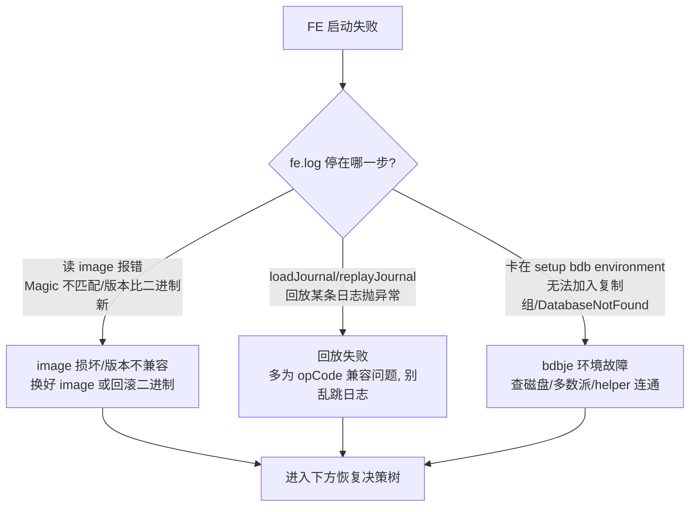
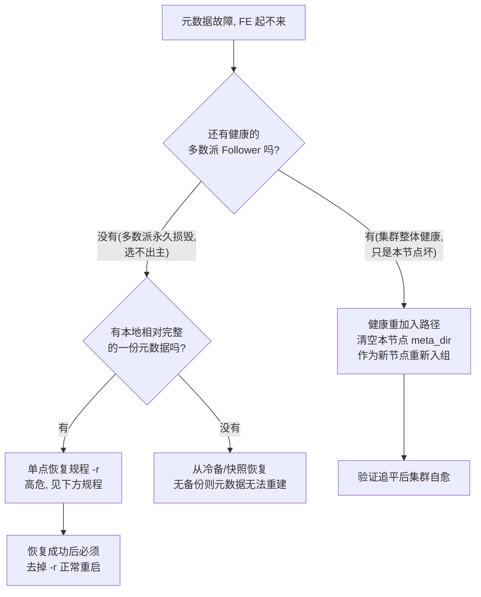

# 第 5 章：FE 故障 —— 选主、元数据与恢复

> 本章行号引用基于写作时核实所用的 HEAD（`211dac9295`，源码树与系列基线一致）。文中所有 `路径:行号` 均在该版本核实；代码演进会让行号漂移，但 `SHOW FRONTENDS` 列名、`ALTER SYSTEM` 语法、启动参数语义、bdbje 恢复流程不变。跨部分回引均已 grep 目标文件确认内容真实存在。

前四章的故障，无论查询、导入、副本还是缓存，都发生在"被 FE 指挥的那些节点"上。本章转向指挥者自己：当那个掌管元数据权威、发号施令给所有 BE、决定谁能写的 FE Master 本身出问题时怎么办。机制在前部讲得最透——选主与角色迁移在 [part4 第 3 章](../part4-fe-internals/03-fe-ha.md)，元数据持久化与 checkpoint 在 [part4 第 2 章](../part4-fe-internals/02-editlog-and-checkpoint.md)。本章不重讲这些机制（一律链接回前部），增量在于**把 part4 那两份排查清单展开成运维可执行的处置规程，尤其是元数据恢复这类"一步走错就不可逆"的高危操作，每一步都核到源码、配齐前置检查与回退路径**。

## 5.1 问题：FE 故障的特殊性

**遇到了什么问题？** 前四章的故障，处置错了顶多是"某张表查不动、某次导入失败"；FE 故障处置错了，可能是**整份元数据丢失、集群再也起不来**。同样是"进程挂了"，FE 和 BE 完全不是一个量级的风险，排查心态和第一动作都不同。

**原理三连问。**

**其一，FE 故障为什么"小症状大风险"？** 因为**元数据是全局单点资产**。[part4 第 1 章](../part4-fe-internals/01-catalog-and-memory.md) §1.1 定的铁律：元数据全常驻 Master 内存、只有 Master 能写，靠 bdbje editlog 落盘并复制（[part4 第 2 章](../part4-fe-internals/02-editlog-and-checkpoint.md) §2.2）。这份权威是**唯一的**——BE 上的数据坏一份还有两副本、还能克隆（[第 4 章](./04-replica-and-cache-issues.md)），但元数据的那份 image + bdbje 日志若被误操作抹掉，没有任何地方能重建它。于是 FE 侧一个看似不起眼的症状——"某个 FE 起不来""建表报错"——背后可能是"多数派已损毁、再动一下就永久丢元数据"。症状的严重度和风险的严重度在 FE 这里是**脱钩**的，这是本章所有谨慎的根源。

**其二，排查 FE 的第一原则：先保元数据，还是先恢复服务？** 两者会打架，得分场景。**默认永远是"先保元数据"**：任何可能改写、重置、清空 `meta_dir` 的操作（尤其 `metadata_failure_recovery`），执行前必须先把当前 `meta_dir` 冷备一份——因为这类操作不可逆，备份是唯一的回退凭证。**只有一种情况可以把"恢复服务"排在前面**：集群其实健康、只是**单个非 Master 节点**起不来或角色错乱，此时那份权威元数据在多数派手里安然无恙，你怎么折腾这一个节点（清空它的 `meta_dir` 重新入组）都动不了全局权威——这种局部故障可以放心快速恢复服务。判断标准就一条：**你要动的操作，会不会碰到"多数派持有的那份权威"**。碰不到（单节点重来），先恢复服务；一旦可能碰到（重置复制组、单点强起），先保元数据、慢就是快。

**其三，这一章和 part4 那两章是什么关系？** part4 讲"机制为什么这么设计"，本章讲"机制坏了怎么按规程救"。[part4 第 3 章](../part4-fe-internals/03-fe-ha.md) §3.6 与 [part4 第 2 章](../part4-fe-internals/02-editlog-and-checkpoint.md) §2.6 已各给了一份症状清单，但那是"知道往哪看"级别；本章把它们展开成**带前置检查、操作步骤、验证信号、回退路径的完整规程**，特别是把那两章反复警告"绝不能误用"的 `metadata_failure_recovery` 落成一份可照做的单点恢复手册。机制不重复，规程是增量。

## 5.2 选主与角色异常

选主与角色迁移的机制全在 [part4 第 3 章](../part4-fe-internals/03-fe-ha.md) §3.2：`BDBStateChangeListener` 把 bdbje 的 master/replica 状态翻译成 FE 的 MASTER/FOLLOWER/OBSERVER，新主上任要走 `transferToMaster` 先置 `isReady=false`、回放追平、再置 true。本节不重复，只把三类现场症状展开成读法与处置。

### 症状一：选不出主（集群不可写、无 IsMaster）——多数派核对表

根因几乎总是**可选举组失去多数派**（[part4 第 3 章](../part4-fe-internals/03-fe-ha.md) §3.5 亲手复现过）。处置的第一动作不是重启、更不是上 `-r`，而是**先数多数派**：

1. `SHOW FRONTENDS`，只数 `Role=FOLLOWER` 且 `Alive=true` 的行。N 个 FOLLOWER 的多数派是 `⌊N/2⌋+1`（机制见 [part4 第 3 章](../part4-fe-internals/03-fe-ha.md) §3.3 的奇偶算术）。存活 FOLLOWER 数 ≥ 多数派 → 本不该选不出主，转去看症状二/三；< 多数派 → 确诊"死了太多 Follower"。
2. **别把 OBSERVER 算进分母**——它是 `NodeType.SECONDARY`，不计票（[part4 第 3 章](../part4-fe-internals/03-fe-ha.md) §3.3）。3 FOLLOWER + 5 OBSERVER 的集群，多数派仍是 2，加再多 OBSERVER 都救不了写。
3. 确诊后的唯一正确处置：**把宕掉的 FOLLOWER 逐个拉起来重新入组**，而不是去动活着的节点、更不是拿 `-r` 重置。它们回来追平日志、恢复多数派，集群自动重新可写。只有当宕掉的 FOLLOWER 机器**永久损毁、无论如何拉不起来**、且损毁数已使多数派不可能恢复时，才进入 §5.3 的灾难恢复规程。

若是**新加的 FOLLOWER 迟迟不 `Alive`**：它可能卡在从 helper 回放追平的阶段——[part4 第 3 章](../part4-fe-internals/03-fe-ha.md) §3.3 讲过加 FOLLOWER 是"先入组不计票、追平后才计票"的两阶段（`addUnReadyElectableNode`，`fe/fe-core/src/main/java/org/apache/doris/ha/BDBHA.java:218`），追平前它不进多数派，别误当成"故障节点"去删。

### 症状二：新主起了但不服务（还在回放）——回放窗口判断

`SHOW FRONTENDS` 已有一行 `IsMaster=true`，但写请求仍报错/超时。**这不是脑裂、不是选主失败，而是 [part4 第 3 章](../part4-fe-internals/03-fe-ha.md) §3.2 那个回放窗口**：bdbje 层已选出 master（复制层），但 Doris 层的 `transferToMaster` 还在 `replayJournal(-1)` 追平 backlog（`fe/fe-core/src/main/java/org/apache/doris/catalog/Env.java:1732`），`isReady` 尚为 false——`isMaster()`（`fe/fe-core/src/main/java/org/apache/doris/catalog/Env.java:5521`）此刻仍返回 false。

判断"新主到底好没好"，唯一可靠的信号是新主 `fe.log` 里那句 `master finished to replay journal, can write now.`（`fe/fe-core/src/main/java/org/apache/doris/catalog/Env.java:1882`）——**这是本章反复要用的关键字**。在此之前还会先打印 `begin to transfer FE type from FOLLOWER to MASTER`（同文件 `:3254` 附近）、以及回放阶段的 `finish replay in ... msec`（同文件 `:1734`）。**进度估算方法**：

- 从 kill 旧主到打印 `can write now` 的时间差，就是集群的写不可用窗口。
- 窗口长度 ≈ 新主需要回放的日志条数 ÷ 回放速率。回放期间对照 `SHOW FRONTENDS` 里该节点的 `ReplayedJournalId` 是否还在**持续爬升**：在爬 = 正常追平中，耐心等；不爬 = 卡死，转去查 bdbje/磁盘（[part4 第 2 章](../part4-fe-internals/02-editlog-and-checkpoint.md) §2.6 症状 C）。
- 若窗口长得离谱，根因往往是 **image 太旧、宕机时攒了太多未 checkpoint 的日志**——这正是 [part4 第 2 章](../part4-fe-internals/02-editlog-and-checkpoint.md) §2.5 那条"回放窗口 = 恢复时长"在选主场景的复现。治本是让 checkpoint 正常跑起来截断窗口，不是反复重启新主（重启只会让它从头再回放一遍，更慢）。

### 症状三：角色显示异常——SHOW FRONTENDS 逐列诊断读法

`SHOW FRONTENDS` 的列定义在 `fe/fe-core/src/main/java/org/apache/doris/tablefunction/FrontendsTableValuedFunction.java:48` 起（`SHOW FRONTENDS` 命令走 `FrontendsProcNode`，`fe/fe-core/src/main/java/org/apache/doris/common/proc/FrontendsProcNode.java:88`，两者共用同一份列名）。排障时逐列这么读：

| 列名 | 诊断读法 |
| --- | --- |
| `Role` | `FOLLOWER`/`OBSERVER`——可选举 vs 只读。数多数派只数 FOLLOWER。 |
| `IsMaster` | 全集群**有且仅应有一行** `true`。零行 → 症状一（选不出主）；多行 → 才是真脑裂的信号（正常有 fencing 兜底，[part4 第 3 章](../part4-fe-internals/03-fe-ha.md) §3.2）。 |
| `Alive` | 该 FE 心跳是否正常。选不出主时先数 `Role=FOLLOWER && Alive=true` 够不够多数派。 |
| `ReplayedJournalId` | 各节点回放进度。健康时彼此接近；某节点明显落后 = 它在追（症状二），或它 stale 到停读（超 `meta_delay_toleration_second`）。 |
| `Join` | 是否已真正加入集群。新节点 `Join=false` 而迟迟不 true = 卡在入组/追平。 |
| `IsHelper` | 是否被用作 helper 引路点。和角色错乱排查相关（见下）。 |
| `ErrMsg` | 该 FE 的错误信息。角色异常/失联时第一个看这里拿线索。 |
| `LastHeartbeat` / `LastStartTime` | 最近心跳/启动时刻，判断它是刚重启还是长期失联。 |

### tricky 点：加错节点类型的事后补救路径

[part4 第 3 章](../part4-fe-internals/03-fe-ha.md) §3.3 讲了"把该加成 OBSERVER 的节点加成了 FOLLOWER"（或反过来）这个陷阱的成因——两个旋钮作用域不同，混用得不到预期能力。那里讲了"为什么错"，这里补"错了怎么改"。**没有"改角色"的原地命令，只能先删后加**，语法核实在 `fe/fe-sql-parser/src/main/antlr4/org/apache/doris/nereids/DorisParser.g4`：

- 删：`ALTER SYSTEM DROP FOLLOWER "host:port"`（规则 `#dropFollowerClause`，`:749`）或 `ALTER SYSTEM DROP OBSERVER "host:port"`（`#dropObserverClause`，`:747`）。
- 加：`ALTER SYSTEM ADD OBSERVER "host:port"`（`#addObserverClause`，`:746`）或 `ADD FOLLOWER`（`#addFollowerClause`，`:748`）。

补救规程（以"误加成 FOLLOWER、实为想要 OBSERVER"为例）：

1. **前置检查**：先 `SHOW FRONTENDS` 确认删掉这个 FOLLOWER 后，**剩余存活 FOLLOWER 仍满足多数派**（否则删的动作本身会让集群失去多数派、当场不可写）。这一步是整个补救最容易翻车的地方。
2. **操作**：在 Master 上 `ALTER SYSTEM DROP FOLLOWER "host:port"`——它会经 `removeElectableNode`/`removeDroppedMember`（`fe/fe-core/src/main/java/org/apache/doris/ha/BDBHA.java:163`、`:251`）把节点移出复制组。
3. **清本地身份**：被删节点的本地已写下 FOLLOWER 的 ROLE/VERSION 文件，[part4 第 3 章](../part4-fe-internals/03-fe-ha.md) §3.3 讲过"身份一旦落到本地 ROLE 文件就固定"——所以要**停掉该 FE 进程、清空它的 `meta_dir`**，让它作为全新节点重来。
4. **重新加正确类型**：`ALTER SYSTEM ADD OBSERVER "host:port"`，再用 `--helper` 起该 FE，它以 OBSERVER 身份入组、从零回放追平。
5. **验证**：`SHOW FRONTENDS` 确认该行 `Role=OBSERVER`、`Alive=true`、`ReplayedJournalId` 追平；多数派数量回到操作前的预期值。

## 5.3 元数据损坏与恢复规程（高危操作章）

本节是全章风险最高的部分。这里的每一条操作都可能不可逆地改写或丢失元数据，所以每个规程都按 **前置检查 → 操作 → 验证 → 回退** 四段写，且**贯穿一条铁律：任何触碰 `meta_dir` 的高危操作之前，先冷备一份 `meta_dir`**——这是唯一的回退凭证，没有它就没有回退。

### 启动失败的三类根因分类

FE 起不来，先分清是哪一类，三类的处置方向截然不同、认错就修错方向：

- **image 损坏 / 版本不兼容**：启动时 load image，Magic 校验不过或 image 版本比当前二进制新（回滚场景），直接失败退出——这是 [part4 第 2 章](../part4-fe-internals/02-editlog-and-checkpoint.md) §2.3 讲的"宁可不起、不带病运行"，`MetaHeader` 读到不匹配 Magic 即判损坏（`fe/fe-core/src/main/java/org/apache/doris/persist/meta/MetaHeader.java:57`）。处置：从别的健康 FE 或备份取一份好 image；若是版本倒退，换回匹配的二进制。
- **回放失败**：image 读通了，卡在回放某条 editlog。[part4 第 2 章](../part4-fe-internals/02-editlog-and-checkpoint.md) §2.2 讲过它多半是 opCode/字段兼容问题（历史日志触发，极难定位）。**切忌自作主张跳过日志**——跳一条就等于元数据缺一块。
- **bdbje 环境故障**：卡在 `setup bdb environment`。可能是磁盘满、多数派不可达、或 helper 连不上。这类是 [part4 第 2 章](../part4-fe-internals/02-editlog-and-checkpoint.md) §2.1 说的"黑盒依赖"外部症状，先查磁盘和网络，别急着上恢复参数。

### 恢复决策树

分完类，用这棵树决定走哪条恢复路径。**核心分叉是"多数派还在不在"**：

### 规程 A：健康重加入（低危，先恢复服务）

适用：集群整体健康、多数派在，只有某一个 Follower/Observer 起不来（image 坏、bdbje 环境乱）。因为权威在多数派手里，本节点怎么重来都动不了全局——这正是 §5.1 那种"可以先恢复服务"的局部故障。规程的基础是 [part4 第 3 章](../part4-fe-internals/03-fe-ha.md) §3.3 的 helper 入组逻辑（`getClusterIdAndRole`，`fe/fe-core/src/main/java/org/apache/doris/catalog/Env.java:1322`）：一个本地无 ROLE/VERSION 的全新 FE 会向 helper 拉取身份、从零同步元数据。

- **前置检查**：`SHOW FRONTENDS` 确认存活 FOLLOWER 仍满足多数派（本节点不算），确认这确实是"单点坏"而非"多数派坏"。
- **操作**：停掉坏节点进程 → 冷备它的 `meta_dir`（留证）→ **清空该节点 `meta_dir`** → 用 `--helper <健康FE>:<edit_log_port>` 重启它。它作为新节点重新入组、从零回放追平。
- **验证**：`SHOW FRONTENDS` 看该行 `Alive=true`、`Join=true`、`ReplayedJournalId` 追上其它节点。
- **回退**：这条路径本身低危（没碰多数派那份权威）。若重加入失败，用冷备的 `meta_dir` 原样放回、排查 helper 连通与磁盘，再重试。

### 规程 B：单点强制恢复 `metadata_failure_recovery`（高危，最后手段）

**这是全章最危险的操作。** 适用且**仅**适用：多数派 FOLLOWER 已**永久损毁**、集群无论如何选不出主，而你手上有某一个节点保有相对完整的一份元数据，要拿它**单方面**把复制组重置、强行拉起一个单点集群救急。

先把它是什么核清楚（[part4 第 2 章](../part4-fe-internals/02-editlog-and-checkpoint.md) §2.3、[part4 第 3 章](../part4-fe-internals/03-fe-ha.md) §3.6 已反复警告）：它**不是** FE 配置项，而是一个**启动参数**——`bin/start_fe.sh:35` 声明 `--metadata_failure_recovery`、`:70` 把它映射成 `-r`；`DorisFE` 收到 `-r` 后设置系统属性（`fe/fe-core/src/main/java/org/apache/doris/DorisFE.java:377`、`:418`-`419`，常量 `FeConstants.METADATA_FAILURE_RECOVERY_KEY`）。`BDBJEJournal` 启动时读这个属性（`fe/fe-core/src/main/java/org/apache/doris/journal/bdbje/BDBJEJournal.java:507`），传给 `BDBEnvironment`，在 `setup` 里触发 `DbResetRepGroup` 的 `reset()` 把整个复制组重置（`fe/fe-core/src/main/java/org/apache/doris/journal/bdbje/BDBEnvironment.java:110`-`114`）。它的语义是"丢掉未复制的日志、拿本地这份把复制组从头重置起来"。

代码本身设了两道护栏，正好印证它有多危险：其一，**非可选举节点不许用**——`setup` 开头若 `metadataFailureRecovery && !isElectable` 直接 `System.exit(-1)`（`fe/fe-core/src/main/java/org/apache/doris/journal/bdbje/BDBEnvironment.java:106`-`109`），OBSERVER 不能拿来当恢复起点。其二，**meta 目录为空时不许用**——首次启动（`meta_dir` 空）加 `-r` 会抛 `DatabaseNotFoundException`，日志明说"不允许在 meta 或 bdbje 目录为空时设 metadata_failure_recovery"（`fe/fe-core/src/main/java/org/apache/doris/journal/bdbje/BDBJEJournal.java:516`-`517`，原文为跨行拼接的英文串，此处转写），防止你在空节点上"恢复"出一个假权威。

**危险操作规程（前置检查 → 操作 → 验证 → 回退）：**

1. **前置检查（缺一不可）**：
   - 确认**真的**是多数派永久损毁——不是"暂时起不来"（暂时起不来走规程 A 或等它回来）。误判是本操作最大的事故源。
   - 选定的恢复节点必须是**可选举节点（FOLLOWER/曾经的 Master）**、且 `meta_dir` 非空、且是**存活节点里 `ReplayedJournalId` 最大**的那个（回放最全 = 丢的元数据最少）。
   - **冷备该节点整个 `meta_dir`**（image + bdbje）。这是唯一回退凭证。
   - 确认**其它所有 FE 进程已全部停掉**——绝不能在还有别的 FE 活着时对某个节点 `-r`（见下方灾难）。
2. **操作**：只对这**一个**节点执行 `sh bin/start_fe.sh --metadata_failure_recovery`（或写作 `-r`）。它会重置复制组、拿本地元数据拉起一个单节点集群。
3. **验证**：`fe.log` 出现 `metadata recovery mode, group has been reset.`（`fe/fe-core/src/main/java/org/apache/doris/journal/bdbje/BDBEnvironment.java:114`）且随后打印 `master finished to replay journal, can write now.`；`SHOW FRONTENDS` 应只剩这一行、`IsMaster=true`。此时集群以单点身份恢复可写。
4. **回退**：若恢复结果不对（元数据回退到不可接受的旧点、或起不来），**停进程、用冷备的 `meta_dir` 原样放回**，重新评估——因为 `-r` 已经重置过复制组，不能在同一份被重置的目录上反复试。
5. **收尾（极易遗忘、后果严重）**：恢复成功后**必须去掉 `-r`、用正常方式重启这个节点**，再用规程 A 把其它 FOLLOWER 作为新节点逐个 `--helper` 加回来、重建多数派。**忘了去掉 `-r`**：每次重启都重置一次复制组，永远只能是孤零零的单点、无法组成正常多数派集群——这是最常见的"恢复完却没恢复好"的尾巴。

### 两个必须刻进肌肉的灾难陷阱

- **对多个 FE 同时 `-r`**：`-r` 的语义是"拿本地这份单方面重置复制组"。若同时对两个及以上节点 `-r`，等于同时诞生两个"单方面权威"，各自重置出一份分叉的复制组——**直接脑裂、元数据永久分叉**，而且因为两份都自称权威，无法合并。规程第 1 步"确认其它 FE 全停"就是为了堵死这条路。`-r` 永远只对**唯一一个**节点执行。
- **忘记去掉 `-r`**：见规程第 5 步。它不会立刻报错，而是让集群长期停在"每次重启都自我重置"的单点状态，直到某次运维发现"怎么加不进 Follower"才暴露，此时已浪费大量排查时间。

### BDBTool / BDBDebugger：只读查看优先

诊断阶段想看 bdbje 里到底有哪些日志、区间如何，用只读工具，别一上来就动恢复参数。[part4 第 2 章](../part4-fe-internals/02-editlog-and-checkpoint.md) §2.5 已介绍过它们，这里补调用入口：

- **`BDBTool`**（`fe/fe-core/src/main/java/org/apache/doris/journal/bdbje/BDBTool.java:50`，配套 `BDBToolOptions`，`fe/fe-core/src/main/java/org/apache/doris/journal/bdbje/BDBToolOptions.java:24`）：经 `DorisFE` 的 `-b`/`--bdb` 进入（`fe/fe-core/src/main/java/org/apache/doris/DorisFE.java:370`），`-l`/`--listdb` 列出所有 bdbje database（每个对应一段封存日志区间，`:371`、`:433`-`436`），`-d`/`--db <name>` 配 `--stat` 看某段的条数与首尾 key（`:372`）。**它要独占打开 bdbje 环境，务必在 FE 停机、或对着 `meta_dir` 的冷备副本跑**——对着在跑的生产 `meta_dir` 开会冲突。
- **`BDBDebugger`**（`fe/fe-core/src/main/java/org/apache/doris/journal/bdbje/BDBDebugger.java:57`）：交互式，由 `enable_bdbje_debug_mode`（`fe/fe-common/src/main/java/org/apache/doris/common/Config.java:1542`）在启动时开启，`DorisFE` 侧读该 `Config` 字段为真则走 `BDBDebugger` 的 `get()` 再 `startDebugMode`（`fe/fe-core/src/main/java/org/apache/doris/DorisFE.java:221`-`223`）。

原则：**先用只读工具看清楚"日志在不在、到哪一条"，再决定要不要走高危恢复**。看清现场是所有恢复决策的前提。

## 5.4 双模式对比

**FE 的选主与自有元数据在两种模式下完全共用同一套 bdbje。** [part4 第 3 章](../part4-fe-internals/03-fe-ha.md) §3.4 与 [part4 第 2 章](../part4-fe-internals/02-editlog-and-checkpoint.md) §2.4 已证：分离模式的 `CloudEnv` 继承 `Env`、`edit_log_type` 默认仍是 `"bdb"`，FE 自身的 frontends 列表、权限、catalog 骨架依旧靠 bdbje 复制与选主。所以本章 §5.2、§5.3 的选主异常与元数据恢复规程，**分离模式一样适用**。

**变化的是切主影响面——分离模式更小。** [part3 第 1 章](../part3-load-lifecycle/01-load-overview-and-txn.md) §1.4 与 [part4 第 3 章](../part4-fe-internals/03-fe-ha.md) §3.4 都证过：分离模式把事务、tablet 版本这些"重且高频变"的权威状态外移到了 MetaService（背后 FDB），FE 基本不写事务 editlog。直接后果是**切主要回放的 FE 自有元数据更薄、回放窗口更短**（§5.2 症状二那个窗口在分离模式下天然更小），元数据 image 也更小、损坏恢复更快。这是分离模式在 FE 故障维度实打实的减负。

**但它多出一类全新的"FE 起不来"根因：连不上 MS。** 这是分离模式独有、一体模式没有的启动失败类别，必须会判别。一体模式 FE 的角色来自本地 ROLE 文件 + helper；**分离模式 FE 的角色来自 MetaService**——`CloudEnv` 的 `getClusterIdAndRole` 在一个循环里调 `getLocalTypeFromMetaService`（`fe/fe-core/src/main/java/org/apache/doris/cloud/catalog/CloudEnv.java:204`、`:255`）向 MS 要自己的节点类型。若 MS 不可达或返回非 OK，`getCloudCluster` 拿不到有效响应、`getLocalTypeFromMetaService` 返回 null（`fe/fe-core/src/main/java/org/apache/doris/cloud/catalog/CloudEnv.java:209`-`214`），循环就打印 `failed to get local fe's type, sleep ... try again.`（`:263`-`268`）、睡 `resource_not_ready_sleep_seconds` 后**无限重试**。

**判别方法**（分离模式 FE 起不来时的第一刀）：看 `fe.log` 停在哪。

- 反复刷 `failed to get local fe's type, sleep ... try again` / `failed to get cloud cluster` → **是 MS 连通问题**，不是本地元数据问题。去查 FE 到 MetaService 的网络、MS 自身是否存活、`cloud_unique_id` 配置是否正确——**别去动本地 `meta_dir`、更别上 `-r`**（本地元数据可能好端端的，问题在 MS 那头）。
- 停在 load image / replayJournal / setup bdb environment → 是本地元数据/bdbje 问题，回 §5.3 三类分类走。

一句话：**分离模式下"FE 起不来"先分"连不上 MS"还是"本地 meta 坏"——前者查连通、后者才进恢复规程**，切错方向会对着好的本地元数据做高危恢复，纯属自找麻烦。

## 5.5 故障演练

演练环境沿用 [part1 第 5 章](../part1-architecture/05-source-map-and-dev-env.md)。两个演练：核心演练从**排障视角**重走一遍 [part4 第 3 章](../part4-fe-internals/03-fe-ha.md) §3.5 的 kill-Master 实验（这次只用 [第 1 章](./01-toolbox.md) 的工具判断进度）；易错点演练是在**单 FE 环境**把 `-r` 恢复全流程亲手走一次，体会每步的检查点。

### 核心演练：kill Master，只用 ch1 工具看切换进度

[part4 第 3 章](../part4-fe-internals/03-fe-ha.md) §3.5 已从机制视角做过；这里**不看代码内部**，只用日志关键字 + `SHOW FRONTENDS` 判断，模拟真实排障。

1. **取基线**：3 FE（1 Master + 2 Follower）集群，`SHOW FRONTENDS` 记下当前 `IsMaster=true` 的是哪台、三台的 `ReplayedJournalId`（应彼此接近）。
2. **制造故障**：对 `IsMaster=true` 那台 `kill -9`（模拟宕机）。
3. **只用日志看选主**：在另两台 Follower 的 `fe.log` 里追这条日志流——先出现胜出者的 `begin to transfer FE type from FOLLOWER to MASTER`，接着 `finish replay in ... msec`（回放 backlog），最后 `master finished to replay journal, can write now.`。**从感知旧主死到打印 `can write now` 的时间差，就是集群写不可用窗口**。
4. **只用 SHOW FRONTENDS 判进度**：切换窗口内反复 `SHOW FRONTENDS`，看新主行的 `ReplayedJournalId` 是否在爬升——爬 = 正常追平中（这就是 §5.2 症状二的进度估算落地）。这期间去连另一台建表会短暂报错/阻塞，等 `can write now` 后恢复。
5. **确认收敛**：`SHOW FRONTENDS` 确认 `IsMaster` 已转移、新主 `Alive=true`。把 kill 掉的 FE 拉起（它作为节点重新入组、追平），集群恢复三节点。

**排障视角的收获**：整个过程你没做任何恢复操作——健康集群会自动选主，运维要做的是**用两个信号（`can write now` 日志 + `ReplayedJournalId` 爬升）确认它在正常切换、而非卡住**。别看到"还不能写"就慌着重启新主，那只会让它从头再回放。

### 易错点演练（谨慎，务必单 FE 隔离环境）：走一遍 `-r` 恢复全流程

> **环境警示**：本演练会执行 `metadata_failure_recovery`，它会重置 bdbje 复制组。**只在一次性的单 FE 测试环境做，绝不可在任何生产或共享集群上碰**。开始前把这个 FE 的 `meta_dir` 冷备一份。

目的是把 §5.3 规程 B 每一步的检查点亲手过一遍，而不是真去救灾。

1. **准备**：起一个单 FE（首启即 Master），建几张表让元数据非空，`SHOW FRONTENDS` 确认 `IsMaster=true`、记下 `ReplayedJournalId`。
2. **冷备（检查点：回退凭证）**：停 FE，`cp -r` 整个 `meta_dir` 到别处。没有这一步不许往下走。
3. **执行 `-r`（检查点：只对这一个节点）**：`sh bin/start_fe.sh --metadata_failure_recovery`。观察 `fe.log`：应出现 `start group reset` → `metadata recovery mode, group has been reset.` → 随后 `master finished to replay journal, can write now.`。
4. **验证（检查点：结果符合预期）**：`SHOW FRONTENDS` 只剩这一行、`IsMaster=true`；抽查几张表还在、`ReplayedJournalId` 合理。体会"它拿本地这份把复制组重置起来"的含义。
5. **收尾（检查点：必须恢复正常启动方式）**：**停掉 FE，去掉 `-r`，用正常 `sh bin/start_fe.sh` 重启**。再 `SHOW FRONTENDS` 确认它作为正常单点起来、不再打印 `group reset`。**这一步是本演练的重点**——亲手体会"忘了去掉 `-r` 会每次重启都重置"这个尾巴，把"恢复后必须回正常启动方式"刻进肌肉记忆。
6. **善后**：演练完可用第 2 步的冷备还原，或直接清掉这个一次性环境。

## 5.6 排查清单（含高危操作 checklist）

本章清单分两半：上半是选主/元数据症状的诊断入口，下半是可"贴墙"的高危操作印刷体 checklist。

**症状诊断（先看信号，别急着动手）：**

- **选不出主（无 `IsMaster`、集群不可写）** → `SHOW FRONTENDS` 数 `Role=FOLLOWER && Alive=true` 够不够 `⌊N/2⌋+1`（不数 OBSERVER）。不够 = 死了太多 Follower，**优先把它们拉起来重新入组**（§5.2），不是上 `-r`。
- **新主起了但不服务** → 不是脑裂，是回放窗口（§5.2 症状二）。判据：新主 `fe.log` 有没有 `master finished to replay journal, can write now.` + `ReplayedJournalId` 是否在爬。在爬就等；窗口离谱 → image 太旧，让 checkpoint 跑起来（[part4 第 2 章](../part4-fe-internals/02-editlog-and-checkpoint.md) §2.6）。
- **角色显示异常** → 逐列读 `SHOW FRONTENDS`（§5.2 表）：`IsMaster` 应仅一行 true、`Role` 分清可选举、`ReplayedJournalId` 看落后、`ErrMsg` 拿线索。加错类型走"先 DROP 后 ADD + 清本地 meta_dir"（§5.2）。
- **FE 起不来** → 先分类（§5.3）：读 image 报错 = image 损坏/版本不兼容；回放抛异常 = 兼容问题（别跳日志）；卡 setup bdb = 磁盘/多数派/helper。**分离模式额外先分**：刷 `failed to get local fe's type ... try again` = 连不上 MS（查连通，别动本地 meta），否则才是本地 meta 问题（§5.4）。

**高危操作 checklist（`metadata_failure_recovery` / `-r`，贴墙版）：**

1. 先问：真是**多数派永久损毁、选不出主**吗？只是暂时起不来 → 不用 `-r`，走健康重加入或等它回来。
2. 恢复前**必须**：冷备整个 `meta_dir`（唯一回退凭证）。
3. 选**可选举节点**、`meta_dir` 非空、`ReplayedJournalId` **最大**的那一个作恢复起点（OBSERVER 不行，代码会 `exit`）。
4. **确认其它所有 FE 进程已全停**——`-r` 只能对**唯一一个**节点执行。多个同时 `-r` = 永久脑裂。
5. 执行后看日志确认 `group has been reset.` + `can write now.`；`SHOW FRONTENDS` 应只剩一行、`IsMaster=true`。
6. **成功后必须去掉 `-r`、正常重启**，再把其它 FOLLOWER 作为新节点 `--helper` 加回重建多数派。**忘了去掉 = 每次重启都自我重置成单点。**
7. 诊断阶段优先用只读的 `BDBTool`/`BDBDebugger`（对冷备副本跑）看清日志区间，再决定要不要走 `-r`。

三条纪律收束本章：

- **症状轻不代表风险低。** 元数据是全局单点资产，FE 侧一个小症状背后可能是"再动一下就永久丢元数据"。默认先保元数据（冷备 + 慢），只有确诊"单节点坏、多数派安然"时才先恢复服务。
- **多数派是所有 FE 决策的标尺。** 选不出主先数多数派、加减节点前先算多数派、`-r` 前先确认多数派真的没了。数错（把 OBSERVER 算进去、把暂时失联当永久损毁）是本章最大的事故源。
- **`-r` 是最后手段，不是重试按钮。** 它单方面重置复制组，误用即脑裂+丢元数据。前置检查、冷备、只对一个节点、用完去掉——四条缺一不可。

至此，FE 自身的故障——选主异常、角色错乱、元数据损坏与恢复——就缝成了一张以"多数派"为标尺、以"先保元数据"为默认的处置图，机制全在链接回的 [part4 第 2 章](../part4-fe-internals/02-editlog-and-checkpoint.md) 与 [part4 第 3 章](../part4-fe-internals/03-fe-ha.md) 里。下一章离开单点故障，转向 FE 与 BE 之间、以及分离模式下 FE 与 MetaService 之间的**交互与协同故障**——当各组件自己都没坏、坏的是它们之间的那条线时，怎么办。
