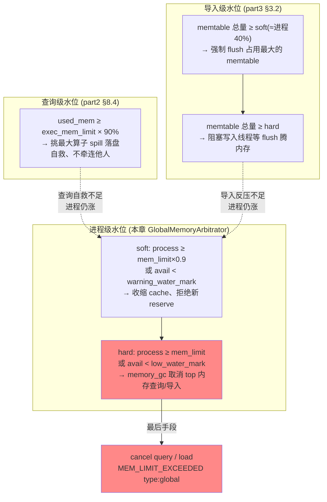

# 第 6 章：内存管理 —— BE 内存模型与 MemTracker

> 本章行号引用基于写作时核实所用的 HEAD（`3eb2be3d81`，源码树与系列基线一致）。文中所有 `路径:行号` 均在该版本核实；代码演进会让行号漂移，但 `Type` 枚举取值、三层限额的判定链、水位公式的形态、报错文本字段、endpoint 路径语义不变。跨部分回引均已 grep 目标文件确认内容真实存在。

前五章处理的都是"某类症状怎么查"，机制细节一律链接回 part1~part5。本章是本部分**唯一的机制深潜章**——因为 BE 内存模型这套东西前五部分从没系统讲过，而它又是查询、导入、缓存三条线在 §2.3、part2 §8.4、part3 §3.2 各自撞到的同一堵墙。[第 2 章](./02-query-issues.md) §2.3 读 `MEM_LIMIT_EXCEEDED` 报错时立了个 flag：「三层的详细机制（各 tracker 怎么累计、arbitrator 怎么在进程紧张时挑查询 kill、workload group 怎么分配配额与软硬限）留到本部分第 6 章」，还留了个「背锅侠」陷阱的伏笔。本章就来兑现：把 MemTracker 树、三层限额、全局仲裁三件事讲到源码级，最后用**一张图**把散在三处的水位体系统一起来。写法沿用 part1~part5 的深潜规矩——显而易见的一笔带过，难的和易错的详写、配「错写会怎样」。

## 6.1 问题：给一个 C++ 进程里的几百个查询记账

**遇到了什么问题？** 一台 BE 是**单个 C++ 进程**，里头同时跑着几百条查询、几十个导入、一堆后台 compaction，还有几 GB 的各类 cache。它们全在同一个堆上 `malloc`/`free`。现在业务方问三个问题：这条查询用了多少内存？谁把内存吃满了？内存要爆了先牺牲谁？一个裸的 C++ 进程对这三个问题**一无所知**——它只知道进程总 RSS，不知道这 40GB 里哪 8GB 是那条广播了大表的烂 SQL 干的。给进程内部的逻辑任务记账，是这一切的地基。

**原理三连问。**

**其一，为什么不能"不记账、交给 OS"？** 最省事的做法是啥也不记，内存爆了让 Linux 的 OOM killer 去裁决。问题是 OOM killer 的裁决**又粗又致命**：它按进程打分，一挥手就是 `kill -9` 整个 BE 进程——不是取消那条烂查询，是**整台 BE 连同它服务的几百条正常查询一起死**。而且它挑的"内存最大进程"往往正是 BE 本身（它本就该占大头），于是每次内存紧张都是 BE 暴毙、大量在途查询/导入全部失败、还可能留下没 publish 的事务要恢复。把生杀大权交给 OS，等于放弃了"精准取消一条查询、保住其余"的能力。

**其二，那"一个全局配额"够不够？** 退一步，进程自己维护一个全局计数器：每次 `malloc` 加、`free` 减，超过 `mem_limit` 就拒绝分配。这比 OOM killer 强，进程至少能自己喊停而不是被 kill。但它只知道**总量**，不知道**归属**——内存要爆了，它没法回答"该牺牲谁"，只能对下一个来申请的倒霉蛋报错，而那个倒霉蛋很可能是条只要 100MB 的小查询，真凶（那条吃了 8GB 的）却安然无恙继续跑。这就是 §2.3 那个「背锅侠」陷阱的根源：**光有总量、没有归属，报错点和真凶是脱节的**。

**其三，Doris 的答案：层级记账 + 线程本地挂账。** 要能精准问责，就得给每个逻辑任务一棵**记账树**：进程级一个总账，下面按类型（query/load/compaction/cache…）分账，每类下面再挂具体任务的账。这就是 `MemTracker` / `MemTrackerLimiter` 树。但难点在于——`malloc` 发生在**某个执行线程**里，记账代码怎么知道这次分配该算到哪棵子账上？答案是**线程本地挂账**：每个线程用 `ThreadMemTrackerMgr` 存一个「当前该记给谁」的指针，查询开始执行前用宏把自己的 tracker "挂"到线程上，之后这个线程里所有 `malloc` 经 jemalloc hook 自动算进这棵账。归属问题就这样从"分配点"转移到了"线程上下文"。

**记账的两难：精确 vs 近似。** 有了归属还有个性能坑：如果**每一次** `malloc`/`free` 都去原子地更新 tracker 计数，高频小分配下这个原子加减会成为热点，拖慢整个进程。Doris 的取舍是**攒批**：`ThreadMemTrackerMgr` 在线程本地攒一个 `_untracked_mem`，只有攒到阈值才一次性 flush 进真正的 tracker——判定就一行，`std::abs(_untracked_mem) >= config::mem_tracker_consume_min_size_bytes`（`be/src/runtime/memory/thread_mem_tracker_mgr.h:256`）。这个阈值 `mem_tracker_consume_min_size_bytes` 默认 1MB（`be/src/common/config.cpp:959`，`DEFINE_mInt32` 可热改）。代价是 tracker 的读数**天然带一个每线程最多约 1MB 的误差**——这不是 bug，是精确性换性能的设计取舍。把它调小能让 tracker 更准但更慢，调大更快但更糊。记住这一点，后面看 tracker 值时就不会为几 MB 的抖动惊慌。

**jemalloc 与记账的关系：记的是逻辑分配，RSS 是物理占用。** 最后一层认知：tracker 记的是**应用逻辑申请**的字节数（`new`/`malloc` 要了多少），而进程真实的 RSS 是**物理页占用**。两者之间隔着 jemalloc：应用 `free` 掉的内存，jemalloc 不一定立刻还给 OS，而是留作 **dirty page 缓存**待复用；长期运行还会有**内存碎片**。所以 `RSS ≈ tracker 逻辑量 + jemalloc 缓存 + 碎片`——这个差距是**常态**，不是泄漏。Doris 自己也认这笔账：算进程内存用量时会「equal to real process memory(vm_rss), subtract jemalloc dirty page cache」（`be/src/runtime/memory/global_memory_arbitrator.h:32` 注释），主动把 jemalloc 缓存从"占用"里刨掉。这是 §6.2 那个"tracker 和 RSS 差得多就喊泄漏"易错点的理论基础。

## 6.2 源码走读：MemTracker 树与三层限额

### 两种 tracker：纯计数的 vs 带限额的

先分清两个类，别混。`MemTracker`（`be/src/runtime/memory/mem_tracker.h:33`）是**纯计数器**——只有 `consume()`/`release()`，没有 limit，线程安全，用来观测某段代码用了多少。真正把关的是 `MemTrackerLimiter`（`be/src/runtime/memory/mem_tracker_limiter.h:70`）：它带 `_limit`，`check_limit()`（声明 `:131`、内联实现 `:298`）在「当前用量 + 本次申请 > 限额」时抛出 `MEM_LIMIT_EXCEEDED`（`:311`）。§2.3 拆过的那句报错，就是这里产生、由 `tracker_limit_exceeded_str()`（`:133`，拼装逻辑在 `be/src/runtime/memory/mem_tracker_limiter.cpp:366`~`:384`）组装的。

`MemTrackerLimiter` 按 `Type` 枚举（`be/src/runtime/memory/mem_tracker_limiter.h:76`~`:84`）分类，这就是报错里 `type:<...>` 字段的取值来源，也是这棵账树的一级分类：

| Type | 值 | 含义 |
| --- | --- | --- |
| `GLOBAL` | 0 | 进程级、生命周期同进程（不含 cache/metadata） |
| `QUERY` | 1 | 所有查询任务 |
| `LOAD` | 2 | 所有导入任务 |
| `COMPACTION` | 3 | base/cumulative compaction |
| `SCHEMA_CHANGE` | 4 | schema change |
| `METADATA` | 5 | 元数据 |
| `CACHE` | 6 | 各类 cache |
| `OTHER` | 7 | clone/snapshot 等 |

看到报错里 `type:query` 就知道击穿的是查询自己的账，`type:global` 就是进程级——这正是 §2.3 反复强调的「先读 type 定层」的源码依据。

### 三层限额：exec_mem_limit → workload group → process

§2.3 给了分诊结论「看到哪层报错查哪层」，这里补上机制：这三层是**逐层收紧的嵌套**，一次分配要连过三关。

- **查询级：`exec_mem_limit`。** 会话变量（默认约 100GB，下限 2MB），对应 BE 侧 `type:query` 的 `MemTrackerLimiter`。一条查询的所有算子用量累计到它这棵账，超了就是 `type:query` 报错——通常是这条 SQL 自己的问题（广播大表、没走 spill）。
- **负载组级：workload group。** 一批查询共享的配额，由 `WorkloadGroupMgr`（`be/src/runtime/workload_group/workload_group_manager.cpp`）管。它的软硬限判定不在单次 `check_limit()` 里——这是最容易误解的一点。真正的口径由维护线程周期性调 `refresh_workload_group_memory_state()`（`:223`）算出：按组内实际用量和 `memory_high_watermark()`（`:868` 一带）动态给每条查询算一个 **weighted mem limit**，组整体逼近配额时收紧每条查询的有效上限、逼它们 spill 或排队。所以 workload group 是"这一组查询整体超没超"的口径，观测点是 `active_queries` 里的 `WORKLOAD_GROUP_ID` 与排队时长，而不是某一次分配的瞬时判定。
- **进程级：process。** 整台 BE 的红线 `mem_limit`（默认物理内存的 90%），由 `GlobalMemoryArbitrator` 把关，对应 `type:global`。所有 query/load/cache/compaction 加起来受它约束。

**判定链的真相：不是三个 `if` 串在一起。** 容易误以为每次 `malloc` 都依次查三层。实际是分工的：查询级/负载组级的限额由各自的 `MemTrackerLimiter` 的 `check_limit()` 在**分配路径**上把关；进程级红线则由 `GlobalMemoryArbitrator` 在**内存预留（reserve）**和**后台维护线程**两处把关——前者在算子申请大块内存前先问"进程还扛得住吗"，后者周期性巡检、超了就动手收内存（§6.3）。三层共用 `MEM_LIMIT_EXCEEDED` 这一句报错，`type` 字段是唯一区分它们的标记。

### 从 malloc 到 tracker：完整链路

把 §6.1 的攒批和这里的归属串起来看一次完整的分配路径。BE 把全局 `malloc`/`free` 用别名劫持到自己的实现（`be/src/runtime/memory/jemalloc_hook.cpp:74` 把 `malloc` 别名到 `doris_malloc`，`:29`），每次分配经 `CONSUME_THREAD_MEM_TRACKER(size)` 宏（`be/src/runtime/thread_context.h:397`）落到当前线程的 `ThreadMemTrackerMgr` 的 `consume()`（`:404`）——这里就接上了 §6.1 讲的攒批：先加进 `_untracked_mem`、够阈值才 flush 进真正的 tracker。这条链解释了三件事：为什么归属是**按线程上下文**而非分配点（宏读的是 `thread_context_ptr`）；为什么 Doris 同时支持 pthread 和 **bthread**（brpc 的协程，`:405`~`:411` 有单独的 `bthread_getspecific` 分支取上下文）；以及**没有上下文时会怎样**——落到 orphan tracker（`:412`、`:417`），这正是下面那个"记账漂移"兜底的实现。

### 线程挂账：attach 机制

归属靠一组宏（`be/src/runtime/thread_context.h`）完成：

- `SCOPED_ATTACH_TASK(arg1)`（`:45`）：查询/导入开始执行时把它的 `ResourceContext`（内含 `MemTrackerLimiter`）挂到当前线程，作用域结束自动摘下。之后这个线程里所有分配经 jemalloc hook 自动算进这棵账。
- `SCOPED_SWITCH_THREAD_MEM_TRACKER_LIMITER(arg1)`（`:60`）：已 attach 后，临时把内存记到**另一棵** tracker（比如把某段公共开销记到 global 而非当前查询）。
- `SCOPED_SWITCH_RESOURCE_CONTEXT(arg1)`（`:54`）：切换整个资源上下文。

**tricky 点：挂账挂错树——异步线程的记账漂移。** 最容易踩的坑是：一条查询在自己的执行线程里 attach 好了，但它往**线程池**丢了个异步任务（比如异步 IO、后台 flush）。线程池的工作线程是**复用**的、并没有那条查询的 attach 上下文——如果这个异步任务不自己重新 `SCOPED_ATTACH_TASK` 或 `SCOPED_SWITCH_...`，它分配的内存就**不会算到发起它的查询头上**。Doris 用一道防线兜底：没有任何 attach 的线程做的分配，会被算进一个 orphan tracker，并由 `enable_memory_orphan_check`（`be/src/common/config.cpp:201`，`DEFINE_mBool` 默认 true、可热改）在开发期把这种"无主分配"检查出来。**honest boundary**：这道检查保证的是"漂移不会静默丢失、会落到 orphan 账上"，但它**不能替你把账挂对**——异步任务的正确归属仍依赖开发者在提交任务时显式传递上下文。所以生产上偶见某查询 tracker 值明显小于它实际该占的量、而 global/orphan 偏高，成因往往就是某条异步路径没重新 attach。这是本模型能力的边界，不是它的 bug。

**易错点：tracker 值和 RSS 差得多，别急着喊泄漏。** 运维最常见的误判：`type:global` 的 tracker 总和是 30GB，但 `top` 看进程 RSS 是 40GB，于是断定"漏了 10GB"。回到 §6.1 的公式——这 10GB 大概率是 **jemalloc 的 dirty page 缓存 + 碎片**，是 `free` 掉但没还给 OS 的可复用内存，完全正常。判定真泄漏前先做两件事：其一，看 jemalloc 自己报的 `allocated`/`resident` 指标（`/metrics` 里有），`resident - allocated` 就是缓存+碎片的量级；其二，手动触发一次 dirty page 回收（`GlobalMemoryArbitrator` 的 `je_purge_all_arena_dirty_pages()` 路径，见 `be/src/runtime/memory/jemalloc_control.cpp:106`），看 RSS 是否随之回落。回落了就是缓存、不动才可能是真泄漏。**错写会怎样**：把正常的 jemalloc 缓存当泄漏去改代码、去重启，不但白忙，还会因为频繁重启丢掉正在跑的查询。

## 6.3 源码走读：全局仲裁与自保

进程级的把关者是 `GlobalMemoryArbitrator`（`be/src/runtime/memory/global_memory_arbitrator.h:25`）。它维护两道水位，判定逻辑就在头文件里，形态很清晰：

- **soft 水位**——`is_exceed_soft_mem_limit()`（`:107`）：`process_memory_usage + bytes >= soft_mem_limit` **或** `sys_mem_available - bytes < warning_water_mark`。
- **hard 水位**——`is_exceed_hard_mem_limit()`（`:119`）：`process_memory_usage + bytes >= mem_limit` **或** `sys_mem_available - bytes < low_water_mark`。

两个维度**取或**：既看 Doris 自己的进程用量，也看**整机**的可用内存（防止别的进程把机器吃满、BE 却浑然不觉）。几个量的来历都核实过：

- `mem_limit` 默认 `"90%"`（物理内存的 90%，`be/src/common/config.cpp:128`，`DEFINE_String` **重启生效**）。
- `soft_mem_limit = mem_limit * soft_mem_limit_frac`，`soft_mem_limit_frac` 默认 0.9（`be/src/common/config.cpp:131`，`DEFINE_Double` **重启生效**）。即 soft ≈ 物理内存的 81%。
- `low_water_mark` 默认取 `min(physical - mem_limit, physical * 0.05)`（`be/src/util/mem_info.cpp:247`~`:251`），`warning_water_mark = low_water_mark * 2`（`:252`）。

### reserve：进程红线在分配路径上的把关点

上面两道水位是"判断函数"，谁来调它们、在什么时机拦分配？关键机制是 **reserve（预留）**。算子在要一大块内存前，先调 `GlobalMemoryArbitrator` 的 `try_reserve_process_memory()`（`be/src/runtime/memory/global_memory_arbitrator.h:93`）向进程"预订"这笔额度——预订时就会过 `is_exceed_soft_mem_limit()`/`is_exceed_hard_mem_limit()` 的水位判定。预订成功，这笔额度记进 `_process_reserved_memory`（声明 `:183`，读取 `:97`），之后线程真正 `malloc` 时从预留里扣、不再重复算进进程用量（`sub_thread_reserve_memory()`，`:105`）；用完或提前释放则 `shrink_process_reserved()`（`:94`）还回去。§6.1 讲的攒批 flush 里那段处理 `_reserved_mem` 的逻辑（`be/src/runtime/memory/thread_mem_tracker_mgr.h:217`~`:247`），干的就是"把已用掉的预留同步回进程账"这件事。

**为什么要 reserve 而不是等 `malloc` 时再拦？** 因为 spill 需要**提前决策**：算子在 build 哈希表前先 reserve 预估内存，reserve 失败就知道"进程扛不住"，此刻还来得及选择落盘（part2 §8.4 的 spill 触发正是挂在 reserve 失败上），而不是等 `malloc` 真的撞墙、内存已经分不出来、只能报错。reserve 把"内存够不够"的判断从**事后**提前到了**事前**，这是 spill 能优雅落盘而非硬 OOM 的前提。

### 自保动作序列：cache 收缩 → spill → cancel

进程贴近水位时该牺牲谁？这个序列**不在一处**，而是由后台的 `memory_maintenance_thread`（`be/src/common/daemon.cpp:330`）按固定步骤编排，每约 50ms 一轮（`memory_maintenance_sleep_time_ms`，`:744`）。核实的真实顺序：

1. **step4：收缩 cache**——`refresh_cache_capacity()`（`be/src/common/daemon.cpp:236`，调用点 `:345`）。进程内存一涨，先按 `cache_capacity_reduce_mem_limit_frac`（默认 0.7，`be/src/common/config.cpp:134`，`DEFINE_mDouble` 可热改）等权重调低各 cache 容量，让 `CacheManager`（`be/src/runtime/memory/cache_manager.h:31`）统一去 prune。它有两级力度：日常只 `for_each_cache_prune_stale()`（`be/src/runtime/memory/cache_manager.cpp:43`）清过期项，内存吃紧才 `for_each_cache_prune_all()`（`:51`）把所有 cache 按新容量强制收（`force` 参数）。cache 是**最该先牺牲**的——它只是加速、丢了不影响正确性，这就是它排在牺牲序列第一位的原因。
2. **step5：取消（硬手段）**——`memory_gc()`（`:303`，调用点 `:348`）。**仅当**越过 hard 线才动手：`sys_mem_available < low_water_mark`（日志 `sys available memory less than low water mark`）或 `process_memory_usage > mem_limit`（日志 `process memory used exceed limit`），触发 `MemoryReclamation` 的 `revoke_process_memory()`（`be/src/runtime/memory/memory_reclamation.cpp:183`）。它**先取消内存最大的查询**（step1，`:205`），不够再取消内存最大的导入（step2，`:225`，因为导入重试更贵所以放后面）。
3. **step7：处理 paused 查询（spill/恢复）**——`handle_paused_queries()`（`be/src/runtime/workload_group/workload_group_manager.cpp:312`，调用点 `be/src/common/daemon.cpp:355`）。

**honest boundary：源码里的"顺序"和语义上的"升级"不是一回事。** 上面 1→2→3 是**维护线程一轮里的执行次序**。但真正的**牺牲升级**语义写在 `handle_paused_queries()` 的策略注释里（`be/src/runtime/workload_group/workload_group_manager.cpp:305`~`:311`）：strategy 3「任一查询超进程限额 → 清空所有 cache」，strategy 4「任一查询超查询限额 → spill 或 cancel」，strategy 5「超进程限额且 cache 已清零 → 继续更狠的动作」。合起来才是完整的自保逻辑：**先砍 cache（无损）→ 让查询 spill 落盘（有损性能、不丢结果）→ 最后才 cancel 查询（丢结果）**。spill 本身的触发是**查询侧**的——算子 reserve 内存失败会把 task 挂起进 paused 队列（part2 [第 8 章](../part2-query-lifecycle/08-operators-rf-spill.md) §8.4 详述），维护线程的 step7 只是来推动它落盘或恢复。所以别指望在某一个函数里读到"cache→spill→cancel"一条龙——它是**多个组件按水位分工**协作出来的，本节把它们对齐到一起。

### 三个水位体系，一张图统一

到这里，全系列出现过的三套内存水位可以合并了。它们各管一段、但最终都服务于"不让进程 OOM"这一个目标：

读法：**查询级和导入级是"在自己预算内自救"**（spill、flush、反压，都不丢结果），**进程级才是"跨查询的仲裁与牺牲"**。前两层扛不住、进程内存继续逼近红线时，才轮到进程级动 cache、最后动 cancel。三套水位不是竞争关系，是**逐级兜底**：query 自己先扛，扛不住有 workload group，再不行进程级下场当裁判。

**tricky 点：内存紧张时的 cancel 雪崩链。** 进程贴着 hard 线、`memory_gc` 开始 cancel 最大内存查询——但 cancel 不是瞬时的，被取消的查询要**跑完清理、释放内存**才算数。如果这段清理慢（比如它正卡在网络或落盘），维护线程下一轮巡检时内存还没降下来，可能**再 cancel 一批**。为防止对同一批"正在取消中"的查询重复计账、把整台 BE 拖进"取消风暴"，`revoke_process_memory` 里有个容忍窗口 `revoke_memory_max_tolerance_ms`（默认 3000ms，`be/src/common/config.cpp:183`，`DEFINE_mInt64` 可热改）：一条查询取消超过 3s 还没释放完，就**跳过它、不把它的内存算进"已释放"**、转而去取消别的（`be/src/runtime/memory/memory_reclamation.cpp:114`~`:115`）。这个参数就是给雪崩链设的闸——调太小会过早放弃等待、误伤更多查询，调太大则内存迟迟降不下来。生产上若看到 `be.INFO` 里 `[MemoryGC]` 日志密集刷屏、大量查询接连报 `type:global`，就是进入这条雪崩链了，根因几乎必然是"进程内存本就贴红线"，处置方向是降并发/降 cache/加内存，而不是逐条去救那些被 cancel 的查询。

## 6.4 定位方法：从报错/指标到根因

### MEM_LIMIT_EXCEEDED 的产生点与组装

§2.3 给了这条报错的**读法**（逐段拆字段），这里给它的**产生点**：`MemTrackerLimiter` 的 `check_limit()`（`be/src/runtime/memory/mem_tracker_limiter.h:298`）在超限时抛出（`:311`），文本由 `tracker_limit_exceeded_str()` 组装。关键是记住**读的顺序**：先看 `type` 定层（query/global/load）→ 再看 `current used vs limit` 判断是不是这层太小 → 最后看报错末段的进程内存水位判断是不是被进程紧张连累。`type:query` 但进程水位正常 = 这条查询自己的问题（改 SQL 或调 `exec_mem_limit`）；`type:query`/`type:global` 且进程水位贴红线 = §2.3 那个「背锅侠」——真凶在别处，该查进程级 top 消费者。

### 查看内存树：/profile（注意 /mem_tracker 已下线）

**这里有个坑必须点破**：老文档和老版本里的 `/mem_tracker` web 页面**已经下线**了。现在访问 `http://be_host:be_webport/mem_tracker`（注册在 `be/src/service/http/default_path_handlers.cpp:406`）只会看到一句「mem_tracker webpage has been offline, please click Process Profile」（`:219`~`:220`）。真正看内存树要去 **`/profile`**（Process Profile 页面，`process_profile_handler`，`:164`、`:404`）——它输出 `ProcessProfile` 的完整快照 + Memory Info（`:196`~`:199`），里面就是按 `Type` 分类的 tracker 树、top 内存任务、以及进程内存明细。这是本章最需要更正的一处运维认知：**别再找 /mem_tracker，用 /profile**。

其余相关 endpoint 一并核实（均在 `be/src/service/http_service.cpp`）：`/metrics`（`:251`，jemalloc 的 allocated/resident 指标在此）、`/api/clear_cache/{type}`（`:176`，手动清 cache）、`/api/shrink_mem`（`:286`，手动触发一次进程 GC——它就是调 `revoke_process_memory`，见 `be/src/service/http/action/shrink_mem_action.cpp:36`）。

### heap profiler：定位"内存到底被谁分配的"

tracker 只能告诉你内存记在哪棵账上（哪个查询/哪类），但答不了"具体是哪行代码 `malloc` 的"。要精确到调用栈，用 jemalloc 的 heap profiler。**启用方式**（核实自 `be/src/service/http/action/jeprofile_actions.cpp:38`~`:49`）有两条路：

- **在线开启**：`curl http://be_host:be_webport/jeheap/active/true`（endpoint 注册在 `be/src/service/http_service.cpp:223`），底层是 `HeapProfiler` 的 `set_prof_active()` 调 `jemallctl("prof.active", ...)`（`be/src/runtime/memory/heap_profiler.cpp:29`~`:34`）。
- **启动即开**：改 `be/conf/be.conf`，在 `JEMALLOC_CONF` 后追加 `,prof_active:true`（或把 `prof_active:false` 改成 `prof:true`），重启 BE。

采样后用 `curl .../jeheap/dump`（`:233`）导出 profile，再用 `jeprof` 解析成火焰图（`be/src/runtime/memory/heap_profiler.cpp` 里封装了 `jeprof --dot` 的调用）。适用场景：怀疑真泄漏、或某类内存莫名膨胀而 tracker 分类看不出所以然时。

### be.INFO 里的内存快照：/profile 的日志侧镜像

`/profile` 是"现在去看"，但故障往往发生在无人值守时——这时要靠 `be.INFO` 里定期打的内存快照。`MemoryProfile` 的 `print_log_process_usage()`（`be/src/runtime/memory/memory_profile.cpp:368`）会把和 `/profile` 同源的进程内存明细 + 各 `Type` 的 tracker profile 落进日志。它不是每秒都打（那会淹没日志），而是**事件驱动**：一旦 `is_exceed_soft_mem_limit()` 或 `is_exceed_hard_mem_limit()` 判定超限，就顺手打一份（`be/src/runtime/memory/global_memory_arbitrator.h:114`、`:134`）。所以事后复盘 OOM，第一件事就是在 `be.INFO` 里搜内存快照那几行，配合 `[MemoryGC]` 日志，能还原出"当时进程水位多高、哪类 tracker 占大头、自保取消了谁"——这是 §2.3 说的"报错文本 + be.INFO"互补的另一半。

### 内存问题四分类：各自的证据形态

| 分类 | 证据形态 | 处置方向 |
| --- | --- | --- |
| **单查询大** | `type:query`、进程水位正常、`/profile` 里某 query tracker 一枝独秀；报错末段 `exec node` 指向大算子 | 改 SQL（避免广播大表）、开 spill、调并行度摊薄；或调 `exec_mem_limit` |
| **并发高** | 无单个大户，但 `type:query` 总和高、`active_queries` 多；进程水位随并发起伏 | 限并发、用 workload group 配额隔离、或扩容 |
| **cache 占比高** | `/profile` 里 `type:cache` 占大头、`type:global` 偏高但查询都不大；`[MemoryGC]` 日志显示常在收 cache | 调 `cache_capacity_reduce_mem_limit_frac` 或各 cache 上限；确认是否符合工作集 |
| **真泄漏** | tracker 稳步单调上涨、purge dirty page 后 RSS 不回落、heap profiler 显示某栈持续增长 | 抓 heap profile 定位调用栈、报 issue；先靠定期重启缓解 |

前三类都是**配置/负载问题**，第四类才是代码 bug——而 §6.2 那个易错点提醒你，别把前三类里正常的 jemalloc 缓存误判成第四类。

## 6.5 双模式对比

内存模型本身**两模式完全一致**：MemTracker 树、三层限额、GlobalMemoryArbitrator 的水位与自保，存算一体和存算分离共用同一套 BE 代码，没有分叉。

唯一的增量在分离模式：**File Cache 是内存/磁盘账本上的一个新大户，而且它横跨两本账**。分离模式下 BE 本地留一层块级 File Cache 缓存对象存储的数据，关键要分清它占的是两种不同资源：

- **磁盘账本**：缓存的数据块实体落在本地盘，占的是**磁盘容量**，由 File Cache 自己的四队列容量管理（`NORMAL`/`TTL`/`INDEX`/`DISPOSABLE`），和进程内存红线**无关**——盘满了触发的是缓存淘汰，不是 `MEM_LIMIT_EXCEEDED`。
- **内存账本**：为管理这些磁盘块而在内存里维护的索引、块元信息、以及被 pin 住待读的块，这部分才计入 `type:cache` 这棵内存账、受进程红线约束。

这两本账最容易混：磁盘 File Cache 有几百 GB 很正常（那是缓存容量、按需填充），不代表内存吃紧；真正会顶到进程内存红线的是它的内存元信息那部分。所以分离模式排查 `type:cache` 偏高时，要看的是 File Cache 的**内存**开销与命中率，而不是它的磁盘用量。其块级缓存、四队列淘汰、借还机制见 part5 [第 6 章](../part5-storage-engine/06-cloud-storage.md)（本章不重复）。一句话：**内存模型不变，只是分离模式下 cache 这层多了 File Cache 这个横跨内存/磁盘两本账的大户，排查时先分清它占的是内存还是盘**。

## 6.6 故障演练

环境准备见 part1 [第 5 章](../part1-architecture/05-source-map-and-dev-env.md)，此处不重复。两个实验，一个验证核心点（看懂内存树的层级），一个主动踩进程级自保（观察牺牲顺序）。

### 实验一（验证核心点）：跑大查询，用 /profile 看树的层级值

**目标**：建立"内存记在哪棵账上"的直觉。

1. 跑一条明显吃内存的查询（大表 join 不加过滤，或大 `GROUP BY` 高基数列），让它跑起来。
2. 另开终端 `curl http://be_host:be_webport/profile`（**不是** /mem_tracker，那个已下线），或浏览器打开 `/profile` 页面。
3. 在输出里找 Memory Info 和按 `Type` 分类的树：看 `type:query` 下这条查询的 tracker 用量随执行爬升，对比 `type:global` 进程总量。
4. 若同时开着 spill（`SET enable_spill=true`），把查询内存顶到 `exec_mem_limit × 90%`，能观察到它触发 spill（part2 §8.4）而不是直接报错——这就是"查询级自救"那层水位。

**要建立的认知**：内存不是一个总数，是一棵**有归属**的树。学会在 `/profile` 里定位"哪棵子账在涨"，就掌握了"谁吃的内存"这个核心问题的答案。

### 实验二（踩 tricky 点）：调小 mem_limit 触发进程级自保，看牺牲顺序

**目标**：亲手把进程顶到 hard 水位，从 `be.INFO` 日志里看到"cache 先收、查询后 cancel"的真实牺牲顺序。

1. 改 `be/conf/be.conf` 把 `mem_limit` 调到一个很小的绝对值（比如整机内存的一个小零头，让日常负载就能贴近它），重启 BE（`mem_limit` 是 `DEFINE_String`、**重启才生效**，别指望热改）。
2. 施加一点并发查询/导入负载，让进程内存爬过 soft、逼近 hard。
3. `grep` BE 日志观察牺牲序列：
   - 先看到 cache 收缩相关日志（进程内存变化触发 `refresh_cache_capacity`）；
   - 越过 hard 线后出现 `[MemoryGC] start MemoryReclamation::revoke_process_memory`（`be/src/runtime/memory/memory_reclamation.cpp:191`）和 `[MemoryGC] start revoke_tasks_memory`（`:76`），revoke_reason 是 `process memory used exceed limit` 或 `sys available memory less than low water mark`；
   - 被牺牲的查询侧报 `MEM_LIMIT_EXCEEDED` 且 `type:global`。
4. **对比 tracker 总值与 RSS**：`curl .../metrics` 看 jemalloc 的 allocated/resident，算一算 `resident - allocated` 就是缓存+碎片的量级，体会 §6.1 那个"差距是常态"的公式。
5. **恢复**：把 `be.conf` 的 `mem_limit` 改回 `"90%"`、重启，负载恢复正常。

**要建立的认知**：进程级自保是**有顺序、有日志、可观测**的——`[MemoryGC]` 日志就是它的"手术记录"。看到查询报 `type:global` 且 `[MemoryGC]` 在刷屏，第一反应应该是"进程整体紧张、这条查询是背锅侠"（§2.3 的伏笔在这里闭环），而不是去逐条调那些被 cancel 的查询的 `exec_mem_limit`。

## 6.7 排查清单

**OOM / 内存紧张三查：**

1. **定层**：读 `MEM_LIMIT_EXCEEDED` 的 `type` 字段——`type:query` 先怀疑单查询，`type:global` 直接查进程；再看报错末段进程水位是否贴红线。
2. **看树**：`/profile`（不是 /mem_tracker）看按 `Type` 分类的树和 top 内存任务，定位是"单查询大 / 并发高 / cache 占比高"哪一类（§6.4 四分类表）。
3. **看日志**：`grep [MemoryGC]` 看进程是否在做自保、在 cancel 谁；`grep reached memtable memory` 看是不是导入反压（part3 §3.2）。

**"泄漏疑云"的证伪流程：**

1. tracker 总和 vs RSS 差距大 ≠ 泄漏——先看 `/metrics` 的 jemalloc `resident - allocated`（缓存+碎片，常态）。
2. 触发 dirty page 回收（或 `/api/shrink_mem`），RSS 回落 = 缓存，坐实不是泄漏。
3. RSS 不回落且 tracker 单调上涨才可能是真泄漏——开 heap profiler（`/jeheap/active/true`）抓调用栈定位。

**cache 占比高的调优入口：**

- `cache_capacity_reduce_mem_limit_frac`（可热改）控制进程涨内存时 cache 让路的力度；各 cache 有自己的容量上限；分离模式额外看 File Cache（part5 §6）。
- 手动应急：`/api/clear_cache/{type}` 清指定 cache、`/api/shrink_mem` 触发一次进程 GC。

**一句话收束**：BE 内存的一切排查，都绕着一个中心——**内存是一棵有归属的树，报错的 `type` 是它的路标，`/profile` 是它的地图，`[MemoryGC]` 是自保的手术记录，而 tracker 与 RSS 的差距是 jemalloc 留的正常余量、不是伤口。** 把这四件事分清楚，§2.3 那个「背锅侠」就再也骗不到你了。

至此，第六部分「集群运维与故障排查」走完了完整的六章：第 1 章立了五件工具与「症状→子系统」的决策树，第 2~5 章沿慢/错/挂/涨把查询、导入、存储层、FE 四类故障各自缝成从症状出发的处置线，本章补齐了前五部分从未系统讲过的 BE 内存模型、也把 §2.3 的「背锅侠」伏笔闭环。前五部分给了三十二章的「点」，这一部分把它们连成了从症状出发的「线」；后续的[第七部分](../README.md)将从 git 历史精选真实案例做源码级复盘（规划中）。
