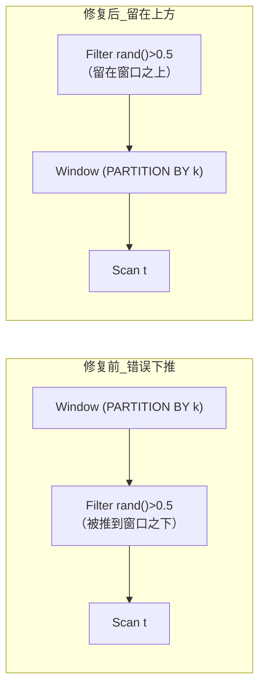

# 第 1 章：优化器为何算错 —— 两类"静默错结果"陷阱

> 本章行号引用基于写作时核实所用的 HEAD（`189b947566`，源码树与系列基线一致）。文中所有当前态引用写作 `路径:行号`、历史态引用写作 `sha:路径`，二者不混用；每条案例的 commit sha 均以 `git show` 亲自核实，diff 走读取自真实 hunk（截断处标注省略）。跨部分回引均已 grep 目标文件确认内容存在。
>
> **本章是案例章，采用"案例五段式"而非机制章的标准骨架**：每个案例按 `问题背景 → 根因分析 → 修复思路 → 源码对照 → 经验教训` 展开，对应"案例三问"——踩了什么坑、为什么会踩、怎么修的又为什么这么修。机制细节一律回链前六部分，本章的增量在于"用真实事故检验机制"。

第 2 部分第 3 章（[part2 ch3](../part2-query-lifecycle/03-nereids-rbo.md)）在讲谓词下推时留过一句预言：`> 历史上多个数据库（包括 Doris 自身早期）都在 outer join 谓词处理上栽过跟头，本系列 part7 案例集会专门收录这类正确性事故`（§3.3）。§3.6 的排查清单又把 part7 案例集写成了"结果错误怀疑重写时"的对照目标。本章是这句预言的**首批实证**（那句预言点名的 outer join 谓词专项事故不在 C1/C5 之列，留待后续案例收口，本章先兑现"谓词下推是历史 bug 高发区"这个更大的结论）：我们不重讲这个结论本身，而是把两起真实的 wrong-result 事故摊开，看清"静默返回错误行"到底是怎么从一行看似无害的守卫代码里长出来的。

优化器算错结果，比算慢可怕得多——慢会报警、会被 profile 抓住，错则不报错、不抛异常，只是行数或值悄悄不对，往往到下游对账才暴露。本章两个案例分别命中优化器正确性的两大陷阱类别：

- **案例一（C1，主案例，FE Nereids）**：命中"**等价变换的隐含前提**"。谓词下推、谓词推导这些"永远不亏"的规则，其"等价"是有前提的——前提之一是**谓词求值幂等**。当谓词里含 `rand()` / `uuid()` 这类非幂等（volatile）函数，且这类函数的输入 slot 集合为空时，规则里用来判断"能不能推"的全称守卫 `containsAll(emptySet)` 静默恒真，把易变谓词错误地推过了算子边界。这是一次 PR 同时给 8 个生产规则文件补守卫的"同一根因、多处规则"范式教材（含 NLJ 侧的同类兄弟规则，见源码对照段）。
- **案例二（C5，副案例，BE 执行）**：命中"**NULL 三值逻辑**"。相关 `NOT IN` 子查询在析取下被 FE 改写成 mark null-aware left anti join，BE 侧哈希表在探测键为 NULL 时**提前推进了探测下标**，null-probe 处理路径还没算出 mark 列就跳过了该行，导致结果不全。这是 FE 改写 + BE 执行协作的 NULL 语义 bug，核心 diff 仅两行。

两个陷阱有一个共同的抽象内核：**规则/算子在写下它的等价性时，隐式假设了一类输入不会出现**（幂等的谓词、非 NULL 的探测键），而恰恰是这类被忽略的输入类别，成了正确性 bug 的温床。一个在 FE 优化器（Java）、一个在 BE 执行引擎（C++），层次相隔甚远，却是同一种思维盲区的两次显影——这也是把它们放进同一章对照讲的原因：读完你要建立的直觉不是"记住这两个 bug"，而是"拿到任何一条等价变换或算子实现，先追问它对非幂等、对 NULL 这两类输入是否显式表过态"。

---

## 案例一：非幂等函数被跨算子下推（C1）

- **Commit**：`8255f94bc5`（`git show` 核实存在），message 标题 `[fix](nereids) Guard UniqueFunction in multiple filter/topn pushdown rules (#62742)`，PR 号 #62742 出现在 message 中，故引用。
- **根因层**：FE Nereids RBO 重写规则。

### 问题背景

先看现象。下面是一条**构造示例**（commit message 只给了根因概述与 release note，未附完整可复现 SQL，此 SQL 为笔者按根因构造，非取自 PR）：

```sql
-- 表 t 有列 k；期望语义：先按窗口分区算 row_number，再随机采样一半的行
SELECT * FROM (
  SELECT k, row_number() OVER (PARTITION BY k ORDER BY k) AS rn
  FROM t
) v
WHERE rand() > 0.5;   -- 非幂等谓词，作用在窗口结果之上
```

按 SQL 语义，`rand() > 0.5` 必须**在窗口函数算完之后**执行——它是对"已经带上 `rn` 的结果行"做随机采样。但谓词下推规则 `PushDownFilterThroughWindow` 若把 `rand() > 0.5` 推到 `Window` 算子**之下**，就变成"先随机丢掉一半基表行，再对幸存行算窗口"。窗口函数按分区计算，分区内容一变，每一行的 `row_number` / `rank` / `sum` 全变——结果与原语义完全不同，且**不报错**。

举个具象口径：设某分区 `k=1` 原有 5 行，正确语义下它们的 `rn` 应是 1..5，之后被 `rand()>0.5` 随机采样、`rn` 值不变；而错误下推后，5 行先被随机砍到 2 行，再算 `rn` 就只有 1、2 两个值——同一条输入行拿到的 `rn` 与正确语义相差甚远。用户看到的是"row_number 结果对不上"，却完全无从判断是优化器动了谓词位置。同类现象也出现在 Repeat（grouping set 采样口径变了聚合值变）、PartitionTopN（"top-N 后随机过滤"退化成"随机过滤后 top-N"，幸存行不再是真正的 top-N）、SetOperation（`INTERSECT` 变成"半个 A 交半个 B"而非"半个 (A 交 B)"）、Join（ON 谓词里的 `rand()` 求值粒度从"每对连接行一次"变成"每个输入行一次"）等多处边界。这也是为什么一次 PR 要同时动 8 个规则文件——它们共用同一个空 slot 守卫漏洞，只是触发的算子不同。

### 根因分析

根因是一句极通用的守卫失效。这些下推规则判断"一个谓词能否推到某算子之下"，普遍用的是"**谓词的输入 slot 是否被目标算子的可用 slot 全覆盖**"，即 `目标slot集合.containsAll(谓词.getInputSlots())`。这套判断在 §3.2 讲规则框架时提过——RBO 规则本质是"匹配一个计划模式 → 产出一个等价子树"（见 [part2 ch3](../part2-query-lifecycle/03-nereids-rbo.md) §3.2），而"等价"的一个隐含前提是谓词求值与位置无关（幂等）。

问题出在两个叠加的漏洞上：

1. **空集合让全称守卫恒真**。`rand() > 0.5` 这样的谓词，其 `getInputSlots()` 返回**空集**——它不引用任何列。而 `任何集合.containsAll(emptySet)` 在集合语义下恒为 `true`。于是守卫认为"谓词输入被目标算子全覆盖，可以安全下推"，把它一路推了下去。这就是 message 里那句根因：`a predicate like rand() > 0.5 has an empty input-slot set, so the containsAll(emptySet) / allMatch guards used by these rules silently returned true`。
2. **幂等前提从未被显式检查**。即便谓词有输入 slot（如 `t.k + rand() > 0.5`，输入 slot = `{t.k}`），只要它被推过 Window/Repeat 这类"改变行集合口径"的算子，非幂等函数的求值时机就变了。原规则只检查 slot 覆盖、从不检查"谓词是否含非幂等表达式"。

把这两点合起来看，本案例是 §3.3 那句"谓词能推过哪些算子取决于交换会不会改变语义"的又一实例——§3.3 已点名"推过 `Window`（窗口函数按分区算，提前过滤会改变分区内容）也要极其小心"，本案例正是这句提醒在 volatile 谓词上的兑现。它与 §3.3 的 outer join 案例是同一族病：**规则的等价性有隐含前提，前提之外的输入类别（此处是非幂等谓词）就是雷区**。

Nereids 早已为"是否含非幂等表达式"备好了判定原语：`ExpressionTrait` 的 `containsVolatileExpression()`（`fe/fe-core/src/main/java/org/apache/doris/nereids/trees/expressions/functions/ExpressionTrait.java:139`），它的实现是 `containsType(VolatileExpression.class) && anyMatch(expr -> ((ExpressionTrait) expr).isVolatile())`（同文件 `:139`~`:140`），底层 `isVolatile()` 在 `:135`。这里的建模值得一提：`rand()` / `uuid()` 这类函数实现 `VolatileExpression` 标记接口、`isVolatile()` 返回 true，而用户自定义的 volatile UDF 也走同一条判定（本 PR 的单测就专门构造了 `FunctionVolatility.VOLATILE` 的 `JavaUdf` 来覆盖 UDF 分支）。也就是说，判定工具一直存在、且已覆盖内置函数与 UDF 两类来源，缺的只是"在每条下推规则的守卫里把它调起来"——这恰恰说明 bug 不在"缺能力"，而在"规则作者没意识到自己的守卫有这个前提"。这类"能力早已具备、只是调用点漏了"的 bug，往往比"缺一整套机制"更隐蔽，因为代码看起来一应俱全。

### 修复思路：为什么这么修

修复的核心决策是——**不改判定原语，而是在每一条会移动谓词的规则里，把 `containsVolatileExpression()` 加进守卫**。为什么选"逐规则加守卫"而不是"在框架层统一拦截"？因为不同算子对 volatile 谓词的正确处理并不一致：

- 对 Window / Repeat / PartitionTopN：volatile 谓词**绝对不能下推**，只能留在算子上方；
- 对 SetOperation：只有 `UNION ALL` 是行到行 1:1 映射、下推安全，`UNION DISTINCT` / `INTERSECT` / `EXCEPT` 依赖去重/取交/取差前的完整行集合，不能下推；
- 对 Join 的 ON 谓词：volatile 谓词要留在 join 里（保持"每对连接行求值一次"的粒度），而重复出现的 volatile 表达式还要靠 `AddProjectForVolatileExpression` 物化成一个共享值，避免被多次独立求值；
- 对哈希连接条件抽取（`JoinUtils` 里的 hash 条件判定）与谓词推导（`InferPredicates`）：volatile 相等式不能当哈希连接条件、volatile 谓词不能被克隆到"原本没求值过它"的子树里。

这些差异决定了不存在一个"框架层一刀切"的正确处理——每条规则要的是"跳过 / 留在原地 / 物化"三种不同动作，所以修复必须逐规则落地。这也解释了为什么一个根因会散成一次覆盖 8 个规则文件的 PR。

### 源码对照

先看最能说明问题的 Window 规则。这是 `git show 8255f94bc5` 的真实 hunk（`fe/fe-core/src/main/java/org/apache/doris/nereids/rules/rewrite/PushDownFilterThroughWindow.java`）：

```java
     public static boolean canPushDown(Expression conjunct, Set<SlotReference> commonPartitionKeys) {
-        return commonPartitionKeys.containsAll(conjunct.getInputSlots());
+        // A conjunct that contains a volatile function such as rand()/uuid()
+        // must NOT be pushed below the window node. ...
+        // a predicate like `rand() > 0.5` has empty input slots, so `containsAll(emptySet)`
+        // would otherwise wrongly return true.
+        return !conjunct.containsVolatileExpression()
+                && commonPartitionKeys.containsAll(conjunct.getInputSlots());
     }
```

**修复前语义**：`canPushDown` 只问"分区键是否覆盖谓词输入 slot"，`rand()>0.5` 的空 slot 让它恒返回 `true`，谓词被推到 Window 之下。**修复后语义**：先短路判定"谓词含 volatile 就一律不推"，`&&` 的左操作数为 `false` 时右边的 `containsAll` 不再有机会误判。这段修复后的代码**在当前 HEAD 仍然存在**，位于 `fe/fe-core/src/main/java/org/apache/doris/nereids/rules/rewrite/PushDownFilterThroughWindow.java:100`~`:101`（已 grep 核实，未随演进漂移语义）。

PartitionTopN 是同一套守卫的复用（`git show` hunk，省略前后上下文）：

```java
-                if (partitionKeySlots.containsAll(exprInputSlots)) {
+                // ... "top-N then random filter" replaced by "random filter then top-N" ...
+                if (!expr.containsVolatileExpression() && partitionKeySlots.containsAll(exprInputSlots)) {
                     bottomConjunctsBuilder.add(expr);
                 } else {
                     upperConjunctsBuilder.add(expr);
```

当前 HEAD 对应 `fe/fe-core/src/main/java/org/apache/doris/nereids/rules/rewrite/PushDownFilterThroughPartitionTopN.java:80`。这里的注释还点出了第二重风险：`Empty-input-slot predicates like rand() > 0.5 would also bypass the containsAll check otherwise`——即便撇开"提前过滤改变 top-N 口径"，空 slot 谓词本身就能绕过 `containsAll`，两个漏洞在这条规则里叠加出现。

SetOperation 的守卫比其余几处更精细，因为它要区分"能推"与"不能推"两种 set-op。`git show` 的注释把这层区分讲得很清楚：`UNION ALL` 每个分支行恰好对应一条输出行（1:1），在分支里每行求一次 `rand()` 仍等价于每输出行求一次；而 `UNION DISTINCT` / `INTERSECT` / `EXCEPT` 的语义依赖去重/取交/取差**之前**的完整分支行集合，在各分支独立采样会改变参与运算的行——message 举的例子是 `INTERSECT becomes "half of A intersect half of B" instead of "half of (A intersect B)"`。所以这条规则不是简单"含 volatile 就整体不推"，而是把谓词拆成"可推"与"须留在上方"两组：仅 `UNION ALL` 时全部可推，否则把含 volatile 的 conjunct 留在 set-op 之上、其余下推（当前 HEAD `fe/fe-core/src/main/java/org/apache/doris/nereids/rules/rewrite/PushDownFilterThroughSetOperation.java:77`、`:82`、`:90`）。这正对应前文"三种不同动作"里最复杂的一种——同一条规则内部同时做"下推"与"留在原地"。

Join 与谓词推导两处用的是"留在原地 / 不克隆"的变体。`PushDownJoinOtherCondition` 把含 volatile 的 ON 谓词强制留在 `remainingOther`（当前 HEAD `fe/fe-core/src/main/java/org/apache/doris/nereids/rules/rewrite/PushDownJoinOtherCondition.java:82`）；`InferPredicates` 在两处推导循环里 `continue` 跳过 volatile 谓词，避免把它克隆进一个原本没求值过它的子树（当前 HEAD `fe/fe-core/src/main/java/org/apache/doris/nereids/rules/rewrite/InferPredicates.java:221` 与 `:253`，注释直言 `never clone volatile predicates into a subtree that did not already evaluate them`）；`JoinUtils` 的哈希连接条件判定新增一句早退（`git show` hunk）：

```java
         public boolean isHashJoinCondition(EqualPredicate equal) {
+            if (equal.containsVolatileExpression()) {
+                return false;
+            }
             Set<ExprId> equalLeftExprIds = equal.left().getInputSlotExprIds();
```

当前 HEAD `fe/fe-core/src/main/java/org/apache/doris/nereids/util/JoinUtils.java:121`~`:122`。

还有一个容易漏数的兄弟规则：`ProjectOtherJoinConditionForNestedLoopJoin`——它负责把 NLJ 的 other 条件里的确定性子表达式抽成 project 别名，一旦把 `t1.a + rand() > t2.b` 这类混合表达式（`inputSlots={t1.a}`）也抽进某个孩子的 project，`rand()` 的求值粒度就从"每对连接行"变成"每个孩子行"，静默改结果。修复给它加了同一个守卫：`if (expression.containsVolatileExpression()) { return super.visit(expression, ctx); }`——含 volatile 就保持 conjunct inline、只继续递归抽取其中的确定性子表达式（当前 HEAD `fe/fe-core/src/main/java/org/apache/doris/nereids/rules/rewrite/ProjectOtherJoinConditionForNestedLoopJoin.java:117`）。**连它在内，本 PR 一共给 8 个生产规则文件补了 `containsVolatileExpression()` 守卫**（此外还顺带清理了一处无关的 `CastException` 构造，与本案例无关，不计入）——这个"8"要以 `git show 8255f94bc5` 的文件清单为准，而非 message 里列的 7 个编号条目：**message 的编号叙述漏了 NLJ 这条，正是"结论取自 diff 不取自 message"该自我检验的地方**。

最复杂的一处是 `AddProjectForVolatileExpression`：join 无法在"连接对"这个作用域插 project，但重复出现的 volatile 表达式又必须物化成一个共享值（否则 `t.a >= rand() AND t.a <= rand()` 里两个 `rand()` 会被各求一次，退化成永假/永真的荒谬谓词），于是新增了 `rewriteJoinExpressions`（当前 HEAD `fe/fe-core/src/main/java/org/apache/doris/nereids/rules/rewrite/AddProjectForVolatileExpression.java:274`）与内部结果类 `JoinRewriteResult`（同文件 `:383`）。它的落侧决策有一层讲究：slot-free 的 volatile 函数（如裸 `rand()`）用**所在 conjunct 的 slot**来选边，所以 `t2.k + rand()` 能把 `rand()` 物化到右孩子；带输入 slot 的 volatile 函数则用**自身 slot**选边，避免仅因所在 conjunct 也引用了 `t1` 就把 `volatile_udf(t2.k)` 错挂到左侧；自身 slot 横跨两个孩子的则无法物化进任一侧，保持原样。这段逻辑的单测在 diff 里覆盖了"物化到右侧""默认物化到左侧""带右侧输入的 volatile 函数物化到右侧""跨双侧则跳过"四个分支。

**一处必须诚实指出的 message 与 diff 出入**：commit message 的第 1 条列的是对 Repeat 规则的守卫，但本次 `git show 8255f94bc5` 的**改动文件清单里并不包含**该规则源文件；而当前 HEAD 的 `fe/fe-core/src/main/java/org/apache/doris/nereids/rules/rewrite/PushDownFilterThroughRepeat.java:74`~`:75` 仍是不带 volatile 守卫的裸 `commonGroupingSetExpressions.containsAll(conjunctSlots)`。这说明 message 描述的意图**宽于**实际 diff 的落地范围（Repeat 的守卫或在其他 PR、或尚未补齐）。这恰好印证了本系列的写作纪律：**结论只能取自 diff，不能取自 message 的叙述**——同样地，读者复盘时判断"某条规则到底修没修"，也应以文件清单和 hunk 为准，而非 message 的自述。

同一个 commit 还有第二处 message 与代码的漂移：message 通篇把守卫方法称作 `containsUniqueFunction()`（`This PR adds containsUniqueFunction() guards to the following rules`），而实际 diff 里所有守卫调用的是 `containsVolatileExpression()`——方法名对不上。这类"叙述用词与真实符号不一致"的漂移无伤正确性，但会误导按 message 里的方法名去 grep 源码的人（grep `containsUniqueFunction` 一无所获）。它和上面的 Repeat 漏项是同一个教训的两面：**读 commit 要读 diff 的符号本身，message 的措辞只是作者当时的心智模型，可能与落地代码有偏差**。

下面用一张图对照 C1 的变换前后计划形态（以 Window 为例）：



左侧：谓词被推到 Window 之下，先随机丢行再算窗口，分区内容改变、每行窗口值错。右侧：守卫拦下 volatile 谓词，Filter 留在 Window 之上，窗口先算完再采样，语义正确。

### 经验教训

可迁移的模式有三条：

1. **等价变换必须显式列出前提，前提之外的输入类别就是 bug 温床**。谓词下推的等价性隐含"谓词求值幂等"这一前提；一旦被 `rand()`/`uuid()`/`uuid_numeric()`/`random_bytes()` 这类非幂等输入命中，等价即破。写重写规则时，"这条规则对什么样的表达式是不安全的"应当和"它对什么是安全的"一样被显式写进守卫，而不是靠"通常不会有人这么写"来兜底。
2. **空集合会让全称量词守卫（`containsAll` / `allMatch` / `all`）静默恒真**。这是极通用的坑，远不止 SQL 优化器——任何"检查 X 的所有元素是否满足条件"的守卫，都要单独想清楚"X 为空时该返回什么、这个默认值是否安全"。本案例里 `containsAll(emptySet)==true` 把"没有依赖"误当成"依赖被满足"。
3. **同一根因会散落在多条规则里，判定原语要中心化、调用点要逐一补齐**。Nereids 早有 `containsVolatileExpression()` 这个中心化判定，但八个规则文件各自的守卫都要显式调用它才生效。修一条规则只是止一个血点；系统性根因要用"grep 所有移动/克隆谓词的规则"的方式扫一遍，才不会漏。

---

## 案例二：mark null-aware anti join 提前推进探测行丢结果（C5）

- **Commit**：`a7ad76ae57`（`git show` 核实存在），message 标题 `[fix](be) Preserve null probe rows in mark anti join (#63767)`，PR 号 #63767 出现在 message 中。
- **根因层**：BE 哈希连接执行（`be/src/exec/common/hash_table/join_hash_table.h`）。

### 问题背景

先解释"为什么是 mark join"。普通的 `NOT IN (子查询)` 如果单独出现在 `WHERE` 里，可以直接改写成 anti join——匹配上的行丢弃、匹配不上的行保留，一步过滤到位。但一旦 `NOT IN` 处在析取（`OR`）之下，`NOT IN` 的真假只是整个 `OR` 表达式的一个操作数，不能就地决定行的去留：`A OR B` 里 `A`（`NOT IN` 的结果）为假时，行还可能因 `B` 为真而保留。所以 FE 不能用"直接过滤"的 anti join，而要用 **mark** 变体——不删行，而是给每个探测行算出一个布尔 mark 列（表示"该行是否满足 `NOT IN`"），把这个 mark 当成一个普通布尔列交回上层，让上层的 `OR` 表达式去参与三值逻辑运算。再叠加 NULL 传染语义（`NOT IN` 里只要集合含 NULL，结果可能是 NULL 而非 true/false），就成了 **mark null-aware left anti join**。mark 列一旦某行没算出来，上层 `OR` 就少了一个操作数，行就被错误地丢了——这正是本 bug 的破坏路径。

commit message 附了回归用例名，下面是取自该 PR 回归脚本 `regression-test/suites/correctness/test_subquery_in_disjunction.groovy` 的真实用例（非构造）：

```sql
-- outer: (1,0),(11,NULL)；inner: (1,10),(20,NULL)
SELECT id, a FROM test_sq_dj_nullable_outer o
WHERE o.a NOT IN (
    SELECT i.a FROM test_sq_dj_nullable_inner i
    WHERE i.id > o.id
) OR o.id IN (1, 11)
ORDER BY id;
```

期望结果（取自 PR 更新的 `.out` 基线 `test_subquery_in_disjunction.out`）是两行：`1  0` 与 `11  \N`。bug 表现为：当**探测侧的 join key 为 NULL**（这里 `o.a` 在 `id=11` 那行是 NULL）时，该探测行被提前跳过、mark 列还没算就丢了，最终结果**少行**。message 的原话是 `the probe row was skipped before the mark column was evaluated by the outer disjunction, producing incomplete query results`。

### 根因分析

这个案例横跨 FE 改写与 BE 执行两层，链路是这样的：

- **FE 层（改写来源）**：相关 `NOT IN` 子查询的去关联，正是 [part2 ch3](../part2-query-lifecycle/03-nereids-rbo.md) §3.3 "子查询去关联"讲的那条高危路径——§3.3 明说 `NOT IN 子查询要处理 NULL 传播……任何一个条件判断写松了，都会让"能跑"的 SQL 返回错误结果`。改写产物落到执行层就是 `NULL_AWARE_LEFT_ANTI_JOIN`。
- **BE 层（bug 现场）**：这个 join 类型在算子层有独立分支，见 [part2 ch8](../part2-query-lifecycle/08-operators-rf-spill.md) §8.2——§8.2 明确写道 `NULL_AWARE_LEFT_ANTI/SEMI JOIN 是 NOT IN (subquery) 的落地，NULL 具有"传染性"（build 侧只要有一个 NULL，左侧任何行都不能确定不在集合里）`，且 mark join 这类"依赖 probe 全部结束才能定"的输出必须挂在正确的时点、不能中途跳过。

bug 出在最底层的哈希表探测函数 `_find_null_aware_with_other_conjuncts_impl`。它的设计是：外层调用方（probe 算子）会分批调用这个函数，函数返回一个探测下标 `probe_idx` 供下次续跑；探测键为 NULL 的行需要走**专门的 null-aware 处理路径**（NULL 传染语义决定了这类行不能简单当"不匹配"处理，而要按三值逻辑算 mark 值）。

要理解为什么"提前 `++`"是致命的，得看清这个函数的分批循环结构。它有一个内部 lambda `do_the_probe`（`be/src/exec/common/hash_table/join_hash_table.h:436`），负责对当前 `probe_idx` 这一行做完整的 null-aware 匹配——包括在没匹配上时切到"从 build 侧挑 NULL 键"（`picking_null_keys = true`，`:441`）、以及在 build 链走完后补一条 `build_idx == 0` 的记录（`:463`~`:468`）来承载 mark 的三值结果。也就是说，**一个探测行的 mark 值是否算得出，取决于它有没有被喂进 `do_the_probe`**。主循环（`:477`）每轮先取 `build_idx = build_idx_map[probe_idx]`，再判断探测键是否为 NULL。

原实现里，当遇到 `null_map[probe_idx]`（探测键为 NULL）时，代码执行了 `probe_idx++` 再 `break`——它在把这一行喂进 `do_the_probe` **之前**就把探测下标推过了这个 NULL 行，然后跳出循环。于是外层调用方拿到的续跑下标已经越过了 NULL 行，下一轮从 NULL 行的**后一行**开始，这个 NULL 探测行永远不会进入 `do_the_probe`，它的 mark 列没算出来就永久丢了。这与 §8.2 的告诫如出一辙：`凡是语义上依赖"probe 全部结束"的输出（outer 未匹配、mark join 标记），都必须挂在……之后，而不能在 probe 中途做`——这里是"探测中途提前推进下标"导致某一行的 mark 输出被整体吞掉。

### 修复思路：为什么这么修

修复目标是：**探测下标必须停在 NULL 行上，让后续的 null-aware 路径能接手这一行**。修复动作是把 `probe_idx++` 换成"重置 build 下标 + 清标志 + break"，而不再推进 `probe_idx`。

为什么这么修而不是"在别处补处理"？因为这个函数的返回契约是"`probe_idx` 指向下一个待处理行"。要让 NULL 行不丢，最小且最贴合契约的做法就是**不推进下标**——让函数返回时 `probe_idx` 仍指向 NULL 行，调用方下一轮自然会把它交给 null-aware 分支。同时把 `build_idx` 置 0、`picking_null_keys` 置 false，是为了让函数尾部那句 `probe_idx -= (build_idx != 0)`（`be/src/exec/common/hash_table/join_hash_table.h:494`）不再回退，并把"正在从 build 侧挑 NULL 键"的状态清干净，确保下一轮从这个 NULL 探测行的干净状态重新进入。相比"在调用方额外记一个'上次跳过了哪行'的补丁"，改在下标推进的源头是唯一不破坏返回契约的改法。

### 源码对照

`git show a7ad76ae57` 的核心 hunk（`be/src/exec/common/hash_table/join_hash_table.h`，仅两行改动）：

```cpp
             /// If the probe key is null
             if constexpr (has_null_map) {
                 if (null_map[probe_idx]) {
-                    probe_idx++;
+                    build_idx = 0;
+                    picking_null_keys = false;
                     break;
                 }
             }
```

**修复前语义**（历史态 `a7ad76ae57:be/src/exec/common/hash_table/join_hash_table.h`）：遇到 NULL 探测键，`probe_idx++` 把下标推过该行再 `break`，NULL 行的 mark 列被跳过 → 结果少行。**修复后语义**：不推进 `probe_idx`，改为 `build_idx = 0; picking_null_keys = false; break;`，下标停在 NULL 行，控制权交还调用方，由 null-aware 路径正确算出该行的 mark 值。

这段修复后的代码**在当前 HEAD 仍然存在**，位于 `be/src/exec/common/hash_table/join_hash_table.h:483`~`:485`（已 grep 核实）。结合上下文看返回契约：函数尾部先做 `probe_idx -= (build_idx != 0)`（`:494`）——这句"若 build 侧还没走完就把 probe_idx 回退一格"是为分批续跑设计的，修复把 `build_idx` 置 0 后，这句回退不会误伤停在 NULL 行的下标；随后 `return std::tuple {probe_idx, build_idx, matched_cnt, picking_null_keys};`（`:495`）把这四个状态整体交还调用方，调用方在 `be/src/exec/operator/join/process_hash_table_probe_impl.h:516`~`:525` 处解包并保存 `_picking_null_keys`，`_null_flags` 最终被拷进 mark 列的 null map（同文件 `:748`~`:749`）——`probe_idx` 停在 NULL 行，正是这条链路能把 NULL 行的 mark 值算对的前提。

对照上文那条构造数据（outer 的 `id=11` 行 `a` 为 NULL），修复前后的结果是：

| id | a | 修复前（错） | 修复后（对） |
|---|---|---|---|
| 1 | 0 | 返回 | 返回 |
| 11 | \N | **丢失** | 返回 |

`id=11` 那行因探测键 `a` 为 NULL，在旧实现里被提前推进下标而丢，`OR o.id IN (1,11)` 这个本该让它保留的析取条件根本没机会参与——这就是"少行"的直接来源。

PR 同时把此前被注释掉的四条回归断言（`qt_hash_join_with_other_conjuncts5`~`8`，原带 `TODO: enable this after DORIS-7051 and DORIS-7052 is fixed` 注释）重新打开，并新增了 `not_in_nullable_mark_join` 系列三个用例——即上文那条 SQL 及其变体，覆盖"探测侧 NULL""析取下 NULL""build 侧也带 NULL"三种触发形态。

### 经验教训

可迁移的模式有三条：

1. **迭代器/游标的推进时机是隐性契约，"提前推进"= 丢一次处理机会**。凡是"函数分批处理、用一个下标续跑"的设计，下标何时 `++` 就是契约的一部分。需要"回头再处理"的行（此处是 NULL 探测行）绝不能在决定跳出前就推进下标，否则调用方永远拿不到它。这是通用的游标时序坑，与哈希表无关。
2. **NULL 三值逻辑是执行层与改写层都必须显式对待的一类输入**。和案例一的"非幂等谓词"对称：NULL 是另一类"规则/算子容易假设它不出现"的输入。`NOT IN` 的 NULL 传染语义要求探测侧 NULL 行走专门路径——任何"把 NULL 当普通不匹配"的简化都会静默错结果。改写层（FE 去关联）和执行层（BE null-aware 分支）任一处漏了 NULL，结果都错。
3. **FE 改写与 BE 执行是一份需要对齐的契约**。FE 之所以敢把 `NOT IN` 改写成 mark null-aware anti join，是因为它假设 BE 的该分支会正确处理 NULL 探测行的 mark 输出。这个跨层契约没有类型系统保护，一端的实现细节（下标提前推进）就能让另一端的等价改写失真。复盘这类 bug 时，必须同时看 FE 产出了什么 join 类型、BE 对该类型的执行是否真的兑现了 FE 假设的语义。

---

## 章末：疑似优化器错结果的排查启示

遇到"结果不对（是行数/值错，不是慢），怀疑优化器"时，把 [part2 ch3](../part2-query-lifecycle/03-nereids-rbo.md) §3.6 的规则 bisect 法与本章两个根因模式合起来用：

1. **先最小化复现，再做规则级 bisect**。按 §3.6 症状 C 的做法，把 SQL 削到最小仍能复现的形态，然后用 `SET disable_nereids_rules = "SOME_RULE"` 逐条关掉可疑的重写规则（规则名取自 `RuleType` 枚举），对比结果是否变对。§3.6 症状 B 已把这套二分法讲透——关掉某条规则后结果恢复，基本就锁定了它破坏了等价性。谓词下推、outer join 消除、子查询去关联是 §3.6 点名的三大高危区。

2. **用本章两个根因模式先验筛查**：
   - **含非幂等函数？** 如果最小复现 SQL 里出现 `rand()` / `uuid()` / `uuid_numeric()` / `random_bytes()` 或任何 volatile UDF，尤其当它落在 Window / Repeat / PartitionTopN / SetOperation / Join 边界附近，优先怀疑"volatile 谓词被跨算子下推"（案例一）。对照 `EXPLAIN REWRITTEN PLAN`，看 volatile 谓词是否被推到了它本不该去的算子之下。
   - **含 `NOT IN` + NULL？** 如果 SQL 是 `NOT IN (子查询)`、探测列或 build 列可空、且处于 `OR` 之下，优先怀疑 null-aware mark anti join 的 NULL 处理（案例二）——这类 bug 只在探测侧或 build 侧真的出现 NULL 时才触发，小数据量、无 NULL 的样本测不出来，务必用带 NULL 的数据复现。

3. **判断"是否已知问题"时，核对 commit diff 而非 message 叙述**。案例一的 message 与实际 diff 出入（Repeat 未在本 PR 落地）提醒我们：确认某条规则"到底修没修、修到哪一版"，要以 `git show` 的文件清单和 hunk 为准。反过来，若你复现出的错结果恰好落在 message 声称已修、但 diff 未覆盖的算子边界上（如本例的 Repeat + volatile 谓词），那很可能是一个尚未收口的活口子，值得单独提 issue。

两个案例还共享一条方法论价值：**wrong-result bug 的复现极度依赖"命中那类被忽略的输入"**。案例一要 SQL 里真的出现 volatile 函数、且落在敏感算子边界；案例二要探测侧或 build 侧真的出现 NULL、且处于析取之下。用"干净"的样本数据（无 volatile、无 NULL）跑一万遍都测不出来——这解释了为什么这类 bug 常在生产环境的真实脏数据上才暴露，也提示写回归用例时必须刻意构造这两类边界输入。案例二的 PR 正是这么做的：它一次性重开了四条此前因未修而被注释掉的断言、并新增了带 NULL 的三个用例，把"探测侧 NULL""析取下 NULL""build 侧 NULL"三种触发形态钉进了基线。

两个案例、两类陷阱，收束成一句可迁移的判据：**优化器的每一次"等价"变换都有隐含前提，非幂等输入与 NULL 输入是击穿这些前提的两大常客**——排查疑似错结果时，先问"这条 SQL 里有没有这两类输入落在了敏感的算子边界上"。
