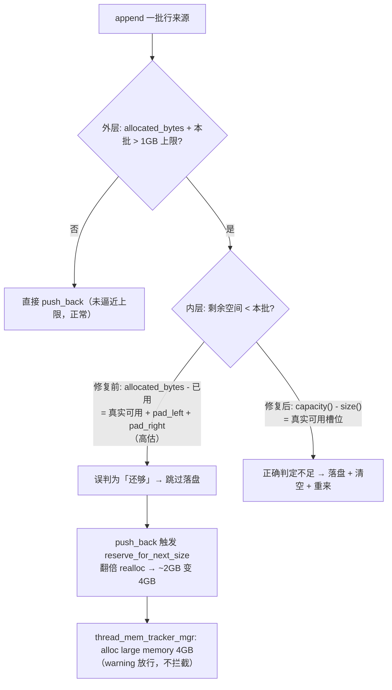

# 第 3 章：内存与性能回退 —— 两类"容量语义误判"陷阱

> 本章行号引用基于写作时核实所用的 HEAD（`8ecc272355`，源码树与系列基线一致）。文中所有当前态引用写作 `路径:行号`、历史态引用写作 `sha:路径`，二者不混用；每条案例的 commit sha 均以 `git show` 亲自核实，diff 走读取自真实 hunk（截断处标注省略）。跨部分回引均已 grep 目标文件确认内容存在。
>
> **本章是案例章，沿用"案例五段式"**：每个案例按 `问题背景 → 根因分析 → 修复思路 → 源码对照 → 经验教训` 展开，对应"案例三问"——踩了什么坑、为什么会踩、怎么修的又为什么这么修。机制细节一律回链前六部分，本章的增量在于"用真实事故检验机制"。

[part6 第 6 章](../part6-operations/06-memory.md) 把 BE 的内存模型讲全了：MemTracker 记账树、三层限额、`GlobalMemoryArbitrator` 的水位与自保，最后收束成一句判据——查询级/导入级"在自己预算内自救"（spill、flush、反压，不丢结果），进程级才"跨任务仲裁与牺牲"。那一章讲的是"内存要爆了，这套机制怎么兜"。本章要问的是它的**上游**问题：**在还没轮到内存模型兜底之前，代码自己就把内存用量算错了，会怎样？**

内存回退（memory regression）与"错结果"不同——它通常不在前台报错，而是表现为一次异常的巨量分配、一段莫名膨胀的进程 RSS，或一次被内核 OOM killer 干掉的进程。这类 bug 的抽象内核往往惊人地一致：**某个"容量"或"上限"的语义被误解了**。要么把一个数字当成了它并不代表的含义（把含 padding 的总分配量当成可用空间），要么用一个不完整的量纲去卡上限（只数行数、不数字节）。本章两个案例分别命中这两类模式：

- **案例一（C10，主案例，BE compaction 读路径）**：命中"**容量 API 的语义契约被误读**"。vertical compaction 的行来源缓冲区 `RowSourcesBuffer` 用 `allocated_bytes()` 减去已用量来估算"还能放多少",但 `PaddedPODArray` 的 `allocated_bytes()` **包含了两端的 padding**（`pad_left`/`pad_right`，不能用于存元素）。这个高估让它错过了一次该做的落盘（spill），随后一次 `push_back` 触发 realloc，一口气申请了 4GB。
- **案例二（C11，副案例，CDC 输入侧）**：命中"**背压上限的量纲缺失**"。cdc_client 里 Debezium 的 `ChangeEventQueue` 只受一个**行数上限**约束（`max.queue.size`，默认 8192），字节上限默认 `0`（禁用）；遇到宽行（每行约 2MB），队列可以涨到 `2MB × 8192 ≈ 16GB` 把进程 OOM。修复给队列补上一个按堆自适应的**字节上限**。

两个案例，一个误读了"容量"的定义、一个漏掉了"上限"的一个维度，但抽象内核相通：**任何"还能放多少 / 最多放多少"的判断，都依赖对一个数字的语义假设；假设一旦与实现不符，内存就会在你以为安全的地方失控。** 读完这一章你要建立的直觉是——见到任何"容量检查 / 上限设置"的代码，先追问两件事：这个数字**到底代表什么**（它是我以为的那个量吗）？这个上限**卡全了吗**（行数、字节、时间，缺哪个维度就从哪个维度爆）？

---

## 案例一：vertical compaction 中 PaddedPODArray 容量误判触发 4GB 分配（C10）

- **Commit**：`63e90d34e4`（`git show` 核实存在），message 标题 `[fix](compaction) Fix incorrect memory availability check in RowSourceBuffer during vertical compaction (#63152)`，PR 号 #63152 出现在 message 中，故引用。
- **根因层**：BE compaction 读路径，vertical merge 的行来源缓冲区落盘阈值判定（历史态 `63e90d34e4:be/src/storage/iterator/vertical_merge_iterator.cpp`；该 commit 提交时源码树已完成 `be/src/vec/olap/` → `be/src/storage/iterator/` 的目录重构，故历史态与当前态同路径）。

### 问题背景

现象是 `be.INFO` 里一条自带完整分配栈的告警（commit message 原文附带，此处摘录关键两行并标注省略）：

```
thread_mem_tracker_mgr.h:248] alloc large memory: 4294967296, not in query or load, this is just a warning, not prevent memory alloc, stacktrace:
        ...（省略栈帧 0#~1#：ThreadMemTrackerMgr::consume / Allocator::realloc_impl）...
        2#  ...PODArrayBase<...>::reserve_for_next_size<>()
        3#  doris::vectorized::RowSourcesBuffer::append(...)
        4#  doris::vectorized::VerticalHeapMergeIterator::next_batch(...)
        ...（省略栈帧 5#~12#：VerticalBlockReader / Merger / Compaction / CloudCompactionMixin 直到 CloudCumulativeCompaction）...
        13# ...CloudStorageEngine::_submit_cumulative_compaction_task(...)
        ...（省略栈帧 14#~17#：ThreadPool / Thread supervise）...
```

`4294967296` 正是 4GB。这条栈把事故链路交代得清清楚楚：一次 **cloud cumulative compaction** 任务（栈底 12#/13#），走到 `VerticalHeapMergeIterator` 的 `next_batch`（4#），调 `RowSourcesBuffer` 的 `append`（3#），在 `PODArrayBase` 的 `reserve_for_next_size`（2#）里触发了一次 4GB 的 realloc（1#）。

这里有一个**必须点破的关键**，也是本案例最容易被忽略的教学点：这行日志是一条 **warning，不是错误**——`this is just a warning, not prevent memory alloc`。也就是说，这 4GB **照样被分配了出去**。它不像 `MEM_LIMIT_EXCEEDED` 那样会拦住分配（[part6 第 6 章](../part6-operations/06-memory.md) §6.4 讲过那条报错的产生点与 `type` 分诊），它只是超过了一个"值得打栈看看"的告警阈值。当前 HEAD 上这个阈值是 `stacktrace_in_alloc_large_memory_bytes`（`be/src/common/config.cpp:187`，默认 `2147483647`，即 2GB-1），配套还有一个默认关闭的硬熔断 `crash_in_alloc_large_memory_bytes`（`:189`，默认 `-1`）。4GB 越过了 2GB 告警线、但没开熔断，于是分配放行、只留一行栈——这条 warning 是**症状**，不是防线。真正的危害是：compaction 是后台任务，这种瞬时巨量分配叠加多任务并发，足以把进程推向 OOM，或触发 §6.3 的进程级自保去牺牲正在跑的查询。

要理解这条链路，得先接上机制。vertical compaction（列式合并）是 compaction 走的读路径，与查询走的行式合并分属两个 reader 子类——[part5 第 3 章](../part5-storage-engine/03-read-path.md) §3.3 点明过：`VerticalBlockReader`（`be/src/storage/iterator/vertical_block_reader.h:48`）走列式合并、是 compaction 的路，由 `be/src/storage/merger.cpp:258` 处构造。列式合并的做法是**一列一列地合**：先跑一遍 key 列的归并、把"每一行最终该取自哪个输入流"的决策序列记下来，后续每个非 key 列组直接按这份决策序列取数，不必重复比较。这份"每行取自哪个源"的决策序列，就存在 `RowSourcesBuffer` 里——它是一个 `PaddedPODArray<UInt16>`，每个 `UInt16` 编码一行的来源。合并的行越多，这个缓冲区越大；大到一定程度，它要能**落盘**（serialize 到临时文件、清空内存再继续），否则单次 compaction 的这份行来源就能把内存撑爆。落盘阈值判定，正是出事的地方。

### 根因分析

根因是**一个容量 API 的语义被误读**：`allocated_bytes()` 返回的"总分配字节"里，含有 padding，而 padding 不能用于存元素——把它当"可用空间"去算，就会系统性地高估。

先看 `RowSourcesBuffer` 的落盘判定逻辑（历史态 `63e90d34e4` 修复前）。`append` 一批新的行来源前，它分两步判断：

1. **外层**：`allocated_bytes() + 本批字节 > 配置上限` 吗？上限是 `vertical_compaction_max_row_source_memory_mb`（`be/src/common/config.cpp:452`，默认 `1024`，即 1GB）。只有缓冲区已经逼近上限，才进入第二步考虑落盘。
2. **内层（bug 所在）**：修复前用 `allocated_bytes() - size() * sizeof(UInt16) < 本批字节` 判断"剩余空间够不够放这一批"。若判定**不够**，就落盘、清空、重来；若判定**够**，就跳过落盘、直接 `push_back`。

问题就在内层这个"剩余空间"的算法。要看懂它错在哪，得先弄清 `PaddedPODArray` 的内存布局。`PODArray` 头文件里有一张 ASCII 图把这层讲得很直白（当前态 `be/src/core/pod_array.h:86`~`:92`，为 vectorized 内存分配保留两端 padding 以便 SIMD 越界读写安全）：

```
 * If reserve 4096 bytes, used 512 bytes, pad_left = 16, pad_right = 15, the structure of PODArray is as follows:
 * ...（省略中间几行文字说明）...
 * pad_left ----- c_start -------------c_end ---------------------------- c_end_of_storage ------------- pad_right
 * ...（省略指针注释行）...
 *    +-------------------------------------- allocated_bytes (4096 bytes) -----------------------------------+
```

关键在于三个量各自的定义（当前态 `be/src/core/pod_array.h`）：

- `size()`（`:245`）= `(c_end - c_start) / ELEMENT_SIZE`——已存元素数。
- `capacity()`（`:246`）= `(c_end_of_storage - c_start) / ELEMENT_SIZE`——**可存元素槽位数**（`c_end_of_storage` 不含 `pad_right`）。
- `allocated_bytes()`（`:249`）= `c_end_of_storage - c_start + pad_right + pad_left`——**总分配字节，两端 padding 都算进去了**。

把定义代进修复前那个减法：`allocated_bytes() - size() * sizeof(UInt16)` 展开等于 `(c_end_of_storage - c_end) + pad_right + pad_left`。而**真正可用于放新元素的字节**只有 `c_end_of_storage - c_end` 这一段。也就是说，修复前的"剩余空间"**凭空多算了 `pad_right + pad_left` 字节**——它把两端本不能存元素的 padding，当成了还能放数据的空当。

这个高估在正常小缓冲区下无害（多算十几个字节无关紧要），但当缓冲区已经逼近 1GB 上限、即将触发落盘的临界点上，它就致命了：内层判定本该得出"剩余不够、必须落盘",却因为多算了 padding 而误判成"还够、不用落盘"，于是跳过落盘、执行 `push_back`。而此刻缓冲区其实已经满了，`push_back` 触发 `reserve_for_next_size`——它的策略是**翻倍**（当前态 `be/src/core/pod_array.h:217`，`realloc(allocated_bytes() * 2, ...)`）。一个已经涨到约 2GB 的缓冲区翻倍，就是那条告警里的 4GB。

一句话收束根因：**`allocated_bytes()` 的语义是"总分配（含 padding）",不是"可用空间"；用它减去已用量来估剩余空间，会系统性高估 `pad_left + pad_right`，在落盘临界点上把"该落盘"误判成"还能放",随后的翻倍 realloc 撞穿了配置上限。**

下面用一张图把误判如何绕过落盘、放大成翻倍分配的形状画出来：



### 修复思路：为什么这么修

修复只有一处、极小，但精准：**把估算可用空间的口径，从"字节减法"换成"元素槽位减法"——用 `capacity() - size()` 直接得到真正可存元素的槽位数**。

为什么这么修最贴合本质？因为 bug 的根不是"减法算错了"，而是"用错了那个数字的语义"。`allocated_bytes()` 天生包含 padding，任何基于它做的"可用空间"推导都会带上这份高估；只要还用它，就还得手动把 `pad_left + pad_right` 减回去——而 padding 的具体值（`pad_right`/`pad_left` 经过 `integerRoundUp` 对齐，见 `be/src/core/pod_array.h:122`~`:124`）依赖模板参数，在 `append` 这一层根本不该关心。而 `capacity()` 的语义**恰好就是**"能存多少个元素"——它内部已经用 `c_end_of_storage`（不含 `pad_right`）算过、把 padding 排除干净了。`capacity() - size()` 直接就是"还剩几个槽位",与"本批有几个元素"（`row_sources.size()`）同量纲相减，不再有任何 padding 参与。**把判断建立在语义正确的 API 上，而不是自己从底层字节推导**，是这个修复的关键决策：它让上层代码不必知道 padding 的存在，也就不会算错。

### 源码对照

`git show 63e90d34e4` 的核心 hunk（历史态 `63e90d34e4:be/src/storage/iterator/vertical_merge_iterator.cpp`，`append` 函数内层判定，前后上下文已省略）：

```cpp
 Status RowSourcesBuffer::append(const std::vector<RowSource>& row_sources) {
     if (_buffer.allocated_bytes() + row_sources.size() * sizeof(UInt16) >
         config::vertical_compaction_max_row_source_memory_mb * 1024 * 1024) {
-        if (_buffer.allocated_bytes() - _buffer.size() * sizeof(UInt16) <
-            row_sources.size() * sizeof(UInt16)) {
+        // Use capacity() - size() to get the truly available element slots.
+        // Note: PODArrayBase::allocated_bytes() includes pad_left and pad_right,
+        // which are NOT usable for storing elements. ...（省略注释中间两行）...
+        size_t available_slots = _buffer.capacity() - _buffer.size();
+        if (available_slots < row_sources.size()) {
             VLOG_NOTICE << "RowSourceBuffer is too large, serialize and reset buffer: "
                         << _buffer.allocated_bytes() << ", total size: " << _total_size;
             // serialize current buffer
             ...（省略落盘三步：_create_buffer_file / _serialize / _reset_buffer）...
```

**修复前语义**：内层用 `allocated_bytes() - size()*sizeof(UInt16)` 估剩余字节，高估了 `pad_left + pad_right`，在临界点误判"还够"、跳过落盘 → `push_back` 触发翻倍 realloc → 4GB 巨量分配。**修复后语义**：改用 `capacity() - size()` 得到真实可用槽位数 `available_slots`，与本批元素数同量纲比较，判定不足即落盘清空——从根上消除高估。注意到落盘日志里那句 `<< _buffer.allocated_bytes()` **保留未改**：那里打印的是"缓冲区当前总占用",用 `allocated_bytes()` 恰如其分——同一个 API，用在"报告总占用"是对的、用在"估可用空间"才是错的。这正印证了根因不是 API 本身有问题，而是**用它推导了一个它并不表达的量**。

这段修复后的代码**在当前 HEAD 仍然存在，且同路径**：`RowSourcesBuffer` 的 `append` 定义于 `be/src/storage/iterator/vertical_merge_iterator.cpp:68`，`capacity() - _buffer.size()` 的口径与上面 hunk 一致；`RowSource` 类定义于 `be/src/storage/iterator/vertical_merge_iterator.h:49`、`RowSourcesBuffer` 于 `:81`（成员 `PaddedPODArray<UInt16> _buffer` 在 `:142`）。

本案例带一份**真实回归测试**（非构造），随 commit 加入，当前位于 `be/test/storage/compaction/vertical_compaction_test.cpp` 的 `TestRowSourcesBufferSpillThreshold` 用例。它的构造很讲究：把 `vertical_compaction_max_row_source_memory_mb` 调成 `1`（1MB）压缩临界区间，反复 `append` 固定批次，每次断言 `buffered_size()`（当前态 `be/src/storage/iterator/vertical_merge_iterator.h:108`）换算的字节数 `<= mem_limit + 一个批次` ——即**内存中缓冲区永远不会涨到上限的两倍**（修复前的 PODArray 翻倍恰恰会突破这条线）。用例注释把根因和断言意图逐字写在了测试里：`allocated_bytes() ... INCLUDES pad_left and pad_right ... push_back triggers a reallocation that doubles the buffer, exceeding the configured ...`。这个用例的价值在于——它把一个"只在临界点、只在特定 padding 下才复现"的容量误判，钉成了一条可回归的确定性断言。

### 经验教训

可迁移的模式有三条：

1. **容量 API 的语义契约——"available() 是谁的可用"必须问清**。`allocated_bytes()`（总分配，含 padding）、`capacity()`（可存元素数）、`size()`（已存元素数）三者语义各异，混用就是 bug。任何"剩余 / 可用 / 还能放多少"的判断，都要用**语义恰好等于该问题**的那个 API，而不是从更底层的量（总字节）自己推导——底层量往往裹着你不该关心、也容易算漏的成分（这里是 padding，别处可能是对齐、头部元数据、保留区）。见到 `total - used` 形态的"可用空间"估算，第一反应就该是：这个 `total` 里有没有"用不上的部分"？
2. **同量纲相减，拒绝跨量纲推导**。修复前是"字节 - 字节"、修复后是"槽位数 - 槽位数"。后者不仅正确，还更**难写错**：`capacity() - size()` 和 `row_sources.size()` 都是元素个数，读代码的人一眼能确认量纲一致。把判断保持在与问题同一量纲上（要判"能不能再放 N 个元素"，就用元素数比，别绕道字节），能从源头挡住一整类"单位没对齐"的错误。
3. **告警不是防线，别把 warning 当熔断**。`alloc large memory` 是一条放行分配的 warning，它能帮你**发现**异常巨量分配，但不会**阻止**它。真正的防线是落盘阈值判定本身——它错了，warning 只负责事后打栈。排查内存回退时，看到这类 warning 要顺着栈往上找"谁本该在这之前把内存收住却没收住",而不是止步于"有告警但没崩，应该没事"。

---

## 案例二：Debezium ChangeEventQueue 仅有行数上限致宽行 OOM（C11）

- **Commit**：`4337c56e98`（`git show` 核实存在），message 标题 `[fix](streamingjob) Cap debezium ChangeEventQueue with a heap-adaptive byte limit to avoid OOM (#64511)`，PR 号 #64511 出现在 message 中。
- **根因层**：CDC 输入侧。cdc_client 是一个由 BE 拉起的独立 JVM 子进程（BE 侧启动逻辑在 `be/src/runtime/cdc_client_mgr.cpp`），内部跑 Debezium 采集 MySQL/PostgreSQL 变更；队列参数在 `fs_brokers/cdc_client/src/main/java/org/apache/doris/cdcclient/utils/ConfigUtil.java`。

**诚实的机制定位**：CDC 属 Doris 较新的特性，与本教程前六部分的关联偏弱——它不在 [part3 第 5 章](../part3-load-lifecycle/05-other-load-paths.md) 覆盖的四种导入方式（Broker/Routine/Insert/Group Commit）之内，Debezium 的 `ChangeEventQueue` 更是第三方库（`io.debezium.*`）的内部结构，不是 Doris 自研代码。所以本案例**不作机制深潜**，而是把它定位为一个**通用模式的实证**——"背压上限只卡了行数、没卡字节"——并从 Doris 侧视角讲：Doris 是这条 CDC 链路的**输入侧**，它给 Debezium 传什么队列参数，决定了这个子进程会不会被宽行撑爆。有意思的是，Doris 自己的导入路径**恰好把这个量纲问题做对了**，正好作为反面对照（见下文经验教训）。

### 问题背景

现象是 cdc_client 这个 JVM 子进程 OOM。commit message 把因果算得很清楚：Debezium 的 `ChangeEventQueue` 在采集端与投递端之间做缓冲，它的容量默认只受一个**行数上限**约束——`max.queue.size`，Debezium 默认 8192 条；而**字节上限** `max.queue.size.in.bytes` 默认为 `0`，即**禁用**。两个默认值组合起来的隐含假设是"每行不大",于是 8192 行封顶。可一旦遇到宽行——message 举的例子是每行约 2MB（宽表、大 JSON、大 BLOB 都能到这个量级）——队列就能在**不违反任何上限**的前提下涨到 `2MB × 8192 ≈ 16GB`，把子进程 OOM。

这里的关键在于 Doris 侧当时**什么队列参数都没设**。看修复前的 `getDefaultDebeziumProps()`——它返回的是一个**空的 Properties**（详见下文源码对照）。也就是说，Doris 完全沿用了 Debezium 的库默认值：8192 行、字节上限禁用。这个"沿用默认"就是踩坑点——**库的默认值是为"普通宽度行"调的，当业务是宽行时，那个只数行数的默认上限根本卡不住内存。**

### 根因分析

根因是**背压上限的量纲不完备**：队列容量本应同时受"行数"和"字节数"两个维度约束，而实际只有行数维度生效，字节维度被默认值禁用了。

一个有界队列做背压，本质是要回答"攒到多少就该停下等消费端"。这个"多少"有两个正交的量纲：**条数**和**字节数**。只卡条数，等价于隐含假设"每条大小大致恒定"——8192 条乘以"典型行大小"约等于一个可控的内存量。这个假设在窄表上成立（8192 行 × 几十字节 = 几百 KB，毫无压力），但它对**行宽**这个变量毫无防御：行一宽，同样的 8192 条就对应完全不同的内存量级。字节上限存在的全部意义，就是给这个"行宽不可控"的维度兜底——无论每行多大，总字节到顶就停。可它默认是 `0`（禁用），于是这道兜底形同虚设，队列内存只由"行数 × 实际行宽"决定，而实际行宽是业务数据说了算、不受任何约束。

用 message 的数字具象一下：窄行场景，8192 行远小于任何合理字节上限，**行数上限先被撞到**，行为与从前完全一致（这也是修复"对窄表零影响"的原因）；宽行场景，字节量早就该触发背压了，但字节上限是 `0`（禁用），于是行数上限成了唯一的闸门，而它要到 8192 条才关——这中间队列已经吃进了 16GB。**同一个队列，两种数据宽度下，"安全"与"OOM"的分界，恰恰落在那个被禁用的字节维度上。**

一句话收束根因：**背压上限只声明了"行数"一个量纲，把"字节数"这个同样必要的量纲留给了默认值 `0`（禁用）；当行宽这个变量脱离典型假设时，缺失的那个量纲就是内存失控的缺口。**

### 修复思路：为什么这么修

修复目标是**把缺失的字节量纲补上**，且补得足够克制、不误伤正常场景。核心动作：在 `getDefaultDebeziumProps()` 里给队列设一个**按堆自适应的字节上限**——`clamp(heap/16, 64MB, 256MB)`（堆 1G → 64MB，2G → 128MB，≥4G → 256MB）。

几个决策值得拆开看，因为它们体现了"给共享资源设上限"的分寸感：

- **为什么按堆自适应，而不是写死一个常数？** 因为一个 cdc_client JVM 可能**并发跑很多队列**（每个 split 一个、跨多个作业）。上限若写死偏大，多队列并发就会叠加超过堆；写死偏小又限制了大堆机器的吞吐。按堆的固定比例（1/16）取，再 clamp 到 `[64MB, 256MB]`，让上限**随可用内存缩放**、同时有明确的下限保底和上限封顶。message 特别说明这个比例"有意保守",因为真正的批量与背压发生在**下游 sink**，这个队列只是一段中转缓冲，不该占用太多堆。
- **为什么保留一个逃生舱？** 修复加了系统属性 `-Dcdc.max.queue.size.in.bytes=<bytes>` 覆盖自适应值（`<= 0` 表示禁用字节上限）。这是给"自适应默认值不适配某些特殊部署"留的手动出口——默认值负责"绝大多数场景安全",逃生舱负责"极少数场景可调"。且非法值（解析失败）会**记日志并回退到自适应值**，而不是让一个手滑的 `-D` 参数把进程配崩。
- **为什么改在 `getDefaultDebeziumProps()` 这一处？** message 点明：MySQL 和 PostgreSQL 两条源都从同一个 `getMaxQueueSizeInBytes()`（Debezium 内部）读这个属性，快照阶段与流式阶段也都走它。**一个属性覆盖两条源、两个阶段**——改在共享的默认参数入口，是最小改动面覆盖最大范围的选择。

配套还有一处 BE 侧改动：给拉起 cdc_client 的 JVM 加了四个 `--add-opens`（`be/src/runtime/cdc_client_mgr.cpp:218`~`:221`），为 Debezium 的 `ObjectSizeCalculator` 在 JDK17 下用反射估算对象大小放行——**这不是修复本身**，而是"要按字节卡上限，就得先能算出每个事件的字节数"的**使能前提**：字节上限要生效，队列必须能在入队时算出每个变更事件占多少字节，而这个大小估算依赖对 `java.base` 若干包的反射访问，JDK17 的模块系统默认不放行，故需显式 `--add-opens`。这是"新增一个字节维度的度量"必然带出的配套成本。

### 源码对照

先看修复的落点——`getDefaultDebeziumProps()` 从"返回空 Properties"变为"塞入自适应字节上限"（`git show 4337c56e98`，`fs_brokers/cdc_client/src/main/java/org/apache/doris/cdcclient/utils/ConfigUtil.java`）：

```java
     /** Optimized debezium parameters */
     public static Properties getDefaultDebeziumProps() {
         Properties properties = new Properties();
+        properties.put(
+                CommonConnectorConfig.MAX_QUEUE_SIZE_IN_BYTES.name(),
+                String.valueOf(resolveMaxQueueSizeInBytes()));
         return properties;
     }
```

修复前这个方法体只有 `new Properties()` + `return`——**一个空对象**，这就是"什么队列上限都没设、完全沿用库默认（8192 行 / 字节禁用）"的字面证据。再看新增的解析函数（同一 commit、同一文件，注释中间行已省略）：

```java
+    public static final String MAX_QUEUE_BYTES_SYS_PROP = "cdc.max.queue.size.in.bytes";
+
+    // Heap-adaptive byte cap for the debezium ChangeEventQueue buffer.
+    // ...（省略注释：heap 1G->64MB, 2G->128MB, >=4G->256MB；-D 覆盖；非法值回退）...
+    private static long resolveMaxQueueSizeInBytes() {
+        String override = System.getProperty(MAX_QUEUE_BYTES_SYS_PROP);
+        if (override != null) {
+            try {
+                long bytes = Long.parseLong(override.trim());
+                return bytes <= 0 ? 0 : bytes;
+            } catch (NumberFormatException e) {
+                LOG.warn(...（省略非法值告警文案）...);
+            }
+        }
+        long target = Runtime.getRuntime().maxMemory() / 16;
+        return Math.max(64L * 1024 * 1024, Math.min(target, 256L * 1024 * 1024));
+    }
```

`Math.max(64MB, Math.min(target, 256MB))` 就是 `clamp(heap/16, 64MB, 256MB)` 的实现，`heap` 取自 `Runtime.getRuntime().maxMemory()`。**修复前语义**：Doris 不设任何队列上限，队列行为由 Debezium 默认值决定（8192 行、字节禁用），宽行下内存 = 行数 × 实际行宽，无字节兜底 → 可涨到约 16GB OOM。**修复后语义**：显式注入按堆自适应的字节上限，队列在字节量到顶时先于行数上限触发背压，宽行内存被封在 `[64MB, 256MB]` 区间；窄行仍先撞行数上限、行为不变。

这段修复后的代码**在当前 HEAD 仍然存在**：`ConfigUtil`（`fs_brokers/cdc_client/src/main/java/org/apache/doris/cdcclient/utils/ConfigUtil.java:44`）里 `MAX_QUEUE_BYTES_SYS_PROP` 常量在 `:127`、`resolveMaxQueueSizeInBytes()` 在 `:132`、`getDefaultDebeziumProps()` 在 `:151`（注入点 `:154`）。BE 侧的 `--add-opens` 在 `be/src/runtime/cdc_client_mgr.cpp` 的 `start_cdc_client`（`:123`）内，四行紧跟 `-XX:+ExitOnOutOfMemoryError`（`:216`）之后（`:218`~`:221`）。

配套单测在 `fs_brokers/cdc_client/src/test/java/org/apache/doris/cdcclient/utils/ConfigUtilTest.java`：`defaultQueueBytesWithinClamp` 断言默认值落在 `[64MB, 256MB]`，`sysPropOverridesAdaptiveValue` 断言 `-D` 逃生舱能覆盖自适应值。测试对"clamp 边界"和"覆盖语义"这两个修复要点做了精确覆盖。

### 经验教训

可迁移的模式有三条：

1. **背压/容量上限必须量纲完备——同时限行数与字节数**。一个缓冲区、队列、批次的容量，只要它缓存的是**大小可变**的对象，就必须同时对"个数"和"总字节"设限；只卡个数，等于隐含假设"每个对象大小恒定",而这个假设几乎总会被某类真实数据打破（宽行、大 value、大 payload）。这不是 CDC 独有的坑——**任何有界缓冲的上限设计，都要先问"我缓存的东西大小可控吗？不可控就必须补字节维度"**。
2. **Doris 自己的导入路径正是量纲完备的正面样本**。[part3 第 5 章](../part3-load-lifecycle/05-other-load-paths.md) §5.3 讲过，Routine Load 一个子任务何时提交，由**三个攒批上限**里最先撞到的那个决定：`max_batch_interval`（时间）、`max_batch_rows`（行数）、`max_batch_size`（字节）——**时间、行数、字节三个量纲同时卡**。Group Commit 的攒批同样用时间（`_group_commit_interval_ms`）加字节（`_group_commit_data_bytes`）双维度封顶（§5.4）。Doris 在自研导入侧把"多量纲同时封顶"贯彻得很彻底，恰恰反衬出 C11 里"沿用第三方库只卡行数的默认值"是如何漏掉了字节这一维——**同一个组织的代码里，正确范式就摆在隔壁，问题出在跨到第三方库边界时假设没跟着过去。**
3. **给共享资源设上限要按环境自适应 + 留逃生舱 + 容错非法输入**。写死常数在"单实例"下够用，但一旦资源是**并发共享**的（一个 JVM 跑多个队列），就该让上限随可用资源缩放（按堆取比例再 clamp），并保留手动覆盖出口应对特殊部署，且对手动值做校验回退——默认值保证"绝大多数安全",逃生舱保证"少数可调",容错保证"配错不致命"。这套"自适应默认 + 逃生舱 + 容错"是给可配置上限设默认值的通用范式。

---

## 章末：内存回退的排查启示

本章两个案例，一个是**瞬时巨量分配**（4GB 一次性 realloc，有告警好定位）、一个是**缓慢膨胀直至 OOM**（队列涨到 16GB，无前台报错难发现）——恰好覆盖内存回退"急性"与"慢性"的两端。把它们和 [part6 第 6 章](../part6-operations/06-memory.md) 的内存排查体系合起来用：

1. **看到 `alloc large memory` 告警，别止步于"只是 warning"，要顺栈找"谁该收内存却没收住"**。这条 warning（当前态阈值 `stacktrace_in_alloc_large_memory_bytes`，`be/src/common/config.cpp:187`，默认 2GB-1）**放行分配、只打栈**，它是症状不是防线。它与 [part6 第 6 章](../part6-operations/06-memory.md) §6.4 讲的 `MEM_LIMIT_EXCEEDED` 有本质区别：后者会**拦住**分配（是限额把关），前者不拦。排查时的正确读法是把栈当线索——case C10 的栈里 `RowSourcesBuffer` 上一层就是"该落盘却没落盘"的判定点，真凶永远在"该收内存的那段逻辑"里，而不在 warning 本身。

2. **用 §6.4 的"内存问题四分类"给现象归类，但要认得本章这两例落在哪、以及分类之外的第五种形态**。§6.4 给了四类证据形态：单查询大、并发高、缓存占用、真泄漏。case C11 的 cdc_client OOM 本质是"缓冲区无界增长",接近"真泄漏"的证据形态（内存稳步上涨），但它**不是泄漏**——是上限缺了个量纲导致的**有意分配但无界**，purge dirty page 不会让它回落、heap profile 会显示队列持续增长。case C10 则是四分类都不完全覆盖的**第五种形态**：**后台任务的瞬时巨量分配**——它既非某条查询（栈里明确 `not in query or load`）、也非缓存或泄漏，而是 compaction 这类后台任务在某个容量误判点上的一次性过量申请。§6.2 讲过 compaction 有自己的 `type:COMPACTION`（Type=3）记账分类，排查后台任务内存时要专门看这一类的 tracker，而不是只盯 `type:query`。**遇到"四分类都对不上"的内存现象，先问它是不是后台任务（compaction/flush）在某个容量判断上算错了。**

3. **两个案例共享的排查判据：内存回退先查"某个容量/上限的语义或量纲是不是错了",而非先查泄漏**。这是本章最想立的一条方法论。运维遇到内存异常，第一反应常是"是不是漏了"——但本章两例都不是泄漏：C10 是把 `allocated_bytes()`（含 padding）误当可用空间、C11 是上限只卡了行数没卡字节。它们的共同点是**内存是"按设计"分配出去的，只是那个"设计"里的容量判断错了**。所以排查内存回退，除了 §6.4 的四分类和 heap profiler 抓泄漏栈之外，还要多一条主线：**顺着巨量分配的栈找到最近的那个"容量检查 / 上限设置",逐字核对它对数字语义的假设、以及它卡的量纲是否完备**。§6.7 的排查清单主查"限额与水位",本章补上的是它的上游——"限额还没生效前，代码自己算容量算错了"这一类。

两个案例、两类陷阱，收束成一句可迁移的判据：**内存回退的根，往往不在"泄漏",而在"某个容量数字被误读、或某个上限量纲被漏卡"**——排查疑似内存回退时，先顺栈找到最近的容量/上限判断，问两件事：这个数字真的是我以为的那个量吗？这个上限，行数、字节、时间，卡全了吗？
