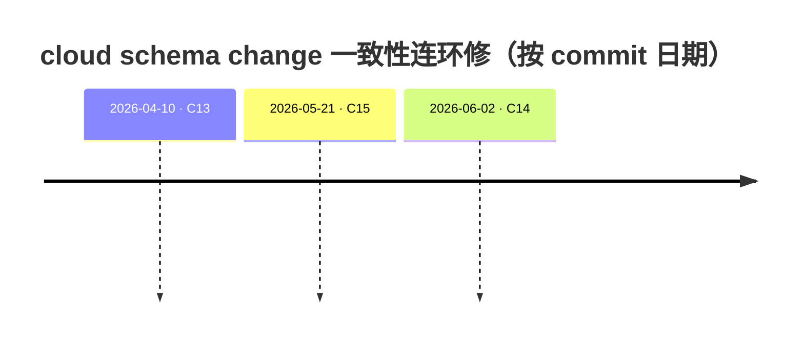
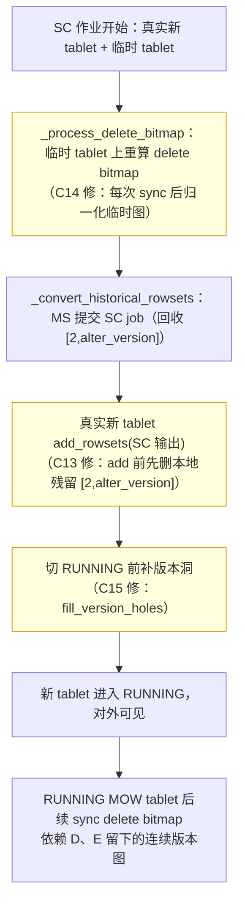

# 第 4 章：存算分离的一致性暗礁 —— 同一 schema change 机制的连环三修

> 本章行号引用基于写作时核实所用的 HEAD（`8d523c4a1c`，源码树与系列基线一致）。文中所有当前态引用写作 `路径:行号`、历史态引用写作 `sha:路径`，二者不混用；每条案例的 commit sha 均以 `git show` 亲自核实，diff 走读取自真实 hunk（截断处逐一标注省略）。跨部分回引均已 grep 目标文件确认内容存在。
>
> **本章是案例章，但结构特殊**：三个 commit 不是三个孤立事故，而是**同一机制（cloud schema change）在四十天里被连续修了三次**——每一次修复都补上了一处遗漏，又暴露出下一处遗漏。所以本章先给一张"连环修"的时间线，再按**真实提交时间顺序**逐案例展开五段（`问题背景 → 根因分析 → 修复思路 → 源码对照 → 经验教训`）。请特别注意：候选档案里的编号 C13/C14/C15 **不等于**时间顺序——真实链条是 C13 → C15 → C14，本章一律按真实时间讲。

## 引子：一条被反复检验的主线

翻过前三部分你会反复撞见同一句话：**存算分离下，BE 本地保存的 tablet 状态，只是 MetaService（MS）权威状态的一份内存镜像。** [part4 第 4 章](../part4-fe-internals/04-metaservice-fdb.md) §4.2 讲过元数据为什么要搬进 FDB、版本 key 为什么必须单调；[part5 第 6 章](../part5-storage-engine/06-cloud-storage.md) §6.4 讲过 BE 读一个 tablet 前要先 `sync_rowsets`（`be/src/cloud/cloud_tablet.cpp:294`）从 MS 把版本链拉回本地——**"权威在 MS，BE 读时再拉"** 是这套架构的第一性原理。[part5 第 5 章](../part5-storage-engine/05-data-management.md) §5.3 又补了关键一句：schema change（下称 SC）在存算一体与存算分离下**代码路径相同、数据文件字节相同**，差异只集中在两处——**元数据存哪**（分离下 tablet 元数据在 MS）与**并发靠什么协调**（分离下导入/compaction/SC 都要向 MS 申租约或锁）。

本章要讲的，正是这句"代码路径相同、差异只在元数据存哪"背后被低估的代价：**当 SC 在 MS 侧改动了版本图、而 BE 本地这份镜像没有同步跟上，会发生什么。** 三个 commit 给出了三个答案——它们都是同一个不变量的破口：**"BE 本地的 rowset 版本图，必须与 MS 提交后的 SC 输出路径逐版本对齐，且连续无洞。"** 这条不变量没有被写成一句断言，而是散落在 SC 生命周期的三个调用点上；于是它被**逐点**打破、又被**逐点**修好，一共修了三次。

先看这条链的形状：



三个破口位于 SC 生命周期的三个不同阶段，但根都是**同一处**：SC 把历史版本从"一条宽 rowset"重写成"多条逐版本 rowset"后，BE 本地这份镜像没有在**每一个**会读到它的调用点都被归一化。把这三点画到一条生命周期上，就能看出它们是同一根线上的三个结：



读完本章你要建立的直觉是：**一个"两处状态必须镜像一致"的约束，如果没有被固化成一处不变量断言，就会在每一个访问该状态的调用点上各破一次；连续修 bug 不是运气差，而是缺断言的必然结果。**

---

## 案例一：SC 未先删本地 rowset 就 add_rowsets 导致 MOW 重复键（C13，2026-04-10）

- **Commit**：`dd59f479af`（`git show` 核实存在），message 标题 `[fix](cloud) Delete local rowsets before add_rowsets in cloud schema change (#62256)`，PR 号 #62256 出现在 message 中，故引用。
- **根因层**：BE cloud SC 的**提交路径**——`_convert_historical_rowsets` 把 SC 输出 rowset 装进真实新 tablet 的那一步（历史态 `dd59f479af:be/src/cloud/cloud_schema_change_job.cpp`、`dd59f479af:be/src/cloud/cloud_tablet.cpp`）。

### 问题背景

现象是主键表（MOW）做完 SC 后**出现重复键**——同一个主键在结果里返回了两行。这是 MOW 表最严重的一类正确性事故：MOW 的全部正确性都压在 delete bitmap 上（[part5 第 4 章](../part5-storage-engine/04-mow-internals.md) §4.2 讲过两阶段 bitmap 计算，§4.3 讲过读取面如何用 bitmap 遮掉旧版本行）；一旦某些旧行没有被任何 bitmap 标记删除，它们就会和新行一起被读出来，表现为重复键。

commit message 把因果链交代得极清楚。SC 提交时，**MS 侧是对的**：提交 SC job 时 MS 会回收新 tablet 上 `[2, alter_version]` 区间的 rowset（这些是 SC 期间新 tablet 上因双写/compaction 产生的、即将被 SC 输出覆盖的历史版本）。问题出在 **BE 侧没有镜像这个回收动作**——BE 直接对 SC 输出调用了 `add_rowsets`，却没有先把本地这些残留 rowset 删掉。message 还点名了一个放大器：PR #61089 打开了"SC 期间允许对新 tablet 做 compaction",这让新 tablet 上更容易出现**宽版本**的 compaction 产物（如 `[818-822]`），从而把这个潜伏的 bug 推到台面上。

### 根因分析

根因是**版本图 greedy capture 的方向性陷阱，叠加 BE 未镜像 MS 的回收**。要看懂它，得先接上 `add_rowsets` 的去重逻辑与版本图的选路逻辑——这两处都被机制章讲过，本案例是对它们的"考试"。

第一层，`add_rowsets` 的 overlap 检查是**单向**的。它判断一个新 rowset 是否要顶掉已有 rowset，用的是 `to_add_v.contains(v)` 这类"新版本区间是否包含旧版本区间"的判断。SC 输出是**逐版本**的单版本 rowset（`[818]`、`[819]`、…、`[822]`），而本地残留的是 compaction 宽 rowset `[818-822]`。于是 `[818].contains([818-822])` 求值为 **false**——单版本区间当然不可能包含宽区间——`add_rowsets` 便认为二者不冲突，宽 rowset `[818-822]` **原样留在** `_rs_version_map` 里。

第二层，版本图的 capture 是**贪心选宽**的。[part5 第 4 章](../part5-storage-engine/04-mow-internals.md) §4.3 提到读取要先 capture 一条连续版本路径；这条路径由 `capture_consistent_versions`（`be/src/storage/version_graph.cpp:416`）在版本图上走出来。它的选路策略是**在每个节点上选"不超过终点的最大版本"边**——源码注释就写在那里（`be/src/storage/version_graph.cpp:451`：`This version is the largest version that smaller than end_version`）。这意味着：只要宽 rowset `[818-822]` 的边还在图里，从 818 出发时 capture 会**优先走这条宽边**，而不是逐版本的 `[818]→[819]→…`。

两层叠加的后果是致命的：残留的宽 compaction rowset `[818-822]` 既没被 `add_rowsets` 删掉、又被 capture 优先选中。而这条宽 rowset 的 **delete bitmap 不覆盖 SC 输出行**——它是 SC 之前的产物，压根不知道 SC 重排后每行落在哪。于是读取时走了这条宽路径、又缺 bitmap 遮蔽，SC 输出的行与宽 rowset 的行同时可见 → **重复键**。

一句话收束根因：**BE 未镜像 MS "回收 `[2,alter_version]`"的动作，残留的宽 compaction rowset 因 `add_rowsets` 单向 overlap 检查（`[818].contains([818-822])`=false）逃过删除，又因版本图 greedy capture 偏好宽边被优先选中，而它的 delete bitmap 不覆盖 SC 输出行 → MOW 重复键。**

### 修复思路：为什么这么修

修复的核心动作是新增一个 `delete_rowsets_for_schema_change` 方法：在对 SC 输出 `add_rowsets` **之前**，先把真实新 tablet 上 `[2, alter_version]` 的本地 rowset 全部删掉——**BE 侧显式镜像 MS 侧的回收**。

但真正的关键决策，是这个新方法**为什么不能复用普通的 `delete_rowsets`**，而要单开一个。两处差异，每一处都对应一个此前埋下的坑：

- **它必须同时删掉版本图的边。** 普通 `delete_rowsets`（`be/src/cloud/cloud_tablet.cpp:502`）只从 `_rs_version_map` 移除、把 rowset 转入 stale，**并不删版本图节点间的边**（stale 机制还要靠这些边做过期路径回收）。但本案例的根因第二层正是"宽边还在图里、被 greedy 选中"——所以新方法必须调 `delete_version`（`be/src/storage/version_graph.h:195`）**把边也删掉**，capture 才不会再走宽路径。这是修复能奏效的要害。
- **它必须绕开 stale 跟踪机制。** SC 输出会产生与被删 rowset **版本区间完全相同**的新 rowset（都是 `[818-822]` 覆盖的那些版本）。若走普通 stale 路径，随后一次 compaction 又会把 SC 输出转入 stale，于是**两条 stale 路径引用同一个版本 key**——当其中一条先被清理，另一条会在 `delete_expired_stale_rowsets` 里撞上 `DCHECK(false)`。这个坑在 commit 自带的单测里被显式复现（见源码对照）。所以新方法用 `same_version=true` 跳过 stale，改走 `add_unused_rowsets`（`be/src/cloud/cloud_tablet.h:367`）做直接的 cache 清理——因为 MS 已经回收过这些 rowset，本地无须再走"可回滚的 stale 窗口"。

### 源码对照

`git show dd59f479af` 新增的方法（历史态 `dd59f479af:be/src/cloud/cloud_tablet.cpp`，此为 commit 引入时的原样，注释保留、无省略）：

```cpp
+void CloudTablet::delete_rowsets_for_schema_change(const std::vector<RowsetSharedPtr>& to_delete,
+                                                   std::unique_lock<std::shared_mutex>&) {
+    if (to_delete.empty()) {
+        return;
+    }
+    std::vector<RowsetMetaSharedPtr> rs_metas;
+    rs_metas.reserve(to_delete.size());
+    for (auto&& rs : to_delete) {
+        rs_metas.push_back(rs->rowset_meta());
+        _rs_version_map.erase(rs->version());
+        // Remove edge from version graph so that the greedy capture algorithm
+        // won't prefer the wider stale compaction rowset over individual SC
+        // output rowsets (e.g. [818-822] vs [818],[819],...,[822]).
+        _timestamped_version_tracker.delete_version(rs->version());
+    }
+    ...（省略 stale 绕过说明注释 5 行）...
+    _tablet_meta->modify_rs_metas({}, rs_metas, true);
+
+    // Schedule for direct cache cleanup. MS has already recycled these rowsets.
+    add_unused_rowsets(to_delete);
+}
```

对照 `_convert_historical_rowsets` 里的调用点（历史态 `dd59f479af:be/src/cloud/cloud_schema_change_job.cpp`，`add_rowsets` 上方新增，收集与日志部分省略）：

```cpp
+        // Mirror MS behavior: delete rowsets in [2, alter_version] before adding
+        // SC output rowsets to avoid stale compaction rowsets remaining visible.
+        {
+            int64_t alter_ver = sc_job->alter_version();
+            std::vector<RowsetSharedPtr> to_delete;
+            for (auto& [v, rs] : _new_tablet->rowset_map()) {
+                if (v.first >= 2 && v.second <= alter_ver) {
+                    to_delete.push_back(rs);
+                }
+            }
+            ...（省略 LOG_INFO 打印 8 行）...
+            if (!to_delete.empty()) {
+                _new_tablet->delete_rowsets_for_schema_change(to_delete, wlock);
+            }
+        }
         _new_tablet->add_rowsets(std::move(_output_rowsets), true, wlock, false);
```

**修复前语义**：直接 `add_rowsets(SC 输出)`，本地残留宽 rowset 因单向 overlap 检查未被删、其边留在版本图，capture 走宽路径 → MOW 重复键。**修复后语义**：`add_rowsets` 前先收集 `[2,alter_version]` 本地 rowset、调新方法删除（连版本图边一并删）→ capture 只能走 SC 输出的逐版本路径。

commit 自带四个单测（历史态 `dd59f479af:be/test/cloud/cloud_tablet_test.cpp`，随修复加入、非事后补写）。其中 `TestNoStalePathConflictWithCompaction` 尤其值得一提——它**逐步复现了 CI 曾经崩溃的场景**：SC 删除若走 stale、随后 compaction 再把 SC 输出转 stale，两条 stale 路径引用同一版本 key，`delete_expired_stale_rowsets` 撞 `DCHECK(false)`；而用新方法（绕开 stale）后 `ASSERT_NO_FATAL_FAILURE`。另有 `TestSchemaChangeDeletesCompactionRowset` 直接断言删除后 capture 走的是逐版本路径而非宽路径。这组测试把"为什么不能复用 `delete_rowsets`"的两个理由都钉成了可回归断言。

需要指出一处**当前态与历史态的差异（epoch 诚实）**：本方法在当前 HEAD 位于 `be/src/cloud/cloud_tablet.cpp:523`，但签名已随后续演进变化——锁类型从历史态的 `std::unique_lock<std::shared_mutex>&` 改为当前的 `std::unique_lock<BthreadSharedMutex>&`，并多了个 `recycle_deleted_rowsets` 形参（这第三个变化正是下面案例三引入的，见 C14）。走读历史 diff 时看到的签名，不是当前 HEAD 的签名。

### 经验教训

1. **"镜像状态"必须显式镜像每一个权威侧动作，不能假设"另一边会同步"。** 分离架构里 MS 是权威、BE 是镜像——但镜像不会自动发生，是**代码逐个动作去做的**。MS 回收了 `[2,alter_version]`，BE 就必须有一行对应的删除；漏掉这行，本地镜像就与权威分叉。见到"A 侧改了状态、B 侧读同一状态"的跨组件设计，第一问永远是：**A 的每一个写动作，B 侧都有对应的镜像动作吗？**
2. **单向包含检查是去重逻辑的经典盲区。** `to_add_v.contains(v)` 只能删掉"被新版本包含的旧版本",删不掉"包含新版本的旧版本"。当新旧版本区间可能**互相包含**（这里是逐版本 vs 宽区间），单向检查必漏一半。凡是用"包含/覆盖"做去重的地方，都要问：包含关系可能反向吗？反向时谁来删？
3. **贪心选路 + 残留宽边 = 静默走错路径。** 版本图 capture 贪心选"最大版本边"，这在正常图上是最短路径优化；但只要图里残留一条本不该存在的宽边，贪心就会稳定地、静默地选中它。**删状态时，别忘了删它在索引/图里的边**——`_rs_version_map` 删了、版本图边没删，等于删了一半。

---

## 案例二：SC 后真实 tablet 版本图留洞致 delete bitmap 同步找不到连续路径（C15，2026-05-21）

- **Commit**：`e4238ac87c`（`git show` 核实存在），message 标题 `[fix](cloud) Fill schema change version holes before running (#63443)`，PR 号 #63443 出现在 message 中。
- **根因层**：BE cloud SC 的 **RUNNING 转换路径**——新 tablet 在 `_convert_historical_rowsets` 末尾切 `TABLET_RUNNING` 之前的版本图状态（历史态 `e4238ac87c:be/src/cloud/cloud_schema_change_job.cpp`）。

### 问题背景

C13 补上了"提交时删残留",四十天后又浮出同一机制的第二处破口，这次在**下游**。SC 计算 delete bitmap 时会为版本洞造一些**空 rowset**（empty/hole rowset），但这些空 rowset 只被加到了**临时 tablet**上；**真实新 tablet**在 `alter_version` 之后可能带着一个**版本洞**就切到了 `TABLET_RUNNING`。一旦它 RUNNING 了、对外可见了，后续这张 RUNNING MOW tablet 再做 delete bitmap 同步时，会在**补洞之前**就去 capture 旧 rowset id——于是 capture 在带洞的版本图上**找不到连续路径**而失败。

这个失败的形态，正是 `capture_consistent_versions` 里两处 `failed to find path in version_graph`（`be/src/storage/version_graph.cpp:432`、`:464`）报错——版本图上从起点走不到终点，中间断了一节。

### 根因分析

根因是**版本图连续性这条隐含全局不变量，被一个"只补临时 tablet、不补真实 tablet"的局部操作破坏了**。

版本图连续性（version continuity）是 capture 能工作的**前提**：`capture_consistent_versions` 从 `spec_version.first` 出发、每步沿边前进直到 `spec_version.second`（`be/src/storage/version_graph.cpp:438`~`:468`），中间任何一个版本缺边，循环就走不到终点、返回 InternalError。也就是说，**任何一张要被 capture 的 tablet，它的版本图必须没有洞**——这是一条谁都没写成断言、但所有 capture 调用都默认成立的全局约束。

SC 为什么会造洞？因为 SC 重算 delete bitmap 用的是**临时 tablet**，造出来的空 rowset 补的是临时 tablet 的洞；真实新 tablet 走的是另一条装配路径（`add_rowsets(SC 输出)`），SC 输出本身可能在 `alter_version` 之后不连续（比如某些版本在 SC 期间没有对应数据），真实 tablet 的这些洞**没人补**。C13 只保证了"提交时删对残留",没管"提交后图连不连续"——因为在 C13 的场景里，capture 是在 SC **内部**、对**临时 tablet**做的，真实 tablet 的洞要等它 RUNNING 之后被别的同步路径读到才暴露。这就是为什么这个 bug 会"延迟"到 SC 完成之后、由一次无关的 delete bitmap 同步引爆。

一句话收束根因：**SC 造的空 rowset 只补了临时 tablet 的版本洞，真实新 tablet 带洞就转 RUNNING；版本图连续性这条 capture 的隐含前提在真实 tablet 上不成立，导致 RUNNING 后的 delete bitmap 同步 capture 断路。**

### 修复思路：为什么这么修

修复只有一行调用：在真实新 tablet `add_rowsets(SC 输出)` 之后、切 `TABLET_RUNNING` **之前**，调 `fill_version_holes`（`be/src/cloud/cloud_meta_mgr.cpp:2369`）把真实 tablet 的版本洞补上。

两个决策点：

- **为什么补在"add 之后、RUNNING 之前"这个精确窗口？** 因为 RUNNING 是"对外可见"的分界线——一旦 RUNNING，别的线程就可能来 sync delete bitmap 并 capture。补洞必须在这条线**之前**完成，才能保证"任何看得见这张 tablet 的人，看到的都是连续版本图"。放到 RUNNING 之后，就会有一个"可见但带洞"的竞态窗口，正是 bug 现场。
- **为什么复用 `fill_version_holes` 而不新写？** 因为 `fill_version_holes` 已经是 sync 路径用来补洞的既有能力（`be/src/cloud/cloud_meta_mgr.cpp:919` 处 sync 时就会调它），它造的是标记了 `is_hole_rowset`（`be/src/storage/rowset/rowset.h:333`）的空 rowset。更关键的是它**内建了 SC 规则**：对 `TABLET_NOTREADY` 状态的 SC tablet，**跳过 `alter_version` 及以下版本的洞**（`be/src/cloud/cloud_meta_mgr.cpp:2417`），只补 `alter_version` 之后的洞——这条规则避免了给 SC tablet 算出异常 compaction score、或触发 -235 错误（源码注释 `be/src/cloud/cloud_meta_mgr.cpp:2393`~`:2399` 写明）。复用它，等于免费继承了这条既有的、经过验证的边界规则，而不是在 SC 路径里重造一套补洞逻辑。

### 源码对照

`git show e4238ac87c` 的核心 hunk 只有四行（历史态 `e4238ac87c:be/src/cloud/cloud_schema_change_job.cpp`，`add_rowsets` 与 `set_cumulative_layer_point` 之间新增）：

```cpp
         _new_tablet->add_rowsets(std::move(_output_rowsets), true, wlock, false);
+        // Ensure the real new tablet has a continuous local version graph before it becomes
+        // visible. Later RUNNING-tablet delete bitmap sync depends on capturing all old versions.
+        RETURN_IF_ERROR(_cloud_storage_engine.meta_mgr().fill_version_holes(
+                _new_tablet.get(), _new_tablet->max_version_unlocked(), wlock));
         _new_tablet->set_cumulative_layer_point(_output_cumulative_point);
```

注意这段 diff 的上下文里，`add_rowsets(std::move(_output_rowsets), ...)` 这一行已经存在——它就是 C13 修改过的那一段代码，说明 C15 是**直接叠在 C13 之上**的（此时 C13 那个内联删除块还在，尚未被后来的 C14 抽走）。**修复前语义**：`add_rowsets` 后不补洞，真实 tablet 带洞转 RUNNING，后续同步 capture 断路。**修复后语义**：切 RUNNING 前调 `fill_version_holes` 把 `alter_version` 之后的洞用空 rowset 补齐，保证任何后续 capture 都能走出连续路径；`max_version_unlocked()`（`be/src/cloud/cloud_tablet.h:194`）给出补洞的上界。

commit 自带两个层次的单测：`FillVersionHolesBeforeNewTabletRunning`（历史态 `e4238ac87c:be/test/cloud/cloud_schema_change_job_test.cpp`）用 SyncPoint 打桩走完整条 SC 流程，断言 tablet 最终 `TABLET_RUNNING` 且 `Version(3,3)` 的洞被填成了 `is_hole_rowset()` 的空 rowset、capture 能穿过它；`TestFillVersionHolesBeforeSchemaChangeRunning`（历史态 `e4238ac87c:be/test/cloud/cloud_tablet_test.cpp`）则单独验证补洞前 capture 返回 `has_value()==false`（断路）、补洞后能走出完整 6 段路径。两个测试一个测集成流程、一个测补洞原语，正好卡住"图不连续 → 补洞 → 图连续"这条因果。

当前 HEAD 上这段修复仍在 `be/src/cloud/cloud_schema_change_job.cpp:558`，只是它上面那行已从 C13 的内联删除块变成了 C14 抽出的一次方法调用（见案例三）。

### 经验教训

1. **"连续性/完整性"这类隐含全局不变量，必须在状态"变为可见"之前恢复。** 版本图连续性是 capture 的前提，却没被写成断言——它靠"每个造洞的地方都记得补洞"来维持，这种约定极脆弱。可迁移的判据：**任何会让全局不变量暂时失效的局部操作，都要在"别人能观察到这个状态"之前把不变量恢复**；RUNNING/published/visible 这类"对外可见"的状态切换点，就是不变量必须已经成立的红线。
2. **临时副本上补的洞，不会自动补到真实副本上。** SC 用临时 tablet 算 bitmap 是合理的隔离，但隔离的代价是**两份版本图**——在临时图上做的修复（补洞）不会传导到真实图。凡是"用一个临时/影子对象做计算、再把结果落到正式对象"的模式，都要逐项核对：**在临时对象上为了让计算跑通而做的每一处状态修补，正式对象上需不需要同样做一遍？**
3. **复用既有原语 = 免费继承它的边界规则。** `fill_version_holes` 自带"SC tablet 跳过 `alter_version` 及以下版本"的规则，复用它就不必在 SC 路径重推一遍这条边界。新写一套补洞逻辑，大概率会漏掉这条规则、再引一个新 bug。**能复用带内建规则的原语时，别为了"看起来更贴合当前场景"去重造一个规则更少的版本。**

---

## 案例三：SC delete bitmap 重算前未归一化临时 tablet 版本图（C14，2026-06-02）

- **Commit**：`7c9c366718`（`git show` 核实存在），message 标题 `[fix](cloud) Normalize SC rowset graph before delete bitmap capture (#63960)`，PR 号 #63960 出现在 message 中。message 开篇即写明"This PR fixes the remaining MOW schema-change delete-bitmap path after #62256"，并直接引用 C13 的 master commit `dd59f479af5a855401e3f862c751e8416070a1e2`——**这是三个 commit 里因果链最显式的一环**。
- **根因层**：BE cloud SC 的 **delete bitmap 重算路径**——`_process_delete_bitmap` 里用临时 tablet capture rowset 那一段（历史态 `7c9c366718:be/src/cloud/cloud_schema_change_job.cpp`）。

### 问题背景

C13 修好了**提交路径**（真实 tablet），但同一机制里还有一条**没被修到**的孪生路径：delete bitmap 的**重算**在 `_process_delete_bitmap` 里用一张**临时 tablet**（`be/src/cloud/cloud_schema_change_job.cpp:591`）跑。这张临时 tablet 用 SC 输出初始化，但它每跑一次 `sync_tablet_rowsets`（`be/src/cloud/cloud_meta_mgr.cpp:583`），就会**再次**从 MS 拉回非 SC 的本地 rowset（双写 rowset、compaction 产物），把 `[2, alter_version]` 里又塞进宽 rowset `[2-3]` 之类。

于是临时图里同时存在：SC 输出的逐版本 `[2]`、`[3]`… 和一条更宽的 `[2-3]`。这正是 C13 在真实 tablet 上治好的那个病——**greedy capture 会挑中宽的那条**。结果 delete bitmap 被算在了一条**不是最终提交**的 rowset 路径上。message 特别点破了这个 bug 的诡异之处：**它不在 SC 时报错，而是在 SC 完成后一次无关的 MOW compaction 里才炸**——因为那时 compaction 会发现 delete bitmap 的覆盖与可见 rowset 图对不上，行数/bitmap 校验失败。

### 根因分析

根因一句话就能说清，因为它和案例一**是同一个根因、换了个调用点**：**C13 只归一化了真实 tablet 的提交图，没归一化临时 tablet 的重算图；两张图对历史版本必须走同一条 SC 输出路径，否则 delete bitmap 算在 A 路径、却被应用到 B 路径。**

这里值得停下来看一眼工程现实：C13 的作者当时**在真实 tablet 上就地写了个内联删除块**（案例一源码对照里那段 `for (auto& [v, rs] : _new_tablet->rowset_map())`）。这个内联块解决了眼前的提交路径，但它**没有被抽象成"任何 SC tablet 图都该做的归一化"**——于是当同样的需求出现在临时 tablet 上时，没有可复用的东西，问题就复发了。**这就是"连续修 bug"的机理：修复停留在"修好这一个调用点",而没有上升为"这个不变量在所有调用点都要成立"。**

更麻烦的是，临时 tablet 的图会被**反复污染**：每次 `sync_tablet_rowsets` 之后都可能重新混入非 SC rowset。所以归一化不能只做一次，必须在**每一次 sync 之后、每一次 capture 之前**都做——这是临时 tablet 相比真实 tablet 的额外复杂度。

### 修复思路：为什么这么修

C14 做了三件事，前两件是"把 C13 的一次性修补上升为可复用不变量",第三件才是补新调用点：

1. **抽出 `replace_rowsets_with_schema_change_output`**（`be/src/cloud/cloud_tablet.cpp:554`），把 C13 那段内联删除块——"删 `[2,alter_version]` 里非 SC 输出的本地 rowset，再 `add_rowsets(SC 输出)`"——固化成一个方法。判断"哪些是 SC 输出"用的是新加的匿名函数 `is_schema_change_output_rowset`（`be/src/cloud/cloud_tablet.cpp:98`，按 `rowset_id` 匹配）。
2. **让真实 tablet 的提交路径也改调这个方法**（`be/src/cloud/cloud_schema_change_job.cpp:554`），C13 的内联块被整段删除、替换成一次 `replace_rowsets_with_schema_change_output(..., "commit", true)` 调用——**同一份归一化逻辑，从此只有一个实现**。
3. **在 `_process_delete_bitmap` 的每次 `sync_tablet_rowsets` 之后调同一个方法**（`be/src/cloud/cloud_schema_change_job.cpp:604`、`:630`，两处 sync 各一次），stage 分别标 `"delete_bitmap_without_lock"` 和 `"delete_bitmap_with_lock"`。

一个关键差异体现在方法签名多出的 `recycle_deleted_rowsets` 形参上：真实 tablet 提交时传 `true`（MS 已回收，本地要走 cache 清理），临时 tablet 归一化时传 `false`——**临时 tablet 只是算 bitmap 用的临时图，它删掉的 rowset 不该触发真实的 cache 回收**。这个布尔参数正是案例一里 `delete_rowsets_for_schema_change` 签名"当前态多一个形参"的来源。**同一个归一化动作，在真实 tablet 上有副作用（回收），在临时 tablet 上无副作用——用一个参数把这个差异显式化，而不是复制两份代码。**

### 源码对照

`git show 7c9c366718` 把 C13 的内联块整段替换（历史态 `7c9c366718:be/src/cloud/cloud_schema_change_job.cpp`，`-` 为删除的 C13 内联块，`+` 为新调用；中部删除行大段省略）：

```cpp
-        // Mirror MS behavior: delete rowsets in [2, alter_version] before adding
-        // SC output rowsets to avoid stale compaction rowsets remaining visible.
-        {
-            int64_t alter_ver = sc_job->alter_version();
-            ...（省略被删除的 C13 内联收集 + 日志 + 删除调用共约 20 行）...
-        }
-        _new_tablet->add_rowsets(std::move(_output_rowsets), true, wlock, false);
+        _new_tablet->replace_rowsets_with_schema_change_output(
+                _output_rowsets, sc_job->alter_version(), wlock, "commit", true);
```

以及 `_process_delete_bitmap` 里两处 sync 后新增的归一化（历史态同文件，第一处 sync 后；第二处结构对称，省略）：

```cpp
     // step 1, process incremental rowset without delete bitmap update lock
     RETURN_IF_ERROR(_cloud_storage_engine.meta_mgr().sync_tablet_rowsets(tmp_tablet.get()));
+    {
+        std::unique_lock wlock(tmp_tablet->get_header_lock());
+        tmp_tablet->replace_rowsets_with_schema_change_output(_output_rowsets, alter_version, wlock,
+                                                              "delete_bitmap_without_lock", false);
+    }
     int64_t max_version = tmp_tablet->max_version().second;
```

同一 commit 还删掉了原先散落在 capture 之后的 `tmp_tablet->add_rowsets(_output_rowsets, ...)`（历史态 diff 里的 `-` 行）——因为归一化方法内部已经包含了 `add_rowsets`（`be/src/cloud/cloud_tablet.cpp:576`），旧的补加动作既多余又太晚（在 capture **之后**才 add，救不了已经选错的路径）。**修复前语义**：临时 tablet 每次 sync 后混入宽 rowset，capture 贪心选宽 → bitmap 算在错路径 → SC 后 compaction 校验失败。**修复后语义**：每次 sync 后立即归一化临时图（删非 SC rowset + 重加 SC 输出），capture 只能走 SC 输出路径 → bitmap 算在最终提交的路径上。

当前 HEAD 上，`replace_rowsets_with_schema_change_output` 在 `be/src/cloud/cloud_tablet.cpp:554`、声明在 `be/src/cloud/cloud_tablet.h:176`；三处调用点分别在 `be/src/cloud/cloud_schema_change_job.cpp:554`（commit）、`:604` 与 `:630`（两次 delete bitmap 重算）。commit 自带的单测复用了 C13 那个测试类，新增用例模拟"临时图含 `[2]`、`[3]` 与一条 stale compaction `[2-3]`"的污染场景（message `## Testing` 段给出 filter 为 `CloudTabletDeleteRowsetsForSchemaChangeTest.*`）。

### 经验教训

1. **"一次性修补"与"可复用不变量"之间隔着一次抽象——不跨过去，同一个 bug 会在下一个调用点复发。** C13 在真实 tablet 就地写了内联块，治好了一个调用点；C14 把它抽成 `replace_rowsets_with_schema_change_output` 并铺到全部三个调用点，才真正治好这个**类**的问题。判据：**当你为某处状态写了一段"修正逻辑",立刻问——这段逻辑描述的是"这一处的特殊处理",还是"这个状态在任何地方都该满足的不变量"？后者就必须抽出来、在所有访问点调用。**
2. **同一动作在不同上下文的副作用差异，用参数显式化，而非复制代码。** 真实 tablet 删 rowset 要回收 cache、临时 tablet 不要——一个 `recycle_deleted_rowsets` 布尔参数就把差异钉在签名上，读代码的人一眼看清"这次调用有没有副作用"。复制成两份近似代码，则会在其中一份漏掉后续修改（本案例的教训本身就是"漏改一处"）。
3. **"修好后在别处才炸"的 bug，几乎都是"同一状态的两条访问路径没对齐"。** C14 的现象是"SC 时不报错、SC 后 compaction 才炸",根源是 bitmap 算在 A 路径、被应用到 B 路径。排查这类"因果在时间上错位"的 bug，别只盯报错现场（compaction），要回溯**产生那份状态的所有路径**，逐条核对它们是否基于同一份输入——错位往往藏在"另一条你以为无关的路径"里。

---

## 章末：分离一致性的排查启示

三个案例、三处破口、一条不变量——把它们和 [part5 第 6 章](../part5-storage-engine/06-cloud-storage.md) §6.7 的分离存储排查清单、[part6 第 4 章](../part6-operations/04-replica-and-cache-issues.md) §4.4 的分离模式故障手册合起来，能提炼三条可迁移的排查主线：

1. **MOW 重复键 / delete bitmap 校验失败，先怀疑"BE 本地版本图与 MS 权威分叉",而非先怀疑 bitmap 算错。** 本章三例的表层症状各不相同（重复键 / capture 断路 / compaction 校验失败），但根都是**同一份状态的镜像不一致**。[part6 第 4 章](../part6-operations/04-replica-and-cache-issues.md) §4.4 讲分离模式故障时强调"用曲线形态区分预期与故障";这里补一条：**遇到 SC 之后才出现的 MOW 正确性问题，第一步是把 BE 本地 `_rs_version_map`/版本图与 MS 侧的 rowset meta 对一遍**，看历史版本是"逐版本 SC 输出"还是残留了宽 rowset、看 `alter_version` 之后有没有洞。分叉点几乎总在这两处。
2. **capture 失败（`failed to find path in version_graph`）= 版本图有洞或有多余宽边，顺着 §6.4 的 `sync_rowsets` 链路查镜像是否完整。** [part5 第 6 章](../part5-storage-engine/06-cloud-storage.md) §6.4 讲清了"BE 读前 `sync_rowsets` 从 MS 拉版本"这条镜像链路。capture 报错时的正确读法是：不是"图算法坏了",而是"喂给算法的这份本地图不完整"——要么缺边（案例二的洞）、要么多了不该有的边（案例一/案例三的宽 rowset）。排查动作是回到 `sync_rowsets` 之后的图快照，逐版本核对连续性。
3. **同一机制短期内连续修 bug，是"缺一处不变量断言"的信号，不是"运气不好"。** 这是本章最想立的方法论。C13→C15→C14 修的是同一条不变量在三个调用点的三次破口；如果当初有一处断言（例如"SC tablet 切 RUNNING 前，`assert` 其版本图连续且历史版本全为 SC 输出"），后两个 bug 在测试甚至 DCHECK 阶段就会被拦下。所以运维/研发在复盘"同一模块反复出事"时，正确的产出不该是"再修一个补丁",而应是：**这个模块隐含依赖哪条没写下来的不变量？能不能把它固化成一处断言或一个必经的归一化函数，让所有访问点都被迫满足它？** [part5 第 6 章](../part5-storage-engine/06-cloud-storage.md) §6.7 的清单查的是"配置与水位",本章补上的是它的上游——**"权威与镜像之间那条没写成断言的一致性约束，在哪个调用点被漏掉了"**。

三处暗礁，收束成一句判据：**存算分离下，凡是"BE 本地状态 = MS 权威状态的镜像"的地方，都要问两件事——MS 的每个写动作，BE 侧都镜像了吗？这份镜像在"变为可见"之前，满足它所有隐含的不变量（连续、无残留、逐版本对齐）了吗？** 缺任何一问，重复键与 capture 断路就会在你以为 SC 早已成功的某个下游时刻,悄悄找上门来。
