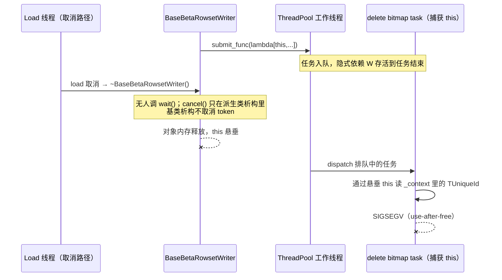
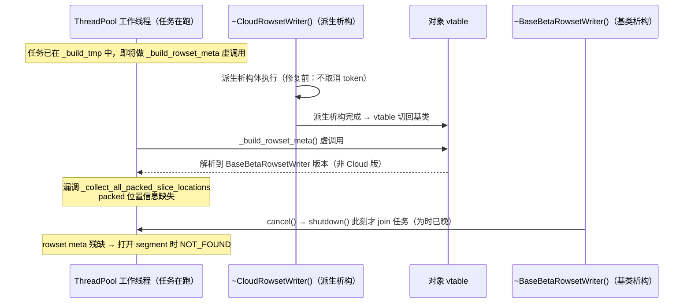

# 第 5 章：并发竞争的经典形态 —— 两种 UAF 的触发时序对照，与一种自死锁

> 本章行号引用基于写作时核实所用的 HEAD（`443ee92a63`，源码树与系列基线一致）。文中所有当前态引用写作 `路径:行号`、历史态引用写作 `sha:路径`，二者不混用；每条案例的 commit sha 均以 `git show` 亲自核实，diff 走读取自真实 hunk（截断处逐一标注省略）。跨部分回引均已 grep 目标文件确认内容存在。
>
> **本章是全系列最后一个内容章，也是并发案例章**。并发 bug 的特殊之处在于：它们几乎没有"一条 SQL 稳定复现"的现场，只能从修复反推出那条致命的交错时序。所以本章不装作能给你复现脚本，而是把三个真实 commit 的崩溃栈与 diff 摊开，用**时序**说话——两种 use-after-free（UAF）并列对照（C18 悬垂 `this`、C19 悬垂 vtable），收尾再补一种自死锁（C22 锁自嵌套）。三者共享同一句话：**一个对象的生命周期，短于引用它的那条并发路径。**

## 引子：并发 bug 的三种"生命周期错位"

前四章的 bug 都能画出一条清晰的数据因果链——谓词推错了边界、bitmap 算漏了行、内存把 padding 当可用空间。并发 bug 不一样：代码**每一行单独看都对**，错的是两条执行流在时间轴上的**相对位置**。本章挑的三个 commit，恰好是三种最典型的"生命周期错位"：

- **C18**：异步任务捕获了宿主对象的 `this`，宿主先析构、任务后执行——task 手里的指针悬垂。这是最直白的 UAF。
- **C19**：异步任务在宿主**析构的过程中**执行虚调用，此刻派生类子对象已析构、vtable 已回退到基类——虚函数**解析到了错误的版本**。这是一种更隐蔽的 UAF，指针没野、但对象的"动态类型"已经变了。
- **C22**：一条执行流持锁析构对象，对象的析构函数又回头去抢**同一把**非可重入锁——单线程把自己锁死。

三者放在一起才有价值：C18 和 C19 都出在**同一个类族**（`BaseBetaRowsetWriter` 及其派生 `BetaRowsetWriter` / `CloudRowsetWriter`）的**同一个异步机制**（delete bitmap 计算 token）上，甚至 **C18 的修复直接催生了 C19**——这是全书最干净的一对"修法对照"。C22 则换一个子系统（`FragmentMgr` 关机清 map），把"生命周期错位"从"跨线程"推广到"跨栈帧"。

先建立机制底座。MoW 表写入时，delete bitmap 的计算被**异步**甩给一个线程池，以免阻塞 memtable flush——[part5 第 4 章](../part5-storage-engine/04-mow-internals.md) §4.2 讲过 delete bitmap 的两阶段计算（commit 阶段预算 + publish 阶段定算），并点明 commit 阶段"趁写入时把大部分活儿提前干掉"以降低 publish 延迟；[part3 第 3 章](../part3-load-lifecycle/03-tablet-write-path.md) §3.3 也讲过第一阶段预算发生在 `DeltaWriter` close 之后。**这个"提前干掉"的动作，就是靠一个异步 token 投进线程池实现的**——它正是 C18/C19 的案发现场。承载它的是 `CalcDeleteBitmapToken`（`be/src/storage/delete/calc_delete_bitmap_executor.h:48`），一个包着 `ThreadPoolToken`（`be/src/util/threadpool.h`）的薄封装：

```cpp
    // submit a generic function to the thread pool
    template <typename Func>
    Status submit_func(Func&& func) {
        {
            std::shared_lock rlock(_lock);
            RETURN_IF_ERROR(_status);
            _resource_ctx = thread_context()->resource_ctx();
        }
        return _thread_token->submit_func([this, func = std::forward<Func>(func)]() {
            ...（省略 SCOPED_ATTACH_TASK 与状态回填共 8 行）...
        });
    }

    // wait all tasks in token to be completed.
    Status wait();

    void cancel() { _thread_token->shutdown(); }
```
（当前态 `be/src/storage/delete/calc_delete_bitmap_executor.h:65`-`:88`，lambda 体按标注省略。）

三个词决定了全章的成败：`submit_func` 把任务丢进池子、`wait` 等所有任务干完、`cancel` 调 `_thread_token->shutdown()`——**shutdown 会等正在跑的任务跑完、丢弃排队中的任务**。谁在什么时候调 `cancel`，就是 C18 与 C19 的全部分野。

---

## 案例一：load 取消后线程池任务持悬垂 `this`（C18，2026-01-16）

- **Commit**：`fbcca5ecc6`（`git show` 核实存在），message 标题 `[Fix](mow) Fix potential use after free in `CalcDeleteBitmapToken` (#59920)`，PR 号 #59920 出现在 message 中。
- **根因层**：MoW rowset writer 的析构与异步 token 的生命周期错位（历史态 `fbcca5ecc6:be/src/olap/rowset/beta_rowset_writer.cpp`；该文件在后续 BE 目录重构 #61107 中迁至当前态 `be/src/storage/rowset/beta_rowset_writer.cpp`）。

### 问题背景

现象是 BE core。commit message 一句话交代了触发条件：**当 `BaseBetaRowsetWriter` 在提交给线程池的任务执行之前就被析构了（load 取消时就会发生），任务执行时撞上 use-after-free**。message 自带完整 gdb backtrace，这里截取最能说明问题的几帧（原栈 #0–#15，截取 #4–#11，其余省略）：

```text
#4  doris::TUniqueId::TUniqueId (this=0x7f99955f2208, other51=...) at .../gen_cpp/Types_types.cpp:2571
#5  0x...  doris::AttachTask::init (rc=..., this=<optimized out>) at .../runtime/thread_context.cpp:29
#6  doris::AttachTask::AttachTask (this=<optimized out>, rc=...) at .../runtime/thread_context.cpp:34
#7  0x...  doris::CalcDeleteBitmapToken::submit_func<...BaseBetaRowsetWriter::_generate_delete_bitmap(int)::$_0>...
        {lambda()#1}::operator()() const (this=0x7f9cdf302500)
        at .../be/src/olap/calc_delete_bitmap_executor.h:74
...（省略 std::__invoke / _Function_handler 转发帧 #8–#10）...
#11 0x...  doris::ThreadPool::dispatch_thread (this=0x7fa120d9af00) at .../util/threadpool.cpp:616
```

栈的读法：底部 #11 是线程池工作线程在 dispatch 一个任务；#7 是我们那个 delete bitmap lambda 在执行；往上 #6/#5/#4 崩在构造 `AttachTask` 时读一个 `TUniqueId`——而这个 `TUniqueId` 来自已经被释放的 writer 上下文。**lambda 手里的 `this` 指向的 `BaseBetaRowsetWriter` 已经没了，任务却还在跑。**

### 根因分析

根因是**异步任务的生命周期长于它捕获的宿主对象**——UAF 的最经典形态。把机制拼起来就能看清这条时序，本案例是对 §引子 那三个词的第一次"考试"。

`_generate_delete_bitmap`（当前态 `be/src/storage/rowset/beta_rowset_writer.cpp:402`）把一整套 delete bitmap 计算包成 lambda 投进 token：`[this, segment_id, specified_rowsets = std::move(...)]`（`:419`-`:420`）。这个 lambda **捕获了 `this`**——它内部要访问 `_context`、`_seg_files`、`_rowset_meta` 等一大堆 writer 成员（`:423`-`:466`）。任务一旦入队，它的正确执行就**隐式依赖 writer 至少活到任务跑完**。

正常路径下这个依赖靠 `wait()` 维持：writer 收口时会 `_calc_delete_bitmap_token->wait()`（`be/src/storage/rowset/beta_rowset_writer.cpp:982`）等所有任务干完再往下走。问题出在**异常路径**：load 被取消时，writer 直接走析构，**不会**有人替它调 `wait()`。于是排队中（或正在跑）的任务，在 writer 析构后才被线程池挑起来执行——lambda 里的 `this` 成了悬垂指针。栈里 #4 崩在 `TUniqueId` 拷贝，正是任务通过悬垂 `this` 去取 writer 上下文里的 query id 时踩空。

这里要看清"异步"本身为什么是这个 bug 的必要条件。delete bitmap 计算被甩进线程池，原因写在 `_generate_delete_bitmap` 的注释里（`be/src/storage/rowset/beta_rowset_writer.cpp:416`-`:418`）：这一整套（关闭 file writer、`_build_tmp`、加载 segment、算 bitmap）里含**等待文件上传完成**这类耗时 IO，同步做会把 memtable flush 线程占死——这正是 [part2 第 6 章](../part2-query-lifecycle/06-pipeline-engine.md) §6.3 反复强调的那条纪律：**等待要换成让出线程，别让工作线程阻塞地扛着**。异步是对的，但异步一旦落地，就凭空多出一段"任务已提交、宿主可能先走"的时间窗——**凡是把工作甩给别的线程/池，就等于给宿主的生命周期加了一条新的下界约束，而这条约束默认没人替你守**。C18 就是这条约束在取消路径上失守。

那么"取消时该析构前 join/cancel"这条纪律，代码里**本来有**——只是放错了位置。修复前，`cancel()` 被写在**派生类** `BetaRowsetWriter` 的析构函数里；而崩溃栈里的宿主是**基类** `BaseBetaRowsetWriter`。token 这个成员属于基类，能被析构基类的路径触及，但取消动作却挂在派生类析构上——**取消的责任放在了比 token 生命周期更窄的地方**。

一句话收束根因：**delete bitmap 计算任务捕获了 writer 的 `this` 并隐式依赖 writer 存活到任务结束；load 取消走析构、无人 `wait`，而 `cancel()` 又只挂在派生类析构里，基类析构路径下任务带着悬垂 `this` 被线程池执行 → UAF。**

下面这张时序图把"任务活得比宿主久"钉死：



### 修复思路：为什么这么修

修复是**把取消动作从派生类析构上移到基类析构**——一次"所有权收紧"。既然 token 是基类 `BaseBetaRowsetWriter` 的成员、崩溃发生在基类析构路径，那么"析构前取消 token"这条纪律就必须由基类析构自己保证，而不能指望某个派生类替它做。

关键决策是**为什么必须放基类而不是留在派生类**：token 的生命周期由基类子对象决定，取消动作就该与它同层。放派生类，只有走该派生类析构的路径才被保护——一旦有第二个派生类（正是 `CloudRowsetWriter`），或有直接析构基类子对象的场景，保护就漏了。放基类，则**任何**能析构到这个 writer 的路径都会先取消 token，把"任务不得引用已死宿主"这条不变量收口到唯一一处。

那为什么不换一条路——让任务**共享**宿主所有权（把 writer 做成 `shared_ptr`、让 lambda 捕获一份），从而"任务没跑完宿主就不会死"？理论上可行，但代价与这里的对象模型不匹配：rowset writer 是导入路径上层层持有的重对象，改成共享所有权意味着它的销毁时机从"写入方说了算"变成"最后一个引用（可能是后台任务）说了算"，取消一个 load 时反而可能被一个还在跑的 bitmap 任务拖住迟迟不释放资源。相比之下，"析构时主动 cancel/join"保持了**所有权单向、销毁时机可控**，只是要求析构方承担 join 的责任——这正是绝大多数"宿主管异步任务"场景的默认选择：**共享所有权解决的是'谁最后关灯'，而这里要的是'关灯前先把还在屋里的人请出去'，后者用 join 更直接。**

### 源码对照

`git show fbcca5ecc6` 的核心 hunk（历史态 `fbcca5ecc6:be/src/olap/rowset/beta_rowset_writer.cpp`，diff 极小，改动行全文引用无省略；两处 `@@` 行的原始行号头以所在函数上下文标注代替）：

```cpp
@@ BaseBetaRowsetWriter::~BaseBetaRowsetWriter() {
                           fmt::format("Failed to delete file={}", seg_path));
         }
     }
+    if (_calc_delete_bitmap_token) {
+        _calc_delete_bitmap_token->cancel();
+    }
 }

 BetaRowsetWriter::~BetaRowsetWriter() {
@@  * is cancelled, the objects involved in the job should be preserved during segcompaction to
      * avoid crashs for memory issues. */
     WARN_IF_ERROR(_wait_flying_segcompaction(), "segment compaction failed");
-
-    if (_calc_delete_bitmap_token != nullptr) {
-        _calc_delete_bitmap_token->cancel();
-    }
 }
```

一加一减，语义清清楚楚：`cancel()` 从派生类 `BetaRowsetWriter` 析构（`-`）移到了基类 `BaseBetaRowsetWriter` 析构（`+`）。**修复前语义**：仅当对象以 `BetaRowsetWriter` 静态类型析构时才取消 token，基类析构路径下任务悬垂 `this`。**修复后语义**：任何析构该 writer 的路径都在基类析构里先 `cancel()`，`shutdown()` 会等在跑的任务跑完、丢弃排队任务，任务不再引用已死宿主。

当前 HEAD 上这段仍在原处：基类析构的取消在 `be/src/storage/rowset/beta_rowset_writer.cpp:349`-`:351`，派生类 `BetaRowsetWriter` 析构（`:354`）确实只剩 `_wait_flying_segcompaction`、不再取消 token——与本 commit 的移动完全一致。

---

## 案例二：析构期 vtable 切换致虚调用解析错误（C19，2026-02-12）

- **Commit**：`00bdff9381`（`git show` 核实存在），message 标题 `[fix](cloud) Fix CloudRowsetWriter vtable use-after-free in delete bitmap task (#60528)`，PR 号 #60528 出现在 message 中。
- **根因层**：cloud rowset writer 派生类析构与基类析构之间的**时间窗**（当前态 `be/src/cloud/cloud_rowset_writer.cpp`，路径未随 #61107 重构变化）。

### 问题背景

C18 把取消挪到基类析构，`BetaRowsetWriter`（本地）这条线彻底安全了。但**一个月后**，同一机制在 cloud 这条线上又炸了——而且这次的形态更微妙，**不是野指针，是虚函数解析错版本**。

commit message 描述得极精确：当 `CloudRowsetWriter` 被析构、而一个 delete bitmap 任务仍挂在线程池里时，**lambda 可能在 `CloudRowsetWriter` 析构函数已经跑完、但 `BaseBetaRowsetWriter` 析构函数尚未完成的窗口里执行**。此刻对象的 vtable 指针**已经被改回指向基类**，于是任务里的 `_build_rowset_meta()` 虚调用解析到了 `BaseBetaRowsetWriter::_build_rowset_meta` 而非 `CloudRowsetWriter::_build_rowset_meta`。后果：`_collect_all_packed_slice_locations()` 没被调到，rowset meta 里缺了 packed 文件的位置信息，最终打开 segment 文件时报 NOT_FOUND。

注意：本 commit 的 message **没有附带崩溃栈**（只有文字因果链），故本案例不引用栈片段——现象是 NOT_FOUND 错误而非 SIGSEGV，与 C18 那份完整 gdb 栈是两回事，不得混为一谈。

### 根因分析

根因是 **C++ 的一条微妙规则：对象析构期间，其动态类型会逐层"退化"回基类。** 这是本案例的全部要害，也是它与 C18 的分野所在。

C++ 析构顺序是**派生 → 基类**：先跑 `~CloudRowsetWriter()`，再跑 `~BaseBetaRowsetWriter()`。在 `~CloudRowsetWriter()` 执行**完成、进入基类析构之前**的那一瞬，编译器已把 vtable 指针改写为基类的 vtable（这样基类析构里若调虚函数不会错误地打到已析构的派生部分）。于是这个窗口里，对象的"动态类型"是 `BaseBetaRowsetWriter`——**虚调用一律解析到基类版本**。

这条规则本身是**对的、且必要的**：语言标准要求析构中的虚调用解析到"当前正在析构的那一层"，正是为了防止基类析构里误调派生类的虚函数去访问**已经析构完的派生成员**——那才是更常见的 UAF。换句话说，vtable 在析构中逐层回退，是编译器主动加的一道安全网。C19 的诡异在于：这道给"**对象自己的析构链**"设计的安全网，被一条"**从外部并发闯入**的执行流"撞上了——线程池里的任务并不知道对象正在析构，它以为自己在对一个完整的 `CloudRowsetWriter` 做虚调用，实际拿到的却是析构中途那半退化的 vtable。安全网只对析构链内部成立，对并发闯入者反而成了陷阱。这也是为什么这类 bug 极难靠读单个函数发现——`_build_rowset_meta`、析构函数、异步 lambda 三处代码分开看都无懈可击。

`_build_rowset_meta` 正是一个虚函数：基类声明 `virtual Status _build_rowset_meta(...)`（`be/src/storage/rowset/beta_rowset_writer.h:212`），cloud 派生类 `override` 了它（`be/src/cloud/cloud_rowset_writer.h:36`），派生版在调完基类版之后追加一句 `_collect_all_packed_slice_locations(rowset_meta)`（`be/src/cloud/cloud_rowset_writer.cpp:94`）——**cloud 特有的、收集 packed slice 位置的关键动作**。而异步 lambda 里 `_build_tmp(rowset_ptr)`（`be/src/storage/rowset/beta_rowset_writer.cpp:445`）这一步会走到 `_build_rowset_meta` 虚调用。

现在把 C18 的修复接上——**这正是 C19 之所以出现的直接原因**：C18 把 `cancel()` 放进了**基类**析构。对 `CloudRowsetWriter` 而言，析构顺序是 `~CloudRowsetWriter()`（此时**不取消 token**）→ vtable 切回基类 → `~BaseBetaRowsetWriter()` 里才 `cancel()`。也就是说，`cancel()`（它会等在跑的任务跑完）发生在 **vtable 已经切换之后**。若此刻恰有一个任务正在 `_build_tmp` 里做虚调用，它看到的就是基类 vtable——漏掉 `_collect_all_packed_slice_locations`。C18 对本地 writer 有效（`BetaRowsetWriter` 没有 override 这个虚函数、无此差异），但对有 override 的 cloud writer，取消的**时机太晚**了。

一句话收束根因：**C18 把取消放在基类析构，使 cloud writer 的 token 取消（join）发生在派生类析构完成、vtable 已切回基类之后；此窗口内在跑的任务做 `_build_rowset_meta` 虚调用，解析到基类版本、漏掉 cloud 特有的 packed slice 收集 → rowset meta 残缺 → 打开 segment 报 NOT_FOUND。**



### 修复思路：为什么这么修

修复是**在 `CloudRowsetWriter` 派生类析构的入口就 `cancel()` token**——一次"生命周期栅栏"：在 vtable 尚未切换、对象动态类型还是 `CloudRowsetWriter` 时，就把在跑的任务 join 掉。

这与 C18 的"所有权收紧"形成精确对照：C18 解决的是"**有没有**取消"（把责任收口到基类，保证任何路径都取消）；C19 解决的是"**何时**取消"（对有 vtable 差异的派生类，取消必须早到 vtable 切换之前）。两者不矛盾、而是互补——基类析构的 `cancel()` 保留作兜底（覆盖那些直接以基类析构、无虚调用差异的路径），派生类析构的 `cancel()` 则把有 override 的类的 join 时机提前到安全窗口。message 里那句 "consistent with `BetaRowsetWriter`'s destructor behavior" 说的正是这层：让 cloud writer 也在自己的派生析构里管好 token，恢复到"派生类各自负责在 vtable 切换前 join"的对称形态。

### 源码对照

`git show 00bdff9381` 只改一个文件、加 10 删 1（当前态与历史态同为 `be/src/cloud/cloud_rowset_writer.cpp`，改动行全文引用无省略，`@@` 头与前后未改动的上下文行略）：

```cpp
-CloudRowsetWriter::~CloudRowsetWriter() = default;
+CloudRowsetWriter::~CloudRowsetWriter() {
+    // Must cancel any pending delete bitmap tasks before destruction.
+    // Otherwise, the lambda in _generate_delete_bitmap may execute after the
+    // CloudRowsetWriter destructor runs but before BaseBetaRowsetWriter destructor,
+    // causing virtual function calls to resolve to BaseBetaRowsetWriter::_build_rowset_meta
+    // instead of CloudRowsetWriter::_build_rowset_meta (use-after-free on vtable).
+    if (_calc_delete_bitmap_token != nullptr) {
+        _calc_delete_bitmap_token->cancel();
+    }
+}
```

**修复前语义**：`CloudRowsetWriter` 用默认析构（`= default`），不碰 token，取消完全依赖 C18 加的基类析构——而那已在 vtable 切换之后。**修复后语义**：派生析构入口先 `cancel()`，在动态类型仍是 `CloudRowsetWriter` 时把在跑任务 join 干净，虚调用要么在正确 vtable 下完成、要么根本不再启动；随后基类析构再 `cancel()` 一次是幂等兜底（token 已 shutdown）。

当前 HEAD 上这段派生析构的取消在 `be/src/cloud/cloud_rowset_writer.cpp:31`-`:39`，与本 commit 一致；被它保护的虚函数链 `_build_rowset_meta`（`:86`）→ `_collect_all_packed_slice_locations`（`:94`）也都还在。

---

## 两种 UAF 的对照

C18 与 C19 是同一机制上的一对姊妹 bug，把它们并排看，比单独看任何一个都更有价值：

| 维度 | C18（悬垂 `this`） | C19（悬垂 vtable） |
|---|---|---|
| 触发时序 | 宿主**已完全析构**，任务**之后**才被线程池挑起 | 派生析构**已完成**、基类析构**未完成**，任务在**中间窗口**执行 |
| 悬垂对象 | 整个 `BaseBetaRowsetWriter` 的内存（`this` 野指针） | 对象仍在，但 **vtable 指针已回退到基类** |
| 失败现象 | SIGSEGV（读已释放内存里的 `TUniqueId`），带完整 gdb 栈 | 无崩溃：虚调用解析错版本 → rowset meta 缺 packed 位置 → 打开 segment 报 NOT_FOUND |
| 修法 | **所有权收紧**：`cancel()` 从派生类析构移到基类析构，保证任何析构路径都取消 | **生命周期栅栏**：在派生类析构入口 `cancel()`，把 join 提前到 vtable 切换之前 |
| 可迁移防御 | 异步任务捕获宿主 `this` 时，宿主析构**必须** join/cancel 任务；取消责任放在与被捕获成员**同层或更外层**的析构里 | 若派生类**override 了任务会调用的虚函数**，join 必须发生在**派生类**析构里（vtable 切换前），不能只靠基类析构兜底 |

一句话把这对姊妹钉死：**"析构前必须 join 异步任务"只是必要条件；当任务会做虚调用、且派生类改写了该虚函数时，还多一条充分条件——join 必须早到 vtable 尚未切换的那一刻。** C18 修的是前者、C19 补的是后者，缺任何一半，cloud MoW 写入路径都会在 load 取消时出事。

还有一个值得记住的时间线细节：C18 与 C19 之间隔了将近一个月，作者也不同。C18 把取消收口到基类，从它的 message（只字未提任何派生类差异、把问题定性为"potential use after free"并附一份 gdb 栈）看，**它把这当成了一个已经治干净的 UAF 类别**——这一句是笔者据其修复形态与 message 语气所作的推断，C18 的 message 里并没有"已覆盖全部派生类"之类的断言（那句 "consistent with `BetaRowsetWriter`'s destructor behavior" 属于 C19 的 message，见前文，不要张冠李戴）。但 C18 治的样本里**没有带 vtable override 的派生类**：`BetaRowsetWriter`（本地）不 override `_build_rowset_meta`，所以"基类析构才 join"对它毫无副作用，测试也全绿。`CloudRowsetWriter` 才是那个 override 了虚函数的反例，而它的问题要等到真实 cloud 环境里出现"load 取消 + 任务在飞"的交错才暴露。**这就是并发修复最容易翻车的地方：一个修复在它见过的所有派生类上都正确，不等于它在这个类族的抽象层面正确**——只要存在一个改写了关键虚函数的派生类，"基类兜底"的假设就破了。C18→C19 不是 C18 修错了，而是 C18 的正确性**没有覆盖到整个继承体系**。

---

## 案例三：停 FragmentMgr 时清 map 自死锁（C22 简评）

第三种形态换了个子系统，但同样是"生命周期错位"——只不过错位发生在**同一线程的调用栈内部**。

- **Commit**：`b3af03dafc`（`git show` 核实存在），message 标题 `[Fix](fragment) avoid query-ctx map clear self-deadlock when stop FragmentMgr (#62954)`，PR 号 #62954 出现在 message 中；message 自带完整崩溃栈与调用链伪码。

BE 关机时 `FragmentMgr::stop()` 会清空 `_query_ctx_map_delay_delete`。修复前，`ConcurrentContextMap::clear()`（栈中 `b3af03dafc:be/src/runtime/fragment_mgr.cpp:311`，当前态迁至 `:300`）**持着分片锁 `shard_mutex` 去析构 map 的值**。而这些值是 `shared_ptr<QueryContext>`：释放最后一个引用会跑 `~QueryContext()`，它又调 `FragmentMgr::remove_query_context()`，后者去 `erase()` **同一个** delay-delete map——于是**在已持有该分片锁的线程里，再次去抢同一把锁**。非可重入的 `std::mutex` 检测到这种自嵌套，抛 `std::system_error`："Resource deadlock avoided"，关机时 abort。message 给出的调用链伪码把这条自嵌套画得一清二楚（原文引用）：

```text
FragmentMgr::stop()
  -> _query_ctx_map_delay_delete.clear()
      -> unique_lock(unique_query_id_lock)
      -> map.clear()
          -> QueryContext::~QueryContext()
              -> FragmentMgr::remove_query_context(query_id)
                  -> _query_ctx_map_delay_delete.erase(query_id)
                      -> unique_lock(unique_query_id_lock)        <- dead-lock happened
                      -> map.erase(query_id)
```

（真实崩溃栈同样存在，其 #9–#13 帧显示 `_M_release_last_use` → phmap `clear()` → `ConcurrentContextMap::clear()` → `FragmentMgr::stop()`，与伪码吻合，此处从略。）

根因与前两例同源：**析构一个对象的动作（`~QueryContext`）本身会回头触碰持锁者的状态**——持锁范围覆盖了会触发重入的析构。[part2 第 6 章](../part2-query-lifecycle/06-pipeline-engine.md) §6.2 讲过 `FragmentMgr` 是 BE 侧 fragment 的总管、`QueryContext` 挂着一条查询在本机的全部执行状态；delay-delete map 的存在本就是为了"延迟销毁"以避开销毁时的竞态，却在关机清空这条路径上把销毁又拉回了持锁临界区。

修复是**把"释放引用"移出临界区**：持锁时只把分片的 map `swap` 进一个栈上局部变量，出锁之后再 `clear()` 局部变量——此时析构 `QueryContext`、重入 `erase()` 抢锁，锁已经释放，不再自嵌套。`git show b3af03dafc` 的核心 hunk（当前态 `be/src/runtime/fragment_mgr.cpp:313`-`:317`，注释块按标注省略）：

```cpp
     for (auto& pair : _internal_map) {
-        std::unique_lock lock(*pair.first);
-        auto& map = pair.second;
+        phmap::flat_hash_map<Key, Value> map;
+        {
+            std::unique_lock lock(*pair.first);
+            map.swap(pair.second);
+        }
         map.clear();
     }
```

这就是并发的第三种经典形态——**锁自嵌套（非可重入锁的重入）**。它和 UAF 是一体两面：UAF 是"对象死得太早",自死锁是"临界区管得太宽、把会重入的析构圈了进来"。防御手法也高度可迁移：**持锁时不做可能回调自身的重操作（尤其是对象析构）——把重操作 swap/move 出临界区，在锁外执行。**

---

## 经验教训：异步任务与宿主生命周期检查清单

三个 commit 提炼出的，不是"并发要小心"这种废话，而是一份**可以逐条对着代码检查**的清单。凡是"一条执行流引用另一条执行流创建的对象"，提交前过一遍：

1. **提交异步任务前，先锁定宿主的生命周期。** 任务捕获了 `this` 或任何宿主成员，就等于隐式声明"宿主必须活到任务结束"。这个约定要么用 `shared_ptr` 让任务**共享所有权**（宿主活到最后一个引用消失），要么在宿主析构里**强制 join/cancel** 任务。C18 走的是后者。别让约定停留在"正常路径会调 wait"——异常/取消路径才是杀手。
2. **取消/join 的责任，放在与被捕获成员同层或更外层的析构里。** token 是基类成员，取消就该在基类析构（C18 的教训）。放派生类析构，只保护走该派生类的路径，换个派生类就漏。
3. **析构里 join 异步任务时，警惕 vtable 已切换。** 若任务会调用虚函数、且派生类 override 了它，join **必须在派生类析构里**完成——那是 vtable 尚未回退、对象动态类型仍正确的最后窗口（C19 的教训）。只靠基类析构 join，虚调用会打到基类版本。这条最反直觉，也最容易在"看起来 C18 已经修好了"的错觉下被漏掉。
4. **回调/任务尽量持 weak 引用或显式取消句柄，而非裸 `this`。** 裸 `this` 让任务对宿主的存活一无所知。持 `weak_ptr` 则能在执行前 `lock()` 探测宿主是否还在；持一个"取消 checker"则能让宿主用一次原子写就让在飞的任务提前退出（这正是同批 C21 移除存储的 `RuntimeState*`、改传 cancel checker 的思路）。
5. **持锁不做会重入自身的重操作——尤其是对象析构。** `shared_ptr` 值的析构可能触发任意回调，把它留在临界区里，就是给自死锁开门。手法固定：持锁时只 `swap`/`move` 出数据，出锁后再销毁（C22 的教训）。
6. **析构顺序上做减法，别做加法。** 析构期是 C++ 最脆弱的阶段——vtable 在退化、成员在逐个销毁、锁可能还被外层持着。析构函数里越少做"回调外部、抢锁、发起新任务"这类动作越安全；必须做时，问清楚它是否触及正在析构的状态、是否早于 vtable 切换。

这份清单的共同母题只有一句：**在并发/析构语境下，"对象还在不在、是什么类型、锁在谁手里",都不是看代码字面能确定的，必须沿时间轴推演。**

---

## 章末：崩溃与挂起的排查启示，兼全书内容收尾

并发 bug 的排查起点几乎总是**一份现场**——core 或 hang，而不是一条能重放的 SQL。把本章三例对应到系列的运维工具箱：

1. **BE core（如 C18/C19 的 SIGSEGV / NOT_FOUND）→ 先抓栈、再认形态。** [part6 第 1 章](../part6-operations/01-toolbox.md) §1.2 讲过 BE 崩溃栈落在 `be.out`——本章 C18 那份 gdb backtrace 就是这类现场的标准样子。读栈的要领在本章已示范：**自底向上**找到"哪个线程池在 dispatch 什么任务"（C18 栈 #11 的 `ThreadPool::dispatch_thread`），再看崩点在读什么对象的什么成员（#4 的 `TUniqueId`）——若崩点对象本该由另一条线程持有其生命周期，基本可判定为 UAF。C19 这类"不崩但结果错"（NOT_FOUND）的隐性 UAF 更棘手：它不进 `be.out`，得靠错误日志里的 NOT_FOUND + "近期有 load 取消/writer 析构"的时间相关性去反推 vtable 窗口。
2. **BE 挂起/关机 abort（如 C22 的 "Resource deadlock avoided"）→ 认自死锁伪码，查持锁栈。** [part6 第 2 章](../part6-operations/02-query-issues.md) §2.4 讲过取消与超时链路、"客户端超时但查询还在跑"的成因；自死锁是其中最硬的一类"卡住"——线程既没退出也没进展。C22 message 给的那段调用链伪码，正是排查自嵌套锁的模板：**从持锁点出发，看临界区里有没有间接回调到同一把锁的 `erase`/`insert`/析构**。拿到 hang 现场的线程栈后，找那条"同一线程、同一把锁出现两次"的栈，就是自死锁的铁证。
3. **三类现场,一个共同追问：这条并发路径引用的对象，此刻还该不该活着？** UAF 是"死得太早",自死锁是"临界区把会重入的销毁圈了进来"——排查时都要把**对象生命周期**和**执行流时序**两条线叠在一起看，而不是只盯崩点那一行代码。

——

写到这里，本系列七个部分的**内容章全部结束**了。从 part1 的架构定位，到 part2–part5 沿着查询、导入、FE 内核、存储引擎四条主干把 Doris 拆到底，再到 part6 的运维工具箱，最后落到 part7 这五章真实事故——我们始终在做同一件事：**不满足于"它能工作",而是追问"它为什么这么设计、在什么边界会出错、错了怎么从现场反推回根因"**。本章这三个并发 bug 尤其能说明：再干净的机制，也架不住"生命周期与时序"这个维度上的一次疏忽——而正是这些疏忽，最能检验你是否真的理解了前六部分讲的每一个对象归谁所有、活多久。

至此内容告一段落。这一卷案例集本身的整体脉络——五个方向如何互为镜像、十个 commit 如何串起前六部分的机制——留给 [本部分 README](README.md) 去收束；而全系列的回望与致谢，也在那里。感谢你读到这里。
